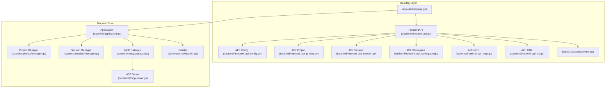
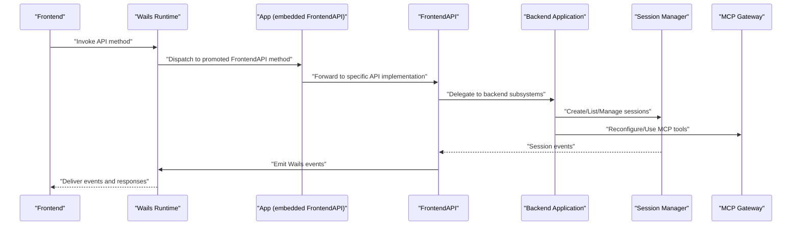
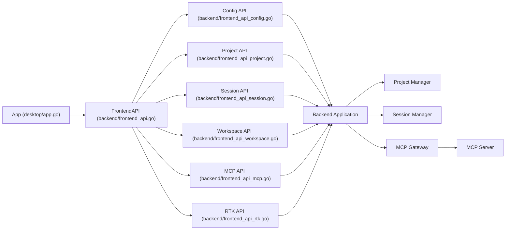

# API Reference

<cite>
**Referenced Files in This Document**
- [frontend_api.go](file://backend/frontend_api.go)
- [frontend_api_config.go](file://backend/frontend_api_config.go)
- [frontend_api_project.go](file://backend/frontend_api_project.go)
- [frontend_api_session.go](file://backend/frontend_api_session.go)
- [frontend_api_workspace.go](file://backend/frontend_api_workspace.go)
- [frontend_api_mcp.go](file://backend/frontend_api_mcp.go)
- [frontend_api_rtk.go](file://backend/frontend_api_rtk.go)
- [types.go](file://backend/types.go)
- [api_types.go](file://backend/api_types.go)
- [events.go](file://backend/events.go)
- [app.go](file://desktop/app.go)
- [startup.go](file://desktop/startup.go)
- [server.go](file://core/tools/mcp/server.go)
- [gateway.go](file://core/tools/mcp/gateway.go)
- [installer.go](file://backend/mcp/installer.go)
- [useSession.ts](file://frontend/src/hooks/useSession.ts)
- [useSessionEvents.ts](file://frontend/src/hooks/useSessionEvents.ts)
- [api.ts](file://frontend/src/constants/api.ts)
</cite>

## Update Summary
**Changes Made**
- Updated architecture overview to reflect new FrontendAPI system
- Revised API exposure pattern documentation to show embedded FrontendAPI structure
- Updated component analysis to reflect new backend architecture
- Enhanced dependency analysis with new FrontendAPI integration
- Updated troubleshooting and practical examples to match new API structure

## Table of Contents
1. [Introduction](#introduction)
2. [Project Structure](#project-structure)
3. [Core Components](#core-components)
4. [Architecture Overview](#architecture-overview)
5. [Detailed Component Analysis](#detailed-component-analysis)
6. [Dependency Analysis](#dependency-analysis)
7. [Performance Considerations](#performance-considerations)
8. [Troubleshooting Guide](#troubleshooting-guide)
9. [Conclusion](#conclusion)
10. [Appendices](#appendices)

## Introduction
This document provides comprehensive API documentation for C0WRK's desktop application interfaces. It covers configuration management, project operations, session control, workspace manipulation, and MCP protocol integration. The API has been restructured with a new backend FrontendAPI system that provides centralized access to all desktop-facing functionality. It also documents real-time event streaming via Wails events, MCP server configuration and tool schemas, practical usage examples, authentication, rate limiting considerations, error handling strategies, and debugging techniques. API versioning, backwards compatibility, and migration guidance are included.

## Project Structure
The desktop application now uses a new FrontendAPI system that centralizes all desktop-facing API methods. The App struct embeds FrontendAPI, making all backend methods directly available to the Wails frontend through promoted methods. This provides a cleaner separation between desktop presentation logic and backend business logic.

**Diagram sources**
- [app.go:14-36](file://desktop/app.go#L14-L36)
- [frontend_api.go:16-61](file://backend/frontend_api.go#L16-L61)
- [frontend_api_config.go:15-63](file://backend/frontend_api_config.go#L15-L63)
- [frontend_api_project.go:24-47](file://backend/frontend_api_project.go#L24-L47)
- [frontend_api_session.go:11-38](file://backend/frontend_api_session.go#L11-L38)
- [frontend_api_workspace.go:18-92](file://backend/frontend_api_workspace.go#L18-L92)
- [frontend_api_mcp.go:12-19](file://backend/frontend_api_mcp.go#L12-L19)
- [frontend_api_rtk.go:7-10](file://backend/frontend_api_rtk.go#L7-L10)
- [events.go:7-34](file://backend/events.go#L7-L34)
- [gateway.go:14-30](file://core/tools/mcp/gateway.go#L14-L30)
- [server.go:32-42](file://core/tools/mcp/server.go#L32-L42)
- [installer.go:24-43](file://backend/mcp/installer.go#L24-L43)

**Section sources**
- [app.go:14-36](file://desktop/app.go#L14-L36)
- [frontend_api.go:16-61](file://backend/frontend_api.go#L16-L61)
- [events.go:7-34](file://backend/events.go#L7-L34)

## Core Components
- App: Central application state holder that embeds FrontendAPI, providing direct access to all desktop-facing methods.
- FrontendAPI: Centralized API facade that manages all backend subsystems and exposes them through promoted methods to the Wails frontend.
- Configuration API: Reads and updates LLM/search/security settings, lists provider models, and manages log level.
- Project API: Creates, deletes, renames, lists projects; switches active project and wires watchers/indexing.
- Session API: Creates/deletes/relists sessions; sends messages; cancels/resumes tasks; retrieves history.
- Workspace API: File/git operations, directory listing, diffs, token usage persistence.
- MCP API: Lists MCP servers/status, tool list, updates server configs, installs codebase-memory-mcp.
- RTK API: Checks and installs RTK CLI.

**Section sources**
- [app.go:14-36](file://desktop/app.go#L14-L36)
- [frontend_api.go:16-61](file://backend/frontend_api.go#L16-L61)
- [frontend_api_config.go:15-317](file://backend/frontend_api_config.go#L15-L317)
- [frontend_api_project.go:24-320](file://backend/frontend_api_project.go#L24-L320)
- [frontend_api_session.go:11-185](file://backend/frontend_api_session.go#L11-L185)
- [frontend_api_workspace.go:18-470](file://backend/frontend_api_workspace.go#L18-L470)
- [frontend_api_mcp.go:12-235](file://backend/frontend_api_mcp.go#L12-L235)
- [frontend_api_rtk.go:7-37](file://backend/frontend_api_rtk.go#L7-L37)

## Architecture Overview
The new FrontendAPI system provides a clean separation between desktop presentation logic and backend business logic. The App struct embeds FrontendAPI, which contains all the state and methods that are exposed to the Wails frontend. This design allows for better organization and easier testing of backend functionality.

**Diagram sources**
- [startup.go:336-356](file://desktop/startup.go#L336-L356)
- [startup.go:436-721](file://desktop/startup.go#L436-L721)
- [events.go:7-34](file://backend/events.go#L7-L34)

## Detailed Component Analysis

### FrontendAPI System
The FrontendAPI serves as the central hub for all desktop-facing API methods. It embeds all necessary state and provides thread-safe access to backend subsystems through promoted methods.

Key characteristics:
- Embedded in App struct for direct Wails exposure
- Thread-safe access to configuration and backend state
- Centralized event emission through injected callback
- Resource cleanup through dedicated Cleanup method
- Context injection for backend operations

**Section sources**
- [frontend_api.go:16-168](file://backend/frontend_api.go#L16-L168)
- [app.go:14-36](file://desktop/app.go#L14-L36)

### Configuration Management API
Endpoints:
- GetConfig
  - Function signature: GetConfig() ConfigResponse
  - Parameters: none
  - Returns: ConfigResponse with sanitized provider keys and search API key
  - Errors: none (returns Loaded=false when config is uninitialized)
- UpdateLLMSettings
  - Function signature: UpdateLLMSettings(LLMSettingsRequest) error
  - Parameters: ActiveProvider, APIKey, BaseURL, Model
  - Returns: error if invalid provider or persistence fails
  - Behavior: Validates provider, updates active provider/model/API key/BaseURL, persists config, rebuilds judge/router
- UpdateSearchSettings
  - Function signature: UpdateSearchSettings(SearchSettingsRequest) error
  - Parameters: Provider, APIKey
  - Returns: error if persistence fails
  - Behavior: Updates provider/API key, persists config, rebuilds search tool
- GetSecuritySettings
  - Function signature: GetSecuritySettings() SecuritySettingsResponse
  - Parameters: none
  - Returns: DefaultPolicy and tool policies (internal tools filtered)
- UpdateSecuritySettings
  - Function signature: UpdateSecuritySettings(SecuritySettingsResponse) error
  - Parameters: DefaultPolicy, ToolPolicies (external tools only)
  - Returns: error if persistence fails
  - Behavior: Replaces policy set, applies to registry, persists config
- GetLogLevel/SetLogLevel
  - Function signature: GetLogLevel() string; SetLogLevel(level string) error
  - Parameters: level (DEBUG/INFO/WARN/ERROR)
  - Returns: current level or error for invalid level
  - Behavior: Validates level, updates runtime and config, persists
- ListProviderModels
  - Function signature: ListProviderModels(provider string) ([]string, error)
  - Parameters: provider
  - Returns: model list or error if config/app not initialized
  - Behavior: Delegates to backend builder

Data models:
- ConfigResponse, ConfigLLMResponse, ConfigProviderKeyModel, ConfigProviderFull, ConfigMemResponse, ConfigSearchResp
- LLMSettingsRequest, SearchSettingsRequest
- SecuritySettingsResponse, ToolPolicyResponse

Error conditions:
- "config not initialized" when config is nil
- "application not initialized" when app is nil
- Invalid log level validation
- Persistence failures logged as warnings

Practical usage:
- Frontend calls GetConfig on startup to populate settings UI.
- UpdateLLMSettings triggers a rebuild of judge and router.
- UpdateSecuritySettings replaces the entire policy map and updates the tool registry.

**Section sources**
- [frontend_api_config.go:15-317](file://backend/frontend_api_config.go#L15-L317)
- [startup.go:427-434](file://desktop/startup.go#L427-L434)

### Project Operations API
Endpoints:
- CreateProject
  - Function signature: CreateProject(name, externalPath string) (*project.ProjectInfo, error)
  - Parameters: name, externalPath
  - Returns: ProjectInfo or error
  - Behavior: Creates project, triggers async codebase indexing, emits project:created
- DeleteProject
  - Function signature: DeleteProject(id string) error
  - Parameters: id
  - Returns: error
  - Behavior: Clears active state if deleting active project, stops watcher, emits project:deleted
- RenameProject
  - Function signature: RenameProject(id, name string) error
  - Parameters: id, name
  - Returns: error
  - Behavior: Emits project:renamed
- ListProjects
  - Function signature: ListProjects() ([]project.ProjectInfo, error)
  - Parameters: none
  - Returns: []project.ProjectInfo or error
- SwitchProject
  - Function signature: SwitchProject(id string) error
  - Parameters: id
  - Returns: error
  - Behavior: Idempotent activation, cancels in-flight indexing, sets MCP work dir, resolves codebase project name, updates activity, recreates watcher, wires vector index callbacks, emits project:switched

Codebase-memory-mcp integration:
- triggerCodebaseIndexing: Runs codebase-memory-mcp index_repository with timeout; guarded by mutex; logs warnings on failure
- resolveCodebaseProjectName: Queries codebase-memory-mcp list_projects and caches matching project name

**Section sources**
- [frontend_api_project.go:24-320](file://backend/frontend_api_project.go#L24-L320)
- [startup.go:722-733](file://desktop/startup.go#L722-L733)

### Session Control API
Endpoints:
- CreateSession
  - Function signature: CreateSession() (*session.SessionInfo, error)
  - Parameters: none
  - Returns: SessionInfo or error
  - Behavior: Requires active project; persists to SQLite; emits error on store failure
- DeleteSession
  - Function signature: DeleteSession(id string) error
  - Parameters: id
  - Returns: error
  - Behavior: Deletes from manager if exists, always deletes from store; best-effort persistence
- ListSessions
  - Function signature: ListSessions() ([]session.SessionInfo, error)
  - Parameters: none
  - Returns: []session.SessionInfo or empty slice
- RenameSession
  - Function signature: RenameSession(id, name string) error
  - Parameters: id, name
  - Returns: error
  - Behavior: Renames in manager if exists, always renames in store; best-effort persistence
- ArchiveSession
  - Function signature: ArchiveSession(id string) error
  - Parameters: id
  - Returns: error
  - Behavior: Archives in manager if exists, toggles archived flag in store
- SendMessage
  - Function signature: SendMessage(id, text string) error
  - Parameters: id, text
  - Returns: error
  - Behavior: Updates activity, saves user message to store; delegates to manager; best-effort persistence
- CancelTask
  - Function signature: CancelTask(id string) error
  - Parameters: id
  - Returns: error
- ResumeTask
  - Function signature: ResumeTask(id string) error
  - Parameters: id
  - Returns: error
- GetSessionHistory
  - Function signature: GetSessionHistory(id string) ([]session.ChatMessage, error)
  - Parameters: id
  - Returns: []session.ChatMessage or empty slice

Real-time events:
- Session events are emitted via Wails with dynamic names: session:{sessionId}:event-type
- Frontend listens to session:{sessionId}:* and updates UI accordingly

**Section sources**
- [frontend_api_session.go:11-185](file://backend/frontend_api_session.go#L11-L185)
- [startup.go:129-134](file://desktop/startup.go#L129-L134)
- [useSessionEvents.ts:95-705](file://frontend/src/hooks/useSessionEvents.ts#L95-L705)

### Workspace Manipulation API
Endpoints:
- GetGitStatus
  - Function signature: GetGitStatus(dirPath string) (map[string]GitStatusEntry, error)
  - Parameters: dirPath
  - Returns: map of absolute file paths to status entries or error
  - Behavior: Validates path within active project; runs git status --porcelain -uall; returns empty map if not a git repo
- ReadFile
  - Function signature: ReadFile(filePath string) (string, error)
  - Parameters: filePath
  - Returns: file content or error
  - Behavior: Resolves workspace path; reads file content
- GetFileDiff
  - Function signature: GetFileDiff(filePath string) (string, error)
  - Parameters: filePath
  - Returns: unified diff or empty string
  - Behavior: Concatenates staged and unstaged diffs; generates untracked diff if needed
- ListDirectory
  - Function signature: ListDirectory(dirPath string) ([]FileNode, error)
  - Parameters: dirPath
  - Returns: []FileNode (dirs first, then files, sorted)
  - Behavior: Validates path within active project; reads directory entries
- ListDirectoryRecursive
  - Function signature: ListDirectoryRecursive(dirPath string) ([]FileNode, error)
  - Parameters: dirPath
  - Returns: []FileNode (depth-first, dirs before files)
  - Behavior: Excludes .git; respects .gitignore; filters unreadable paths
- WatchDirectory/UnwatchDirectory
  - Function signature: WatchDirectory/dirPath string) error; UnwatchDirectory(dirPath string) error
  - Parameters: dirPath
  - Returns: error if no active watcher
- GetSessionWorkspace
  - Function signature: GetSessionWorkspace(sessionID string) (string, error)
  - Parameters: sessionID
  - Returns: workspace path or error
- UpdateSessionTokens/GetSessionTokens
  - Function signature: UpdateSessionTokens(sessionID string, inputTokens, outputTokens int, model, family string) error; GetSessionTokens(sessionID string) SessionTokensResponse
  - Parameters: sessionID, token counts, model, family
  - Returns: persisted totals or zeroed response

Validation and security:
- All path operations validate that requested paths are within the active project workspace.

**Section sources**
- [frontend_api_workspace.go:18-470](file://backend/frontend_api_workspace.go#L18-L470)

### MCP Protocol Integration API
Endpoints:
- GetMCPStatus
  - Function signature: GetMCPStatus() []MCPServerStatus
  - Parameters: none
  - Returns: server connection statuses
- GetMCPServers
  - Function signature: GetMCPServers() map[string]config.MCPServerConfig
  - Parameters: none
  - Returns: deep-copied server configurations
- GetToolList
  - Function signature: GetToolList() []ToolInfo
  - Parameters: none
  - Returns: tools with metadata and effective policy (internal tools filtered)
- UpdateMCPServers
  - Function signature: UpdateMCPServers(map[string]config.MCPServerConfig) error
  - Parameters: servers map
  - Returns: error if validation fails or reconfigure fails
  - Behavior: Validates transport/command/url; persists config; hot-reconfigures gateway
- CheckCodebaseMemoryMCP
  - Function signature: CheckCodebaseMemoryMCP() CodeMemoryStatus
  - Parameters: none
  - Returns: installation status and path
- InstallCodebaseMemoryMCP
  - Function signature: InstallCodebaseMemoryMCP() error
  - Parameters: none
  - Returns: error
  - Behavior: Emits install progress events; adds MCP config entry; hot-reconfigures gateway

MCP server configuration schema:
- Transport: "stdio" | "http"
- Command/Args/Env/WorkDir for stdio
- URL/Headers for http
- Validation enforces required fields per transport

MCP gateway behavior:
- Starts servers, discovers tools, registers into tool registry
- Supports hot reconfiguration: adds/removes/updates servers
- Sanitizes tool schemas and injects project-scoped parameters for codebase-memory tools

**Section sources**
- [frontend_api_mcp.go:12-235](file://backend/frontend_api_mcp.go#L12-L235)
- [server.go:20-30](file://core/tools/mcp/server.go#L20-L30)
- [server.go:71-107](file://core/tools/mcp/server.go#L71-L107)
- [gateway.go:55-94](file://core/tools/mcp/gateway.go#L55-L94)
- [gateway.go:144-279](file://core/tools/mcp/gateway.go#L144-L279)
- [installer.go:24-43](file://backend/mcp/installer.go#L24-L43)
- [installer.go:45-179](file://backend/mcp/installer.go#L45-L179)

### RTK Integration API
Endpoints:
- CheckRtk
  - Function signature: CheckRtk() RtkStatus
  - Parameters: none
  - Returns: RTK CLI status
- InstallRtk
  - Function signature: InstallRtk() error
  - Parameters: none
  - Returns: error
  - Behavior: Emits install progress; hot-updates bash tool path; emits status

**Section sources**
- [frontend_api_rtk.go:7-37](file://backend/frontend_api_rtk.go#L7-L37)

### Real-Time Event Streaming
Wails events emitted by the backend:
- Startup/lifecycle: backend:ready, startup_error
- Projects: project:created, project:deleted, project:renamed, project:switched, workspace:tree_changed
- Sessions: sessions:loaded, session:event, session:{sessionId}:*
- Vector index: vector_index:status
- MCP/RTK: codememory:status, codememory:install-progress, rtk:status, rtk:install-progress

Frontend consumption:
- useSessionEvents subscribes to session:{sessionId}:* and updates chat/store panels
- useSessionAPI exposes CRUD and messaging methods to the UI

**Section sources**
- [events.go:7-34](file://backend/events.go#L7-L34)
- [startup.go:129-134](file://desktop/startup.go#L129-L134)
- [useSessionEvents.ts:95-705](file://frontend/src/hooks/useSessionEvents.ts#L95-L705)
- [useSession.ts:5-19](file://frontend/src/hooks/useSession.ts#L5-L19)

### Authentication and Security
- API keys are masked in configuration responses; masked sentinel is exposed to frontend.
- Security settings enforce per-tool policies and blacklist rules; internal tools are filtered from policy maps.
- Tool confirmation and on-demand judge requests are mediated via Wails events with request/response payloads.

**Section sources**
- [frontend_api_config.go:12-14](file://backend/frontend_api_config.go#L12-L14)
- [frontend_api_config.go:176-200](file://backend/frontend_api_config.go#L176-L200)
- [startup.go:436-721](file://desktop/startup.go#L436-L721)

### Rate Limiting and Concurrency
- Codebase-memory-mcp indexing is guarded by a mutex and a channel signaling completion; MCP tool execution is blocked until indexing completes.
- Git operations use timeouts for diff and status commands.
- Vector index operations support cancellation and progress callbacks.

**Section sources**
- [frontend_api_project.go:49-104](file://backend/frontend_api_project.go#L49-L104)
- [startup.go:735-765](file://desktop/startup.go#L735-L765)
- [frontend_api_workspace.go:164-208](file://backend/frontend_api_workspace.go#L164-L208)

### Error Handling Strategies
- Backend returns descriptive errors for invalid states (e.g., uninitialized subsystems).
- Frontend event handlers validate payloads and log warnings for malformed data.
- Persistence failures are logged as warnings; operations continue to minimize disruption.

**Section sources**
- [frontend_api_session.go:12-28](file://backend/frontend_api_session.go#L12-L28)
- [frontend_api_workspace.go:117-127](file://backend/frontend_api_workspace.go#L117-L127)
- [useSessionEvents.ts:436-585](file://frontend/src/hooks/useSessionEvents.ts#L436-L585)

### Debugging Techniques
- Use GetLogLevel/SetLogLevel to adjust verbosity at runtime.
- Subscribe to session:* events to observe orchestration phases, tool calls, and errors.
- Monitor vector index and MCP status events for diagnostics.

**Section sources**
- [frontend_api_config.go:247-268](file://backend/frontend_api_config.go#L247-L268)
- [events.go:24-34](file://backend/events.go#L24-L34)

### API Versioning, Backwards Compatibility, and Migration
- Configuration loading returns migration flags and messages; UI displays migration status and errors.
- MCP gateway supports hot reconfiguration without restarting the backend.
- Provider model listing adapts to provider-specific capabilities.

**Section sources**
- [frontend_api_config.go:16-26](file://backend/frontend_api_config.go#L16-L26)
- [frontend_api_config.go:290-317](file://backend/frontend_api_config.go#L290-L317)
- [gateway.go:144-279](file://core/tools/mcp/gateway.go#L144-L279)

## Dependency Analysis

**Diagram sources**
- [app.go:14-36](file://desktop/app.go#L14-L36)
- [frontend_api.go:16-61](file://backend/frontend_api.go#L16-L61)
- [frontend_api_config.go:15-317](file://backend/frontend_api_config.go#L15-L317)
- [frontend_api_project.go:24-320](file://backend/frontend_api_project.go#L24-L320)
- [frontend_api_session.go:11-185](file://backend/frontend_api_session.go#L11-L185)
- [frontend_api_workspace.go:18-470](file://backend/frontend_api_workspace.go#L18-L470)
- [frontend_api_mcp.go:12-235](file://backend/frontend_api_mcp.go#L12-L235)
- [frontend_api_rtk.go:7-37](file://backend/frontend_api_rtk.go#L7-L37)
- [gateway.go:14-30](file://core/tools/mcp/gateway.go#L14-L30)
- [server.go:32-42](file://core/tools/mcp/server.go#L32-L42)

**Section sources**
- [app.go:14-36](file://desktop/app.go#L14-L36)
- [frontend_api.go:16-61](file://backend/frontend_api.go#L16-L61)
- [gateway.go:14-30](file://core/tools/mcp/gateway.go#L14-L30)

## Performance Considerations
- Asynchronous indexing and vector search operations are non-blocking and best-effort to avoid UI stalls.
- Git operations use buffered scanning and minimal subprocess invocations.
- MCP server connections are reused; hot reconfiguration minimizes downtime.
- Token usage is persisted incrementally to reduce I/O overhead.
- FrontendAPI provides thread-safe access patterns to prevent race conditions.

## Troubleshooting Guide
Common issues and resolutions:
- No active project when creating sessions: Ensure SwitchProject is called before CreateSession.
- MCP tool blocked during indexing: Wait for codebase-memory-mcp indexing to complete; the UI emits service messages indicating wait state.
- Git not available or not a repository: GetGitStatus returns empty status; ensure git is installed and the workspace is a repository.
- Persistence failures: Errors are logged as warnings; restart the app to retry.
- FrontendAPI initialization failures: Check that all required backend subsystems are properly initialized before constructing FrontendAPI.

**Section sources**
- [frontend_api_session.go:12-28](file://backend/frontend_api_session.go#L12-L28)
- [startup.go:735-765](file://desktop/startup.go#L735-L765)
- [frontend_api_workspace.go:39-113](file://backend/frontend_api_workspace.go#L39-L113)

## Conclusion
C0WRK's desktop API has been successfully restructured around the new FrontendAPI system, providing a cleaner separation between desktop presentation logic and backend business logic. The centralized FrontendAPI approach improves maintainability, testability, and provides a more organized foundation for future feature development. The API continues to provide comprehensive coverage for configuration, project management, session orchestration, workspace operations, and MCP tool integration with robust real-time event streaming and error handling.

## Appendices

### Practical Examples

- Configure LLM provider and model:
  - Call UpdateLLMSettings with ActiveProvider, Model, and optional APIKey/BaseURL depending on provider.
  - Observe backend:ready and session:* events for status updates.

- Manage a project:
  - CreateProject -> SwitchProject -> ListSessions -> SendMessage -> CancelTask/ResumeTask.

- Integrate MCP tools:
  - UpdateMCPServers with stdio/http transport and credentials -> GetToolList -> Invoke tools via session messages.

- Workspace operations:
  - ListDirectoryRecursive -> GetFileDiff -> UpdateSessionTokens.

- RTK integration:
  - InstallRtk -> CheckRtk -> Hot-update bash tool path.

**Section sources**
- [frontend_api_config.go:138-220](file://backend/frontend_api_config.go#L138-L220)
- [frontend_api_project.go:24-320](file://backend/frontend_api_project.go#L24-L320)
- [frontend_api_session.go:11-185](file://backend/frontend_api_session.go#L11-L185)
- [frontend_api_workspace.go:18-470](file://backend/frontend_api_workspace.go#L18-L470)
- [frontend_api_mcp.go:122-174](file://backend/frontend_api_mcp.go#L122-L174)
- [frontend_api_rtk.go:14-37](file://backend/frontend_api_rtk.go#L14-L37)

### Frontend Integration Notes
- useSessionAPI maps directly to App methods for session operations.
- useSessionEvents subscribes to session:{sessionId}:* and updates chat and panel stores.
- FrontendAPI promotes all backend methods directly to the Wails frontend interface.

**Section sources**
- [useSession.ts:5-19](file://frontend/src/hooks/useSession.ts#L5-L19)
- [useSessionEvents.ts:95-705](file://frontend/src/hooks/useSessionEvents.ts#L95-L705)
- [api.ts:1-3](file://frontend/src/constants/api.ts#L1-L3)