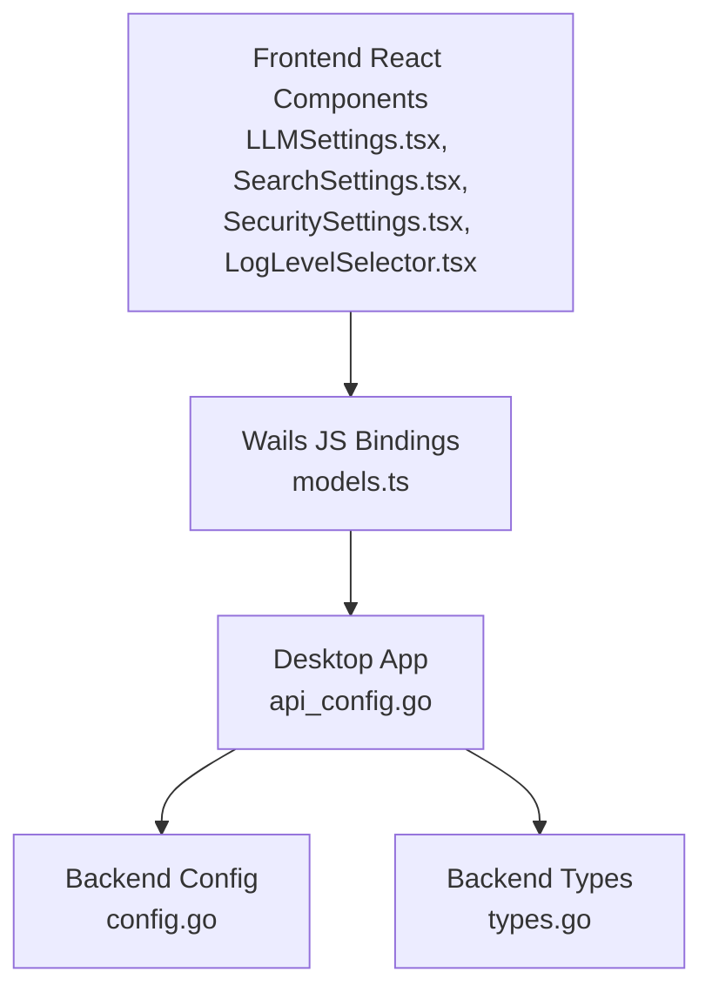
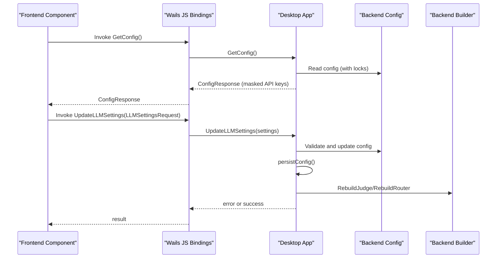
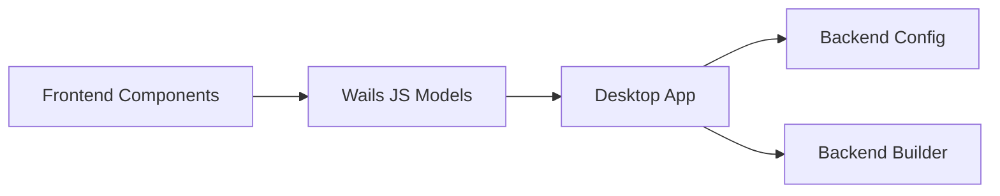

# Desktop API

<cite>
**Referenced Files in This Document**
- [api_config.go](file://desktop/api_config.go)
- [app.go](file://desktop/app.go)
- [config.go](file://backend/config/config.go)
- [types.go](file://backend/types.go)
- [LLMSettings.tsx](file://frontend/src/components/settings/LLMSettings.tsx)
- [SearchSettings.tsx](file://frontend/src/components/settings/SearchSettings.tsx)
- [SecuritySettings.tsx](file://frontend/src/components/settings/SecuritySettings.tsx)
- [LogLevelSelector.tsx](file://frontend/src/components/settings/LogLevelSelector.tsx)
- [models.ts](file://frontend/wailsjs/go/models.ts)
- [api.ts](file://frontend/src/constants/api.ts)
</cite>

## Table of Contents
1. [Introduction](#introduction)
2. [Project Structure](#project-structure)
3. [Core Components](#core-components)
4. [Architecture Overview](#architecture-overview)
5. [Detailed Component Analysis](#detailed-component-analysis)
6. [Dependency Analysis](#dependency-analysis)
7. [Performance Considerations](#performance-considerations)
8. [Troubleshooting Guide](#troubleshooting-guide)
9. [Conclusion](#conclusion)

## Introduction
This document provides comprehensive API documentation for C0WRK’s Desktop configuration management endpoints. It covers the configuration endpoints exposed by the desktop application and consumed by the frontend, including:
- GetConfig
- UpdateLLMSettings
- UpdateSearchSettings
- GetSecuritySettings
- UpdateSecuritySettings
- GetLogLevel
- SetLogLevel
- ListProviderModels

It specifies function signatures, parameter types, return values, and error conditions. It also documents the configuration data models used by the API and provides practical examples of how the frontend communicates with these endpoints, authentication methods, response schemas, rate limiting considerations, error handling strategies, and debugging techniques.

## Project Structure
The Desktop API resides in the desktop package and is invoked by the frontend through Wails bindings. The backend configuration types and validation live under backend/config. The frontend components call the desktop API methods and pass strongly-typed request objects generated from Wails models.

**Diagram sources**
- [api_config.go:1-390](file://desktop/api_config.go#L1-L390)
- [models.ts:1-427](file://frontend/wailsjs/go/models.ts#L1-L427)
- [config.go:18-408](file://backend/config/config.go#L18-L408)
- [types.go:1-160](file://backend/types.go#L1-L160)

**Section sources**
- [api_config.go:1-390](file://desktop/api_config.go#L1-L390)
- [models.ts:1-427](file://frontend/wailsjs/go/models.ts#L1-L427)
- [config.go:18-408](file://backend/config/config.go#L18-L408)
- [types.go:1-160](file://backend/types.go#L1-L160)

## Core Components
- Desktop App: Exposes configuration management methods to the frontend. It manages configuration state, persists changes, and rebuilds backend components when settings change.
- Backend Config: Defines configuration structures, validation rules, and provider constraints.
- Frontend Components: Consume the Desktop API via Wails bindings, manage UI state, and present configuration forms.

Key responsibilities:
- GetConfig: Returns sanitized configuration to the UI.
- UpdateLLMSettings: Updates active provider, model, and credentials; persists and rebuilds backend components.
- UpdateSearchSettings: Updates search provider and API key; persists and rebuilds search tool.
- GetSecuritySettings: Returns security policies excluding internal tools.
- UpdateSecuritySettings: Updates default policy and per-tool policies; persists and applies to the tool registry.
- GetLogLevel/SetLogLevel: Dynamic log level management.
- ListProviderModels: Lists available models for a provider.

**Section sources**
- [api_config.go:88-361](file://desktop/api_config.go#L88-L361)
- [config.go:18-408](file://backend/config/config.go#L18-L408)
- [types.go:84-85](file://backend/types.go#L84-L85)

## Architecture Overview
The Desktop API is a thin wrapper around backend configuration and orchestration. The frontend calls Wails-bound methods, which operate on the desktop App state and delegate to backend builders and stores as needed.

**Diagram sources**
- [api_config.go:88-220](file://desktop/api_config.go#L88-L220)
- [models.ts:162-179](file://frontend/wailsjs/go/models.ts#L162-L179)
- [config.go:313-354](file://backend/config/config.go#L313-L354)

## Detailed Component Analysis

### GetConfig
- Purpose: Retrieve the current configuration with sensitive values masked.
- Function signature (Go):
  - Receiver: App
  - Method: GetConfig()
  - Return: ConfigResponse
- Parameters: None
- Return value:
  - ConfigResponse with Loaded=true and sanitized provider credentials.
  - API keys are masked except when environment variable references are detected.
- Error conditions:
  - Returns default ConfigResponse{Loaded: false} if config is uninitialized.
- Frontend usage:
  - Called on component mount to populate LLM and Search settings forms.
  - Uses masked sentinel value to avoid displaying raw keys.

Response schema (ConfigResponse):
- loaded: boolean
- log_level: string
- config_migrated: boolean
- config_migration_msg: string
- config_errors: string[]
- llm: ConfigLLMResponse
- memory: ConfigMemResponse
- search: ConfigSearchResp

LLM sub-models:
- ConfigLLMResponse: active_provider, anthropic, gemini, lmstudio, openai_compatible, chatgpt
- ConfigProviderKeyModel: api_key, model
- ConfigProviderFull: base_url, api_key, model
- ConfigMemResponse: database
- ConfigSearchResp: provider, api_key

**Section sources**
- [api_config.go:88-136](file://desktop/api_config.go#L88-L136)
- [api_config.go:17-61](file://desktop/api_config.go#L17-L61)
- [models.ts:101-144](file://frontend/wailsjs/go/models.ts#L101-L144)
- [LLMSettings.tsx:43-67](file://frontend/src/components/settings/LLMSettings.tsx#L43-L67)
- [SearchSettings.tsx:37-53](file://frontend/src/components/settings/SearchSettings.tsx#L37-L53)

### UpdateLLMSettings
- Purpose: Update active provider, model, and credentials for the active provider.
- Function signature (Go):
  - Receiver: App
  - Method: UpdateLLMSettings(settings LLMSettingsRequest) error
  - Parameters: LLMSettingsRequest
  - Return: error
- Request schema (LLMSettingsRequest):
  - active_provider: string
  - api_key: string
  - base_url: string
  - model: string
- Behavior:
  - Validates active_provider against supported providers.
  - Updates the active provider and corresponding provider fields.
  - Persists configuration to disk.
  - Clears config load errors.
  - Rebuilds judge and router via backend builder.
- Error conditions:
  - Returns error if config is uninitialized.
  - Returns error if active_provider is invalid.
  - Persist failures are logged but do not fail the operation.
- Frontend usage:
  - Debounced saving while editing provider configs.
  - Calls ListProviderModels after updating credentials to refresh model list.

**Section sources**
- [api_config.go:138-220](file://desktop/api_config.go#L138-L220)
- [models.ts:162-179](file://frontend/wailsjs/go/models.ts#L162-L179)
- [LLMSettings.tsx:117-133](file://frontend/src/components/settings/LLMSettings.tsx#L117-L133)
- [config.go:264-271](file://backend/config/config.go#L264-L271)

### UpdateSearchSettings
- Purpose: Update search provider and API key.
- Function signature (Go):
  - Receiver: App
  - Method: UpdateSearchSettings(settings SearchSettingsRequest) error
  - Parameters: SearchSettingsRequest
  - Return: error
- Request schema (SearchSettingsRequest):
  - provider: string
  - api_key: string
- Behavior:
  - Updates provider and API key (masked sentinel is ignored).
  - Persists configuration.
  - Rebuilds web search tool via backend builder.
- Error conditions:
  - Returns error if config is uninitialized.
- Frontend usage:
  - Debounced saving with masked sentinel handling.

**Section sources**
- [api_config.go:222-247](file://desktop/api_config.go#L222-L247)
- [models.ts:180-193](file://frontend/wailsjs/go/models.ts#L180-L193)
- [SearchSettings.tsx:55-69](file://frontend/src/components/settings/SearchSettings.tsx#L55-L69)

### GetSecuritySettings
- Purpose: Retrieve current security settings for the UI, excluding internal tools.
- Function signature (Go):
  - Receiver: App
  - Method: GetSecuritySettings() SecuritySettingsResponse
  - Parameters: None
  - Return: SecuritySettingsResponse
- Response schema (SecuritySettingsResponse):
  - default_policy: string
  - tool_policies: map[string]ToolPolicyResponse
- Behavior:
  - Filters out internal tools from the returned policy map.
  - Returns default policy if config is uninitialized.
- Frontend usage:
  - Loads security settings and tool list to render policy controls.

**Section sources**
- [api_config.go:249-273](file://desktop/api_config.go#L249-L273)
- [models.ts:208-239](file://frontend/wailsjs/go/models.ts#L208-L239)
- [types.go:84-85](file://backend/types.go#L84-L85)
- [SecuritySettings.tsx:71-86](file://frontend/src/components/settings/SecuritySettings.tsx#L71-L86)

### UpdateSecuritySettings
- Purpose: Update security policies at runtime.
- Function signature (Go):
  - Receiver: App
  - Method: UpdateSecuritySettings(settings SecuritySettingsResponse) error
  - Parameters: SecuritySettingsResponse
  - Return: error
- Request schema (SecuritySettingsResponse):
  - default_policy: string
  - tool_policies: map[string]ToolPolicyResponse
- Behavior:
  - Replaces the full policy set; ignores internal tools.
  - Applies policies to the shared tool registry via backend builder.
  - Persists configuration.
- Error conditions:
  - Returns error if config is uninitialized.
- Frontend usage:
  - Sends complete policy map; handles blacklist patterns for supported tools.

**Section sources**
- [api_config.go:275-311](file://desktop/api_config.go#L275-L311)
- [models.ts:208-239](file://frontend/wailsjs/go/models.ts#L208-L239)
- [SecuritySettings.tsx:109-127](file://frontend/src/components/settings/SecuritySettings.tsx#L109-L127)

### GetLogLevel / SetLogLevel
- Purpose: Dynamically query and set the log level.
- Function signatures (Go):
  - GetLogLevel() string
  - SetLogLevel(level string) error
- Behavior:
  - GetLogLevel returns current log level.
  - SetLogLevel validates level against allowed values and updates both runtime and persisted config.
- Allowed values: DEBUG, INFO, WARN, ERROR
- Error conditions:
  - SetLogLevel returns error for invalid log level.

**Section sources**
- [api_config.go:313-341](file://desktop/api_config.go#L313-L341)
- [LogLevelSelector.tsx:26-43](file://frontend/src/components/settings/LogLevelSelector.tsx#L26-L43)

### ListProviderModels
- Purpose: List available model names for a given provider.
- Function signature (Go):
  - Receiver: App
  - Method: ListProviderModels(provider string) ([]string, error)
  - Parameters: provider string
  - Return: []string, error
- Behavior:
  - Delegates to backend builder to list models.
  - Requires initialized config and application.
- Error conditions:
  - Returns error if config or application is uninitialized.

**Section sources**
- [api_config.go:343-361](file://desktop/api_config.go#L343-L361)
- [LLMSettings.tsx:95-114](file://frontend/src/components/settings/LLMSettings.tsx#L95-L114)

## Dependency Analysis
- Desktop App depends on backend configuration types and builder to rebuild components after settings changes.
- Frontend components depend on Wails-generated models to construct typed requests.
- Validation and provider constraints are enforced in backend config.

**Diagram sources**
- [api_config.go:1-390](file://desktop/api_config.go#L1-L390)
- [models.ts:1-427](file://frontend/wailsjs/go/models.ts#L1-L427)
- [config.go:18-408](file://backend/config/config.go#L18-L408)

**Section sources**
- [api_config.go:1-390](file://desktop/api_config.go#L1-L390)
- [models.ts:1-427](file://frontend/wailsjs/go/models.ts#L1-L427)
- [config.go:18-408](file://backend/config/config.go#L18-L408)

## Performance Considerations
- Debouncing: Frontend components debounce updates to reduce unnecessary API calls (e.g., LLMSettings.tsx and SearchSettings.tsx).
- Locking: Desktop App uses read-write locks to protect configuration during reads and writes.
- Persistence: Configuration is saved atomically to minimize corruption risk.
- Rebuilding: Updating LLM or security settings triggers backend rebuilds; avoid frequent rapid changes to minimize overhead.

[No sources needed since this section provides general guidance]

## Troubleshooting Guide
Common issues and resolutions:
- Invalid provider name: UpdateLLMSettings returns an error if active_provider is not in the supported set.
- Uninitialized config: Methods return errors or default responses when config is nil.
- Masked API keys: Frontend uses a sentinel value to avoid displaying raw keys; sending the sentinel preserves existing values.
- Log level validation: SetLogLevel rejects unsupported levels.
- Persistence failures: Errors during persistConfig are logged but do not fail the operation.

Frontend debugging tips:
- Inspect network logs for Wails calls.
- Verify masked sentinel handling in frontend components.
- Use console logging to capture errors from API calls.

**Section sources**
- [api_config.go:143-151](file://desktop/api_config.go#L143-L151)
- [api_config.go:325-340](file://desktop/api_config.go#L325-L340)
- [api.ts:1-3](file://frontend/src/constants/api.ts#L1-L3)
- [LLMSettings.tsx:129-131](file://frontend/src/components/settings/LLMSettings.tsx#L129-L131)
- [SearchSettings.tsx:63-67](file://frontend/src/components/settings/SearchSettings.tsx#L63-L67)

## Conclusion
C0WRK’s Desktop API provides a clean, typed interface for managing configuration across LLM providers, search settings, security policies, and logging. The frontend integrates with these endpoints through Wails bindings, using debounced updates and masked sentinel values to ensure a smooth user experience. Backend validation and persistence guarantees help maintain a reliable configuration state.