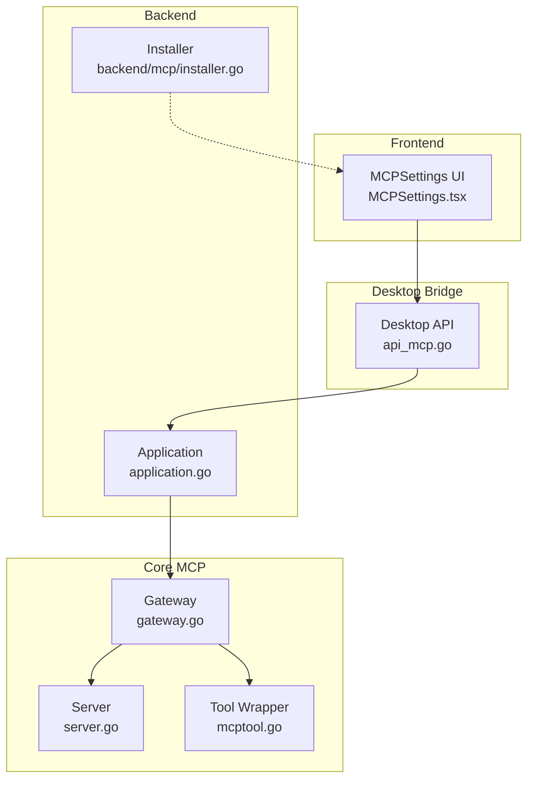
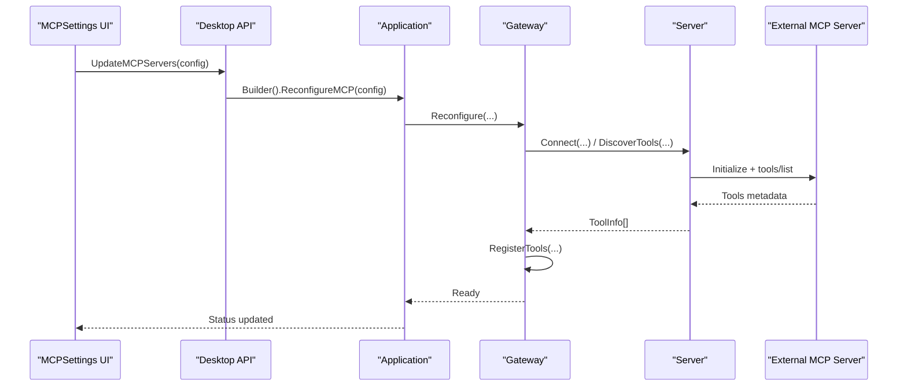
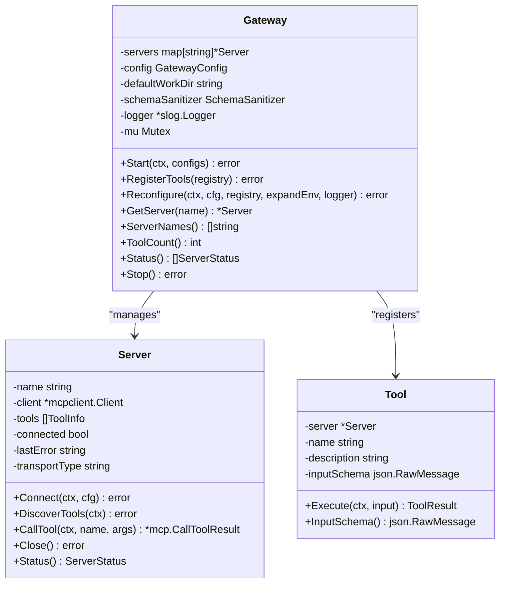
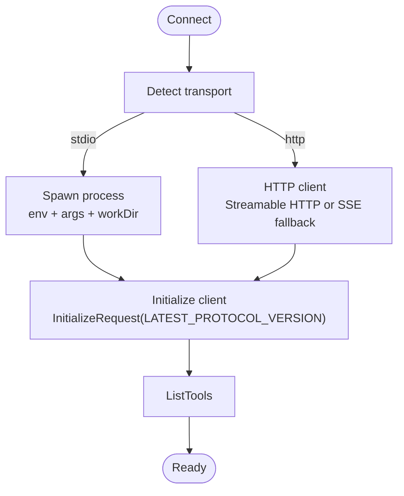
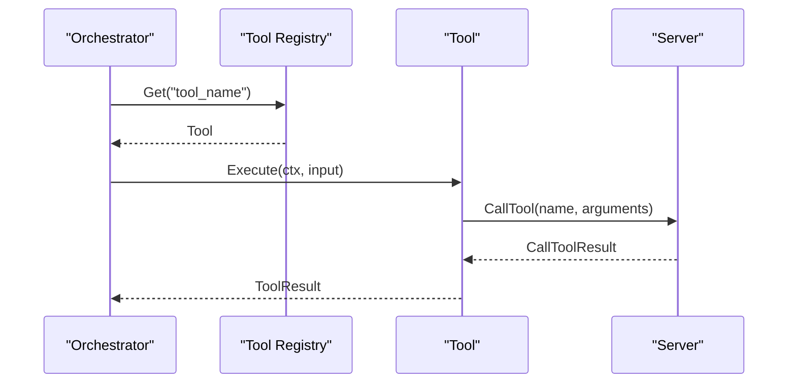
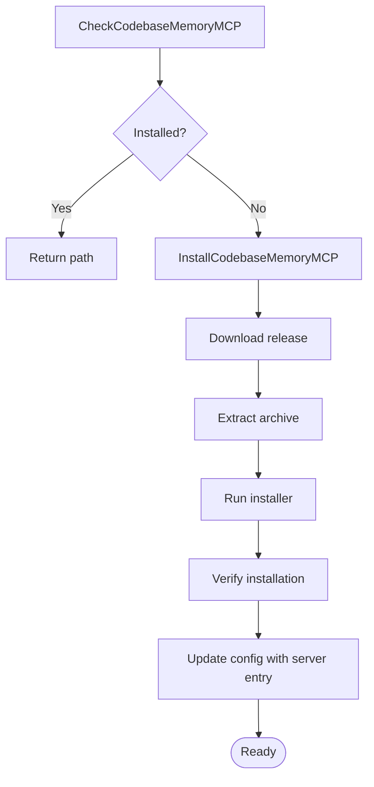
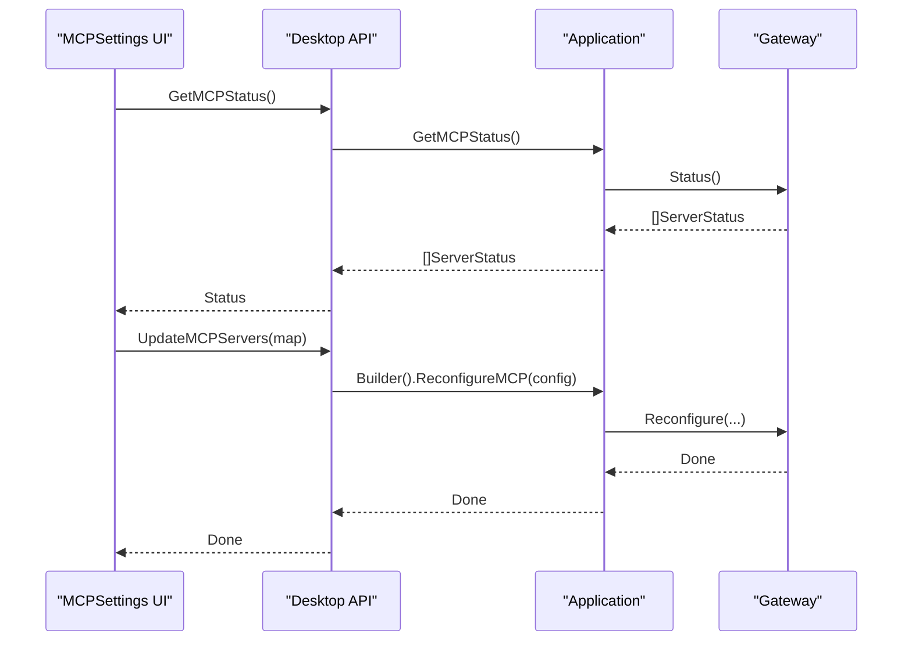
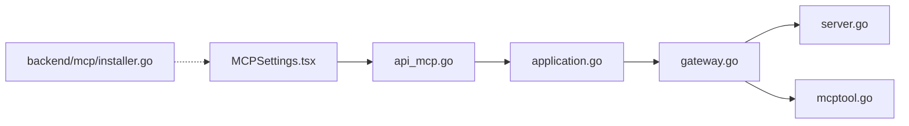

# MCP Protocol

<cite>
**Referenced Files in This Document**
- [gateway.go](file://core/tools/mcp/gateway.go)
- [server.go](file://core/tools/mcp/server.go)
- [mcptool.go](file://core/tools/mcp/mcptool.go)
- [installer.go](file://backend/mcp/installer.go)
- [api_mcp.go](file://desktop/api_mcp.go)
- [application.go](file://backend/application.go)
- [config.example.yaml](file://config.example.yaml)
- [MCPSettings.tsx](file://frontend/src/components/settings/MCPSettings.tsx)
- [gateway_test.go](file://core/tools/mcp/gateway_test.go)
- [server_test.go](file://core/tools/mcp/server_test.go)
- [mcptool_test.go](file://core/tools/mcp/mcptool_test.go)
</cite>

## Table of Contents
1. [Introduction](#introduction)
2. [Project Structure](#project-structure)
3. [Core Components](#core-components)
4. [Architecture Overview](#architecture-overview)
5. [Detailed Component Analysis](#detailed-component-analysis)
6. [Dependency Analysis](#dependency-analysis)
7. [Performance Considerations](#performance-considerations)
8. [Troubleshooting Guide](#troubleshooting-guide)
9. [Conclusion](#conclusion)
10. [Appendices](#appendices)

## Introduction
This document provides comprehensive API documentation for C0WRK’s Model Context Protocol (MCP) integration. It covers the MCP server interface, connection handling, message formats, and protocol specifications for external tool integration. It documents the MCP gateway that bridges external tools with the C0WRK orchestrator, including configuration, authentication, error handling, and practical setup examples. It also addresses protocol versioning, backwards compatibility, migration guidance, and debugging techniques.

## Project Structure
C0WRK implements MCP integration across three layers:
- Core MCP integration: server connection, tool discovery, and proxying
- Backend bridge: desktop API and application integration
- Frontend UI: MCP server configuration and status display

**Diagram sources**
- [MCPSettings.tsx:1-100](file://frontend/src/components/settings/MCPSettings.tsx#L1-100)
- [api_mcp.go:1-120](file://desktop/api_mcp.go#L1-120)
- [application.go:182-211](file://backend/application.go#L182-L211)
- [gateway.go:14-94](file://core/tools/mcp/gateway.go#L14-L94)
- [server.go:32-107](file://core/tools/mcp/server.go#L32-L107)
- [mcptool.go:16-107](file://core/tools/mcp/mcptool.go#L16-L107)
- [installer.go:30-43](file://backend/mcp/installer.go#L30-L43)

**Section sources**
- [MCPSettings.tsx:1-100](file://frontend/src/components/settings/MCPSettings.tsx#L1-100)
- [api_mcp.go:1-120](file://desktop/api_mcp.go#L1-120)
- [application.go:182-211](file://backend/application.go#L182-L211)
- [gateway.go:14-94](file://core/tools/mcp/gateway.go#L14-L94)
- [server.go:32-107](file://core/tools/mcp/server.go#L32-L107)
- [mcptool.go:16-107](file://core/tools/mcp/mcptool.go#L16-L107)
- [installer.go:30-43](file://backend/mcp/installer.go#L30-L43)

## Core Components
- Gateway: Manages multiple MCP server connections, discovery, registration, and lifecycle.
- Server: Encapsulates a single MCP server connection supporting stdio and HTTP transports.
- Tool: Wraps MCP tools as C0WRK tools with schema sanitization and execution.
- Installer: Provides utilities to detect and install MCP tooling binaries (e.g., codebase-memory-mcp).
- Desktop API: Exposes MCP status, tool lists, and configuration updates to the UI.
- Application: Integrates the MCP gateway into the orchestrator builder and exposes status.

Key responsibilities:
- Connection management and protocol initialization
- Tool discovery and registration into the shared tool registry
- Transport selection (stdio vs HTTP) with fallback
- Schema sanitization to hide auto-injected parameters
- Error propagation and graceful degradation

**Section sources**
- [gateway.go:14-94](file://core/tools/mcp/gateway.go#L14-L94)
- [server.go:32-107](file://core/tools/mcp/server.go#L32-L107)
- [mcptool.go:16-107](file://core/tools/mcp/mcptool.go#L16-L107)
- [installer.go:30-43](file://backend/mcp/installer.go#L30-L43)
- [api_mcp.go:23-120](file://desktop/api_mcp.go#L23-L120)
- [application.go:182-211](file://backend/application.go#L182-L211)

## Architecture Overview
The MCP integration follows a layered design:
- UI triggers configuration updates
- Desktop API validates and persists configuration
- Backend builder reconfigures the MCP gateway
- Gateway connects to servers, discovers tools, and registers them
- Tools are invoked by the orchestrator and return results to the UI

**Diagram sources**
- [api_mcp.go:122-174](file://desktop/api_mcp.go#L122-L174)
- [application.go:182-189](file://backend/application.go#L182-L189)
- [gateway.go:144-279](file://core/tools/mcp/gateway.go#L144-L279)
- [server.go:71-107](file://core/tools/mcp/server.go#L71-L107)
- [server.go:219-262](file://core/tools/mcp/server.go#L219-L262)

## Detailed Component Analysis

### Gateway
The Gateway manages multiple MCP servers, supports hot-reconfiguration, and registers discovered tools into the shared tool registry. It tracks server status, tool counts, and last errors.

Key behaviors:
- Start: Connects to all configured servers, discovers tools, and logs failures per server
- RegisterTools: Wraps each tool and registers with source attribution
- Reconfigure: Adds/removes/updates servers while preserving unchanged connections
- Status: Returns deterministic server status snapshots
- Stop: Gracefully closes all connections

**Diagram sources**
- [gateway.go:14-94](file://core/tools/mcp/gateway.go#L14-L94)
- [server.go:32-107](file://core/tools/mcp/server.go#L32-L107)
- [mcptool.go:16-107](file://core/tools/mcp/mcptool.go#L16-L107)

**Section sources**
- [gateway.go:55-142](file://core/tools/mcp/gateway.go#L55-L142)
- [gateway.go:144-279](file://core/tools/mcp/gateway.go#L144-L279)
- [gateway.go:328-376](file://core/tools/mcp/gateway.go#L328-L376)

### Server
The Server encapsulates a single MCP connection. It supports:
- stdio transport: spawn process with environment, args, and optional working directory
- HTTP transport: Streamable HTTP with SSE fallback
- Protocol initialization with latest MCP version
- Tool discovery via tools/list
- Tool invocation via tools/call

**Diagram sources**
- [server.go:71-107](file://core/tools/mcp/server.go#L71-L107)
- [server.go:147-190](file://core/tools/mcp/server.go#L147-L190)
- [server.go:192-217](file://core/tools/mcp/server.go#L192-L217)
- [server.go:219-262](file://core/tools/mcp/server.go#L219-L262)

**Section sources**
- [server.go:71-107](file://core/tools/mcp/server.go#L71-L107)
- [server.go:147-190](file://core/tools/mcp/server.go#L147-L190)
- [server.go:192-217](file://core/tools/mcp/server.go#L192-L217)
- [server.go:219-262](file://core/tools/mcp/server.go#L219-L262)

### Tool Wrapper
The Tool wrapper adapts MCP tools to the C0WRK tool interface:
- Implements tools.Tool and tools.ToolJudger
- Applies schema sanitization to hide auto-injected parameters
- Executes tools via Server.CallTool and converts results to ToolResult
- Delegates judgment to the LLM (conservative default)

**Diagram sources**
- [mcptool.go:129-150](file://core/tools/mcp/mcptool.go#L129-L150)
- [server.go:275-293](file://core/tools/mcp/server.go#L275-L293)

**Section sources**
- [mcptool.go:16-107](file://core/tools/mcp/mcptool.go#L16-L107)
- [mcptool.go:129-150](file://core/tools/mcp/mcptool.go#L129-L150)
- [mcptool.go:152-186](file://core/tools/mcp/mcptool.go#L152-L186)

### Installer
The Installer provides utilities to manage MCP tooling binaries:
- CheckCodebaseMemoryMCP: detects presence and path
- InstallCodebaseMemoryMCP: downloads, extracts, runs installer, and updates config
- EnsureAutoIndex: toggles auto-index configuration for codebase-memory-mcp

**Diagram sources**
- [installer.go:30-43](file://backend/mcp/installer.go#L30-L43)
- [installer.go:45-179](file://backend/mcp/installer.go#L45-L179)
- [installer.go:181-245](file://backend/mcp/installer.go#L181-L245)

**Section sources**
- [installer.go:30-43](file://backend/mcp/installer.go#L30-L43)
- [installer.go:45-179](file://backend/mcp/installer.go#L45-L179)
- [installer.go:181-245](file://backend/mcp/installer.go#L181-L245)

### Desktop API and UI
The Desktop API exposes:
- GetMCPStatus: server connection status
- GetMCPServers: current MCP server configurations
- UpdateMCPServers: validates and hot-reconfigures the gateway
- Tool list with source and policy
- Installer controls for codebase-memory-mcp

The UI provides:
- Server list with status, transport, and tool counts
- Form to add/edit servers (stdio/http)
- Environment variables and HTTP headers editor
- Installer progress and error handling

**Diagram sources**
- [api_mcp.go:23-120](file://desktop/api_mcp.go#L23-L120)
- [api_mcp.go:122-174](file://desktop/api_mcp.go#L122-L174)
- [application.go:182-189](file://backend/application.go#L182-L189)
- [gateway.go:144-279](file://core/tools/mcp/gateway.go#L144-L279)

**Section sources**
- [api_mcp.go:23-120](file://desktop/api_mcp.go#L23-L120)
- [api_mcp.go:122-174](file://desktop/api_mcp.go#L122-L174)
- [MCPSettings.tsx:124-142](file://frontend/src/components/settings/MCPSettings.tsx#L124-L142)
- [MCPSettings.tsx:176-244](file://frontend/src/components/settings/MCPSettings.tsx#L176-L244)

## Dependency Analysis
- Gateway depends on Server and Tool wrappers
- Server depends on the MCP client library for transport and protocol
- Tool depends on Server and schema sanitization
- Desktop API depends on Application and configuration
- Installer provides optional tooling support

**Diagram sources**
- [MCPSettings.tsx:1-100](file://frontend/src/components/settings/MCPSettings.tsx#L1-100)
- [api_mcp.go:1-120](file://desktop/api_mcp.go#L1-120)
- [application.go:182-211](file://backend/application.go#L182-L211)
- [gateway.go:14-94](file://core/tools/mcp/gateway.go#L14-L94)
- [server.go:32-107](file://core/tools/mcp/server.go#L32-L107)
- [mcptool.go:16-107](file://core/tools/mcp/mcptool.go#L16-L107)
- [installer.go:30-43](file://backend/mcp/installer.go#L30-L43)

**Section sources**
- [gateway.go:14-94](file://core/tools/mcp/gateway.go#L14-L94)
- [server.go:32-107](file://core/tools/mcp/server.go#L32-L107)
- [mcptool.go:16-107](file://core/tools/mcp/mcptool.go#L16-L107)
- [api_mcp.go:1-120](file://desktop/api_mcp.go#L1-120)
- [application.go:182-211](file://backend/application.go#L182-L211)
- [installer.go:30-43](file://backend/mcp/installer.go#L30-L43)

## Performance Considerations
- Transport choice: HTTP with Streamable HTTP reduces overhead; fallback to SSE ensures compatibility
- Connection reuse: Gateway preserves unchanged connections during Reconfigure to minimize restarts
- Tool discovery caching: Tools are cached per server; avoid frequent re-discovery
- Schema sanitization cost: Applied once per tool registration; keep sanitizers efficient
- Concurrency: Gateway operations are guarded by mutex; avoid long-held locks in custom sanitizers

[No sources needed since this section provides general guidance]

## Troubleshooting Guide
Common issues and resolutions:
- Unsupported transport type: Ensure transport is "stdio" or "http"
- HTTP URL missing or invalid: Provide a reachable URL; fallback to SSE is automatic
- Initialization failures: Verify protocol version compatibility and server readiness
- Tool call failures: Inspect ToolResult.IsError and content; check server logs
- Gateway start errors: Review per-server errors aggregated in StartError
- Gateway reconfigure errors: Inspect ReconfigureError for operation-specific failures

Validation and tests:
- Transport validation and error messages are covered in unit tests
- Tool execution error handling and schema sanitization are validated in tests

**Section sources**
- [server_test.go:185-240](file://core/tools/mcp/server_test.go#L185-L240)
- [gateway_test.go:237-281](file://core/tools/mcp/gateway_test.go#L237-L281)
- [mcptool_test.go:32-72](file://core/tools/mcp/mcptool_test.go#L32-L72)

## Conclusion
C0WRK’s MCP integration provides a robust, configurable, and user-friendly way to connect external MCP servers, discover tools, and integrate them into the orchestrator. The Gateway offers hot-reconfiguration, schema sanitization, and clear status reporting. The Desktop API and UI streamline configuration and monitoring. Installer utilities simplify adoption of MCP tooling. Together, these components deliver a production-ready MCP experience with strong error handling and debugging support.

[No sources needed since this section summarizes without analyzing specific files]

## Appendices

### MCP Protocol Versioning and Backwards Compatibility
- The Server initializes with the latest MCP protocol version supported by the client library
- HTTP transport tries Streamable HTTP first, falling back to SSE if initialization fails
- Backward compatibility is maintained by attempting SSE fallback automatically

**Section sources**
- [server.go:192-217](file://core/tools/mcp/server.go#L192-L217)
- [server.go:147-190](file://core/tools/mcp/server.go#L147-L190)

### Practical Setup Examples
- Configure stdio server: define transport, command, args, env, and optional workDir
- Configure HTTP server: define transport and URL with optional headers
- Hot-reconfigure: update servers via UI; backend applies changes without restart
- Installer integration: use installer to add codebase-memory-mcp as an MCP server

**Section sources**
- [config.example.yaml:55-65](file://config.example.yaml#L55-L65)
- [api_mcp.go:122-174](file://desktop/api_mcp.go#L122-L174)
- [MCPSettings.tsx:176-244](file://frontend/src/components/settings/MCPSettings.tsx#L176-L244)
- [installer.go:45-179](file://backend/mcp/installer.go#L45-L179)

### Request/Response Schemas and Authentication
- Initialize request includes protocol version, client info, and capabilities
- Tools listing returns tool metadata (name, description, input schema)
- Tool execution returns content and structured content; errors surfaced via ToolResult
- Authentication: stdio uses environment variables; HTTP supports custom headers

**Section sources**
- [server.go:192-217](file://core/tools/mcp/server.go#L192-L217)
- [server.go:219-262](file://core/tools/mcp/server.go#L219-L262)
- [server.go:275-293](file://core/tools/mcp/server.go#L275-L293)