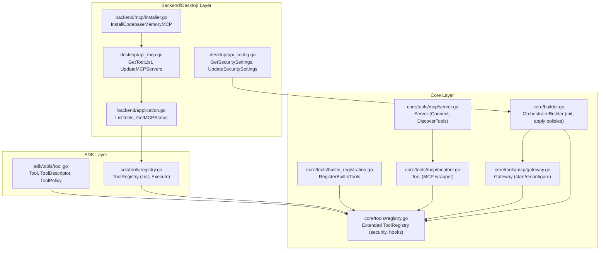
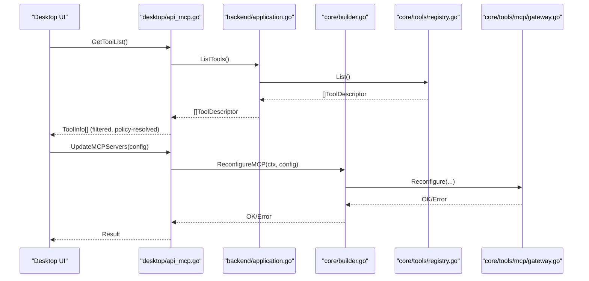
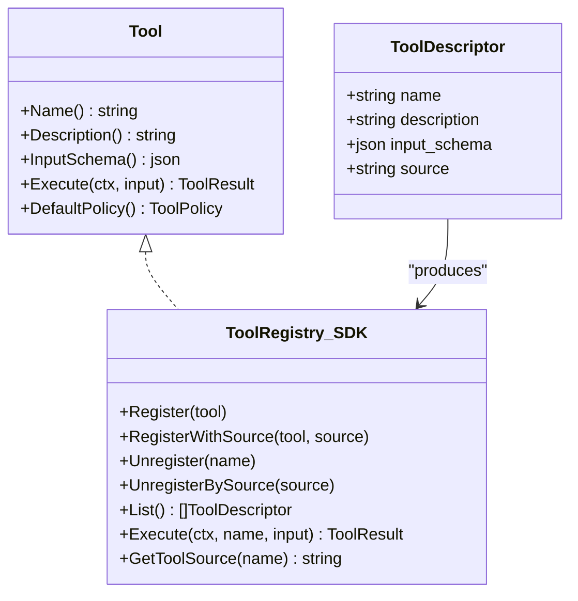
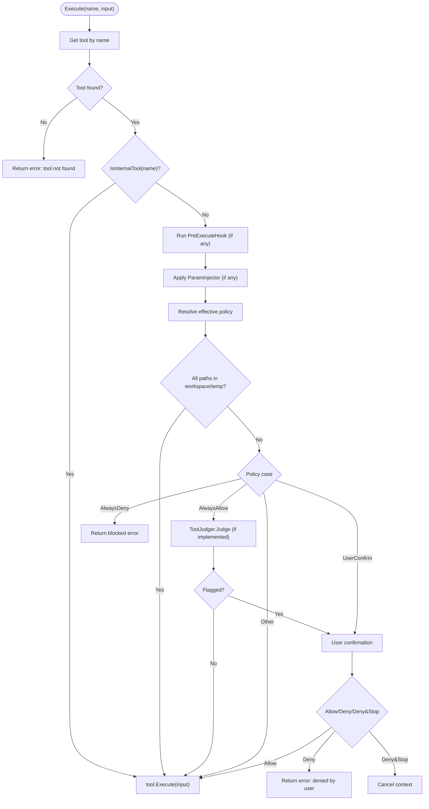
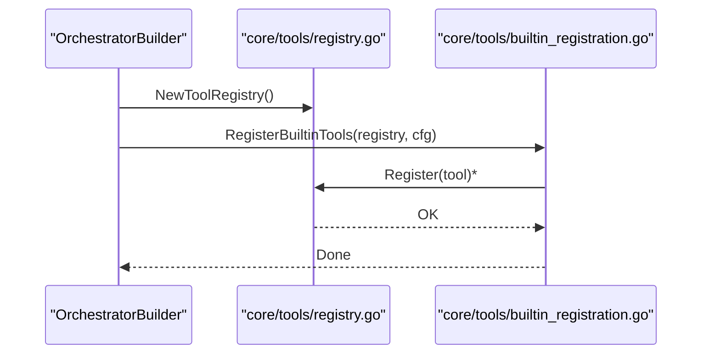
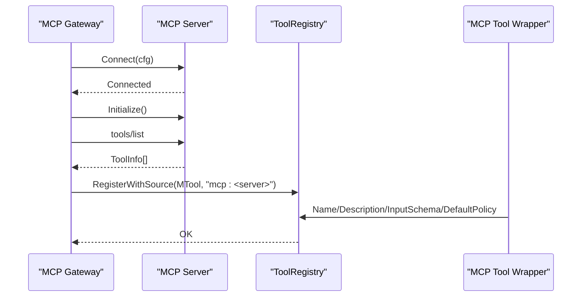
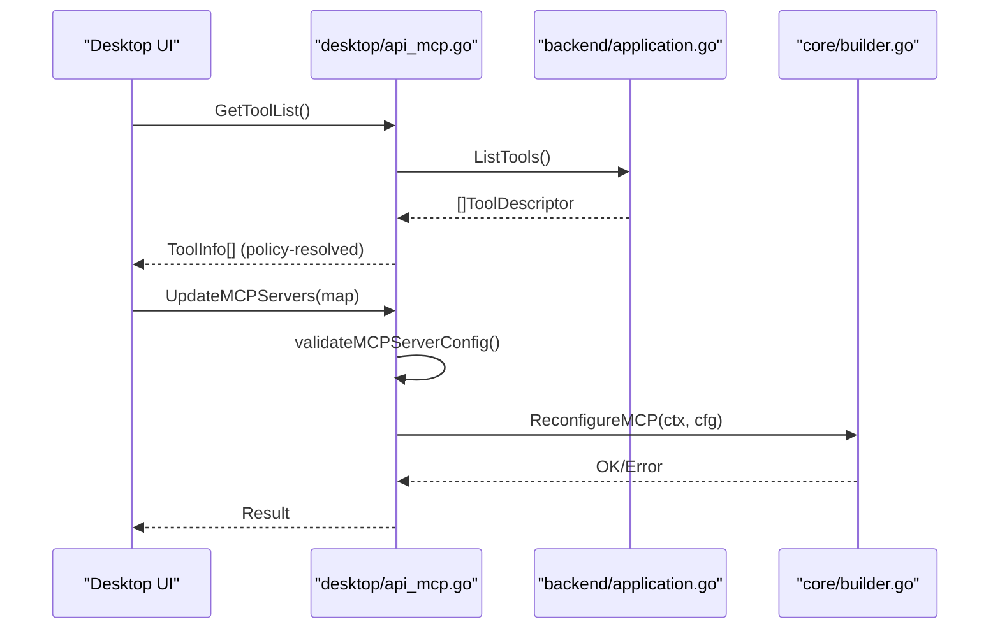
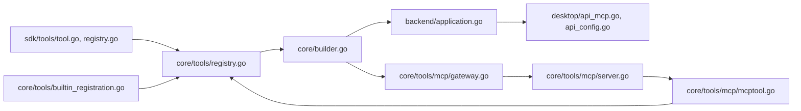

# Tool Registration API

<cite>
**Referenced Files in This Document**
- [registry.go](file://sdk/tools/registry.go)
- [tool.go](file://sdk/tools/tool.go)
- [registry.go](file://core/tools/registry.go)
- [tool.go](file://core/tools/tool.go)
- [builtin_registration.go](file://core/tools/builtin_registration.go)
- [mcptool.go](file://core/tools/mcp/mcptool.go)
- [server.go](file://core/tools/mcp/server.go)
- [gateway.go](file://core/tools/mcp/gateway.go)
- [builder.go](file://core/builder.go)
- [application.go](file://backend/application.go)
- [api_mcp.go](file://desktop/api_mcp.go)
- [api_config.go](file://desktop/api_config.go)
- [installer.go](file://backend/mcp/installer.go)
</cite>

## Table of Contents
1. [Introduction](#introduction)
2. [Project Structure](#project-structure)
3. [Core Components](#core-components)
4. [Architecture Overview](#architecture-overview)
5. [Detailed Component Analysis](#detailed-component-analysis)
6. [Dependency Analysis](#dependency-analysis)
7. [Performance Considerations](#performance-considerations)
8. [Troubleshooting Guide](#troubleshooting-guide)
9. [Conclusion](#conclusion)
10. [Appendices](#appendices)

## Introduction
This document provides comprehensive API documentation for C0WRK’s tool registration and management system. It covers:
- Tool registry endpoints for discovery, registration, unregistration, and lifecycle management
- Tool descriptor schemas and metadata
- Security policies and enforcement
- Practical examples for built-in and custom MCP tool registration
- Integration patterns with the orchestrator and desktop UI

The system centers around a unified Tool interface and a shared ToolRegistry that enforces security policies, supports user confirmation, and integrates with both built-in tools and MCP servers.

## Project Structure
The tool registration system spans three layers:
- SDK layer: Defines the Tool interface, ToolDescriptor, ToolRegistry, and core types
- Core layer: Extends the SDK registry with security policies, judge integration, and MCP gateway integration
- Backend/Desktop layer: Exposes APIs for tool listing, policy management, MCP server configuration, and runtime updates

**Diagram sources**
- [registry.go:11-117](file://sdk/tools/registry.go#L11-L117)
- [tool.go:22-91](file://sdk/tools/tool.go#L22-L91)
- [registry.go:35-276](file://core/tools/registry.go#L35-L276)
- [builtin_registration.go:53-101](file://core/tools/builtin_registration.go#L53-L101)
- [server.go:32-262](file://core/tools/mcp/server.go#L32-L262)
- [mcptool.go:16-219](file://core/tools/mcp/mcptool.go#L16-L219)
- [gateway.go:1-200](file://core/tools/mcp/gateway.go#L1-L200)
- [builder.go:50-93](file://core/builder.go#L50-L93)
- [application.go:191-238](file://backend/application.go#L191-L238)
- [api_mcp.go:68-174](file://desktop/api_mcp.go#L68-L174)
- [api_config.go:249-311](file://desktop/api_config.go#L249-L311)
- [installer.go:45-179](file://backend/mcp/installer.go#L45-L179)

**Section sources**
- [registry.go:11-117](file://sdk/tools/registry.go#L11-L117)
- [registry.go:35-276](file://core/tools/registry.go#L35-L276)
- [builder.go:50-93](file://core/builder.go#L50-L93)
- [application.go:191-238](file://backend/application.go#L191-L238)
- [api_mcp.go:68-174](file://desktop/api_mcp.go#L68-L174)
- [api_config.go:249-311](file://desktop/api_config.go#L249-L311)
- [installer.go:45-179](file://backend/mcp/installer.go#L45-L179)

## Core Components
- ToolDescriptor: Metadata describing a tool (name, description, input schema, source)
- Tool: Unified interface for tool execution with default policy
- ToolRegistry (SDK): Stores tools, lists descriptors, executes without policy
- ToolRegistry (Core): Adds security policies, judge, confirmation, hooks, filters, param injection
- Built-in tool registration: Centralized registration of file ops, bash, web search, ask_user, vector search, etc.
- MCP integration: Server discovery, tool wrapping, gateway management, and runtime reconfiguration

Key responsibilities:
- Discovery: List descriptors from the registry
- Registration: Register built-in tools and MCP tools; filter and sanitize schemas
- Unregistration: Remove tools by name or by source
- Lifecycle: Hot-reload MCP servers, update security policies, rebuild judge/router

**Section sources**
- [tool.go:37-91](file://sdk/tools/tool.go#L37-L91)
- [registry.go:70-117](file://sdk/tools/registry.go#L70-L117)
- [registry.go:35-276](file://core/tools/registry.go#L35-L276)
- [builtin_registration.go:53-101](file://core/tools/builtin_registration.go#L53-L101)
- [mcptool.go:16-219](file://core/tools/mcp/mcptool.go#L16-L219)
- [server.go:219-262](file://core/tools/mcp/server.go#L219-L262)
- [gateway.go:1-200](file://core/tools/mcp/gateway.go#L1-L200)

## Architecture Overview
The orchestrator builder constructs the shared tool registry, MCP gateway, and judge. The desktop exposes APIs to list tools, manage MCP servers, and adjust security policies. The backend application bridges the builder and desktop.

**Diagram sources**
- [api_mcp.go:68-174](file://desktop/api_mcp.go#L68-L174)
- [application.go:191-238](file://backend/application.go#L191-L238)
- [builder.go:233-251](file://core/builder.go#L233-L251)
- [registry.go:70-117](file://core/tools/registry.go#L70-L117)

## Detailed Component Analysis

### Tool Descriptor and Metadata
- ToolDescriptor fields: name, description, input_schema, source
- Source indicates origin: "core" for built-ins, "mcp:<server>" for MCP tools
- Input schema is a JSON schema describing tool parameters

**Diagram sources**
- [tool.go:37-91](file://sdk/tools/tool.go#L37-L91)
- [registry.go:11-117](file://sdk/tools/registry.go#L11-L117)

**Section sources**
- [tool.go:37-91](file://sdk/tools/tool.go#L37-L91)
- [registry.go:70-117](file://sdk/tools/registry.go#L70-L117)

### Tool Security Policies and Enforcement
- Policies: always_allow, always_deny, user_confirm
- Effective policy resolution: per-tool override > registry default > tool default
- Internal tools bypass all checks
- Workspace/temp auto-approval for scoped paths
- Judge integration for always_allow tools
- Confirmation flow for user_confirm and judge-flagged calls

**Diagram sources**
- [registry.go:164-276](file://core/tools/registry.go#L164-L276)

**Section sources**
- [registry.go:150-276](file://core/tools/registry.go#L150-L276)
- [tool.go:44-87](file://core/tools/tool.go#L44-L87)

### Built-in Tool Registration
- Centralized via RegisterBuiltinTools with BuiltinToolsConfig
- Includes file operations, bash, web fetch/search, glob/ripgrep, step outputs, facts, vector search, ask_user
- Optional tools gated by callbacks or providers

**Diagram sources**
- [builtin_registration.go:53-101](file://core/tools/builtin_registration.go#L53-L101)
- [registry.go:27-48](file://core/tools/registry.go#L27-L48)

**Section sources**
- [builtin_registration.go:25-101](file://core/tools/builtin_registration.go#L25-L101)

### MCP Tool Registration and Lifecycle
- Server discovery: Connect -> Initialize -> tools/list -> store ToolInfo
- Tool wrapping: NewTool(server, ToolInfo) with optional schema sanitizers
- Gateway: StartGateway, Reconfigure, Stop
- Runtime updates: UpdateMCPServers hot-reloads gateway

**Diagram sources**
- [server.go:71-262](file://core/tools/mcp/server.go#L71-L262)
- [mcptool.go:91-127](file://core/tools/mcp/mcptool.go#L91-L127)
- [gateway.go:1-200](file://core/tools/mcp/gateway.go#L1-L200)

**Section sources**
- [server.go:71-262](file://core/tools/mcp/server.go#L71-L262)
- [mcptool.go:91-127](file://core/tools/mcp/mcptool.go#L91-L127)
- [gateway.go:1-200](file://core/tools/mcp/gateway.go#L1-L200)

### Desktop API Endpoints for Tool Management
- GetToolList: Returns filtered list of tools with effective policy
- UpdateMCPServers: Validates and hot-reloads MCP gateway
- GetMCPStatus: Server connection statuses
- GetSecuritySettings / UpdateSecuritySettings: Manage default and per-tool policies
- InstallCodebaseMemoryMCP: Installs and configures MCP server

**Diagram sources**
- [api_mcp.go:68-174](file://desktop/api_mcp.go#L68-L174)
- [application.go:191-238](file://backend/application.go#L191-L238)
- [builder.go:233-251](file://core/builder.go#L233-L251)

**Section sources**
- [api_mcp.go:68-174](file://desktop/api_mcp.go#L68-L174)
- [api_config.go:249-311](file://desktop/api_config.go#L249-L311)
- [application.go:182-238](file://backend/application.go#L182-L238)
- [installer.go:45-179](file://backend/mcp/installer.go#L45-L179)

## Dependency Analysis
- Core ToolRegistry depends on SDK ToolRegistry and adds:
  - ToolFilter, ParamInjector, PreExecuteHook
  - ToolJudge, confirmation callbacks
  - Policy resolution and enforcement
- OrchestratorBuilder composes:
  - Shared ToolRegistry
  - MCP Gateway
  - Tool judge and router
  - Applies security policies from config
- Desktop APIs depend on Backend Application to:
  - List tools and MCP status
  - Update MCP servers and security settings
  - Install MCP binaries

**Diagram sources**
- [tool.go:22-91](file://sdk/tools/tool.go#L22-L91)
- [registry.go:35-276](file://core/tools/registry.go#L35-L276)
- [builder.go:50-93](file://core/builder.go#L50-L93)
- [application.go:191-238](file://backend/application.go#L191-L238)
- [api_mcp.go:68-174](file://desktop/api_mcp.go#L68-L174)
- [api_config.go:249-311](file://desktop/api_config.go#L249-L311)
- [server.go:32-262](file://core/tools/mcp/server.go#L32-L262)
- [mcptool.go:16-219](file://core/tools/mcp/mcptool.go#L16-L219)
- [gateway.go:1-200](file://core/tools/mcp/gateway.go#L1-L200)
- [builtin_registration.go:53-101](file://core/tools/builtin_registration.go#L53-L101)

**Section sources**
- [registry.go:35-276](file://core/tools/registry.go#L35-L276)
- [builder.go:50-93](file://core/builder.go#L50-L93)
- [application.go:191-238](file://backend/application.go#L191-L238)
- [api_mcp.go:68-174](file://desktop/api_mcp.go#L68-L174)
- [api_config.go:249-311](file://desktop/api_config.go#L249-L311)

## Performance Considerations
- Registry operations are thread-safe with RWMutex; keep critical sections small
- Policy resolution and judge evaluation add overhead; cache where appropriate
- MCP server connections: prefer HTTP fallback and reuse clients
- Schema sanitization occurs once per tool registration; minimize repeated transformations
- PreExecuteHook and ParamInjector should be lightweight to avoid blocking execution

## Troubleshooting Guide
Common issues and resolutions:
- Tool not found during execution: Verify tool name and registration source
- MCP server not connected: Check transport config (stdio/http), URL, headers, working directory
- Policy blocked execution: Adjust default or per-tool policy; ensure workspace/temp paths are recognized for auto-approval
- Judge not available: Ensure LLM provider is configured; rebuild judge after settings changes
- Installation failures: Use InstallCodebaseMemoryMCP and verify binary path; ensure environment variables and permissions are correct

Operational checks:
- Use GetMCPStatus to inspect server connectivity and tool counts
- Use GetToolList to confirm effective policies and sources
- Use UpdateSecuritySettings to apply policy changes at runtime

**Section sources**
- [application.go:182-238](file://backend/application.go#L182-L238)
- [api_mcp.go:23-174](file://desktop/api_mcp.go#L23-L174)
- [api_config.go:249-311](file://desktop/api_config.go#L249-L311)
- [installer.go:45-179](file://backend/mcp/installer.go#L45-L179)

## Conclusion
C0WRK’s tool registration system provides a robust, secure, and extensible framework for managing both built-in and MCP tools. The unified Tool interface, shared registry with policy enforcement, and MCP gateway enable dynamic tool discovery and lifecycle management. The desktop APIs expose these capabilities to users for configuration, monitoring, and runtime updates.

## Appendices

### Tool Descriptor Schema
- Fields: name, description, input_schema, source
- Example usage: Returned by List() and GetToolList()

**Section sources**
- [tool.go:37-91](file://sdk/tools/tool.go#L37-L91)
- [registry.go:70-117](file://sdk/tools/registry.go#L70-L117)
- [api_mcp.go:68-100](file://desktop/api_mcp.go#L68-L100)

### Security Policy Enforcement Mechanisms
- Policy resolution order and enforcement logic
- Internal tools bypass checks
- Workspace/temp auto-approval
- Judge integration and confirmation flow

**Section sources**
- [registry.go:150-276](file://core/tools/registry.go#L150-L276)
- [tool.go:44-87](file://core/tools/tool.go#L44-L87)

### Built-in Tool Registration Patterns
- Centralized registration with BuiltinToolsConfig
- Optional tools gated by callbacks/providers

**Section sources**
- [builtin_registration.go:25-101](file://core/tools/builtin_registration.go#L25-L101)

### Custom MCP Tool Integration Patterns
- Define ServerConfig, connect and discover tools
- Wrap tools with NewTool and optional schema sanitizers
- Register with source "mcp:<server>"
- Hot-reconfigure gateway via UpdateMCPServers

**Section sources**
- [server.go:20-30](file://core/tools/mcp/server.go#L20-L30)
- [server.go:71-262](file://core/tools/mcp/server.go#L71-L262)
- [mcptool.go:91-127](file://core/tools/mcp/mcptool.go#L91-L127)
- [gateway.go:1-200](file://core/tools/mcp/gateway.go#L1-L200)
- [api_mcp.go:122-174](file://desktop/api_mcp.go#L122-L174)

### Practical Examples
- Built-in tool registration: See RegisterBuiltinTools for file ops, bash, web search, ask_user, vector search
- MCP tool registration: Connect server, discover tools, wrap with NewTool, register with source
- Policy management: UpdateSecuritySettings to change default or per-tool policies
- MCP installation: InstallCodebaseMemoryMCP and configure server entry

**Section sources**
- [builtin_registration.go:53-101](file://core/tools/builtin_registration.go#L53-L101)
- [server.go:71-262](file://core/tools/mcp/server.go#L71-L262)
- [mcptool.go:91-127](file://core/tools/mcp/mcptool.go#L91-L127)
- [api_config.go:275-311](file://desktop/api_config.go#L275-L311)
- [installer.go:45-179](file://backend/mcp/installer.go#L45-L179)