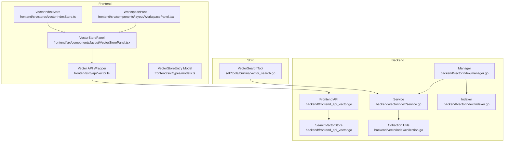
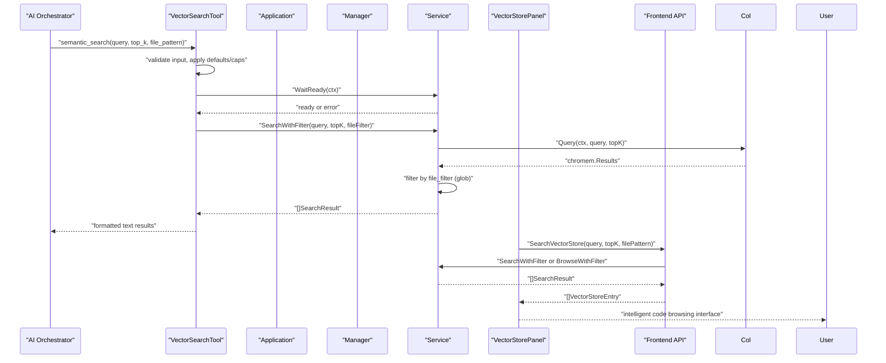
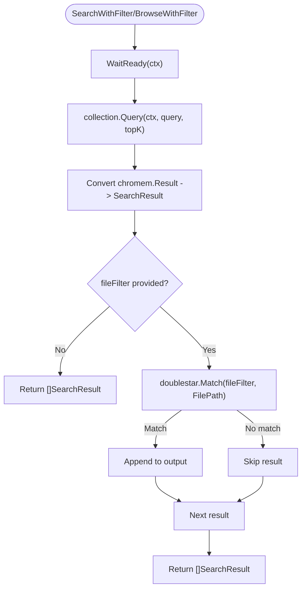
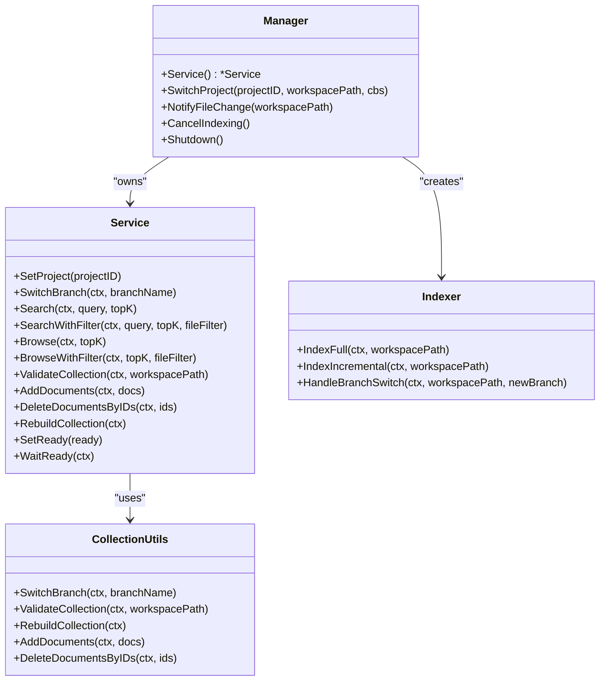
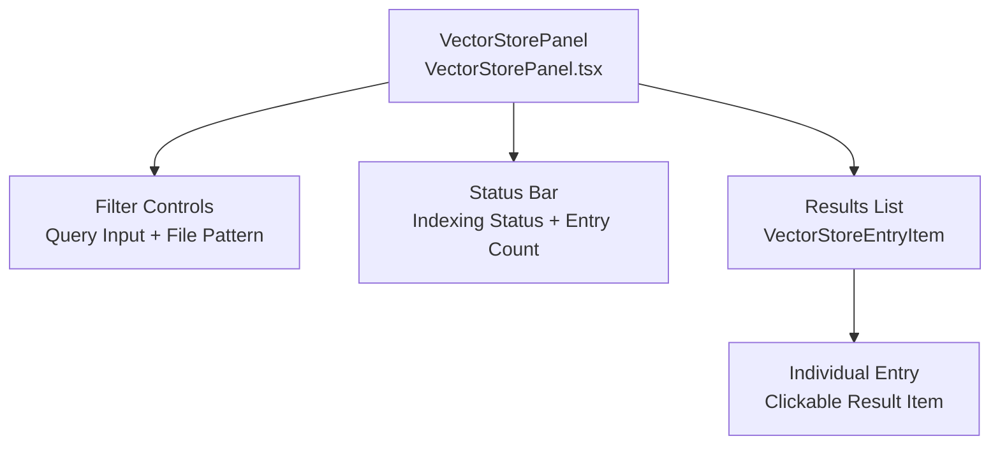
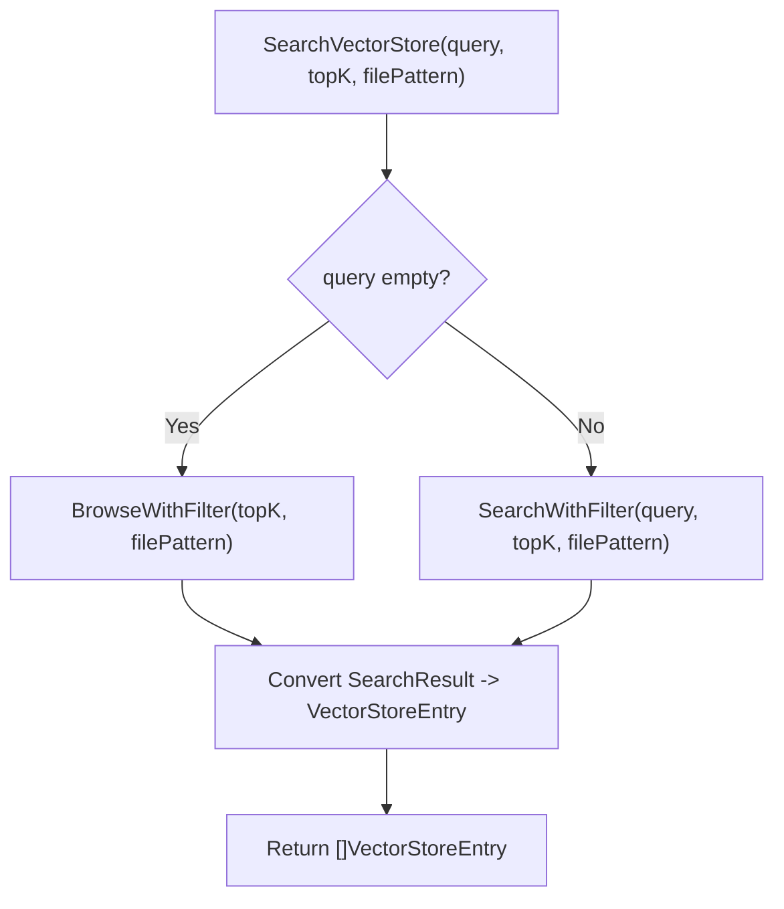
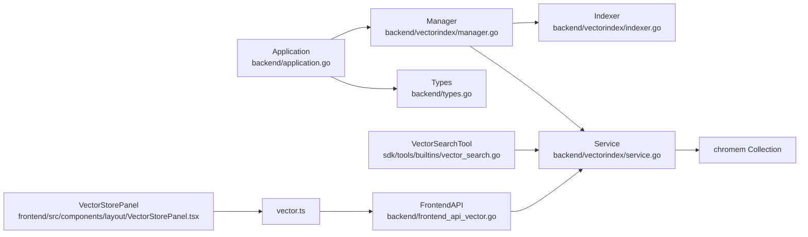

# Vector Search API

<cite>
**Referenced Files in This Document**
- [service.go](file://backend/vectorindex/service.go)
- [search_result.go](file://backend/vectorindex/search_result.go)
- [indexer.go](file://backend/vectorindex/indexer.go)
- [collection.go](file://backend/vectorindex/collection.go)
- [manager.go](file://backend/vectorindex/manager.go)
- [vector_search.go](file://sdk/tools/builtins/vector_search.go)
- [types.go](file://backend/types.go)
- [application.go](file://backend/application.go)
- [vectorIndexStore.ts](file://frontend/src/stores/vectorIndexStore.ts)
- [VectorStorePanel.tsx](file://frontend/src/components/layout/VectorStorePanel.tsx)
- [frontend_api_vector.go](file://backend/frontend_api_vector.go)
- [vector.ts](file://frontend/src/api/vector.ts)
- [models.ts](file://frontend/src/types/models.ts)
- [WorkspacePanel.tsx](file://frontend/src/components/layout/WorkspacePanel.tsx)
</cite>

## Update Summary
**Changes Made**
- Added new VectorStorePanel interface for intelligent code browsing
- Enhanced vector search capabilities with BrowseWithFilter functionality
- Integrated intelligent code browsing into workspace panel
- Added VectorStoreEntry data model for frontend representation
- Updated search API to support both semantic search and browsing modes

## Table of Contents
1. [Introduction](#introduction)
2. [Project Structure](#project-structure)
3. [Core Components](#core-components)
4. [Architecture Overview](#architecture-overview)
5. [Detailed Component Analysis](#detailed-component-analysis)
6. [New VectorStorePanel Interface](#new-vectorstorepanel-interface)
7. [Enhanced Vector Search Capabilities](#enhanced-vector-search-capabilities)
8. [Dependency Analysis](#dependency-analysis)
9. [Performance Considerations](#performance-considerations)
10. [Troubleshooting Guide](#troubleshooting-guide)
11. [Conclusion](#conclusion)
12. [Appendices](#appendices)

## Introduction
This document provides comprehensive API documentation for C0WRK's vector-based semantic search functionality. It covers the vector search endpoints, query processing, result ranking, and result formatting. The system now includes an intelligent code browsing interface through the VectorStorePanel, enabling both semantic search and arbitrary browsing of vectorized code chunks. It also documents the VectorSearchResult and VectorStoreEntry data models, search configuration options, optimization techniques, performance tuning, index maintenance, and troubleshooting. Practical examples demonstrate semantic search queries, result filtering, and integration patterns with the AI orchestrator.

## Project Structure
The vector search capability spans three layers with enhanced UI integration:
- Backend vector index service and indexer with browsing capabilities
- SDK tool definition and orchestration integration
- Frontend UI state for index status and intelligent browsing interface

**Diagram sources**
- [manager.go:31-90](file://backend/vectorindex/manager.go#L31-L90)
- [service.go:32-46](file://backend/vectorindex/service.go#L32-L46)
- [indexer.go:61-70](file://backend/vectorindex/indexer.go#L61-L70)
- [collection.go:31-55](file://backend/vectorindex/collection.go#L31-L55)
- [frontend_api_vector.go:11-54](file://backend/frontend_api_vector.go#L11-L54)
- [vector_search.go:32-37](file://sdk/tools/builtins/vector_search.go#L32-L37)
- [vectorIndexStore.ts:1-56](file://frontend/src/stores/vectorIndexStore.ts#L1-L56)
- [VectorStorePanel.tsx:17-183](file://frontend/src/components/layout/VectorStorePanel.tsx#L17-L183)
- [WorkspacePanel.tsx:7-46](file://frontend/src/components/layout/WorkspacePanel.tsx#L7-L46)
- [vector.ts:7-15](file://frontend/src/api/vector.ts#L7-L15)
- [models.ts:59-67](file://frontend/src/types/models.ts#L59-L67)

**Section sources**
- [manager.go:31-90](file://backend/vectorindex/manager.go#L31-L90)
- [service.go:32-46](file://backend/vectorindex/service.go#L32-L46)
- [indexer.go:61-70](file://backend/vectorindex/indexer.go#L61-L70)
- [collection.go:31-55](file://backend/vectorindex/collection.go#L31-L55)
- [frontend_api_vector.go:11-54](file://backend/frontend_api_vector.go#L11-L54)
- [vector_search.go:32-37](file://sdk/tools/builtins/vector_search.go#L32-L37)
- [vectorIndexStore.ts:1-56](file://frontend/src/stores/vectorIndexStore.ts#L1-L56)
- [VectorStorePanel.tsx:17-183](file://frontend/src/components/layout/VectorStorePanel.tsx#L17-L183)
- [WorkspacePanel.tsx:7-46](file://frontend/src/components/layout/WorkspacePanel.tsx#L7-L46)
- [vector.ts:7-15](file://frontend/src/api/vector.ts#L7-L15)
- [models.ts:59-67](file://frontend/src/types/models.ts#L59-L67)

## Core Components
- VectorSearchTool: Defines the semantic_search tool, input schema, defaults, and result formatting.
- Service: Provides vector search over a chromem-go collection, supports readiness gating, optional file-filtering, and browsing capabilities.
- Indexer: Builds and maintains the vector index from project files, with full and incremental modes.
- Manager: Lifecycle manager for embedder, service, indexer, and git branch monitoring.
- VectorIndexStore: Frontend state for index status and progress.
- **New**: VectorStorePanel: Intelligent code browsing interface with semantic search and file filtering capabilities.
- **New**: VectorStoreEntry: Frontend data model for vector store entries.

Key responsibilities:
- Query processing: Embedding query, collection lookup, similarity scoring.
- Result ranking: Similarity scores from chromem-go.
- Filtering: Optional glob-based file filtering.
- Formatting: Human-readable result summaries with path, line range, score, language, and content preview.
- **New**: Browsing: Arbitrary chunk enumeration without semantic ordering for code exploration.

**Section sources**
- [vector_search.go:14-85](file://sdk/tools/builtins/vector_search.go#L14-L85)
- [service.go:100-143](file://backend/vectorindex/service.go#L100-L143)
- [indexer.go:105-163](file://backend/vectorindex/indexer.go#L105-L163)
- [manager.go:97-212](file://backend/vectorindex/manager.go#L97-L212)
- [vectorIndexStore.ts:1-56](file://frontend/src/stores/vectorIndexStore.ts#L1-L56)
- [VectorStorePanel.tsx:17-183](file://frontend/src/components/layout/VectorStorePanel.tsx#L17-L183)
- [frontend_api_vector.go:11-54](file://backend/frontend_api_vector.go#L11-L54)

## Architecture Overview
The vector search pipeline integrates the AI orchestrator with the backend vector index and enhanced UI:

**Diagram sources**
- [vector_search.go:87-157](file://sdk/tools/builtins/vector_search.go#L87-L157)
- [application.go:94-97](file://backend/application/application.go#L94-L97)
- [manager.go:97-212](file://backend/vectorindex/manager.go#L97-L212)
- [service.go:100-143](file://backend/vectorindex/service.go#L100-L143)
- [VectorStorePanel.tsx:36-77](file://frontend/src/components/layout/VectorStorePanel.tsx#L36-L77)
- [frontend_api_vector.go:15-54](file://backend/frontend_api_vector.go#L15-L54)

## Detailed Component Analysis

### VectorSearchTool API
- Tool name: semantic_search
- Purpose: Natural language semantic search across the project codebase
- Input schema:
  - query: string (required)
  - top_k: integer (default 10, min 1, max 50)
  - file_pattern: string (optional glob filter)
- Behavior:
  - Applies defaults and caps to top_k
  - Waits for index readiness via VectorSearchWaitFunc
  - Executes search via VectorSearchFunc
  - Formats results with path, line range, score, language, and truncated content preview

Result formatting highlights:
- Header per result: file path, line range, score, language
- Content preview: truncated to a maximum length with ellipsis

**Section sources**
- [vector_search.go:54-77](file://sdk/tools/builtins/vector_search.go#L54-L77)
- [vector_search.go:87-157](file://sdk/tools/builtins/vector_search.go#L87-L157)

### Service Search API
- Methods:
  - Search(ctx, query, topK) → []SearchResult
  - SearchWithFilter(ctx, query, topK, fileFilter) → []SearchResult
  - **New**: Browse(ctx, topK) → []SearchResult
  - **New**: BrowseWithFilter(ctx, topK, fileFilter) → []SearchResult
- Processing:
  - Blocks on WaitReady if index not ready
  - Queries current collection with topK
  - Converts chromem results to SearchResult
  - Applies optional fileFilter using glob matching
  - **New**: Browse uses space query " " to enumerate documents without semantic ordering
- Result ranking:
  - Score is the similarity score from chromem-go for semantic search
  - **New**: Browse returns results in collection order without semantic ranking
- Filtering:
  - Optional glob pattern applied to FilePath

**Diagram sources**
- [service.go:100-143](file://backend/vectorindex/service.go#L100-L143)
- [service.go:107-154](file://backend/vectorindex/service.go#L107-L154)

**Section sources**
- [service.go:100-143](file://backend/vectorindex/service.go#L100-L143)
- [service.go:107-154](file://backend/vectorindex/service.go#L107-L154)

### SearchResult Data Model
Fields:
- FilePath: absolute path to source file
- FileName: basename of the file
- Content: chunk content
- Score: similarity score (float32; higher = more similar)
- StartLine: 1-based start line in original file
- EndLine: 1-based end line in original file
- Language: detected language (e.g., "go", "typescript")

**Section sources**
- [search_result.go:3-12](file://backend/vectorindex/search_result.go#L3-L12)
- [service.go:230-244](file://backend/vectorindex/service.go#L230-L244)

### Indexing and Maintenance
- Manager:
  - Creates embedder and service from configuration
  - Switches project, detects branch, initializes indexer
  - Starts background indexing (full or incremental)
  - Monitors git branch changes and triggers branch-aware indexing
- Indexer:
  - Full indexing: walks project files, chunks content, batches embeddings, adds to collection
  - Incremental indexing: validates against disk, deletes stale/new/deleted docs, reindexes affected files
  - Supports progress callbacks and cancellation
- Collection utilities:
  - Branch-aware collections with sanitized names
  - Validation against disk using content hashes
  - Rebuild and add/delete operations

**Diagram sources**
- [manager.go:34-90](file://backend/vectorindex/manager.go#L34-L90)
- [service.go:34-46](file://backend/vectorindex/service.go#L34-L46)
- [indexer.go:61-103](file://backend/vectorindex/indexer.go#L61-L103)
- [collection.go:31-55](file://backend/vectorindex/collection.go#L31-L55)

**Section sources**
- [manager.go:97-212](file://backend/vectorindex/manager.go#L97-L212)
- [indexer.go:105-273](file://backend/vectorindex/indexer.go#L105-L273)
- [collection.go:57-208](file://backend/vectorindex/collection.go#L57-L208)

### Integration with the AI Orchestrator
- Application wires the vector search tool into the orchestrator builder:
  - Registers VectorSearchFunc and VectorSearchWaitFunc
- The tool's Execute method:
  - Validates input, applies defaults/caps
  - Waits for readiness
  - Calls the backend search function
  - Formats results for the orchestrator

**Section sources**
- [application.go:94-97](file://backend/application/application.go#L94-L97)
- [vector_search.go:87-157](file://sdk/tools/builtins/vector_search.go#L87-L157)

### Frontend Index Status
- VectorIndexStore tracks:
  - status: idle, indexing, ready, reindexing
  - progress: numeric progress
  - filesIndexed, totalFiles
  - currentFile
  - branch
  - entries: VectorStoreEntry array for browsing
  - query: current search query
  - topK: current result limit
  - filePattern: current file filter pattern
- Updates from backend events and resets on project changes

**Section sources**
- [vectorIndexStore.ts:1-56](file://frontend/src/stores/vectorIndexStore.ts#L1-L56)

## New VectorStorePanel Interface

### Overview
The VectorStorePanel provides an intelligent code browsing interface that allows developers to explore vectorized code chunks in real-time. It supports both semantic search mode and browsing mode, enabling comprehensive code exploration beyond traditional search capabilities.

### Key Features
- **Dual Mode Operation**: Toggle between semantic search and arbitrary browsing
- **Real-time Filtering**: Live filtering by file patterns and search queries
- **Interactive Results**: Click to navigate to specific code locations
- **Visual Indicators**: Score display, language badges, and file path previews
- **Responsive Design**: Optimized for workspace panel integration

### Component Architecture

**Diagram sources**
- [VectorStorePanel.tsx:92-183](file://frontend/src/components/layout/VectorStorePanel.tsx#L92-L183)

### Filter Controls
- **Query Input**: Natural language search with Enter key support
- **TopK Control**: Adjustable result count (1-500, default 50)
- **File Pattern**: Glob pattern filtering (e.g., "*.go", "src/**")
- **Search Button**: Explicit search trigger
- **Clear Button**: Reset filters and return to browsing mode

### Results Display
- **Entry Items**: Each result shows file name, line range, language, and score
- **Content Preview**: Truncated content preview with line clamping
- **Interactive Navigation**: Click to open file viewer at specific line
- **Visual Feedback**: Hover states and keyboard navigation support

**Section sources**
- [VectorStorePanel.tsx:17-183](file://frontend/src/components/layout/VectorStorePanel.tsx#L17-L183)

### Workspace Integration
The VectorStorePanel is integrated into the WorkspacePanel as the "Semantics" tab, providing seamless access to vector search capabilities alongside file explorer and Git integration.

**Section sources**
- [WorkspacePanel.tsx:7-46](file://frontend/src/components/layout/WorkspacePanel.tsx#L7-L46)

## Enhanced Vector Search Capabilities

### SearchVectorStore API
The backend SearchVectorStore function provides unified access to both semantic search and browsing capabilities:

- **Semantic Search**: When query is provided, performs vector similarity search
- **Browsing Mode**: When query is empty, returns arbitrary chunks without semantic ordering
- **Default Parameters**: topK defaults to 50 when <= 0
- **File Filtering**: Optional glob pattern filtering for both modes

### Implementation Details

**Diagram sources**
- [frontend_api_vector.go:15-54](file://backend/frontend_api_vector.go#L15-L54)

### VectorStoreEntry Data Model
The frontend representation of vector store entries includes all necessary information for display and navigation:

- **file_path**: Absolute file path
- **file_name**: Basename of the file  
- **content**: Chunk content
- **score**: Similarity score (number)
- **start_line**: 1-based start line
- **end_line**: 1-based end line
- **language**: Detected language

**Section sources**
- [frontend_api_vector.go:15-54](file://backend/frontend_api_vector.go#L15-L54)
- [models.ts:59-67](file://frontend/src/types/models.ts#L59-L67)

## Dependency Analysis
- Backend-to-SDK:
  - VectorSearchFunc and VectorSearchWaitFunc are defined in core/tools and exposed via backend/types.go
  - Application registers these functions with the orchestrator builder
- Backend-to-Indexer:
  - Manager constructs Indexer with Service and chunking/hash functions
  - Indexer uses Service to add/delete documents and to validate collections
- Service-to-Collection:
  - Service delegates queries to chromem-go Collection
  - Service converts chromem results to SearchResult
- **New**: Frontend-to-Backend:
  - VectorStorePanel uses searchVectorStore API wrapper
  - API wrapper calls FrontendAPI.SearchVectorStore
  - FrontendAPI routes to Service methods

**Diagram sources**
- [application.go:94-97](file://backend/application/application.go#L94-L97)
- [types.go:116-123](file://backend/types.go#L116-L123)
- [manager.go:97-212](file://backend/vectorindex/manager.go#L97-L212)
- [service.go:100-143](file://backend/vectorindex/service.go#L100-L143)
- [indexer.go:105-163](file://backend/vectorindex/indexer.go#L105-L163)
- [vector_search.go:25-30](file://sdk/tools/builtins/vector_search.go#L25-L30)
- [VectorStorePanel.tsx:5](file://frontend/src/components/layout/VectorStorePanel.tsx#L5)
- [vector.ts:7-15](file://frontend/src/api/vector.ts#L7-L15)
- [frontend_api_vector.go:15-54](file://backend/frontend_api_vector.go#L15-L54)

**Section sources**
- [application.go:94-97](file://backend/application/application.go#L94-L97)
- [types.go:116-123](file://backend/types.go#L116-L123)
- [manager.go:97-212](file://backend/vectorindex/manager.go#L97-L212)
- [service.go:100-143](file://backend/vectorindex/service.go#L100-L143)
- [indexer.go:105-163](file://backend/vectorindex/indexer.go#L105-L163)
- [vector_search.go:25-30](file://sdk/tools/builtins/vector_search.go#L25-L30)
- [VectorStorePanel.tsx:5](file://frontend/src/components/layout/VectorStorePanel.tsx#L5)
- [vector.ts:7-15](file://frontend/src/api/vector.ts#L7-L15)
- [frontend_api_vector.go:15-54](file://backend/frontend_api_vector.go#L15-L54)

## Performance Considerations
- Indexing
  - Batch size: Documents are embedded and added in fixed-size batches to balance memory and throughput.
  - Incremental reindexing: Only stale/new/deleted files are processed, minimizing work.
  - Hash-based validation: Uses content hashes to detect changes efficiently.
- Querying
  - topK controls result cardinality; larger values increase latency and memory usage.
  - Optional fileFilter reduces candidate set via glob matching.
  - Service blocks on WaitReady to avoid query failures during initialization.
  - **New**: Browse mode uses space query " " for efficient arbitrary enumeration.
- Embedding
  - Embedder is configured via ManagerConfig; ensure appropriate MaxSeqLength and HiddenDim for your model.
- Frontend UX
  - Debounced incremental indexing reduces churn from frequent file edits.
  - Progress callbacks enable responsive UI updates.
  - **New**: VectorStorePanel defaults to topK=50 for browsing mode to provide comprehensive coverage.

## Troubleshooting Guide
Common issues and resolutions:
- Index not ready
  - Symptom: Tool returns "index not ready".
  - Cause: Service not initialized or not yet ready.
  - Resolution: Ensure Manager.SwitchProject has completed; use VectorSearchWaitFunc before querying.
- Empty results
  - Symptom: No results found.
  - Causes: No collection, no matching files, or query too specific.
  - Resolution: Verify indexing completed, adjust file_pattern, or broaden query.
- Slow queries
  - Symptom: High latency.
  - Causes: Large topK, lack of fileFilter, or heavy embedding model.
  - Resolution: Reduce topK, add fileFilter, or tune embedding model parameters.
- **New**: Browse mode issues
  - Symptom: Empty browsing results.
  - Cause: No indexed content or file pattern too restrictive.
  - Resolution: Ensure indexing completed successfully, verify filePattern matches actual files.
- **New**: VectorStorePanel not displaying results
  - Symptom: Panel shows "No results found" or blank state.
  - Cause: Project not selected, index not ready, or network error.
  - Resolution: Select a project, wait for index to become ready, check console for errors.
- Incorrect file filtering
  - Symptom: Unexpected results despite file_pattern.
  - Cause: Glob pattern mismatch or invalid pattern.
  - Resolution: Validate pattern syntax; ensure it matches absolute FilePath.
- Index corruption or stale state
  - Symptom: Inconsistent results or errors.
  - Resolution: Trigger incremental reindexing or rebuild collection via Manager APIs.

**Section sources**
- [vector_search.go:106-111](file://sdk/tools/builtins/vector_search.go#L106-L111)
- [service.go:100-143](file://backend/vectorindex/service.go#L100-L143)
- [indexer.go:165-273](file://backend/vectorindex/indexer.go#L165-L273)
- [collection.go:185-208](file://backend/vectorindex/collection.go#L185-L208)
- [VectorStorePanel.tsx:168-174](file://frontend/src/components/layout/VectorStorePanel.tsx#L168-L174)

## Conclusion
C0WRK's vector search provides a robust, branch-aware semantic search over codebases with enhanced intelligent code browsing capabilities. The new VectorStorePanel interface offers developers a powerful tool for exploring vectorized code chunks in real-time, supporting both semantic search and arbitrary browsing modes. The SDK tool exposes a simple, powerful API for the AI orchestrator, while the backend ensures reliable indexing, incremental maintenance, and fast querying. By tuning topK, leveraging file filters, and utilizing the intelligent browsing interface, teams can achieve accurate, low-latency semantic search results integrated seamlessly into AI-driven workflows.

## Appendices

### API Definitions

- Tool: semantic_search
  - Input schema:
    - query: string (required)
    - top_k: integer (default 10, min 1, max 50)
    - file_pattern: string (optional)
  - Output: human-readable text summarizing results
  - Integration: Registered via Application with VectorSearchFunc and VectorSearchWaitFunc

- Service Search Methods
  - Search(ctx, query, topK) → []SearchResult
  - SearchWithFilter(ctx, query, topK, fileFilter) → []SearchResult
  - **New**: Browse(ctx, topK) → []SearchResult
  - **New**: BrowseWithFilter(ctx, topK, fileFilter) → []SearchResult
  - WaitReady(ctx) → error

- **New**: VectorStoreEntry Fields
  - file_path, file_name, content, score, start_line, end_line, language

- **New**: VectorStorePanel Features
  - Dual mode: semantic search vs browsing
  - Real-time filtering: query + file pattern
  - Interactive results: click to navigate
  - Responsive design: integrated workspace panel

**Section sources**
- [vector_search.go:54-77](file://sdk/tools/builtins/vector_search.go#L54-L77)
- [vector_search.go:87-157](file://sdk/tools/builtins/vector_search.go#L87-L157)
- [service.go:100-143](file://backend/vectorindex/service.go#L100-L143)
- [service.go:107-154](file://backend/vectorindex/service.go#L107-L154)
- [search_result.go:3-12](file://backend/vectorindex/search_result.go#L3-L12)
- [frontend_api_vector.go:15-54](file://backend/frontend_api_vector.go#L15-L54)
- [models.ts:59-67](file://frontend/src/types/models.ts#L59-L67)
- [VectorStorePanel.tsx:17-183](file://frontend/src/components/layout/VectorStorePanel.tsx#L17-L183)

### Practical Examples

- Semantic search query
  - Use semantic_search with a natural language description (e.g., "authentication middleware") and top_k=10.
- Result filtering
  - Narrow to specific languages or directories using file_pattern (e.g., "**/*.go", "src/**/*.ts", "backend/**").
- **New**: Intelligent code browsing
  - Use VectorStorePanel to explore arbitrary code chunks without semantic ordering
  - Combine browsing with file pattern filtering for targeted exploration
  - Navigate directly to code locations from search results
- Integration with AI orchestrator
  - Register VectorSearchFunc and VectorSearchWaitFunc during Application initialization; the tool will automatically enforce readiness and formatting.
- **New**: Workspace integration
  - Access VectorStorePanel through the "Semantics" tab in WorkspacePanel for seamless code exploration.

**Section sources**
- [vector_search.go:54-77](file://sdk/tools/builtins/vector_search.go#L54-L77)
- [application.go:94-97](file://backend/application/application.go#L94-L97)
- [VectorStorePanel.tsx:17-183](file://frontend/src/components/layout/VectorStorePanel.tsx#L17-L183)
- [WorkspacePanel.tsx:7-46](file://frontend/src/components/layout/WorkspacePanel.tsx#L7-L46)