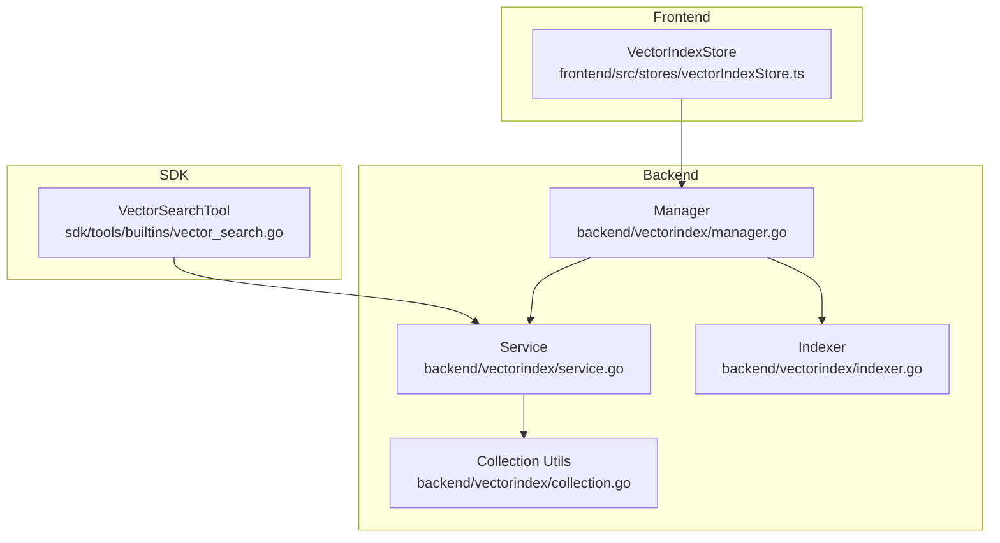
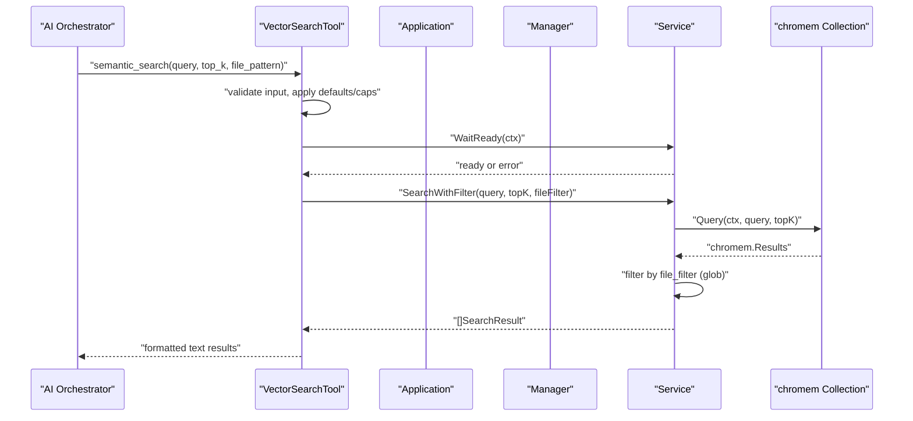
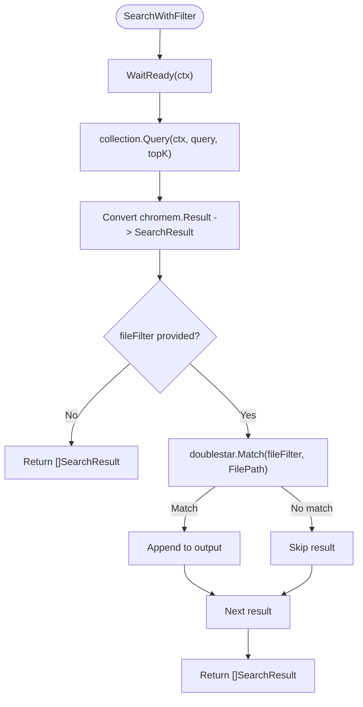
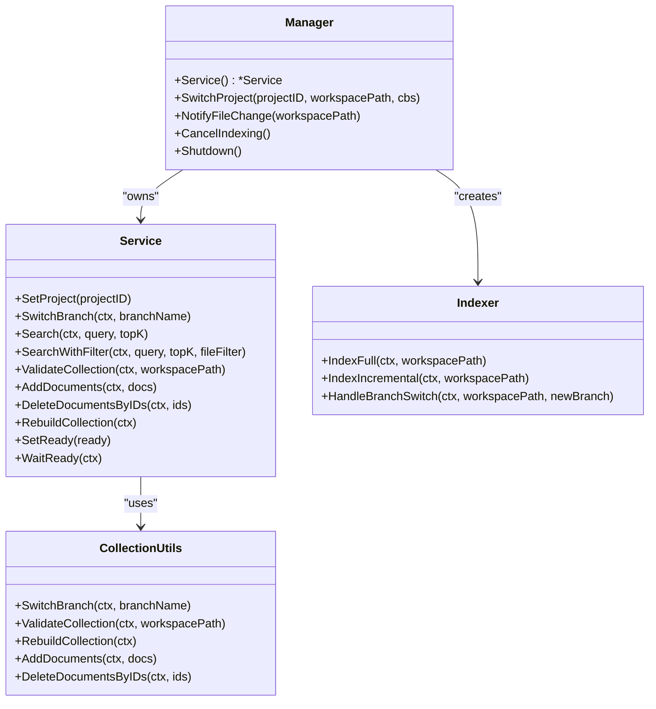
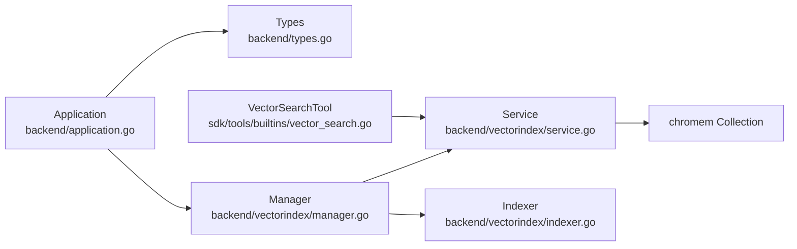

# Vector Search API

<cite>
**Referenced Files in This Document**
- [service.go](file://backend/vectorindex/service.go)
- [search_result.go](file://backend/vectorindex/search_result.go)
- [indexer.go](file://backend/vectorindex/indexer.go)
- [collection.go](file://backend/vectorindex/collection.go)
- [manager.go](file://backend/vectorindex/manager.go)
- [vector_search.go](file://sdk/tools/builtins/vector_search.go)
- [types.go](file://backend/types.go)
- [application.go](file://backend/application.go)
- [vectorIndexStore.ts](file://frontend/src/stores/vectorIndexStore.ts)
</cite>

## Table of Contents
1. [Introduction](#introduction)
2. [Project Structure](#project-structure)
3. [Core Components](#core-components)
4. [Architecture Overview](#architecture-overview)
5. [Detailed Component Analysis](#detailed-component-analysis)
6. [Dependency Analysis](#dependency-analysis)
7. [Performance Considerations](#performance-considerations)
8. [Troubleshooting Guide](#troubleshooting-guide)
9. [Conclusion](#conclusion)
10. [Appendices](#appendices)

## Introduction
This document provides comprehensive API documentation for C0WRK’s vector-based semantic search functionality. It covers the vector search endpoints, query processing, result ranking, and result formatting. It also documents the VectorSearchResult data model, search configuration options, optimization techniques, performance tuning, index maintenance, and troubleshooting. Practical examples demonstrate semantic search queries, result filtering, and integration patterns with the AI orchestrator.

## Project Structure
The vector search capability spans three layers:
- Backend vector index service and indexer
- SDK tool definition and orchestration integration
- Frontend UI state for index status

**Diagram sources**
- [manager.go:31-90](file://backend/vectorindex/manager.go#L31-L90)
- [service.go:32-46](file://backend/vectorindex/service.go#L32-L46)
- [indexer.go:61-70](file://backend/vectorindex/indexer.go#L61-L70)
- [collection.go:31-55](file://backend/vectorindex/collection.go#L31-L55)
- [vector_search.go:32-37](file://sdk/tools/builtins/vector_search.go#L32-L37)
- [vectorIndexStore.ts:1-56](file://frontend/src/stores/vectorIndexStore.ts#L1-L56)

**Section sources**
- [manager.go:31-90](file://backend/vectorindex/manager.go#L31-L90)
- [service.go:32-46](file://backend/vectorindex/service.go#L32-L46)
- [indexer.go:61-70](file://backend/vectorindex/indexer.go#L61-L70)
- [collection.go:31-55](file://backend/vectorindex/collection.go#L31-L55)
- [vector_search.go:32-37](file://sdk/tools/builtins/vector_search.go#L32-L37)
- [vectorIndexStore.ts:1-56](file://frontend/src/stores/vectorIndexStore.ts#L1-L56)

## Core Components
- VectorSearchTool: Defines the semantic_search tool, input schema, defaults, and result formatting.
- Service: Provides vector search over a chromem-go collection, supports readiness gating, and optional file-filtering.
- Indexer: Builds and maintains the vector index from project files, with full and incremental modes.
- Manager: Lifecycle manager for embedder, service, indexer, and git branch monitoring.
- VectorIndexStore: Frontend state for index status and progress.

Key responsibilities:
- Query processing: Embedding query, collection lookup, similarity scoring.
- Result ranking: Similarity scores from chromem-go.
- Filtering: Optional glob-based file filtering.
- Formatting: Human-readable result summaries with path, line range, score, language, and content preview.

**Section sources**
- [vector_search.go:14-85](file://sdk/tools/builtins/vector_search.go#L14-L85)
- [service.go:100-143](file://backend/vectorindex/service.go#L100-L143)
- [indexer.go:105-163](file://backend/vectorindex/indexer.go#L105-L163)
- [manager.go:97-212](file://backend/vectorindex/manager.go#L97-L212)
- [vectorIndexStore.ts:1-56](file://frontend/src/stores/vectorIndexStore.ts#L1-L56)

## Architecture Overview
The vector search pipeline integrates the AI orchestrator with the backend vector index:

**Diagram sources**
- [vector_search.go:87-157](file://sdk/tools/builtins/vector_search.go#L87-L157)
- [application.go:94-97](file://backend/application/application.go#L94-L97)
- [manager.go:97-212](file://backend/vectorindex/manager.go#L97-L212)
- [service.go:100-143](file://backend/vectorindex/service.go#L100-L143)

## Detailed Component Analysis

### VectorSearchTool API
- Tool name: semantic_search
- Purpose: Natural language semantic search across the project codebase
- Input schema:
  - query: string (required)
  - top_k: integer (default 10, min 1, max 50)
  - file_pattern: string (optional glob filter)
- Behavior:
  - Applies defaults and caps to top_k
  - Waits for index readiness via VectorSearchWaitFunc
  - Executes search via VectorSearchFunc
  - Formats results with path, line range, score, language, and truncated content preview

Result formatting highlights:
- Header per result: file path, line range, score, language
- Content preview: truncated to a maximum length with ellipsis

**Section sources**
- [vector_search.go:54-77](file://sdk/tools/builtins/vector_search.go#L54-L77)
- [vector_search.go:87-157](file://sdk/tools/builtins/vector_search.go#L87-L157)

### Service Search API
- Methods:
  - Search(ctx, query, topK) → []SearchResult
  - SearchWithFilter(ctx, query, topK, fileFilter) → []SearchResult
- Processing:
  - Blocks on WaitReady if index not ready
  - Queries current collection with topK
  - Converts chromem results to SearchResult
  - Applies optional fileFilter using glob matching
- Result ranking:
  - Score is the similarity score from chromem-go
- Filtering:
  - Optional glob pattern applied to FilePath

**Diagram sources**
- [service.go:100-143](file://backend/vectorindex/service.go#L100-L143)

**Section sources**
- [service.go:100-143](file://backend/vectorindex/service.go#L100-L143)

### SearchResult Data Model
Fields:
- FilePath: absolute path to source file
- FileName: basename of the file
- Content: chunk content
- Score: similarity score (float32; higher = more similar)
- StartLine: 1-based start line in original file
- EndLine: 1-based end line in original file
- Language: detected language (e.g., "go", "typescript")

**Section sources**
- [search_result.go:3-12](file://backend/vectorindex/search_result.go#L3-L12)
- [service.go:230-244](file://backend/vectorindex/service.go#L230-L244)

### Indexing and Maintenance
- Manager:
  - Creates embedder and service from configuration
  - Switches project, detects branch, initializes indexer
  - Starts background indexing (full or incremental)
  - Monitors git branch changes and triggers branch-aware indexing
- Indexer:
  - Full indexing: walks project files, chunks content, batches embeddings, adds to collection
  - Incremental indexing: validates against disk, deletes stale/new/deleted docs, reindexes affected files
  - Supports progress callbacks and cancellation
- Collection utilities:
  - Branch-aware collections with sanitized names
  - Validation against disk using content hashes
  - Rebuild and add/delete operations

**Diagram sources**
- [manager.go:34-90](file://backend/vectorindex/manager.go#L34-L90)
- [service.go:34-46](file://backend/vectorindex/service.go#L34-L46)
- [indexer.go:61-103](file://backend/vectorindex/indexer.go#L61-L103)
- [collection.go:31-55](file://backend/vectorindex/collection.go#L31-L55)

**Section sources**
- [manager.go:97-212](file://backend/vectorindex/manager.go#L97-L212)
- [indexer.go:105-273](file://backend/vectorindex/indexer.go#L105-L273)
- [collection.go:57-208](file://backend/vectorindex/collection.go#L57-L208)

### Integration with the AI Orchestrator
- Application wires the vector search tool into the orchestrator builder:
  - Registers VectorSearchFunc and VectorSearchWaitFunc
- The tool’s Execute method:
  - Validates input, applies defaults/caps
  - Waits for readiness
  - Calls the backend search function
  - Formats results for the orchestrator

**Section sources**
- [application.go:94-97](file://backend/application/application.go#L94-L97)
- [vector_search.go:87-157](file://sdk/tools/builtins/vector_search.go#L87-L157)

### Frontend Index Status
- VectorIndexStore tracks:
  - status: idle, indexing, ready, reindexing
  - progress: numeric progress
  - filesIndexed, totalFiles
  - currentFile
  - branch
- Updates from backend events and resets on project changes

**Section sources**
- [vectorIndexStore.ts:1-56](file://frontend/src/stores/vectorIndexStore.ts#L1-L56)

## Dependency Analysis
- Backend-to-SDK:
  - VectorSearchFunc and VectorSearchWaitFunc are defined in core/tools and exposed via backend/types.go
  - Application registers these functions with the orchestrator builder
- Backend-to-Indexer:
  - Manager constructs Indexer with Service and chunking/hash functions
  - Indexer uses Service to add/delete documents and to validate collections
- Service-to-Collection:
  - Service delegates queries to chromem-go Collection
  - Service converts chromem results to SearchResult

**Diagram sources**
- [application.go:94-97](file://backend/application/application.go#L94-L97)
- [types.go:116-123](file://backend/types.go#L116-L123)
- [manager.go:97-212](file://backend/vectorindex/manager.go#L97-L212)
- [service.go:100-143](file://backend/vectorindex/service.go#L100-L143)
- [indexer.go:105-163](file://backend/vectorindex/indexer.go#L105-L163)
- [vector_search.go:25-30](file://sdk/tools/builtins/vector_search.go#L25-L30)

**Section sources**
- [application.go:94-97](file://backend/application/application.go#L94-L97)
- [types.go:116-123](file://backend/types.go#L116-L123)
- [manager.go:97-212](file://backend/vectorindex/manager.go#L97-L212)
- [service.go:100-143](file://backend/vectorindex/service.go#L100-L143)
- [indexer.go:105-163](file://backend/vectorindex/indexer.go#L105-L163)
- [vector_search.go:25-30](file://sdk/tools/builtins/vector_search.go#L25-L30)

## Performance Considerations
- Indexing
  - Batch size: Documents are embedded and added in fixed-size batches to balance memory and throughput.
  - Incremental reindexing: Only stale/new/deleted files are processed, minimizing work.
  - Hash-based validation: Uses content hashes to detect changes efficiently.
- Querying
  - topK controls result cardinality; larger values increase latency and memory usage.
  - Optional fileFilter reduces candidate set via glob matching.
  - Service blocks on WaitReady to avoid query failures during initialization.
- Embedding
  - Embedder is configured via ManagerConfig; ensure appropriate MaxSeqLength and HiddenDim for your model.
- Frontend UX
  - Debounced incremental indexing reduces churn from frequent file edits.
  - Progress callbacks enable responsive UI updates.

[No sources needed since this section provides general guidance]

## Troubleshooting Guide
Common issues and resolutions:
- Index not ready
  - Symptom: Tool returns “index not ready”.
  - Cause: Service not initialized or not yet ready.
  - Resolution: Ensure Manager.SwitchProject has completed; use VectorSearchWaitFunc before querying.
- Empty results
  - Symptom: No results found.
  - Causes: No collection, no matching files, or query too specific.
  - Resolution: Verify indexing completed, adjust file_pattern, or broaden query.
- Slow queries
  - Symptom: High latency.
  - Causes: Large topK, lack of fileFilter, or heavy embedding model.
  - Resolution: Reduce topK, add fileFilter, or tune embedding model parameters.
- Incorrect file filtering
  - Symptom: Unexpected results despite file_pattern.
  - Cause: Glob pattern mismatch or invalid pattern.
  - Resolution: Validate pattern syntax; ensure it matches absolute FilePath.
- Index corruption or stale state
  - Symptom: Inconsistent results or errors.
  - Resolution: Trigger incremental reindexing or rebuild collection via Manager APIs.

**Section sources**
- [vector_search.go:106-111](file://sdk/tools/builtins/vector_search.go#L106-L111)
- [service.go:100-143](file://backend/vectorindex/service.go#L100-L143)
- [indexer.go:165-273](file://backend/vectorindex/indexer.go#L165-L273)
- [collection.go:185-208](file://backend/vectorindex/collection.go#L185-L208)

## Conclusion
C0WRK’s vector search provides a robust, branch-aware semantic search over codebases. The SDK tool exposes a simple, powerful API for the AI orchestrator, while the backend ensures reliable indexing, incremental maintenance, and fast querying. By tuning topK, leveraging file filters, and monitoring index status, teams can achieve accurate, low-latency semantic search results integrated seamlessly into AI-driven workflows.

[No sources needed since this section summarizes without analyzing specific files]

## Appendices

### API Definitions

- Tool: semantic_search
  - Input schema:
    - query: string (required)
    - top_k: integer (default 10, min 1, max 50)
    - file_pattern: string (optional)
  - Output: human-readable text summarizing results
  - Integration: Registered via Application with VectorSearchFunc and VectorSearchWaitFunc

- Service Search Methods
  - Search(ctx, query, topK) → []SearchResult
  - SearchWithFilter(ctx, query, topK, fileFilter) → []SearchResult
  - WaitReady(ctx) → error

- SearchResult Fields
  - FilePath, FileName, Content, Score, StartLine, EndLine, Language

**Section sources**
- [vector_search.go:54-77](file://sdk/tools/builtins/vector_search.go#L54-L77)
- [vector_search.go:87-157](file://sdk/tools/builtins/vector_search.go#L87-L157)
- [service.go:100-143](file://backend/vectorindex/service.go#L100-L143)
- [search_result.go:3-12](file://backend/vectorindex/search_result.go#L3-L12)

### Practical Examples

- Semantic search query
  - Use semantic_search with a natural language description (e.g., “authentication middleware”) and top_k=10.
- Result filtering
  - Narrow to specific languages or directories using file_pattern (e.g., “**/*.go”, “src/**/*.ts”, “backend/**”).
- Integration with AI orchestrator
  - Register VectorSearchFunc and VectorSearchWaitFunc during Application initialization; the tool will automatically enforce readiness and formatting.

**Section sources**
- [vector_search.go:54-77](file://sdk/tools/builtins/vector_search.go#L54-L77)
- [application.go:94-97](file://backend/application/application.go#L94-L97)