# Architecture

<cite>
**Referenced Files in This Document**
- [main.go](file://main.go)
- [wails.json](file://wails.json)
- [desktop/app.go](file://desktop/app.go)
- [desktop/events.go](file://desktop/events.go)
- [backend/application.go](file://backend/application.go)
- [backend/types.go](file://backend/types.go)
- [backend/config/config.go](file://backend/config/config.go)
- [core/builder.go](file://core/builder.go)
- [core/orchestrator.go](file://core/orchestrator.go)
- [core/emitter_logging.go](file://core/emitter_logging.go)
- [backend/session/emitter.go](file://backend/session/emitter.go)
- [sdk/llm/provider.go](file://sdk/llm/provider.go)
- [frontend/src/App.tsx](file://frontend/src/App.tsx)
- [frontend/src/hooks/useWails.ts](file://frontend/src/hooks/useWails.ts)
- [frontend/package.json](file://frontend/package.json)
- [go.mod](file://go.mod)
</cite>

## Table of Contents
1. [Introduction](#introduction)
2. [Project Structure](#project-structure)
3. [Core Components](#core-components)
4. [Architecture Overview](#architecture-overview)
5. [Detailed Component Analysis](#detailed-component-analysis)
6. [Dependency Analysis](#dependency-analysis)
7. [Performance Considerations](#performance-considerations)
8. [Troubleshooting Guide](#troubleshooting-guide)
9. [Conclusion](#conclusion)
10. [Appendices](#appendices)

## Introduction
This document describes the system architecture of C0WRK, a desktop application integrating a Plan-and-Execute orchestration engine with a reactive event-driven UI. The system is organized into distinct layers:
- Desktop layer (Wails): Provides the native host, UI event bus, and bindings to the backend.
- Backend services (Go): Central application orchestration, session management, persistence, and configuration.
- Core AI engine: Orchestrator builder, router, planner, reflector, and context management.
- Frontend application (React): Renders UI, subscribes to events, and invokes Wails APIs.

The architecture emphasizes separation of concerns, event-driven communication, dependency injection via factories, and a plugin-like tool registry for extensibility. It supports multiple LLM providers, MCP tool servers, and optional vector search capabilities.

## Project Structure
The repository follows a layered structure:
- desktop/: Wails host and UI event definitions
- backend/: Application orchestration, session management, persistence, and configuration
- core/: Orchestrator builder, agents, and core orchestration logic
- sdk/: LLM provider abstractions, tool registries, and shared components
- frontend/: React application with TypeScript and Vite toolchain

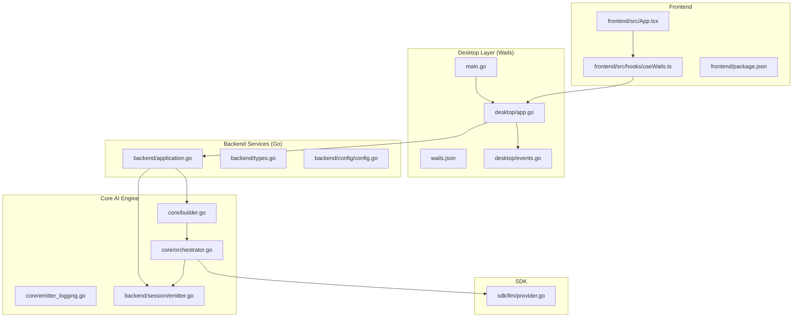

**Diagram sources**
- [main.go:1-45](file://main.go#L1-L45)
- [wails.json:1-13](file://wails.json#L1-L13)
- [desktop/app.go:1-73](file://desktop/app.go#L1-L73)
- [desktop/events.go:1-46](file://desktop/events.go#L1-L46)
- [backend/application.go:1-270](file://backend/application.go#L1-L270)
- [backend/types.go:1-160](file://backend/types.go#L1-L160)
- [backend/config/config.go:1-408](file://backend/config/config.go#L1-L408)
- [core/builder.go:1-723](file://core/builder.go#L1-L723)
- [core/orchestrator.go:1-599](file://core/orchestrator.go#L1-L599)
- [core/emitter_logging.go:1-200](file://core/emitter_logging.go#L1-L200)
- [backend/session/emitter.go:1-668](file://backend/session/emitter.go#L1-L668)
- [sdk/llm/provider.go:1-24](file://sdk/llm/provider.go#L1-L24)
- [frontend/src/App.tsx:1-91](file://frontend/src/App.tsx#L1-L91)
- [frontend/src/hooks/useWails.ts:1-61](file://frontend/src/hooks/useWails.ts#L1-L61)
- [frontend/package.json:1-61](file://frontend/package.json#L1-L61)

**Section sources**
- [main.go:18-44](file://main.go#L18-L44)
- [wails.json:1-13](file://wails.json#L1-L13)
- [desktop/app.go:18-73](file://desktop/app.go#L18-L73)
- [backend/application.go:43-133](file://backend/application.go#L43-L133)
- [core/builder.go:27-93](file://core/builder.go#L27-L93)
- [frontend/src/App.tsx:21-91](file://frontend/src/App.tsx#L21-L91)
- [frontend/src/hooks/useWails.ts:51-61](file://frontend/src/hooks/useWails.ts#L51-L61)

## Core Components
- Wails entrypoint and asset hosting: Initializes the desktop host, binds the App instance, and serves embedded frontend assets.
- Desktop App: Holds application state, manages configuration, session manager, watchers, and vector index manager. Exposes UI-facing methods bound to Wails.
- Backend Application: Central ViewModel constructing the OrchestratorBuilder, session manager, and event persister. Bridges desktop callbacks to the core engine.
- OrchestratorBuilder: Creates per-session Orchestrators with shared tool registry, MCP gateway, and cached LLM router. Supports runtime reconfiguration.
- Orchestrator: Implements the Plan-and-Execute loop, integrates router/planner/reflector, and coordinates with the SDK engine.
- EventEmitter: Emits structured events for routing, planning, tool execution, reflection, and context fill; persists session totals and enriches events with UI metadata.
- LLM Provider Abstractions: Unified Provider interface enabling multiple LLM backends (Anthropic, Gemini, OpenAI-compatible, LM Studio).
- Frontend: React application subscribing to Wails events and invoking Go-bound APIs via generated bindings.

**Section sources**
- [main.go:18-44](file://main.go#L18-L44)
- [desktop/app.go:18-73](file://desktop/app.go#L18-L73)
- [backend/application.go:43-133](file://backend/application.go#L43-L133)
- [core/builder.go:27-93](file://core/builder.go#L27-L93)
- [core/orchestrator.go:55-189](file://core/orchestrator.go#L55-L189)
- [backend/session/emitter.go:16-78](file://backend/session/emitter.go#L16-L78)
- [sdk/llm/provider.go:6-24](file://sdk/llm/provider.go#L6-L24)
- [frontend/src/App.tsx:21-91](file://frontend/src/App.tsx#L21-L91)

## Architecture Overview
The system uses an event-driven architecture with explicit separation between UI, backend orchestration, and the AI engine. Wails hosts the desktop, serving the React frontend and exposing Go methods as APIs. The backend composes the core engine and manages sessions, persistence, and UI callbacks. The core engine encapsulates routing, planning, execution, and reflection, while the SDK provides provider abstractions and tool registries.

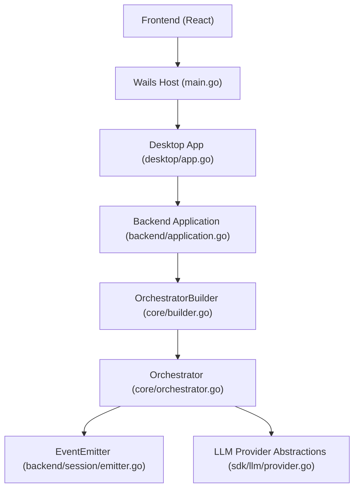

**Diagram sources**
- [main.go:18-44](file://main.go#L18-L44)
- [desktop/app.go:18-73](file://desktop/app.go#L18-L73)
- [backend/application.go:43-133](file://backend/application.go#L43-L133)
- [core/builder.go:108-208](file://core/builder.go#L108-L208)
- [core/orchestrator.go:174-189](file://core/orchestrator.go#L174-L189)
- [backend/session/emitter.go:16-78](file://backend/session/emitter.go#L16-L78)
- [sdk/llm/provider.go:6-24](file://sdk/llm/provider.go#L6-L24)

## Detailed Component Analysis

### Desktop Layer (Wails)
- Responsibilities:
  - Initialize Wails host with embedded assets and bind the App instance.
  - Manage configuration, active project/workspace, watchers, and vector index manager.
  - Expose Go methods to the frontend via Wails bindings.
  - Emit lifecycle and project/session events to the frontend.
- Integration:
  - Wails entrypoint constructs the App and registers OnStartup/OnShutdown handlers.
  - Wails configuration defines build and dev commands for the frontend.

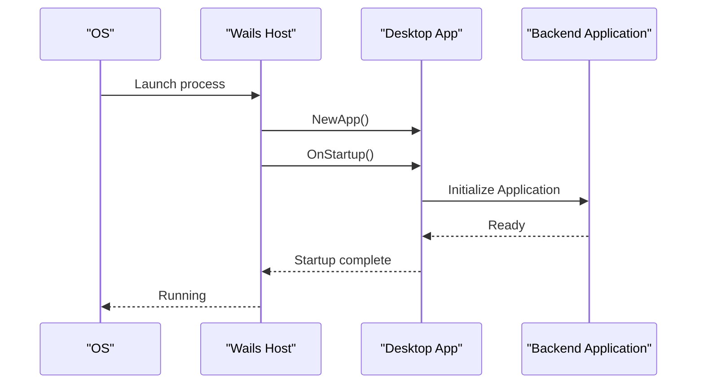

**Diagram sources**
- [main.go:18-44](file://main.go#L18-L44)
- [wails.json:1-13](file://wails.json#L1-L13)
- [desktop/app.go:62-73](file://desktop/app.go#L62-L73)
- [backend/application.go:65-133](file://backend/application.go#L65-L133)

**Section sources**
- [main.go:18-44](file://main.go#L18-L44)
- [wails.json:1-13](file://wails.json#L1-L13)
- [desktop/app.go:18-73](file://desktop/app.go#L18-L73)
- [desktop/events.go:7-46](file://desktop/events.go#L7-L46)

### Backend Services (Go)
- Responsibilities:
  - Construct the OrchestratorBuilder and session manager.
  - Combine UI emission with event persistence.
  - Provide runtime reconfiguration (router, judge, MCP).
  - Expose tool registry, MCP status, and vector search integration.
- Patterns:
  - Dependency Injection: ApplicationConfig injects callbacks and stores.
  - Factory Pattern: Session manager uses a factory closure to create Orchestrators.

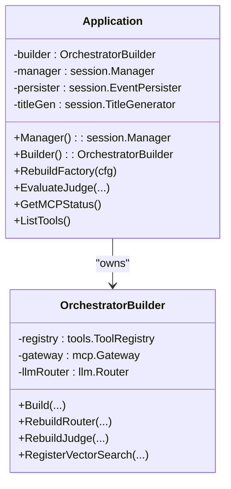

**Diagram sources**
- [backend/application.go:43-133](file://backend/application.go#L43-L133)
- [core/builder.go:27-93](file://core/builder.go#L27-L93)

**Section sources**
- [backend/application.go:17-133](file://backend/application.go#L17-L133)
- [backend/types.go:15-160](file://backend/types.go#L15-L160)

### Core AI Engine
- Responsibilities:
  - Plan-and-Execute orchestration with router, planner, reflector, and tool registry.
  - Context management with compaction strategies and token tracking.
  - Event emission for UI rendering and diagnostics.
- Patterns:
  - Observer Pattern: UsageTracker notifies the emitter of token totals.
  - Strategy Pattern: Context compaction strategies and provider implementations.
  - Factory Pattern: BlackboardFactory and ContextManagerFactory enable per-task state and context construction.

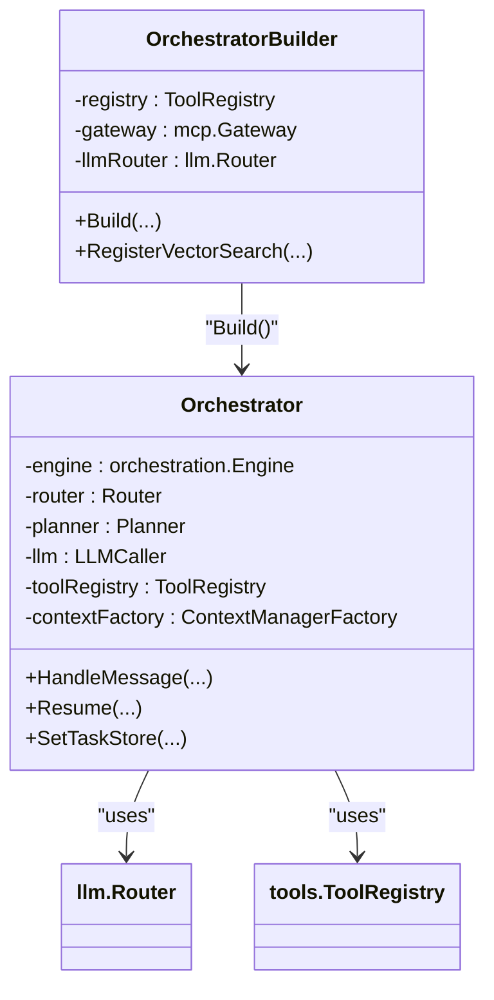

**Diagram sources**
- [core/orchestrator.go:55-189](file://core/orchestrator.go#L55-L189)
- [core/builder.go:108-208](file://core/builder.go#L108-L208)

**Section sources**
- [core/orchestrator.go:55-189](file://core/orchestrator.go#L55-L189)
- [core/builder.go:108-208](file://core/builder.go#L108-L208)

### Event-Driven Communication
- Event Emission:
  - EventEmitter emits structured events (routing, plan steps, tool calls, reflection, context fill).
  - Events carry session-scoped metadata and UI-friendly payloads.
- Persistence and UI:
  - Backend combines UI emission with event persistence.
  - Frontend listens to Wails events and updates UI state.

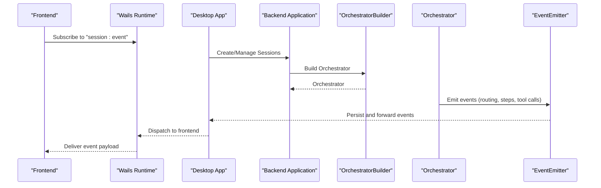

**Diagram sources**
- [backend/session/emitter.go:16-78](file://backend/session/emitter.go#L16-L78)
- [backend/application.go:75-84](file://backend/application.go#L75-L84)
- [frontend/src/App.tsx:21-91](file://frontend/src/App.tsx#L21-L91)

**Section sources**
- [backend/session/emitter.go:16-78](file://backend/session/emitter.go#L16-L78)
- [backend/application.go:75-84](file://backend/application.go#L75-L84)
- [frontend/src/App.tsx:21-91](file://frontend/src/App.tsx#L21-L91)

### Plugin Architecture (Tools and MCP)
- Tool Registry:
  - Built-in tools registered at startup; security policies and judge integrated.
  - Optional vector search tool registered after builder creation.
- MCP Gateway:
  - Starts and reconfigures MCP servers; exposes status and connectivity checks.
- Runtime Updates:
  - Rebuild router, judge, and MCP gateway on configuration changes.

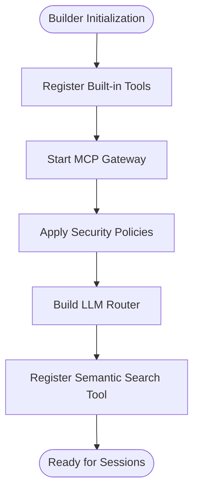

**Diagram sources**
- [core/builder.go:54-93](file://core/builder.go#L54-L93)
- [core/builder.go:352-364](file://core/builder.go#L352-L364)
- [backend/application.go:94-102](file://backend/application.go#L94-L102)

**Section sources**
- [core/builder.go:54-93](file://core/builder.go#L54-L93)
- [core/builder.go:352-364](file://core/builder.go#L352-L364)
- [backend/application.go:94-102](file://backend/application.go#L94-L102)

### LLM Provider Abstractions
- Provider Interface:
  - Unified ChatCompletion and streaming interfaces across providers.
- Router and Model Registry:
  - Router selects provider/model based on configuration; model registry supplies metadata.
- Strategy:
  - Provider implementations encapsulate API differences behind a common interface.

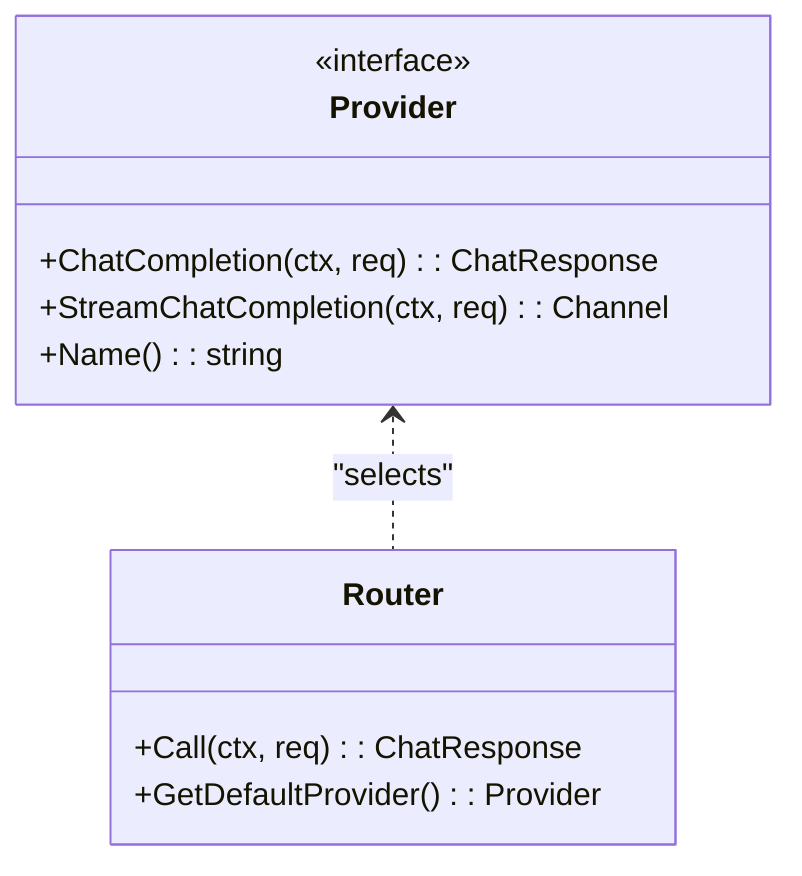

**Diagram sources**
- [sdk/llm/provider.go:6-24](file://sdk/llm/provider.go#L6-L24)
- [core/builder.go:382-421](file://core/builder.go#L382-L421)

**Section sources**
- [sdk/llm/provider.go:6-24](file://sdk/llm/provider.go#L6-L24)
- [core/builder.go:382-421](file://core/builder.go#L382-L421)

### Frontend Integration and Cross-Platform
- Wails Bindings:
  - Generated bindings expose Go methods to React via window.go.desktop.App.
- Event Subscription:
  - Frontend listens to startup errors, vector index status, and session events.
- Cross-Platform:
  - Wails targets desktop platforms; build configuration defined in wails.json.

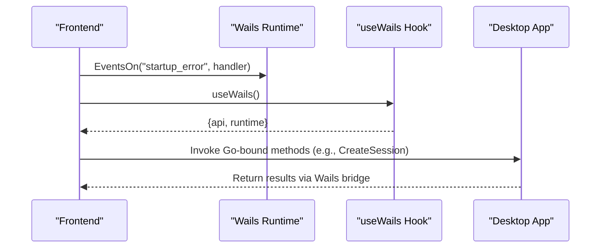

**Diagram sources**
- [frontend/src/App.tsx:21-91](file://frontend/src/App.tsx#L21-L91)
- [frontend/src/hooks/useWails.ts:51-61](file://frontend/src/hooks/useWails.ts#L51-L61)
- [wails.json:1-13](file://wails.json#L1-L13)

**Section sources**
- [frontend/src/App.tsx:21-91](file://frontend/src/App.tsx#L21-L91)
- [frontend/src/hooks/useWails.ts:51-61](file://frontend/src/hooks/useWails.ts#L51-L61)
- [wails.json:1-13](file://wails.json#L1-L13)

## Dependency Analysis
- Internal Dependencies:
  - desktop depends on backend for orchestration and session management.
  - backend depends on core for orchestrator builder and agents.
  - core depends on sdk for LLM providers and tool registries.
- External Dependencies:
  - Wails for desktop hosting and event bridge.
  - SQLite for persistence.
  - LLM providers (OpenAI, Anthropic, Gemini, LM Studio).
  - MCP for tool server integration.

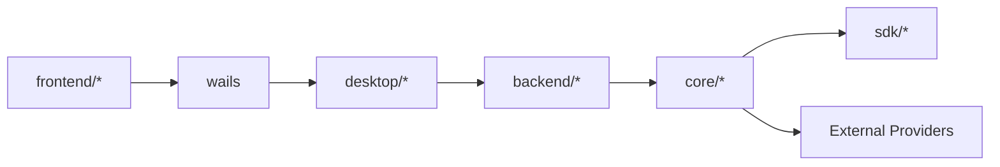

**Diagram sources**
- [go.mod:1-119](file://go.mod#L1-L119)
- [frontend/package.json:1-61](file://frontend/package.json#L1-L61)

**Section sources**
- [go.mod:1-119](file://go.mod#L1-L119)
- [frontend/package.json:1-61](file://frontend/package.json#L1-L61)

## Performance Considerations
- Token Management:
  - UsageTracker observes token usage and emits session totals; context compaction reduces token pressure.
- Streaming and Chunking:
  - AssistantChunk accumulates and emits deltas for responsive UI updates.
- Retry and Backoff:
  - LLM router supports retry configuration to handle transient failures.
- Circuit Breakers:
  - Executor circuit breaker prevents runaway loops and excessive truncation.
- Vector Search:
  - Optional semantic search hints injected into planning context with timeouts to avoid blocking.

[No sources needed since this section provides general guidance]

## Troubleshooting Guide
- Startup Errors:
  - Frontend listens for "startup_error" events and displays a dismissible banner.
- MCP Connectivity:
  - Use GetMCPStatus and IsMCPServerConnected to diagnose server availability.
- Tool Safety:
  - EvaluateJudge provides on-demand safety assessments; ensure judge is configured.
- Session Events:
  - Subscribe to "session:event" to monitor orchestration progress and diagnostics.

**Section sources**
- [frontend/src/App.tsx:21-91](file://frontend/src/App.tsx#L21-L91)
- [backend/application.go:164-180](file://backend/application.go#L164-L180)
- [backend/application.go:182-211](file://backend/application.go#L182-L211)

## Conclusion
C0WRK’s architecture cleanly separates the desktop host, backend orchestration, core AI engine, and frontend application. It leverages event-driven communication, dependency injection, and plugin-style tool registries to remain extensible and maintainable. The system supports multiple LLM providers, MCP tool servers, and optional vector search, while providing robust observability and resilience through token tracking, compaction, and circuit breakers.

[No sources needed since this section summarizes without analyzing specific files]

## Appendices

### System Context Diagram
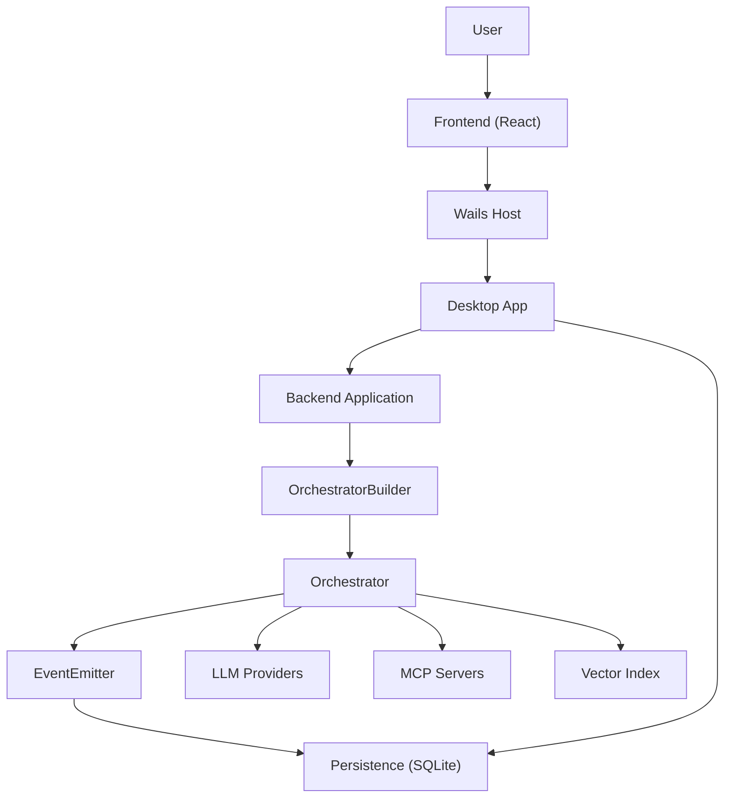

**Diagram sources**
- [main.go:18-44](file://main.go#L18-L44)
- [desktop/app.go:18-73](file://desktop/app.go#L18-L73)
- [backend/application.go:43-133](file://backend/application.go#L43-L133)
- [core/builder.go:27-93](file://core/builder.go#L27-L93)
- [core/orchestrator.go:55-189](file://core/orchestrator.go#L55-L189)
- [backend/session/emitter.go:16-78](file://backend/session/emitter.go#L16-L78)