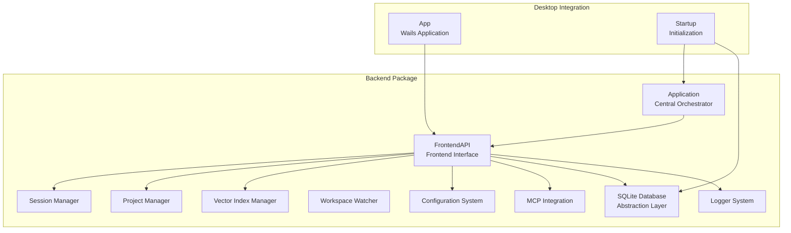
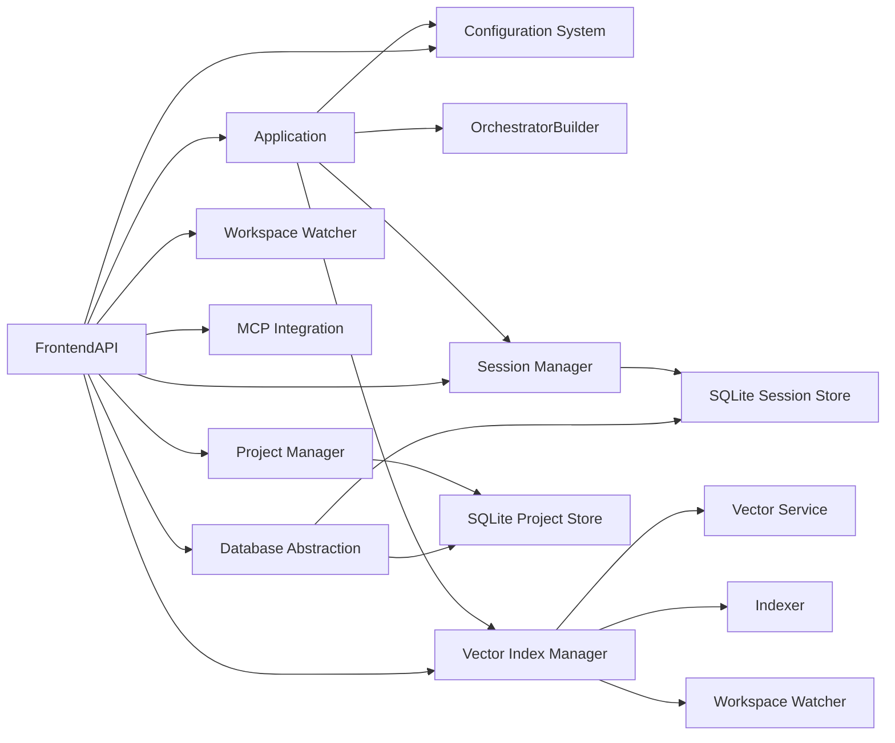

# Backend Services Architecture

<cite>
**Referenced Files in This Document**
- [application.go](file://backend/application.go)
- [frontend_api.go](file://backend/frontend_api.go)
- [types.go](file://backend/types.go)
- [config.go](file://backend/config/config.go)
- [resolve.go](file://backend/config/resolve.go)
- [configadapter.go](file://backend/configadapter.go)
- [logger.go](file://backend/logger/logger.go)
- [session/manager.go](file://backend/session/manager.go)
- [session/persistence.go](file://backend/session/persistence.go)
- [project/manager.go](file://backend/project/manager.go)
- [project/persistence.go](file://backend/project/persistence.go)
- [vectorindex/manager.go](file://backend/vectorindex/manager.go)
- [vectorindex/service.go](file://backend/vectorindex/service.go)
- [vectorindex/indexer.go](file://backend/vectorindex/indexer.go)
- [workspace/watcher.go](file://backend/workspace/watcher.go)
- [memory/procedural.go](file://backend/memory/procedural.go)
- [api_types.go](file://backend/api_types.go)
- [events.go](file://backend/events.go)
- [frontend_api_config.go](file://backend/frontend_api_config.go)
- [frontend_api_project.go](file://backend/frontend_api_project.go)
- [frontend_api_session.go](file://backend/frontend_api_session.go)
- [frontend_api_workspace.go](file://backend/frontend_api_workspace.go)
- [frontend_api_mcp.go](file://backend/frontend_api_mcp.go)
- [app.go](file://desktop/app.go)
- [startup.go](file://desktop/startup.go)
- [database.go](file://backend/database.go)
- [database_test.go](file://backend/database_test.go)
</cite>

## Update Summary
**Changes Made**
- Added new SQLite database abstraction layer with centralized database initialization
- Implemented WAL journal mode and foreign key constraints for improved data integrity
- Enhanced backend services architecture with comprehensive testing infrastructure
- Integrated database abstraction into desktop startup process for consistent initialization

## Table of Contents
1. [Introduction](#introduction)
2. [Project Structure](#project-structure)
3. [Core Components](#core-components)
4. [Architecture Overview](#architecture-overview)
5. [Detailed Component Analysis](#detailed-component-analysis)
6. [Database Abstraction Layer](#database-abstraction-layer)
7. [FrontendAPI System](#frontendapi-system)
8. [Configuration Management](#configuration-management)
9. [Dependency Analysis](#dependency-analysis)
10. [Performance Considerations](#performance-considerations)
11. [Testing Infrastructure](#testing-infrastructure)
12. [Troubleshooting Guide](#troubleshooting-guide)
13. [Conclusion](#conclusion)

## Introduction
This document describes the backend services architecture of C0WRK, focusing on the newly refactored backend package that encapsulates all core application logic previously distributed across the desktop and backend packages. The architecture centers around the FrontendAPI system that serves as the primary interface for the Wails frontend, coordinating session management, project lifecycle, vector index services, configuration management, and MCP integration. The design emphasizes clean separation of concerns, comprehensive dependency injection patterns, robust lifecycle management with graceful shutdown procedures, and a centralized SQLite database abstraction layer for consistent data persistence.

## Project Structure
The backend has been completely refactored into a cohesive package structure with enhanced database management:



**Diagram sources**
- [application.go:43-133](file://backend/application.go#L43-L133)
- [frontend_api.go:16-61](file://backend/frontend_api.go#L16-L61)
- [app.go:14-36](file://desktop/app.go#L14-L36)
- [startup.go:41-800](file://desktop/startup.go#L41-L800)
- [database.go:11-29](file://backend/database.go#L11-L29)

**Section sources**
- [application.go:43-133](file://backend/application.go#L43-L133)
- [frontend_api.go:16-61](file://backend/frontend_api.go#L16-L61)
- [app.go:14-36](file://desktop/app.go#L14-L36)
- [startup.go:41-800](file://desktop/startup.go#L41-L800)
- [database.go:11-29](file://backend/database.go#L11-L29)

## Core Components
The refactored backend architecture consists of several key components with enhanced database integration:

- **Application**: Central orchestrator that composes the OrchestratorBuilder, session manager, event persister, and optional vector search integration
- **FrontendAPI**: Comprehensive frontend interface that exposes all backend functionality to the Wails frontend with thread-safe state management
- **Session Manager**: Enhanced session management with persistence, token accounting, event emission, and task integration
- **Project Manager**: Advanced project lifecycle management with workspace handling, persistence, and codebase indexing integration
- **Vector Index Manager**: Sophisticated vector search capabilities with embedder, service, indexer, and git-aware branch switching
- **Configuration System**: Complete configuration management with runtime updates, validation, and persistence
- **MCP Integration**: Advanced MCP server management with installation, configuration, and tool execution
- **Workspace Watcher**: Intelligent file system monitoring with debounced notifications and git integration
- **Database Abstraction Layer**: Centralized SQLite database initialization with WAL journal mode and foreign key constraints
- **Persistence Layer**: SQLite-backed storage for sessions, projects, and configuration data with comprehensive testing
- **Event System**: Comprehensive event emission and handling for frontend-backend communication

**Section sources**
- [application.go:43-133](file://backend/application.go#L43-L133)
- [frontend_api.go:16-61](file://backend/frontend_api.go#L16-L61)
- [session/manager.go:80-126](file://backend/session/manager.go#L80-L126)
- [project/manager.go:13-26](file://backend/project/manager.go#L13-L26)
- [vectorindex/manager.go:31-90](file://backend/vectorindex/manager.go#L31-L90)
- [workspace/watcher.go:21-85](file://backend/workspace/watcher.go#L21-L85)
- [config/config.go:18-354](file://backend/config/config.go#L18-L354)
- [database.go:11-29](file://backend/database.go#L11-L29)

## Architecture Overview
The refactored architecture introduces a clear separation between the backend core and frontend integration with enhanced database management:

```mermaid
graph TB
subgraph "Backend Core"
CFG["Configuration System"]
BLD["OrchestratorBuilder"]
EVT["Event Persister"]
VEC["Vector Search"]
MCP["MCP Gateway"]
end
subgraph "Frontend Integration"
FAPI["FrontendAPI"]
APP["Application"]
END
subgraph "Database Layer"
DB["SQLite Database<br/>Abstraction"]
SS["Session Store"]
PS["Project Store"]
end
CFG --> BLD
BLD --> EVT
BLD --> APP
APP --> FAPI
FAPI --> DB
FAPI --> SS
FAPI --> PS
VEC --> FAPI
MCP --> FAPI
DB --> SS
DB --> PS
```

**Diagram sources**
- [application.go:65-133](file://backend/application.go#L65-L133)
- [frontend_api.go:82-99](file://backend/frontend_api.go#L82-L99)
- [startup.go:311-355](file://desktop/startup.go#L311-L355)
- [database.go:11-29](file://backend/database.go#L11-L29)

## Detailed Component Analysis

### Application Orchestrator
The Application serves as the central orchestrator coordinating all backend services:

- **Builder Composition**: Creates and manages the OrchestratorBuilder with shared tool registry, MCP gateway, and LLM router
- **Event Coordination**: Manages combined event emission (UI + persistence) and persistence integration
- **Lifecycle Management**: Handles graceful shutdown of session manager and MCP gateway
- **Utility Functions**: Provides judge evaluation, MCP status checking, and tool listing capabilities

**Section sources**
- [application.go:65-133](file://backend/application.go#L65-L133)
- [application.go:240-250](file://backend/application.go#L240-L250)

### FrontendAPI System
The FrontendAPI represents the new comprehensive interface for frontend-backend communication:

- **State Management**: Thread-safe configuration, project, session, and vector index state
- **Event Emission**: Centralized event emission to Wails frontend with proper context handling
- **Resource Management**: Lifecycle management for all backend resources including cleanup procedures
- **Async Operations**: Non-blocking operations for codebase indexing and MCP installations

**Section sources**
- [frontend_api.go:16-61](file://backend/frontend_api.go#L16-L61)
- [frontend_api.go:109-139](file://backend/frontend_api.go#L109-L139)

### Session Management
Enhanced session management with comprehensive persistence and event coordination:

- **Lazy Restoration**: Automatic session restoration from persistent store with project resolver integration
- **Event Coordination**: Combined UI emission and persistence with token accounting
- **Task Integration**: Seamless integration with task persistence and blackboard factories
- **Graceful Deletion**: Proper cleanup with cancellation and resource management

**Section sources**
- [session/manager.go:80-126](file://backend/session/manager.go#L80-L126)
- [session/manager.go:188-340](file://backend/session/manager.go#L188-L340)

### Project Management
Advanced project lifecycle management with codebase integration:

- **Workspace Handling**: Support for both internal and external project workspaces
- **Codebase Indexing**: Integration with codebase-memory-mcp for automatic indexing
- **Git Integration**: Automatic detection of git branches and project switching
- **Activity Tracking**: Comprehensive project activity monitoring and persistence

**Section sources**
- [project/manager.go:13-127](file://backend/project/manager.go#L13-L127)
- [frontend_api_project.go:24-47](file://backend/frontend_api_project.go#L24-L47)

### Vector Index Manager
Sophisticated vector search capabilities with git-aware management:

- **Embedding Pipeline**: Complete embedder-service-indexer stack with git branch monitoring
- **Incremental Indexing**: Debounced file change notifications and batch processing
- **Project Scoping**: Per-project and per-branch collection management
- **Readiness Management**: Atomic readiness flags with channel signaling

**Section sources**
- [vectorindex/manager.go:31-280](file://backend/vectorindex/manager.go#L31-L280)
- [vectorindex/service.go:18-245](file://backend/vectorindex/service.go#L18-L245)

### Workspace Watcher Integration
Intelligent file system monitoring with git awareness:

- **Debounced Notifications**: Prevents excessive re-indexing on rapid file changes
- **Git Integration**: Automatic detection of git repositories and branch changes
- **Recursive Monitoring**: Comprehensive directory traversal with .gitignore filtering
- **Performance Optimization**: Efficient file change detection and notification routing

**Section sources**
- [workspace/watcher.go:21-174](file://backend/workspace/watcher.go#L21-L174)
- [frontend_api_workspace.go:299-378](file://backend/frontend_api_workspace.go#L299-L378)

## Database Abstraction Layer
The new SQLite database abstraction layer provides centralized database initialization with enhanced performance and data integrity features:

### Centralized Database Initialization
- **Unified Connection Management**: Single entry point for SQLite database connections with consistent configuration
- **Automatic Pragma Application**: Applies recommended SQLite pragmas (WAL journal mode, foreign keys) automatically
- **Driver Registration**: Handles SQLite driver registration internally for consistent database access
- **Error Resilience**: Logs pragma failures as warnings while maintaining database connectivity

### Performance and Integrity Features
- **WAL Journal Mode**: Implements Write-Ahead Logging for improved concurrency and performance
- **Foreign Key Constraints**: Enforces referential integrity across related tables (sessions referencing projects)
- **Logging Integration**: Provides structured logging for database operations and configuration issues
- **Resource Ownership**: Clear ownership semantics where callers manage database lifecycle

### Integration Pattern
- **External Lifecycle Management**: Database connections are opened and managed by the caller (typically desktop startup)
- **Shared Instance Usage**: Multiple stores share the same database connection for consistency
- **Migration Support**: Enables future schema evolution through centralized initialization

**Section sources**
- [database.go:11-29](file://backend/database.go#L11-L29)

## FrontendAPI System
The FrontendAPI system provides comprehensive functionality for frontend-backend interaction:

### Configuration Management
- **Runtime Updates**: Dynamic configuration updates with validation and persistence
- **Security Policies**: Runtime security policy management with tool filtering
- **Provider Management**: Dynamic LLM provider switching with immediate effect
- **Sanitized Responses**: API key masking and sensitive data protection

### Project and Workspace Management
- **Project Operations**: Create, delete, rename, and switch projects with workspace management
- **Codebase Integration**: Automatic codebase-memory-mcp integration and project resolution
- **Git Status**: Comprehensive git status reporting and diff generation
- **File Operations**: Safe file reading with workspace boundary enforcement

### Session Management
- **Session Operations**: Create, delete, list, rename, and archive sessions
- **Message Handling**: User message sending with persistence and event emission
- **Task Control**: Task cancellation and resumption with proper state management
- **History Access**: Session chat history retrieval with pagination support

### MCP Integration
- **Server Management**: Dynamic MCP server configuration and hot-reloading
- **Installation Support**: Automated MCP binary installation and configuration
- **Tool Discovery**: Comprehensive tool listing with policy information
- **Execution Control**: Safe MCP tool execution with confirmation and filtering

**Section sources**
- [frontend_api_config.go:15-317](file://backend/frontend_api_config.go#L15-L317)
- [frontend_api_project.go:24-320](file://backend/frontend_api_project.go#L24-L320)
- [frontend_api_session.go:11-185](file://backend/frontend_api_session.go#L11-L185)
- [frontend_api_workspace.go:18-470](file://backend/frontend_api_workspace.go#L18-L470)
- [frontend_api_mcp.go:12-235](file://backend/frontend_api_mcp.go#L12-L235)

## Configuration Management
The configuration system provides comprehensive runtime management:

### Configuration Loading and Validation
- **Multi-source Loading**: Support for multiple configuration sources with fallback
- **Environment Expansion**: Runtime environment variable expansion
- **Validation Pipeline**: Comprehensive configuration validation with detailed error reporting
- **Migration Support**: Automatic configuration migration with user feedback

### Runtime Configuration Updates
- **Dynamic Updates**: Real-time configuration changes without restart
- **Validation Integration**: Immediate validation of configuration changes
- **Persistence Layer**: Automatic persistence of configuration updates
- **Event Propagation**: Configuration changes propagate to all dependent systems

### Security and Privacy
- **API Key Masking**: Automatic masking of API keys in configuration responses
- **Sensitive Data Protection**: Secure handling of sensitive configuration data
- **Access Control**: Granular control over configuration access and modification

**Section sources**
- [config/resolve.go:32-114](file://backend/config/resolve.go#L32-L114)
- [config/config.go:18-354](file://backend/config/config.go#L18-L354)
- [frontend_api_config.go:66-147](file://backend/frontend_api_config.go#L66-L147)

## Dependency Analysis
The refactored architecture establishes clear dependency relationships with enhanced database integration:



**Diagram sources**
- [application.go:65-133](file://backend/application.go#L65-L133)
- [frontend_api.go:82-99](file://backend/frontend_api.go#L82-L99)
- [startup.go:311-355](file://desktop/startup.go#L311-L355)
- [database.go:11-29](file://backend/database.go#L11-L29)

**Section sources**
- [application.go:65-133](file://backend/application.go#L65-L133)
- [frontend_api.go:82-99](file://backend/frontend_api.go#L82-L99)
- [startup.go:311-355](file://desktop/startup.go#L311-L355)
- [database.go:11-29](file://backend/database.go#L11-L29)

## Performance Considerations
The refactored architecture includes several performance optimizations with database enhancements:

- **Lazy Initialization**: Components are initialized only when needed to reduce startup time
- **Thread Safety**: Comprehensive thread-safe operations for concurrent frontend access
- **Resource Pooling**: Efficient resource management for MCP servers and database connections
- **Event Batching**: Optimized event emission to reduce frontend-backend communication overhead
- **Caching Strategies**: Strategic caching of configuration and tool metadata to reduce lookup times
- **Memory Management**: Proper resource cleanup and garbage collection for long-running applications
- **Database Concurrency**: WAL journal mode enables improved concurrent read/write operations
- **Foreign Key Enforcement**: Prevents data inconsistency and maintains referential integrity

## Testing Infrastructure
The architecture includes comprehensive testing infrastructure for database operations:

### Database Testing Framework
- **Unit Testing**: Dedicated test suite for database abstraction functions
- **Integration Testing**: Validates database initialization with WAL and foreign key settings
- **Error Handling**: Tests invalid database paths and connection failures
- **Pragma Verification**: Ensures proper database configuration application

### Test Coverage Areas
- **Successful Initialization**: Validates database creation and pragma application
- **Configuration Validation**: Tests WAL journal mode and foreign key constraint activation
- **Error Scenarios**: Handles non-existent directories and connection failures
- **Resource Management**: Ensures proper database cleanup and resource deallocation

**Section sources**
- [database_test.go:11-60](file://backend/database_test.go#L11-L60)

## Troubleshooting Guide
Common issues and solutions in the refactored architecture with database considerations:

### Startup and Initialization Issues
- **Configuration Load Failures**: Check configuration file syntax and environment variable expansion
- **Database Connection Problems**: Verify SQLite database path and file permissions
- **WAL Mode Failures**: Check filesystem permissions for WAL file creation
- **Foreign Key Constraint Errors**: Validate database schema and migration status
- **MCP Server Connectivity**: Validate MCP server configuration and binary availability
- **Vector Index Initialization**: Ensure ONNX model files are accessible and properly configured

### Runtime Operation Issues
- **FrontendAPI State Corruption**: Monitor thread-safe operations and proper state management
- **Session Restoration Failures**: Verify project resolver configuration and database integrity
- **Database Lock Contention**: Monitor WAL file usage and concurrent access patterns
- **MCP Tool Execution**: Check tool filtering, schema sanitization, and parameter injection
- **Codebase Indexing**: Monitor indexing progress and handle partial failures gracefully

### Performance and Resource Issues
- **Memory Leaks**: Regular monitoring of resource cleanup and proper shutdown procedures
- **Event Queue Backlog**: Implement proper event batching and rate limiting
- **Database Lock Contention**: Optimize SQLite operations and connection pooling
- **WAL File Growth**: Monitor WAL file size and checkpoint operations
- **MCP Server Overload**: Implement proper server scaling and resource limits

**Section sources**
- [startup.go:41-800](file://desktop/startup.go#L41-L800)
- [frontend_api.go:109-139](file://backend/frontend_api.go#L109-L139)
- [application.go:240-250](file://backend/application.go#L240-L250)
- [database.go:11-29](file://backend/database.go#L11-L29)

## Conclusion
The refactored backend services architecture represents a significant advancement in C0WRK's design, successfully encapsulating all core application logic into a cohesive backend package while introducing the powerful FrontendAPI system and a centralized SQLite database abstraction layer. The architecture emphasizes clean separation of concerns, comprehensive dependency injection, robust lifecycle management, and seamless frontend-backend integration. The new database abstraction layer provides enhanced performance through WAL journal mode and improved data integrity with foreign key constraints, while the comprehensive testing infrastructure ensures reliable database operations. The FrontendAPI system serves as a comprehensive bridge between the sophisticated backend services and the Wails frontend, enabling rich user interactions while maintaining architectural clarity and operational reliability. The centralized database management approach improves maintainability, reduces configuration complexity, and provides consistent performance across all persistence operations.