# Core AI Engine Architecture

<cite>
**Referenced Files in This Document**
- [orchestrator.go](file://core/orchestrator.go)
- [planner.go](file://core/planner.go)
- [reflector.go](file://core/reflector.go)
- [router.go](file://core/router.go)
- [builder.go](file://core/builder.go)
- [types.go](file://core/types.go)
- [systemprompt.go](file://core/systemprompt.go)
- [context_wrapper.go](file://core/context_wrapper.go)
- [persistent_blackboard.go](file://core/persistent_blackboard.go)
- [emitter_logging.go](file://core/emitter_logging.go)
- [builderconfig.go](file://core/builderconfig.go)
- [prompts.go](file://core/prompts/prompts.go)
- [interfaces.go](file://sdk/orchestration/interfaces.go)
- [executor.go](file://sdk/agent/executor.go)
</cite>

## Table of Contents
1. [Introduction](#introduction)
2. [Project Structure](#project-structure)
3. [Core Components](#core-components)
4. [Architecture Overview](#architecture-overview)
5. [Detailed Component Analysis](#detailed-component-analysis)
6. [Dependency Analysis](#dependency-analysis)
7. [Performance Considerations](#performance-considerations)
8. [Troubleshooting Guide](#troubleshooting-guide)
9. [Conclusion](#conclusion)

## Introduction
This document describes the core AI reasoning engine architecture of C0WRK, focusing on the orchestrator that implements a ReAct loop with adaptive planning and execution. The engine integrates a Router for task decomposition, a Planner for generating execution plans, a Reflector for self-critique and improvement, and an Agent Executor with circuit breaker protection and context management. It also covers the factory pattern for creating task-specific orchestrators, event-driven communication, and integration with external tools and LLM providers. Performance optimization strategies, memory management, and scalability considerations are addressed.

## Project Structure
The core engine resides primarily under the core/ directory with supporting SDK components under sdk/. The orchestrator composes auxiliary agents (Router, Planner, Reflector) and delegates the Plan&Execute loop to the SDK orchestration engine. Configuration is centralized via a builder that wires providers, tools, and context managers.

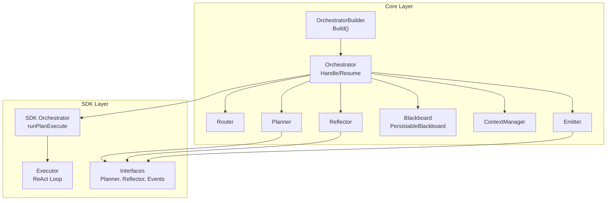

**Diagram sources**
- [builder.go:108-208](file://core/builder.go#L108-L208)
- [orchestrator.go:77-189](file://core/orchestrator.go#L77-L189)
- [interfaces.go:12-88](file://sdk/orchestration/interfaces.go#L12-L88)
- [executor.go:49-140](file://sdk/agent/executor.go#L49-L140)

**Section sources**
- [builder.go:108-208](file://core/builder.go#L108-L208)
- [orchestrator.go:77-189](file://core/orchestrator.go#L77-L189)

## Core Components
- Orchestrator: Central coordinator that routes tasks, builds plans, manages state, and delegates execution to the SDK engine. It supports first-message planning and continuation resumption, synthetic plans for simple tasks, and vector search hints injection.
- Router: Classifies user requests by domain and complexity, and decides whether clarification is needed.
- Planner: Generates DAG execution plans using either direct LLM calls or an informed ReAct exploration loop, with replan and continuation planning capabilities.
- Reflector: Produces structured self-critique insights after step failures or session-wide execution.
- Agent Executor: Implements the ReAct loop with circuit breaker protections, tool result budgeting, and context-aware execution.
- Context Manager: Manages context window compaction strategies (sliding window, summarization, hierarchical) and integrates with token tracking.
- Emitter: Event bus for orchestration and executor-level notifications, with logging wrapper support.
- Builder: Factory that assembles the orchestrator with configured LLM providers, tools, context factories, and policies.

**Section sources**
- [orchestrator.go:55-189](file://core/orchestrator.go#L55-L189)
- [router.go:22-114](file://core/router.go#L22-L114)
- [planner.go:168-421](file://core/planner.go#L168-L421)
- [reflector.go:22-80](file://core/reflector.go#L22-L80)
- [executor.go:49-140](file://sdk/agent/executor.go#L49-L140)
- [context_wrapper.go:29-68](file://core/context_wrapper.go#L29-L68)
- [emitter_logging.go:10-199](file://core/emitter_logging.go#L10-L199)
- [builder.go:108-208](file://core/builder.go#L108-L208)

## Architecture Overview
The orchestrator implements a ReAct-based Plan&Execute loop with adaptive planning. It begins by routing the user’s request to determine domain and complexity, optionally injecting vector search hints. For first messages, it either synthesizes a plan for simple tasks or invokes the Planner to generate a DAG. The SDK engine then executes the plan in parallel where possible, with per-step retries and reflection-driven replanning. The Reflector provides structured feedback to improve subsequent attempts.

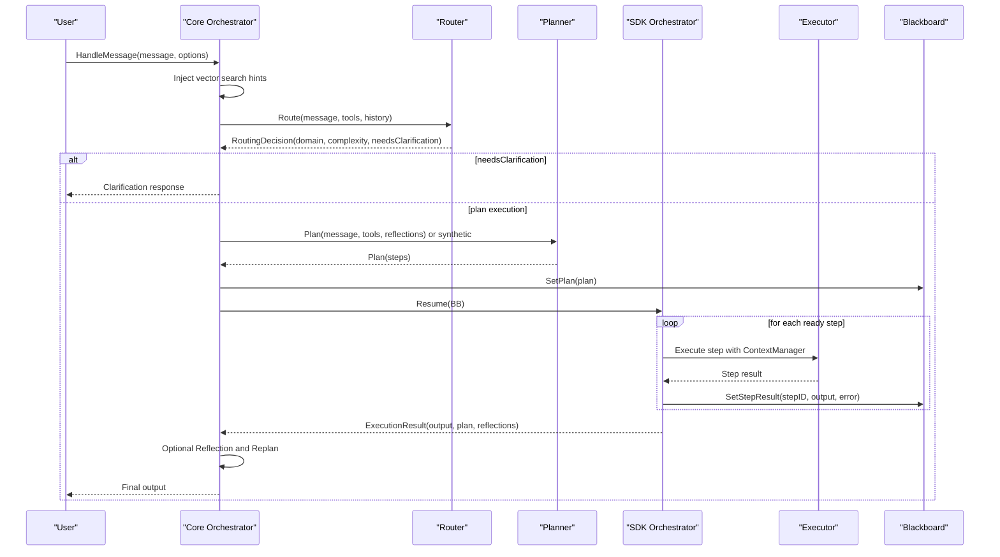

**Diagram sources**
- [orchestrator.go:338-598](file://core/orchestrator.go#L338-L598)
- [router.go:46-114](file://core/router.go#L46-L114)
- [planner.go:257-276](file://core/planner.go#L257-L276)
- [interfaces.go:12-37](file://sdk/orchestration/interfaces.go#L12-L37)
- [executor.go:49-140](file://sdk/agent/executor.go#L49-L140)

## Detailed Component Analysis

### Orchestrator: Adaptive Planning and Execution Coordinator
- Responsibilities:
  - Route incoming messages and manage conversation history.
  - Generate or resume execution plans, including synthetic plans for simple tasks.
  - Inject vector search hints for auto-RAG.
  - Manage blackboard lifecycle and persistence.
  - Wire emitter, context factory, and tracking caller per step.
  - Delegate to SDK engine for Plan&Execute and handle retries/reflections.
- Key behaviors:
  - Uses a context key to signal plan-execute mode to system prompt builders.
  - Supports first-message planning and continuation resumption.
  - Emits initial context fill metrics and routing decisions.
  - Persists routing and completion/failure states for persistent blackboards.

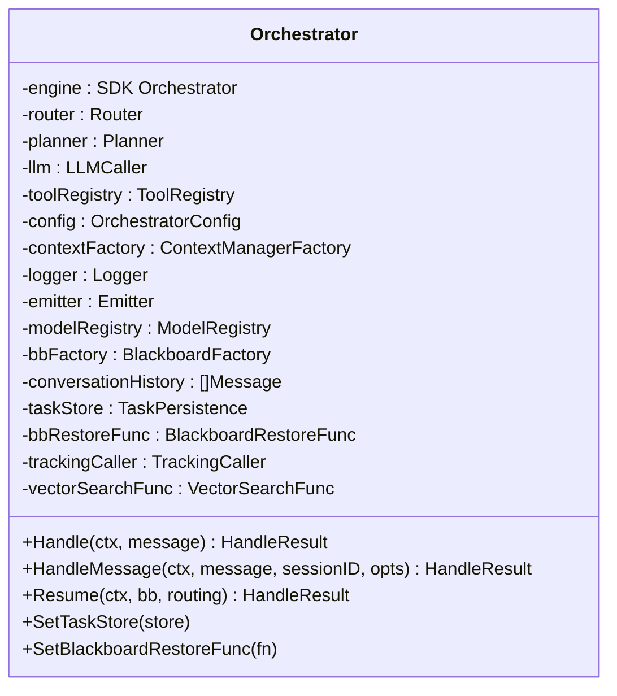

**Diagram sources**
- [orchestrator.go:55-189](file://core/orchestrator.go#L55-L189)

**Section sources**
- [orchestrator.go:55-189](file://core/orchestrator.go#L55-L189)
- [orchestrator.go:338-598](file://core/orchestrator.go#L338-L598)

### Router: Task Decomposition and Classification
- Responsibilities:
  - Classify user requests by domain (“code”, “research”, “general”, “mixed”) and complexity (1–5).
  - Decide whether clarification is needed based on ambiguity.
  - Build system prompt with available tools and recent history.
- Robustness:
  - Extracts JSON from LLM responses, handling markdown code blocks.
  - Validates and sanitizes routing decisions.

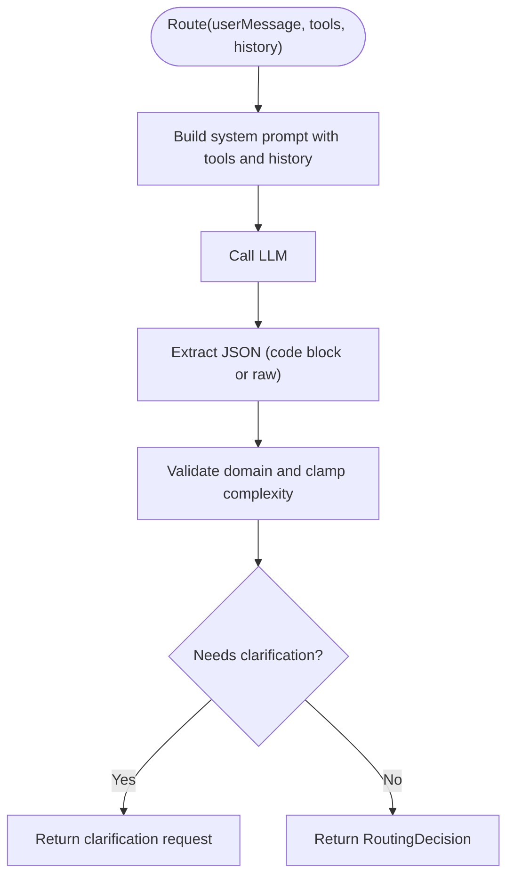

**Diagram sources**
- [router.go:46-114](file://core/router.go#L46-L114)

**Section sources**
- [router.go:22-114](file://core/router.go#L22-L114)

### Planner: Adaptive Plan Generation and Replanning
- Responsibilities:
  - Generate DAG plans using direct LLM calls or an informed ReAct exploration loop.
  - Support replan after failures and continuation planning for follow-ups.
  - Filter planner tools (codebase-memory MCP and selected filesystem tools).
- Exploration loop:
  - Creates a ContextManager with sliding compaction for exploration.
  - Runs an internal Executor with circuit breaker and tool result budget.
  - Parses plan from executor’s finish output or falls back to direct planning.

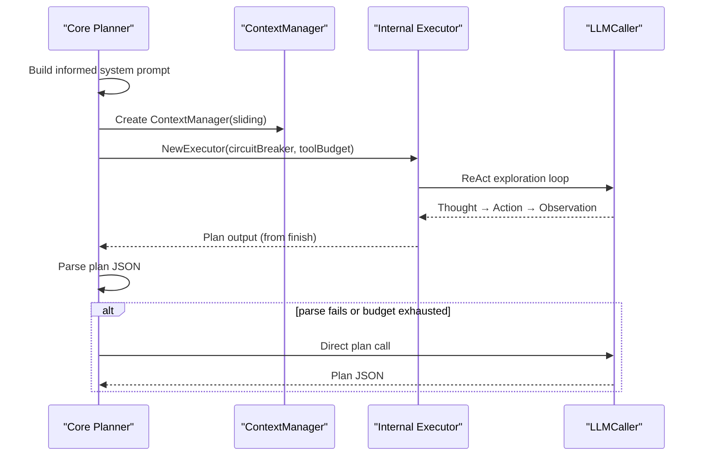

**Diagram sources**
- [planner.go:317-421](file://core/planner.go#L317-L421)
- [planner.go:257-276](file://core/planner.go#L257-L276)

**Section sources**
- [planner.go:168-421](file://core/planner.go#L168-L421)

### Reflector: Self-Critique and Improvement
- Responsibilities:
  - Analyze execution trajectory and plan to produce structured reflection.
  - Extract structured JSON with summary, root cause, suggested action, and action plan.
  - Append compact environment context for analysis.
- Decision logic:
  - Defaults suggested action to retry if unspecified or invalid.

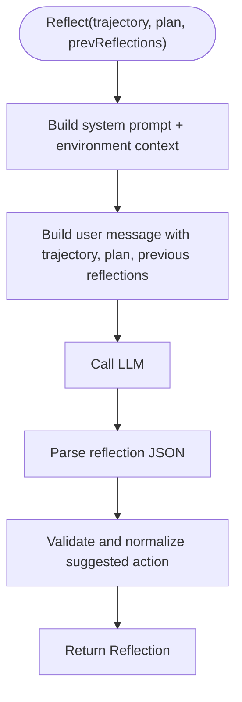

**Diagram sources**
- [reflector.go:39-80](file://core/reflector.go#L39-L80)

**Section sources**
- [reflector.go:22-80](file://core/reflector.go#L22-L80)

### Agent Executor: ReAct Loop with Circuit Breakers
- Responsibilities:
  - Execute ReAct loops with Thought → Action → Observation.
  - Enforce circuit breaker protections against repeated actions, truncation, parse errors, fruitless results, and same-tool repetition.
  - Apply tool result budgeting to prevent context overflow.
  - Emit structured events for diagnostics and progress.
- Circuit breaker thresholds:
  - Repeat nudge/abort thresholds, truncation abort threshold, parse error abort threshold, fruitless detection, and same-tool repetition detection.

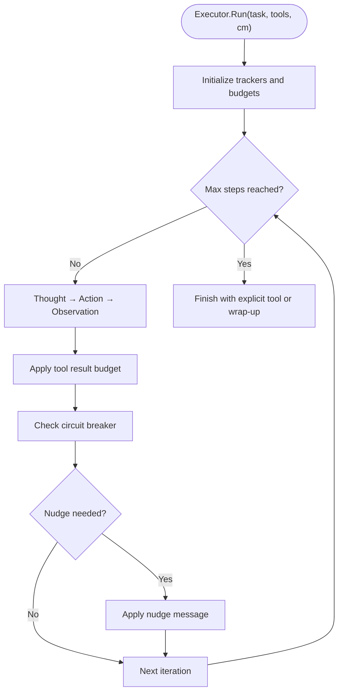

**Diagram sources**
- [executor.go:49-140](file://sdk/agent/executor.go#L49-L140)
- [executor.go:142-200](file://sdk/agent/executor.go#L142-L200)

**Section sources**
- [executor.go:49-140](file://sdk/agent/executor.go#L49-L140)
- [executor.go:142-200](file://sdk/agent/executor.go#L142-L200)

### Context Management and Memory
- ContextManagerFactory:
  - Builds ContextWindow with compaction strategies (sliding window, summarization, hierarchical).
  - Integrates token counting and context tracking for accurate fill metrics.
- CoreContextManager:
  - Wraps SDK ContextWindow and adds SetTask and SetPlanFromPlan.
  - Exposes ContextTracker for per-step token tracking correction.

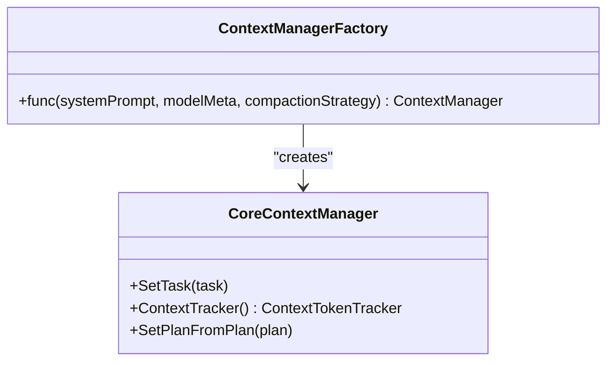

**Diagram sources**
- [context_wrapper.go:29-68](file://core/context_wrapper.go#L29-L68)
- [builder.go:473-541](file://core/builder.go#L473-L541)

**Section sources**
- [context_wrapper.go:29-68](file://core/context_wrapper.go#L29-L68)
- [builder.go:473-541](file://core/builder.go#L473-L541)

### Event-Driven Communication and Logging
- Emitter:
  - Extends agent events with orchestration-specific events (routing, plan generation, reflection, retries).
  - Nil-safe implementation with noopEmitter.
- EmitterEventsAdapter:
  - Bridges core Emitter to SDK orchestration.Events.
- LoggingEmitter:
  - Wraps emitters to log all events with structured context (planStepID, retryAttempt).

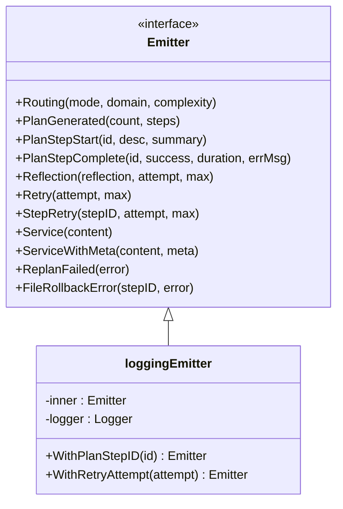

**Diagram sources**
- [types.go:110-167](file://core/types.go#L110-L167)
- [emitter_logging.go:10-199](file://core/emitter_logging.go#L10-L199)

**Section sources**
- [types.go:110-167](file://core/types.go#L110-L167)
- [emitter_logging.go:10-199](file://core/emitter_logging.go#L10-L199)

### Factory Pattern: OrchestratorBuilder
- OrchestratorBuilder:
  - Owns shared tool registry, MCP gateway, and LLM router.
  - Provides Build() to create per-session Orchestrators with fresh routers and context factories.
  - Supports runtime reconfiguration (judge, router, MCP, security).
- BuilderConfig:
  - Central configuration structure for LLM, Router, Executor, Security, Search, MCP, Orchestration, ToolLimits, and Timeouts.

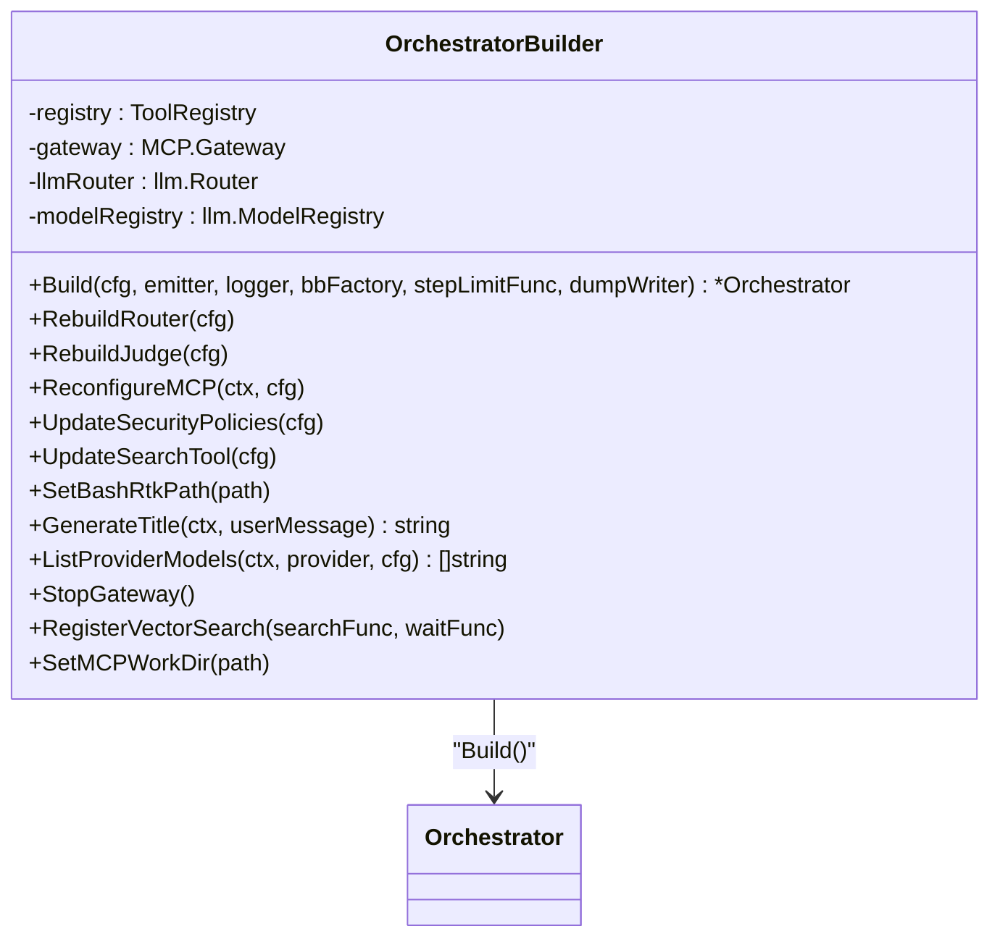

**Diagram sources**
- [builder.go:27-93](file://core/builder.go#L27-L93)
- [builder.go:108-208](file://core/builder.go#L108-L208)

**Section sources**
- [builder.go:27-93](file://core/builder.go#L27-L93)
- [builder.go:108-208](file://core/builder.go#L108-L208)
- [builderconfig.go:4-245](file://core/builderconfig.go#L4-L245)

### System Prompt Construction and Auto-RAG Hints
- System prompt composition:
  - Core orchestrator system prompt with family-specific overlays.
  - Mode-specific context injection (plan vs. single-step ReAct).
  - Environment and auto-RAG hints appended when available.
- Vector search hints:
  - Injected via context keys and summarized previews for relevant files.

**Section sources**
- [systemprompt.go:44-100](file://core/systemprompt.go#L44-L100)
- [prompts.go:109-168](file://core/prompts/prompts.go#L109-L168)

### State Management and Persistence
- Blackboard:
  - Shared state for steps, reflections, file changes, and facts.
  - Optional persistent blackboard lifecycle: set emitter, set routing, complete/fail task, reactivate.
- Task persistence:
  - Abstraction for storing and loading task state, including routing, plan, step results, reflections, and file changes.

**Section sources**
- [types.go:79-92](file://core/types.go#L79-L92)
- [persistent_blackboard.go:9-69](file://core/persistent_blackboard.go#L9-L69)

## Dependency Analysis
The core orchestrator composes auxiliary agents and delegates execution to the SDK engine. Dependencies are loosely coupled via interfaces, enabling flexible configuration and runtime reconfiguration.

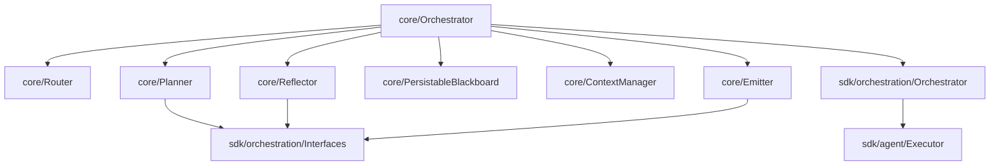

**Diagram sources**
- [orchestrator.go:55-189](file://core/orchestrator.go#L55-L189)
- [interfaces.go:12-88](file://sdk/orchestration/interfaces.go#L12-L88)
- [executor.go:49-140](file://sdk/agent/executor.go#L49-L140)

**Section sources**
- [orchestrator.go:55-189](file://core/orchestrator.go#L55-L189)
- [interfaces.go:12-88](file://sdk/orchestration/interfaces.go#L12-L88)

## Performance Considerations
- Synthetic plans:
  - For low-complexity tasks, synthetic plans avoid expensive LLM planning calls while preserving plan structure.
- Tool result budgeting:
  - Adaptive truncation based on available tokens and hard caps prevents context overflow and reduces latency.
- Circuit breaker protections:
  - Prevents infinite loops and wasted compute on repeated failures, truncation, parse errors, fruitless searches, and same-tool repetition.
- Context compaction:
  - Sliding window, summarization, and hierarchical strategies maintain context quality under long executions.
- Vector search hints:
  - Non-blocking auto-RAG hints reduce irrelevant tool calls by surfacing likely files early.
- Retry strategy:
  - Outer retries plus per-step retries with reflection-guided replanning balance robustness and cost.

[No sources needed since this section provides general guidance]

## Troubleshooting Guide
- Router JSON parsing:
  - If LLM response is not valid JSON, the Router applies a repair prompt and retries.
- Planner fallbacks:
  - Exploration executor failures or empty outputs trigger direct planning fallback.
- Reflection and replan:
  - Reflection errors are tolerated; replan failures are logged and execution continues without replan.
- Circuit breaker triggers:
  - Nudges guide corrective actions; abort thresholds terminate problematic loops.
- File rollback:
  - On max retries, file changes are rolled back to maintain workspace integrity.

**Section sources**
- [router.go:85-114](file://core/router.go#L85-L114)
- [planner.go:390-421](file://core/planner.go#L390-L421)
- [sdk/orchestration/orchestrator.go:257-346](file://sdk/orchestration/orchestrator.go#L257-L346)
- [executor.go:142-200](file://sdk/agent/executor.go#L142-L200)

## Conclusion
C0WRK’s core AI engine combines adaptive planning, robust execution, and reflective improvement into a scalable, event-driven system. The OrchestratorBuilder factory pattern enables dynamic configuration and runtime reconfiguration, while the SDK orchestration engine provides a reliable Plan&Execute foundation. Circuit breakers, context management, and synthetic plans optimize performance and reliability. The modular design supports integration with diverse LLM providers and external tools, ensuring extensibility and maintainability.