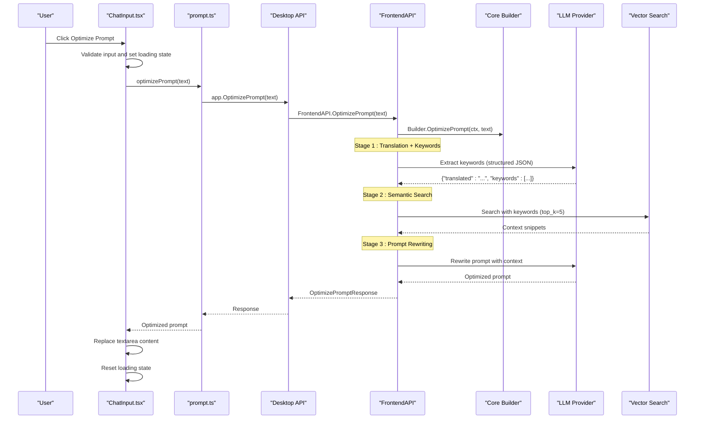
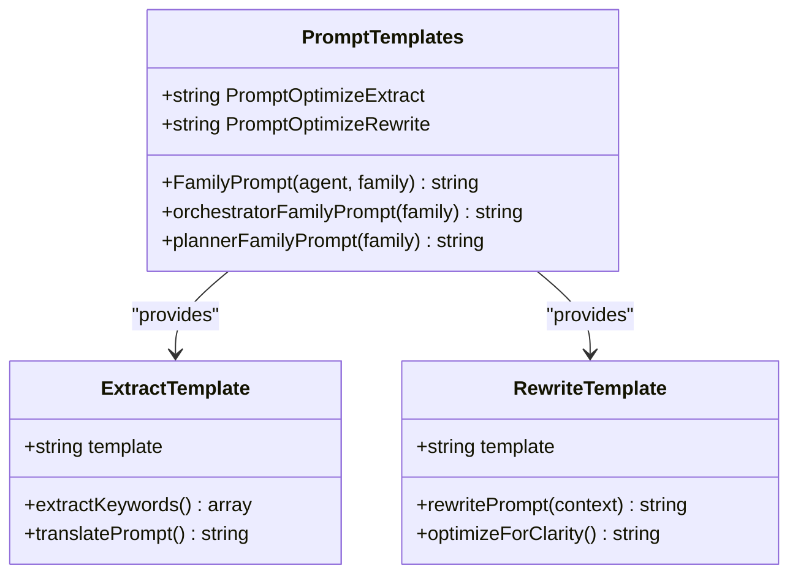
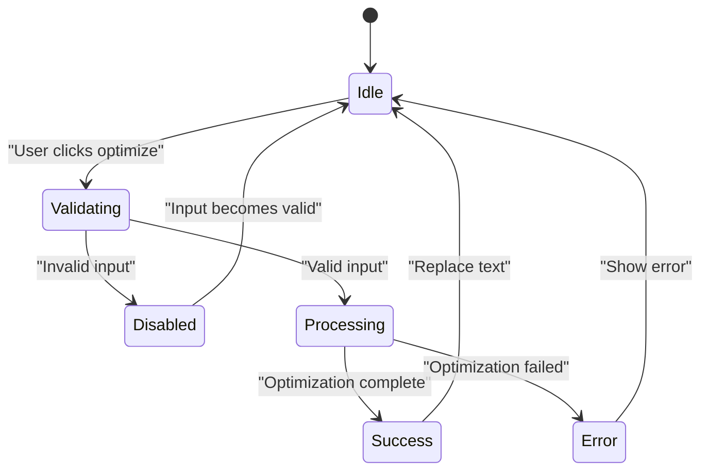

# Prompt Optimization Feature

<cite>
**Referenced Files in This Document**
- [prompt-optimization-spec.md](file://specs/prompt-optimization-spec.md)
- [prompt-optimization-roadmap.md](file://specs/prompt-optimization-roadmap.md)
- [ChatInput.tsx](file://frontend/src/components/chat/ChatInput.tsx)
- [prompt.ts](file://frontend/src/api/prompt.ts)
- [chat.ts](file://frontend/src/api/chat.ts)
- [frontend_api_prompt.go](file://backend/frontend_api_prompt.go)
- [prompts.go](file://core/prompts/prompts.go)
- [prompt_optimize_extract.md](file://core/prompts/prompt_optimize_extract.md)
- [prompt_optimize_rewrite.md](file://core/prompts/prompt_optimize_rewrite.md)
- [types.go](file://backend/types.go)
- [provider.go](file://sdk/llm/provider.go)
</cite>

## Table of Contents
1. [Introduction](#introduction)
2. [Feature Overview](#feature-overview)
3. [Architecture Overview](#architecture-overview)
4. [Core Components](#core-components)
5. [Algorithm Implementation](#algorithm-implementation)
6. [Frontend Integration](#frontend-integration)
7. [Backend Implementation](#backend-implementation)
8. [Data Contracts](#data-contracts)
9. [Error Handling](#error-handling)
10. [Performance Considerations](#performance-considerations)
11. [Testing Strategy](#testing-strategy)
12. [Rollout Considerations](#rollout-considerations)
13. [Conclusion](#conclusion)

## Introduction

The Prompt Optimization Feature is a user-triggered enhancement that automatically improves the quality and specificity of user prompts for AI coding agents. This feature implements a sophisticated three-stage pipeline that translates user input to English, extracts relevant keywords, performs semantic search, and generates an optimized prompt that is more specific, actionable, and effective for AI coding tasks.

The implementation follows the project's layered architecture constraints, ensuring proper separation of concerns between frontend, desktop, backend, and core components while maintaining security and performance standards.

## Feature Overview

### Key Capabilities

The prompt optimization feature provides users with an intelligent tool to enhance their prompts through:

- **Automatic Translation**: Converts prompts from any language to English for optimal processing
- **Keyword Extraction**: Identifies 3-5 concise keywords suitable for semantic search
- **Semantic Enhancement**: Retrieves relevant codebase context using vector search
- **Intelligent Rewriting**: Generates a more specific, actionable prompt based on extracted context

### User Experience

Users can trigger optimization by clicking a dedicated button in the chat input area, which:
- Validates input and prevents duplicate requests
- Shows loading states during processing
- Replaces the current input with the optimized version
- Handles errors gracefully without losing user input

## Architecture Overview

**Diagram sources**
- [ChatInput.tsx:110-121](file://frontend/src/components/chat/ChatInput.tsx#L110-L121)
- [prompt.ts:12-20](file://frontend/src/api/prompt.ts#L12-L20)
- [frontend_api_prompt.go:13-36](file://backend/frontend_api_prompt.go#L13-L36)

## Core Components

### Prompt Templates

The feature leverages specialized prompt templates for each stage of the optimization pipeline:

**Diagram sources**
- [prompts.go:109-115](file://core/prompts/prompts.go#L109-L115)
- [prompt_optimize_extract.md:1-12](file://core/prompts/prompt_optimize_extract.md#L1-L12)
- [prompt_optimize_rewrite.md:1-19](file://core/prompts/prompt_optimize_rewrite.md#L1-L19)

**Section sources**
- [prompts.go:109-115](file://core/prompts/prompts.go#L109-L115)
- [prompt_optimize_extract.md:1-12](file://core/prompts/prompt_optimize_extract.md#L1-L12)
- [prompt_optimize_rewrite.md:1-19](file://core/prompts/prompt_optimize_rewrite.md#L1-L19)

### Algorithm Stages

The optimization pipeline consists of three distinct stages:

1. **Translation and Keyword Extraction**: Translates prompts to English and extracts 3-5 relevant keywords
2. **Semantic Search**: Queries vector index with extracted keywords to retrieve context
3. **Prompt Rewriting**: Generates an optimized, more specific prompt using the extracted context

**Section sources**
- [prompt-optimization-spec.md:163-217](file://specs/prompt-optimization-spec.md#L163-L217)

## Algorithm Implementation

### Stage 1: Translation and Keyword Extraction

The first stage processes user input through a structured JSON extraction prompt that:
- Translates the prompt to English while preserving technical terminology
- Extracts 3-5 concise keywords for semantic search
- Returns a JSON object with both translated text and keywords

### Stage 2: Semantic Search

The system enforces a strict `top_k=5` constraint for semantic search results, ensuring:
- Consistent context retrieval regardless of search provider
- Balanced performance vs. relevance trade-off
- Support for fewer than 5 results without failing the operation

### Stage 3: Prompt Rewriting

The final stage generates an optimized prompt that:
- Maintains the user's original intent exactly
- Adds specificity through concrete file paths and function names
- Organizes multi-step tasks logically
- Preserves technical accuracy while removing vagueness

**Section sources**
- [prompt-optimization-spec.md:286-300](file://specs/prompt-optimization-spec.md#L286-L300)

## Frontend Integration

### ChatInput Component Enhancement

The frontend implementation adds a dedicated optimization button with comprehensive state management:

**Diagram sources**
- [ChatInput.tsx:22-251](file://frontend/src/components/chat/ChatInput.tsx#L22-L251)

### API Integration

The frontend API wrapper maintains consistency with existing patterns:
- Uses established `getApp()` pattern for desktop access
- Implements proper error handling and logging
- Supports cancellation through AbortSignal where available

**Section sources**
- [ChatInput.tsx:110-121](file://frontend/src/components/chat/ChatInput.tsx#L110-L121)
- [prompt.ts:12-20](file://frontend/src/api/prompt.ts#L12-L20)

## Backend Implementation

### FrontendAPI Layer

The backend implementation follows the established pattern for frontend API methods:
- Validates input and handles empty prompts gracefully
- Integrates with the application builder for core functionality
- Provides structured response formatting for frontend consumption

### Core Integration

The backend orchestrates the three-stage pipeline through the core builder, ensuring:
- Proper context management throughout the optimization process
- Consistent error handling and logging
- Respect for existing security and tool policy configurations

**Section sources**
- [frontend_api_prompt.go:13-36](file://backend/frontend_api_prompt.go#L13-L36)
- [types.go:158-160](file://backend/types.go#L158-L160)

## Data Contracts

### Request DTO

The optimization request follows a structured format designed for extensibility:

| Field | Type | Description | Required |
|-------|------|-------------|----------|
| `prompt` | string | User's input prompt text | Yes |
| `sessionId` | string | Active session identifier | Yes |
| `projectId` | string \| null | Project context if available | No |
| `topK` | number | Number of results to retrieve (enforced to 5) | No |
| `includeDebug` | boolean | Include debug metadata in response | No |

### Response DTO

The optimization response provides essential information for UI replacement:

| Field | Type | Description |
|-------|------|-------------|
| `optimizedPrompt` | string | The enhanced prompt text |
| `translatedPromptEn` | string | English translation of original |
| `keywords` | string[] | Extracted keyword phrases |
| `searchResults` | array | Retrieved context snippets |
| `meta` | object | Performance and diagnostic metadata |

**Section sources**
- [prompt-optimization-spec.md:222-283](file://specs/prompt-optimization-spec.md#L222-L283)

## Error Handling

### Error Classification

The system implements a comprehensive error taxonomy:

| Error Code | Description | Handling |
|------------|-------------|----------|
| `OPTIMIZE_INVALID_ARGUMENT` | Empty prompt or missing context | Immediate rejection |
| `OPTIMIZE_TRANSLATION_FAILED` | LLM call failure in stage 1 | Retry with fallback |
| `OPTIMIZE_PARSE_FAILED` | Malformed JSON from extraction | Structured error |
| `OPTIMIZE_NO_KEYWORDS` | Empty keyword extraction | Informative error |
| `OPTIMIZE_SEARCH_FAILED` | Vector search transport error | Strict failure (V1) |
| `OPTIMIZE_REWRITE_FAILED` | LLM call failure in stage 3 | Graceful degradation |
| `OPTIMIZE_TIMEOUT` | Request exceeded timeout | Timeout error |
| `OPTIMIZE_CANCELED` | User/system cancellation | Safe cleanup |

### Error Propagation

Errors flow consistently through the system:
1. Backend captures and categorizes errors
2. Desktop API maps errors to frontend-friendly format
3. Frontend displays user-safe error messages
4. Detailed diagnostics remain in logs for debugging

**Section sources**
- [prompt-optimization-spec.md:266-283](file://specs/prompt-optimization-spec.md#L266-L283)

## Performance Considerations

### Latency Targets

The implementation targets specific performance benchmarks:
- **p50**: ≤ 2.5 seconds
- **p95**: ≤ 6.0 seconds  
- **Hard timeout**: 12 seconds configurable

### Optimization Strategies

To meet performance requirements:
- Sequential LLM calls are optimized for minimal latency
- Vector search is constrained to top_k=5 for balanced performance
- Context caching mechanisms are available for future enhancement
- Timeout guards prevent resource exhaustion

### Monitoring and Logging

Comprehensive logging captures:
- Per-step processing times
- Total request duration
- Error rates and patterns
- Resource utilization metrics

**Section sources**
- [prompt-optimization-spec.md:305-333](file://specs/prompt-optimization-spec.md#L305-L333)

## Testing Strategy

### Unit Testing Approach

The testing strategy covers all critical failure modes:

1. **Desktop API Tests**: Input validation, error mapping, success scenarios
2. **Backend Orchestration Tests**: Happy path, parse failures, search errors, timeouts
3. **Contract Tests**: JSON marshaling/unmarshaling, field validation
4. **Frontend Tests**: Manual verification through typecheck and UI checks

### Verification Gates

Implementation progress is verified through:
- `make test` for comprehensive repository testing
- Manual QA checklists for frontend integration
- Performance benchmark validation
- Error handling scenario testing

**Section sources**
- [prompt-optimization-roadmap.md:239-279](file://specs/prompt-optimization-roadmap.md#L239-L279)

## Rollout Considerations

### Deployment Strategy

The feature can be deployed with minimal disruption:
- **Direct rollout**: Ship in chat mode without additional gating
- **Feature flag**: Optional behind settings gate if existing mechanism exists
- **Gradual adoption**: Monitor usage patterns and quality metrics

### Operational Readiness

Post-deployment monitoring focuses on:
- Optimization request failure rates
- Latency percentile tracking against targets
- User feedback on prompt quality improvements
- Security and policy compliance validation

### Future Enhancements

The current implementation provides foundation for:
- Configurable `top_k` values
- User-selectable optimization styles
- Language control options
- Preview diff functionality
- Context caching for improved performance

**Section sources**
- [prompt-optimization-roadmap.md:292-312](file://specs/prompt-optimization-roadmap.md#L292-L312)

## Conclusion

The Prompt Optimization Feature represents a significant enhancement to the AI coding agent's usability, providing users with intelligent prompt improvement capabilities while maintaining the project's architectural integrity and performance standards. The implementation successfully balances sophistication with reliability, offering a robust foundation for future enhancements while delivering immediate value through improved prompt quality and user experience.

Through careful attention to error handling, performance optimization, and user experience design, this feature integrates seamlessly with the existing system architecture while providing clear pathways for future expansion and refinement.