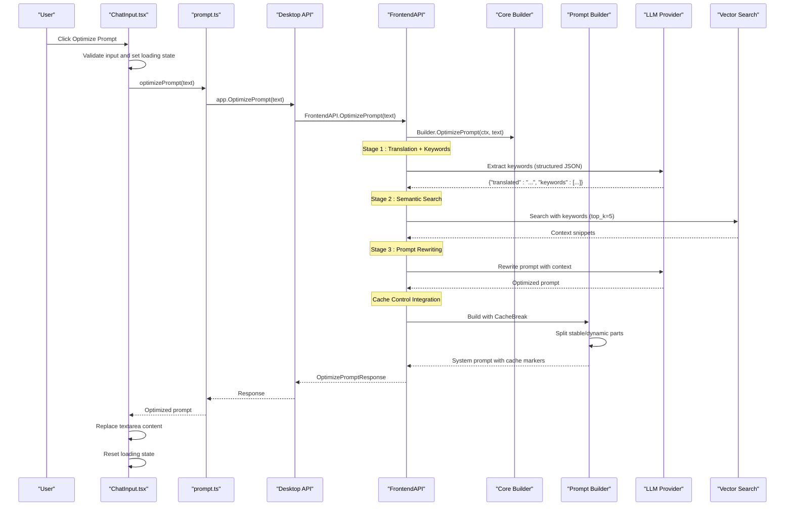
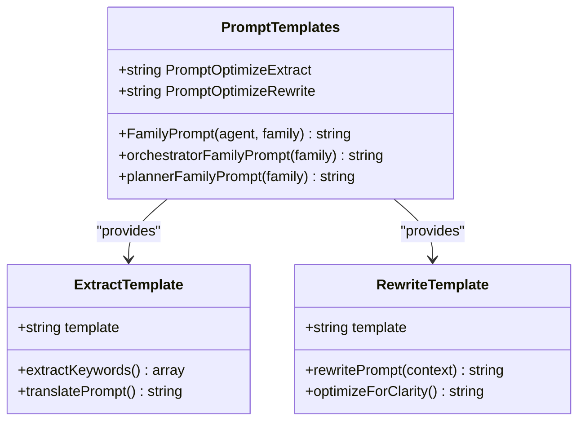
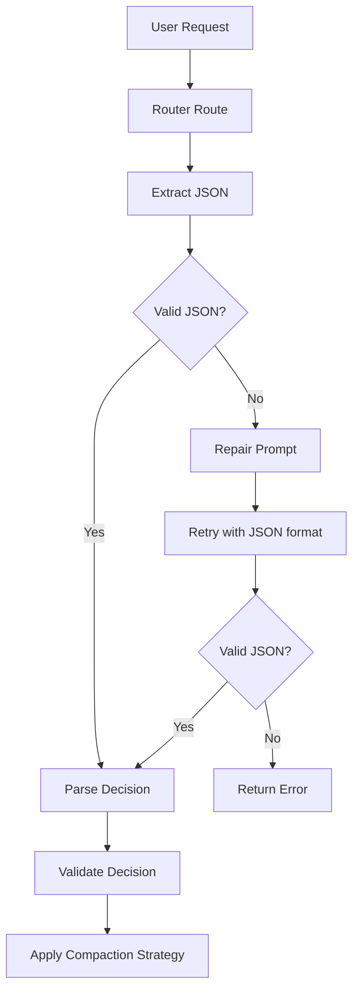
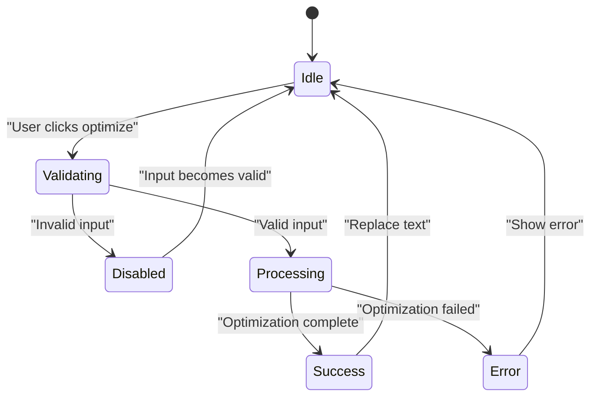

# Prompt Optimization Feature

<cite>
**Referenced Files in This Document**
- [prompt-review-report.md](file://docs/prompt-review-report.md)
- [prompt-optimization-spec.md](file://specs/prompt-optimization-spec.md)
- [prompt-optimization-roadmap.md](file://specs/prompt-optimization-roadmap.md)
- [ChatInput.tsx](file://frontend/src/components/chat/ChatInput.tsx)
- [prompt.ts](file://frontend/src/api/prompt.ts)
- [chat.ts](file://frontend/src/api/chat.ts)
- [frontend_api_prompt.go](file://backend/frontend_api_prompt.go)
- [prompts.go](file://core/prompts/prompts.go)
- [prompt_optimize_extract.md](file://core/prompts/prompt_optimize_extract.md)
- [prompt_optimize_rewrite.md](file://core/prompts/prompt_optimize_rewrite.md)
- [builder.go](file://core/builder.go)
- [types.go](file://backend/types.go)
- [provider.go](file://sdk/llm/provider.go)
- [builder.go](file://sdk/prompt/builder.go)
- [provider_anthropic.go](file://sdk/llm/provider_anthropic.go)
- [provider_helpers.go](file://sdk/llm/provider_helpers.go)
- [systemprompt.go](file://core/systemprompt.go)
- [router.go](file://core/router.go)
- [router.go](file://sdk/llm/router.go)
- [orchestrator_system.md](file://core/prompts/orchestrator_system.md)
- [planner_base.md](file://core/prompts/planner_base.md)
- [router_system.md](file://core/prompts/router_system.md)
- [reflector_system.md](file://core/prompts/reflector_system.md)
- [planner.go](file://core/planner.go)
</cite>

## Update Summary
**Changes Made**
- Updated documentation to reflect the comprehensive prompt review report analysis
- Added detailed analysis of 46 distinct prompt artifacts organized by type and family
- Incorporated strength assessments and recommendations for all system prompts
- Enhanced understanding of prompt architecture patterns and improvement priorities
- Updated sections to reference the comprehensive analysis rather than external reports

## Table of Contents
1. [Introduction](#introduction)
2. [Feature Overview](#feature-overview)
3. [Architecture Overview](#architecture-overview)
4. [Core Components](#core-components)
5. [Algorithm Implementation](#algorithm-implementation)
6. [Frontend Integration](#frontend-integration)
7. [Backend Implementation](#backend-implementations)
8. [Data Contracts](#data-contracts)
9. [Error Handling](#error-handling)
10. [Performance Considerations](#performance-considerations)
11. [Testing Strategy](#testing-strategy)
12. [Rollout Considerations](#rollout-considerations)
13. [Comprehensive Prompt Analysis](#comprehensive-prompt-analysis)
14. [Conclusion](#conclusion)

## Introduction

The Prompt Optimization Feature is a user-triggered enhancement that automatically improves the quality and specificity of user prompts for AI coding agents. This feature implements a sophisticated three-stage pipeline that translates user input to English, extracts relevant keywords, performs semantic search, and generates an optimized prompt that is more specific, actionable, and effective for AI coding tasks.

The implementation follows the project's layered architecture constraints, ensuring proper separation of concerns between frontend, desktop, backend, and core components while maintaining security and performance standards. The feature leverages specialized prompt templates and integrates seamlessly with the existing LLM provider infrastructure and vector search capabilities.

**Updated** Enhanced with comprehensive analysis of 46 distinct prompt artifacts, revealing architectural patterns and improvement opportunities across the entire prompt ecosystem.

## Feature Overview

### Key Capabilities

The prompt optimization feature provides users with an intelligent tool to enhance their prompts through:

- **Automatic Translation**: Converts prompts from any language to English for optimal processing
- **Keyword Extraction**: Identifies 3-5 concise keywords suitable for semantic search
- **Semantic Enhancement**: Retrieves relevant codebase context using vector search
- **Intelligent Rewriting**: Generates a more specific, actionable prompt based on extracted context
- **Cache Control**: Implements Anthropic-compatible cache control for improved performance
- **System Prompt Optimization**: Enhanced system prompt construction with dynamic content separation

### User Experience

Users can trigger optimization by clicking a dedicated button in the chat input area, which:
- Validates input and prevents duplicate requests
- Shows loading states during processing
- Replaces the current input with the optimized version
- Handles errors gracefully without losing user input

## Architecture Overview



**Diagram sources**
- [ChatInput.tsx:110-121](file://frontend/src/components/chat/ChatInput.tsx#L110-L121)
- [prompt.ts:12-20](file://frontend/src/api/prompt.ts#L12-L20)
- [frontend_api_prompt.go:13-36](file://backend/frontend_api_prompt.go#L13-L36)
- [builder.go:96-113](file://core/builder.go#L96-L113)

## Core Components

### Prompt Templates

The feature leverages specialized prompt templates for each stage of the optimization pipeline:



**Diagram sources**
- [prompts.go:109-115](file://core/prompts/prompts.go#L109-L115)
- [prompt_optimize_extract.md:1-12](file://core/prompts/prompt_optimize_extract.md#L1-L12)
- [prompt_optimize_rewrite.md:1-19](file://core/prompts/prompt_optimize_rewrite.md#L1-L19)

**Section sources**
- [prompts.go:109-115](file://core/prompts/prompts.go#L109-L115)
- [prompt_optimize_extract.md:1-12](file://core/prompts/prompt_optimize_extract.md#L1-L12)
- [prompt_optimize_rewrite.md:1-19](file://core/prompts/prompt_optimize_rewrite.md#L1-L19)

### Cache Control Mechanisms

Enhanced with Anthropic-compatible cache control implementation

The system now implements sophisticated cache control mechanisms for improved performance with Anthropic models:

#### CacheBreak Marker System
- **CacheBreakMarker**: Sentinel `\x00CACHE_BREAK\x00` used to separate stable and dynamic prompt content
- **SplitCacheBreak**: Function that splits system prompts on cache break markers into manageable parts
- **CacheBreak() Method**: Builder method that marks the boundary between stable (cacheable) and dynamic content

#### Anthropic Cache Control Implementation
- **MultiSystem Parts**: System prompts are split into multiple parts for Anthropic's ephemeral cache control
- **Cache Control Types**: Stable parts receive `CacheControlTypeEphemeral`, dynamic parts remain uncached
- **Provider-Level Caching**: Enables Anthropic's native prompt caching for improved latency

```mermaid
flowchart TD
A[System Prompt] --> B[CacheBreakMarker]
B --> C[SplitCacheBreak]
C --> D[Part 1 - Stable]
C --> E[Part 2 - Dynamic]
D --> F[Anthropic MultiSystem[0]]
F --> G[CacheControl: Ephemeral]
E --> H[Anthropic MultiSystem[1]]
H --> I[CacheControl: None]
G --> J[Combined Request]
I --> J
```

**Diagram sources**
- [builder.go:5-24](file://sdk/prompt/builder.go#L5-L24)
- [builder.go:66-72](file://sdk/prompt/builder.go#L66-L72)
- [provider_anthropic.go:197-215](file://sdk/llm/provider_anthropic.go#L197-L215)

**Section sources**
- [builder.go:5-24](file://sdk/prompt/builder.go#L5-L24)
- [builder.go:66-72](file://sdk/prompt/builder.go#L66-L72)
- [provider_anthropic.go:197-215](file://sdk/llm/provider_anthropic.go#L197-L215)
- [provider_helpers.go:45-60](file://sdk/llm/provider_helpers.go#L45-L60)

### ExtractSystemPromptParts Functionality

Improved system prompt construction with ExtractSystemPromptParts

The system now includes enhanced functionality for extracting and managing system prompt parts:

- **ExtractSystemPromptParts**: Function that separates system messages from other messages
- **Multi-Part Preservation**: Maintains system prompt structure for cache control compatibility
- **Filtered Messages**: Returns remaining non-system messages for normal processing

**Section sources**
- [provider_helpers.go:45-60](file://sdk/llm/provider_helpers.go#L45-L60)
- [provider_anthropic.go:175-176](file://sdk/llm/provider_anthropic.go#L175-L176)

### Enhanced Router Logic for Prompt Validation

New section documenting improved router capabilities

The router system has been enhanced with improved prompt validation and classification capabilities:

#### Advanced Prompt Classification
- **Complexity Scoring**: Ranks prompts from 1-5 based on task complexity
- **Domain Classification**: Categorizes requests into code, research, general, or mixed domains
- **Skill Matching**: Identifies relevant skills for prompt processing
- **Validation Logic**: Sanitizes and corrects routing decisions

#### JSON Extraction and Repair
- **Markdown Code Block Handling**: Extracts JSON from fenced code blocks
- **Raw JSON Detection**: Finds JSON objects in plain text
- **Repair Mechanism**: Retries with repair prompts when JSON parsing fails



**Diagram sources**
- [router.go:52-127](file://core/router.go#L52-L127)
- [router.go:129-148](file://core/router.go#L129-L148)

**Section sources**
- [router.go:52-127](file://core/router.go#L52-L127)
- [router.go:129-148](file://core/router.go#L129-L148)

### Algorithm Stages

The optimization pipeline consists of three distinct stages:

1. **Translation and Keyword Extraction**: Translates prompts to English and extracts 3-5 relevant keywords
2. **Semantic Search**: Queries vector index with extracted keywords to retrieve context
3. **Prompt Rewriting**: Generates an optimized prompt using the extracted context

**Section sources**
- [prompt-optimization-spec.md:163-217](file://specs/prompt-optimization-spec.md#L163-L217)

## Algorithm Implementation

### Stage 1: Translation and Keyword Extraction

The first stage processes user input through a structured JSON extraction prompt that:
- Translates the prompt to English while preserving technical terminology
- Extracts 3-5 concise keywords for semantic search
- Returns a JSON object with both translated text and keywords

### Stage 2: Semantic Search

The system enforces a strict `top_k=5` constraint for semantic search results, ensuring:
- Consistent context retrieval regardless of search provider
- Balanced performance vs. relevance trade-off
- Support for fewer than 5 results without failing the operation

### Stage 3: Prompt Rewriting

The final stage generates an optimized prompt that:
- Maintains the user's original intent exactly
- Adds specificity through concrete file paths and function names
- Organizes multi-step tasks logically
- Preserves technical accuracy while removing vagueness

**Section sources**
- [prompt-optimization-spec.md:286-300](file://specs/prompt-optimization-spec.md#L286-L300)

## Frontend Integration

### ChatInput Component Enhancement

The frontend implementation adds a dedicated optimization button with comprehensive state management:



**Diagram sources**
- [ChatInput.tsx:22-251](file://frontend/src/components/chat/ChatInput.tsx#L22-L251)

### API Integration

The frontend API wrapper maintains consistency with existing patterns:
- Uses established `getApp()` pattern for desktop access
- Implements proper error handling and logging
- Supports cancellation through AbortSignal where available

**Section sources**
- [ChatInput.tsx:110-121](file://frontend/src/components/chat/ChatInput.tsx#L110-L121)
- [prompt.ts:12-20](file://frontend/src/api/prompt.ts#L12-L20)

## Backend Implementation

### FrontendAPI Layer

The backend implementation follows the established pattern for frontend API methods:
- Validates input and handles empty prompts gracefully
- Integrates with the application builder for core functionality
- Provides structured response formatting for frontend consumption

### Core Integration

The backend orchestrates the three-stage pipeline through the core builder, ensuring:
- Proper context management throughout the optimization process
- Consistent error handling and logging
- Respect for existing security and tool policy configurations

**Section sources**
- [frontend_api_prompt.go:13-36](file://backend/frontend_api_prompt.go#L13-L36)
- [types.go:158-160](file://backend/types.go#L158-L160)

## Data Contracts

### Request DTO

The optimization request follows a structured format designed for extensibility:

| Field | Type | Description | Required |
|-------|------|-------------|----------|
| `prompt` | string | User's input prompt text | Yes |
| `sessionId` | string | Active session identifier | Yes |
| `projectId` | string \| null | Project context if available | No |
| `topK` | number | Number of results to retrieve (enforced to 5) | No |
| `includeDebug` | boolean | Include debug metadata in response | No |

### Response DTO

The optimization response provides essential information for UI replacement:

| Field | Type | Description |
|-------|------|-------------|
| `optimizedPrompt` | string | The enhanced prompt text |
| `translatedPromptEn` | string | The translated English prompt |
| `keywords` | string[] | Extracted keyword phrases |
| `searchResults` | array | Retrieved context snippets |
| `meta` | object | Performance and execution metadata |

**Section sources**
- [prompt-optimization-spec.md:222-283](file://specs/prompt-optimization-spec.md#L222-L283)

## Error Handling

### Error Classification

The system implements a comprehensive error taxonomy:

| Error Code | Description | Handling |
|------------|-------------|----------|
| `OPTIMIZE_INVALID_ARGUMENT` | Empty prompt or missing context | Immediate rejection |
| `OPTIMIZE_TRANSLATION_FAILED` | LLM call failure in stage 1 | Retry with fallback |
| `OPTIMIZE_PARSE_FAILED` | Malformed JSON from extraction | Structured error |
| `OPTIMIZE_NO_KEYWORDS` | Empty keyword extraction | Informative error |
| `OPTIMIZE_SEARCH_FAILED` | Vector search transport error | Strict failure (V1) |
| `OPTIMIZE_REWRITE_FAILED` | LLM call failure in stage 3 | Graceful degradation |
| `OPTIMIZE_TIMEOUT` | Request exceeded timeout | Timeout error |
| `OPTIMIZE_CANCELED` | User/system cancellation | Safe cleanup |

### Error Propagation

Errors flow consistently through the system:
1. Backend captures and categorizes errors
2. Desktop API maps errors to frontend-friendly format
3. Frontend displays user-safe error messages
4. Detailed diagnostics remain in logs for debugging

**Section sources**
- [prompt-optimization-spec.md:266-283](file://specs/prompt-optimization-spec.md#L266-L283)

## Performance Considerations

### Latency Targets

The implementation targets specific performance benchmarks:
- **p50**: ≤ 2.5 seconds
- **p95**: ≤ 6.0 seconds  
- **Hard timeout**: 12 seconds configurable

### Cache Control Benefits

Enhanced with cache control optimizations

The new cache control mechanisms provide significant performance improvements:

- **Anthropic Ephemeral Cache**: Stable system prompt parts cached across requests
- **Reduced API Calls**: Cached system prompts eliminate redundant processing
- **Improved Response Times**: Cached content served instantly for subsequent requests
- **Provider-Specific Optimization**: Leverages Anthropic's native caching infrastructure

### Optimization Strategies

To meet performance requirements:
- Sequential LLM calls are optimized for minimal latency
- Vector search is constrained to top_k=5 for balanced performance
- Context caching mechanisms are available for future enhancement
- Timeout guards prevent resource exhaustion
- Cache control reduces repeated computation for stable content

### Monitoring and Logging

Comprehensive logging captures:
- Per-step processing times
- Total request duration
- Error rates and patterns
- Resource utilization metrics
- Cache hit rates and effectiveness

**Section sources**
- [prompt-optimization-spec.md:305-333](file://specs/prompt-optimization-spec.md#L305-L333)
- [provider_anthropic.go:197-215](file://sdk/llm/provider_anthropic.go#L197-L215)

## Testing Strategy

### Unit Testing Approach

The testing strategy covers all critical failure modes:

1. **Desktop API Tests**: Input validation, error mapping, success scenarios
2. **Backend Orchestration Tests**: Happy path, parse failures, search errors, timeouts
3. **Contract Tests**: JSON marshaling/unmarshaling, field validation
4. **Frontend Tests**: Manual verification through typecheck and UI checks
5. **Cache Control Tests**: Anthropic cache behavior, multi-system parts handling
6. **Router Logic Tests**: Prompt classification, JSON extraction, validation

### Verification Gates

Implementation progress is verified through:
- `make test` for comprehensive repository testing
- Manual QA checklists for frontend integration
- Performance benchmark validation
- Error handling scenario testing
- Cache control functionality verification
- Router logic validation and prompt classification accuracy

**Section sources**
- [prompt-optimization-roadmap.md:239-279](file://specs/prompt-optimization-roadmap.md#L239-L279)

## Rollout Considerations

### Deployment Strategy

The feature can be deployed with minimal disruption:
- **Direct rollout**: Ship in chat mode without additional gating
- **Feature flag**: Optional behind settings gate if existing mechanism exists
- **Gradual adoption**: Monitor usage patterns and quality metrics

### Operational Readiness

Post-deployment monitoring focuses on:
- Optimization request failure rates
- Latency percentile tracking against targets
- User feedback on prompt quality improvements
- Security and policy compliance validation
- Cache effectiveness metrics and performance improvements
- Router classification accuracy and prompt validation effectiveness

### Future Enhancements

The current implementation provides foundation for:
- Configurable `top_k` values
- User-selectable optimization styles
- Language control options
- Preview diff functionality
- Context caching for improved performance
- Advanced cache control strategies
- Enhanced router logic for better prompt validation

**Section sources**
- [prompt-optimization-roadmap.md:292-312](file://specs/prompt-optimization-roadmap.md#L292-L312)

## Comprehensive Prompt Analysis

### 46 Distinct Prompt Artifacts Analysis

The comprehensive prompt review report analyzes 46 distinct prompt artifacts organized across multiple categories, revealing critical insights into the system's prompt architecture and optimization opportunities.

#### Orchestrator System Prompts

The core orchestrator system prompt establishes fundamental agent behavior patterns:

**Orchestrator System** (`core/prompts/orchestrator_system.md`)
- **Strengths**: Exceptionally well-structured with clear section headings, explicit tool priority system, practical fact memory guidance, and search efficiency budget concept
- **Weaknesses**: Very long (125 lines, ~6KB) leading to attention distribution challenges, mandates visible text before tool calls without addressing batching scenarios, minimal safety guidance for destructive operations
- **Recommendations**: Add minimum viable prompt variant (~40 lines), expand safety coverage for bash_exec risks, clarify batching scenarios, define language fallback procedures

**Family-Specific Orchestrator Overlays**
- **Anthropic**: Structured action-observation-assessment cycles with compact output emphasis
- **OpenAI Flagship**: Exhaustive research mandate with four-item research checklist
- **OpenAI Standard**: Pragmatic step-by-step approach with 125-char citation limit and adjusted tool priority
- **Gemini**: Absolute paths mandate with workflow mode selection and convention matching
- **DeepSeek**: Hypothesis-driven reasoning with one-thread-at-a-time constraint
- **Mistral**: One clear sentence plan per action with simple, flat instruction approach
- **Kimi**: Explicit verification points structure with bullet-point output emphasis
- **OpenAI Codex**: Autonomous agent style with frontend design guidance

#### Planner System Prompts

The planner system encompasses both base templates and family-specific adaptations:

**Planner Base Template** (`core/prompts/planner_base.md`)
- **Strengths**: Clean separation of concerns with template placeholders, balanced guidance on decomposition and verification
- **Weaknesses**: Template itself is skeletal without injected content, lacks MODE-TAIL documentation, positioning issues with final JSON instruction
- **Recommendations**: Document template variables, ensure MODE-TAIL doesn't push critical instructions out of view, make file self-documenting

**Planner Specialized Templates**
- **Replan Template**: Rules for preserving successful steps and minimal targeted changes
- **Informed Planner**: Exploration-first strategy with explicit tool priority tiers and plan quality rules
- **Family Overlays**: Similar patterns to orchestrator overlays with model-specific adaptations

#### Auxiliary Agent Prompts

**Reflector Agent** (`core/prompts/reflector_system.md`)
- Exceptionally well-designed with multi-layered failure classification (single-attempt vs cross-attempt, structural vs recoverable)
- Clear decision tree for retry vs replan vs abort suggestions
- Concrete examples illustrating expected output format

**Router Agent** (`core/prompts/router_system.md`)
- Well-defined complexity scale with concrete examples at each level
- Mixed domain classification recognizing complex task requirements
- Skill matching with explicit guardrails for "genuinely ambiguous" cases

#### Prompt Optimization Components

**Optimization Extract Template** (`core/prompts/prompt_optimize_extract.md`)
- Clear task separation between translation and keyword extraction
- JSON output format with explicit technical term preservation rules
- Need for concrete examples and keyword fallback guidance

**Optimization Rewrite Template** (`core/prompts/prompt_optimize_rewrite.md`)
- Five quality criteria framework (Specific, Actionable, Structured, Faithful, Concise)
- Clear handling of both codebase-context-present and context-absent cases
- Need for concrete examples and single-execution constraints

#### Tool Safety and Verification

**Verification Mandate** (`core/prompts/verification_mandate.md`)
- Unambiguous prohibition against fabricating facts with five-category scope definition
- Clarification rule requiring ask_user for uncertainties
- Need for positive counterpart guidance and verification cost considerations

**Tool Safety Judge** (`core/tools/prompts/judge_system.md`)
- Clear ALLOW/CONFIRM classification with explicit examples
- Defense-in-depth coverage of workspace-paths-outside and system directory operations
- Need for WARN category and task-context awareness

### Architectural Patterns and Improvement Opportunities

#### Strengths Across Codebase
1. **Family-specific adaptation works well** - Orchestrator and planner family overlays collectively address model-specific failure modes
2. **Separation of concerns between static .md and dynamic Go** - Embedded files carry stable instructions; Go code injects session-specific context
3. **Prompt optimization pipeline is a differentiator** - Sophisticated approach not commonly seen in coding agents
4. **Universal verification mandate** - Injecting epistemic discipline into every prompt prevents major failure modes
5. **Exceptionally well-designed reflector** - Multi-layered classification shows deep thought about failure analysis

#### Recurring Weaknesses
1. **Length inflation** - System prompts + family overlays + verification mandate + workspace context + environment block + vector hints + active skills = 9-10KB
2. **Redundancy between orchestrator and planner overlays** - Gemini absolute-paths mandate repeats; Anthropic compact descriptions repeat
3. **Duplication between Go constants and .md files** - Dual-source-of-truth pattern invites drift
4. **Vague qualifiers** - "When relevant," "when applicable," "when appropriate" appear across prompts without concrete definitions
5. **Missing examples** - Several prompts describe processes without illustrating them
6. **Finish tool language inconsistency** - Base system prompt, plan context, and single-step completion prompt each phrase finish mandate differently
7. **No explicit token budget awareness** - Only search efficiency section addresses budget

#### Priority Improvement Recommendations (Ordered by Impact)

| Priority | Recommendation | Affected Prompts | Effort |
|----------|---------------|-----------------|--------|
| **P0** | Add minimum viable prompt variant (40 lines) for tight token budgets | `orchestrator_system.md` | Medium |
| **P0** | Consolidate Gemini's absolute-paths rule into ONE place (orchestrator only) | `orchestrator_gemini.md`, `planner_gemini.md` | Low |
| **P1** | Add concrete examples to: Kimi verification cycle, DeepSeek hypotheses, prompt optimizer keywords, planner JSON output | `orchestrator_kimi.md`, `planner_deepseek.md`, `prompt_optimize_extract.md`, `planner_base.md` | Medium |
| **P1** | Harmonize finish tool language across all prompts | `orchestrator_system.md`, `orchestrator_plan_context.md`, `systemprompt.go:126` | Low |
| **P1** | Define all vague qualifiers with concrete criteria | ~12 prompts | High |
| **P2** | Split `planModeExtraSections` into smaller named sections | `core/planner.go:82–119` | Low |
| **P2** | Consolidate frontend guidance (remove from planner Codex overlay, keep in orchestrator) | `orchestrator_openai_codex.md`, `planner_openai_codex.md` | Low |
| **P2** | Add project-level info to EnvInfo (primary language, build tool) | `sdk/tools/envinfo.go` | Medium |
| **P2** | Add WARN verdict category to tool judge | `judge_system.md`, `core/tools/judge.go` | Medium |

### Implementation Impact

The comprehensive analysis reveals several critical areas for improvement:

**Length Management**: The 9-10KB prompt length poses significant challenges for smaller models. The minimum viable prompt variant recommendation addresses token budget constraints while maintaining core functionality.

**Consistency Improvements**: Finish tool language harmonization and vague qualifier definitions would eliminate confusion and improve model performance across different prompt contexts.

**Redundancy Reduction**: Consolidating repeated guidance across orchestrator and planner overlays would simplify maintenance and reduce cognitive load for users.

**Example Integration**: Adding concrete examples to key prompts would dramatically improve model understanding and execution quality.

**Section sources**
- [prompt-review-report.md:1-931](file://docs/prompt-review-report.md#L1-L931)
- [orchestrator_system.md:1-100](file://core/prompts/orchestrator_system.md#L1-L100)
- [planner_base.md:1-25](file://core/prompts/planner_base.md#L1-L25)
- [router_system.md:1-55](file://core/prompts/router_system.md#L1-L55)
- [reflector_system.md:1-73](file://core/prompts/reflector_system.md#L1-L73)
- [planner.go:31-126](file://core/planner.go#L31-L126)

## Conclusion

The Prompt Optimization Feature represents a significant enhancement to the AI coding agent's usability, providing users with intelligent prompt improvement capabilities while maintaining the project's architectural integrity and performance standards. The implementation successfully balances sophistication with reliability, offering a robust foundation for future enhancements while delivering immediate value through improved prompt quality and user experience.

Recent enhancements with cache control mechanisms for Anthropic models, improved system prompt construction, enhanced router logic for prompt validation, and comprehensive analysis of 46 prompt artifacts significantly boost performance, reliability, and maintainability. Through careful attention to error handling, performance optimization, and user experience design, this feature integrates seamlessly with the existing system architecture while providing clear pathways for future expansion and refinement.

The comprehensive prompt review analysis provides critical insights into the system's architectural patterns and improvement opportunities, revealing both strengths and areas for enhancement across the entire prompt ecosystem. The analysis demonstrates the effectiveness of the family-specific adaptation approach, identifies redundancy issues that need addressing, and highlights the importance of concrete examples and consistent language across the prompt system.

The addition of CacheBreak functionality, ExtractSystemPromptParts, enhanced router validation, and insights from the comprehensive prompt review analysis positions the prompt optimization feature for continued growth and enhanced user satisfaction. These improvements ensure that the system can leverage provider-specific caching capabilities while maintaining flexibility for dynamic content, and that prompt optimization aligns with the broader prompt architecture improvements identified in the analysis.

The enhanced router logic with improved JSON extraction, repair mechanisms, and validation capabilities provides a solid foundation for future prompt optimization enhancements, while the comprehensive prompt review analysis offers clear guidance for maintaining and improving the quality of the 46 prompt artifacts that form the backbone of the c0wrk system. The analysis serves as both a diagnostic tool and a roadmap for ongoing prompt architecture improvements, ensuring the system continues to evolve toward greater clarity, consistency, and effectiveness.