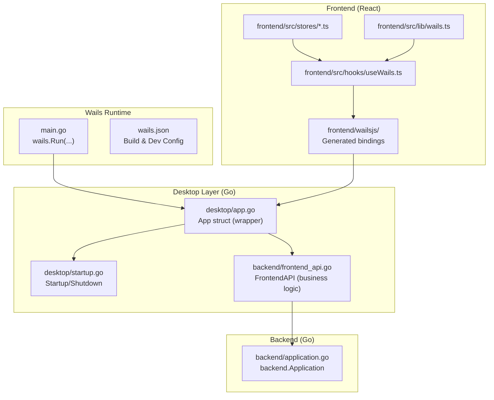
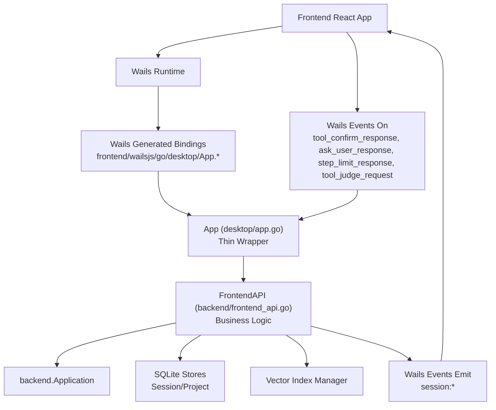
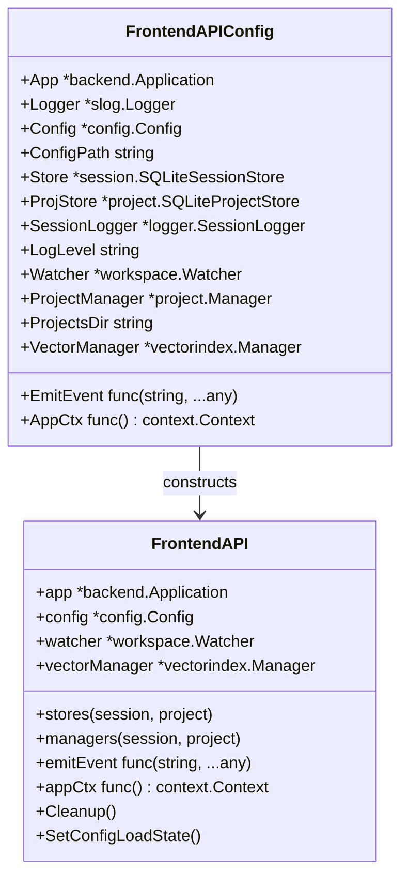
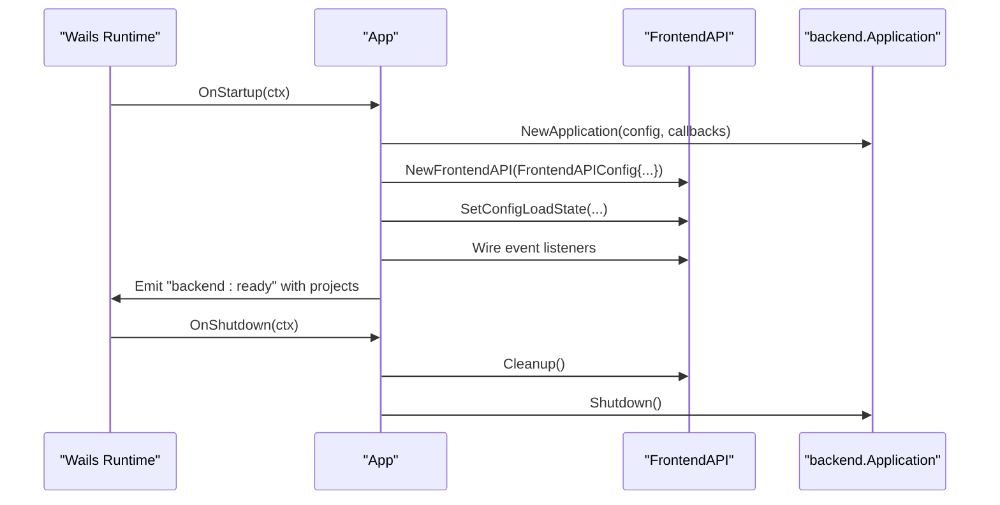
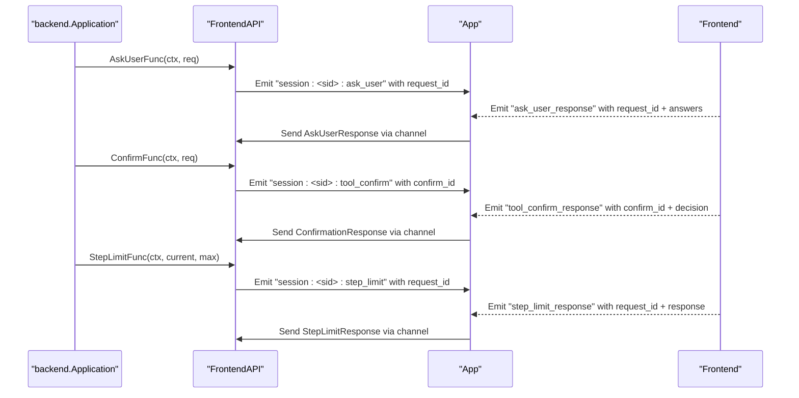
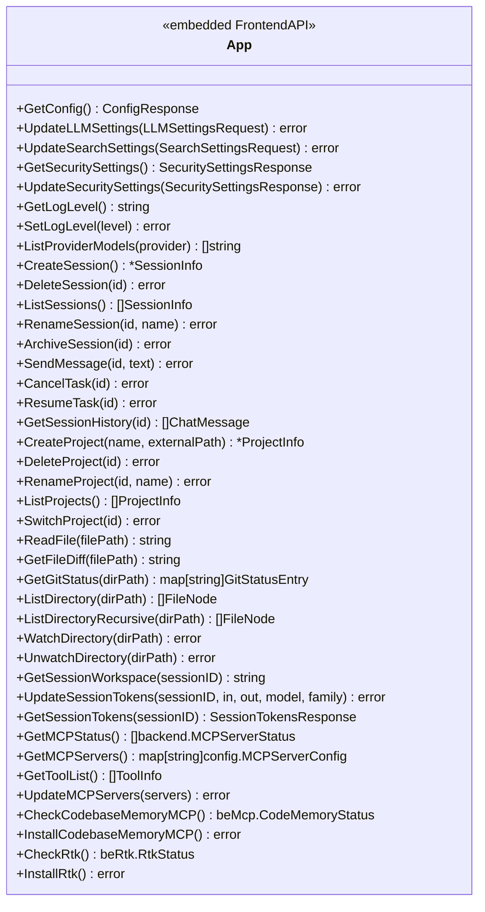
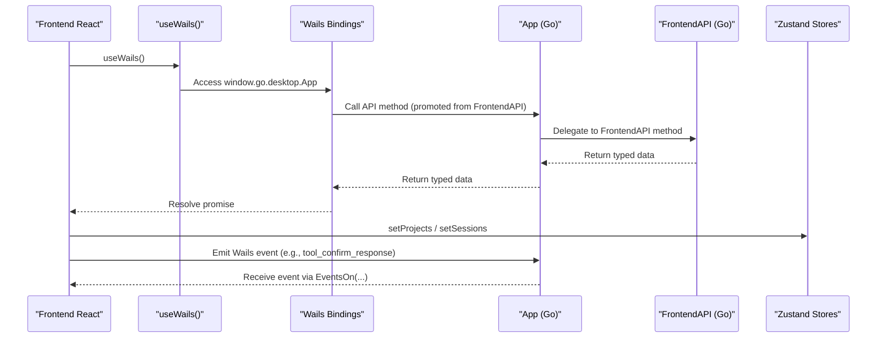
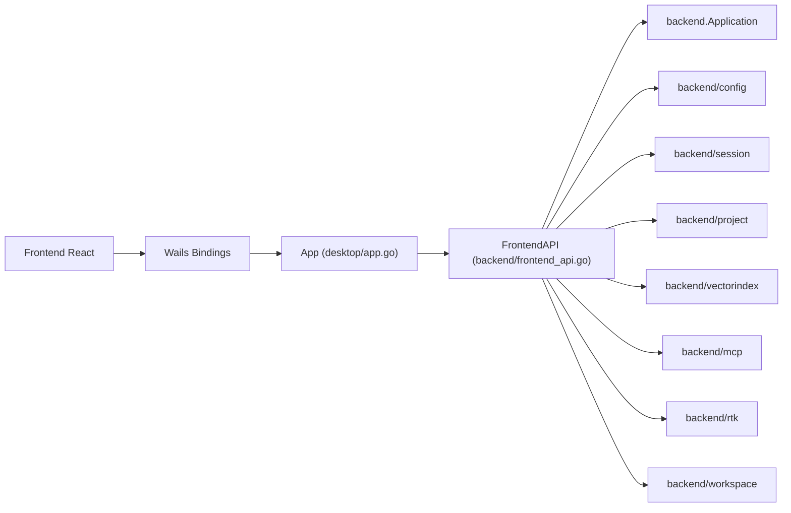

# Desktop Layer Architecture

<cite>
**Referenced Files in This Document**
- [main.go](file://main.go)
- [wails.json](file://wails.json)
- [desktop/app.go](file://desktop/app.go)
- [desktop/startup.go](file://desktop/startup.go)
- [backend/frontend_api.go](file://backend/frontend_api.go)
- [backend/frontend_api_config.go](file://backend/frontend_api_config.go)
- [backend/frontend_api_session.go](file://backend/frontend_api_session.go)
- [backend/frontend_api_project.go](file://backend/frontend_api_project.go)
- [backend/frontend_api_workspace.go](file://backend/frontend_api_workspace.go)
- [backend/frontend_api_mcp.go](file://backend/frontend_api_mcp.go)
- [backend/frontend_api_rtk.go](file://backend/frontend_api_rtk.go)
- [frontend/src/lib/wails.ts](file://frontend/src/lib/wails.ts)
- [frontend/src/hooks/useWails.ts](file://frontend/src/hooks/useWails.ts)
- [frontend/src/stores/sessionStore.ts](file://frontend/src/stores/sessionStore.ts)
- [frontend/src/stores/projectStore.ts](file://frontend/src/stores/projectStore.ts)
- [frontend/src/constants/api.ts](file://frontend/src/constants/api.ts)
</cite>

## Update Summary
**Changes Made**
- Updated architecture overview to reflect the new FrontendAPI system
- Modified App struct description to show it as a thin wrapper around FrontendAPI
- Updated API exposure patterns to show methods promoted from FrontendAPI
- Revised component initialization to show FrontendAPI construction
- Updated relationship between desktop layer and backend to show clear separation
- Added new section on FrontendAPI responsibilities and design philosophy

## Table of Contents
1. [Introduction](#introduction)
2. [Project Structure](#project-structure)
3. [Core Components](#core-components)
4. [Architecture Overview](#architecture-overview)
5. [Detailed Component Analysis](#detailed-component-analysis)
6. [Dependency Analysis](#dependency-analysis)
7. [Performance Considerations](#performance-considerations)
8. [Troubleshooting Guide](#troubleshooting-guide)
9. [Conclusion](#conclusion)
10. [Appendices](#appendices)

## Introduction
This document describes the desktop layer architecture of C0WRK built with Wails v2. The architecture has been refactored to act as a thin presentation layer wrapper around a new backend FrontendAPI system. The desktop layer focuses on presentation logic while the backend handles core business logic through the FrontendAPI abstraction. The Go-based App struct now embeds the FrontendAPI, exposing all frontend-facing methods through promotion. The Wails runtime is configured via wails.json and launched from main.go, while the frontend is a React application that consumes Wails-generated bindings and communicates via Wails events.

## Project Structure
The desktop layer is organized around a thin App wrapper that embeds the backend FrontendAPI. The Wails runtime is configured via wails.json and launched from main.go. The frontend is a React application that consumes Wails-generated bindings and communicates via Wails events. The FrontendAPI encapsulates all business logic while the App maintains only lifecycle management and UI-specific functionality.



**Diagram sources**
- [main.go:18-44](file://main.go#L18-L44)
- [wails.json:1-13](file://wails.json#L1-L13)
- [desktop/app.go:14-58](file://desktop/app.go#L14-L58)
- [desktop/startup.go:336-356](file://desktop/startup.go#L336-L356)
- [backend/frontend_api.go:16-61](file://backend/frontend_api.go#L16-L61)
- [frontend/src/hooks/useWails.ts:1-61](file://frontend/src/hooks/useWails.ts#L1-L61)
- [frontend/src/lib/wails.ts:1-205](file://frontend/src/lib/wails.ts#L1-L205)

**Section sources**
- [main.go:18-44](file://main.go#L18-L44)
- [wails.json:1-13](file://wails.json#L1-L13)

## Core Components
- **App struct**: Thin wrapper that embeds FrontendAPI and retains only lifecycle management (Startup/Shutdown), the native PickDirectory dialog, and Wails event-listener infrastructure. All frontend API methods are promoted from the embedded FrontendAPI.
- **FrontendAPI**: New backend abstraction that holds all business logic state and methods exposed to the Wails frontend. It encapsulates configuration, persistence stores, session management, project management, workspace handling, vector search, and MCP/RTK integration.
- **Wails integration**: main.go binds the App instance to Wails and wires OnStartup/OnShutdown callbacks. wails.json defines build/dev commands and asset serving.
- **Startup routine**: Initializes logging, loads configuration, sets up SQLite, stores, vector index manager, backend Application, constructs FrontendAPI with all dependencies, and wires UI emit functions and event listeners for user confirmations, judge requests, ask-user responses, and step-limit decisions.
- **Shutdown routine**: Delegates cleanup to FrontendAPI.Cleanup() and shuts down the backend Application.
- **Desktop APIs**: All methods are now promoted from FrontendAPI, providing a clean separation between presentation (App) and business logic (FrontendAPI).

**Section sources**
- [desktop/app.go:14-58](file://desktop/app.go#L14-L58)
- [backend/frontend_api.go:16-168](file://backend/frontend_api.go#L16-L168)
- [main.go:18-44](file://main.go#L18-L44)
- [wails.json:1-13](file://wails.json#L1-L13)
- [desktop/startup.go:336-356](file://desktop/startup.go#L336-L356)
- [desktop/startup.go:808-823](file://desktop/startup.go#L808-L823)

## Architecture Overview
The desktop layer now acts as a thin presentation wrapper around the new FrontendAPI system. The App struct embeds FrontendAPI, promoting all business logic methods to the App surface. The FrontendAPI encapsulates all backend state and operations while the App maintains only UI lifecycle and presentation concerns.



**Diagram sources**
- [main.go:31-35](file://main.go#L31-L35)
- [desktop/startup.go:336-356](file://desktop/startup.go#L336-L356)
- [backend/frontend_api.go:16-61](file://backend/frontend_api.go#L16-L61)
- [frontend/src/hooks/useWails.ts:44-47](file://frontend/src/hooks/useWails.ts#L44-L47)

## Detailed Component Analysis

### App Struct and FrontendAPI Integration
The App struct now acts as a thin wrapper that embeds the FrontendAPI:
- **Embedded FrontendAPI**: All business logic methods are automatically promoted to App, making them available to Wails bindings.
- **Lifecycle management**: Retains Startup/Shutdown methods for Wails integration and resource orchestration.
- **UI-specific functionality**: Maintains PickDirectory method requiring Wails context and event listener infrastructure.
- **Resource management**: Holds shared SQLite connection and pending confirmation channels for user interactions.

```mermaid
classDiagram
class App {
+ctx context.Context
+*backend.FrontendAPI
+app *backend.Application
+logger *slog.Logger
+db *sql.DB
+pendingConfirmations sync.Map
+pendingAskUser sync.Map
+pendingStepLimit sync.Map
+PickDirectory() string
+log() *slog.Logger
}
class FrontendAPI {
+app *backend.Application
+logger *slog.Logger
+config *config.Config
+store *session.SQLiteSessionStore
+projStore *project.SQLiteProjectStore
+sessionLogger *logger.SessionLogger
+watcher *workspace.Watcher
+projectManager *project.Manager
+vectorManager *vectorindex.Manager
+emitEvent func(string, ...any)
+appCtx func() context.Context
+Cleanup()
+GetCodebaseProjectName() string
+IndexingDoneChan() chan struct{}
+SetRestoreAutoIndex(fn)
}
App --> FrontendAPI : embeds
```

**Diagram sources**
- [desktop/app.go:19-57](file://desktop/app.go#L19-L57)
- [backend/frontend_api.go:19-61](file://backend/frontend_api.go#L19-L61)

**Section sources**
- [desktop/app.go:14-58](file://desktop/app.go#L14-L58)
- [backend/frontend_api.go:16-61](file://backend/frontend_api.go#L16-L61)

### FrontendAPI Responsibilities and Design Philosophy
The FrontendAPI serves as the new backend abstraction layer:
- **Business logic encapsulation**: All core functionality moved from App methods to FrontendAPI methods.
- **State management**: Manages configuration, persistence stores, session management, project management, workspace handling, and vector search.
- **Dependency injection**: Receives all dependencies through FrontendAPIConfig, enabling clean construction and testing.
- **Event coordination**: Provides emitEvent callback for backend-to-frontend communication.
- **Resource cleanup**: Implements Cleanup() method for proper shutdown resource management.



**Diagram sources**
- [backend/frontend_api.go:63-99](file://backend/frontend_api.go#L63-L99)
- [backend/frontend_api.go:16-61](file://backend/frontend_api.go#L16-L61)

**Section sources**
- [backend/frontend_api.go:16-168](file://backend/frontend_api.go#L16-L168)
- [backend/frontend_api.go:63-99](file://backend/frontend_api.go#L63-L99)

### Wails Lifecycle Management
- **Startup**: Creates backend Application, constructs FrontendAPI with all dependencies, wires UI emit function and event listeners, and delegates business logic to FrontendAPI methods.
- **Shutdown**: Delegates cleanup to FrontendAPI.Cleanup() and shuts down backend Application.



**Diagram sources**
- [main.go:31-35](file://main.go#L31-L35)
- [desktop/startup.go:336-356](file://desktop/startup.go#L336-L356)
- [desktop/startup.go:808-823](file://desktop/startup.go#L808-L823)

**Section sources**
- [main.go:18-44](file://main.go#L18-L44)
- [desktop/startup.go:336-356](file://desktop/startup.go#L336-L356)
- [desktop/startup.go:808-823](file://desktop/startup.go#L808-L823)

### Event-Driven Communication and Pending Confirmation Mechanisms
The desktop layer uses Wails events for bidirectional communication, with FrontendAPI handling the business logic:
- **Emission**: UI emit function (provided to FrontendAPI) emits session-specific events carrying structured payloads.
- **Reception**: Event listeners parse payloads, resolve pending channels, and deliver responses or judge evaluations.

Pending confirmation flow:


**Diagram sources**
- [desktop/startup.go:139-247](file://desktop/startup.go#L139-L247)
- [desktop/startup.go:587-721](file://desktop/startup.go#L587-L721)

**Section sources**
- [desktop/startup.go:139-247](file://desktop/startup.go#L139-L247)
- [desktop/startup.go:587-721](file://desktop/startup.go#L587-L721)

### Desktop API Exposure Patterns
**Updated** All API methods are now promoted from FrontendAPI, providing a clean separation between presentation and business logic:

- **Configuration**: GetConfig, UpdateLLMSettings, UpdateSearchSettings, GetSecuritySettings, UpdateSecuritySettings, GetLogLevel, SetLogLevel, ListProviderModels.
- **Sessions**: CreateSession, DeleteSession, ListSessions, RenameSession, ArchiveSession, SendMessage, CancelTask, ResumeTask, GetSessionHistory.
- **Projects**: CreateProject, DeleteProject, RenameProject, ListProjects, SwitchProject.
- **Workspace**: ReadFile, GetFileDiff, GetGitStatus, ListDirectory, ListDirectoryRecursive, WatchDirectory, UnwatchDirectory, GetSessionWorkspace, UpdateSessionTokens, GetSessionTokens.
- **MCP/RTK**: GetMCPStatus, GetMCPServers, GetToolList, UpdateMCPServers, CheckCodebaseMemoryMCP, InstallCodebaseMemoryMCP, CheckRtk, InstallRtk.



**Diagram sources**
- [backend/frontend_api_config.go:15-317](file://backend/frontend_api_config.go#L15-L317)
- [backend/frontend_api_session.go:11-185](file://backend/frontend_api_session.go#L11-L185)
- [backend/frontend_api_project.go:24-320](file://backend/frontend_api_project.go#L24-L320)
- [backend/frontend_api_workspace.go:18-470](file://backend/frontend_api_workspace.go#L18-L470)
- [backend/frontend_api_mcp.go:23-246](file://backend/frontend_api_mcp.go#L23-L246)
- [backend/frontend_api_rtk.go:9-39](file://backend/frontend_api_rtk.go#L9-L39)

**Section sources**
- [backend/frontend_api_config.go:15-317](file://backend/frontend_api_config.go#L15-L317)
- [backend/frontend_api_session.go:11-185](file://backend/frontend_api_session.go#L11-L185)
- [backend/frontend_api_project.go:24-320](file://backend/frontend_api_project.go#L24-L320)
- [backend/frontend_api_workspace.go:18-470](file://backend/frontend_api_workspace.go#L18-L470)
- [backend/frontend_api_mcp.go:23-246](file://backend/frontend_api_mcp.go#L23-L246)
- [backend/frontend_api_rtk.go:9-39](file://backend/frontend_api_rtk.go#L9-L39)

### Relationship Between Desktop Layer and Frontend React Application
- **Bindings**: The frontend imports generated bindings from frontend/wailsjs/go/desktop/App.* and accesses them via a React hook. The hook exposes an API object and runtime for events.
- **Event Types**: The frontend defines TypeScript interfaces matching backend event payloads (e.g., ToolConfirmData, AskUserData, SessionTokensData).
- **State Synchronization**: Zustand stores manage frontend state for projects and sessions, sorting by activity timestamps. The backend pre-sorts lists and emits them to the frontend, which sets stores accordingly.



**Diagram sources**
- [frontend/src/hooks/useWails.ts:1-61](file://frontend/src/hooks/useWails.ts#L1-L61)
- [frontend/src/lib/wails.ts:1-205](file://frontend/src/lib/wails.ts#L1-L205)
- [frontend/src/stores/projectStore.ts:1-44](file://frontend/src/stores/projectStore.ts#L1-L44)
- [frontend/src/stores/sessionStore.ts:1-52](file://frontend/src/stores/sessionStore.ts#L1-L52)

**Section sources**
- [frontend/src/hooks/useWails.ts:1-61](file://frontend/src/hooks/useWails.ts#L1-L61)
- [frontend/src/lib/wails.ts:1-205](file://frontend/src/lib/wails.ts#L1-L205)
- [frontend/src/stores/projectStore.ts:1-44](file://frontend/src/stores/projectStore.ts#L1-L44)
- [frontend/src/stores/sessionStore.ts:1-52](file://frontend/src/stores/sessionStore.ts#L1-L52)

### Wails Configuration and Build System Integration
- **wails.json** defines the application name, output filename, and npm scripts for development and production builds. It also configures the frontend dev server URL to auto.
- **main.go** configures Wails options including window size, background color, asset server, startup/shutdown callbacks, and debug inspector behavior.

Cross-platform considerations:
- The desktop layer uses platform-agnostic SQLite and Go libraries. File operations and git commands are executed via os/exec and git CLI, which vary by OS. The code handles absence of git gracefully and avoids panics in background tasks.

**Section sources**
- [wails.json:1-13](file://wails.json#L1-L13)
- [main.go:21-39](file://main.go#L21-L39)

### Component Initialization Order and Shutdown Procedures
**Updated** Initialization order (Startup):
1. Load shell environment and initialize logger.
2. Resolve and load configuration; re-init logger if level changed.
3. Open SQLite database and apply pragmas; initialize project and session stores.
4. Initialize vector index manager and project manager.
5. Wire vector search callbacks into backend configuration.
6. Create backend Application with UI emit function and user interaction callbacks.
7. **Construct FrontendAPI with all dependencies** (NEW).
8. Wire project resolver for lazy session restoration.
9. Pre-load projects/sessions and emit to frontend.
10. Apply tool filters and param injection for codebase-memory MCP.
11. Validate LLM provider configuration.
12. Register Wails event listeners for confirmations, judge requests, ask-user responses, and step-limit responses.
13. Emit backend-ready and related status events.

Shutdown:
1. **Delegate cleanup to FrontendAPI.Cleanup()** (NEW).
2. Shutdown backend Application.
3. Close shared SQLite database.

**Section sources**
- [desktop/startup.go:336-356](file://desktop/startup.go#L336-L356)
- [desktop/startup.go:808-823](file://desktop/startup.go#L808-L823)

### Resource Cleanup Patterns
**Updated** Resource cleanup is now centralized in FrontendAPI.Cleanup():
- **FrontendAPI cleanup**: Restores codebase-memory MCP auto_index, shuts down vector manager, closes workspace watcher, closes session and project stores, and closes session logger.
- **App cleanup**: Shuts down backend Application and closes shared SQLite database.
- **Channel cleanup**: Pending confirmation channels are cleaned up upon resolution or context cancellation.

**Section sources**
- [backend/frontend_api.go:109-139](file://backend/frontend_api.go#L109-L139)
- [desktop/startup.go:808-823](file://desktop/startup.go#L808-L823)

## Dependency Analysis
**Updated** The desktop layer now has a clear separation of concerns:
- **App** depends on FrontendAPI for business logic delegation and maintains only UI lifecycle concerns.
- **FrontendAPI** depends on backend packages for configuration, session management, project management, vector indexing, MCP/RTK integration, and workspace watching.
- **Frontend** depends on Wails-generated bindings and TypeScript interfaces.



**Diagram sources**
- [desktop/app.go:19-25](file://desktop/app.go#L19-L25)
- [backend/frontend_api.go:19-61](file://backend/frontend_api.go#L19-L61)
- [main.go:12](file://main.go#L12)

**Section sources**
- [desktop/app.go:19-25](file://desktop/app.go#L19-L25)
- [backend/frontend_api.go:19-61](file://backend/frontend_api.go#L19-L61)
- [main.go:12](file://main.go#L12)

## Performance Considerations
- **Asynchronous operations**: Codebase indexing and MCP/RTK installation are performed in goroutines to avoid blocking startup.
- **Debounced indexing**: Vector index manager supports incremental indexing on file changes via watcher callbacks.
- **Best-effort persistence**: Store writes are logged and continue even if failures occur to avoid disrupting user sessions.
- **Event-driven UI updates**: Frontend state is updated via pre-sorted arrays from backend to minimize client-side sorting overhead.
- **Resource pooling**: Shared SQLite connection and vector manager are reused across API calls for efficiency.

## Troubleshooting Guide
Common issues and diagnostics:
- **Startup errors**: The desktop layer emits a startup error event with a message and error details when backend creation fails. Check logs and configuration.
- **Configuration problems**: Validate active LLM provider and credentials; masked API keys are returned to the UI for display safety.
- **Missing UI context**: Ask-user and confirmation callbacks return allow-once/deny-and-stop when no UI context is available.
- **Event parsing**: Event listeners log warnings for malformed payloads or missing fields; ensure frontend emits correct event names and data shapes.
- **Git operations**: Absence of git or invalid paths returns empty or filtered results; verify git availability and workspace path correctness.
- **FrontendAPI initialization**: If API methods fail, check that FrontendAPI was properly constructed with all required dependencies.

**Section sources**
- [desktop/startup.go:327-333](file://desktop/startup.go#L327-L333)
- [desktop/startup.go:139-247](file://desktop/startup.go#L139-L247)
- [desktop/startup.go:609-742](file://desktop/startup.go#L609-L742)
- [backend/frontend_api_workspace.go:18-92](file://backend/frontend_api_workspace.go#L18-L92)

## Conclusion
The desktop layer has been successfully refactored to act as a thin presentation wrapper around the new backend FrontendAPI system. The App struct now embeds FrontendAPI, promoting all business logic methods to the App surface while maintaining only UI lifecycle and presentation concerns. This separation enables cleaner architecture, better testability, and clearer responsibility boundaries between presentation and business logic layers.

## Appendices

### Appendix A: Wails Event Names
- **Emitted to frontend**: startup_error, backend:ready, projects:loaded, project:created, project:deleted, project:renamed, project:switched, workspace:tree_changed, sessions:loaded, session:event, vector_index:status, codememory:status, codememory:install-progress, rtk:status, rtk:install-progress.
- **Received from frontend**: tool_confirm_response, tool_judge_request, ask_user_response, step_limit_response.

**Section sources**
- [desktop/startup.go:744-790](file://desktop/startup.go#L744-L790)

### Appendix B: Frontend Data Binding and State Synchronization
- **Typed interfaces** for events and payloads are defined in frontend/src/lib/wails.ts.
- **The useWails hook** provides access to window.go.desktop.App and window.runtime.
- **Zustand stores** maintain project and session state, sorting by last activity timestamps.

**Section sources**
- [frontend/src/lib/wails.ts:1-205](file://frontend/src/lib/wails.ts#L1-L205)
- [frontend/src/hooks/useWails.ts:1-61](file://frontend/src/hooks/useWails.ts#L1-L61)
- [frontend/src/stores/projectStore.ts:1-44](file://frontend/src/stores/projectStore.ts#L1-L44)
- [frontend/src/stores/sessionStore.ts:1-52](file://frontend/src/stores/sessionStore.ts#L1-L52)

### Appendix C: FrontendAPI Construction Parameters
The FrontendAPIConfig struct provides all dependencies needed for FrontendAPI construction:
- **Application**: backend.Application instance
- **Logging**: Logger and session logger instances
- **Persistence**: Session and project SQLite stores
- **Managers**: Session and project managers
- **Workspace**: Watcher and projects directory
- **Vector search**: Vector manager instance
- **Callbacks**: Event emission and context functions

**Section sources**
- [backend/frontend_api.go:63-99](file://backend/frontend_api.go#L63-L99)