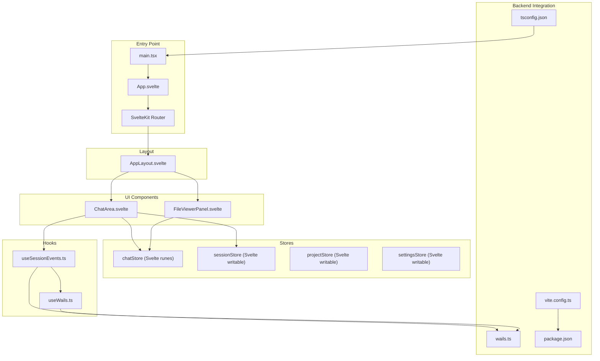
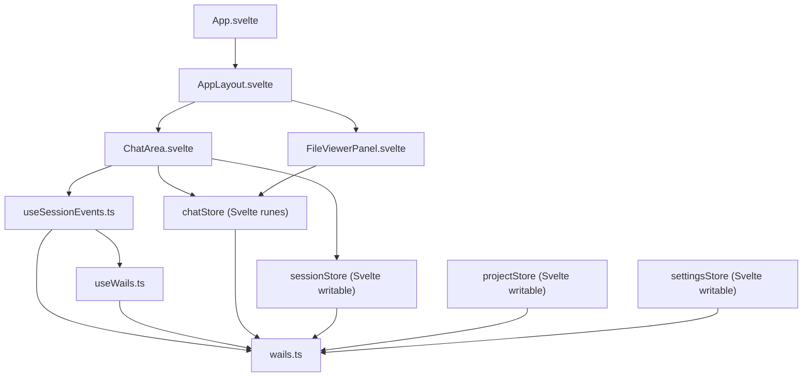
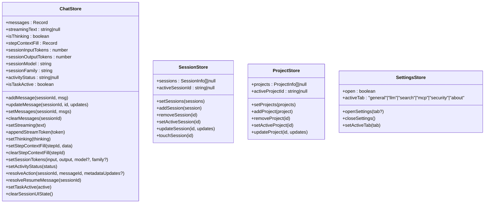
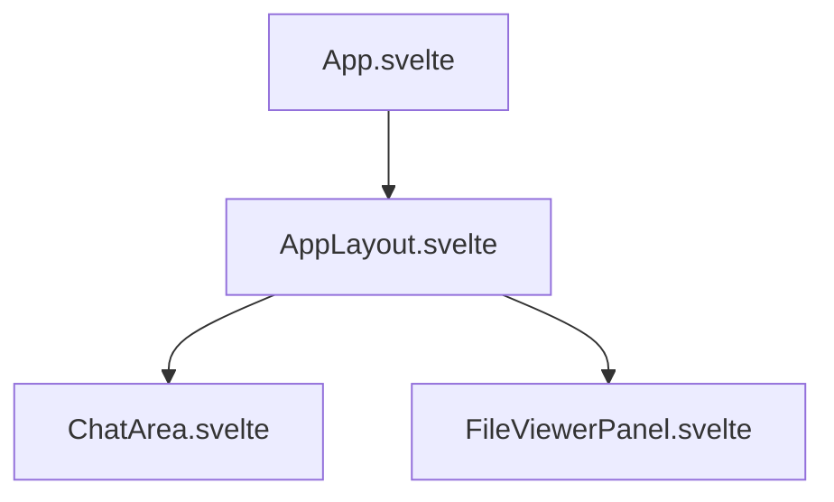
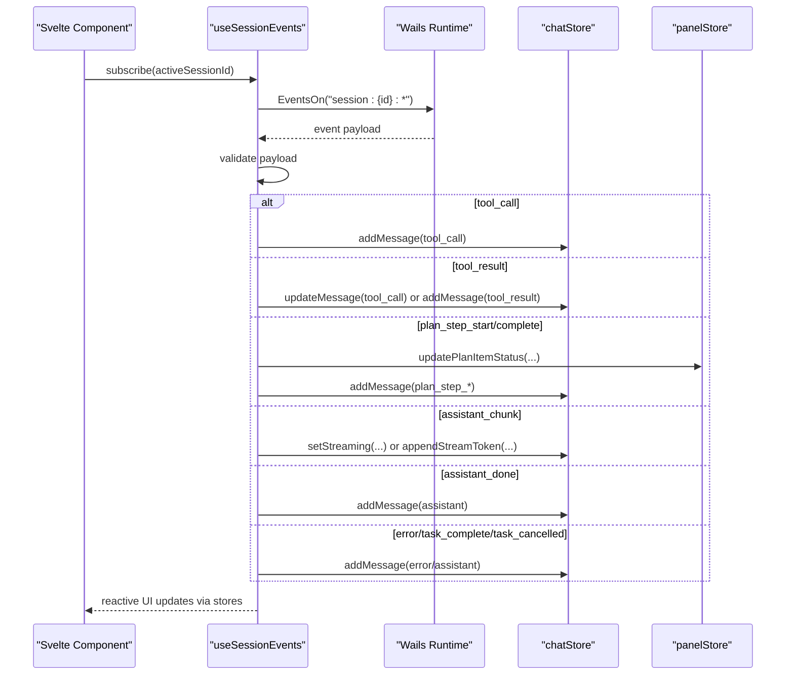
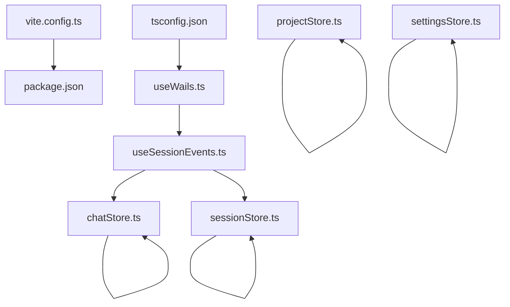

# Frontend Application Architecture

<cite>
**Referenced Files in This Document**
- [App.tsx](file://frontend/src/App.tsx)
- [main.tsx](file://frontend/src/main.tsx)
- [vite.config.ts](file://frontend/vite.config.ts)
- [package.json](file://frontend/package.json)
- [tsconfig.json](file://frontend/tsconfig.json)
- [chatStore.ts](file://frontend/src/stores/chatStore.ts)
- [sessionStore.ts](file://frontend/src/stores/sessionStore.ts)
- [projectStore.ts](file://frontend/src/stores/projectStore.ts)
- [settingsStore.ts](file://frontend/src/stores/settingsStore.ts)
- [AppLayout.tsx](file://frontend/src/components/layout/AppLayout.tsx)
- [useWails.ts](file://frontend/src/hooks/useWails.ts)
- [wails.ts](file://frontend/src/lib/wails.ts)
- [useSessionEvents.ts](file://frontend/src/hooks/useSessionEvents.ts)
- [ChatArea.tsx](file://frontend/src/components/chat/ChatArea.tsx)
- [FileViewerPanel.tsx](file://frontend/src/components/fileViewer/FileViewerPanel.tsx)
- [frontend-spec-svelte.md](file://docs/frontend-spec-svelte.md)
</cite>

## Update Summary
**Changes Made**
- Updated architecture overview to reflect the planned Svelte 5 migration from React 19
- Added comprehensive Svelte-based frontend specification documentation
- Updated component architecture to show Svelte 5 + SvelteKit integration
- Revised state management patterns to align with Svelte stores and runes
- Enhanced Wails v2 integration contract for Svelte applications
- Updated build system documentation to reflect SvelteKit requirements

## Table of Contents
1. [Introduction](#introduction)
2. [Project Structure](#project-structure)
3. [Core Components](#core-components)
4. [Architecture Overview](#architecture-overview)
5. [Detailed Component Analysis](#detailed-component-analysis)
6. [Dependency Analysis](#dependency-analysis)
7. [Performance Considerations](#performance-considerations)
8. [Troubleshooting Guide](#troubleshooting-guide)
9. [Conclusion](#conclusion)

## Introduction
This document describes the frontend architecture for the C0WRK application, which is currently transitioning from a React 19 + Vite 6 + Zustand + Tailwind v4 architecture to a modern Svelte 5 + SvelteKit + Tailwind v4 + TypeScript ~5.7 stack. The application maintains tight integration with a Wails v2-backed Go backend via generated TypeScript bindings and real-time event streams. The UI emphasizes a chat-first interface with execution panels, a file viewer, and settings, all orchestrated through a responsive layout with resizable panels.

**Updated** The frontend is being migrated to Svelte 5 with SvelteKit for SPA mode deployment, maintaining the existing Wails v2 integration while adopting Svelte's reactive stores and component system.

## Project Structure
The frontend is organized around a clear separation of concerns with the upcoming Svelte 5 architecture:
- Entry point and rendering bootstrap with SvelteKit
- Layout and page composition using Svelte components
- UI components (chat, file viewer, settings) built with Svelte 5
- Stores for state management using Svelte runes and writable stores
- Hooks for Wails integration and session event handling
- Build configuration and TypeScript setup optimized for SvelteKit

**Diagram sources**
- [main.tsx:1-17](file://frontend/src/main.tsx#L1-L17)
- [App.tsx:1-91](file://frontend/src/App.tsx#L1-L91)
- [AppLayout.tsx:1-135](file://frontend/src/components/layout/AppLayout.tsx#L1-L135)
- [ChatArea.tsx:1-175](file://frontend/src/components/chat/ChatArea.tsx#L1-L175)
- [FileViewerPanel.tsx:1-27](file://frontend/src/components/fileViewer/FileViewerPanel.tsx#L1-L27)
- [chatStore.ts:1-571](file://frontend/src/stores/chatStore.ts#L1-L571)
- [sessionStore.ts:1-52](file://frontend/src/stores/sessionStore.ts#L1-L52)
- [projectStore.ts:1-44](file://frontend/src/stores/projectStore.ts#L1-L44)
- [settingsStore.ts:1-20](file://frontend/src/stores/settingsStore.ts#L1-L20)
- [useWails.ts:1-61](file://frontend/src/hooks/useWails.ts#L1-L61)
- [useSessionEvents.ts:1-705](file://frontend/src/hooks/useSessionEvents.ts#L1-L705)
- [wails.ts:1-205](file://frontend/src/lib/wails.ts#L1-L205)
- [vite.config.ts:1-15](file://frontend/vite.config.ts#L1-L15)
- [package.json:1-61](file://frontend/package.json#L1-L61)
- [tsconfig.json:1-27](file://frontend/tsconfig.json#L1-L27)

**Section sources**
- [main.tsx:1-17](file://frontend/src/main.tsx#L1-L17)
- [vite.config.ts:1-15](file://frontend/vite.config.ts#L1-L15)
- [package.json:1-61](file://frontend/package.json#L1-L61)
- [tsconfig.json:1-27](file://frontend/tsconfig.json#L1-L27)

## Core Components
- App: Initializes Wails runtime, listens for startup and vector index events, renders banners and the main layout.
- AppLayout: Orchestrates sidebar, chat area, execution panels, chat input, file viewer, and status bar with resizable panels and collapsed states.
- ChatArea: Renders grouped chat messages, handles streaming assistant responses, loads session history, and coordinates with session events.
- FileViewerPanel: Manages open files and content rendering within a collapsible/resizable panel.
- Stores: chatStore (message grouping, streaming, context fill, session tokens), sessionStore (sessions list and active session), projectStore (projects list and active project), settingsStore (settings modal state).
- Hooks: useWails (typed access to Go backend APIs and runtime events), useSessionEvents (session-scoped event subscription and UI state updates).
- Backend Types: wails.ts defines shared types for event payloads and data exchanged with the backend.

**Updated** The stores will be migrated to Svelte runes and writable stores, providing better reactivity and performance compared to Zustand.

**Section sources**
- [App.tsx:21-91](file://frontend/src/App.tsx#L21-L91)
- [AppLayout.tsx:30-135](file://frontend/src/components/layout/AppLayout.tsx#L30-L135)
- [ChatArea.tsx:17-175](file://frontend/src/components/chat/ChatArea.tsx#L17-L175)
- [FileViewerPanel.tsx:9-27](file://frontend/src/components/fileViewer/FileViewerPanel.tsx#L9-L27)
- [chatStore.ts:440-571](file://frontend/src/stores/chatStore.ts#L440-L571)
- [sessionStore.ts:15-52](file://frontend/src/stores/sessionStore.ts#L15-L52)
- [projectStore.ts:15-44](file://frontend/src/stores/projectStore.ts#L15-L44)
- [settingsStore.ts:5-20](file://frontend/src/stores/settingsStore.ts#L5-L20)
- [useWails.ts:51-61](file://frontend/src/hooks/useWails.ts#L51-L61)
- [useSessionEvents.ts:95-705](file://frontend/src/hooks/useSessionEvents.ts#L95-L705)
- [wails.ts:4-205](file://frontend/src/lib/wails.ts#L4-L205)

## Architecture Overview
The frontend follows a unidirectional data flow with Svelte 5's reactive stores:
- UI components subscribe to Svelte stores for state.
- Hooks connect to the Wails runtime and backend APIs.
- Real-time session events update the chat timeline and related UI panels.
- Stores encapsulate complex state transitions and derived computations (e.g., message grouping).

**Updated** The architecture leverages Svelte 5's improved reactivity model with runes for better performance and developer experience.

**Diagram sources**
- [App.tsx:21-91](file://frontend/src/App.tsx#L21-L91)
- [AppLayout.tsx:30-135](file://frontend/src/components/layout/AppLayout.tsx#L30-L135)
- [ChatArea.tsx:17-175](file://frontend/src/components/chat/ChatArea.tsx#L17-L175)
- [FileViewerPanel.tsx:9-27](file://frontend/src/components/fileViewer/FileViewerPanel.tsx#L9-L27)
- [chatStore.ts:440-571](file://frontend/src/stores/chatStore.ts#L440-L571)
- [sessionStore.ts:15-52](file://frontend/src/stores/sessionStore.ts#L15-L52)
- [projectStore.ts:15-44](file://frontend/src/stores/projectStore.ts#L15-L44)
- [settingsStore.ts:5-20](file://frontend/src/stores/settingsStore.ts#L5-L20)
- [useSessionEvents.ts:95-705](file://frontend/src/hooks/useSessionEvents.ts#L95-L705)
- [useWails.ts:51-61](file://frontend/src/hooks/useWails.ts#L51-L61)
- [wails.ts:4-205](file://frontend/src/lib/wails.ts#L4-L205)

## Detailed Component Analysis

### Store-Based State Management
The application uses Svelte stores for lightweight, composable state management:
- chatStore: Manages per-session messages, streaming text, thinking/activity status, step/session context fill, and pending actions. Provides a complex grouping function to transform raw messages into display items with nested plan steps, tool calls/results, and service/status messages.
- sessionStore: Tracks sessions list, active session, and supports add/update/remove/touch operations with deterministic ordering by last activity.
- projectStore: Mirrors project list and active project with similar mutation semantics.
- settingsStore: Controls the settings modal visibility and active tab.

**Updated** Stores will be implemented using Svelte 5 runes for reactive state management and writable stores for complex state logic.

**Diagram sources**
- [chatStore.ts:440-571](file://frontend/src/stores/chatStore.ts#L440-L571)
- [sessionStore.ts:15-52](file://frontend/src/stores/sessionStore.ts#L15-L52)
- [projectStore.ts:15-44](file://frontend/src/stores/projectStore.ts#L15-L44)
- [settingsStore.ts:5-20](file://frontend/src/stores/settingsStore.ts#L5-L20)

**Section sources**
- [chatStore.ts:1-571](file://frontend/src/stores/chatStore.ts#L1-L571)
- [sessionStore.ts:1-52](file://frontend/src/stores/sessionStore.ts#L1-L52)
- [projectStore.ts:1-44](file://frontend/src/stores/projectStore.ts#L1-L44)
- [settingsStore.ts:1-20](file://frontend/src/stores/settingsStore.ts#L1-L20)

### Component Hierarchy and Responsibilities
- App: Initializes Wails runtime, listens for startup errors and vector index status, renders banners and the main AppLayout.
- AppLayout: Coordinates sidebar, main chat area, execution panels, chat input, and file viewer. Handles resizing and collapsing of panels and displays an empty state when no project is selected.
- ChatArea: Loads session history, groups messages, renders the chat timeline, and manages pinned user messages and scrolling.
- FileViewerPanel: Renders open files with tabs and content, respecting collapsed state and width constraints.

**Updated** Components will be implemented as Svelte 5 .svelte files with improved reactivity and performance.

**Diagram sources**
- [App.tsx:21-91](file://frontend/src/App.tsx#L21-L91)
- [AppLayout.tsx:30-135](file://frontend/src/components/layout/AppLayout.tsx#L30-L135)
- [ChatArea.tsx:17-175](file://frontend/src/components/chat/ChatArea.tsx#L17-L175)
- [FileViewerPanel.tsx:9-27](file://frontend/src/components/fileViewer/FileViewerPanel.tsx#L9-L27)

**Section sources**
- [App.tsx:21-91](file://frontend/src/App.tsx#L21-L91)
- [AppLayout.tsx:30-135](file://frontend/src/components/layout/AppLayout.tsx#L30-L135)
- [ChatArea.tsx:17-175](file://frontend/src/components/chat/ChatArea.tsx#L17-L175)
- [FileViewerPanel.tsx:9-27](file://frontend/src/components/fileViewer/FileViewerPanel.tsx#L9-L27)

### Wails Integration and Real-Time Updates
- useWails: Provides typed access to Go backend APIs and runtime event subscription/emission.
- useSessionEvents: Subscribes to session-scoped events (routing, steps, thoughts, tool calls/results, plan steps, retries, context fill, etc.), validates payloads, updates chatStore and panelStore, and sets activity status and task state.
- Backend Types: wails.ts defines shared types for event payloads and data exchanged with the backend.

**Updated** The Wails integration contract remains the same, but will be adapted for Svelte's reactive patterns.

**Diagram sources**
- [useSessionEvents.ts:95-705](file://frontend/src/hooks/useSessionEvents.ts#L95-L705)
- [chatStore.ts:440-571](file://frontend/src/stores/chatStore.ts#L440-L571)
- [wails.ts:32-205](file://frontend/src/lib/wails.ts#L32-L205)

**Section sources**
- [useWails.ts:1-61](file://frontend/src/hooks/useWails.ts#L1-L61)
- [useSessionEvents.ts:1-705](file://frontend/src/hooks/useSessionEvents.ts#L1-L705)
- [wails.ts:1-205](file://frontend/src/lib/wails.ts#L1-L205)

### Message Grouping and Rendering Pipeline
The chat rendering pipeline transforms raw messages into a structured display tree:
- groupMessages builds nested plan steps, groups consecutive thoughts, and correlates tool calls with results.
- ChatArea computes display items and renders the timeline with pinned user messages and a scroll manager.

**Updated** The message grouping logic will be preserved but implemented within Svelte's reactive store system.

**Diagram sources**
- [chatStore.ts:77-410](file://frontend/src/stores/chatStore.ts#L77-L410)
- [ChatArea.tsx:103](file://frontend/src/components/chat/ChatArea.tsx#L103)

**Section sources**
- [chatStore.ts:77-410](file://frontend/src/stores/chatStore.ts#L77-L410)
- [ChatArea.tsx:103](file://frontend/src/components/chat/ChatArea.tsx#L103)

## Dependency Analysis
- Build system: Vite with React plugin and TailwindCSS integration; TypeScript configured with strictness and path aliases; package dependencies include React 19, Radix UI, Lucide icons, Mermaid, and Zustand.
- Runtime integration: Generated Wails bindings accessed via window.go and window.runtime; hooks expose typed APIs and event subscriptions.
- Store coupling: Components depend on stores via selector patterns; stores are decoupled from UI and only mutate state.

**Updated** The dependency analysis reflects the current React 19 architecture while preparing for the Svelte migration.

**Diagram sources**
- [vite.config.ts:1-15](file://frontend/vite.config.ts#L1-L15)
- [package.json:1-61](file://frontend/package.json#L1-L61)
- [tsconfig.json:1-27](file://frontend/tsconfig.json#L1-L27)
- [useWails.ts:51-61](file://frontend/src/hooks/useWails.ts#L51-L61)
- [useSessionEvents.ts:95-705](file://frontend/src/hooks/useSessionEvents.ts#L95-L705)
- [chatStore.ts:440-571](file://frontend/src/stores/chatStore.ts#L440-L571)
- [sessionStore.ts:15-52](file://frontend/src/stores/sessionStore.ts#L15-L52)
- [projectStore.ts:15-44](file://frontend/src/stores/projectStore.ts#L15-L44)
- [settingsStore.ts:5-20](file://frontend/src/stores/settingsStore.ts#L5-L20)

**Section sources**
- [vite.config.ts:1-15](file://frontend/vite.config.ts#L1-L15)
- [package.json:1-61](file://frontend/package.json#L1-L61)
- [tsconfig.json:1-27](file://frontend/tsconfig.json#L1-L27)

## Performance Considerations
- Selective re-renders: Components subscribe to minimal slices of stores using selector patterns to avoid unnecessary re-renders.
- Memoization: ChatArea uses memoized message grouping to prevent recomputation on every render.
- Streaming UI: Assistant chunks are applied incrementally to keep the UI responsive during long generations.
- Resize observers and layout measurements: ChatArea measures container height efficiently and falls back to animation frames when ResizeObserver is unavailable.
- Store granularity: Separate stores for chat, sessions, projects, and UI state reduce cross-store dependencies and improve locality.

**Updated** Performance optimizations will be enhanced with Svelte 5's improved reactivity model and rune-based state management.

## Troubleshooting Guide
- Startup errors: App listens for startup errors from the backend and displays a dismissible banner with message and error details.
- Vector index status: App listens for vector index events and updates the vector index store accordingly.
- Session history loading: ChatArea surfaces a history load error state and logs the failure.
- Session events: useSessionEvents validates payloads and updates UI state; ensure the active session is set before subscribing.

**Section sources**
- [App.tsx:26-59](file://frontend/src/App.tsx#L26-L59)
- [App.tsx:37-55](file://frontend/src/App.tsx#L37-L55)
- [ChatArea.tsx:97-100](file://frontend/src/components/chat/ChatArea.tsx#L97-L100)
- [useSessionEvents.ts:11-94](file://frontend/src/hooks/useSessionEvents.ts#L11-L94)

## Conclusion
C0WRK's frontend is currently transitioning from a React 19 application with a clean separation between UI components, store-based state management, and hooks that bridge to the Wails backend. The architecture emphasizes real-time session events, robust message grouping, and a responsive layout with resizable panels. The build system and TypeScript configuration support a scalable development workflow, while the store abstractions enable maintainable state transitions across chat, sessions, projects, and settings.

**Updated** The migration to Svelte 5 + SvelteKit will enhance performance through improved reactivity, better developer experience with runes and writable stores, and maintain the existing Wails v2 integration while modernizing the frontend architecture.