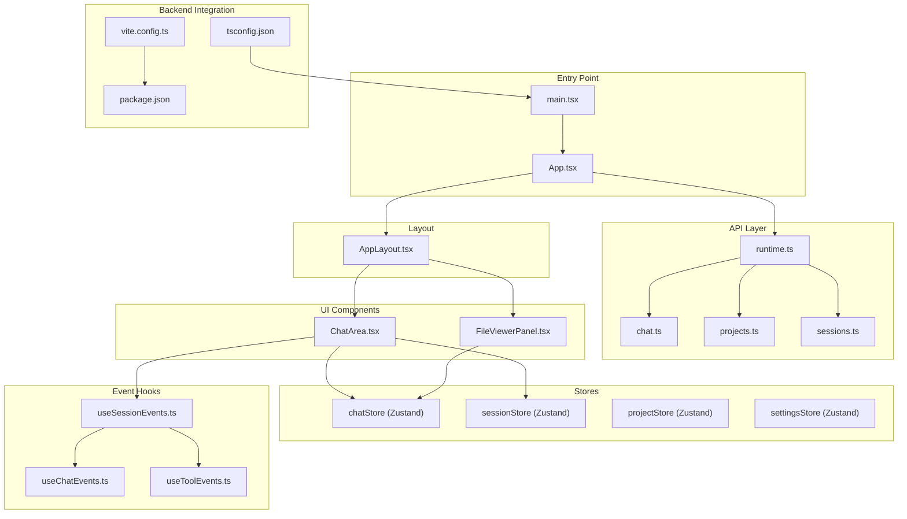
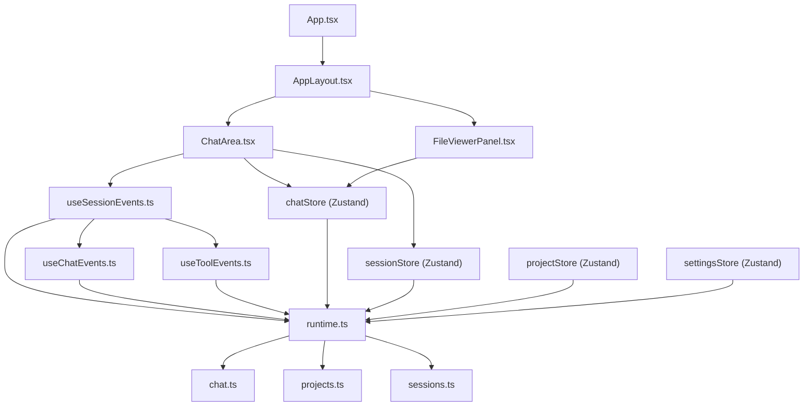
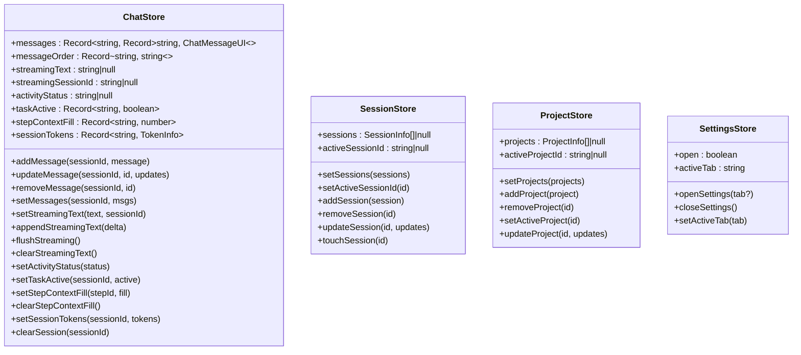
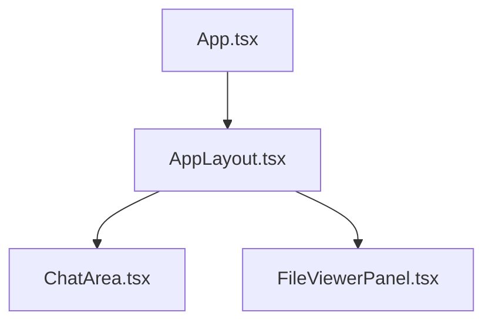
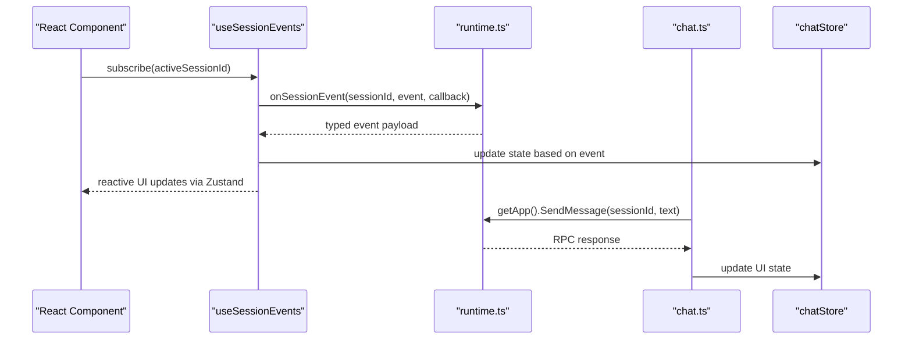
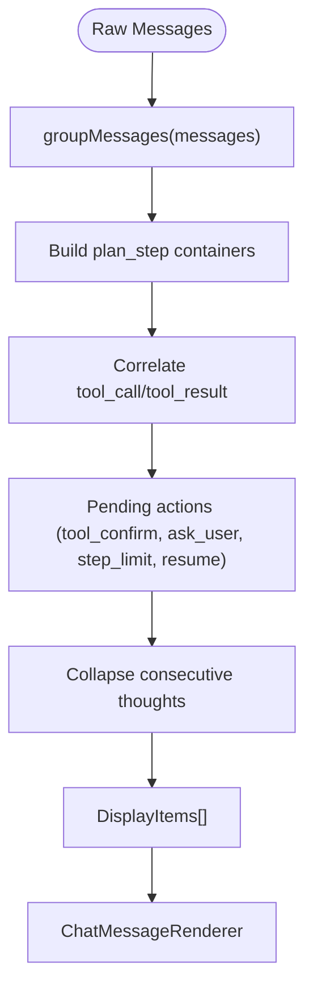
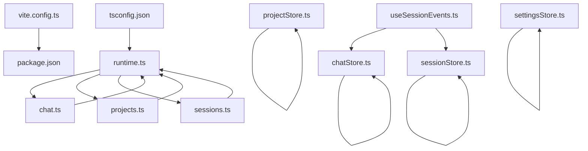

# Frontend Application Architecture

<cite>
**Referenced Files in This Document**
- [App.tsx](file://frontend/src/App.tsx)
- [main.tsx](file://frontend/src/main.tsx)
- [vite.config.ts](file://frontend/vite.config.ts)
- [package.json](file://frontend/package.json)
- [tsconfig.json](file://frontend/tsconfig.json)
- [chatStore.ts](file://frontend/src/stores/chatStore.ts)
- [sessionStore.ts](file://frontend/src/stores/sessionStore.ts)
- [projectStore.ts](file://frontend/src/stores/projectStore.ts)
- [settingsStore.ts](file://frontend/src/stores/settingsStore.ts)
- [AppLayout.tsx](file://frontend/src/components/layout/AppLayout.tsx)
- [runtime.ts](file://frontend/src/api/runtime.ts)
- [chat.ts](file://frontend/src/api/chat.ts)
- [projects.ts](file://frontend/src/api/projects.ts)
- [sessions.ts](file://frontend/src/api/sessions.ts)
- [useSessionEvents.ts](file://frontend/src/hooks/useSessionEvents.ts)
- [useChatEvents.ts](file://frontend/src/hooks/events/useChatEvents.ts)
- [useToolEvents.ts](file://frontend/src/hooks/events/useToolEvents.ts)
- [ChatArea.tsx](file://frontend/src/components/chat/ChatArea.tsx)
- [FileViewerPanel.tsx](file://frontend/src/components/fileViewer/FileViewerPanel.tsx)
</cite>

## Update Summary
**Changes Made**
- Complete removal of Svelte-based architecture references and Wails integration patterns
- Updated architecture to reflect new API-driven approach with subscribe() function replacing useWails() hook
- Introduced centralized API modules (chat.ts, config.ts, mcp.ts, projects.ts, runtime.ts, sessions.ts, workspace.ts)
- Updated state management patterns to use React 19 + Zustand with new API integration
- Revised component architecture to show React 19 + Vite 6 + Zustand + Tailwind v4 stack
- Updated build system documentation to reflect current React ecosystem

## Table of Contents
1. [Introduction](#introduction)
2. [Project Structure](#project-structure)
3. [Core Components](#core-components)
4. [Architecture Overview](#architecture-overview)
5. [Detailed Component Analysis](#detailed-component-analysis)
6. [API Layer and Event System](#api-layer-and-event-system)
7. [Dependency Analysis](#dependency-analysis)
8. [Performance Considerations](#performance-considerations)
9. [Troubleshooting Guide](#troubleshooting-guide)
10. [Conclusion](#conclusion)

## Introduction
This document describes the frontend architecture for the C0WRK application, built with React 19 + Vite 6 + Zustand + Tailwind v4. The application maintains tight integration with a Wails v2-backed Go backend via a centralized API layer with typed event subscriptions. The UI emphasizes a chat-first interface with execution panels, a file viewer, and settings, all orchestrated through a responsive layout with resizable panels.

The architecture follows a clean separation of concerns with API modules providing typed access to backend services, centralized event subscription system for real-time updates, and store-based state management for UI state coordination.

## Project Structure
The frontend is organized around a clear separation of concerns with the current React 19 architecture:
- Entry point and rendering bootstrap with React 19
- Centralized API layer with typed wrappers for backend services
- Layout and page composition using React components
- UI components (chat, file viewer, settings) built with React 19
- Stores for state management using Zustand with granular selectors
- Hooks for event handling and session lifecycle management
- Build configuration and TypeScript setup optimized for React 19

**Diagram sources**
- [main.tsx:1-20](file://frontend/src/main.tsx#L1-L20)
- [App.tsx:1-80](file://frontend/src/App.tsx#L1-L80)
- [runtime.ts:1-78](file://frontend/src/api/runtime.ts#L1-L78)
- [chat.ts:1-56](file://frontend/src/api/chat.ts#L1-L56)
- [projects.ts:1-66](file://frontend/src/api/projects.ts#L1-L66)
- [sessions.ts:1-56](file://frontend/src/api/sessions.ts#L1-L56)
- [AppLayout.tsx:1-135](file://frontend/src/components/layout/AppLayout.tsx#L1-L135)
- [ChatArea.tsx:1-175](file://frontend/src/components/chat/ChatArea.tsx#L1-L175)
- [FileViewerPanel.tsx:1-27](file://frontend/src/components/fileViewer/FileViewerPanel.tsx#L1-L27)
- [chatStore.ts:1-249](file://frontend/src/stores/chatStore.ts#L1-L249)
- [sessionStore.ts:1-76](file://frontend/src/stores/sessionStore.ts#L1-L76)
- [useSessionEvents.ts:1-48](file://frontend/src/hooks/useSessionEvents.ts#L1-L48)
- [useChatEvents.ts:1-134](file://frontend/src/hooks/events/useChatEvents.ts#L1-L134)
- [useToolEvents.ts:1-123](file://frontend/src/hooks/events/useToolEvents.ts#L1-L123)
- [vite.config.ts:1-21](file://frontend/vite.config.ts#L1-L21)
- [package.json:1-61](file://frontend/package.json#L1-L61)
- [tsconfig.json:1-28](file://frontend/tsconfig.json#L1-L28)

**Section sources**
- [main.tsx:1-20](file://frontend/src/main.tsx#L1-L20)
- [vite.config.ts:1-21](file://frontend/vite.config.ts#L1-L21)
- [package.json:1-61](file://frontend/package.json#L1-L61)
- [tsconfig.json:1-28](file://frontend/tsconfig.json#L1-L28)

## Core Components
- App: Initializes Wails runtime, listens for startup and vector index events, renders banners and the main layout using the new subscribe() function pattern.
- AppLayout: Orchestrates sidebar, chat area, execution panels, chat input, file viewer, and status bar with resizable panels and collapsed states.
- ChatArea: Renders grouped chat messages, handles streaming assistant responses, loads session history, and coordinates with session events.
- FileViewerPanel: Manages open files and content rendering within a collapsible/resizable panel.
- Stores: chatStore (message grouping, streaming, context fill, session tokens), sessionStore (sessions list and active session), projectStore (projects list and active project), settingsStore (settings modal state).
- Hooks: useSessionEvents (session-scoped event subscription and UI state updates), useChatEvents (chat-specific event handling), useToolEvents (tool execution events).
- API Layer: runtime.ts provides centralized Wails integration with subscribe() function, chat.ts, projects.ts, and sessions.ts provide typed API wrappers.

**Section sources**
- [App.tsx:16-80](file://frontend/src/App.tsx#L16-L80)
- [AppLayout.tsx:30-135](file://frontend/src/components/layout/AppLayout.tsx#L30-L135)
- [ChatArea.tsx:17-175](file://frontend/src/components/chat/ChatArea.tsx#L17-L175)
- [FileViewerPanel.tsx:9-27](file://frontend/src/components/fileViewer/FileViewerPanel.tsx#L9-L27)
- [chatStore.ts:104-249](file://frontend/src/stores/chatStore.ts#L104-L249)
- [sessionStore.ts:32-76](file://frontend/src/stores/sessionStore.ts#L32-L76)
- [runtime.ts:47-78](file://frontend/src/api/runtime.ts#L47-L78)
- [useSessionEvents.ts:15-48](file://frontend/src/hooks/useSessionEvents.ts#L15-L48)
- [useChatEvents.ts:10-134](file://frontend/src/hooks/events/useChatEvents.ts#L10-134)
- [useToolEvents.ts:18-123](file://frontend/src/hooks/events/useToolEvents.ts#L18-123)

## Architecture Overview
The frontend follows a unidirectional data flow with React 19's component model and Zustand stores:
- UI components subscribe to Zustand stores for state.
- API modules provide typed access to Go backend APIs through Wails runtime.
- Centralized event subscription system handles real-time session events.
- Stores encapsulate complex state transitions and derived computations (e.g., message grouping).

**Diagram sources**
- [App.tsx:16-80](file://frontend/src/App.tsx#L16-L80)
- [AppLayout.tsx:30-135](file://frontend/src/components/layout/AppLayout.tsx#L30-L135)
- [ChatArea.tsx:17-175](file://frontend/src/components/chat/ChatArea.tsx#L17-L175)
- [FileViewerPanel.tsx:9-27](file://frontend/src/components/fileViewer/FileViewerPanel.tsx#L9-L27)
- [chatStore.ts:104-249](file://frontend/src/stores/chatStore.ts#L104-L249)
- [sessionStore.ts:32-76](file://frontend/src/stores/sessionStore.ts#L32-L76)
- [useSessionEvents.ts:15-48](file://frontend/src/hooks/useSessionEvents.ts#L15-L48)
- [useChatEvents.ts:10-134](file://frontend/src/hooks/events/useChatEvents.ts#L10-134)
- [useToolEvents.ts:18-123](file://frontend/src/hooks/events/useToolEvents.ts#L18-123)
- [runtime.ts:47-78](file://frontend/src/api/runtime.ts#L47-L78)
- [chat.ts:7-56](file://frontend/src/api/chat.ts#L7-56)
- [projects.ts:7-66](file://frontend/src/api/projects.ts#L7-66)
- [sessions.ts:7-56](file://frontend/src/api/sessions.ts#L7-56)

## Detailed Component Analysis

### Store-Based State Management
The application uses Zustand for lightweight, composable state management:
- chatStore: Manages per-session messages, streaming text, thinking/activity status, step/session context fill, and pending actions. Provides a complex grouping function to transform raw messages into display items with nested plan steps, tool calls/results, and service/status messages.
- sessionStore: Tracks sessions list, active session, and supports add/update/remove/touch operations with deterministic ordering by last activity.
- projectStore: Mirrors project list and active project with similar mutation semantics.
- settingsStore: Controls the settings modal visibility and active tab.

**Diagram sources**
- [chatStore.ts:13-46](file://frontend/src/stores/chatStore.ts#L13-L46)
- [sessionStore.ts:16-28](file://frontend/src/stores/sessionStore.ts#L16-L28)
- [projectStore.ts:1-44](file://frontend/src/stores/projectStore.ts#L1-L44)
- [settingsStore.ts:1-20](file://frontend/src/stores/settingsStore.ts#L1-L20)

**Section sources**
- [chatStore.ts:104-249](file://frontend/src/stores/chatStore.ts#L104-L249)
- [sessionStore.ts:32-76](file://frontend/src/stores/sessionStore.ts#L32-L76)
- [projectStore.ts:1-44](file://frontend/src/stores/projectStore.ts#L1-L44)
- [settingsStore.ts:1-20](file://frontend/src/stores/settingsStore.ts#L1-L20)

### Component Hierarchy and Responsibilities
- App: Initializes Wails runtime, listens for startup errors and vector index status using the new subscribe() function, renders banners and the main AppLayout.
- AppLayout: Coordinates sidebar, main chat area, execution panels, chat input, and file viewer. Handles resizing and collapsing of panels and displays an empty state when no project is selected.
- ChatArea: Loads session history, groups messages, renders the chat timeline, and manages pinned user messages and scrolling.
- FileViewerPanel: Renders open files with tabs and content, respecting collapsed state and width constraints.

**Diagram sources**
- [App.tsx:16-80](file://frontend/src/App.tsx#L16-L80)
- [AppLayout.tsx:30-135](file://frontend/src/components/layout/AppLayout.tsx#L30-L135)
- [ChatArea.tsx:17-175](file://frontend/src/components/chat/ChatArea.tsx#L17-L175)
- [FileViewerPanel.tsx:9-27](file://frontend/src/components/fileViewer/FileViewerPanel.tsx#L9-L27)

**Section sources**
- [App.tsx:16-80](file://frontend/src/App.tsx#L16-L80)
- [AppLayout.tsx:30-135](file://frontend/src/components/layout/AppLayout.tsx#L30-L135)
- [ChatArea.tsx:17-175](file://frontend/src/components/chat/ChatArea.tsx#L17-L175)
- [FileViewerPanel.tsx:9-27](file://frontend/src/components/fileViewer/FileViewerPanel.tsx#L9-L27)

### API Layer and Event System
- runtime.ts: Provides centralized Wails integration with subscribe() function for event subscription, onSessionEvent() for typed session-scoped events, and getApp() for typed RPC access.
- API Modules: chat.ts, projects.ts, sessions.ts provide typed wrappers around Wails RPC calls with proper error handling and logging.
- Event Handling: useSessionEvents orchestrates multiple event hooks (useChatEvents, useToolEvents, etc.) to manage session lifecycle and UI state updates.
- Backend Types: Strongly typed event payloads and data exchanged with the backend through the API layer.

**Diagram sources**
- [runtime.ts:47-78](file://frontend/src/api/runtime.ts#L47-L78)
- [chat.ts:7-56](file://frontend/src/api/chat.ts#L7-56)
- [useSessionEvents.ts:15-48](file://frontend/src/hooks/useSessionEvents.ts#L15-L48)
- [useChatEvents.ts:10-134](file://frontend/src/hooks/events/useChatEvents.ts#L10-134)
- [chatStore.ts:104-249](file://frontend/src/stores/chatStore.ts#L104-L249)

**Section sources**
- [runtime.ts:1-78](file://frontend/src/api/runtime.ts#L1-L78)
- [chat.ts:1-56](file://frontend/src/api/chat.ts#L1-L56)
- [projects.ts:1-66](file://frontend/src/api/projects.ts#L1-L66)
- [sessions.ts:1-56](file://frontend/src/api/sessions.ts#L1-L56)
- [useSessionEvents.ts:1-48](file://frontend/src/hooks/useSessionEvents.ts#L1-L48)
- [useChatEvents.ts:1-134](file://frontend/src/hooks/events/useChatEvents.ts#L1-L134)
- [useToolEvents.ts:1-123](file://frontend/src/hooks/events/useToolEvents.ts#L1-L123)

### Message Grouping and Rendering Pipeline
The chat rendering pipeline transforms raw messages into a structured display tree:
- groupMessages builds nested plan steps, groups consecutive thoughts, and correlates tool calls with results.
- ChatArea computes display items and renders the timeline with pinned user messages and a scroll manager.

**Diagram sources**
- [chatStore.ts:7-9](file://frontend/src/stores/chatStore.ts#L7-L9)
- [ChatArea.tsx:103](file://frontend/src/components/chat/ChatArea.tsx#L103)

**Section sources**
- [chatStore.ts:7-9](file://frontend/src/stores/chatStore.ts#L7-L9)
- [ChatArea.tsx:103](file://frontend/src/components/chat/ChatArea.tsx#L103)

## API Layer and Event System

### Centralized Runtime Integration
The runtime.ts module provides a single access point for Wails integration:
- subscribe(): Universal event subscription with automatic cleanup
- onSessionEvent(): Typed session-scoped event subscription with auto-prefixing
- getApp(): Typed access to Go backend RPC methods
- isWailsReady(): Runtime availability check

### API Module Pattern
Each domain has its own API module with consistent patterns:
- Error handling with centralized logging
- Type-safe RPC calls with proper casting
- Async operation wrappers with proper error propagation
- Domain-specific convenience functions

### Event Subscription Patterns
- useSessionEvents: Orchestrates multiple event hooks for comprehensive session management
- useChatEvents: Handles chat-specific events (assistant_chunk, assistant_done, thought, error, etc.)
- useToolEvents: Manages tool execution lifecycle and confirmation flows
- Centralized cleanup: All event subscriptions return cleanup functions for proper resource management

**Section sources**
- [runtime.ts:1-78](file://frontend/src/api/runtime.ts#L1-L78)
- [chat.ts:1-56](file://frontend/src/api/chat.ts#L1-L56)
- [projects.ts:1-66](file://frontend/src/api/projects.ts#L1-L66)
- [sessions.ts:1-56](file://frontend/src/api/sessions.ts#L1-L56)
- [useSessionEvents.ts:1-48](file://frontend/src/hooks/useSessionEvents.ts#L1-L48)
- [useChatEvents.ts:1-134](file://frontend/src/hooks/events/useChatEvents.ts#L1-L134)
- [useToolEvents.ts:1-123](file://frontend/src/hooks/events/useToolEvents.ts#L1-L123)

## Dependency Analysis
- Build system: Vite with React plugin and TailwindCSS integration; TypeScript configured with strictness and path aliases; package dependencies include React 19, Radix UI, Lucide icons, Mermaid, and Zustand.
- Runtime integration: Generated Wails bindings accessed via window.go and window.runtime; runtime.ts provides typed access and event subscription.
- Store coupling: Components depend on stores via selector patterns; stores are decoupled from UI and only mutate state.

**Diagram sources**
- [vite.config.ts:1-21](file://frontend/vite.config.ts#L1-L21)
- [package.json:1-61](file://frontend/package.json#L1-L61)
- [tsconfig.json:1-28](file://frontend/tsconfig.json#L1-L28)
- [runtime.ts:1-78](file://frontend/src/api/runtime.ts#L1-L78)
- [chat.ts:1-56](file://frontend/src/api/chat.ts#L1-L56)
- [projects.ts:1-66](file://frontend/src/api/projects.ts#L1-L66)
- [sessions.ts:1-56](file://frontend/src/api/sessions.ts#L1-L56)
- [useSessionEvents.ts:1-48](file://frontend/src/hooks/useSessionEvents.ts#L1-L48)
- [chatStore.ts:104-249](file://frontend/src/stores/chatStore.ts#L104-L249)
- [sessionStore.ts:32-76](file://frontend/src/stores/sessionStore.ts#L32-L76)

**Section sources**
- [vite.config.ts:1-21](file://frontend/vite.config.ts#L1-L21)
- [package.json:1-61](file://frontend/package.json#L1-L61)
- [tsconfig.json:1-28](file://frontend/tsconfig.json#L1-L28)

## Performance Considerations
- Selective re-renders: Components subscribe to minimal slices of stores using selector patterns to avoid unnecessary re-renders.
- Memoization: ChatArea uses memoized message grouping to prevent recomputation on every render.
- Streaming UI: Assistant chunks are applied incrementally to keep the UI responsive during long generations.
- Resize observers and layout measurements: ChatArea measures container height efficiently and falls back to animation frames when ResizeObserver is unavailable.
- Store granularity: Separate stores for chat, sessions, projects, and UI state reduce cross-store dependencies and improve locality.
- Event cleanup: Proper subscription cleanup prevents memory leaks and ensures efficient event handling.

## Troubleshooting Guide
- Startup errors: App listens for startup errors from the backend using the new subscribe() function and displays a dismissible banner with message and error details.
- Vector index status: App listens for vector index events and updates the vector index store accordingly.
- Session history loading: ChatArea surfaces a history load error state and logs the failure.
- Session events: useSessionEvents validates payloads and updates UI state; ensure the active session is set before subscribing.
- API errors: All API modules include centralized error logging and proper error propagation.
- Runtime availability: Use isWailsReady() to check runtime availability before making RPC calls.

**Section sources**
- [App.tsx:25-43](file://frontend/src/App.tsx#L25-L43)
- [App.tsx:33-39](file://frontend/src/App.tsx#L33-L39)
- [ChatArea.tsx:97-100](file://frontend/src/components/chat/ChatArea.tsx#L97-L100)
- [useSessionEvents.ts:15-48](file://frontend/src/hooks/useSessionEvents.ts#L15-L48)
- [runtime.ts:21-32](file://frontend/src/api/runtime.ts#L21-L32)

## Conclusion
C0WRK's frontend is built with a clean separation between UI components, store-based state management, and a centralized API layer that bridges to the Wails backend. The architecture emphasizes real-time session events, robust message grouping, and a responsive layout with resizable panels. The build system and TypeScript configuration support a scalable development workflow, while the store abstractions enable maintainable state transitions across chat, sessions, projects, and settings.

The new API-driven approach with subscribe() function replacing useWails() hook provides better type safety, cleaner event handling, and more maintainable integration patterns. The architecture leverages React 19's component model with Zustand for efficient state management, ensuring optimal performance and developer experience.