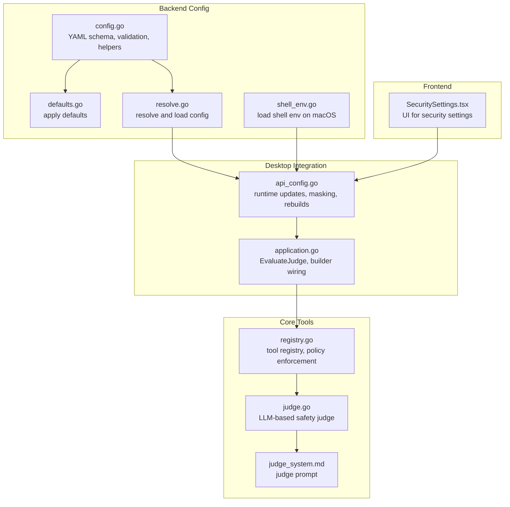
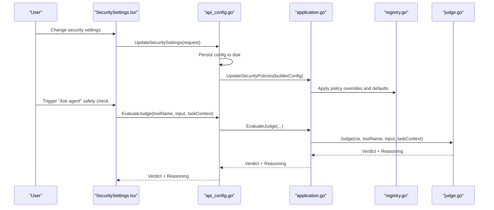
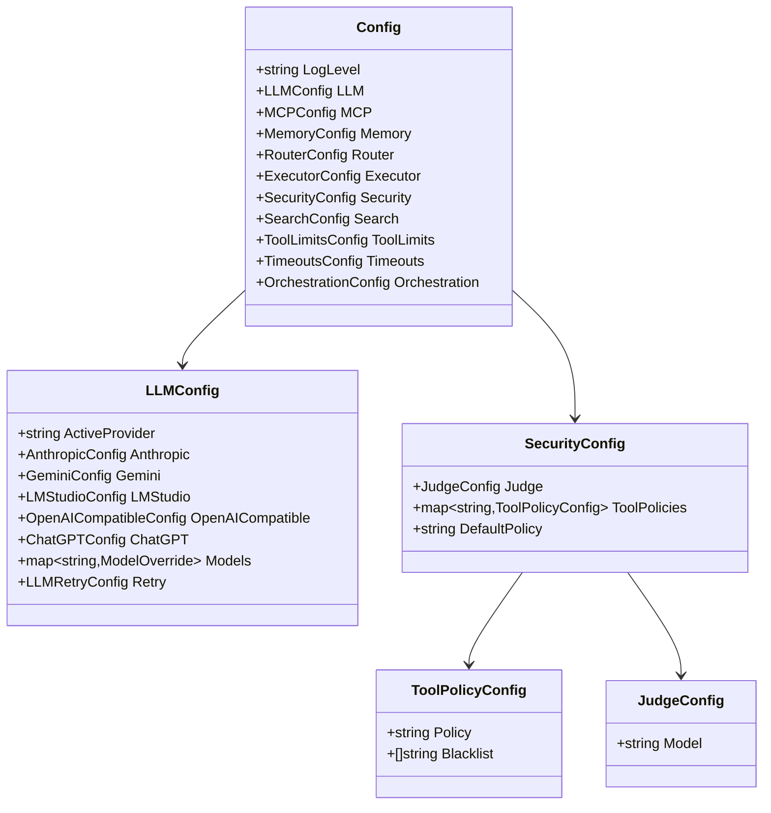
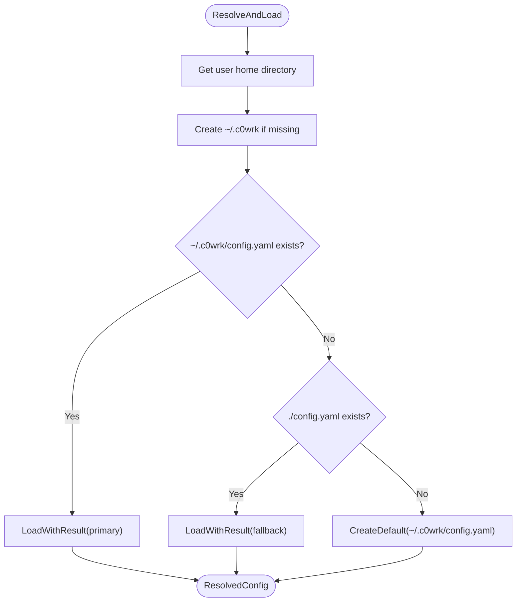
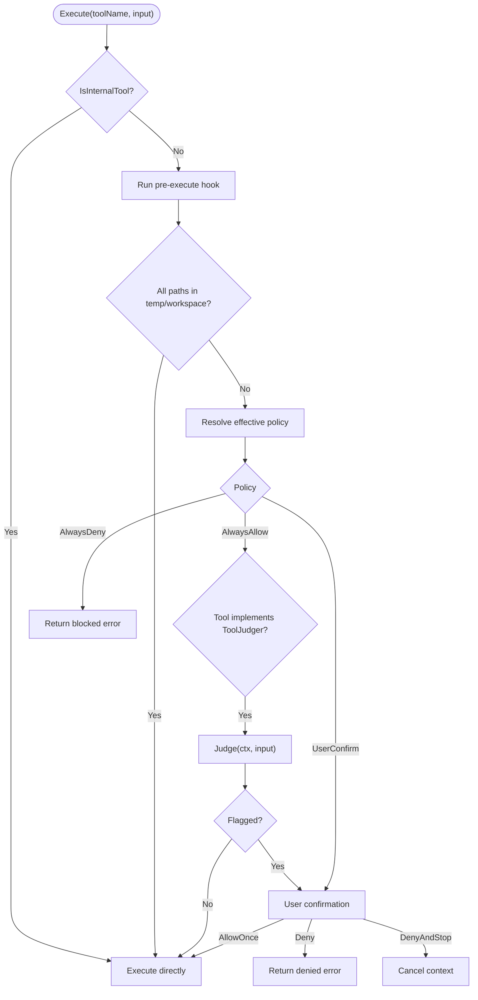
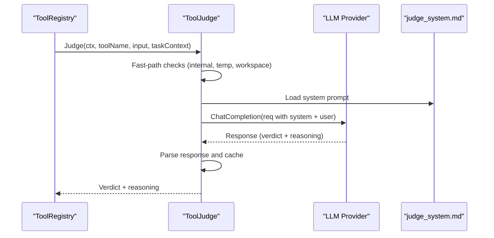
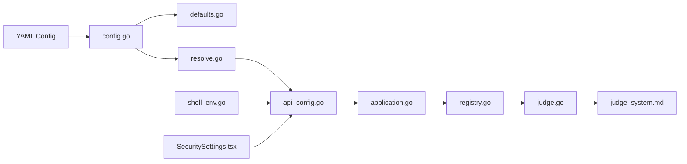

# Configuration and Security

<cite>
**Referenced Files in This Document**
- [config.go](file://backend/config/config.go)
- [defaults.go](file://backend/config/defaults.go)
- [resolve.go](file://backend/config/resolve.go)
- [shell_env.go](file://backend/config/shell_env.go)
- [config.example.yaml](file://config.example.yaml)
- [judge.go](file://core/tools/judge.go)
- [registry.go](file://core/tools/registry.go)
- [judge_system.md](file://core/tools/prompts/judge_system.md)
- [SecuritySettings.tsx](file://frontend/src/components/settings/SecuritySettings.tsx)
- [api_config.go](file://desktop/api_config.go)
- [application.go](file://backend/application.go)
</cite>

## Table of Contents
1. [Introduction](#introduction)
2. [Project Structure](#project-structure)
3. [Core Components](#core-components)
4. [Architecture Overview](#architecture-overview)
5. [Detailed Component Analysis](#detailed-component-analysis)
6. [Dependency Analysis](#dependency-analysis)
7. [Performance Considerations](#performance-considerations)
8. [Troubleshooting Guide](#troubleshooting-guide)
9. [Conclusion](#conclusion)
10. [Appendices](#appendices)

## Introduction
This document explains C0WRK’s configuration system and security framework. It covers the YAML configuration structure, environment variable support, and configuration resolution hierarchy. It documents security policies, tool policy enforcement, and the LLM-based safety judgment system. It also describes shell environment handling, access control mechanisms, input validation strategies, configuration validation, defaults, and security best practices. Guidance is provided for configuring LLM providers, setting execution limits, managing sensitive credentials, and understanding the safety judgment workflow, policy evaluation, and risk assessment mechanisms. Secure configuration patterns and troubleshooting tips are included.

## Project Structure
C0WRK organizes configuration and security across backend configuration, core tools, desktop integration, and frontend settings:
- Backend configuration: YAML schema, defaults, resolution, and environment variable expansion
- Core tools: Tool registry, policy enforcement, and LLM-based safety judge
- Desktop integration: Runtime updates, masking of secrets, and rebuilding subsystems
- Frontend: UI for security settings and policy management

**Diagram sources**
- [config.go:1-408](file://backend/config/config.go#L1-L408)
- [defaults.go:1-270](file://backend/config/defaults.go#L1-L270)
- [resolve.go:1-115](file://backend/config/resolve.go#L1-L115)
- [shell_env.go:1-99](file://backend/config/shell_env.go#L1-L99)
- [registry.go:1-277](file://core/tools/registry.go#L1-L277)
- [judge.go:1-350](file://core/tools/judge.go#L1-L350)
- [judge_system.md:1-32](file://core/tools/prompts/judge_system.md#L1-L32)
- [api_config.go:1-390](file://desktop/api_config.go#L1-L390)
- [application.go:1-200](file://backend/application.go#L1-L200)
- [SecuritySettings.tsx:1-328](file://frontend/src/components/settings/SecuritySettings.tsx#L1-L328)

**Section sources**
- [config.go:1-408](file://backend/config/config.go#L1-L408)
- [defaults.go:1-270](file://backend/config/defaults.go#L1-L270)
- [resolve.go:1-115](file://backend/config/resolve.go#L1-L115)
- [shell_env.go:1-99](file://backend/config/shell_env.go#L1-L99)
- [registry.go:1-277](file://core/tools/registry.go#L1-L277)
- [judge.go:1-350](file://core/tools/judge.go#L1-L350)
- [judge_system.md:1-32](file://core/tools/prompts/judge_system.md#L1-L32)
- [api_config.go:1-390](file://desktop/api_config.go#L1-L390)
- [application.go:1-200](file://backend/application.go#L1-L200)
- [SecuritySettings.tsx:1-328](file://frontend/src/components/settings/SecuritySettings.tsx#L1-L328)

## Core Components
- Configuration schema and validation: Defines top-level sections (LLM, MCP, memory, router, executor, security, search, tool limits, timeouts, orchestration), provider-specific fields, and validation rules.
- Defaults application: Applies sensible defaults for all zero-value fields, including executor, compaction, tool budgets, circuit breaker, LLM retry, memory, router, security, tool limits, timeouts, and orchestration.
- Configuration resolution: Resolves configuration file path, creates agent directory, loads config with fallback, and supports migration and warnings.
- Environment variable expansion: Preserves ${VAR} placeholders in YAML and expands them at runtime via a helper function.
- Shell environment loading: On macOS, sources shell environment to populate PATH and other variables for consistent tool execution.
- Security policies and enforcement: Registry enforces per-tool policies (always allow, always deny, user confirm), filters internal tools, and auto-approves workspace/temp operations.
- LLM-based safety judge: Evaluates tool calls using a dedicated model, caches results, and returns allow/confirm verdicts with reasoning.
- Frontend and desktop integration: Provides UI for security settings, masks sensitive values, persists changes, and triggers runtime rebuilds of judge/router.

**Section sources**
- [config.go:18-407](file://backend/config/config.go#L18-L407)
- [defaults.go:9-269](file://backend/config/defaults.go#L9-L269)
- [resolve.go:20-114](file://backend/config/resolve.go#L20-L114)
- [shell_env.go:14-98](file://backend/config/shell_env.go#L14-L98)
- [registry.go:13-276](file://core/tools/registry.go#L13-L276)
- [judge.go:39-350](file://core/tools/judge.go#L39-L350)
- [api_config.go:249-311](file://desktop/api_config.go#L249-L311)
- [SecuritySettings.tsx:61-327](file://frontend/src/components/settings/SecuritySettings.tsx#L61-L327)

## Architecture Overview
The configuration and security architecture integrates YAML-driven configuration with runtime enforcement and user interface controls.

**Diagram sources**
- [SecuritySettings.tsx:109-127](file://frontend/src/components/settings/SecuritySettings.tsx#L109-L127)
- [api_config.go:275-311](file://desktop/api_config.go#L275-L311)
- [application.go:164-180](file://backend/application.go#L164-L180)
- [registry.go:150-240](file://core/tools/registry.go#L150-L240)
- [judge.go:70-188](file://core/tools/judge.go#L70-L188)

## Detailed Component Analysis

### Configuration Schema and Validation
- Top-level structure includes logging, LLM providers, MCP servers, memory, router, executor, security, search, tool limits, timeouts, and orchestration.
- LLM configuration supports multiple providers with provider-specific fields and a models override map for context windows and output limits.
- Validation ensures active provider is set, is one of supported values, has a model set, and openai_compatible includes a base URL.
- Additional validation prevents custom policies for internal tools.

**Diagram sources**
- [config.go:18-212](file://backend/config/config.go#L18-L212)

**Section sources**
- [config.go:18-407](file://backend/config/config.go#L18-L407)

### Defaults Application
- Defaults are applied for:
  - Executor: max_react_steps, max_retries, output_token_reserve
  - Compaction: sliding window, summarization, hierarchical ratios, thresholds, margins
  - Tool result budget and pruning
  - Circuit breaker thresholds
  - LLM retry behavior and LMStudio base URL
  - Memory, router, security defaults (including default policy and default tool policies)
  - Tool limits for reads, searches, and web fetch
  - Timeouts for bash, ripgrep, web fetch/search, persistence
  - Orchestration limits and synthetic plan threshold

**Section sources**
- [defaults.go:9-269](file://backend/config/defaults.go#L9-L269)

### Configuration Resolution and Fallback
- Resolves configuration path preferring ~/.c0wrk/config.yaml, falls back to ./config.yaml, and creates a default if neither exists.
- Loads with validation and migration support, logs warnings, and returns a ResolvedConfig with config path, agent directory, and load errors.

**Diagram sources**
- [resolve.go:32-114](file://backend/config/resolve.go#L32-L114)

**Section sources**
- [resolve.go:20-114](file://backend/config/resolve.go#L20-L114)

### Environment Variable Support
- YAML supports ${ENV_VAR} placeholders; they are preserved in the config and expanded at runtime via a helper function.
- Shell environment loading on macOS sources login shells to populate environment variables, especially PATH, while avoiding overrides for already-set variables except PATH.

**Section sources**
- [config.go:273-284](file://backend/config/config.go#L273-L284)
- [shell_env.go:14-98](file://backend/config/shell_env.go#L14-L98)

### Security Policies and Enforcement
- Policies:
  - always_allow: tool executes without confirmation
  - always_deny: tool execution blocked
  - user_confirm: requires user confirmation before execution
- Default policy is user_confirm; default tool policies include protections for bash_exec, write_file, edit_file, and allow-listed tools like web_search/web_fetch.
- Internal tools (ask_user, finish, list_step_outputs, read_step_output) are always allowed and excluded from policy configuration.
- Workspace and temp directory auto-approval: if all paths in input are within the session workspace or temp directory, execution proceeds without confirmation (unless policy is always_deny).
- Tool-specific judge integration: for always_allow tools that implement a judge, a negative judgment escalates to user confirmation.

**Diagram sources**
- [registry.go:164-276](file://core/tools/registry.go#L164-L276)

**Section sources**
- [registry.go:13-276](file://core/tools/registry.go#L13-L276)
- [defaults.go:152-191](file://backend/config/defaults.go#L152-L191)

### LLM-Based Safety Judgment
- Dedicated judge uses a system prompt to evaluate relevance and destructiveness of tool calls.
- Input includes task context and environment context; response is parsed for VERDICT and REASON.
- Fast-path allowances: internal tools, temp directory operations, workspace-only operations.
- Caching: SHA-256 hash of input plus tool name; cache eviction clears on size threshold.
- Fail-safe behavior: on LLM errors or parsing failures, defaults to user confirmation with explanatory reasoning.

**Diagram sources**
- [judge.go:70-188](file://core/tools/judge.go#L70-L188)
- [judge_system.md:1-32](file://core/tools/prompts/judge_system.md#L1-L32)

**Section sources**
- [judge.go:39-350](file://core/tools/judge.go#L39-L350)
- [judge_system.md:1-32](file://core/tools/prompts/judge_system.md#L1-L32)

### Frontend and Desktop Integration
- SecuritySettings UI lists tools grouped by source, allows changing default policy and per-tool policy, and manages blacklist patterns for bash_exec.
- Desktop API:
  - GetSecuritySettings returns sanitized settings, filtering internal tools
  - UpdateSecuritySettings replaces the full policy map, rebuilds judge/router, and persists config
  - EvaluateJudge routes to backend builder to obtain a verdict and reasoning
  - Masking of API keys in UI responses
  - Runtime rebuilds of judge and router when LLM settings change

**Section sources**
- [SecuritySettings.tsx:61-327](file://frontend/src/components/settings/SecuritySettings.tsx#L61-L327)
- [api_config.go:249-311](file://desktop/api_config.go#L249-L311)
- [application.go:164-180](file://backend/application.go#L164-L180)

## Dependency Analysis
- Configuration depends on YAML parsing and environment expansion; defaults and validation ensure robustness.
- Tool registry depends on configuration for policies and judge; judge depends on LLM provider and prompt templates.
- Desktop API bridges UI and backend, persisting changes and triggering rebuilds.
- Frontend depends on desktop API for security settings and judge evaluations.

**Diagram sources**
- [config.go:1-408](file://backend/config/config.go#L1-L408)
- [defaults.go:1-270](file://backend/config/defaults.go#L1-L270)
- [resolve.go:1-115](file://backend/config/resolve.go#L1-L115)
- [shell_env.go:1-99](file://backend/config/shell_env.go#L1-L99)
- [registry.go:1-277](file://core/tools/registry.go#L1-L277)
- [judge.go:1-350](file://core/tools/judge.go#L1-L350)
- [judge_system.md:1-32](file://core/tools/prompts/judge_system.md#L1-L32)
- [api_config.go:1-390](file://desktop/api_config.go#L1-L390)
- [application.go:1-200](file://backend/application.go#L1-L200)
- [SecuritySettings.tsx:1-328](file://frontend/src/components/settings/SecuritySettings.tsx#L1-L328)

**Section sources**
- [config.go:1-408](file://backend/config/config.go#L1-L408)
- [registry.go:1-277](file://core/tools/registry.go#L1-L277)
- [judge.go:1-350](file://core/tools/judge.go#L1-L350)
- [api_config.go:1-390](file://desktop/api_config.go#L1-L390)

## Performance Considerations
- Judge caching reduces repeated LLM calls; cache eviction clears the map when capacity is reached.
- Tool output pruning and result budgeting help maintain context window utilization and reduce overhead.
- Circuit breaker thresholds protect against runaway loops and repeated failures.
- Timeouts for long-running operations (bash, ripgrep, web fetch/search) prevent resource exhaustion.
- Environment loading on macOS is best-effort and timed to avoid startup delays.

[No sources needed since this section provides general guidance]

## Troubleshooting Guide
Common issues and resolutions:
- Configuration load errors:
  - Verify YAML syntax and indentation
  - Check for unknown keys or incorrect types
  - Review warnings logged during load
- Provider configuration:
  - Ensure active_provider is one of supported values
  - Provide model for the active provider
  - For openai_compatible, include base_url
- Security policy conflicts:
  - Internal tools cannot have custom policies; remove them from tool_policies
  - Adjust default_policy or per-tool policies as needed
- Judge not available:
  - Ensure a model is configured for the judge; otherwise, evaluations will require user confirmation
- Sensitive credentials exposure:
  - Store API keys in environment variables and reference them as ${ENV_VAR} in config
  - Desktop UI masks API keys in responses; do not paste raw values into config files
- macOS PATH issues:
  - Use shell environment loading to source login profiles; verify PATH includes required directories

**Section sources**
- [config.go:376-407](file://backend/config/config.go#L376-L407)
- [defaults.go:152-191](file://backend/config/defaults.go#L152-L191)
- [api_config.go:371-380](file://desktop/api_config.go#L371-L380)
- [shell_env.go:14-98](file://backend/config/shell_env.go#L14-L98)

## Conclusion
C0WRK’s configuration system is robust, defaults-driven, and validated at load time. Security is enforced through a layered policy model, workspace/temp auto-approval, and an LLM-based safety judge with caching and fail-safe behavior. The desktop and frontend integrate seamlessly to allow runtime updates, masking of secrets, and on-demand safety assessments. By following the secure configuration patterns and best practices outlined here, operators can tailor C0WRK to their environment while maintaining strong safeguards.

[No sources needed since this section summarizes without analyzing specific files]

## Appendices

### Configuration Resolution Hierarchy
- Prefer ~/.c0wrk/config.yaml
- Fallback to ./config.yaml
- Create default config if none found
- Apply defaults and validate
- Log migration messages and warnings

**Section sources**
- [resolve.go:32-114](file://backend/config/resolve.go#L32-L114)

### Example: Secure Provider Configuration
- Use ${ENV_VAR} placeholders for API keys
- Set active_provider and model appropriately
- For openai_compatible, specify base_url
- Save and reload configuration; desktop rebuilds judge/router automatically

**Section sources**
- [config.example.yaml:14-51](file://config.example.yaml#L14-L51)
- [api_config.go:138-220](file://desktop/api_config.go#L138-L220)

### Example: Safe Tool Policies
- Default policy: user_confirm
- Protect destructive tools (bash_exec, write_file, edit_file) with user_confirm
- Allow read/search tools (web_search, web_fetch) with always_allow
- Customize blacklist patterns for bash_exec as needed

**Section sources**
- [defaults.go:152-191](file://backend/config/defaults.go#L152-L191)
- [SecuritySettings.tsx:43-52](file://frontend/src/components/settings/SecuritySettings.tsx#L43-L52)

### Execution Limits and Timeouts
- Adjust executor limits (max_react_steps, max_retries, output_token_reserve)
- Tune timeouts for bash, ripgrep, web fetch/search, and persistence
- Configure tool limits for reads, searches, and web fetch sizes

**Section sources**
- [defaults.go:198-246](file://backend/config/defaults.go#L198-L246)
- [config.go:239-247](file://backend/config/config.go#L239-L247)

### Managing Sensitive Credentials
- Store API keys in environment variables
- Reference them in config as ${ENV_VAR}
- Desktop UI masks displayed values; do not paste raw values into config files
- Use environment expansion at runtime for dynamic values

**Section sources**
- [config.go:273-284](file://backend/config/config.go#L273-L284)
- [api_config.go:371-380](file://desktop/api_config.go#L371-L380)