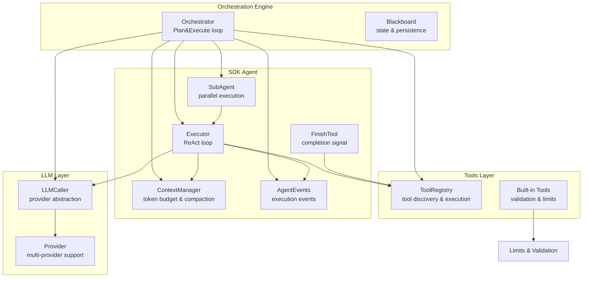
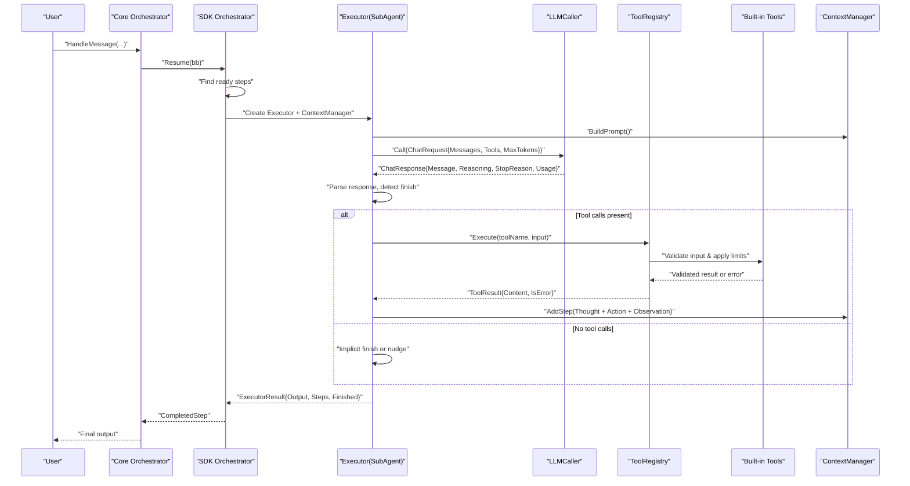
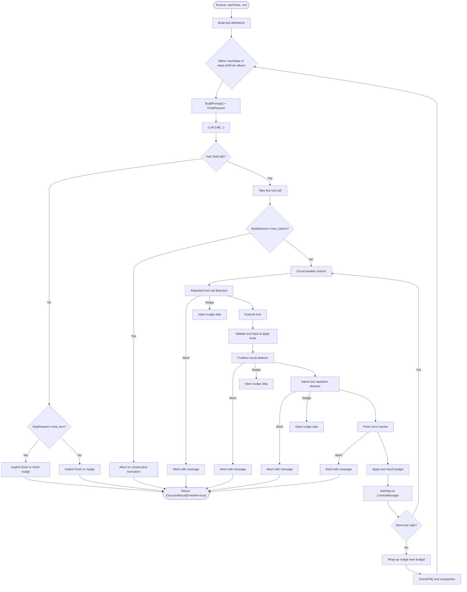
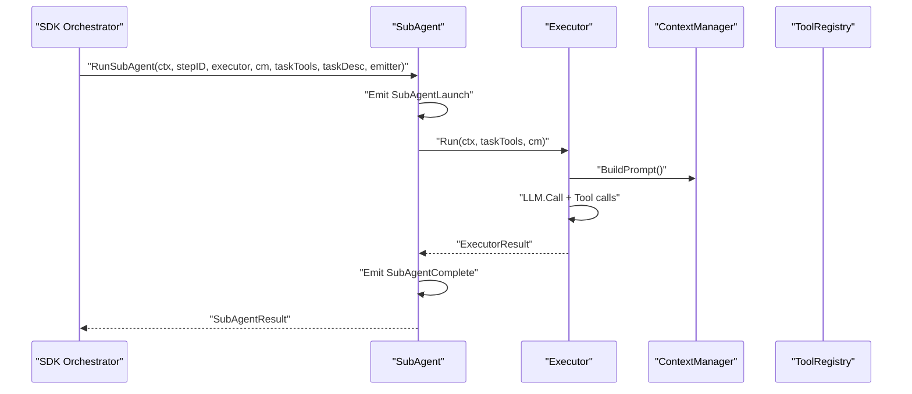
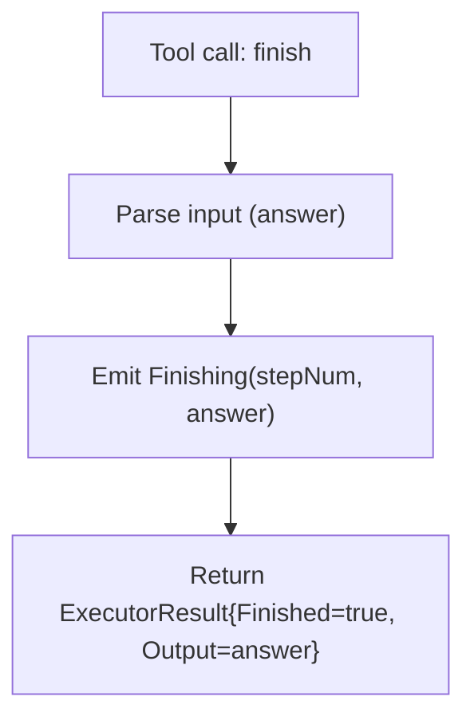
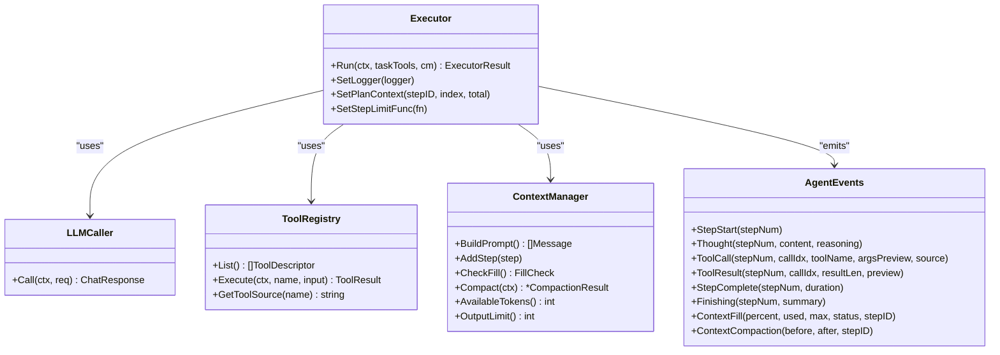
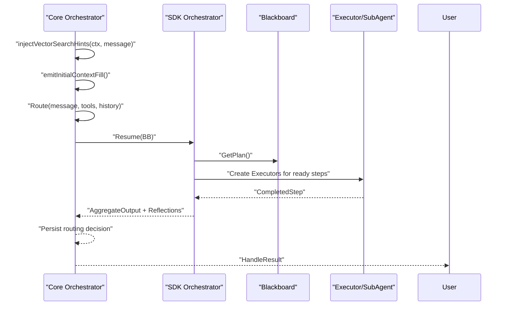
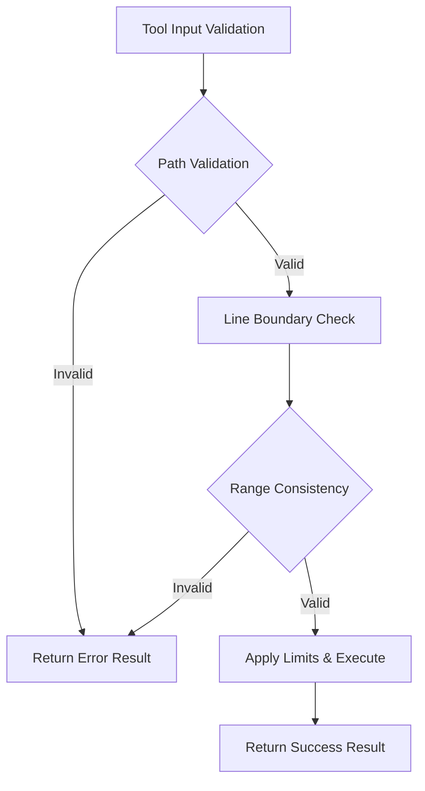
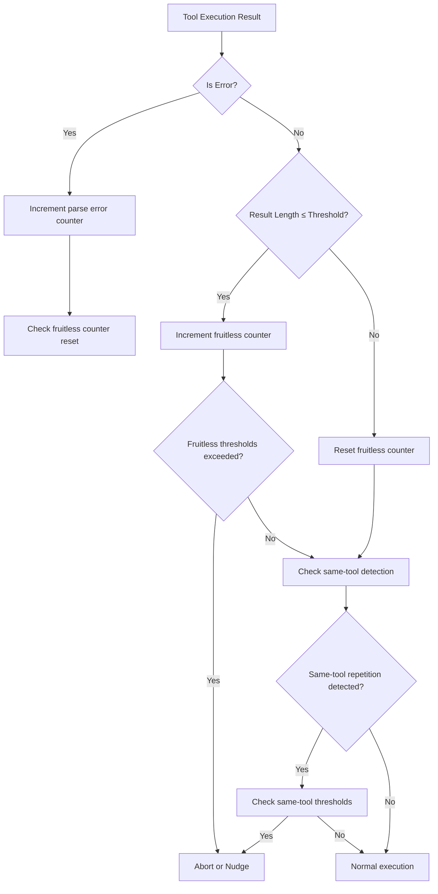
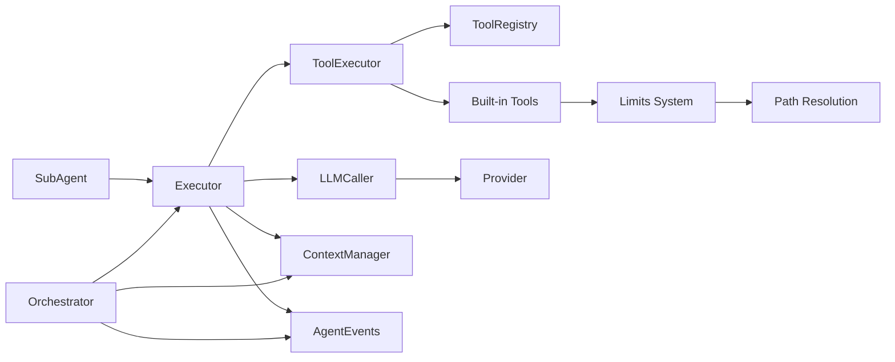

# Agent Executor

<cite>
**Referenced Files in This Document**
- [executor.go](file://sdk/agent/executor.go)
- [subagent.go](file://sdk/agent/subagent.go)
- [finish.go](file://sdk/agent/finish.go)
- [types.go](file://sdk/agent/types.go)
- [events.go](file://sdk/agent/events.go)
- [workspace.go](file://sdk/agent/workspace.go)
- [toolformat.go](file://sdk/agent/toolformat.go)
- [orchestrator.go](file://sdk/orchestration/orchestrator.go)
- [core_orchestrator.go](file://core/orchestrator.go)
- [context.go](file://sdk/memory/context.go)
- [provider.go](file://sdk/llm/provider.go)
- [registry.go](file://sdk/tools/registry.go)
- [emitter.go](file://backend/session/emitter.go)
- [limits.go](file://sdk/tools/builtins/limits.go)
- [paths.go](file://sdk/tools/builtins/paths.go)
- [file_read.go](file://sdk/tools/builtins/file_read.go)
- [file_write.go](file://sdk/tools/builtins/file_write.go)
- [file_edit.go](file://sdk/tools/builtins/file_edit.go)
- [file_search.go](file://sdk/tools/builtins/file_search.go)
- [file_search_content.go](file://sdk/tools/builtins/file_search_content.go)
- [webfetch.go](file://sdk/tools/builtins/webfetch.go)
- [config.go](file://backend/config/config.go)
- [tool.go](file://sdk/tools/tool.go)
</cite>

## Update Summary
**Changes Made**
- Enhanced tool validation and error handling documentation with comprehensive input validation for built-in tools
- Updated circuit breaker logic documentation with improved fruitless result detection and error-aware thresholds
- Added detailed coverage of path parameter validation, line boundary checks, and range consistency validation
- Expanded tool execution tracking documentation with better error handling mechanisms
- Updated built-in tool validation examples and error reporting patterns

## Table of Contents
1. [Introduction](#introduction)
2. [Project Structure](#project-structure)
3. [Core Components](#core-components)
4. [Architecture Overview](#architecture-overview)
5. [Detailed Component Analysis](#detailed-component-analysis)
6. [Enhanced Tool Validation and Error Handling](#enhanced-tool-validation-and-error-handling)
7. [Improved Circuit Breaker Logic](#improved-circuit-breaker-logic)
8. [Dependency Analysis](#dependency-analysis)
9. [Performance Considerations](#performance-considerations)
10. [Troubleshooting Guide](#troubleshooting-guide)
11. [Conclusion](#conclusion)
12. [Appendices](#appendices)

## Introduction
This document explains the C0WRK agent executor system that powers the ReAct loop (Reasoning and Acting). It covers:
- The ReAct loop implementation with explicit reasoning and acting phases
- Circuit breaker protections against repeated tool misuse, truncation, parse errors, and fruitless results
- Step-by-step execution monitoring and event emission
- Integration with the tool registry, LLM providers, and context management
- Subagent system enabling parallel plan execution
- Finish detection and task completion semantics
- Error handling, retry logic, and budget management
- Coordination with the orchestrator's planning and routing decisions
- **Enhanced tool validation and comprehensive input validation for built-in tools**
- **Improved circuit breaker logic with error-aware thresholds and fruitless result detection**

## Project Structure
The executor resides in the SDK agent package and integrates with the orchestration engine, memory, tools, and LLM layers. The orchestrator coordinates planning and routing, while the executor runs the ReAct loop per step.

**Diagram sources**
- [executor.go:49-95](file://sdk/agent/executor.go#L49-L95)
- [subagent.go:11-23](file://sdk/agent/subagent.go#L11-L23)
- [finish.go:12-28](file://sdk/agent/finish.go#L12-L28)
- [context.go:27-43](file://sdk/memory/context.go#L27-L43)
- [events.go:5-26](file://sdk/agent/events.go#L5-L26)
- [orchestrator.go:20-47](file://sdk/orchestration/orchestrator.go#L20-L47)
- [provider.go:6-23](file://sdk/llm/provider.go#L6-L23)
- [registry.go:11-17](file://sdk/tools/registry.go#L11-L17)
- [limits.go:1-92](file://sdk/tools/builtins/limits.go#L1-L92)

**Section sources**
- [executor.go:49-116](file://sdk/agent/executor.go#L49-L116)
- [orchestrator.go:20-47](file://sdk/orchestration/orchestrator.go#L20-L47)

## Core Components
- Executor: Implements the ReAct loop, manages tool calls, budgets, and circuit breakers.
- SubAgent: Wraps an Executor to run steps in parallel.
- FinishTool: Special tool signaling task completion.
- ContextManager: Tracks token usage, enforces budgets, and compacts context.
- AgentEvents: Emits lifecycle events for UI and observability.
- Orchestrator: Coordinates planning, routing, and step execution; wires the executor into the plan DAG.
- **Built-in Tools: Comprehensive input validation with path resolution, line boundary checking, and range consistency validation.**
- **Limits System: Configurable constraints for file operations, search results, and tool execution limits.**

**Section sources**
- [executor.go:49-116](file://sdk/agent/executor.go#L49-L116)
- [subagent.go:11-23](file://sdk/agent/subagent.go#L11-L23)
- [finish.go:12-28](file://sdk/agent/finish.go#L12-L28)
- [context.go:27-43](file://sdk/memory/context.go#L27-L43)
- [events.go:5-26](file://sdk/agent/events.go#L5-L26)
- [orchestrator.go:20-47](file://sdk/orchestration/orchestrator.go#L20-L47)
- [limits.go:1-92](file://sdk/tools/builtins/limits.go#L1-L92)

## Architecture Overview
The orchestrator builds a plan and dispatches steps to executors. Each executor maintains its own ReAct loop with integrated budgeting and safety checks. Parallelism is achieved via subagents that run executors concurrently.

**Diagram sources**
- [core_orchestrator.go:344-598](file://core/orchestrator.go#L344-L598)
- [orchestrator.go:348-752](file://sdk/orchestration/orchestrator.go#L348-L752)
- [executor.go:202-773](file://sdk/agent/executor.go#L202-L773)
- [context.go:167-200](file://sdk/memory/context.go#L167-L200)
- [provider.go:6-23](file://sdk/llm/provider.go#L6-L23)
- [registry.go:91-100](file://sdk/tools/registry.go#L91-L100)
- [limits.go:1-92](file://sdk/tools/builtins/limits.go#L1-L92)

## Detailed Component Analysis

### Executor: ReAct Loop with Safety and Budgeting
The executor runs a ReAct loop with explicit reasoning and acting phases. It:
- Builds a chat request from the context window
- Calls the LLM for reasoning and tool calls
- Executes tool actions and applies budgeting and truncation
- Enforces circuit breakers for repeated tool misuse, truncation, parse errors, and fruitless results
- Detects finish conditions and wraps up execution

**Diagram sources**
- [executor.go:202-773](file://sdk/agent/executor.go#L202-L773)

Key behaviors:
- Tool result budgeting: Adaptive cap based on available tokens and hard cap, with a 256-token floor and truncation notice.
- Truncation detection: Aborts after repeated max_tokens responses with tool calls.
- Circuit breakers:
  - Repeated identical tool calls with configurable thresholds and error-aware adjustments
  - Fruitless results (small non-error outputs) with configurable thresholds and reset mechanisms
  - Same-tool repetition with similar results and configurable thresholds
  - Parse errors with configurable thresholds
- Finish detection: Explicit finish tool call or implicit finish with end_turn and optional finish nudge for plan-step execution.

**Section sources**
- [executor.go:142-184](file://sdk/agent/executor.go#L142-L184)
- [executor.go:415-447](file://sdk/agent/executor.go#L415-L447)
- [executor.go:466-518](file://sdk/agent/executor.go#L466-L518)
- [executor.go:566-603](file://sdk/agent/executor.go#L566-L603)
- [executor.go:605-649](file://sdk/agent/executor.go#L605-L649)
- [executor.go:656-681](file://sdk/agent/executor.go#L656-L681)
- [executor.go:308-360](file://sdk/agent/executor.go#L308-L360)
- [executor.go:362-413](file://sdk/agent/executor.go#L362-L413)

### Subagent System: Parallel Task Execution
Subagents enable parallel execution of plan steps:
- Wraps an Executor and runs it in a goroutine
- Emits launch/completion events
- Respects context cancellation
- Aggregates results via channels

**Diagram sources**
- [subagent.go:35-96](file://sdk/agent/subagent.go#L35-L96)
- [subagent.go:98-119](file://sdk/agent/subagent.go#L98-L119)

**Section sources**
- [subagent.go:11-23](file://sdk/agent/subagent.go#L11-L23)
- [subagent.go:35-96](file://sdk/agent/subagent.go#L35-L96)
- [subagent.go:98-119](file://sdk/agent/subagent.go#L98-L119)

### Finish Detection and Completion Semantics
- FinishTool is a special tool that signals completion. The executor recognizes it and returns a finished result.
- For plan-step execution, the executor may inject a finish nudge to ensure explicit completion.
- Incomplete execution (no proper finish) is treated as a step failure.

**Diagram sources**
- [finish.go:49-59](file://sdk/agent/finish.go#L49-L59)
- [executor.go:520-554](file://sdk/agent/executor.go#L520-L554)

**Section sources**
- [finish.go:12-28](file://sdk/agent/finish.go#L12-L28)
- [finish.go:49-59](file://sdk/agent/finish.go#L49-L59)
- [executor.go:326-340](file://sdk/agent/executor.go#L326-L340)
- [executor.go:520-554](file://sdk/agent/executor.go#L520-L554)

### Integration with Tool Registry, LLM Providers, and Context Management
- Tool registry: Provides tool descriptors and executes tools by name.
- LLM providers: Unified provider interface abstracts multiple LLM backends.
- Context manager: Manages token usage, compaction strategies, and prompt building.

**Diagram sources**
- [executor.go:49-95](file://sdk/agent/executor.go#L49-L95)
- [registry.go:11-17](file://sdk/tools/registry.go#L11-L17)
- [provider.go:6-23](file://sdk/llm/provider.go#L6-L23)
- [context.go:106-119](file://sdk/memory/context.go#L106-L119)
- [events.go:5-26](file://sdk/agent/events.go#L5-L26)

**Section sources**
- [executor.go:101-116](file://sdk/agent/executor.go#L101-L116)
- [registry.go:91-100](file://sdk/tools/registry.go#L91-L100)
- [provider.go:6-23](file://sdk/llm/provider.go#L6-L23)
- [context.go:167-200](file://sdk/memory/context.go#L167-L200)
- [events.go:5-26](file://sdk/agent/events.go#L5-L26)

### Coordination with Orchestrator's Planning and Routing
- The orchestrator routes messages, generates or resumes plans, and dispatches steps to executors.
- It configures per-step contexts, system prompts, and compaction strategies.
- It coordinates retries, replanning, and reflection to improve outcomes.

**Diagram sources**
- [core_orchestrator.go:344-598](file://core/orchestrator.go#L344-L598)
- [orchestrator.go:348-752](file://sdk/orchestration/orchestrator.go#L348-L752)

**Section sources**
- [core_orchestrator.go:344-598](file://core/orchestrator.go#L344-L598)
- [orchestrator.go:348-752](file://sdk/orchestration/orchestrator.go#L348-L752)

## Enhanced Tool Validation and Error Handling

### Comprehensive Input Validation for Built-in Tools
The built-in tools now feature comprehensive input validation with path parameter validation, line boundary checking, and range consistency validation:

#### Path Parameter Validation
- **resolvePath function**: Resolves file paths against the session workspace, handling both absolute and relative paths
- **Workspace-aware resolution**: Uses workspace root from context for relative paths, falls back to absolute paths unchanged
- **Security enforcement**: Prevents path traversal attacks through proper path joining

#### Line Boundary and Range Validation
- **read_file tool**: Validates start_line and end_line parameters with 1-based indexing requirements
- **Range consistency**: Ensures start_line ≤ end_line when both are specified
- **Bounds checking**: Automatically clamps values to file boundaries
- **Line truncation**: Applies per-line character limits with truncation notices

#### Error Handling Patterns
- **Consistent error responses**: All validation errors return ToolResult with IsError=true
- **Descriptive error messages**: Clear validation failure explanations
- **Graceful degradation**: Many validations automatically adjust invalid inputs to safe defaults

**Diagram sources**
- [file_read.go:70-87](file://sdk/tools/builtins/file_read.go#L70-L87)
- [paths.go:10-22](file://sdk/tools/builtins/paths.go#L10-L22)
- [limits.go:5-35](file://sdk/tools/builtins/limits.go#L5-L35)

**Section sources**
- [file_read.go:70-87](file://sdk/tools/builtins/file_read.go#L70-L87)
- [file_write.go:63-71](file://sdk/tools/builtins/file_write.go#L63-L71)
- [file_edit.go:67-79](file://sdk/tools/builtins/file_edit.go#L67-L79)
- [file_search.go:57-69](file://sdk/tools/builtins/file_search.go#L57-L69)
- [file_search_content.go:66-78](file://sdk/tools/builtins/file_search_content.go#L66-L78)
- [webfetch.go:77-82](file://sdk/tools/builtins/webfetch.go#L77-L82)
- [paths.go:10-22](file://sdk/tools/builtins/paths.go#L10-L22)
- [limits.go:5-35](file://sdk/tools/builtins/limits.go#L5-L35)

### Limits System and Resource Management
The limits system provides configurable constraints for various tool operations:

#### File Operation Limits
- **Read operations**: Default 2000 lines per call, 2000 chars per line, 50KB total output
- **Search operations**: Default 100 matches cap for content searches
- **Write operations**: User confirmation required for file modifications

#### Network and External Tool Limits
- **Web fetch**: Default 2MB body size limit, 30-second timeout
- **Bash execution**: Configurable timeouts with maximum allowed durations
- **Search tools**: Provider-specific result caps and timeouts

**Section sources**
- [limits.go:27-91](file://sdk/tools/builtins/limits.go#L27-L91)

### Tool Execution Tracking and Error Reporting
Enhanced tool execution tracking provides comprehensive error handling and diagnostic information:

#### Standardized Error Handling
- **ParseInputError function**: Consistent parsing error responses across all tools
- **ErrorResult helper**: Standardized error result creation with formatted messages
- **Validation error patterns**: Consistent error message formats for input validation failures

#### Diagnostic Information
- **Tool execution events**: Detailed logging of tool calls, parameters, and results
- **Error categorization**: Distinction between validation errors, execution errors, and network errors
- **Resource usage tracking**: Monitoring of file operations, network requests, and processing time

**Section sources**
- [tool.go:61-69](file://sdk/tools/tool.go#L61-L69)
- [tool.go:31-35](file://sdk/tools/tool.go#L31-L35)

## Improved Circuit Breaker Logic

### Enhanced Fruitless Result Detection
The circuit breaker system now features sophisticated fruitless result detection with reset mechanisms:

#### Fruitless Detection Algorithm
- **Result length threshold**: Configurable maximum result length considered "fruitless"
- **Non-error result reset**: Non-fruitless, non-error results reset the fruitless counter
- **Error result exclusion**: Tool execution errors do not count toward fruitless thresholds
- **Progressive escalation**: Fruitless detection uses separate nudge and abort thresholds

#### Error-Aware Threshold Adjustments
- **Reduced thresholds for error states**: Lower repeat and abort thresholds when previous identical tool call returned an error
- **Adaptive circuit breaker behavior**: Circuit breaker logic adjusts based on recent execution history
- **Error propagation awareness**: Differentiates between tool misuse and tool execution failures

#### Same-Tool Repetition Detection
- **Result similarity analysis**: Compares result sizes across same-tool executions
- **Configurable similarity thresholds**: Adjustable maximum result size differences
- **Reset on significant changes**: Substantial result changes reset repetition counters

**Diagram sources**
- [executor.go:473-641](file://sdk/agent/executor.go#L473-L641)

**Section sources**
- [executor.go:473-641](file://sdk/agent/executor.go#L473-L641)
- [executor.go:584-612](file://sdk/agent/executor.go#L584-L612)
- [config.go:134-146](file://backend/config/config.go#L134-L146)

### Circuit Breaker Configuration
The circuit breaker configuration provides fine-grained control over protective behaviors:

#### Threshold Configuration
- **Repeat tool calls**: Separate nudge and abort thresholds for identical tool misuse
- **Fruitless results**: Configurable thresholds for empty/minimal result detection
- **Parse errors**: Separate thresholds for input parsing failures
- **Same-tool repetition**: Configurable thresholds for similar result patterns

#### Advanced Features
- **Result size delta configuration**: Adjustable tolerance for same-tool result variations
- **Zero-threshold disabling**: Setting thresholds to zero disables specific circuit breaker features
- **Dynamic threshold adjustment**: Error-aware threshold modifications based on execution history

**Section sources**
- [config.go:134-146](file://backend/config/config.go#L134-L146)
- [executor.go:473-641](file://sdk/agent/executor.go#L473-L641)

## Dependency Analysis
- Executor depends on:
  - LLMCaller for reasoning
  - ToolExecutor for tool execution
  - ContextManager for prompt building and budgeting
  - AgentEvents for telemetry
  - **Built-in tools for comprehensive input validation and resource limits**
- SubAgent depends on Executor and emits lifecycle events
- Orchestrator composes Executors into a DAG, managing retries and replanning
- ContextManager encapsulates token accounting and compaction
- ToolRegistry provides tool descriptors and execution
- **Limits system provides configurable constraints for tool operations**

**Diagram sources**
- [executor.go:49-95](file://sdk/agent/executor.go#L49-L95)
- [subagent.go:11-23](file://sdk/agent/subagent.go#L11-L23)
- [orchestrator.go:20-47](file://sdk/orchestration/orchestrator.go#L20-L47)
- [registry.go:11-17](file://sdk/tools/registry.go#L11-L17)
- [provider.go:6-23](file://sdk/llm/provider.go#L6-L23)
- [limits.go:1-92](file://sdk/tools/builtins/limits.go#L1-L92)
- [paths.go:10-22](file://sdk/tools/builtins/paths.go#L10-L22)

**Section sources**
- [executor.go:49-95](file://sdk/agent/executor.go#L49-L95)
- [subagent.go:11-23](file://sdk/agent/subagent.go#L11-L23)
- [orchestrator.go:20-47](file://sdk/orchestration/orchestrator.go#L20-L47)
- [registry.go:11-17](file://sdk/tools/registry.go#L11-L17)
- [provider.go:6-23](file://sdk/llm/provider.go#L6-L23)
- [limits.go:1-92](file://sdk/tools/builtins/limits.go#L1-L92)

## Performance Considerations
- Token budgeting: The executor estimates observation sizes and truncates results to fit within the available token budget, with a 256-token minimum floor to avoid useless truncation.
- Adaptive caps: The effective cap is the minimum of a hard cap and a fraction of available tokens, preventing context overflow.
- Compaction: When context fill reaches thresholds, the executor triggers compaction to reduce token usage and prevent rejection.
- Parallelism: Subagents enable parallel execution of independent steps, improving throughput.
- Streaming: The orchestrator supports streaming assistant chunks and aggregates them for UI rendering.
- **Input validation overhead**: Built-in tools perform comprehensive input validation, adding minimal overhead while providing robust error handling.
- **Resource limiting**: Limits system prevents resource exhaustion through configurable caps on file operations, search results, and external tool usage.

## Troubleshooting Guide
Common issues and mitigations:
- Repeated tool misuse: Circuit breaker triggers nudges or aborts after repeated identical tool calls. Adjust thresholds or restructure the plan to vary tool arguments.
- Truncation: If responses are truncated due to output limits, the executor aborts after a configurable threshold. Reduce output size or split operations.
- Fruitless results: Consecutive minimal results trigger nudges or aborts. Vary search parameters or switch to different tools. **Note**: Fruitless detection resets on substantial non-error results and ignores tool execution errors.
- Same-tool repetition: Similar results with varied arguments suggest a fundamental limitation. Summarize findings and call finish.
- Parse errors: Repeated parse failures on the same tool trigger aborts. Verify tool input schemas and reduce argument size.
- Context overflow: When fill status is reject, compaction is attempted; if still failing, increase model context or reduce step complexity.
- Step limit: When the step limit is reached, the executor invokes a user callback to decide allowance. Use "allow_once" or "allow_always" judiciously.
- **Path validation errors**: Built-in tools validate path parameters and return descriptive error messages for invalid paths or boundary violations.
- **Input format errors**: Tools enforce strict input validation with clear error messages for malformed parameters or out-of-range values.

**Section sources**
- [executor.go:466-518](file://sdk/agent/executor.go#L466-L518)
- [executor.go:415-447](file://sdk/agent/executor.go#L415-L447)
- [executor.go:566-603](file://sdk/agent/executor.go#L566-L603)
- [executor.go:605-649](file://sdk/agent/executor.go#L605-L649)
- [executor.go:656-681](file://sdk/agent/executor.go#L656-L681)
- [context.go:106-128](file://sdk/memory/context.go#L106-L128)
- [context.go:400-437](file://sdk/memory/context.go#L400-L437)
- [file_read.go:76-87](file://sdk/tools/builtins/file_read.go#L76-L87)

## Conclusion
The C0WRK agent executor system implements a robust ReAct loop with strong safeguards against misuse, truncation, and fruitless loops. It integrates tightly with the orchestrator to coordinate planning, routing, and parallel execution, while providing comprehensive eventing and budgeting. The enhanced tool validation system ensures reliable input handling with comprehensive path resolution and boundary checking. The improved circuit breaker logic provides sophisticated protection against repetitive tool misuse with error-aware threshold adjustments and fruitless result detection. The finish detection mechanism ensures explicit completion, and the subagent system enables efficient parallelism. Together, these components deliver a reliable, observable, and extensible execution engine with comprehensive error handling and resource management.

## Appendices

### Example Workflows
- ReAct loop with tool calls:
  - Build prompt from context
  - LLM returns reasoning and tool calls
  - Execute tools with comprehensive input validation and limits
  - Apply budgeting and add observations
  - Repeat until finish or budget exhaustion
- Circuit breaker behavior:
  - Repeated identical tool calls: Nudge, then abort after threshold
  - Truncation: Abort after consecutive max_tokens with tool calls
  - Fruitless results: Nudge, then abort after threshold (resets on substantial results)
  - Same-tool repetition: Nudge, then abort after threshold
  - Parse errors: Abort after repeated failures
- Subagent coordination:
  - Multiple ready steps dispatched in parallel
  - Results aggregated and reflected upon completion
- Integration with orchestration:
  - Plan generation and execution
  - Reflection and replanning
  - Persistence and routing decisions
- **Enhanced tool validation**:
  - Path parameter validation with workspace resolution
  - Line boundary checking and range consistency validation
  - Comprehensive error handling with descriptive messages
  - Resource limits and safety constraints