# Core AI Engine

<cite>
**Referenced Files in This Document**
- [orchestrator.go](file://core/orchestrator.go)
- [planner.go](file://core/planner.go)
- [router.go](file://core/router.go)
- [reflector.go](file://core/reflector.go)
- [builder.go](file://core/builder.go)
- [stepconfig.go](file://core/stepconfig.go)
- [persistent_blackboard.go](file://core/persistent_blackboard.go)
- [types.go](file://core/types.go)
- [systemprompt.go](file://core/systemprompt.go)
- [prompts.go](file://core/prompts/prompts.go)
- [toolprofiles.go](file://core/toolprofiles.go)
- [orchestrator.go](file://sdk/orchestration/orchestrator.go)
- [config.go](file://sdk/orchestration/config.go)
- [builderconfig.go](file://core/builderconfig.go)
</cite>

## Table of Contents
1. [Introduction](#introduction)
2. [Project Structure](#project-structure)
3. [Core Components](#core-components)
4. [Architecture Overview](#architecture-overview)
5. [Detailed Component Analysis](#detailed-component-analysis)
6. [Dependency Analysis](#dependency-analysis)
7. [Performance Considerations](#performance-considerations)
8. [Troubleshooting Guide](#troubleshooting-guide)
9. [Conclusion](#conclusion)
10. [Appendices](#appendices)

## Introduction
This document explains C0WRK’s core AI reasoning engine centered on a ReAct-style Plan&Execute loop. It covers how the orchestrator coordinates planning, reasoning, and execution; the planner’s adaptive strategies and exploration loop; the router’s tool-driven classification; the reflector’s self-improvement mechanism; the agent executor’s circuit breaker and context management; the orchestrator factory pattern; step configuration management; and persistent blackboard systems. It also illustrates reasoning loop flows, decision-making processes, and integration patterns with LLM providers.

## Project Structure
The core engine spans the core package (routing, planning, reflection, orchestration wiring) and the SDK orchestration layer (generic Plan&Execute engine). Key areas:
- Core orchestration and orchestration wiring: orchestrator.go, builder.go, persistent_blackboard.go, systemprompt.go, stepconfig.go, types.go
- Planner with exploration and replanning: planner.go, prompts.go
- Router for classification and tool availability: router.go, prompts.go
- Reflector for self-improvement: reflector.go, prompts.go
- Tool profiles and roles: toolprofiles.go
- SDK orchestration engine: sdk/orchestration/orchestrator.go, sdk/orchestration/config.go
- Builder configuration: core/builderconfig.go

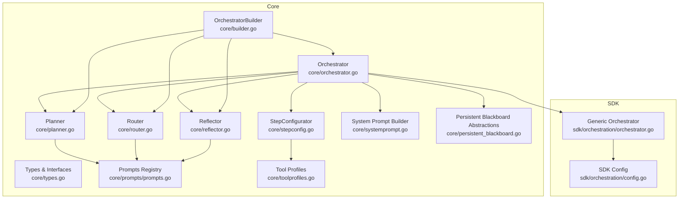

**Diagram sources**
- [orchestrator.go:1-599](file://core/orchestrator.go#L1-L599)
- [router.go:1-172](file://core/router.go#L1-L172)
- [planner.go:1-979](file://core/planner.go#L1-L979)
- [reflector.go:1-177](file://core/reflector.go#L1-L177)
- [stepconfig.go:1-92](file://core/stepconfig.go#L1-L92)
- [systemprompt.go:1-107](file://core/systemprompt.go#L1-L107)
- [persistent_blackboard.go:1-69](file://core/persistent_blackboard.go#L1-L69)
- [types.go:1-302](file://core/types.go#L1-L302)
- [builder.go:1-723](file://core/builder.go#L1-L723)
- [prompts.go:1-168](file://core/prompts/prompts.go#L1-L168)
- [toolprofiles.go:1-12](file://core/toolprofiles.go#L1-L12)
- [orchestrator.go:1-1104](file://sdk/orchestration/orchestrator.go#L1-L1104)
- [config.go:1-81](file://sdk/orchestration/config.go#L1-L81)

**Section sources**
- [orchestrator.go:1-599](file://core/orchestrator.go#L1-L599)
- [builder.go:1-723](file://core/builder.go#L1-L723)

## Core Components
- Orchestrator: central coordinator that routes, plans, executes, evaluates, and reflects; integrates with the SDK Plan&Execute engine; manages conversation history and persistent blackboard lifecycle.
- Router: classifies user requests by domain and complexity; selects execution strategy and determines whether clarification is needed.
- Planner: generates DAG plans via direct LLM calls or an informed exploration loop; supports replanning and continuation planning.
- Reflector: analyzes execution trajectories to produce structured self-corrections guiding replanning or step-level retries.
- OrchestratorBuilder: factory that builds per-session orchestrators with shared tool registry, MCP gateway, LLM router, and tool judge; wires context factories and tracking callers.
- StepConfigurator: resolves per-step execution parameters (allowed tools, system prompt suffix, max steps, compaction strategy) from plan steps and agent profiles.
- Persistent Blackboard: abstraction for task state persistence and restoration; supports routing, plan, step results, reflections, file changes, and facts.
- System Prompt Builder: constructs dynamic system prompts for executors, including workspace context, plan-mode context, environment, and auto-RAG hints.
- Tool Profiles: role-based tool filtering for router, planner, and reflector.

**Section sources**
- [orchestrator.go:55-189](file://core/orchestrator.go#L55-L189)
- [router.go:22-172](file://core/router.go#L22-L172)
- [planner.go:168-475](file://core/planner.go#L168-L475)
- [reflector.go:22-177](file://core/reflector.go#L22-L177)
- [builder.go:27-208](file://core/builder.go#L27-L208)
- [stepconfig.go:19-92](file://core/stepconfig.go#L19-L92)
- [persistent_blackboard.go:9-69](file://core/persistent_blackboard.go#L9-L69)
- [systemprompt.go:44-107](file://core/systemprompt.go#L44-L107)
- [toolprofiles.go:3-12](file://core/toolprofiles.go#L3-L12)

## Architecture Overview
The ReAct Plan&Execute loop is orchestrated by the core Orchestrator, which delegates to the SDK Orchestrator for DAG execution, retries, replanning, and reflection. The Router classifies tasks; the Planner generates or refines plans; the Reflector guides self-improvement; the Builder wires components and context managers; and the Blackboard persists state across sessions.

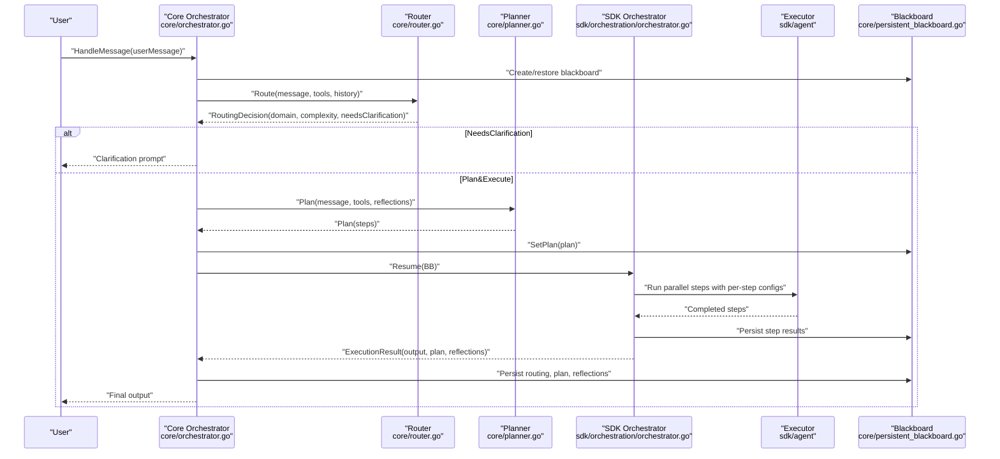

**Diagram sources**
- [orchestrator.go:338-599](file://core/orchestrator.go#L338-L599)
- [router.go:45-114](file://core/router.go#L45-L114)
- [planner.go:257-276](file://core/planner.go#L257-L276)
- [orchestrator.go:172-189](file://core/orchestrator.go#L172-L189)
- [orchestrator.go:153-166](file://core/orchestrator.go#L153-L166)
- [persistent_blackboard.go:31-69](file://core/persistent_blackboard.go#L31-L69)
- [orchestrator.go:460-476](file://core/orchestrator.go#L460-L476)

## Detailed Component Analysis

### Orchestrator
Responsibilities:
- Coordinates routing, planning, execution, and reflection.
- Manages conversation history for contextual routing.
- Wires SDK Orchestrator with planner, router, reflector, tool registry, token counting, and context factory.
- Supports first-message planning and continuation resume with synthetic plans for low complexity.
- Injects auto-RAG hints and emits context fill metrics.

Key behaviors:
- HandleMessage branches on TaskID to create or restore a blackboard, route the message, optionally request clarification, generate a plan (synthetic or full), and execute via SDK Resume.
- Resume continues from persisted state, re-emits routing decision, and persists completion/failure.
- Emits orchestration events (routing, plan generation, reflection, retries) and context fill metrics.

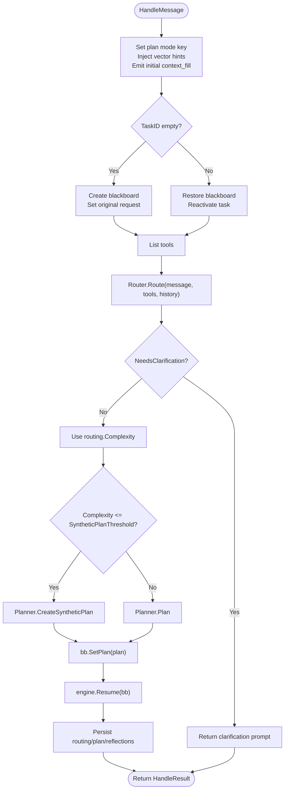

**Diagram sources**
- [orchestrator.go:344-599](file://core/orchestrator.go#L344-L599)
- [planner.go:438-461](file://core/planner.go#L438-L461)

**Section sources**
- [orchestrator.go:205-599](file://core/orchestrator.go#L205-L599)
- [systemprompt.go:44-107](file://core/systemprompt.go#L44-L107)

### Router
Responsibilities:
- Classifies user requests into domains (“code”, “research”, “general”, “mixed”) and complexity (1–5).
- Determines whether clarification is needed.
- Builds a system prompt that includes available tools and recent history.

Mechanics:
- Constructs grouped tool list and system prompt from templates.
- Calls LLM to produce a JSON decision; if parsing fails, retries with a repair prompt.
- Validates and clamps outputs to supported domain and complexity ranges.

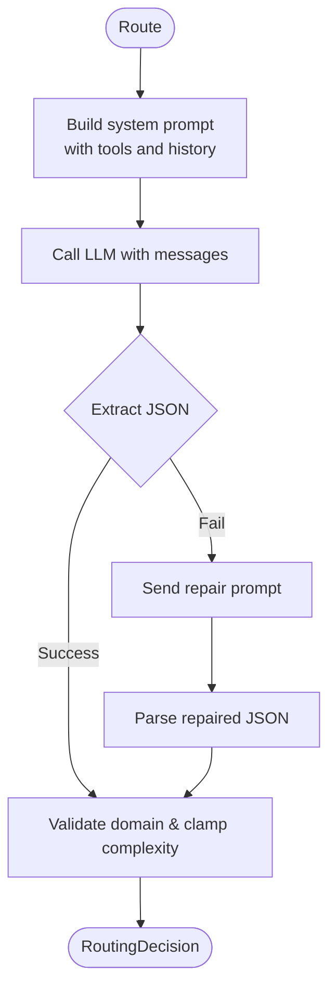

**Diagram sources**
- [router.go:45-114](file://core/router.go#L45-L114)

**Section sources**
- [router.go:22-172](file://core/router.go#L22-L172)

### Planner
Responsibilities:
- Generates DAG execution plans for tasks.
- Uses direct LLM planning for “general” domain or when no exploration tools are available.
- Employs an informed exploration loop for domain-specific tasks, using a bounded ReAct executor to discover and plan.
- Supports replanning after failures and continuation planning for follow-ups.

Adaptive strategies:
- Domain-aware compaction strategy selection.
- Tool filtering: prioritizes codebase-memory MCP tools and core FS tools for exploration.
- Circuit breaker and token budgeting during exploration.
- Reflection-aware planning and replanning.

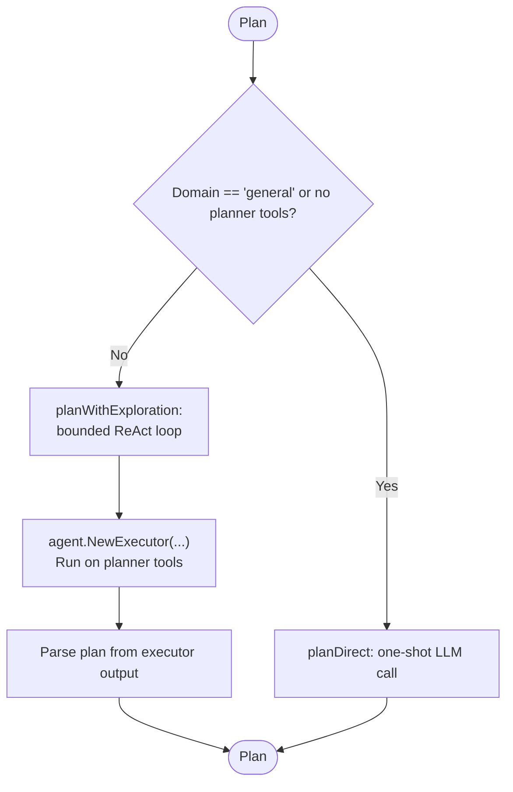

**Diagram sources**
- [planner.go:257-421](file://core/planner.go#L257-L421)

**Section sources**
- [planner.go:168-475](file://core/planner.go#L168-L475)
- [prompts.go:1-168](file://core/prompts/prompts.go#L1-L168)

### Reflector
Responsibilities:
- Analyzes execution trajectory and plan to produce structured reflections.
- Guides replanning or step-level retries by suggesting actions (retry, replan, abort).
- Builds a user message aggregating trajectory, plan, and previous reflections.

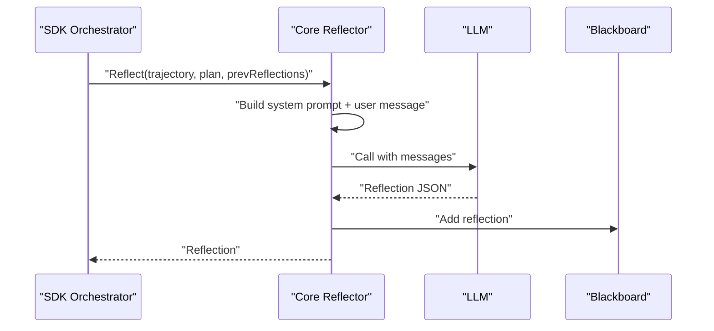

**Diagram sources**
- [reflector.go:39-80](file://core/reflector.go#L39-L80)

**Section sources**
- [reflector.go:22-177](file://core/reflector.go#L22-L177)

### OrchestratorBuilder (Factory Pattern)
Responsibilities:
- Creates per-session Orchestrators with shared tool registry and MCP gateway.
- Builds LLM router, model registry, context factory, tracking caller, and logging wrappers.
- Wires step configurator, tool result budget, circuit breaker, and vector search integration.
- Exposes runtime reconfiguration methods (router, judge, MCP, security, search tool).

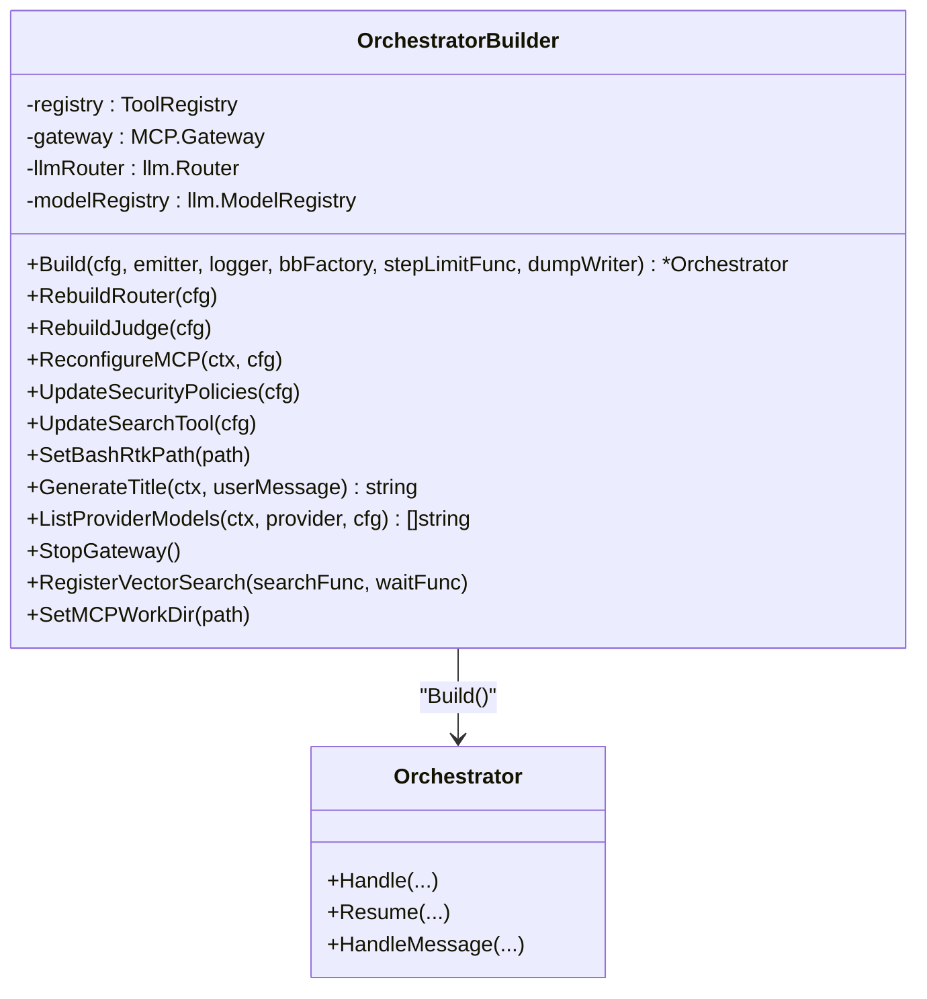

**Diagram sources**
- [builder.go:27-208](file://core/builder.go#L27-L208)

**Section sources**
- [builder.go:27-723](file://core/builder.go#L27-L723)

### Step Configuration Management
Responsibilities:
- Resolves per-step execution parameters from plan steps and agent profiles.
- Applies role-based tool profiles when explicit AllowedTools are not set.
- Injects role-specific system prompt suffixes when no explicit SystemPrompt is provided.
- Selects compaction strategy based on step domain.

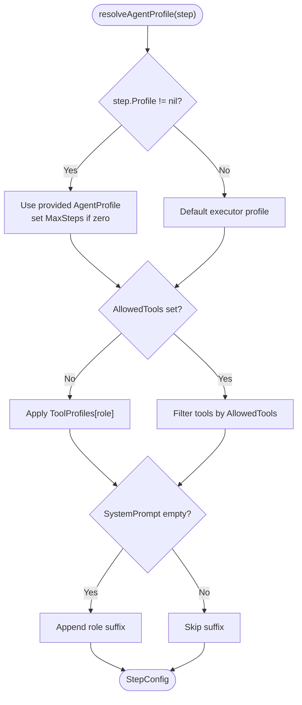

**Diagram sources**
- [stepconfig.go:19-92](file://core/stepconfig.go#L19-L92)
- [toolprofiles.go:3-12](file://core/toolprofiles.go#L3-L12)

**Section sources**
- [stepconfig.go:19-92](file://core/stepconfig.go#L19-L92)
- [toolprofiles.go:3-12](file://core/toolprofiles.go#L3-L12)

### Persistent Blackboard Systems
Responsibilities:
- PersistableBlackboard interface enables task lifecycle management (completion, failure, reactivation) and routing persistence.
- TaskPersistence provides CRUD operations for tasks, plans, routing decisions, step results, reflections, file changes, and facts.
- TaskState encapsulates restored state for continuations.

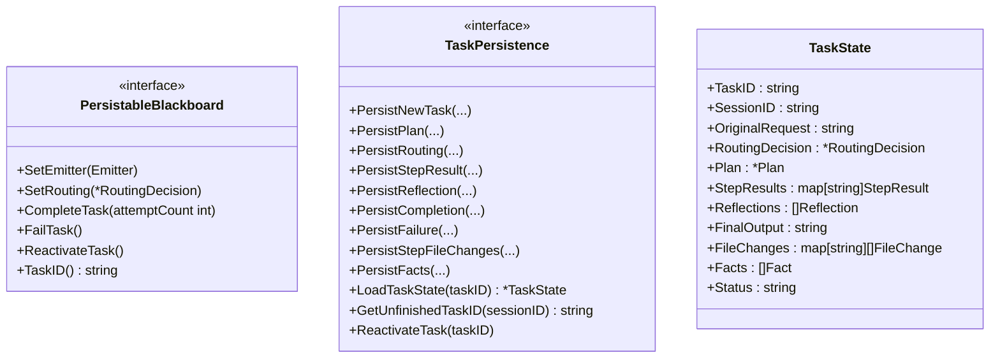

**Diagram sources**
- [persistent_blackboard.go:9-69](file://core/persistent_blackboard.go#L9-L69)

**Section sources**
- [persistent_blackboard.go:9-69](file://core/persistent_blackboard.go#L9-L69)

### Reasoning Loop Flow and Decision-Making
- First Message:
  - Route to determine domain and complexity.
  - If clarification needed, return prompt.
  - Else, generate plan (synthetic or full) and execute via SDK Resume.
- Continuation:
  - Restore blackboard and merge synthetic continuation plan or call PlanContinuation.
  - Resume execution with merged plan.
- Reflection:
  - After step failures, reflect and either abort, replan, or retry failed steps.
- Persistence:
  - Persist routing, plan, reflections, and task completion/failure.

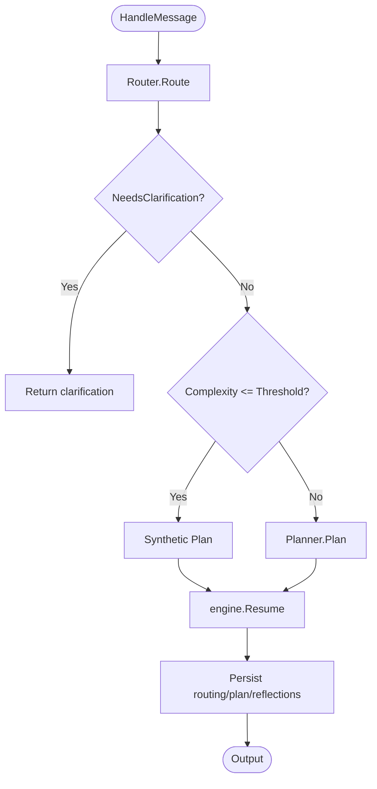

**Diagram sources**
- [orchestrator.go:338-599](file://core/orchestrator.go#L338-L599)

**Section sources**
- [orchestrator.go:338-599](file://core/orchestrator.go#L338-L599)

### Integration Patterns with LLM Providers
- The builder constructs an LLM Router and ModelRegistry from configuration, enabling provider selection and model metadata resolution.
- The TrackingCaller and UsageTracker enable per-session token accounting and event emission.
- The SDK Orchestrator consumes the LLM caller and model registry for context window management and prompt construction.
- The Builder supports runtime reconfiguration of router, judge, MCP, and search tool.

**Section sources**
- [builder.go:381-421](file://core/builder.go#L381-L421)
- [builder.go:423-471](file://core/builder.go#L423-L471)
- [config.go:11-62](file://sdk/orchestration/config.go#L11-L62)

## Dependency Analysis
- Core Orchestrator depends on Router, Planner, Reflector, ToolRegistry, ContextManagerFactory, Emitter, ModelRegistry, and optional persistence hooks.
- Planner depends on LLM, ToolRegistry, TokenCounter, ContextManagerFactory, and optional CallerForStep to align token tracking.
- Router depends on LLM and recent history for classification.
- Reflector depends on LLM and environment/context for reflection.
- Builder composes all components and wires context factories, tracking callers, and vector search integration.

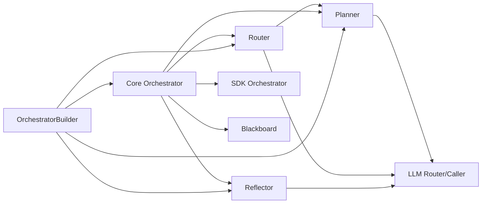

**Diagram sources**
- [orchestrator.go:77-189](file://core/orchestrator.go#L77-L189)
- [builder.go:423-471](file://core/builder.go#L423-L471)

**Section sources**
- [orchestrator.go:77-189](file://core/orchestrator.go#L77-L189)
- [builder.go:423-471](file://core/builder.go#L423-L471)

## Performance Considerations
- Synthetic plans for low-complexity tasks reduce token usage and latency.
- Planner exploration budget and circuit breaker protect against runaway loops.
- Tool result budgets and observation truncation cap memory growth.
- Sliding window, summarization, and hierarchical compaction strategies manage context window pressure.
- Vector search hints improve relevance and reduce search iterations.

[No sources needed since this section provides general guidance]

## Troubleshooting Guide
Common issues and diagnostics:
- Router JSON parsing failures: the router retries with a repair prompt; check LLM output formatting and prompt stability.
- Planner exploration failures: falls back to direct planning; inspect tool availability and context factory configuration.
- Reflection parsing errors: reflector defaults to retry suggestion; review reflection templates and environment injection.
- Step limit reached: StepLimitFunc can allow one-time extension; otherwise budget exhaustion halts execution.
- File changes rollback failures: tracked via FileChangeTracker; monitor rollback errors and adjust workspace permissions.

**Section sources**
- [router.go:85-114](file://core/router.go#L85-L114)
- [planner.go:390-421](file://core/planner.go#L390-L421)
- [reflector.go:150-177](file://core/reflector.go#L150-L177)
- [orchestrator.go:450-476](file://core/orchestrator.go#L450-L476)

## Conclusion
C0WRK’s core AI engine combines domain-aware routing, adaptive planning, robust execution with circuit breakers, and reflective self-improvement into a cohesive ReAct Plan&Execute loop. The OrchestratorBuilder’s factory pattern ensures flexible, per-session composition while maintaining shared infrastructure. Persistent blackboards and step configuration enable reliable continuations and role-based specialization. Integration with LLM providers is streamlined through the builder and SDK orchestration layer.

[No sources needed since this section summarizes without analyzing specific files]

## Appendices

### Typical AI Workflows
- Simple task: Router → Synthetic Plan → Execute → Complete.
- Complex task: Router → Planner → Plan → Execute → Reflect/Replan → Execute → Complete.
- Follow-up: Router → Planner.Continuation → Merge Plan → Resume → Execute → Complete.

**Section sources**
- [router.go:45-114](file://core/router.go#L45-L114)
- [planner.go:575-606](file://core/planner.go#L575-L606)
- [orchestrator.go:481-559](file://core/orchestrator.go#L481-L559)