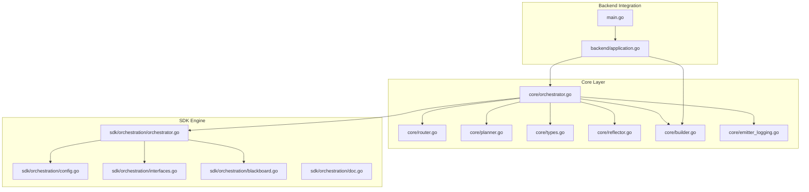
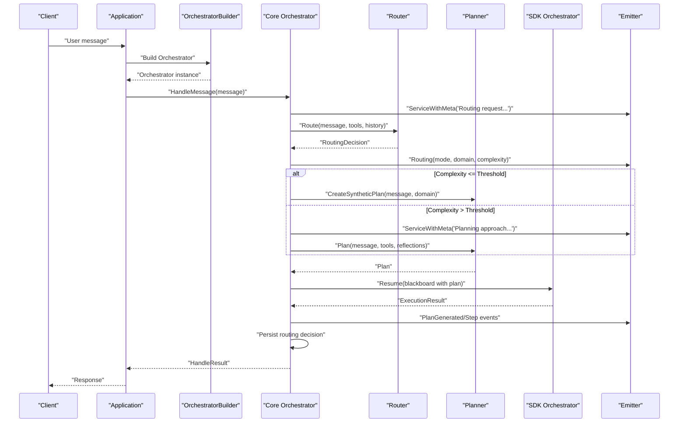
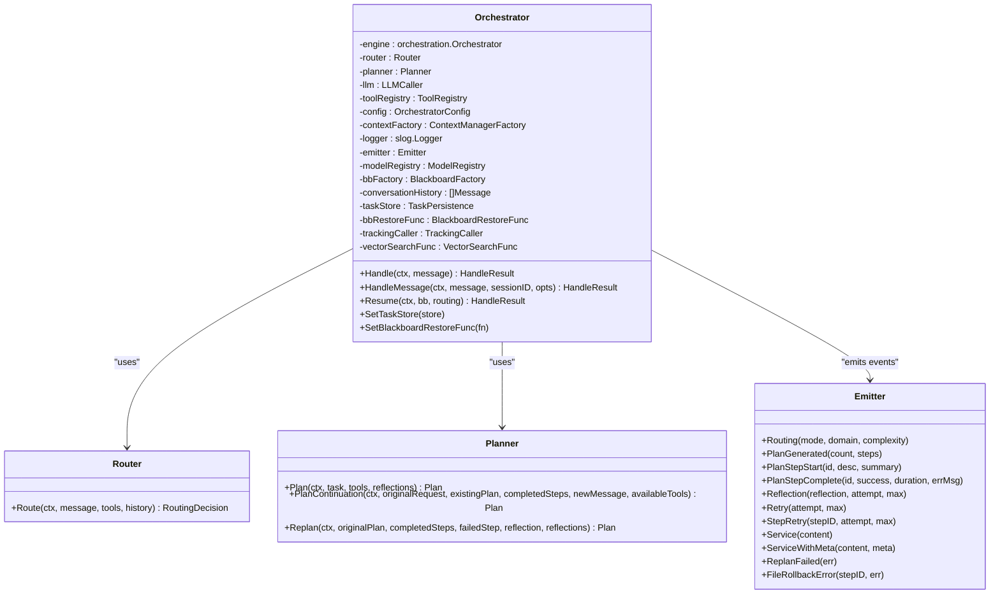
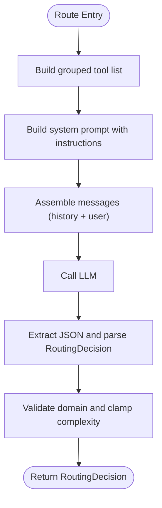
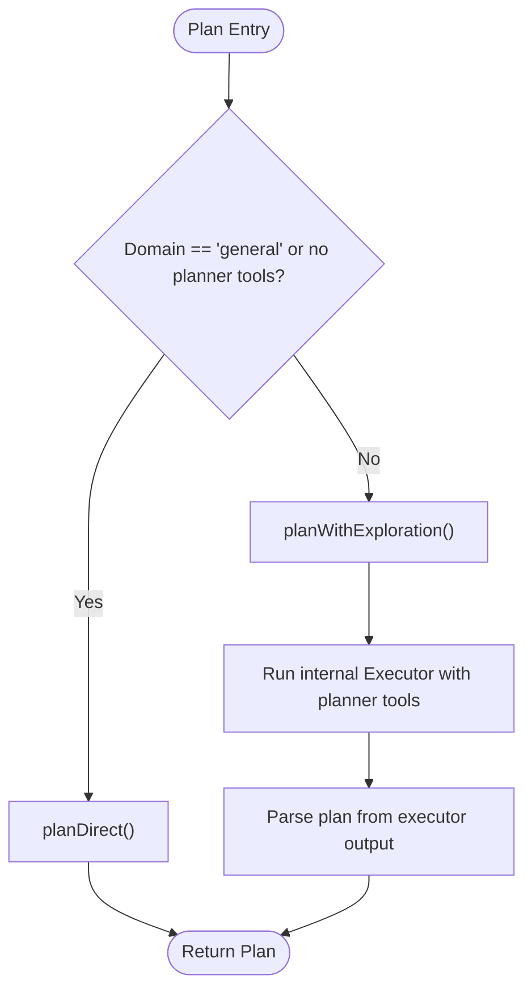
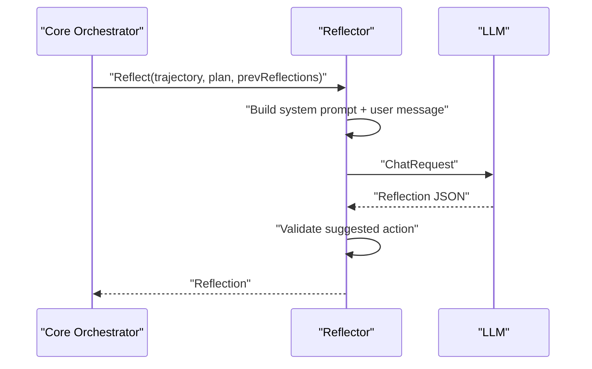
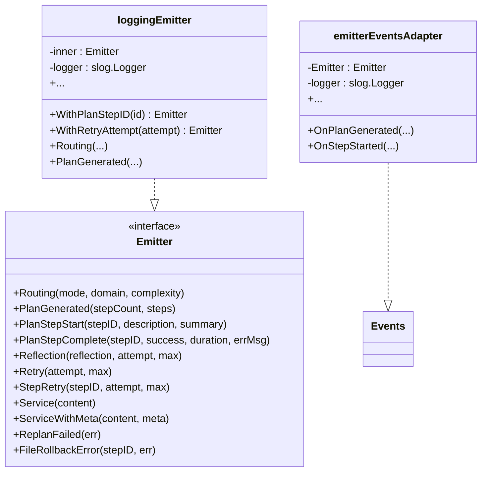
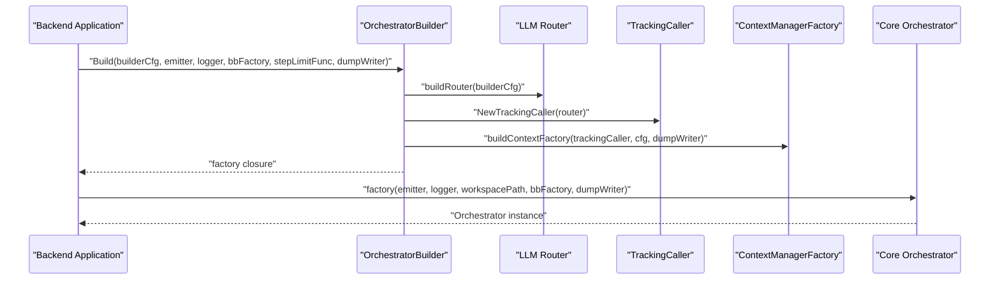
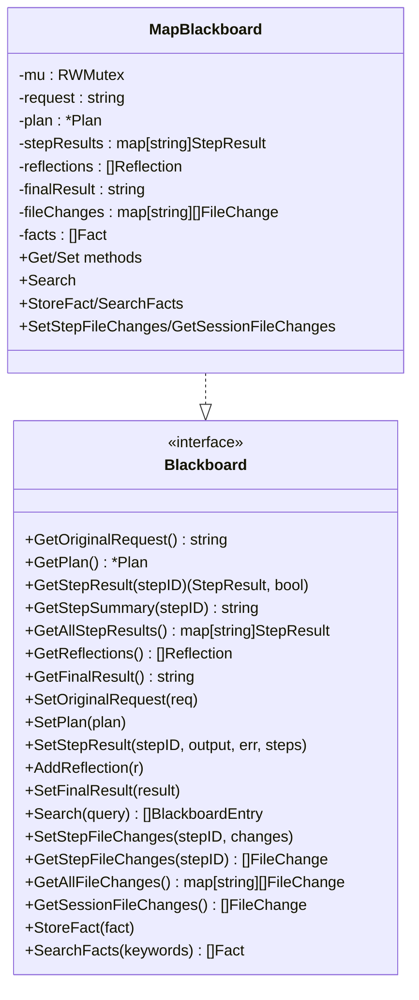
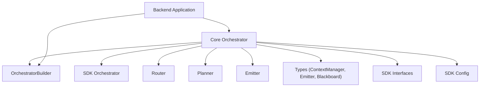

# Orchestrator Architecture

<cite>
**Referenced Files in This Document**
- [orchestrator.go](file://core/orchestrator.go)
- [router.go](file://core/router.go)
- [planner.go](file://core/planner.go)
- [types.go](file://core/types.go)
- [builder.go](file://core/builder.go)
- [builderconfig.go](file://core/builderconfig.go)
- [reflector.go](file://core/reflector.go)
- [emitter_logging.go](file://core/emitter_logging.go)
- [application.go](file://backend/application.go)
- [config.go](file://sdk/orchestration/config.go)
- [interfaces.go](file://sdk/orchestration/interfaces.go)
- [orchestrator.go](file://sdk/orchestration/orchestrator.go)
- [blackboard.go](file://sdk/orchestration/blackboard.go)
- [doc.go](file://sdk/orchestration/doc.go)
- [main.go](file://main.go)
</cite>

## Table of Contents
1. [Introduction](#introduction)
2. [Project Structure](#project-structure)
3. [Core Components](#core-components)
4. [Architecture Overview](#architecture-overview)
5. [Detailed Component Analysis](#detailed-component-analysis)
6. [Dependency Analysis](#dependency-analysis)
7. [Performance Considerations](#performance-considerations)
8. [Troubleshooting Guide](#troubleshooting-guide)
9. [Conclusion](#conclusion)

## Introduction
This document explains the C0WRK orchestrator architecture as the central coordinator of the ReAct loop workflow. It integrates planning, reasoning, and execution phases while managing conversation history, routing decisions, and event emission. The orchestrator delegates the Plan&Execute loop to the SDK orchestration engine, while retaining control over routing, context management, and persistence.

## Project Structure
The orchestrator spans the core orchestration layer and the SDK orchestration engine:
- Core orchestrator and supporting components live under core/.
- The SDK orchestration engine resides under sdk/orchestration/.
- Backend integration and factory pattern are implemented in backend/ and exposed via Application.

**Diagram sources**
- [orchestrator.go:55-189](file://core/orchestrator.go#L55-L189)
- [router.go:22-114](file://core/router.go#L22-L114)
- [planner.go:168-276](file://core/planner.go#L168-L276)
- [types.go:107-167](file://core/types.go#L107-L167)
- [reflector.go:20-80](file://core/reflector.go#L20-L80)
- [builder.go:27-108](file://core/builder.go#L27-L108)
- [emitter_logging.go:10-31](file://core/emitter_logging.go#L10-L31)
- [config.go:11-62](file://sdk/orchestration/config.go#L11-L62)
- [interfaces.go:12-59](file://sdk/orchestration/interfaces.go#L12-L59)
- [orchestrator.go:17-47](file://sdk/orchestration/orchestrator.go#L17-L47)
- [blackboard.go:16-60](file://sdk/orchestration/blackboard.go#L16-L60)
- [doc.go:1-4](file://sdk/orchestration/doc.go#L1-L4)
- [application.go:41-133](file://backend/application.go#L41-L133)
- [main.go:18-44](file://main.go#L18-L44)

**Section sources**
- [orchestrator.go:1-599](file://core/orchestrator.go#L1-L599)
- [config.go:1-81](file://sdk/orchestration/config.go#L1-L81)
- [interfaces.go:1-88](file://sdk/orchestration/interfaces.go#L1-L88)
- [application.go:1-270](file://backend/application.go#L1-L270)

## Core Components
- Orchestrator: Central coordinator that routes, decides between synthetic/full planning, and delegates Plan&Execute to the SDK engine. Manages conversation history, routing decision persistence, and event emission.
- Router: Determines domain and complexity of user requests and whether clarification is needed.
- Planner: Generates DAG execution plans, supports replan and continuation planning, and optionally uses exploration for informed planning.
- Reflector: Produces structured self-correction insights after step failures.
- Emitter: Emits orchestration-level events (routing, plan generation, retries, reflections).
- OrchestratorBuilder: Factory that builds per-session Orchestrators with shared tool registry, MCP gateway, and LLM router.
- SDK Orchestrator: Generic Plan&Execute engine that executes DAG plans, manages retries, replanning, and reflection.
- Blackboard: Shared state container for plan, step results, reflections, and file changes.

**Section sources**
- [orchestrator.go:55-189](file://core/orchestrator.go#L55-L189)
- [router.go:22-114](file://core/router.go#L22-L114)
- [planner.go:168-276](file://core/planner.go#L168-L276)
- [reflector.go:20-80](file://core/reflector.go#L20-L80)
- [types.go:107-167](file://core/types.go#L107-L167)
- [builder.go:27-108](file://core/builder.go#L27-L108)
- [config.go:11-62](file://sdk/orchestration/config.go#L11-L62)
- [blackboard.go:16-60](file://sdk/orchestration/blackboard.go#L16-L60)

## Architecture Overview
The orchestrator sits between the backend session manager and the SDK orchestration engine. It:
- Routes incoming messages to determine domain and complexity.
- Chooses synthetic or full planning based on complexity threshold.
- Builds a plan and delegates execution to the SDK engine.
- Persists routing decisions and maintains conversation history.
- Emits orchestration events for UI and persistence.

**Diagram sources**
- [application.go:104-133](file://backend/application.go#L104-L133)
- [builder.go:108-208](file://core/builder.go#L108-L208)
- [orchestrator.go:338-598](file://core/orchestrator.go#L338-L598)
- [router.go:45-114](file://core/router.go#L45-L114)
- [planner.go:257-276](file://core/planner.go#L257-L276)
- [orchestrator.go:85-126](file://sdk/orchestration/orchestrator.go#L85-L126)

## Detailed Component Analysis

### Orchestrator
The Orchestrator is the central coordinator that:
- Integrates Router, Planner, LLM caller, ToolRegistry, and ContextManagerFactory.
- Manages conversation history and routing decision persistence.
- Emits orchestration events via an Emitter.
- Uses the SDK Orchestrator for Plan&Execute execution.
- Supports synthetic planning for low-complexity tasks and continuation planning for follow-ups.

Key responsibilities:
- Handle and HandleMessage entry points.
- Routing and clarification handling.
- Conversation history management with configurable retention.
- Persistence of routing decisions and task completion.
- Wiring TrackingCaller for per-step context tracking.

**Diagram sources**
- [orchestrator.go:55-189](file://core/orchestrator.go#L55-L189)
- [router.go:22-114](file://core/router.go#L22-L114)
- [planner.go:168-276](file://core/planner.go#L168-L276)
- [types.go:107-167](file://core/types.go#L107-L167)

**Section sources**
- [orchestrator.go:55-189](file://core/orchestrator.go#L55-L189)
- [orchestrator.go:338-598](file://core/orchestrator.go#L338-L598)

### Router
The Router classifies user requests by domain and complexity, and determines whether clarification is needed. It:
- Builds grouped tool lists for prompts.
- Constructs system and user messages.
- Calls the LLM to produce a JSON-formatted RoutingDecision.
- Validates and clamps domain and complexity values.

**Diagram sources**
- [router.go:45-114](file://core/router.go#L45-L114)

**Section sources**
- [router.go:22-172](file://core/router.go#L22-L172)

### Planner
The Planner generates DAG execution plans:
- Direct planning for general domain or when no exploration tools are available.
- Informed exploration planning for specialized domains, using a bounded ReAct loop to discover a plan.
- Replan after failures and PlanContinuation for follow-ups.
- Supports step-specific tool filtering and domain assignment.

**Diagram sources**
- [planner.go:257-421](file://core/planner.go#L257-L421)

**Section sources**
- [planner.go:168-573](file://core/planner.go#L168-L573)

### Reflector
The Reflector produces structured self-correction insights:
- Builds a system prompt and user message containing trajectory, plan, and previous reflections.
- Calls the LLM to produce a Reflection with suggested actions.
- Validates suggested actions and ensures defaults.

**Diagram sources**
- [reflector.go:39-80](file://core/reflector.go#L39-L80)

**Section sources**
- [reflector.go:20-177](file://core/reflector.go#L20-L177)

### Emitter and Event Emission
The Emitter interface extends SDK agent events with orchestration-specific signals:
- Routing, PlanGenerated, PlanStepStart/Complete, Reflection, Retry, StepRetry, Service/ServiceWithMeta, ReplanFailed, FileRollbackError.
- A logging wrapper emits structured logs for all events.
- An adapter bridges core Emitter to SDK Events.

**Diagram sources**
- [types.go:107-167](file://core/types.go#L107-L167)
- [emitter_logging.go:10-199](file://core/emitter_logging.go#L10-L199)

**Section sources**
- [types.go:107-234](file://core/types.go#L107-L234)
- [emitter_logging.go:10-199](file://core/emitter_logging.go#L10-L199)

### OrchestratorBuilder and Factory Pattern
The OrchestratorBuilder encapsulates shared infrastructure and builds per-session Orchestrators:
- Shared tool registry and MCP gateway.
- Fresh LLM router and model registry per session.
- Context factory for compaction strategies.
- Logging and dumping wrappers for LLM callers.
- Factory closure passed to the session manager.

**Diagram sources**
- [builder.go:108-208](file://core/builder.go#L108-L208)
- [builder.go:381-541](file://core/builder.go#L381-L541)

**Section sources**
- [builder.go:27-108](file://core/builder.go#L27-L108)
- [builder.go:108-208](file://core/builder.go#L108-L208)
- [builder.go:381-541](file://core/builder.go#L381-L541)

### SDK Orchestrator and Plan&Execute Loop
The SDK Orchestrator runs the DAG-based execution loop:
- Creates or resumes with a blackboard.
- Executes ready steps in parallel, tracking per-step results and file changes.
- Handles per-step retries, reflection, replan, and outer-level retries.
- Aggregates outputs and manages final results.

**Diagram sources**
- [orchestrator.go:56-126](file://sdk/orchestration/orchestrator.go#L56-L126)
- [orchestrator.go:128-346](file://sdk/orchestration/orchestrator.go#L128-L346)
- [orchestrator.go:348-752](file://sdk/orchestration/orchestrator.go#L348-L752)

**Section sources**
- [orchestrator.go:17-47](file://sdk/orchestration/orchestrator.go#L17-L47)
- [orchestrator.go:56-126](file://sdk/orchestration/orchestrator.go#L56-L126)
- [orchestrator.go:128-346](file://sdk/orchestration/orchestrator.go#L128-L346)
- [orchestrator.go:348-752](file://sdk/orchestration/orchestrator.go#L348-L752)

### Blackboard and State Management
The Blackboard provides shared state:
- Stores original request, plan, step results, reflections, and final result.
- Tracks file changes per step and aggregates session-wide changes.
- Supports fact memory for inter-step communication and search.

**Diagram sources**
- [interfaces.go:61-87](file://sdk/orchestration/interfaces.go#L61-L87)
- [blackboard.go:16-60](file://sdk/orchestration/blackboard.go#L16-L60)
- [blackboard.go:62-564](file://sdk/orchestration/blackboard.go#L62-L564)

**Section sources**
- [interfaces.go:61-87](file://sdk/orchestration/interfaces.go#L61-L87)
- [blackboard.go:16-564](file://sdk/orchestration/blackboard.go#L16-L564)

## Dependency Analysis
The orchestrator’s dependencies are intentionally decoupled:
- Core Orchestrator depends on Router, Planner, LLM caller, ToolRegistry, ContextManagerFactory, Emitter, ModelRegistry, and optional persistence hooks.
- The SDK Orchestrator depends on Planner, LLM, Tools, ToolRegistry, TokenCounter, ModelRegistry, ContextFactory, Events, and step configuration.
- Backend Application composes OrchestratorBuilder and passes a factory closure to the session manager.

**Diagram sources**
- [orchestrator.go:55-189](file://core/orchestrator.go#L55-L189)
- [config.go:11-62](file://sdk/orchestration/config.go#L11-L62)
- [interfaces.go:12-59](file://sdk/orchestration/interfaces.go#L12-L59)
- [application.go:104-133](file://backend/application.go#L104-L133)

**Section sources**
- [orchestrator.go:55-189](file://core/orchestrator.go#L55-L189)
- [config.go:11-62](file://sdk/orchestration/config.go#L11-L62)
- [interfaces.go:12-59](file://sdk/orchestration/interfaces.go#L12-L59)
- [application.go:104-133](file://backend/application.go#L104-L133)

## Performance Considerations
- Synthetic planning reduces token usage for low-complexity tasks by bypassing the Planner LLM call when complexity is below the threshold.
- Sliding window compaction keeps recent context relevant for long executions; hierarchical compaction is used for complex general tasks.
- Tool result budgets and circuit breakers prevent runaway outputs and repeated failures.
- Parallel step execution maximizes throughput while respecting per-step budgets and retries.

[No sources needed since this section provides general guidance]

## Troubleshooting Guide
Common issues and diagnostics:
- Routing failures: Verify Router LLM availability and prompt formatting; check JSON extraction and validation.
- Planning failures: Inspect Planner exploration executor outcomes and fallback to direct planning; review tool availability and model metadata.
- Reflection failures: Ensure Reflection JSON parsing and suggested action validation; confirm environment context injection.
- Execution errors: Review per-step retry loops, replan outcomes, and file rollback errors; check circuit breaker thresholds.
- Event emission: Use logging emitter to trace orchestration events and step-level diagnostics.

**Section sources**
- [router.go:85-114](file://core/router.go#L85-L114)
- [planner.go:390-421](file://core/planner.go#L390-L421)
- [reflector.go:150-177](file://core/reflector.go#L150-L177)
- [emitter_logging.go:10-199](file://core/emitter_logging.go#L10-L199)

## Conclusion
The C0WRK orchestrator provides a robust, extensible framework for ReAct-based task orchestration. By delegating the Plan&Execute loop to the SDK engine while maintaining control over routing, planning strategy, context management, and persistence, it achieves a balance between flexibility and reliability. The factory pattern and backend integration enable dynamic configuration and seamless UI integration.