# Orchestrator Architecture

<cite>
**Referenced Files in This Document**
- [orchestrator.go](file://core/orchestrator.go)
- [router.go](file://core/router.go)
- [planner.go](file://core/planner.go)
- [types.go](file://core/types.go)
- [builder.go](file://core/builder.go)
- [builderconfig.go](file://core/builderconfig.go)
- [reflector.go](file://core/reflector.go)
- [emitter_logging.go](file://core/emitter_logging.go)
- [systemprompt.go](file://core/systemprompt.go)
- [application.go](file://backend/application.go)
- [config.go](file://sdk/orchestration/config.go)
- [interfaces.go](file://sdk/orchestration/interfaces.go)
- [orchestrator.go](file://sdk/orchestration/orchestrator.go)
- [blackboard.go](file://sdk/orchestration/blackboard.go)
- [doc.go](file://sdk/orchestration/doc.go)
- [manager.go](file://backend/session/manager.go)
- [main.go](file://main.go)
- [AGENTS.md](file://AGENTS.md)
</cite>

## Update Summary
**Changes Made**
- Updated OrchestratorBuilder asynchronous initialization implementation with new initDone channel, initErr fields, runAsyncInit, waitReady, and WaitReady methods
- Added documentation for proper waiting mechanisms in Build, GenerateTitle, and RebuildRouter methods
- Enhanced session manager integration to handle asynchronous initialization properly
- Updated architecture diagrams to reflect asynchronous initialization flow
- Added new sections covering asynchronous initialization patterns and error handling

## Table of Contents
1. [Introduction](#introduction)
2. [Project Structure](#project-structure)
3. [Core Components](#core-components)
4. [Architecture Overview](#architecture-overview)
5. [Detailed Component Analysis](#detailed-component-analysis)
6. [Asynchronous Initialization System](#asynchronous-initialization-system)
7. [Dependency Analysis](#dependency-analysis)
8. [Performance Considerations](#performance-considerations)
9. [Troubleshooting Guide](#troubleshooting-guide)
10. [Conclusion](#conclusion)

## Introduction
This document explains the C0WRK orchestrator architecture as the central coordinator of the ReAct loop workflow. It integrates planning, reasoning, and execution phases while managing conversation history, routing decisions, and event emission. The orchestrator delegates the Plan&Execute loop to the SDK orchestration engine, while retaining control over routing, context management, persistence, and the new asynchronous initialization system that ensures reliable component startup without blocking the main thread.

## Project Structure
The orchestrator spans the core orchestration layer and the SDK orchestration engine:
- Core orchestrator and supporting components live under core/.
- The SDK orchestration engine resides under sdk/orchestration/.
- Backend integration and factory pattern are implemented in backend/ and exposed via Application.
- Asynchronous initialization system ensures non-blocking component startup.
- AGENTS.md integration provides automatic project instruction injection from workspace root.

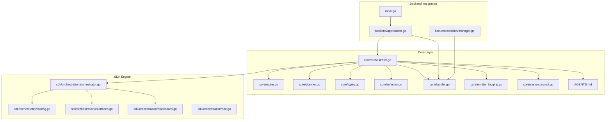

**Diagram sources**
- [orchestrator.go:55-189](file://core/orchestrator.go#L55-L189)
- [router.go:22-114](file://core/router.go#L22-L114)
- [planner.go:168-276](file://core/planner.go#L168-L276)
- [types.go:107-167](file://core/types.go#L107-L167)
- [reflector.go:20-80](file://core/reflector.go#L20-L80)
- [builder.go:27-108](file://core/builder.go#L27-L108)
- [emitter_logging.go:10-31](file://core/emitter_logging.go#L10-L31)
- [systemprompt.go:14-66](file://core/systemprompt.go#L14-L66)
- [config.go:11-62](file://sdk/orchestration/config.go#L11-L62)
- [interfaces.go:12-59](file://sdk/orchestration/interfaces.go#L12-L59)
- [orchestrator.go:17-47](file://sdk/orchestration/orchestrator.go#L17-L47)
- [blackboard.go:16-60](file://sdk/orchestration/blackboard.go#L16-L60)
- [doc.go:1-4](file://sdk/orchestration/doc.go#L1-L4)
- [application.go:41-133](file://backend/application.go#L41-L133)
- [manager.go:65-134](file://backend/session/manager.go#L65-L134)
- [main.go:18-44](file://main.go#L18-L44)

**Section sources**
- [orchestrator.go:1-599](file://core/orchestrator.go#L1-L599)
- [config.go:1-81](file://sdk/orchestration/config.go#L1-L81)
- [interfaces.go:1-88](file://sdk/orchestration/interfaces.go#L1-L88)
- [application.go:1-270](file://backend/application.go#L1-L270)
- [manager.go:1-1281](file://backend/session/manager.go#L1-L1281)

## Core Components
- **Orchestrator**: Central coordinator that routes, decides between synthetic/full planning, and delegates Plan&Execute to the SDK engine. Manages conversation history, routing decision persistence, event emission, and vector search hint injection including AGENTS.md processing.
- **Router**: Determines domain and complexity of user requests and whether clarification is needed.
- **Planner**: Generates DAG execution plans, supports replan and continuation planning, and optionally uses exploration for informed planning. Incorporates AGENTS.md project instructions into system prompts.
- **Reflector**: Produces structured self-correction insights after step failures.
- **Emitter**: Emits orchestration-level events (routing, plan generation, retries, reflections).
- **OrchestratorBuilder**: Factory that builds per-session Orchestrators with shared tool registry, MCP gateway, and LLM router. Implements asynchronous initialization with initDone channel and waitReady mechanism.
- **SDK Orchestrator**: Generic Plan&Execute engine that executes DAG plans, manages retries, replanning, and reflection.
- **Blackboard**: Shared state container for plan, step results, reflections, and file changes.
- **Vector Search Hints**: Automatic file discovery mechanism that enhances context with relevant project files and AGENTS.md content.
- **Asynchronous Initialization System**: Ensures non-blocking component startup with proper error propagation and waiting mechanisms.

**Section sources**
- [orchestrator.go:55-189](file://core/orchestrator.go#L55-L189)
- [router.go:22-114](file://core/router.go#L22-L114)
- [planner.go:168-276](file://core/planner.go#L168-L276)
- [reflector.go:20-80](file://core/reflector.go#L20-L80)
- [types.go:107-167](file://core/types.go#L107-L167)
- [builder.go:27-108](file://core/builder.go#L27-L108)
- [config.go:11-62](file://sdk/orchestration/config.go#L11-L62)
- [blackboard.go:16-60](file://sdk/orchestration/blackboard.go#L16-L60)

## Architecture Overview
The orchestrator sits between the backend session manager and the SDK orchestration engine. It:
- Routes incoming messages to determine domain and complexity.
- Chooses synthetic or full planning based on complexity threshold.
- Injects vector search hints including AGENTS.md content for enhanced context.
- Builds a plan and delegates execution to the SDK engine.
- Persists routing decisions and maintains conversation history.
- Emits orchestration events for UI and persistence.
- **NEW**: Implements asynchronous initialization to ensure non-blocking component startup.

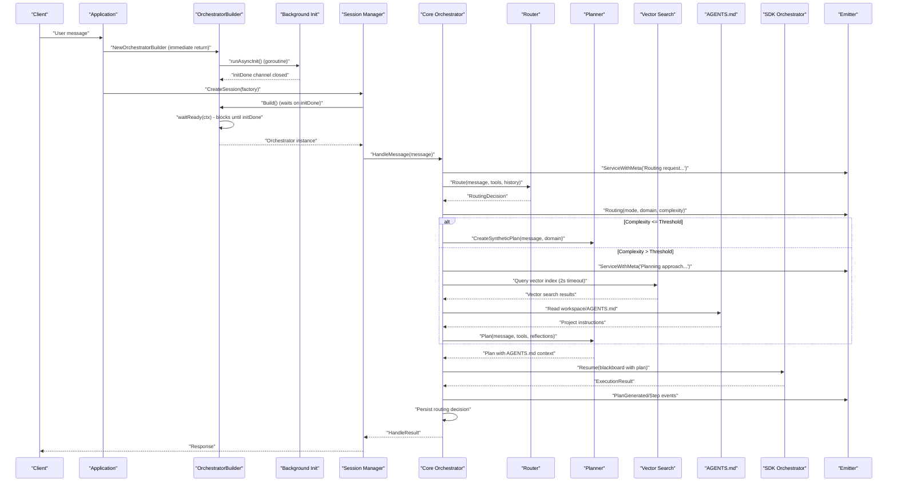

**Diagram sources**
- [application.go:104-133](file://backend/application.go#L104-L133)
- [builder.go:67-87](file://core/builder.go#L67-L87)
- [builder.go:89-123](file://core/builder.go#L89-L123)
- [builder.go:125-139](file://core/builder.go#L125-L139)
- [builder.go:158-267](file://core/builder.go#L158-L267)
- [manager.go:403-480](file://backend/session/manager.go#L403-L480)
- [orchestrator.go:338-598](file://core/orchestrator.go#L338-L598)
- [router.go:45-114](file://core/router.go#L45-L114)
- [planner.go:257-276](file://core/planner.go#L257-L276)
- [orchestrator.go:85-126](file://sdk/orchestration/orchestrator.go#L85-L126)

## Detailed Component Analysis

### Orchestrator
The Orchestrator is the central coordinator that:
- Integrates Router, Planner, LLM caller, ToolRegistry, and ContextManagerFactory.
- Manages conversation history and routing decision persistence.
- Emits orchestration events via an Emitter.
- Uses the SDK Orchestrator for Plan&Execute execution.
- Supports synthetic planning for low-complexity tasks and continuation planning for follow-ups.
- **NEW**: Implements vector search hint injection with automatic AGENTS.md processing.

Key responsibilities:
- Handle and HandleMessage entry points.
- Routing and clarification handling.
- Conversation history management with configurable retention.
- Persistence of routing decisions and task completion.
- Wiring TrackingCaller for per-step context tracking.
- **NEW**: Vector search hint injection with AGENTS.md content processing.
- **NEW**: Context-aware system prompt building with project instructions.

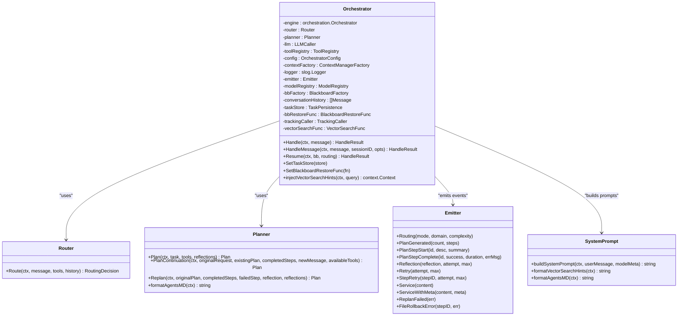

**Diagram sources**
- [orchestrator.go:55-189](file://core/orchestrator.go#L55-L189)
- [router.go:22-114](file://core/router.go#L22-L114)
- [planner.go:168-276](file://core/planner.go#L168-L276)
- [types.go:107-167](file://core/types.go#L107-L167)
- [systemprompt.go:68-124](file://core/systemprompt.go#L68-L124)

**Section sources**
- [orchestrator.go:55-189](file://core/orchestrator.go#L55-L189)
- [orchestrator.go:338-598](file://core/orchestrator.go#L338-L598)

### Vector Search Hint Injection and AGENTS.md Processing
**NEW**: The orchestrator now implements automatic vector search hint injection with AGENTS.md integration:

- **Vector Search Integration**: Queries the vector index for relevant files with a 2-second timeout.
- **AGENTS.md Detection**: Automatically scans the workspace root for AGENTS.md files.
- **Context Enhancement**: Injects both vector search results and AGENTS.md content into the execution context.
- **Priority Handling**: Places AGENTS.md as the first hint to ensure project instructions take precedence.
- **Graceful Degradation**: Works even when vector search fails or AGENTS.md is missing.

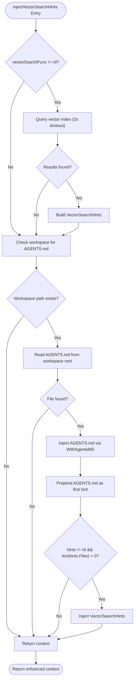

**Diagram sources**
- [orchestrator.go:279-337](file://core/orchestrator.go#L279-L337)

**Section sources**
- [orchestrator.go:273-337](file://core/orchestrator.go#L273-L337)

### Router
The Router classifies user requests by domain and complexity, and determines whether clarification is needed. It:
- Builds grouped tool lists for prompts.
- Constructs system and user messages.
- Calls the LLM to produce a JSON-formatted RoutingDecision.
- Validates and clamps domain and complexity values.

**Diagram sources**
- [router.go:45-114](file://core/router.go#L45-L114)

**Section sources**
- [router.go:22-172](file://core/router.go#L22-L172)

### Planner
The Planner generates DAG execution plans:
- Direct planning for general domain or when no exploration tools are available.
- Informed exploration planning for specialized domains, using a bounded ReAct loop to discover a plan.
- Replan after failures and PlanContinuation for follow-ups.
- Supports step-specific tool filtering and domain assignment.
- **NEW**: Incorporates AGENTS.md project instructions into system prompts with strict adherence requirements.

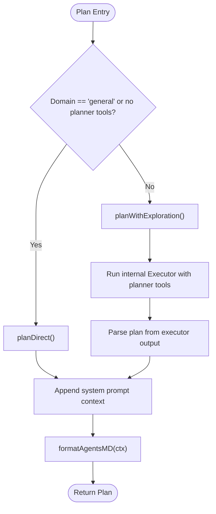

**Diagram sources**
- [planner.go:257-421](file://core/planner.go#L257-L421)

**Section sources**
- [planner.go:168-573](file://core/planner.go#L168-L573)

### System Prompt Building with AGENTS.md Integration
**NEW**: Enhanced system prompt building process incorporates AGENTS.md content:

- **Context Priority**: AGENTS.md content takes precedence over vector search hints.
- **Strict Adherence**: System prompts instruct planners to strictly follow AGENTS.md instructions.
- **Contradiction Handling**: Provides guidance for resolving contradictions between project instructions and codebase.
- **Automatic Injection**: Seamlessly integrates AGENTS.md content into both planner and executor prompts.

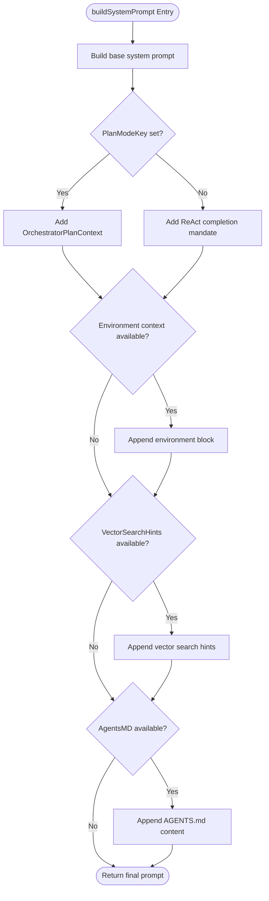

**Diagram sources**
- [systemprompt.go:68-124](file://core/systemprompt.go#L68-L124)

**Section sources**
- [systemprompt.go:68-124](file://core/systemprompt.go#L68-L124)

### Reflector
The Reflector produces structured self-correction insights:
- Builds a system prompt and user message containing trajectory, plan, and previous reflections.
- Calls the LLM to produce a Reflection with suggested actions.
- Validates suggested actions and ensures defaults.

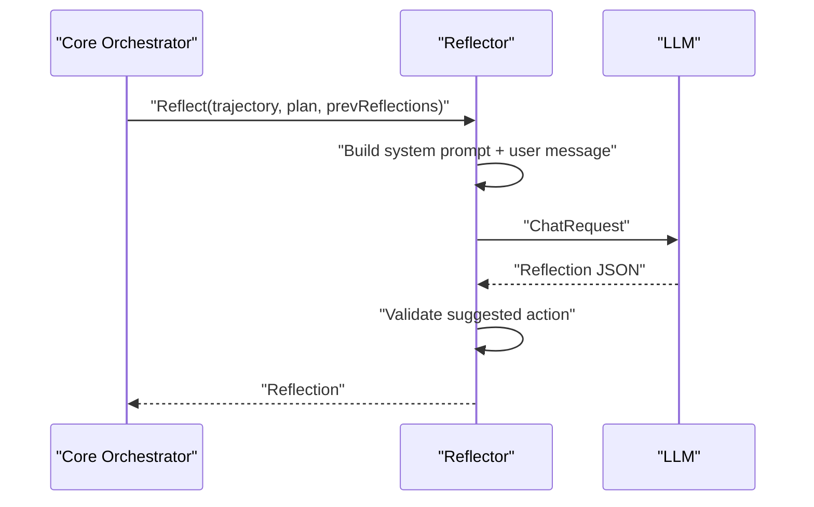

**Diagram sources**
- [reflector.go:39-80](file://core/reflector.go#L39-L80)

**Section sources**
- [reflector.go:20-177](file://core/reflector.go#L20-L177)

### Emitter and Event Emission
The Emitter interface extends SDK agent events with orchestration-specific signals:
- Routing, PlanGenerated, PlanStepStart/Complete, Reflection, Retry, StepRetry, Service/ServiceWithMeta, ReplanFailed, FileRollbackError.
- A logging wrapper emits structured logs for all events.
- An adapter bridges core Emitter to SDK Events.

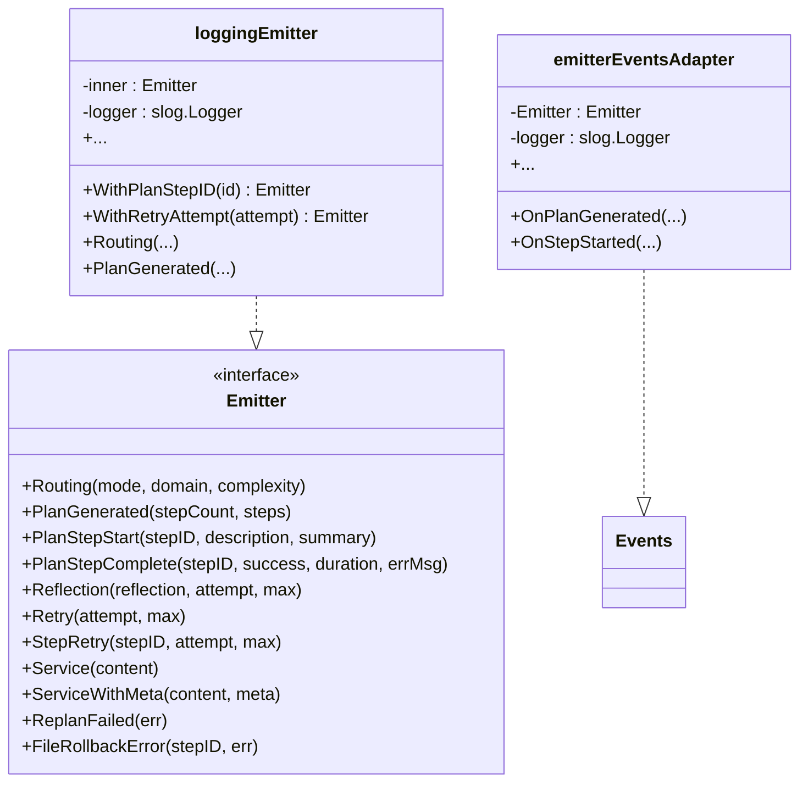

**Diagram sources**
- [types.go:107-167](file://core/types.go#L107-L167)
- [emitter_logging.go:10-199](file://core/emitter_logging.go#L10-L199)

**Section sources**
- [types.go:107-234](file://core/types.go#L107-L234)
- [emitter_logging.go:10-199](file://core/emitter_logging.go#L10-L199)

### OrchestratorBuilder and Factory Pattern
The OrchestratorBuilder encapsulates shared infrastructure and builds per-session Orchestrators:
- Shared tool registry and MCP gateway.
- Fresh LLM router and model registry per session.
- Context factory for compaction strategies.
- Logging and dumping wrappers for LLM callers.
- Factory closure passed to the session manager.

**Updated**: Implements asynchronous initialization with proper waiting mechanisms:
- **initDone channel**: Signals when background initialization completes.
- **initErr field**: Captures initialization errors for propagation.
- **runAsyncInit**: Background goroutine performs slow network-dependent initialization.
- **waitReady**: Blocks until initialization completes or context is cancelled.
- **WaitReady**: Exported method for external components to wait for readiness.

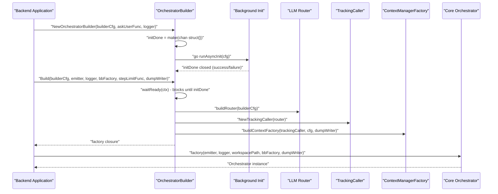

**Diagram sources**
- [builder.go:67-87](file://core/builder.go#L67-L87)
- [builder.go:89-123](file://core/builder.go#L89-L123)
- [builder.go:125-139](file://core/builder.go#L125-L139)
- [builder.go:158-267](file://core/builder.go#L158-L267)
- [builder.go:381-541](file://core/builder.go#L381-L541)

**Section sources**
- [builder.go:27-108](file://core/builder.go#L27-L108)
- [builder.go:67-139](file://core/builder.go#L67-L139)
- [builder.go:158-267](file://core/builder.go#L158-L267)
- [builder.go:381-541](file://core/builder.go#L381-L541)

### SDK Orchestrator and Plan&Execute Loop
The SDK Orchestrator runs the DAG-based execution loop:
- Creates or resumes with a blackboard.
- Executes ready steps in parallel, tracking per-step results and file changes.
- Handles per-step retries, reflection, replan, and outer-level retries.
- Aggregates outputs and manages final results.

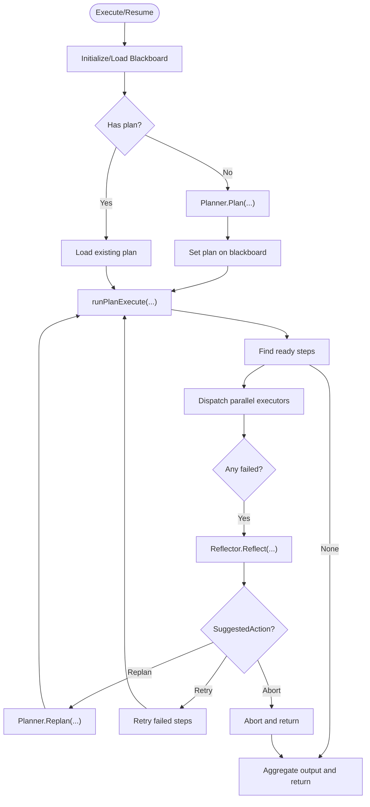

**Diagram sources**
- [orchestrator.go:56-126](file://sdk/orchestration/orchestrator.go#L56-L126)
- [orchestrator.go:128-346](file://sdk/orchestration/orchestrator.go#L128-L346)
- [orchestrator.go:348-752](file://sdk/orchestration/orchestrator.go#L348-L752)

**Section sources**
- [orchestrator.go:17-47](file://sdk/orchestration/orchestrator.go#L17-L47)
- [orchestrator.go:56-126](file://sdk/orchestration/orchestrator.go#L56-L126)
- [orchestrator.go:128-346](file://sdk/orchestration/orchestrator.go#L128-L346)
- [orchestrator.go:348-752](file://sdk/orchestration/orchestrator.go#L348-L752)

### Blackboard and State Management
The Blackboard provides shared state:
- Stores original request, plan, step results, reflections, and final result.
- Tracks file changes per step and aggregates session-wide changes.
- Supports fact memory for inter-step communication and search.

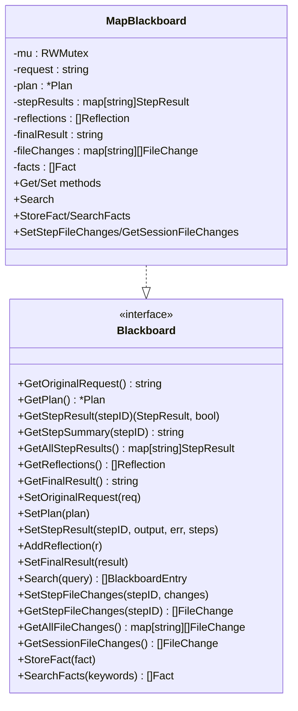

**Diagram sources**
- [interfaces.go:61-87](file://sdk/orchestration/interfaces.go#L61-L87)
- [blackboard.go:16-60](file://sdk/orchestration/blackboard.go#L16-L60)
- [blackboard.go:62-564](file://sdk/orchestration/blackboard.go#L62-L564)

**Section sources**
- [interfaces.go:61-87](file://sdk/orchestration/interfaces.go#L61-L87)
- [blackboard.go:16-564](file://sdk/orchestration/blackboard.go#L16-L564)

## Asynchronous Initialization System

**NEW**: The OrchestratorBuilder now implements a sophisticated asynchronous initialization system to ensure non-blocking component startup while maintaining reliability.

### Core Components of the Asynchronous System

#### OrchestratorBuilder Fields
- **initDone chan struct{}**: Channel that signals when background initialization completes
- **initErr error**: Captures any initialization errors for later propagation
- **gateway *mcp.Gateway**: Optional MCP gateway (initialized asynchronously)
- **llmRouter *llm.Router**: LLM router (initialized asynchronously)
- **modelRegistry *llm.ModelRegistry**: Model registry (initialized asynchronously)

#### Background Initialization Process
The `runAsyncInit` method performs slow network-dependent initialization:
1. **MCP Gateway Startup**: Starts gateway with optional non-fatal failures
2. **LLM Router Creation**: Creates router with error capture and propagation
3. **Tool Judge Rebuild**: Rebuilds tool judge with available router

#### Waiting Mechanisms
- **waitReady(ctx)**: Internal method that blocks until initialization completes or context is cancelled
- **WaitReady(ctx)**: Exported method for external components to wait for readiness

#### Method Implementations with Waiting
All builder methods now implement proper waiting mechanisms:

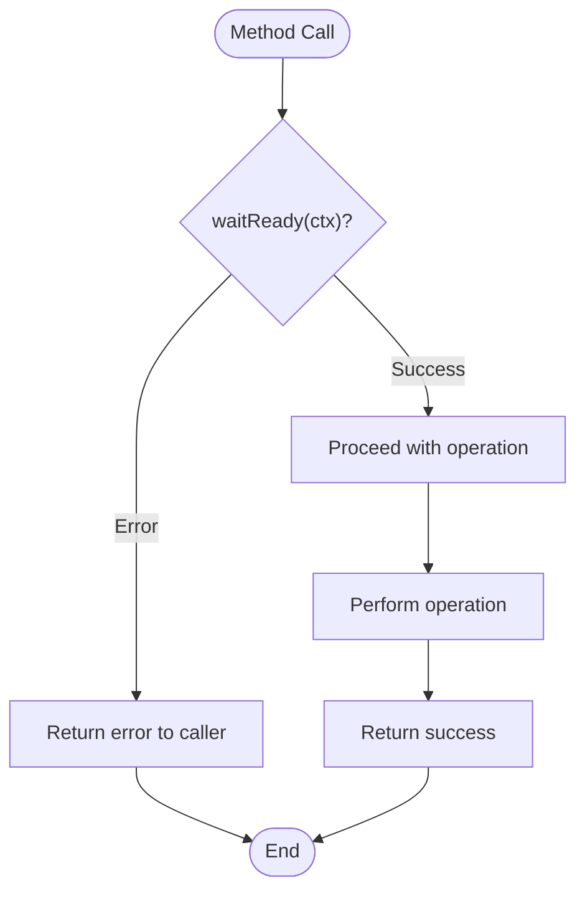

**Diagram sources**
- [builder.go:125-139](file://core/builder.go#L125-L139)
- [builder.go:169-174](file://core/builder.go#L169-L174)
- [builder.go:271-276](file://core/builder.go#L271-L276)
- [builder.go:343-346](file://core/builder.go#L343-L346)

### Integration with Session Manager

The session manager properly handles the asynchronous initialization:
- **Factory Creation**: Sessions are created with orchestrator factory closures
- **Lazy Initialization**: Orchestrator creation waits for builder readiness
- **Error Propagation**: Initialization errors are propagated to session creation

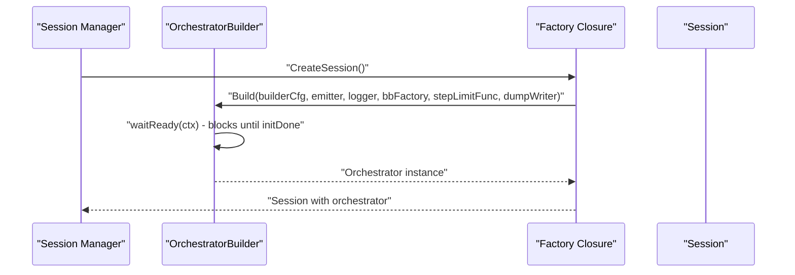

**Diagram sources**
- [manager.go:403-480](file://backend/session/manager.go#L403-L480)
- [builder.go:158-267](file://core/builder.go#L158-L267)

**Section sources**
- [builder.go:36-50](file://core/builder.go#L36-L50)
- [builder.go:89-123](file://core/builder.go#L89-L123)
- [builder.go:125-139](file://core/builder.go#L125-L139)
- [builder.go:158-267](file://core/builder.go#L158-L267)
- [builder.go:269-286](file://core/builder.go#L269-L286)
- [builder.go:342-376](file://core/builder.go#L342-L376)
- [manager.go:403-480](file://backend/session/manager.go#L403-L480)

## Dependency Analysis
The orchestrator's dependencies are intentionally decoupled:
- Core Orchestrator depends on Router, Planner, LLM caller, ToolRegistry, ContextManagerFactory, Emitter, ModelRegistry, and optional persistence hooks.
- The SDK Orchestrator depends on Planner, LLM, Tools, ToolRegistry, TokenCounter, ModelRegistry, ContextFactory, Events, and step configuration.
- Backend Application composes OrchestratorBuilder and passes a factory closure to the session manager.
- **NEW**: Asynchronous initialization system provides non-blocking component startup with proper error propagation.
- **NEW**: Vector search integration provides optional context enhancement without breaking changes.

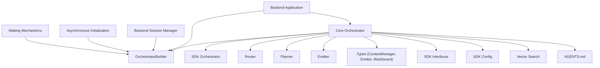

**Diagram sources**
- [orchestrator.go:55-189](file://core/orchestrator.go#L55-L189)
- [config.go:11-62](file://sdk/orchestration/config.go#L11-L62)
- [interfaces.go:12-59](file://sdk/orchestration/interfaces.go#L12-L59)
- [application.go:104-133](file://backend/application.go#L104-L133)
- [manager.go:65-134](file://backend/session/manager.go#L65-L134)

**Section sources**
- [orchestrator.go:55-189](file://core/orchestrator.go#L55-L189)
- [config.go:11-62](file://sdk/orchestration/config.go#L11-L62)
- [interfaces.go:12-59](file://sdk/orchestration/interfaces.go#L12-L59)
- [application.go:104-133](file://backend/application.go#L104-L133)
- [manager.go:65-134](file://backend/session/manager.go#L65-L134)

## Performance Considerations
- **Asynchronous Initialization**: Background initialization prevents blocking the main thread during slow network operations.
- **Timeout Management**: Proper timeout handling in vector search and MCP gateway operations.
- **Component Caching**: Shared components (tool registry, MCP gateway, LLM router) are cached for reuse across sessions.
- **Non-blocking Operations**: Vector search hints are processed with 2-second timeouts to prevent blocking operations.
- **Graceful Degradation**: System continues functioning even when vector search or AGENTS.md are unavailable.
- **Memory Efficiency**: Sliding window compaction keeps recent context relevant for long executions.
- **Parallel Execution**: Parallel step execution maximizes throughput while respecting per-step budgets and retries.

**Updated**: **Asynchronous Initialization Benefits**:
- **Immediate Responsiveness**: NewOrchestratorBuilder returns immediately, improving application startup time.
- **Error Propagation**: Initialization errors are captured and propagated to callers who need them.
- **Resource Efficiency**: Background initialization allows other operations to proceed while components start.
- **Reliability**: Non-fatal MCP gateway failures don't prevent orchestrator creation.

## Troubleshooting Guide
Common issues and diagnostics:
- **Routing failures**: Verify Router LLM availability and prompt formatting; check JSON extraction and validation.
- **Planning failures**: Inspect Planner exploration executor outcomes and fallback to direct planning; review tool availability and model metadata.
- **Reflection failures**: Ensure Reflection JSON parsing and suggested action validation; confirm environment context injection.
- **Execution errors**: Review per-step retry loops, replan outcomes, and file rollback errors; check circuit breaker thresholds.
- **Event emission**: Use logging emitter to trace orchestration events and step-level diagnostics.
- **Vector search hint injection failures**: Check vector search function configuration and workspace permissions.
- **AGENTS.md processing issues**: Verify workspace path existence and file permissions for AGENTS.md.
- **Context priority problems**: Ensure AGENTS.md is properly formatted and contains valid project instructions.
- **Asynchronous initialization failures**: Check initErr field and waitReady return values; verify background initialization completed successfully.
- **Session creation delays**: Monitor builder WaitReady calls and ensure proper timeout handling.

**Updated**: **Asynchronous Initialization Troubleshooting**:
- **Initialization Timeout**: Check 30-second timeout in waitReady method; consider extending for slow networks.
- **Background Initialization Errors**: Review runAsyncInit error handling and logging; check MCP gateway and LLM router initialization.
- **Component Availability**: Use MCPGateway() and other getter methods that internally call waitReady for proper synchronization.
- **Error Propagation**: Ensure WaitReady errors are properly handled by calling components (Application, Session Manager).

**Section sources**
- [router.go:85-114](file://core/router.go#L85-L114)
- [planner.go:390-421](file://core/planner.go#L390-L421)
- [reflector.go:150-177](file://core/reflector.go#L150-L177)
- [emitter_logging.go:10-199](file://core/emitter_logging.go#L10-L199)
- [builder.go:125-139](file://core/builder.go#L125-L139)
- [application.go:166-169](file://backend/application.go#L166-L169)

## Conclusion
The C0WRK orchestrator provides a robust, extensible framework for ReAct-based task orchestration. By delegating the Plan&Execute loop to the SDK engine while maintaining control over routing, planning strategy, context management, and persistence, it achieves a balance between flexibility and reliability.

**NEW**: The asynchronous initialization system significantly enhances the system's startup performance and reliability by ensuring non-blocking component startup while maintaining proper error propagation and synchronization. This architectural improvement demonstrates the orchestrator's commitment to evolving with project needs while preserving backward compatibility and system stability.

The integration of AGENTS.md processing and vector search hint injection further enhances the system's ability to provide contextually relevant project instructions and file references, improving task execution quality while maintaining graceful degradation and performance optimization. Together, these enhancements create a comprehensive orchestration framework that scales effectively with project complexity and team size.