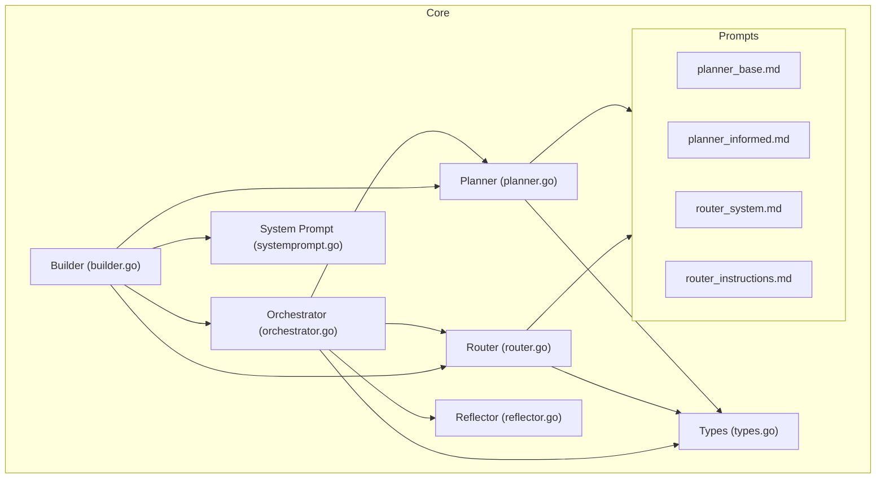
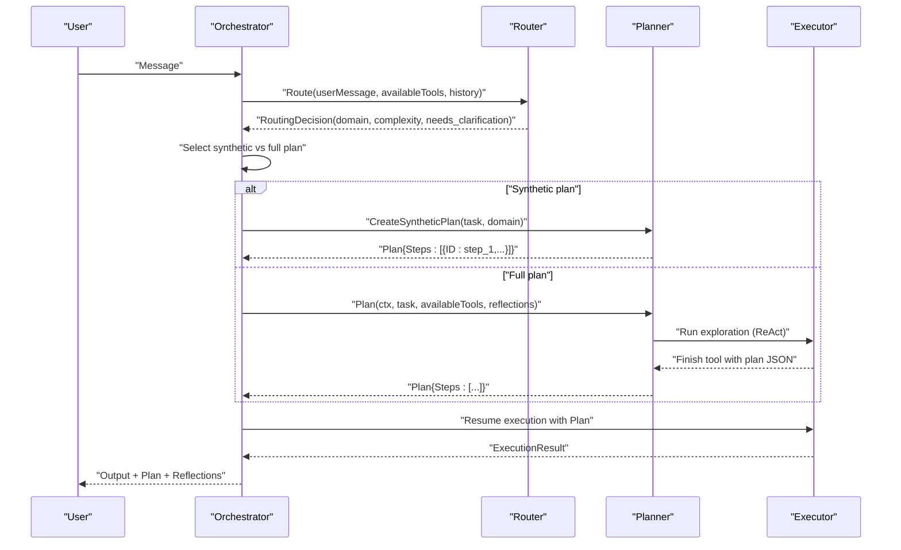
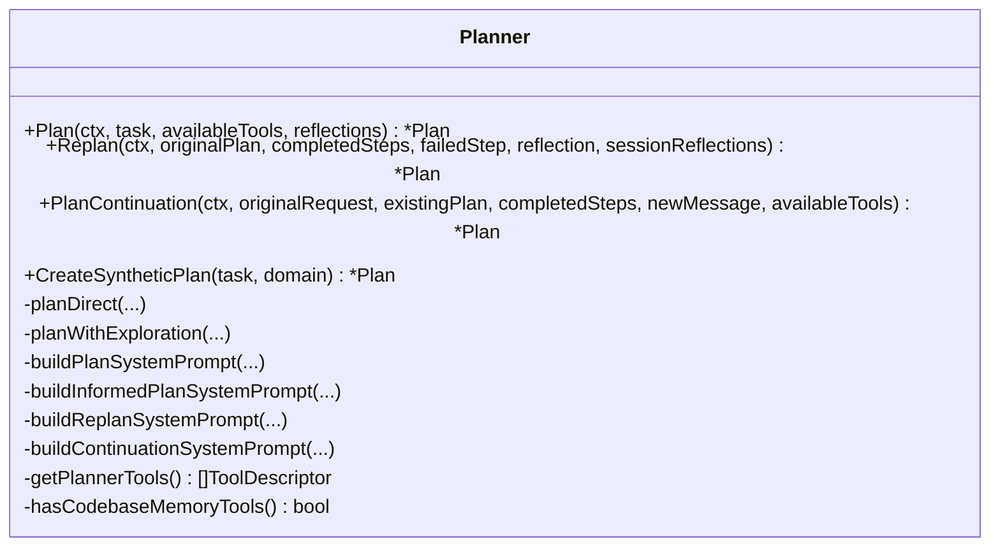
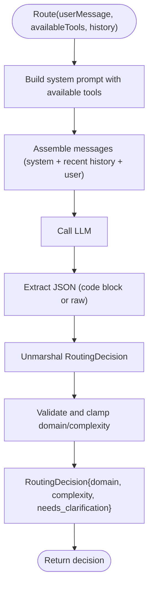
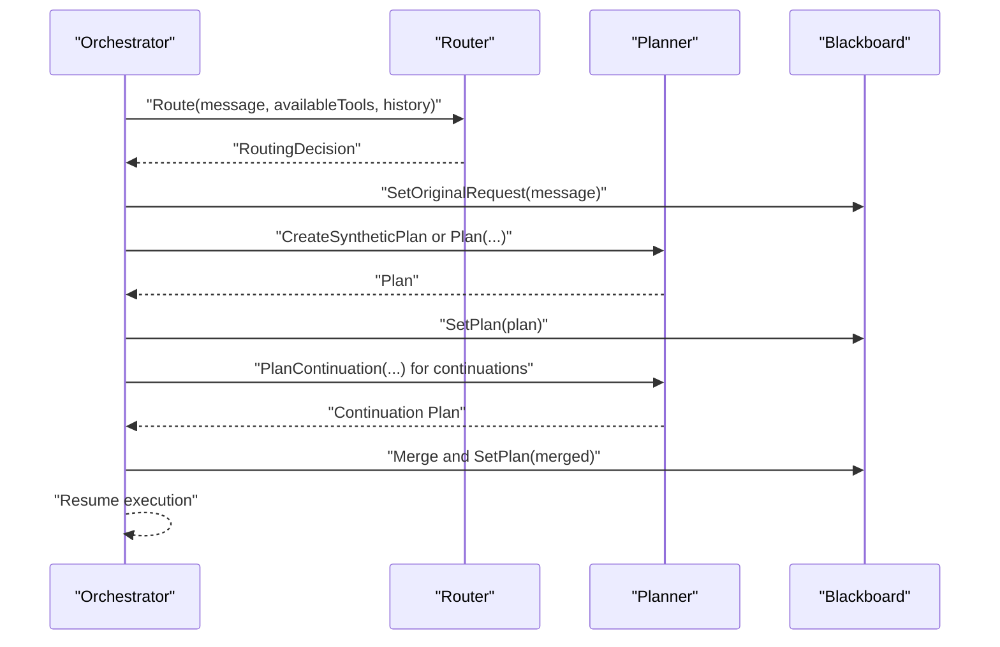
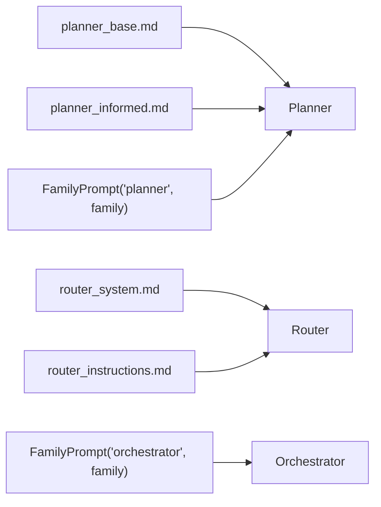
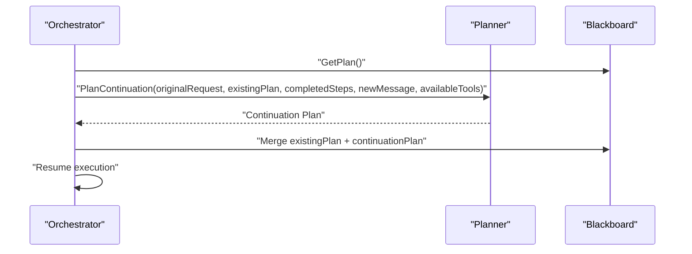
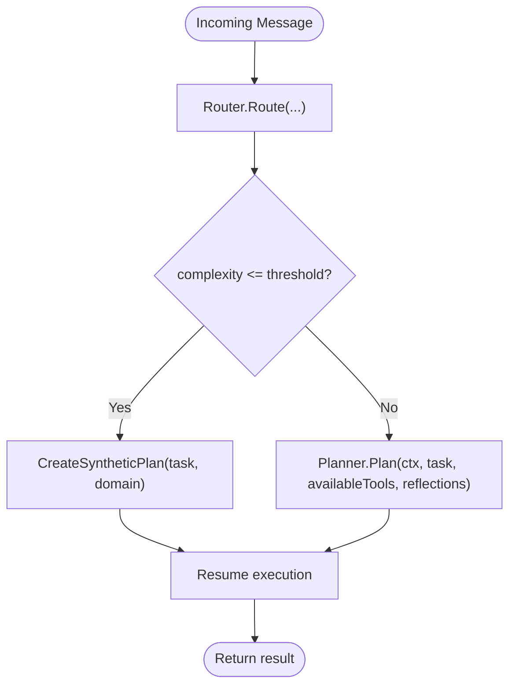
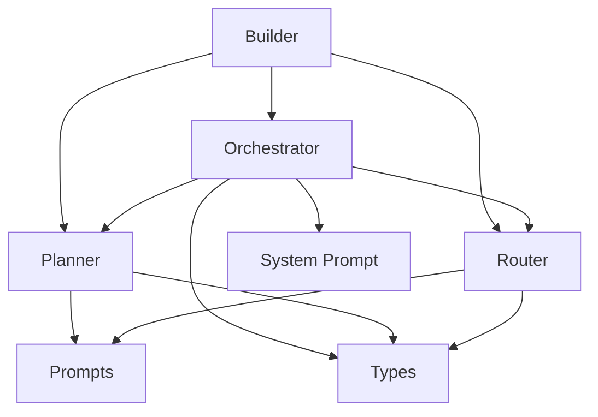

# Planner System

<cite>
**Referenced Files in This Document**
- [planner.go](file://core/planner.go)
- [router.go](file://core/router.go)
- [orchestrator.go](file://core/orchestrator.go)
- [prompts.go](file://core/prompts/prompts.go)
- [planner_base.md](file://core/prompts/planner_base.md)
- [planner_informed.md](file://core/prompts/planner_informed.md)
- [router_system.md](file://core/prompts/router_system.md)
- [router_instructions.md](file://core/prompts/router_instructions.md)
- [types.go](file://core/types.go)
- [builder.go](file://core/builder.go)
- [systemprompt.go](file://core/systemprompt.go)
- [planner_test.go](file://core/planner_test.go)
- [reflector.go](file://core/reflector.go)
</cite>

## Table of Contents
1. [Introduction](#introduction)
2. [Project Structure](#project-structure)
3. [Core Components](#core-components)
4. [Architecture Overview](#architecture-overview)
5. [Detailed Component Analysis](#detailed-component-analysis)
6. [Dependency Analysis](#dependency-analysis)
7. [Performance Considerations](#performance-considerations)
8. [Troubleshooting Guide](#troubleshooting-guide)
9. [Conclusion](#conclusion)

## Introduction
This document explains the C0WRK planner system and its role in generating execution plans for AI tasks. The planner supports:
- Synthetic plans for simple tasks (minimal overhead)
- Full LLM-generated plans for complex scenarios
- Adaptive strategy selection based on domain and tool availability
- Integration with the Router for domain classification and tool availability assessment
- PlanContinuation for follow-up requests after task completion
- Prompt engineering with domain-specific templates
- Relationship between planner complexity scores and execution strategies

## Project Structure
The planner system resides in the core package and integrates with the broader orchestration framework. Key files include:
- Planner implementation and prompt engineering
- Router for domain classification and complexity scoring
- Orchestrator coordinating routing, planning, and execution
- Prompt templates for planner and router
- Builder wiring components together
- Types and system prompt utilities

**Diagram sources**
- [planner.go:168-421](file://core/planner.go#L168-L421)
- [router.go:22-114](file://core/router.go#L22-L114)
- [orchestrator.go:55-189](file://core/orchestrator.go#L55-L189)
- [prompts.go:6-168](file://core/prompts/prompts.go#L6-L168)
- [planner_base.md:1-25](file://core/prompts/planner_base.md#L1-L25)
- [planner_informed.md:1-54](file://core/prompts/planner_informed.md#L1-L54)
- [router_system.md:1-42](file://core/prompts/router_system.md#L1-L42)
- [router_instructions.md:1-6](file://core/prompts/router_instructions.md#L1-L6)
- [builder.go:423-471](file://core/builder.go#L423-L471)
- [systemprompt.go:44-100](file://core/systemprompt.go#L44-L100)
- [reflector.go:24-80](file://core/reflector.go#L24-L80)

**Section sources**
- [planner.go:168-421](file://core/planner.go#L168-L421)
- [router.go:22-114](file://core/router.go#L22-L114)
- [orchestrator.go:55-189](file://core/orchestrator.go#L55-L189)
- [prompts.go:6-168](file://core/prompts/prompts.go#L6-L168)
- [builder.go:423-471](file://core/builder.go#L423-L471)
- [systemprompt.go:44-100](file://core/systemprompt.go#L44-L100)
- [reflector.go:24-80](file://core/reflector.go#L24-L80)

## Core Components
- Planner: Generates DAG execution plans using either synthetic or informed exploration strategies, depending on domain and tool availability. It builds domain-aware system prompts and parses structured JSON plans.
- Router: Classifies user requests by domain and complexity, enabling adaptive planning and execution strategies.
- Orchestrator: Coordinates routing, planning, and execution, integrating planner decisions with the broader orchestration engine. It supports synthetic plan thresholds and plan continuation workflows.
- Prompt Templates: Domain-specific and model-family-specific templates guide planner and router behavior.
- Builder: Wires the planner, router, and orchestrator with shared tool registries, context factories, and model registries.

**Section sources**
- [planner.go:168-421](file://core/planner.go#L168-L421)
- [router.go:22-114](file://core/router.go#L22-L114)
- [orchestrator.go:55-189](file://core/orchestrator.go#L55-L189)
- [prompts.go:6-168](file://core/prompts/prompts.go#L6-L168)
- [builder.go:423-471](file://core/builder.go#L423-L471)

## Architecture Overview
The planner participates in a multi-agent pipeline:
- Router classifies the request and provides domain and complexity.
- Orchestrator decides between synthetic and full planning based on the synthetic plan threshold.
- Planner generates a plan using domain-aware prompts and tool availability.
- Orchestrator executes the plan and manages continuations and replanning.

**Diagram sources**
- [router.go:46-114](file://core/router.go#L46-L114)
- [orchestrator.go:436-476](file://core/orchestrator.go#L436-L476)
- [planner.go:257-421](file://core/planner.go#L257-L421)
- [builder.go:423-471](file://core/builder.go#L423-L471)

## Detailed Component Analysis

### Planner
The Planner generates DAG execution plans with two strategies:
- Direct planning for "general" domain or when no exploration tools are available.
- Informed exploration planning using a bounded ReAct loop with a dedicated executor.

Key capabilities:
- Domain-aware prompt construction using planner templates and model-family adaptations.
- Tool filtering for exploration (codebase-memory MCP tools and filesystem tools).
- Plan parsing supporting JSON in code blocks and structured fields.
- Replan and PlanContinuation for failure recovery and follow-ups.

**Diagram sources**
- [planner.go:168-421](file://core/planner.go#L168-L421)
- [planner.go:534-606](file://core/planner.go#L534-L606)
- [planner.go:755-806](file://core/planner.go#L755-L806)

**Section sources**
- [planner.go:168-421](file://core/planner.go#L168-L421)
- [planner.go:534-606](file://core/planner.go#L534-L606)
- [planner.go:755-806](file://core/planner.go#L755-L806)
- [planner_test.go:800-964](file://core/planner_test.go#L800-L964)
- [planner_test.go:1387-1438](file://core/planner_test.go#L1387-L1438)

### Router
The Router classifies user requests by domain and complexity, guiding the planner’s strategy:
- Uses a system prompt and instruction template to guide classification.
- Validates and clamps complexity to [1, 5].
- Applies domain-based compaction strategy rules.

**Diagram sources**
- [router.go:46-114](file://core/router.go#L46-L114)
- [router.go:137-154](file://core/router.go#L137-L154)
- [router_system.md:1-42](file://core/prompts/router_system.md#L1-L42)
- [router_instructions.md:1-6](file://core/prompts/router_instructions.md#L1-L6)

**Section sources**
- [router.go:22-114](file://core/router.go#L22-L114)
- [router.go:137-154](file://core/router.go#L137-L154)
- [router_system.md:1-42](file://core/prompts/router_system.md#L1-L42)
- [router_instructions.md:1-6](file://core/prompts/router_instructions.md#L1-L6)

### Orchestrator Integration and Adaptive Strategy
The Orchestrator integrates the Router and Planner:
- Routes incoming messages and emits routing decisions.
- Chooses synthetic vs full planning based on the synthetic plan threshold.
- Supports PlanContinuation for follow-up requests after task completion.
- Merges continuation plans with existing plans and resumes execution.

**Diagram sources**
- [orchestrator.go:406-559](file://core/orchestrator.go#L406-L559)
- [router.go:46-114](file://core/router.go#L46-L114)
- [planner.go:575-606](file://core/planner.go#L575-L606)

**Section sources**
- [orchestrator.go:406-559](file://core/orchestrator.go#L406-L559)
- [types.go:239-244](file://core/types.go#L239-L244)

### Prompt Engineering System
The planner leverages domain-specific and model-family-specific prompts:
- Base planner prompt defines structure and expectations.
- Informed planner prompt guides exploration and finish tool usage.
- Router system and instruction prompts guide classification.
- Family-specific overlays adapt behavior per model family.

**Diagram sources**
- [prompts.go:6-168](file://core/prompts/prompts.go#L6-L168)
- [planner_base.md:1-25](file://core/prompts/planner_base.md#L1-L25)
- [planner_informed.md:1-54](file://core/prompts/planner_informed.md#L1-L54)
- [router_system.md:1-42](file://core/prompts/router_system.md#L1-L42)
- [router_instructions.md:1-6](file://core/prompts/router_instructions.md#L1-L6)

**Section sources**
- [prompts.go:6-168](file://core/prompts/prompts.go#L6-L168)
- [planner_base.md:1-25](file://core/prompts/planner_base.md#L1-L25)
- [planner_informed.md:1-54](file://core/prompts/planner_informed.md#L1-L54)
- [router_system.md:1-42](file://core/prompts/router_system.md#L1-L42)
- [router_instructions.md:1-6](file://core/prompts/router_instructions.md#L1-L6)

### PlanContinuation Mechanism
PlanContinuation enables follow-up requests after task completion:
- Builds a continuation prompt including completed plan summaries and terminal steps.
- Enforces step ID prefixes and dependency on terminal steps.
- Merges continuation steps into the existing plan and resumes execution.

**Diagram sources**
- [orchestrator.go:517-544](file://core/orchestrator.go#L517-L544)
- [planner.go:575-606](file://core/planner.go#L575-L606)

**Section sources**
- [orchestrator.go:517-544](file://core/orchestrator.go#L517-L544)
- [planner.go:575-606](file://core/planner.go#L575-L606)
- [planner_test.go:1387-1438](file://core/planner_test.go#L1387-L1438)

### Synthetic Plan Threshold and Complexity-Based Decision Making
The Orchestrator uses a synthetic plan threshold to decide between synthetic and full planning:
- If complexity ≤ threshold, use CreateSyntheticPlan for minimal overhead.
- Otherwise, route through the planner’s full planning path.

**Diagram sources**
- [orchestrator.go:444-457](file://core/orchestrator.go#L444-L457)
- [planner.go:949-967](file://core/planner.go#L949-L967)

**Section sources**
- [orchestrator.go:39-43](file://core/orchestrator.go#L39-L43)
- [orchestrator.go:444-457](file://core/orchestrator.go#L444-L457)
- [planner.go:949-967](file://core/planner.go#L949-L967)

### Relationship Between Planner Complexity Scores and Execution Strategies
- Router assigns complexity 1–5 and domain ("code", "research", "general", "mixed").
- Orchestrator uses complexity to select synthetic vs full planning.
- Domain influences compaction strategy and tool prioritization in prompts.
- Replan and reflection integrate feedback loops to refine execution strategies.

**Section sources**
- [router.go:137-154](file://core/router.go#L137-L154)
- [orchestrator.go:444-457](file://core/orchestrator.go#L444-L457)
- [reflector.go:42-80](file://core/reflector.go#L42-L80)

## Dependency Analysis
The planner system exhibits clear separation of concerns:
- Planner depends on prompt templates, tool registries, and model metadata.
- Router depends on prompt templates and tool availability.
- Orchestrator orchestrates both and integrates with the SDK orchestration engine.
- Builder wires components and provides shared registries and context factories.

**Diagram sources**
- [builder.go:423-471](file://core/builder.go#L423-L471)
- [orchestrator.go:55-189](file://core/orchestrator.go#L55-L189)
- [planner.go:168-421](file://core/planner.go#L168-L421)
- [router.go:22-114](file://core/router.go#L22-L114)
- [systemprompt.go:44-100](file://core/systemprompt.go#L44-L100)

**Section sources**
- [builder.go:423-471](file://core/builder.go#L423-L471)
- [orchestrator.go:55-189](file://core/orchestrator.go#L55-L189)
- [planner.go:168-421](file://core/planner.go#L168-L421)
- [router.go:22-114](file://core/router.go#L22-L114)
- [systemprompt.go:44-100](file://core/systemprompt.go#L44-L100)

## Performance Considerations
- Synthetic plans reduce LLM calls for simple tasks, lowering cost and latency.
- Informed exploration uses bounded ReAct loops and circuit breakers to prevent runaway token usage.
- Tool result budgets and context window management mitigate memory pressure.
- Auto-RAG hints and environment context improve plan quality without excessive prompting.

[No sources needed since this section provides general guidance]

## Troubleshooting Guide
Common issues and resolutions:
- Router JSON parsing failures: The Router retries with a repair prompt when JSON is malformed.
- Exploration executor failures: The Planner falls back to direct planning when exploration fails.
- Context cancellation propagation: Cancellation errors are preserved through the planning process.
- Plan parsing errors: The Planner falls back to direct planning when exploration output cannot be parsed.

**Section sources**
- [router.go:89-109](file://core/router.go#L89-L109)
- [planner.go:393-416](file://core/planner.go#L393-L416)
- [planner_test.go:1201-1289](file://core/planner_test.go#L1201-L1289)

## Conclusion
The C0WRK planner system provides a robust, adaptive approach to plan generation:
- It intelligently selects between synthetic and full planning based on domain and complexity.
- It integrates tightly with the Router and Orchestrator to support seamless execution and continuations.
- Its prompt engineering system ensures domain-specific, model-family-adapted behavior.
- It offers resilience through fallbacks, replanning, and reflection-driven improvements.