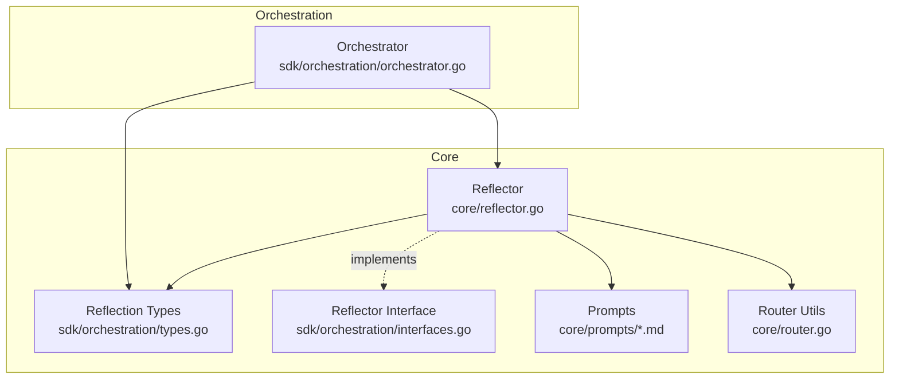
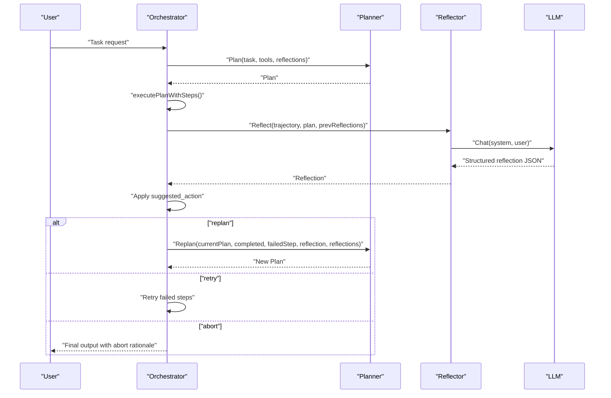
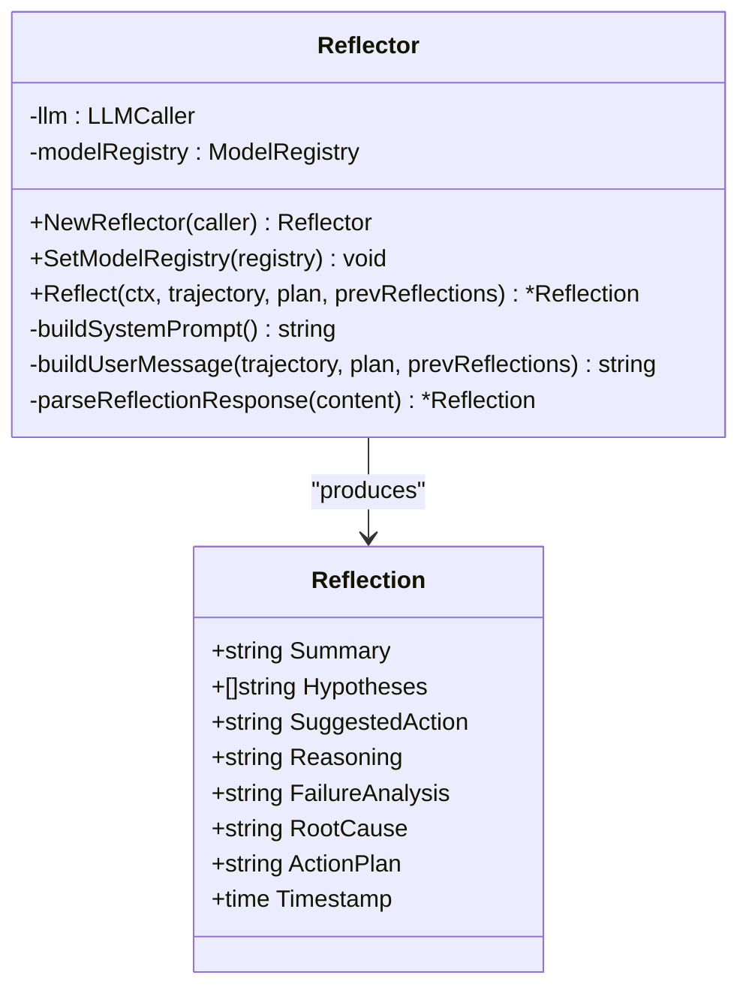
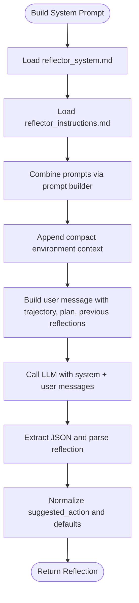
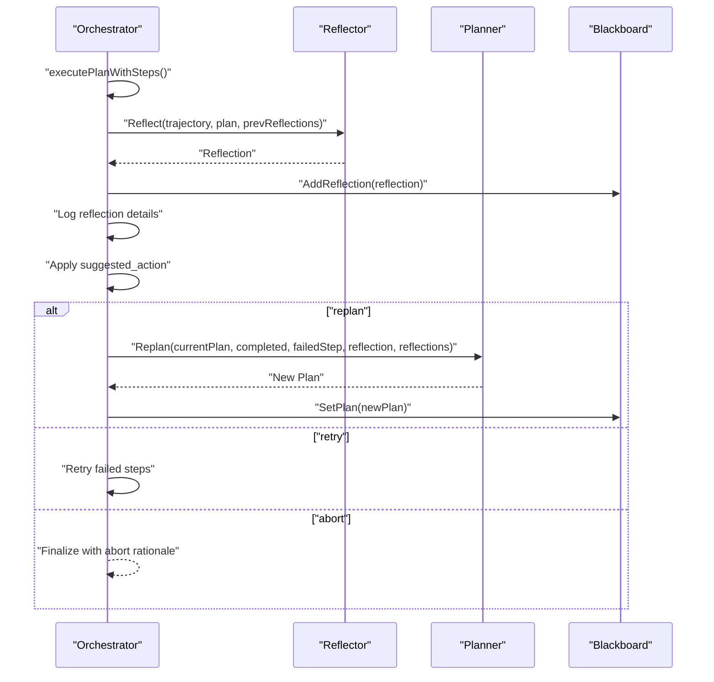
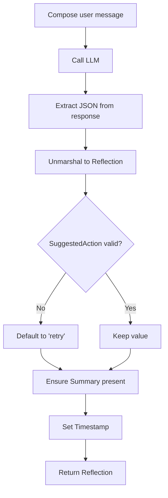
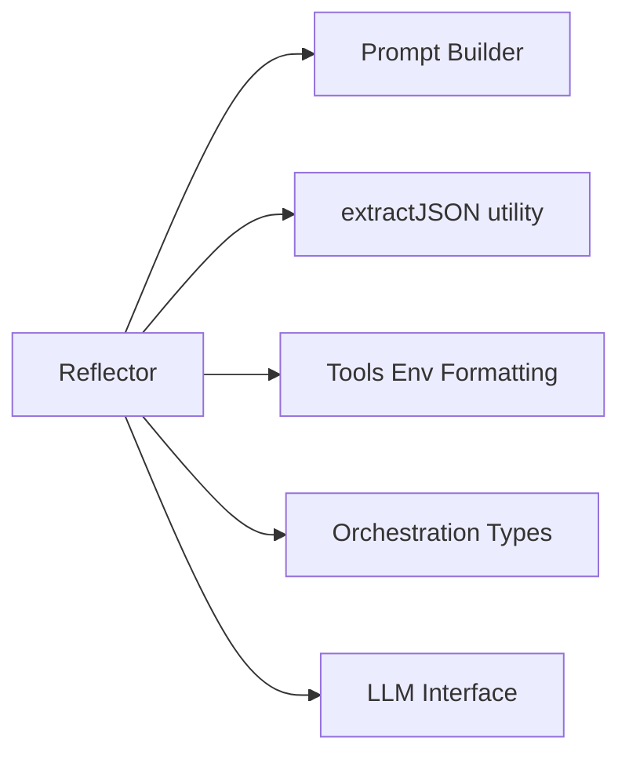

# Reflector Mechanism

<cite>
**Referenced Files in This Document**
- [reflector.go](file://core/reflector.go)
- [types.go](file://sdk/orchestration/types.go)
- [interfaces.go](file://sdk/orchestration/interfaces.go)
- [orchestrator.go](file://sdk/orchestration/orchestrator.go)
- [router.go](file://core/router.go)
- [reflector_system.md](file://core/prompts/reflector_system.md)
- [reflector_instructions.md](file://core/prompts/reflector_instructions.md)
- [reflector_test.go](file://core/reflector_test.go)
</cite>

## Table of Contents
1. [Introduction](#introduction)
2. [Project Structure](#project-structure)
3. [Core Components](#core-components)
4. [Architecture Overview](#architecture-overview)
5. [Detailed Component Analysis](#detailed-component-analysis)
6. [Dependency Analysis](#dependency-analysis)
7. [Performance Considerations](#performance-considerations)
8. [Troubleshooting Guide](#troubleshooting-guide)
9. [Conclusion](#conclusion)

## Introduction
This document explains the C0WRK reflector mechanism that enables self-improvement and learning from task execution experiences. The reflector analyzes execution trajectories, evaluates outcomes, identifies root causes, and proposes corrective actions. It influences future planning decisions and task execution strategies by integrating structured feedback into the plan-and-execute loop. The documentation covers reflection triggers, content generation, prompt engineering, and the relationship between reflections and system adaptation.

## Project Structure
The reflector resides in the core orchestration layer and interacts with the planner, orchestrator, and prompt system. Key locations:
- Reflector implementation: core/reflector.go
- Orchestration types and interfaces: sdk/orchestration/types.go, sdk/orchestration/interfaces.go
- Orchestrator integration: sdk/orchestration/orchestrator.go
- Prompt engineering: core/prompts/reflector_system.md, core/prompts/reflector_instructions.md
- Utilities: core/router.go (JSON extraction)
- Tests: core/reflector_test.go

**Diagram sources**
- [reflector.go:1-177](file://core/reflector.go#L1-L177)
- [types.go:53-63](file://sdk/orchestration/types.go#L53-L63)
- [interfaces.go:19-22](file://sdk/orchestration/interfaces.go#L19-L22)
- [router.go:116-120](file://core/router.go#L116-L120)
- [orchestrator.go:128-346](file://sdk/orchestration/orchestrator.go#L128-L346)

**Section sources**
- [reflector.go:1-177](file://core/reflector.go#L1-L177)
- [types.go:53-63](file://sdk/orchestration/types.go#L53-L63)
- [interfaces.go:19-22](file://sdk/orchestration/interfaces.go#L19-L22)
- [router.go:116-120](file://core/router.go#L116-L120)
- [orchestrator.go:128-346](file://sdk/orchestration/orchestrator.go#L128-L346)

## Core Components
- Reflector: Analyzes execution trajectory, plan context, and prior reflections to produce a structured reflection with suggested action and rationale.
- Reflection: Structured outcome containing summary, hypotheses, suggested action, reasoning, failure analysis, root cause, action plan, and timestamp.
- Orchestrator integration: Triggers reflection after execution errors, applies suggested action (retry, replan, abort), and updates the plan accordingly.
- Prompt system: System and instruction prompts define the reflector's role, classification rules, and output format.

Key responsibilities:
- Build system and user prompts with environment context
- Compose execution trajectory and plan context
- Parse and normalize LLM JSON responses
- Validate suggested actions and defaults
- Emit reflection events and persist to blackboard

**Section sources**
- [reflector.go:39-80](file://core/reflector.go#L39-L80)
- [reflector.go:90-148](file://core/reflector.go#L90-L148)
- [reflector.go:150-176](file://core/reflector.go#L150-L176)
- [types.go:53-63](file://sdk/orchestration/types.go#L53-L63)
- [interfaces.go:19-22](file://sdk/orchestration/interfaces.go#L19-L22)

## Architecture Overview
The reflector participates in the plan-and-execute loop. After plan execution, the orchestrator detects errors and invokes the reflector. Based on the reflection’s suggested action, the orchestrator either replans or retries failed steps.

**Diagram sources**
- [orchestrator.go:128-346](file://sdk/orchestration/orchestrator.go#L128-L346)
- [interfaces.go:13-17](file://sdk/orchestration/interfaces.go#L13-L17)
- [reflector.go:39-80](file://core/reflector.go#L39-L80)

## Detailed Component Analysis

### Reflector Implementation
The Reflector builds a system prompt from curated prompt modules and a user message composed from execution trajectory, plan context, and prior reflections. It calls the LLM, parses the JSON response, normalizes suggested actions, and attaches a timestamp.

**Diagram sources**
- [reflector.go:24-80](file://core/reflector.go#L24-L80)
- [types.go:53-63](file://sdk/orchestration/types.go#L53-L63)

Key behaviors:
- System prompt composition: combines reflector system and instructions modules.
- User message construction: includes trajectory, plan, previous reflections, and a footer requesting analysis.
- Environment context: appends compact environment block derived from execution context.
- Response parsing: extracts JSON from LLM output, validates suggested action, and normalizes defaults.
- Timestamping: sets reflection creation time.

**Section sources**
- [reflector.go:82-88](file://core/reflector.go#L82-L88)
- [reflector.go:90-148](file://core/reflector.go#L90-L148)
- [reflector.go:150-176](file://core/reflector.go#L150-L176)

### Reflection Prompt Engineering
The reflector’s behavior is governed by two prompt modules:
- System prompt: Defines roles, classification rules, and output format.
- Instructions: Guides depth of analysis, alternative approaches, and cross-attempt pattern recognition.

**Diagram sources**
- [reflector.go:82-88](file://core/reflector.go#L82-L88)
- [reflector.go:90-148](file://core/reflector.go#L90-L148)
- [reflector_system.md:1-70](file://core/prompts/reflector_system.md#L1-L70)
- [reflector_instructions.md:1-8](file://core/prompts/reflector_instructions.md#L1-L8)

**Section sources**
- [reflector_system.md:1-70](file://core/prompts/reflector_system.md#L1-L70)
- [reflector_instructions.md:1-8](file://core/prompts/reflector_instructions.md#L1-L8)

### Orchestrator Integration and Reflection Triggering
The orchestrator triggers reflection after execution errors and applies the suggested action:
- Detects execution errors and determines if replan or retry is needed.
- Invokes the reflector with trajectory, plan, and previous reflections.
- Emits reflection events and persists reflections to the blackboard.
- If replan is suggested, requests a new plan from the planner and carries forward completed steps where possible.

**Diagram sources**
- [orchestrator.go:195-346](file://sdk/orchestration/orchestrator.go#L195-L346)
- [interfaces.go:13-17](file://sdk/orchestration/interfaces.go#L13-L17)

**Section sources**
- [orchestrator.go:195-346](file://sdk/orchestration/orchestrator.go#L195-L346)

### Reflection Content Generation and Validation
The reflector composes a user message that includes:
- Execution trajectory: step thoughts, actions, observations.
- Plan context: step IDs, descriptions, dependencies.
- Previous reflections: summaries, root causes, action plans, suggested actions.

It then calls the LLM and parses the response:
- Extracts JSON from LLM output using a shared extraction utility.
- Unmarshals into a Reflection struct.
- Normalizes suggested_action to one of retry, replan, or abort.
- Sets default summary if absent.

**Diagram sources**
- [reflector.go:90-148](file://core/reflector.go#L90-L148)
- [reflector.go:150-176](file://core/reflector.go#L150-L176)
- [router.go:116-120](file://core/router.go#L116-L120)

**Section sources**
- [reflector.go:90-148](file://core/reflector.go#L90-L148)
- [reflector.go:150-176](file://core/reflector.go#L150-L176)
- [router.go:116-120](file://core/router.go#L116-L120)

### Reflection Workflows and Learning Patterns
Common reflection scenarios and their influence on planning:
- Partial completion with a specific failure: Suggests retry with a targeted fix.
- Wrong tool selection throughout execution: Suggests replan with corrected profile and tools.
- Structural coordination failures: Suggests replan with refined step decomposition.
- Cross-attempt repetition of root causes: Suggests replan to break recurring patterns.

These patterns guide the orchestrator to either retry failed steps or rebuild the plan, improving task execution quality and efficiency over time.

**Section sources**
- [reflector_system.md:23-47](file://core/prompts/reflector_system.md#L23-L47)

### Example Reflection Workflows
- Scenario 1: Partial failure with one step failing while others pass. The reflection suggests retry with a specific fix, enabling incremental progress.
- Scenario 2: Zero criteria passed due to incorrect tool usage. The reflection suggests replan with a different profile and toolset.

These examples demonstrate how reflections translate observations into actionable plans.

**Section sources**
- [reflector_system.md:49-69](file://core/prompts/reflector_system.md#L49-L69)

## Dependency Analysis
The reflector depends on:
- LLM interface for inference
- Prompt builder for composing system and instruction prompts
- Router utility for extracting JSON from LLM responses
- Tools utilities for environment context formatting
- Orchestration types for plan and reflection structures

**Diagram sources**
- [reflector.go:3-15](file://core/reflector.go#L3-L15)
- [router.go:116-120](file://core/router.go#L116-L120)

**Section sources**
- [reflector.go:3-15](file://core/reflector.go#L3-L15)
- [router.go:116-120](file://core/router.go#L116-L120)

## Performance Considerations
- Prompt size: Keep system and user prompts concise to fit within model context windows.
- JSON parsing: Use robust extraction to minimize retries due to malformed outputs.
- Reflection frequency: Limit unnecessary reflection calls by aggregating errors appropriately.
- Event emission: Emit reflection events to enable UI responsiveness without impacting core logic.

## Troubleshooting Guide
Common issues and resolutions:
- LLM call failures: The reflector returns a wrapped error; inspect upstream LLM configuration and rate limits.
- Malformed JSON: The reflector extracts JSON using a shared utility; ensure the model responds with valid JSON.
- Unknown suggested actions: Defaults to retry; verify prompt instructions and model behavior.
- Missing summary: Populates a default placeholder; confirm prompt completeness.

Validation references:
- LLM call error wrapping
- JSON extraction and unmarshalling
- Suggested action normalization
- Default summary assignment

**Section sources**
- [reflector.go:66-74](file://core/reflector.go#L66-L74)
- [reflector.go:150-176](file://core/reflector.go#L150-L176)
- [router.go:116-120](file://core/router.go#L116-L120)

## Conclusion
The reflector mechanism provides a structured, prompt-driven approach to self-improvement. By analyzing execution outcomes, identifying root causes, and proposing corrective actions, it continuously adapts planning and execution strategies. Its integration with the orchestrator ensures that reflections drive replanning or targeted retries, improving task execution quality and efficiency over time.