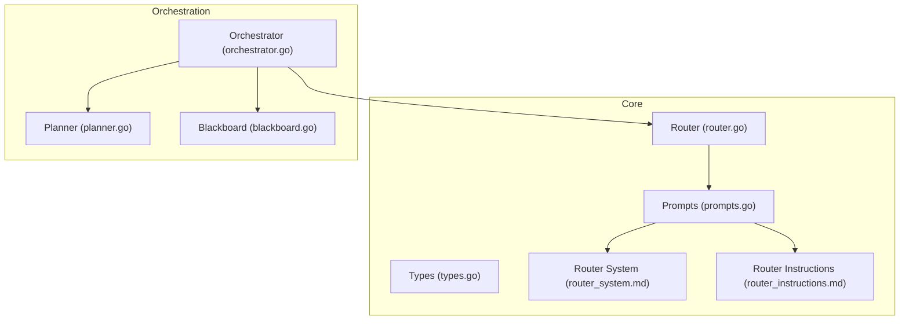
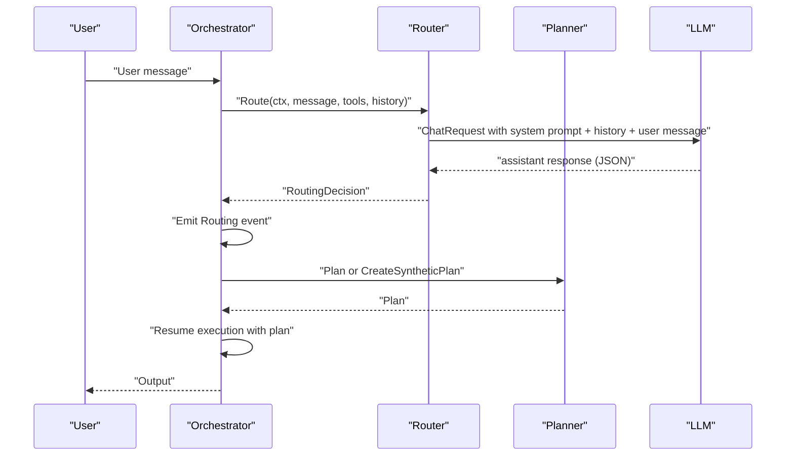
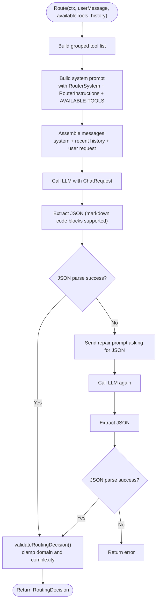
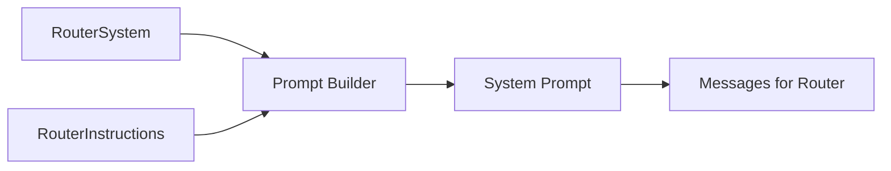
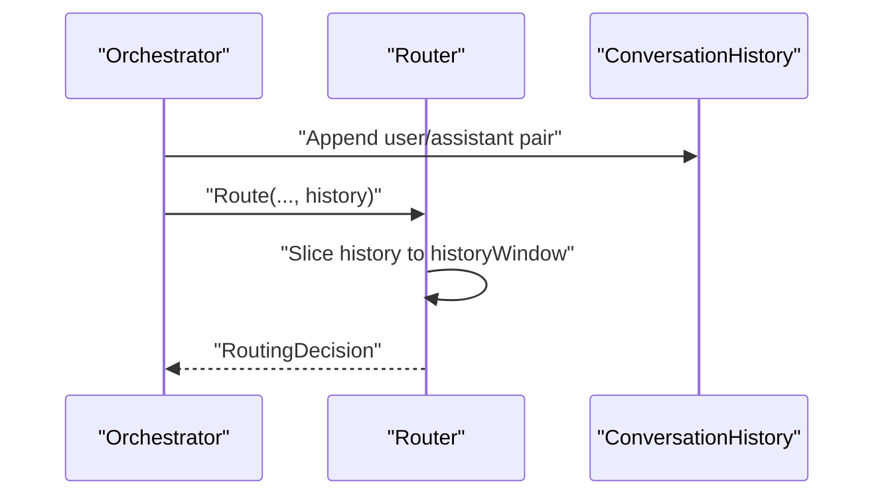
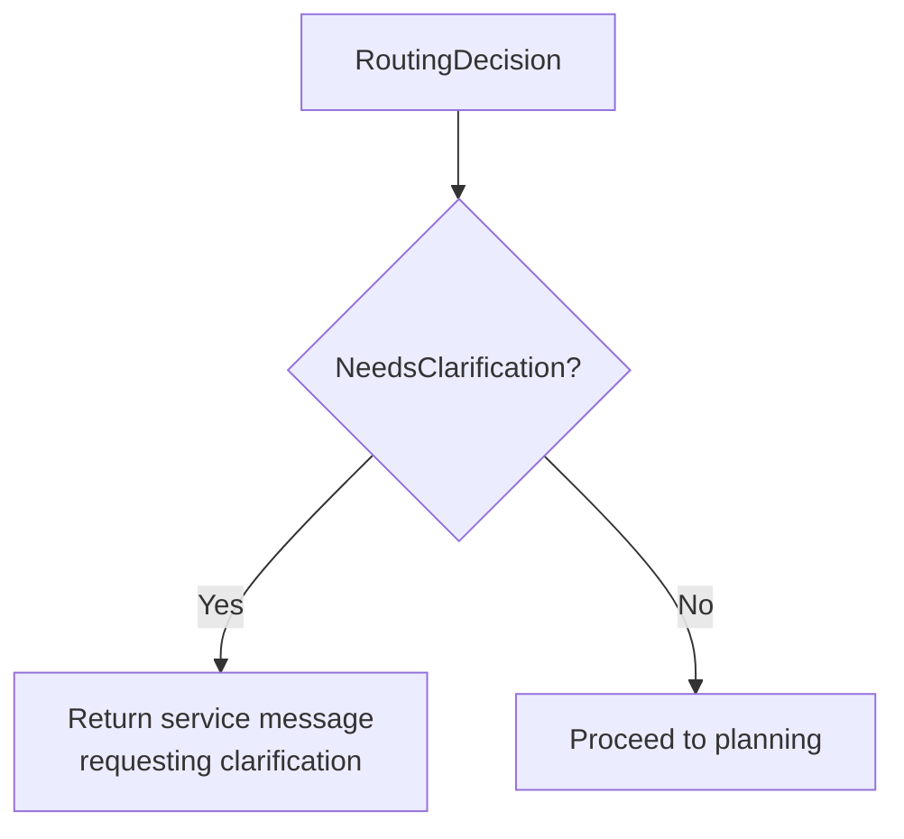
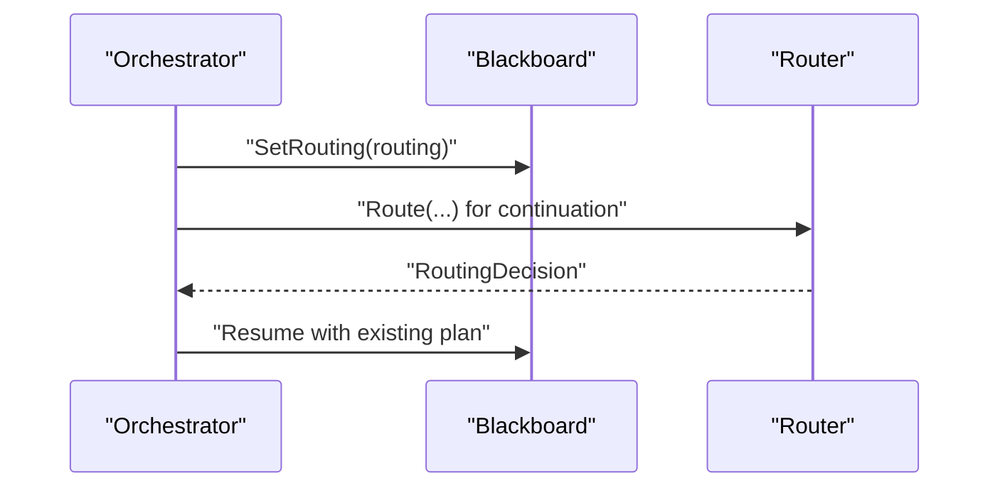
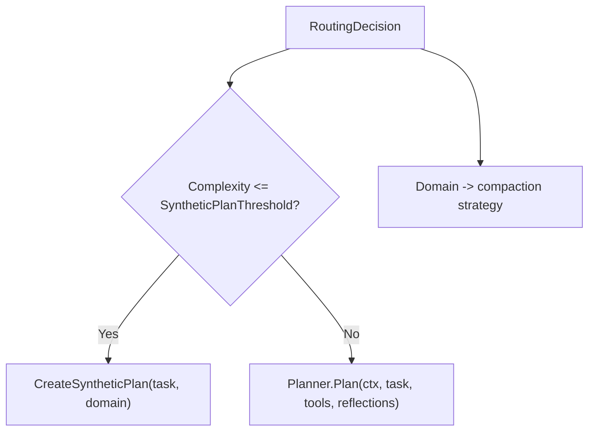
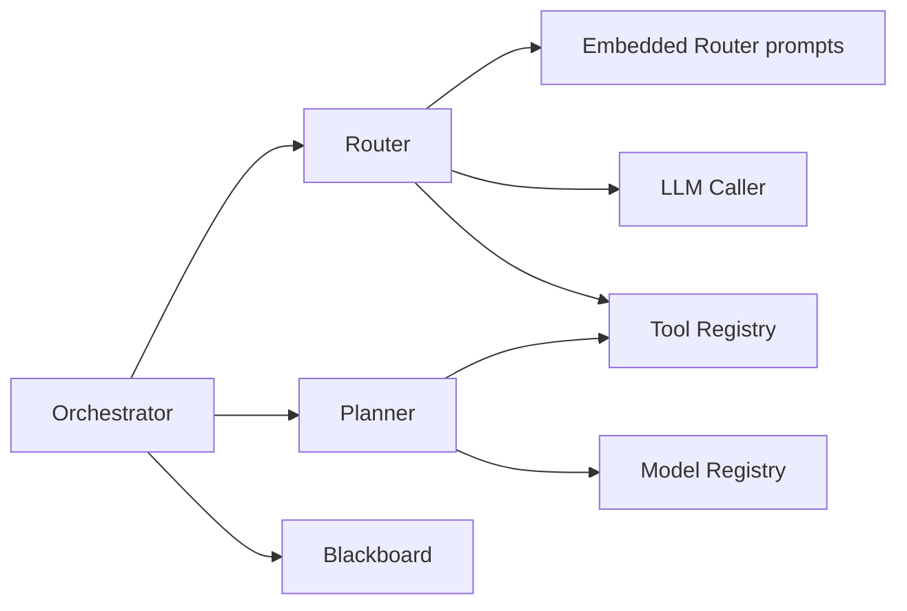

# Router Logic

<cite>
**Referenced Files in This Document**
- [router.go](file://core/router.go)
- [router_system.md](file://core/prompts/router_system.md)
- [router_instructions.md](file://core/prompts/router_instructions.md)
- [prompts.go](file://core/prompts/prompts.go)
- [types.go](file://core/types.go)
- [router_test.go](file://core/router_test.go)
- [orchestrator.go](file://core/orchestrator.go)
- [planner.go](file://core/planner.go)
- [blackboard.go](file://sdk/orchestration/blackboard.go)
</cite>

## Table of Contents
1. [Introduction](#introduction)
2. [Project Structure](#project-structure)
3. [Core Components](#core-components)
4. [Architecture Overview](#architecture-overview)
5. [Detailed Component Analysis](#detailed-component-analysis)
6. [Dependency Analysis](#dependency-analysis)
7. [Performance Considerations](#performance-considerations)
8. [Troubleshooting Guide](#troubleshooting-guide)
9. [Conclusion](#conclusion)

## Introduction
This document explains the C0WRK router logic system that classifies user requests into domains and complexity levels, assesses tool availability, and prepares the orchestration pipeline for plan-and-execute execution. It covers how routing decisions influence planner behavior, how the router integrates with conversation history for context, and how persistence and clarification mechanisms shape task continuations.

## Project Structure
The router lives in the core package and composes system prompts from the prompts package. It interacts with the orchestrator, which manages conversation history and delegates to the planner. Persistence is handled via a blackboard abstraction.

**Diagram sources**
- [router.go:1-172](file://core/router.go#L1-L172)
- [prompts.go:1-168](file://core/prompts/prompts.go#L1-L168)
- [router_system.md:1-42](file://core/prompts/router_system.md#L1-L42)
- [router_instructions.md:1-6](file://core/prompts/router_instructions.md#L1-L6)
- [orchestrator.go:1-599](file://core/orchestrator.go#L1-L599)
- [planner.go:1-979](file://core/planner.go#L1-L979)
- [blackboard.go:1-564](file://sdk/orchestration/blackboard.go#L1-L564)

**Section sources**
- [router.go:1-172](file://core/router.go#L1-L172)
- [prompts.go:1-168](file://core/prompts/prompts.go#L1-L168)
- [router_system.md:1-42](file://core/prompts/router_system.md#L1-L42)
- [router_instructions.md:1-6](file://core/prompts/router_instructions.md#L1-L6)
- [orchestrator.go:1-599](file://core/orchestrator.go#L1-L599)
- [planner.go:1-979](file://core/planner.go#L1-L979)
- [blackboard.go:1-564](file://sdk/orchestration/blackboard.go#L1-L564)

## Core Components
- Router: Builds a classification prompt with grouped tools, appends recent conversation history, calls the LLM, extracts and validates JSON, and returns a routing decision.
- Prompt system: Router system and instructions define domain taxonomy, complexity scale, and guidance for tool availability and ambiguity.
- Orchestrator: Uses router decisions to choose synthetic vs. full planning, injects domain context, and manages conversation history.
- Planner: Generates DAG plans conditioned on domain and complexity; uses compaction strategy derived from domain and complexity.
- Blackboard: Stores routing decisions and plan for persistence and continuations.

**Section sources**
- [router.go:45-172](file://core/router.go#L45-L172)
- [router_system.md:1-42](file://core/prompts/router_system.md#L1-L42)
- [router_instructions.md:1-6](file://core/prompts/router_instructions.md#L1-L6)
- [orchestrator.go:406-480](file://core/orchestrator.go#L406-L480)
- [planner.go:257-277](file://core/planner.go#L257-L277)
- [blackboard.go:139-155](file://sdk/orchestration/blackboard.go#L139-L155)

## Architecture Overview
The router participates in the orchestration loop by classifying requests and feeding the result to the planner. The orchestrator manages conversation history and decides between synthetic and full planning based on complexity thresholds.

**Diagram sources**
- [orchestrator.go:406-480](file://core/orchestrator.go#L406-L480)
- [router.go:45-114](file://core/router.go#L45-L114)
- [planner.go:257-277](file://core/planner.go#L257-L277)

## Detailed Component Analysis

### Router Decision Pipeline
The router builds a classification prompt from system and instruction templates, augments it with grouped tool descriptors, and appends recent conversation history. It then calls the LLM, extracts JSON (including fenced code blocks), validates and normalizes the decision, and returns a structured routing decision.

**Diagram sources**
- [router.go:45-172](file://core/router.go#L45-L172)
- [router_system.md:1-42](file://core/prompts/router_system.md#L1-L42)
- [router_instructions.md:1-6](file://core/prompts/router_instructions.md#L1-L6)

**Section sources**
- [router.go:45-172](file://core/router.go#L45-L172)
- [router_test.go:153-179](file://core/router_test.go#L153-L179)
- [router_test.go:297-325](file://core/router_test.go#L297-L325)

### Prompt Engineering and Templates
- RouterSystem defines the complexity scale (1–5), domain taxonomy (“code”, “research”, “mixed”, “general”), and guidance for ambiguity.
- RouterInstructions advises considering full context and preferring “mixed” when domains are ambiguous.
- Prompts loader exposes embedded templates and a family-specific selector for agent prompts.

**Diagram sources**
- [router_system.md:1-42](file://core/prompts/router_system.md#L1-L42)
- [router_instructions.md:1-6](file://core/prompts/router_instructions.md#L1-L6)
- [prompts.go:91-98](file://core/prompts/prompts.go#L91-L98)

**Section sources**
- [router_system.md:1-42](file://core/prompts/router_system.md#L1-L42)
- [router_instructions.md:1-6](file://core/prompts/router_instructions.md#L1-L6)
- [prompts.go:91-98](file://core/prompts/prompts.go#L91-L98)

### Integration with Conversation History
The orchestrator maintains a rolling conversation history window and passes it to the router. The router includes the most recent N messages (subject to historyWindow) to provide contextual understanding for classification.

**Diagram sources**
- [orchestrator.go:584-595](file://core/orchestrator.go#L584-L595)
- [router.go:58-72](file://core/router.go#L58-L72)

**Section sources**
- [router.go:58-72](file://core/router.go#L58-L72)
- [router_test.go:82-129](file://core/router_test.go#L82-L129)
- [orchestrator.go:584-595](file://core/orchestrator.go#L584-L595)

### Clarification Mechanism
If the router marks a request as needing clarification, the orchestrator returns a service message requesting more information instead of proceeding with planning. This prevents misclassification of vague or ambiguous inputs.

**Diagram sources**
- [router.go:111-114](file://core/router.go#L111-L114)
- [orchestrator.go:420-428](file://core/orchestrator.go#L420-L428)

**Section sources**
- [router.go:111-114](file://core/router.go#L111-L114)
- [router_test.go:131-151](file://core/router_test.go#L131-L151)
- [orchestrator.go:420-428](file://core/orchestrator.go#L420-L428)

### Routing Persistence and Continuations
The orchestrator persists the routing decision on the blackboard after execution. For continuations, the orchestrator restores the blackboard and reuses the original routing decision to resume plan-and-execute mode.

**Diagram sources**
- [orchestrator.go:561-566](file://core/orchestrator.go#L561-L566)
- [blackboard.go:139-155](file://sdk/orchestration/blackboard.go#L139-L155)

**Section sources**
- [orchestrator.go:561-566](file://core/orchestrator.go#L561-L566)
- [blackboard.go:139-155](file://sdk/orchestration/blackboard.go#L139-L155)

### Relationship Between Routing Decisions and Planner Behavior
- Complexity threshold: Below a configurable threshold, the orchestrator uses a synthetic plan to reduce overhead; otherwise, it invokes the planner to generate a full DAG.
- Domain influences compaction strategy applied during long executions, ensuring context remains useful for the primary activity type.

**Diagram sources**
- [orchestrator.go:444-457](file://core/orchestrator.go#L444-L457)
- [planner.go:949-967](file://core/planner.go#L949-L967)
- [router.go:156-171](file://core/router.go#L156-L171)

**Section sources**
- [orchestrator.go:444-457](file://core/orchestrator.go#L444-L457)
- [planner.go:949-967](file://core/planner.go#L949-L967)
- [router.go:156-171](file://core/router.go#L156-L171)

### Tool Availability Assessment
- The router receives a list of available tools and renders them into the system prompt via a grouped tool list builder. This ensures the LLM considers what tools are accessible when classifying the request.
- ToolProfiles define allowed tools per role; the router itself does not filter tools but receives the full list.

**Section sources**
- [router.go:47-55](file://core/router.go#L47-L55)
- [router_test.go:44-80](file://core/router_test.go#L44-L80)
- [toolprofiles.go:3-11](file://core/toolprofiles.go#L3-L11)

## Dependency Analysis
- Router depends on:
  - Prompt templates (embedded via prompts package)
  - LLM caller interface
  - Tool registry for building tool lists
- Orchestrator depends on Router for classification and on Planner for plan generation.
- Planner depends on model registry and tool registry to construct system prompts and select tools.
- Blackboard persists routing decisions and plans for continuations.

**Diagram sources**
- [router.go:10-15](file://core/router.go#L10-L15)
- [prompts.go:91-98](file://core/prompts/prompts.go#L91-L98)
- [orchestrator.go:58-75](file://core/orchestrator.go#L58-L75)
- [planner.go:169-180](file://core/planner.go#L169-L180)
- [blackboard.go:16-28](file://sdk/orchestration/blackboard.go#L16-L28)

**Section sources**
- [router.go:10-15](file://core/router.go#L10-L15)
- [prompts.go:91-98](file://core/prompts/prompts.go#L91-L98)
- [orchestrator.go:58-75](file://core/orchestrator.go#L58-L75)
- [planner.go:169-180](file://core/planner.go#L169-L180)
- [blackboard.go:16-28](file://sdk/orchestration/blackboard.go#L16-L28)

## Performance Considerations
- JSON extraction robustness: The router tolerates markdown code blocks and retries with a repair prompt if the first response is not valid JSON.
- History window: Limiting recent messages reduces token usage and speeds up classification.
- Synthetic plans: For low-complexity tasks, avoiding full planning saves tokens and latency.
- Validation: Normalizing domain and complexity bounds prevents unexpected planner behavior.

[No sources needed since this section provides general guidance]

## Troubleshooting Guide
Common issues and resolutions:
- Invalid JSON response: The router automatically retries with a repair prompt. Verify that the LLM’s output is wrapped in JSON and not free-form text.
- Ambiguous requests: If NeedsClarification is true, the orchestrator returns a clarification message. Encourage users to refine their requests.
- History overflow: Ensure MaxHistoryMessages is configured appropriately to keep the conversation window manageable.
- Tool availability confusion: Confirm that the tool registry is populated and that tools are correctly grouped for the router prompt.

**Section sources**
- [router.go:89-109](file://core/router.go#L89-L109)
- [router_test.go:297-325](file://core/router_test.go#L297-L325)
- [orchestrator.go:420-428](file://core/orchestrator.go#L420-L428)
- [orchestrator.go:589-595](file://core/orchestrator.go#L589-L595)

## Conclusion
The router’s classification pipeline—prompt engineering, tool awareness, and JSON validation—provides a robust foundation for downstream planning and execution. By integrating conversation history and supporting clarification and persistence, the system balances accuracy and efficiency across a wide range of tasks.