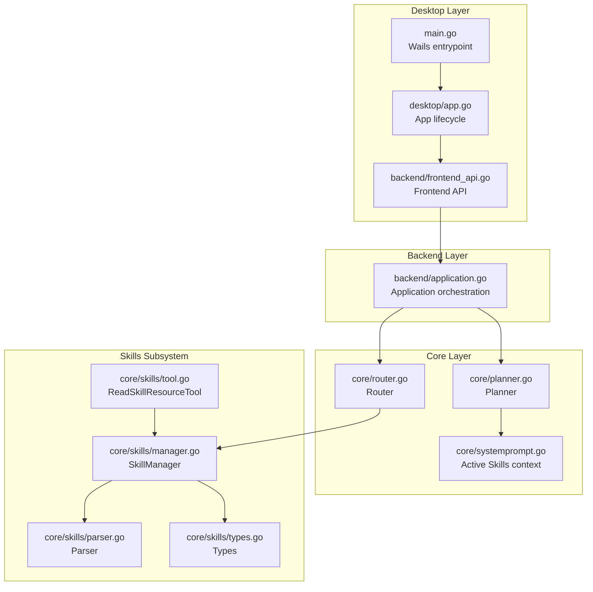
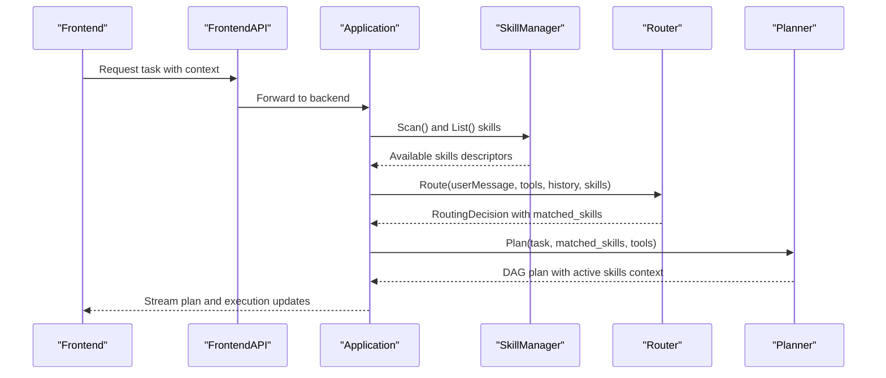
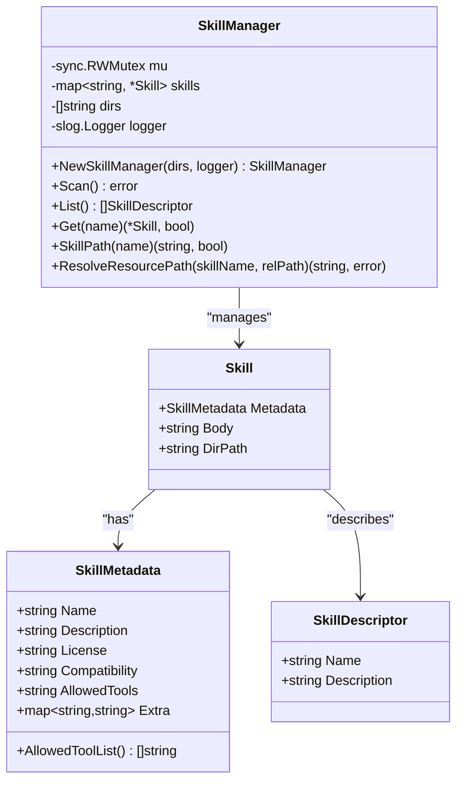
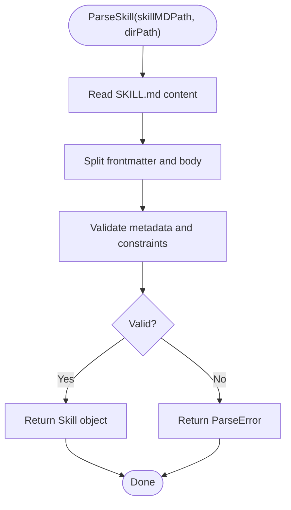
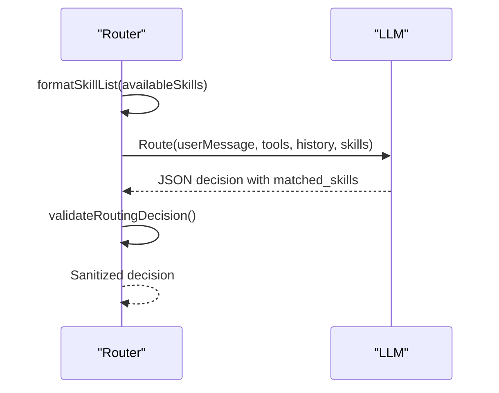
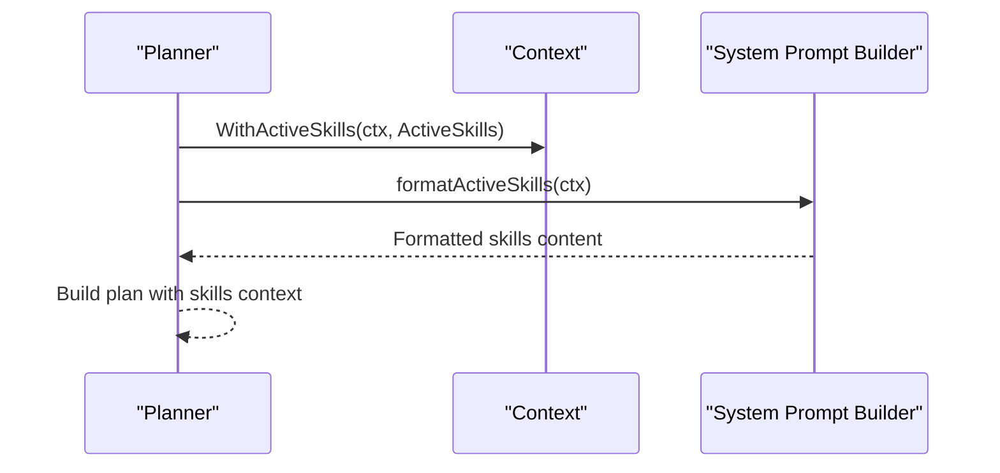
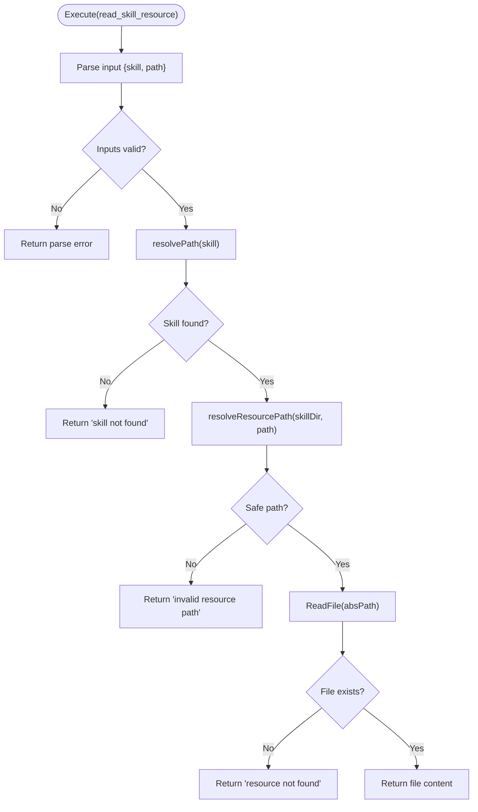
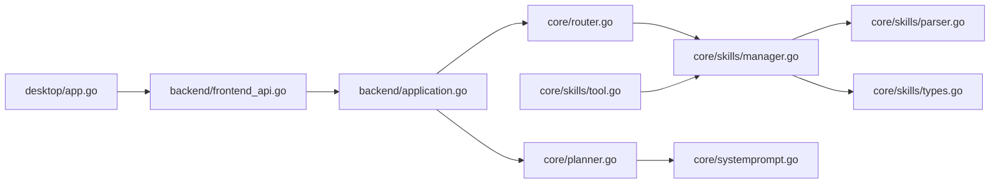

# Skills Management System

<cite>
**Referenced Files in This Document**
- [main.go](file://main.go)
- [README.md](file://README.md)
- [application.go](file://backend/application.go)
- [app.go](file://desktop/app.go)
- [frontend_api.go](file://backend/frontend_api.go)
- [manager.go](file://core/skills/manager.go)
- [parser.go](file://core/skills/parser.go)
- [types.go](file://core/skills/types.go)
- [tool.go](file://core/skills/tool.go)
- [router.go](file://core/router.go)
- [systemprompt.go](file://core/systemprompt.go)
- [planner.go](file://core/planner.go)
- [config.example.yaml](file://config.example.yaml)
</cite>

## Table of Contents
1. [Introduction](#introduction)
2. [Project Structure](#project-structure)
3. [Core Components](#core-components)
4. [Architecture Overview](#architecture-overview)
5. [Detailed Component Analysis](#detailed-component-analysis)
6. [Dependency Analysis](#dependency-analysis)
7. [Performance Considerations](#performance-considerations)
8. [Troubleshooting Guide](#troubleshooting-guide)
9. [Conclusion](#conclusion)

## Introduction
This document describes the Skills Management System within the c0wrk desktop AI coding agent. The system enables discovery, parsing, and integration of Agent Skills that follow the agentskills.io specification. Skills are YAML-frontmatter-defined packages that provide structured instructions and metadata, enabling the agent to match relevant skills to user tasks and incorporate their guidance into planning and execution.

The system integrates with the core orchestration pipeline:
- Skills are discovered from configured directories and parsed into structured metadata and bodies
- Router uses available skills to inform classification decisions
- Planner and system prompts incorporate active skills into task execution guidance
- A dedicated tool allows reading skill resources safely during execution

## Project Structure
The Skills Management System spans multiple layers:
- Desktop entrypoint and lifecycle management
- Backend application orchestration and persistence
- Core orchestration components (router, planner, system prompts)
- Skills subsystem (manager, parser, types, tool)
- Configuration and integration points

**Diagram sources**
- [main.go:18-44](file://main.go#L18-L44)
- [app.go:19-64](file://desktop/app.go#L19-L64)
- [frontend_api.go:16-114](file://backend/frontend_api.go#L16-L114)
- [application.go:65-133](file://backend/application.go#L65-L133)
- [router.go:48-120](file://core/router.go#L48-L120)
- [planner.go:169-200](file://core/planner.go#L169-L200)
- [systemprompt.go:69-91](file://core/systemprompt.go#L69-L91)
- [manager.go:20-84](file://core/skills/manager.go#L20-L84)
- [parser.go:27-51](file://core/skills/parser.go#L27-L51)
- [types.go:7-37](file://core/skills/types.go#L7-L37)
- [tool.go:18-92](file://core/skills/tool.go#L18-L92)

**Section sources**
- [README.md:26-36](file://README.md#L26-L36)
- [main.go:18-44](file://main.go#L18-L44)
- [app.go:19-64](file://desktop/app.go#L19-L64)
- [frontend_api.go:16-114](file://backend/frontend_api.go#L16-L114)
- [application.go:65-133](file://backend/application.go#L65-L133)

## Core Components
- SkillManager: Discovers skills from ordered directories, parses SKILL.md files, and maintains an in-memory catalog. Supports listing, lookup, path resolution, and safe resource access.
- Parser: Validates and parses YAML frontmatter and markdown body from SKILL.md, enforcing agentskills.io spec constraints.
- Types: Defines Skill, SkillMetadata, SkillDescriptor, and helper methods for allowed tools.
- Router Integration: Supplies available skills to the Router prompt and receives matched skills for downstream use.
- Planner Integration: Formats active skills into system prompts for planning and execution.
- ReadSkillResourceTool: Executes read-only access to skill resources with path traversal protection.

**Section sources**
- [manager.go:11-150](file://core/skills/manager.go#L11-L150)
- [parser.go:13-158](file://core/skills/parser.go#L13-L158)
- [types.go:7-58](file://core/skills/types.go#L7-L58)
- [router.go:48-120](file://core/router.go#L48-L120)
- [systemprompt.go:69-91](file://core/systemprompt.go#L69-L91)
- [tool.go:18-127](file://core/skills/tool.go#L18-L127)

## Architecture Overview
The Skills Management System is integrated into the agent's orchestration flow:

**Diagram sources**
- [application.go:65-133](file://backend/application.go#L65-L133)
- [manager.go:37-96](file://core/skills/manager.go#L37-L96)
- [router.go:48-120](file://core/router.go#L48-L120)
- [planner.go:169-200](file://core/planner.go#L169-L200)

## Detailed Component Analysis

### SkillManager
Responsibilities:
- Scans configured directories in priority order
- Parses SKILL.md files into Skill objects
- Enforces uniqueness by name with higher-priority directories overriding lower-priority ones
- Provides safe resource path resolution and validation

Key behaviors:
- Thread-safe read/write with RWMutex
- Path traversal protection via clean path checks
- Debug logging for invalid or unreadable directories

**Diagram sources**
- [manager.go:13-150](file://core/skills/manager.go#L13-L150)
- [types.go:7-58](file://core/skills/types.go#L7-L58)

**Section sources**
- [manager.go:20-150](file://core/skills/manager.go#L20-L150)
- [types.go:7-58](file://core/skills/types.go#L7-L58)

### Parser (SKILL.md)
Responsibilities:
- Reads and splits YAML frontmatter from markdown body
- Validates metadata against agentskills.io spec
- Ensures directory name matches skill name

Validation rules:
- Name: 1-64 chars, lowercase alphanumeric + hyphens, no leading/trailing/consecutive hyphens
- Description: required, max 1024 chars
- Compatibility: max 500 chars
- Directory name must equal skill name

**Diagram sources**
- [parser.go:27-51](file://core/skills/parser.go#L27-L51)
- [parser.go:53-92](file://core/skills/parser.go#L53-L92)
- [parser.go:118-157](file://core/skills/parser.go#L118-L157)

**Section sources**
- [parser.go:13-158](file://core/skills/parser.go#L13-L158)

### Router Integration
Integration points:
- Router.Route() accepts availableSkills and includes them in the system prompt
- Router.formatSkillList() formats skills for the LLM
- Router.validateRoutingDecision() sanitizes matched_skills (dedupe, trim, clamp)

**Diagram sources**
- [router.go:48-120](file://core/router.go#L48-L120)
- [router.go:192-206](file://core/router.go#L192-L206)
- [router.go:143-173](file://core/router.go#L143-L173)

**Section sources**
- [router.go:48-120](file://core/router.go#L48-L120)
- [router.go:192-206](file://core/router.go#L192-L206)
- [router.go:143-173](file://core/router.go#L143-L173)

### Planner Integration and Active Skills Context
Integration points:
- ActiveSkills context carries matched skills into planning and execution
- formatActiveSkills() formats active skills into planner/system prompts
- Planner uses domain-specific compaction strategies informed by matched skills

**Diagram sources**
- [systemprompt.go:69-91](file://core/systemprompt.go#L69-L91)
- [planner.go:169-200](file://core/planner.go#L169-L200)

**Section sources**
- [systemprompt.go:69-91](file://core/systemprompt.go#L69-L91)
- [planner.go:169-200](file://core/planner.go#L169-L200)

### ReadSkillResourceTool
Purpose:
- Provides a safe, read-only tool to access files within an active skill's directory
- Prevents path traversal and enforces resource existence

Execution flow:
- Parse input (skill name, relative path)
- Resolve skill directory via resolver
- Safely resolve resource path
- Read file content and return as tool result

**Diagram sources**
- [tool.go:56-92](file://core/skills/tool.go#L56-L92)
- [tool.go:94-127](file://core/skills/tool.go#L94-L127)

**Section sources**
- [tool.go:18-127](file://core/skills/tool.go#L18-L127)

## Dependency Analysis
The Skills Management System has clear layering and minimal coupling:
- Desktop layer depends on Backend FrontendAPI
- Backend orchestrates Application and Session management
- Core Router and Planner consume skills via SkillManager
- Skills subsystem is self-contained with parser and types

**Diagram sources**
- [app.go:19-64](file://desktop/app.go#L19-L64)
- [frontend_api.go:16-114](file://backend/frontend_api.go#L16-L114)
- [application.go:65-133](file://backend/application.go#L65-L133)
- [router.go:48-120](file://core/router.go#L48-L120)
- [planner.go:169-200](file://core/planner.go#L169-L200)
- [systemprompt.go:69-91](file://core/systemprompt.go#L69-L91)
- [manager.go:20-84](file://core/skills/manager.go#L20-L84)
- [parser.go:27-51](file://core/skills/parser.go#L27-L51)
- [types.go:7-37](file://core/skills/types.go#L7-L37)
- [tool.go:18-92](file://core/skills/tool.go#L18-L92)

**Section sources**
- [README.md:26-36](file://README.md#L26-L36)
- [application.go:65-133](file://backend/application.go#L65-L133)

## Performance Considerations
- Discovery cost: Directory scanning is O(N) in the number of subdirectories; ensure discovery directories are scoped appropriately.
- Parsing cost: YAML parsing and validation are lightweight; cache validated skills if scanning frequently.
- Path traversal checks: The resolver performs clean-path comparisons; keep skill directories organized to minimize path operations.
- Router/Planner integration: Skill lists are small descriptors; their inclusion in prompts is bounded by available skills.

## Troubleshooting Guide
Common issues and resolutions:
- Skill not found or not active: Ensure the skill name matches the directory name and that the skill is included in the available skills list passed to the Router.
- Invalid SKILL.md: Verify YAML frontmatter delimiters and constraints (name format, description length, compatibility length).
- Path traversal attempts: The resolver prevents escaping the skill directory; confirm relative paths do not use parent directory references.
- Resource not found: Confirm the file exists within the skill directory and the relative path is correct.

**Section sources**
- [parser.go:118-157](file://core/skills/parser.go#L118-L157)
- [manager.go:120-139](file://core/skills/manager.go#L120-L139)
- [tool.go:76-92](file://core/skills/tool.go#L76-L92)

## Conclusion
The Skills Management System provides a robust, spec-compliant mechanism for discovering, validating, and integrating Agent Skills into the c0wrk agent. Its integration with the Router and Planner ensures that relevant skills influence classification and planning, while the ReadSkillResourceTool enables safe access to skill-provided resources during execution. The design emphasizes safety (path traversal protection), clarity (YAML frontmatter spec), and maintainability (layered architecture).