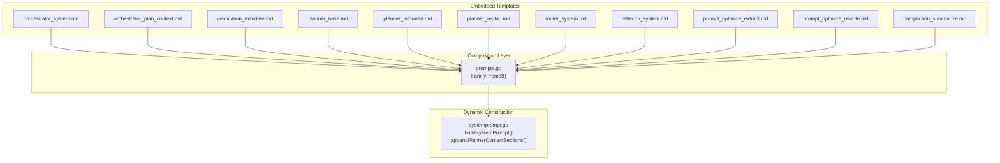
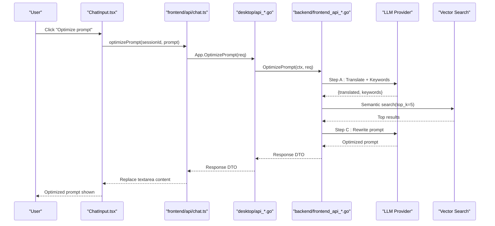
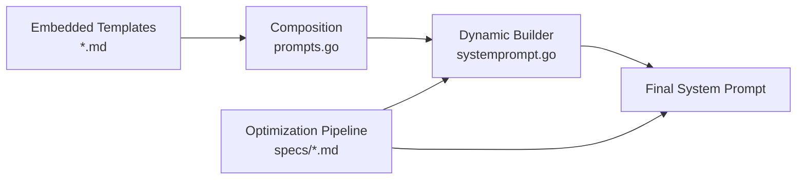
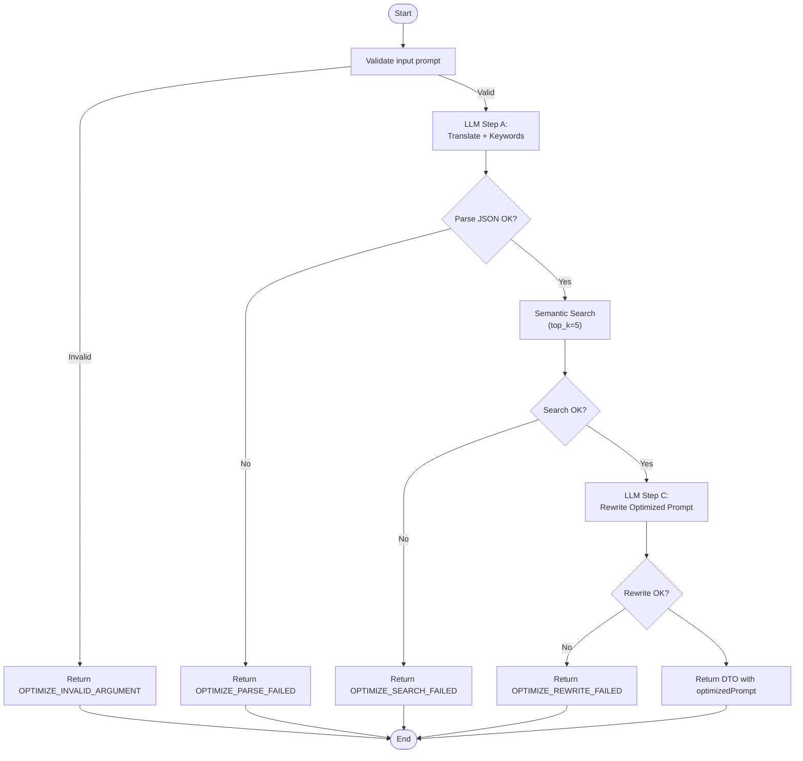

# System Prompt Engineering

<cite>
**Referenced Files in This Document**
- [systemprompt.go](file://core/systemprompt.go)
- [prompts.go](file://core/prompts/prompts.go)
- [orchestrator_system.md](file://core/prompts/orchestrator_system.md)
- [orchestrator_plan_context.md](file://core/prompts/orchestrator_plan_context.md)
- [verification_mandate.md](file://core/prompts/verification_mandate.md)
- [router_system.md](file://core/prompts/router_system.md)
- [reflector_system.md](file://core/prompts/reflector_system.md)
- [planner_base.md](file://core/prompts/planner_base.md)
- [planner_informed.md](file://core/prompts/planner_informed.md)
- [planner_replan.md](file://core/prompts/planner_replan.md)
- [prompt_optimize_extract.md](file://core/prompts/prompt_optimize_extract.md)
- [prompt_optimize_rewrite.md](file://core/prompts/prompt_optimize_rewrite.md)
- [compaction_summarize.md](file://core/prompts/compaction_summarize.md)
- [prompt-optimization-spec.md](file://specs/prompt-optimization-spec.md)
- [prompt-optimization-roadmap.md](file://specs/prompt-optimization-roadmap.md)
- [prompt-review-report.md](file://docs/prompt-review-report.md)
</cite>

## Table of Contents
1. [Introduction](#introduction)
2. [Project Structure](#project-structure)
3. [Core Components](#core-components)
4. [Architecture Overview](#architecture-overview)
5. [Detailed Component Analysis](#detailed-component-analysis)
6. [Dependency Analysis](#dependency-analysis)
7. [Performance Considerations](#performance-considerations)
8. [Troubleshooting Guide](#troubleshooting-guide)
9. [Conclusion](#conclusion)
10. [Appendices](#appendices)

## Introduction
This document presents a comprehensive guide to System Prompt Engineering within the c0wrk codebase. It explains how prompts are organized, composed, and adapted for different models and roles, and how dynamic context is integrated into system prompts. It also documents the end-to-end prompt optimization feature, including its specification, roadmap, and implementation considerations. The goal is to enable contributors to understand, refine, and extend the prompt ecosystem while maintaining consistency, safety, and performance.

## Project Structure
The prompt system is organized into:
- Embedded prompt templates (core/prompts/*.md)
- Prompt composition utilities (core/prompts/prompts.go)
- Dynamic system prompt construction (core/systemprompt.go)
- Specialized agent prompts (router, reflector, planner templates)
- Prompt optimization feature specification and roadmap
- Comprehensive prompt review report

**Diagram sources**
- [prompts.go:111-170](file://core/prompts/prompts.go#L111-L170)
- [systemprompt.go:197-248](file://core/systemprompt.go#L197-L248)

**Section sources**
- [prompts.go:1-170](file://core/prompts/prompts.go#L1-170)
- [systemprompt.go:1-255](file://core/systemprompt.go#L1-L255)

## Core Components
- Embedded prompt templates: Orchestrator, Planner, Router, Reflector, Verification mandate, Prompt optimization extract/rewrite, and compaction summarize.
- Prompt family selection: FamilyPrompt(agent, family) resolves model-family-specific overlays.
- Dynamic system prompt builder: buildSystemPrompt composes the final system prompt with workspace, plan mode, environment, vector hints, and active skills.
- Planner context builder: appendPlannerContextSections adds environment, vector hints, AGENTS.md, and skills to planner prompts.
- Prompt optimization feature: end-to-end spec and roadmap define a three-stage pipeline (translation + keyword extraction, semantic search, final rewrite) with strict contracts and error taxonomy.

**Section sources**
- [prompts.go:111-170](file://core/prompts/prompts.go#L111-L170)
- [systemprompt.go:177-248](file://core/systemprompt.go#L177-L248)
- [prompt-optimization-spec.md:163-347](file://specs/prompt-optimization-spec.md#L163-L347)

## Architecture Overview
The prompt architecture blends static templates with dynamic context injection. The composition layer selects family-specific overlays, while the dynamic builder integrates runtime context such as workspace paths, environment blocks, vector search hints, AGENTS.md content, and active skills. The prompt optimization feature orchestrates three stages through the backend/frontend-api layer, leveraging existing LLM and vector search facilities.

**Diagram sources**
- [prompt-optimization-spec.md:286-300](file://specs/prompt-optimization-spec.md#L286-L300)
- [prompt-optimization-roadmap.md:111-149](file://specs/prompt-optimization-roadmap.md#L111-L149)

## Detailed Component Analysis

### Orchestrator System Prompt
The Orchestrator system prompt establishes the ReAct loop, tool priority tiers, fact memory usage, output strategy, safety rules, language policy, and user interaction protocol. It is composed with:
- Core system prompt
- Model-family overlay (e.g., Anthropic, OpenAI flagship/standard, Gemini, Mistral, DeepSeek, Kimi, Codex)
- Verification mandate
- Dynamic sections: workspace context, plan mode context, environment block, vector hints, active skills

Key characteristics:
- Four-tier tool priority emphasizes semantic_search first for code discovery.
- Strong finish-tool mandate and output strategy guidance.
- Fact memory guidance encourages storing and retrieving verified facts.
- Safety and user interaction rules minimize unintended actions.

Recommendations from the prompt review:
- Add a "Minimum Viable Prompt" variant for constrained token budgets.
- Expand safety guidance for destructive bash operations.
- Clarify batching of independent tool calls.
- Define language fallback behavior.

**Section sources**
- [orchestrator_system.md:1-100](file://core/prompts/orchestrator_system.md#L1-L100)
- [systemprompt.go:197-248](file://core/systemprompt.go#L197-L248)
- [prompt-review-report.md:73-97](file://docs/prompt-review-report.md#L73-L97)

### Planner System Prompts
Planner prompts are templated with placeholders that are filled at runtime. The base template includes:
- Mode preamble, domain assignment, guidance balance, agent profiles, extra sections, available tools, workspace path, mode tail, and JSON example.

Additional templates:
- Informed planner: exploration-first strategy with tool priority tiers and plan quality rules.
- Replan template: preserves successful steps, adds/replaces only failing steps, and considers structural changes.

Recommendations:
- Document placeholder formats and ensure MODE-TAIL placement does not obscure critical instructions.
- Add exploration budget guidance and resolve output format contradictions.
- Clarify parallelization guardrails and merging thresholds.

**Section sources**
- [planner_base.md:1-25](file://core/prompts/planner_base.md#L1-L25)
- [planner_informed.md:1-54](file://core/prompts/planner_informed.md#L1-L54)
- [planner_replan.md:1-28](file://core/prompts/planner_replan.md#L1-L28)
- [prompt-review-report.md:313-381](file://docs/prompt-review-report.md#L313-L381)

### Router and Reflector System Prompts
- Router: Classifies requests by complexity (1–5), domain (code/research/mixed/general), needs_clarification flag, and matched skills. Includes simplicity bias and under-planning risk heuristics.
- Reflector: Self-correction analyst that classifies failure types, identifies root causes, and suggests retry/replan/abort with structured reasoning.

Recommendations:
- Add examples for all complexity levels and refine mixed-domain guidance.
- Add abort trigger criteria and clarify classification boundaries.

**Section sources**
- [router_system.md:1-55](file://core/prompts/router_system.md#L1-L55)
- [reflector_system.md:1-73](file://core/prompts/reflector_system.md#L1-L73)
- [prompt-review-report.md:643-665](file://docs/prompt-review-report.md#L643-L665)
- [prompt-review-report.md:618-640](file://docs/prompt-review-report.md#L618-L640)

### Verification Mandate
The verification mandate enforces epistemic discipline: agents must not fabricate facts and must verify claims through tool calls. It covers codebase, documentation, environment, network, and user intentions, and mandates using ask_user for ambiguous intents.

Recommendations:
- Add positive counterpart guidance to store verified facts.
- Clarify "rely on" and add verification cost note.

**Section sources**
- [verification_mandate.md:1-20](file://core/prompts/verification_mandate.md#L1-L20)
- [prompt-review-report.md:668-688](file://docs/prompt-review-report.md#L668-L688)

### Prompt Optimization Feature
The prompt optimization feature implements a three-stage pipeline:
1) One-shot LLM translation + keyword extraction (strict JSON schema)
2) Semantic search with enforced top_k=5
3) One-shot LLM rewrite optimizing specificity, actionability, structure, faithfulness, and conciseness

Contracts and error taxonomy:
- Request/response DTOs with enforced top_k=5
- Structured error codes for invalid arguments, translation failures, parse failures, no keywords, search failures, rewrite failures, timeout, and cancellation
- Logging fields include session/project/request IDs, prompt length, keyword count, results count, top_k, per-step latency, total latency, and error codes

Non-functional requirements:
- Latency targets (p50 ≤ 2.5s, p95 ≤ 6.0s, hard timeout 12s)
- Cancellation behavior and fallback policy guidance

**Section sources**
- [prompt-optimization-spec.md:163-347](file://specs/prompt-optimization-spec.md#L163-L347)
- [prompt-optimization-roadmap.md:111-151](file://specs/prompt-optimization-roadmap.md#L111-L151)

### Dynamic System Prompt Construction
The dynamic builder composes the final system prompt by:
- Resolving model family for prompt adaptation
- Building core + family overlay + verification mandate
- Adding plan mode context or ReAct completion guidance
- Appending environment block, vector hints, and active skills
- Formatting workspace context with session workspace and temp directory

Context injection utilities:
- VectorSearchHints: auto-RAG hints for relevant files
- AgentsMD: project instructions from AGENTS.md
- ActiveSkills: activated Agent Skills with allowed tools and bodies

**Section sources**
- [systemprompt.go:197-248](file://core/systemprompt.go#L197-L248)
- [systemprompt.go:97-195](file://core/systemprompt.go#L97-L195)

### Prompt Composition Utilities
The composition layer provides:
- FamilyPrompt(agent, family) to select model-family-specific overlays
- Embedded templates for orchestrator, planner, router, reflector, verification mandate, compaction summarize, and prompt optimization extract/rewrite

**Section sources**
- [prompts.go:111-170](file://core/prompts/prompts.go#L111-L170)

### Prompt Review Report Highlights
The prompt review report catalogs 46 distinct prompts across embedded files and hardcoded templates, with detailed strength/weakness assessments and recommendations for each. It highlights:
- Overlaps and redundancies between base and family overlays
- Token budget considerations for long prompts
- Safety and clarity improvements for model-specific guidance
- Recommendations for plan quality, parallelization, and output formatting

**Section sources**
- [prompt-review-report.md:7-66](file://docs/prompt-review-report.md#L7-L66)
- [prompt-review-report.md:73-764](file://docs/prompt-review-report.md#L73-L764)

## Dependency Analysis
The prompt system exhibits clear layering:
- Embedded templates define the base and family-specific content
- Composition utilities select overlays and expose unified accessors
- Dynamic builder integrates runtime context and constructs final prompts
- Optimization feature orchestrates backend services and returns optimized prompts

**Diagram sources**
- [prompts.go:111-170](file://core/prompts/prompts.go#L111-L170)
- [systemprompt.go:197-248](file://core/systemprompt.go#L197-L248)
- [prompt-optimization-spec.md:163-347](file://specs/prompt-optimization-spec.md#L163-L347)

**Section sources**
- [prompts.go:1-170](file://core/prompts/prompts.go#L1-L170)
- [systemprompt.go:177-248](file://core/systemprompt.go#L177-L248)

## Performance Considerations
- Prompt length: Orchestrator system prompt can exceed 9KB when combined with overlays, environment blocks, vector hints, and active skills. Consider a "Minimum Viable Prompt" variant for constrained models.
- Token budget: Plan quality rules and tool priority tiers help reduce wasted tool calls and context overflow.
- Optimization latency: The three-stage pipeline should respect latency targets (p50 ≤ 2.5s, p95 ≤ 6.0s, hard timeout 12s). Instrument per-step timings and enforce top_k=5.
- Caching: Consider caching extraction/search context per input hash to reduce repeated latency.

[No sources needed since this section provides general guidance]

## Troubleshooting Guide
Common issues and remedies:
- Prompt too long for small models: Use a minimal variant or trim overlays; ensure workspace/temp directory guidance is concise.
- Conflicting instructions: Harmonize finish tool language across prompts; ensure plan mode and ReAct completion guidance are consistent.
- Vector hints misuse: Make hints proactive and contextual; avoid post-hoc advice.
- Tool safety: Strengthen judge categorization with WARN category and refined build command classification.
- Optimization failures: Validate translation parse, keyword extraction, and search results; enforce strict error codes and user-safe messages.

**Section sources**
- [prompt-review-report.md:754-763](file://docs/prompt-review-report.md#L754-L763)
- [prompt-optimization-spec.md:266-283](file://specs/prompt-optimization-spec.md#L266-L283)

## Conclusion
The c0wrk prompt system combines robust embedded templates with dynamic context injection and a well-defined composition layer. The prompt optimization feature extends this architecture end-to-end with strict contracts, error taxonomy, and non-functional requirements. By following the recommendations and maintaining the layered design, contributors can enhance prompt effectiveness, safety, and performance while preserving consistency across agents and models.

[No sources needed since this section summarizes without analyzing specific files]

## Appendices

### Prompt Optimization Algorithm Flow

**Diagram sources**
- [prompt-optimization-spec.md:163-347](file://specs/prompt-optimization-spec.md#L163-L347)