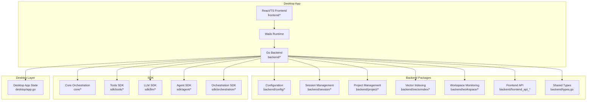
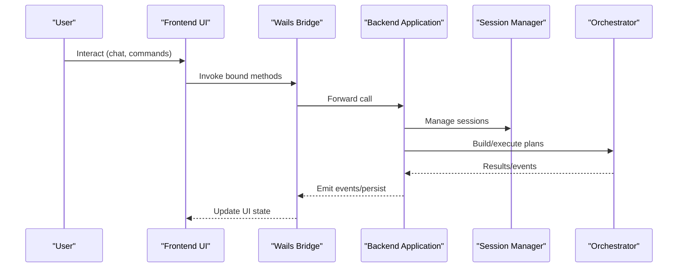
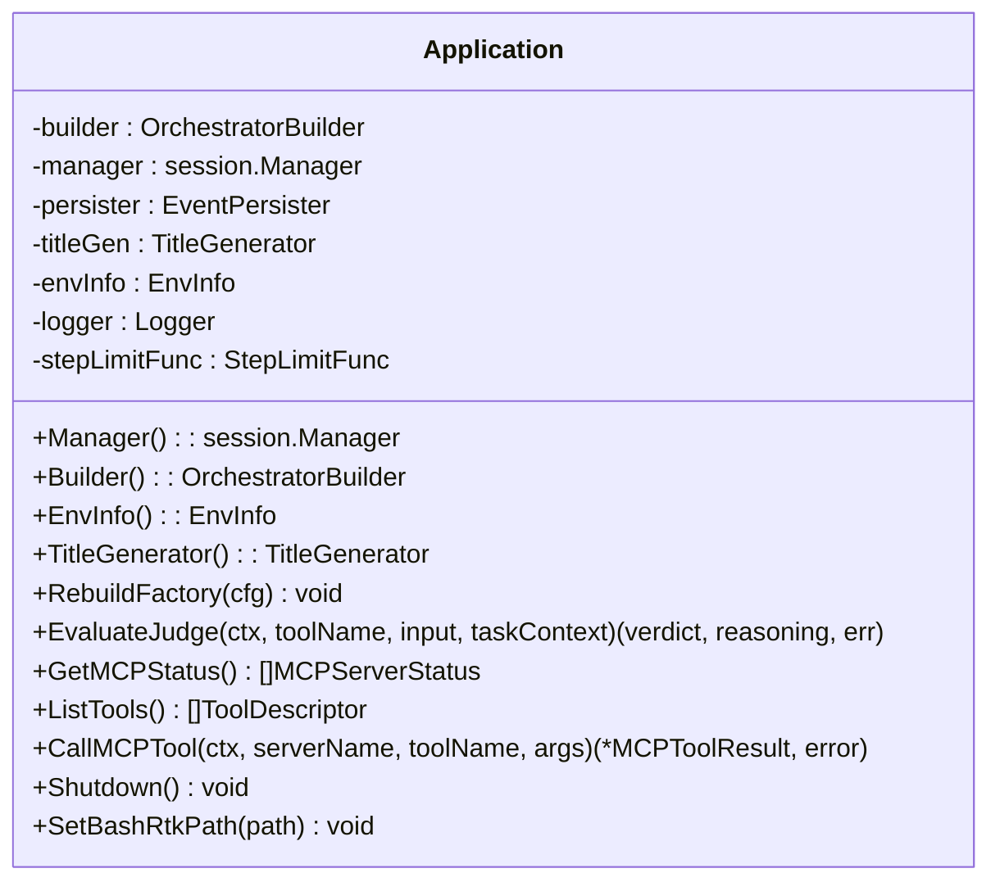
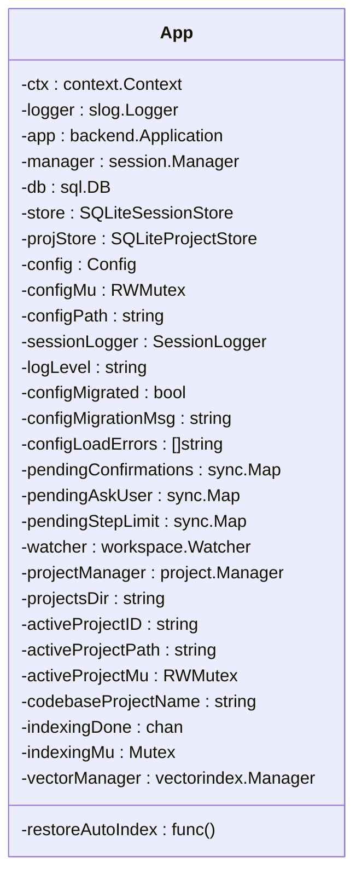
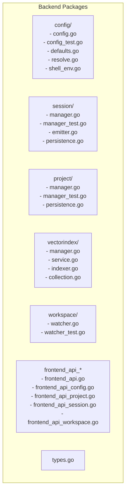
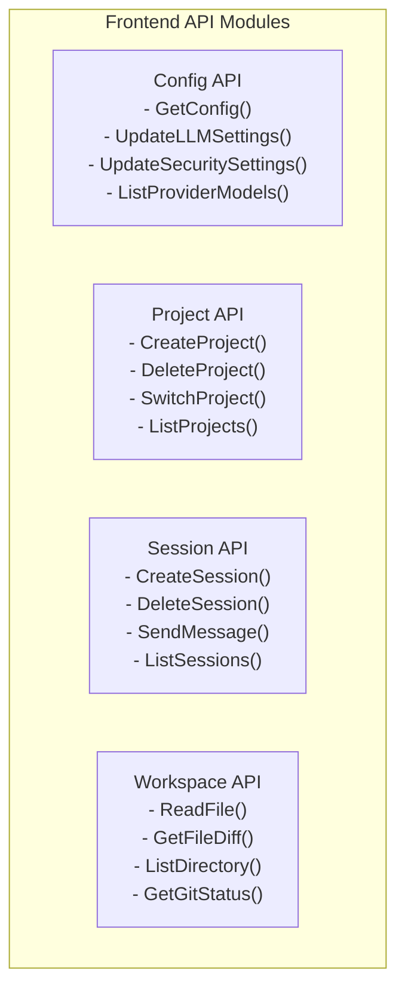
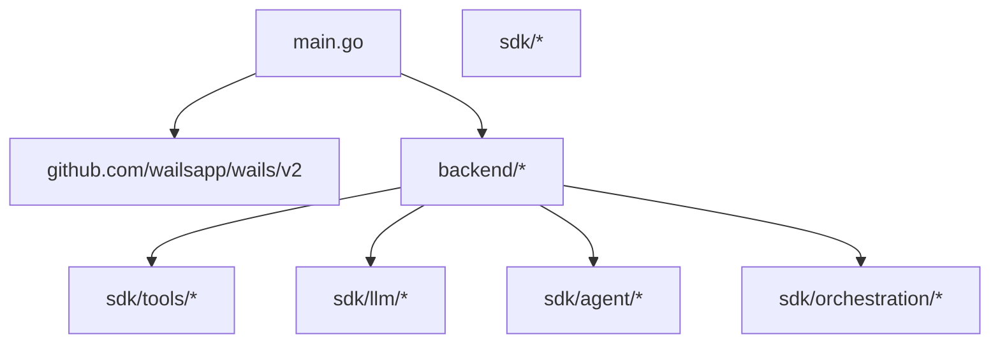

# Development and Testing

<cite>
**Referenced Files in This Document**
- [Makefile](file://Makefile)
- [go.mod](file://go.mod)
- [main.go](file://main.go)
- [wails.json](file://wails.json)
- [frontend/package.json](file://frontend/package.json)
- [.golangci.yml](file://.golangci.yml)
- [backend/application.go](file://backend/application.go)
- [backend/types.go](file://backend/types.go)
- [backend/frontend_api.go](file://backend/frontend_api.go)
- [backend/frontend_api_config.go](file://backend/frontend_api_config.go)
- [backend/frontend_api_project.go](file://backend/frontend_api_project.go)
- [backend/frontend_api_session.go](file://backend/frontend_api_session.go)
- [backend/frontend_api_workspace.go](file://backend/frontend_api_workspace.go)
- [backend/config/config.go](file://backend/config/config.go)
- [backend/config/config_test.go](file://backend/config/config_test.go)
- [backend/session/manager.go](file://backend/session/manager.go)
- [backend/session/manager_test.go](file://backend/session/manager_test.go)
- [backend/project/manager.go](file://backend/project/manager.go)
- [backend/vectorindex/manager.go](file://backend/vectorindex/manager.go)
- [backend/workspace/watcher.go](file://backend/workspace/watcher.go)
- [desktop/app.go](file://desktop/app.go)
- [frontend/vitest.config.ts](file://frontend/vitest.config.ts)
- [frontend/eslint.config.js](file://frontend/eslint.config.js)
- [frontend/tsconfig.json](file://frontend/tsconfig.json)
- [frontend/vite.config.ts](file://frontend/vite.config.ts)
- [frontend/src/lib/chatUtils.test.ts](file://frontend/src/lib/chatUtils.test.ts)
- [frontend/src/stores/chatStore.test.ts](file://frontend/src/stores/chatStore.test.ts)
- [sdk/orchestration/orchestrator_test.go](file://sdk/orchestration/orchestrator_test.go)
- [sdk/tools/tool_test.go](file://sdk/tools/tool_test.go)
- [backend/frontend_api_project_test.go](file://backend/frontend_api_project_test.go)
- [backend/frontend_api_workspace_test.go](file://backend/frontend_api_workspace_test.go)
- [core/testhelpers_test.go](file://core/testhelpers_test.go)
</cite>

## Update Summary
**Changes Made**
- Updated backend package structure documentation to reflect new modular organization
- Enhanced testing patterns section with new backend package testing examples
- Added comprehensive coverage of new frontend API modules (config, project, session, workspace)
- Updated development workflow to include new backend package testing strategies
- Expanded testing documentation with specific examples from new backend modules
- Removed Wails-related testing infrastructure references and updated testing framework focus

## Table of Contents
1. [Introduction](#introduction)
2. [Project Structure](#project-structure)
3. [Core Components](#core-components)
4. [Architecture Overview](#architecture-overview)
5. [Detailed Component Analysis](#detailed-component-analysis)
6. [Backend Package Structure](#backend-package-structure)
7. [Frontend API Modules](#frontend-api-modules)
8. [Dependency Analysis](#dependency-analysis)
9. [Performance Considerations](#performance-considerations)
10. [Testing Strategy](#testing-strategy)
11. [Build System and Cross-Platform Compilation](#build-system-and-cross-platform-compilation)
12. [Code Quality Standards and Static Analysis](#code-quality-standards-and-static-analysis)
13. [Debugging Techniques and Local Development Environment](#debugging-techniques-and-local-development-environment)
14. [Continuous Integration and Best Practices](#continuous-integration-and-best-practices)
15. [Troubleshooting Guide](#troubleshooting-guide)
16. [Conclusion](#conclusion)

## Introduction
This document provides comprehensive development and testing guidance for C0WRK. It covers the development workflow, code structure, contribution guidelines, testing strategy (unit, integration, and frontend), build system with Makefile and Wails, cross-platform compilation, asset embedding, code quality standards, linting, static analysis, debugging techniques, local environment setup, CI processes, performance testing, and practical troubleshooting.

**Updated** Enhanced to reflect the new backend package structure with modular organization and updated testing patterns for the enhanced development workflow.

## Project Structure
C0WRK is a desktop application combining a Go backend with a React/TypeScript frontend. The backend is now organized into focused packages for configuration, session management, project management, vector indexing, and workspace monitoring. The frontend renders the UI and interacts with the backend via Wails bindings. Assets are embedded for distribution.

**Diagram sources**
- [main.go:18-44](file://main.go#L18-L44)
- [backend/application.go:43-133](file://backend/application.go#L43-L133)
- [desktop/app.go:18-73](file://desktop/app.go#L18-L73)

**Section sources**
- [main.go:18-44](file://main.go#L18-L44)
- [wails.json:1-13](file://wails.json#L1-13)

## Core Components
- Backend Application: Central orchestrator that composes the orchestrator builder, session manager, event persistence, and MCP gateway. It exposes APIs for UI interactions and manages environment info and token accounting.
- Desktop App: Wails application state holder that initializes backend services, manages configuration, logging, and workspace watchers.
- Frontend Stores and Utilities: Zustand stores for UI state, helpers for chat rendering, and TypeScript configuration for strictness and aliases.

Key responsibilities:
- Application initialization and lifecycle management
- Session orchestration and persistence
- Tool registry and MCP integration
- UI event emission and persistence
- Configuration loading and defaults

**Section sources**
- [backend/application.go:43-133](file://backend/application.go#L43-L133)
- [desktop/app.go:18-73](file://desktop/app.go#L18-L73)

## Architecture Overview
The desktop app embeds frontend assets and runs via Wails. The backend composes subsystems and exposes a unified interface to the desktop layer through modular packages.

**Diagram sources**
- [main.go:18-44](file://main.go#L18-L44)
- [backend/application.go:104-133](file://backend/application.go#L104-L133)

## Detailed Component Analysis

### Backend Application
The Application struct aggregates:
- OrchestratorBuilder for tool registry, gateway, router, and judge
- Session Manager for lifecycle and persistence
- Event Persister for session logs
- Title Generator for session summaries

It exposes:
- Factory rebuild on config changes
- Judge evaluation
- MCP server status and tool invocation
- Shutdown routine

**Diagram sources**
- [backend/application.go:43-250](file://backend/application.go#L43-L250)

**Section sources**
- [backend/application.go:65-133](file://backend/application.go#L65-L133)
- [backend/application.go:155-250](file://backend/application.go#L155-L250)

### Desktop App State
The desktop App holds:
- Context, logger, and database connection
- Session and project stores
- Active project state and watcher
- Vector index manager
- Pending user confirmations and ask-user requests

**Diagram sources**
- [desktop/app.go:18-73](file://desktop/app.go#L18-L73)

**Section sources**
- [desktop/app.go:18-73](file://desktop/app.go#L18-L73)

### Frontend Testing Setup
Vitest is configured with:
- Path alias @ -> src
- Node environment
- Test pattern src/**/*.test.ts
- Pass with no tests

TypeScript strictness and ESLint rules enforce code quality.

**Section sources**
- [frontend/vitest.config.ts:1-16](file://frontend/vitest.config.ts#L1-L16)
- [frontend/tsconfig.json:1-27](file://frontend/tsconfig.json#L1-L27)
- [frontend/eslint.config.js:1-31](file://frontend/eslint.config.js#L1-L31)

## Backend Package Structure
The backend is now organized into focused, modular packages that handle specific concerns:

### Configuration Package
Handles configuration loading, validation, and persistence with support for environment variable expansion and YAML serialization.

### Session Management Package  
Manages multiple agent sessions with orchestrator factories, event emission, and persistence integration.

### Project Management Package
Provides high-level project lifecycle operations including creation, deletion, and workspace management.

### Vector Indexing Package
Owns the full lifecycle of vector indexing including embedder creation, service management, and git monitoring.

### Workspace Monitoring Package
Handles file system monitoring with debounced event handling and git integration.

### Frontend API Package
Exposes backend functionality to the Wails frontend through typed API methods.

**Diagram sources**
- [backend/config/config.go:1-408](file://backend/config/config.go#L1-L408)
- [backend/session/manager.go:1-800](file://backend/session/manager.go#L1-L800)
- [backend/project/manager.go:1-127](file://backend/project/manager.go#L1-L127)
- [backend/vectorindex/manager.go:1-280](file://backend/vectorindex/manager.go#L1-L280)
- [backend/workspace/watcher.go:1-174](file://backend/workspace/watcher.go#L1-L174)

**Section sources**
- [backend/config/config.go:1-408](file://backend/config/config.go#L1-L408)
- [backend/session/manager.go:1-800](file://backend/session/manager.go#L1-L800)
- [backend/project/manager.go:1-127](file://backend/project/manager.go#L1-L127)
- [backend/vectorindex/manager.go:1-280](file://backend/vectorindex/manager.go#L1-L280)
- [backend/workspace/watcher.go:1-174](file://backend/workspace/watcher.go#L1-L174)

## Frontend API Modules
The frontend API is organized into specialized modules that expose backend functionality:

### Configuration API Module
Handles runtime configuration updates, security settings, and provider model listing.

### Project API Module  
Manages project lifecycle operations including creation, deletion, switching, and codebase indexing integration.

### Session API Module
Provides session management operations including creation, deletion, messaging, and task control.

### Workspace API Module
Offers file system operations, git integration, and directory navigation capabilities.

**Diagram sources**
- [backend/frontend_api_config.go:15-317](file://backend/frontend_api_config.go#L15-L317)
- [backend/frontend_api_project.go:24-320](file://backend/frontend_api_project.go#L24-L320)
- [backend/frontend_api_session.go:11-185](file://backend/frontend_api_session.go#L11-L185)
- [backend/frontend_api_workspace.go:18-470](file://backend/frontend_api_workspace.go#L18-L470)

**Section sources**
- [backend/frontend_api_config.go:15-317](file://backend/frontend_api_config.go#L15-L317)
- [backend/frontend_api_project.go:24-320](file://backend/frontend_api_project.go#L24-L320)
- [backend/frontend_api_session.go:11-185](file://backend/frontend_api_session.go#L11-L185)
- [backend/frontend_api_workspace.go:18-470](file://backend/frontend_api_workspace.go#L18-L470)

## Dependency Analysis
The Go module declares external dependencies for LLM providers, MCP, SQLite, and other libraries. The desktop app embeds frontend assets and runs via Wails.

**Diagram sources**
- [go.mod:1-119](file://go.mod#L1-L119)
- [main.go:18-44](file://main.go#L18-L44)

**Section sources**
- [go.mod:1-119](file://go.mod#L1-L119)

## Performance Considerations
- Token accounting and context compaction are integrated in the orchestration layer to prevent prompt overflow.
- File change tracking and rollback minimize side effects during retries.
- Embedding model and ONNX runtime are cached and bundled to reduce startup overhead.
- Debounced file system events reduce unnecessary processing during rapid file changes.

## Testing Strategy
C0WRK employs a layered testing approach with enhanced backend package organization:

### Backend Unit Tests
- **Configuration Tests**: Validate YAML parsing, environment variable expansion, and MCP server configuration
- **Session Management Tests**: Test orchestrator factory creation, event emission, and persistence integration
- **Project Management Tests**: Verify project lifecycle operations and workspace management
- **Vector Indexing Tests**: Validate embedder creation, service management, and git monitoring
- **Workspace Monitoring Tests**: Test file system event handling and debouncing

### Frontend API Tests
- **Project API Tests**: Mock external dependencies (MCP, exec commands) to test complex workflows
- **Workspace API Tests**: Validate path resolution, git operations, and file diff generation
- **Configuration API Tests**: Test runtime configuration updates and validation

### SDK and Core Tests
- Validate tool policies, context managers, and orchestration flows
- Test frontend utilities for chat rendering and message processing

### Integration Tests
- Cover desktop and backend interactions via Wails bindings
- Test end-to-end workflows across all backend packages

Recommended practices:
- Use mocks for external dependencies (MCP, file system, git)
- Test error conditions and edge cases thoroughly
- Validate side effects (emitter events, persisted state) rather than implementation internals
- Test concurrent operations and race conditions

**Updated** Removed Wails-related testing infrastructure references and updated testing framework focus to emphasize new API testing patterns and event subscription system.

**Section sources**
- [backend/config/config_test.go:14-800](file://backend/config/config_test.go#L14-L800)
- [backend/session/manager_test.go:1-800](file://backend/session/manager_test.go#L1-L800)
- [backend/frontend_api_project_test.go:1-343](file://backend/frontend_api_project_test.go#L1-L343)
- [backend/frontend_api_workspace_test.go:1-262](file://backend/frontend_api_workspace_test.go#L1-L262)
- [sdk/orchestration/orchestrator_test.go:75-109](file://sdk/orchestration/orchestrator_test.go#L75-L109)
- [sdk/tools/tool_test.go:9-123](file://sdk/tools/tool_test.go#L9-L123)
- [frontend/src/lib/chatUtils.test.ts:32-207](file://frontend/src/lib/chatUtils.test.ts#L32-L207)
- [frontend/src/stores/chatStore.test.ts:17-341](file://frontend/src/stores/chatStore.test.ts#L17-L341)
- [core/testhelpers_test.go:16-343](file://core/testhelpers_test.go#L16-L343)

## Build System and Cross-Platform Compilation
The Makefile automates:
- Frontend dependency installation
- Wails build
- ONNX runtime fetching and embedding
- Embedding model download and caching
- Cleaning caches and build artifacts

Cross-platform support:
- Detects OS and architecture to select appropriate ONNX runtime binaries
- Bundles assets into the app bundle for macOS/Linux/Windows

Asset embedding:
- Frontend dist assets are embedded at runtime via Wails AssetServer

**Section sources**
- [Makefile:1-136](file://Makefile#L1-L136)
- [main.go:15-30](file://main.go#L15-L30)
- [wails.json:5-8](file://wails.json#L5-L8)

## Code Quality Standards and Static Analysis
Static analysis and linting:
- golangci-lint configured with core linters, error handling checks, code quality rules, and performance checks
- Frontend linting via ESLint with TypeScript rules and React hooks plugin

Frontend TypeScript strictness:
- Strict compiler options, unused locals/parameters, and DOM-related libs

**Section sources**
- [.golangci.yml:1-79](file://.golangci.yml#L1-L79)
- [frontend/eslint.config.js:1-31](file://frontend/eslint.config.js#L1-L31)
- [frontend/tsconfig.json:1-27](file://frontend/tsconfig.json#L1-L27)

## Debugging Techniques and Local Development Environment
Local development:
- Run frontend dev server and Wails desktop separately
- Enable inspector on startup via environment variable

Debugging tips:
- Use structured logging with slog
- Inspect emitted events and persisted session logs
- Leverage Vitest watch mode for frontend tests
- Test backend packages independently using Go test commands

**Section sources**
- [frontend/package.json:6-13](file://frontend/package.json#L6-L13)
- [main.go:36-39](file://main.go#L36-L39)

## Continuous Integration and Best Practices
CI pipeline recommendations:
- Run backend tests and golangci-lint for all packages
- Run frontend tests and lint
- Build and package desktop app for target platforms
- Cache ONNX runtime and embedding models between jobs

Best practices:
- Keep tests hermetic; avoid external network dependencies
- Snapshot UI components where appropriate
- Validate configuration parsing and defaults
- Test concurrent operations and error handling paths

## Troubleshooting Guide
Common issues and resolutions:
- Missing ONNX runtime or embedding models: Re-run the fetch targets in the Makefile
- Frontend dependencies not installed: Run frontend dependency install target
- Lint failures: Fix reported issues or adjust rules in configuration files
- Frontend test failures: Use Vitest watch mode to iterate quickly; ensure proper mocks and test data
- Backend package test failures: Run individual package tests with `go test ./backend/[package]`
- Configuration validation errors: Check YAML syntax and required fields
- Session management issues: Verify orchestrator factory and persistence configuration

**Section sources**
- [Makefile:50-136](file://Makefile#L50-L136)
- [frontend/package.json:6-13](file://frontend/package.json#L6-L13)
- [.golangci.yml:6-79](file://.golangci.yml#L6-L79)

## Conclusion
C0WRK's development and testing framework emphasizes modularity, strong typing, and robust tooling. The enhanced backend package structure provides clear separation of concerns with focused modules for configuration, session management, project operations, vector indexing, and workspace monitoring. The Makefile streamlines cross-platform builds and asset embedding, while golangci-lint and ESLint maintain code quality. Comprehensive unit and integration tests, combined with frontend Vitest suites and specialized backend package tests, ensure reliability across components. The new modular organization enables more maintainable development workflows and improved testing isolation for each backend component.