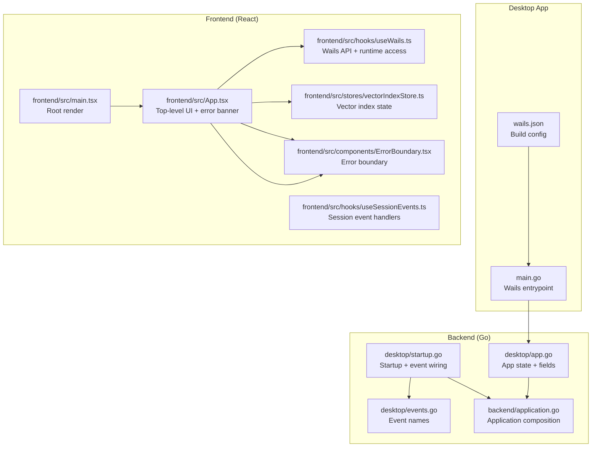
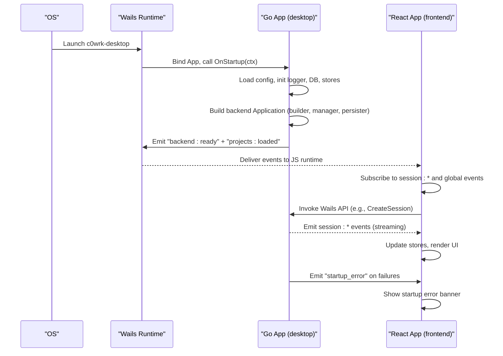
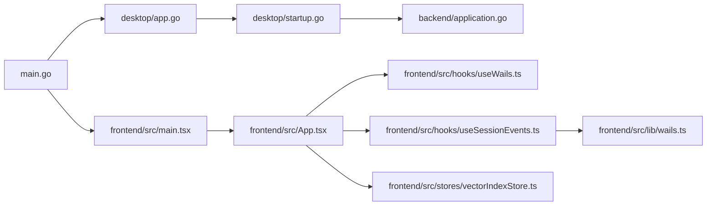

# Application Architecture

<cite>
**Referenced Files in This Document**
- [main.go](file://main.go)
- [wails.json](file://wails.json)
- [desktop/app.go](file://desktop/app.go)
- [desktop/startup.go](file://desktop/startup.go)
- [desktop/events.go](file://desktop/events.go)
- [frontend/src/main.tsx](file://frontend/src/main.tsx)
- [frontend/src/App.tsx](file://frontend/src/App.tsx)
- [frontend/src/hooks/useWails.ts](file://frontend/src/hooks/useWails.ts)
- [frontend/src/hooks/useSessionEvents.ts](file://frontend/src/hooks/useSessionEvents.ts)
- [frontend/src/components/ErrorBoundary.tsx](file://frontend/src/components/ErrorBoundary.tsx)
- [frontend/src/stores/vectorIndexStore.ts](file://frontend/src/stores/vectorIndexStore.ts)
- [frontend/src/lib/wails.ts](file://frontend/src/lib/wails.ts)
- [backend/application.go](file://backend/application.go)
</cite>

## Table of Contents
1. [Introduction](#introduction)
2. [Project Structure](#project-structure)
3. [Core Components](#core-components)
4. [Architecture Overview](#architecture-overview)
5. [Detailed Component Analysis](#detailed-component-analysis)
6. [Dependency Analysis](#dependency-analysis)
7. [Performance Considerations](#performance-considerations)
8. [Troubleshooting Guide](#troubleshooting-guide)
9. [Conclusion](#conclusion)

## Introduction
This document describes the architecture of the C0WRK React 19 desktop application powered by Wails. It explains the main App component structure, Wails integration via a custom React hook, event handling and streaming, startup error handling, vector index status monitoring, and real-time session event subscriptions. It also covers the backend initialization flow, error boundary implementation, and startup validation processes, with practical examples of event handling patterns and Wails API integration techniques.

## Project Structure
The application follows a layered structure:
- Frontend (React 19) lives under frontend/src and uses Wails-generated JS bindings.
- Backend (Go) lives under desktop and backend packages, exposing methods and emitting events to the frontend.
- Wails configuration defines the desktop app metadata and build pipeline.
- The main entry point initializes the Wails app and binds the Go backend.

**Diagram sources**
- [main.go:18-44](file://main.go#L18-L44)
- [wails.json:1-13](file://wails.json#L1-L13)
- [frontend/src/main.tsx:10-16](file://frontend/src/main.tsx#L10-L16)
- [frontend/src/App.tsx:21-88](file://frontend/src/App.tsx#L21-L88)
- [frontend/src/hooks/useWails.ts:51-60](file://frontend/src/hooks/useWails.ts#L51-L60)
- [frontend/src/hooks/useSessionEvents.ts:95-703](file://frontend/src/hooks/useSessionEvents.ts#L95-L703)
- [frontend/src/components/ErrorBoundary.tsx:13-47](file://frontend/src/components/ErrorBoundary.tsx#L13-L47)
- [frontend/src/stores/vectorIndexStore.ts:30-55](file://frontend/src/stores/vectorIndexStore.ts#L30-L55)
- [desktop/app.go:18-72](file://desktop/app.go#L18-L72)
- [desktop/startup.go:40-786](file://desktop/startup.go#L40-L786)
- [desktop/events.go:7-45](file://desktop/events.go#L7-L45)
- [backend/application.go:62-133](file://backend/application.go#L62-L133)

**Section sources**
- [main.go:18-44](file://main.go#L18-L44)
- [wails.json:1-13](file://wails.json#L1-L13)
- [frontend/src/main.tsx:10-16](file://frontend/src/main.tsx#L10-L16)
- [frontend/src/App.tsx:21-88](file://frontend/src/App.tsx#L21-L88)
- [frontend/src/hooks/useWails.ts:51-60](file://frontend/src/hooks/useWails.ts#L51-L60)
- [frontend/src/hooks/useSessionEvents.ts:95-703](file://frontend/src/hooks/useSessionEvents.ts#L95-L703)
- [frontend/src/components/ErrorBoundary.tsx:13-47](file://frontend/src/components/ErrorBoundary.tsx#L13-L47)
- [frontend/src/stores/vectorIndexStore.ts:30-55](file://frontend/src/stores/vectorIndexStore.ts#L30-L55)
- [desktop/app.go:18-72](file://desktop/app.go#L18-L72)
- [desktop/startup.go:40-786](file://desktop/startup.go#L40-L786)
- [desktop/events.go:7-45](file://desktop/events.go#L7-L45)
- [backend/application.go:62-133](file://backend/application.go#L62-L133)

## Core Components
- Wails integration via a React hook that safely exposes window.go and window.runtime to components.
- Top-level App component listens for startup errors and vector index status, rendering a transient banner and updating a Zustand store.
- ErrorBoundary wraps the root to gracefully handle React errors.
- Session event subscription hook wires per-session event streams and updates chat and panel stores.
- Backend App composes the orchestrator, session manager, persistence, and emits Wails events.

Key responsibilities:
- useWails: Provides typed access to Wails Go bindings and runtime event APIs.
- App: Subscribes to global startup and vector index events; renders banners and delegates to layout.
- ErrorBoundary: Captures React errors and displays a minimal fallback.
- useSessionEvents: Subscribes to session-scoped events and updates UI stores.
- desktop startup: Initializes backend subsystems, validates configuration, wires event handlers, and emits readiness.

**Section sources**
- [frontend/src/hooks/useWails.ts:51-60](file://frontend/src/hooks/useWails.ts#L51-L60)
- [frontend/src/App.tsx:21-88](file://frontend/src/App.tsx#L21-L88)
- [frontend/src/components/ErrorBoundary.tsx:13-47](file://frontend/src/components/ErrorBoundary.tsx#L13-L47)
- [frontend/src/hooks/useSessionEvents.ts:95-703](file://frontend/src/hooks/useSessionEvents.ts#L95-L703)
- [desktop/startup.go:40-786](file://desktop/startup.go#L40-L786)

## Architecture Overview
The app uses Wails to host a React frontend alongside a Go backend. The backend initializes logging, configuration, databases, stores, and the orchestrator. It emits events to the frontend and receives responses for interactive controls (confirmations, user input, step limits). The frontend subscribes to session-scoped and global events, updates stores, and renders UI.

**Diagram sources**
- [main.go:31-35](file://main.go#L31-L35)
- [desktop/startup.go:40-786](file://desktop/startup.go#L40-L786)
- [frontend/src/App.tsx:26-55](file://frontend/src/App.tsx#L26-L55)
- [frontend/src/hooks/useSessionEvents.ts:95-703](file://frontend/src/hooks/useSessionEvents.ts#L95-L703)

## Detailed Component Analysis

### Wails Integration and useWails Hook
The useWails hook encapsulates Wails runtime access and exposes:
- api: Typed Go methods bound to window.go.desktop.App (e.g., CreateSession, ListProjects, GetConfig).
- runtime: Typed EventsOn/EventsEmit helpers.
- isReady: Boolean indicating whether both api and runtime are available.

Implementation highlights:
- Uses useMemo to avoid recreating the object on every render.
- Guards against SSR by checking window presence.
- Declares global window interfaces for type safety.

Integration patterns:
- Components call useWails() to access api and runtime.
- API calls return Promises; errors propagate to UI or logs.
- Event subscriptions return unsubscribe functions for cleanup.

**Section sources**
- [frontend/src/hooks/useWails.ts:51-60](file://frontend/src/hooks/useWails.ts#L51-L60)
- [frontend/src/hooks/useWails.ts:8-49](file://frontend/src/hooks/useWails.ts#L8-L49)

### Top-Level App Component and Event Subscriptions
The App component:
- Uses useWails() to access runtime.
- Subscribes to "startup_error" to display a transient banner with message and error details.
- Subscribes to "vector_index:status" and updates a Zustand store with normalized status and progress.
- Renders AppLayout beneath banners.

Validation and typing:
- Validates event payloads with a type guard before updating state.
- Uses a dedicated Zustand store for vector index state.

Startup error banner UX:
- Dismissible with a click handler.
- Uses Lucide icons and destructive theme.

**Section sources**
- [frontend/src/App.tsx:21-88](file://frontend/src/App.tsx#L21-L88)
- [frontend/src/stores/vectorIndexStore.ts:30-55](file://frontend/src/stores/vectorIndexStore.ts#L30-L55)

### Error Boundary Implementation
The ErrorBoundary component:
- Captures React errors via getDerivedStateFromError.
- Logs error and stack to console in componentDidCatch.
- Renders a minimal fallback UI with error message and stack when an error occurs.

Usage:
- Wrapped around the App in main.tsx to prevent app crashes.

**Section sources**
- [frontend/src/components/ErrorBoundary.tsx:13-47](file://frontend/src/components/ErrorBoundary.tsx#L13-L47)
- [frontend/src/main.tsx:10-16](file://frontend/src/main.tsx#L10-L16)

### Session Event Subscription Pattern
The useSessionEvents hook:
- Accepts a sessionId and runtime.
- Subscribes to session:<sessionId>:<type> events.
- Validates payloads with type guards and updates chatStore, panelStore, and sessionStore accordingly.
- Handles streaming assistant chunks, tool calls/results, confirmations, ask_user prompts, step limits, retries, service/status messages, subagents, context fill, and completion/cancellation.

Patterns:
- Per-session subscription with cleanup on unmount.
- Uses backend-generated tool_call_id for precise correlation.
- Maintains activity status and UI state based on active session.

**Section sources**
- [frontend/src/hooks/useSessionEvents.ts:95-703](file://frontend/src/hooks/useSessionEvents.ts#L95-L703)
- [frontend/src/lib/wails.ts:32-205](file://frontend/src/lib/wails.ts#L32-L205)

### Backend Startup Flow and Event Wiring
The desktop App composes the backend Application and wires:
- Logger initialization and dynamic log level re-init.
- SQLite database setup with pragmas.
- Project and session stores.
- UI emit function that maps session events to Wails runtime events.
- Interactive callbacks: ask_user, tool confirmation, step limit.
- Vector search manager initialization and callback injection.
- Pre-loading projects and sessions for immediate UI updates.
- Validation of LLM provider configuration and emitting startup errors.
- Event listeners for frontend responses (confirmation, judge request, ask_user, step_limit).
- Codebase-memory MCP and RTK status checks and emits.
- Emits "backend:ready" after subsystems are initialized.

Cross-cutting concerns:
- Blocking codebase-memory MCP tools while indexing.
- Emitting "vector_index:status" for global monitoring.
- Emitting "session:*" events scoped by session ID.

**Section sources**
- [desktop/app.go:18-72](file://desktop/app.go#L18-L72)
- [desktop/startup.go:40-786](file://desktop/startup.go#L40-L786)
- [desktop/events.go:7-45](file://desktop/events.go#L7-L45)
- [backend/application.go:62-133](file://backend/application.go#L62-L133)

### Vector Index Status Monitoring
The frontend:
- Subscribes to "vector_index:status".
- Normalizes state to a union type and updates a Zustand store.
- The store exposes updateFromEvent and reset methods.

Backend:
- Emits "vector_index:status" events with state, progress, counts, current file, and branch.
- The store’s toStatus function maps unknown states to idle.

**Section sources**
- [frontend/src/App.tsx:37-55](file://frontend/src/App.tsx#L37-L55)
- [frontend/src/stores/vectorIndexStore.ts:23-28](file://frontend/src/stores/vectorIndexStore.ts#L23-L28)
- [frontend/src/stores/vectorIndexStore.ts:37-45](file://frontend/src/stores/vectorIndexStore.ts#L37-L45)
- [desktop/events.go:24-25](file://desktop/events.go#L24-L25)

### Real-Time Event Streaming and Cross-Platform Considerations
Real-time streaming:
- Assistant content arrives as chunks; the frontend either uses backend-accumulated content or appends deltas.
- Session events are scoped by session ID to avoid cross-session interference.

Cross-platform:
- Wails handles platform differences for packaging and runtime.
- The Go backend initializes environment variables and paths carefully to support macOS launch contexts.

**Section sources**
- [frontend/src/hooks/useSessionEvents.ts:441-470](file://frontend/src/hooks/useSessionEvents.ts#L441-L470)
- [desktop/startup.go:43-46](file://desktop/startup.go#L43-L46)

### Startup Error Handling Mechanism
The backend:
- Validates configuration and emits "startup_error" with structured payload on failures.
- Emits "startup_error" when backend application creation fails or when LLM provider is missing.

The frontend:
- Subscribes to "startup_error" and renders a dismissible banner with message and error details.

**Section sources**
- [desktop/startup.go:325-332](file://desktop/startup.go#L325-L332)
- [desktop/startup.go:427-434](file://desktop/startup.go#L427-L434)
- [frontend/src/App.tsx:26-35](file://frontend/src/App.tsx#L26-L35)

### Wails API Integration Techniques
Examples of integration patterns:
- Calling window.go.desktop.App methods (e.g., CreateSession, ListProjects) and handling responses.
- Using runtime.EventsOn to subscribe to named events and runtime.EventsEmit to send responses back to the backend.
- Returning unsubscribe functions from subscriptions to clean up on component unmount.

Type safety:
- Global window interfaces declare method signatures for type checking.
- Payload validation via type guards before state updates.

**Section sources**
- [frontend/src/hooks/useWails.ts:8-49](file://frontend/src/hooks/useWails.ts#L8-L49)
- [frontend/src/hooks/useWails.ts:51-60](file://frontend/src/hooks/useWails.ts#L51-L60)
- [frontend/src/hooks/useSessionEvents.ts:124-127](file://frontend/src/hooks/useSessionEvents.ts#L124-L127)

## Dependency Analysis
High-level dependencies:
- main.go binds the desktop App to Wails and sets startup/shutdown hooks.
- desktop/startup.go composes backend services and wires event handlers.
- frontend/src/App.tsx depends on useWails and vectorIndexStore.
- frontend/src/hooks/useSessionEvents.ts depends on useWails and multiple stores.
- backend/application.go constructs the orchestrator and session manager.

**Diagram sources**
- [main.go:31-35](file://main.go#L31-L35)
- [desktop/app.go:18-72](file://desktop/app.go#L18-L72)
- [desktop/startup.go:40-786](file://desktop/startup.go#L40-L786)
- [backend/application.go:62-133](file://backend/application.go#L62-L133)
- [frontend/src/main.tsx:10-16](file://frontend/src/main.tsx#L10-L16)
- [frontend/src/App.tsx:21-88](file://frontend/src/App.tsx#L21-L88)
- [frontend/src/hooks/useWails.ts:51-60](file://frontend/src/hooks/useWails.ts#L51-L60)
- [frontend/src/hooks/useSessionEvents.ts:95-703](file://frontend/src/hooks/useSessionEvents.ts#L95-L703)
- [frontend/src/stores/vectorIndexStore.ts:30-55](file://frontend/src/stores/vectorIndexStore.ts#L30-L55)
- [frontend/src/lib/wails.ts:32-205](file://frontend/src/lib/wails.ts#L32-L205)

**Section sources**
- [main.go:31-35](file://main.go#L31-L35)
- [desktop/startup.go:40-786](file://desktop/startup.go#L40-L786)
- [frontend/src/App.tsx:21-88](file://frontend/src/App.tsx#L21-L88)
- [frontend/src/hooks/useSessionEvents.ts:95-703](file://frontend/src/hooks/useSessionEvents.ts#L95-L703)

## Performance Considerations
- Event-driven UI updates: Prefer subscribing to targeted session events to minimize unnecessary re-renders.
- Payload validation: Use type guards to avoid expensive runtime checks inside render paths.
- Cleanup subscriptions: Always return and call unsubscribe functions to prevent memory leaks.
- Vector index store normalization: Keep state updates minimal and idempotent to reduce UI churn.
- Backend readiness: Emit "backend:ready" to coordinate UI transitions and avoid redundant queries.

## Troubleshooting Guide
Common issues and remedies:
- Startup errors:
  - Verify LLM provider configuration and credentials.
  - Check logs for "startup_error" event payloads emitted by the backend.
- Session events not appearing:
  - Ensure sessionId is set and runtime is available.
  - Confirm subscription to the correct session:<id>:<type> event.
- Vector index status not updating:
  - Verify "vector_index:status" emissions from backend.
  - Check Zustand store updateFromEvent is invoked with valid payload.
- Wails API calls failing:
  - Confirm useWails.isReady is true.
  - Validate window.go.desktop.App method signatures and parameters.

**Section sources**
- [desktop/startup.go:427-434](file://desktop/startup.go#L427-L434)
- [frontend/src/App.tsx:26-55](file://frontend/src/App.tsx#L26-L55)
- [frontend/src/hooks/useWails.ts:51-60](file://frontend/src/hooks/useWails.ts#L51-L60)
- [frontend/src/hooks/useSessionEvents.ts:95-703](file://frontend/src/hooks/useSessionEvents.ts#L95-L703)

## Conclusion
C0WRK’s architecture cleanly separates concerns between a React frontend and a Go backend, orchestrated by Wails. The frontend leverages typed Wails bindings, robust event subscriptions, and centralized stores to deliver a responsive, real-time experience. The backend performs comprehensive initialization, validation, and emits a rich stream of events that drive the UI. Together, these patterns provide a scalable foundation for agent-driven workflows with cross-platform compatibility.