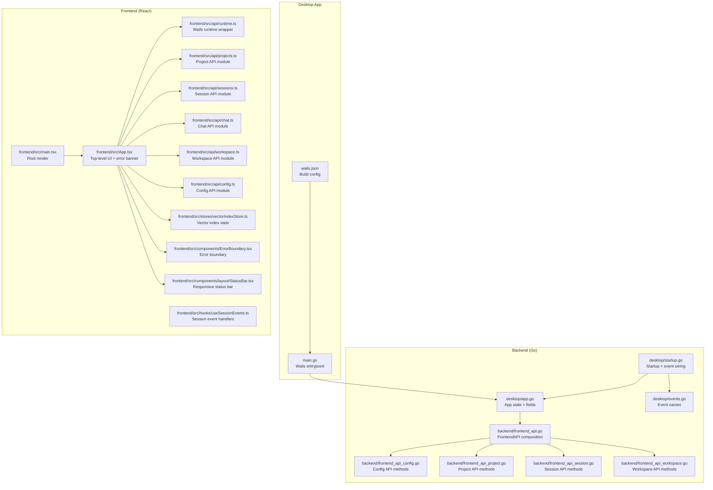
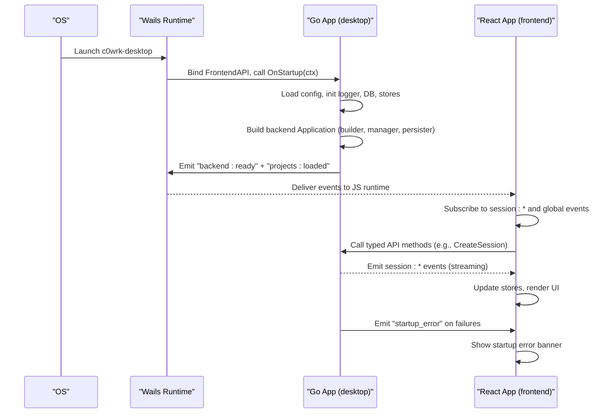
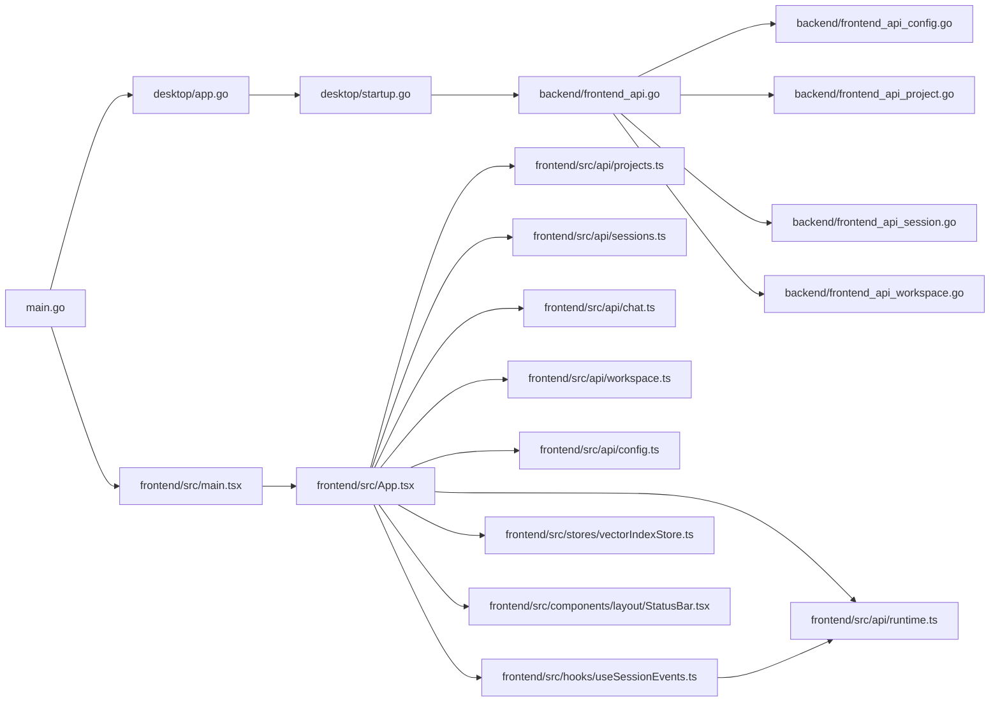

# Application Architecture

<cite>
**Referenced Files in This Document**
- [main.go](file://main.go)
- [wails.json](file://wails.json)
- [desktop/app.go](file://desktop/app.go)
- [desktop/startup.go](file://desktop/startup.go)
- [desktop/events.go](file://desktop/events.go)
- [frontend/src/main.tsx](file://frontend/src/main.tsx)
- [frontend/src/App.tsx](file://frontend/src/App.tsx)
- [frontend/src/api/runtime.ts](file://frontend/src/api/runtime.ts)
- [frontend/src/api/index.ts](file://frontend/src/api/index.ts)
- [frontend/src/api/projects.ts](file://frontend/src/api/projects.ts)
- [frontend/src/api/sessions.ts](file://frontend/src/api/sessions.ts)
- [frontend/src/api/chat.ts](file://frontend/src/api/chat.ts)
- [frontend/src/api/workspace.ts](file://frontend/src/api/workspace.ts)
- [frontend/src/api/config.ts](file://frontend/src/api/config.ts)
- [frontend/src/hooks/useSessionEvents.ts](file://frontend/src/hooks/useSessionEvents.ts)
- [frontend/src/components/ErrorBoundary.tsx](file://frontend/src/components/ErrorBoundary.tsx)
- [frontend/src/stores/vectorIndexStore.ts](file://frontend/src/stores/vectorIndexStore.ts)
- [frontend/src/components/layout/StatusBar.tsx](file://frontend/src/components/layout/StatusBar.tsx)
- [backend/frontend_api.go](file://backend/frontend_api.go)
- [backend/frontend_api_config.go](file://backend/frontend_api_config.go)
- [backend/frontend_api_project.go](file://backend/frontend_api_project.go)
- [backend/frontend_api_session.go](file://backend/frontend_api_session.go)
- [backend/frontend_api_workspace.go](file://backend/frontend_api_workspace.go)
</cite>

## Update Summary
**Changes Made**
- Updated workspace API documentation to reflect the removal of getSessionWorkspace function from frontend API module
- Enhanced StatusBar component documentation with responsive design features and text truncation patterns
- Updated workspace management interface documentation to highlight improved error handling and file operations
- Revised API type definitions to match current implementation
- Added documentation for responsive design patterns in UI components

## Table of Contents
1. [Introduction](#introduction)
2. [Project Structure](#project-structure)
3. [Core Components](#core-components)
4. [Architecture Overview](#architecture-overview)
5. [Detailed Component Analysis](#detailed-component-analysis)
6. [Dependency Analysis](#dependency-analysis)
7. [Performance Considerations](#performance-considerations)
8. [Troubleshooting Guide](#troubleshooting-guide)
9. [Conclusion](#conclusion)

## Introduction
This document describes the architecture of the C0WRK React 19 desktop application powered by Wails. It explains the main App component structure, Wails integration through typed API modules, event handling and streaming, startup error handling, vector index status monitoring, and real-time session event subscriptions. It also covers the backend initialization flow, error boundary implementation, and startup validation processes, with practical examples of event handling patterns and Wails API integration techniques.

**Updated** The architecture now focuses on typed Go methods bound to window.go.desktop.App through new API modules rather than direct useWails() hook usage. Recent improvements include workspace API simplification and responsive design enhancements for UI components.

## Project Structure
The application follows a layered structure:
- Frontend (React 19) lives under frontend/src and uses typed API modules for Wails integration.
- Backend (Go) lives under desktop and backend packages, exposing methods through FrontendAPI and emitting events to the frontend.
- Wails configuration defines the desktop app metadata and build pipeline.
- The main entry point initializes the Wails app and binds the Go backend.

**Diagram sources**
- [main.go:18-44](file://main.go#L18-L44)
- [wails.json:1-13](file://wails.json#L1-L13)
- [frontend/src/main.tsx:10-16](file://frontend/src/main.tsx#L10-L16)
- [frontend/src/App.tsx:21-88](file://frontend/src/App.tsx#L21-L88)
- [frontend/src/api/runtime.ts:1-45](file://frontend/src/api/runtime.ts#L1-L45)
- [frontend/src/api/index.ts:1-10](file://frontend/src/api/index.ts#L1-L10)
- [frontend/src/api/projects.ts:1-66](file://frontend/src/api/projects.ts#L1-L66)
- [frontend/src/api/sessions.ts:1-56](file://frontend/src/api/sessions.ts#L1-L56)
- [frontend/src/api/chat.ts:1-56](file://frontend/src/api/chat.ts#L1-L56)
- [frontend/src/api/workspace.ts:1-76](file://frontend/src/api/workspace.ts#L1-L76)
- [frontend/src/api/config.ts:1-79](file://frontend/src/api/config.ts#L1-L79)
- [frontend/src/hooks/useSessionEvents.ts:95-703](file://frontend/src/hooks/useSessionEvents.ts#L95-L703)
- [frontend/src/components/ErrorBoundary.tsx:13-47](file://frontend/src/components/ErrorBoundary.tsx#L13-L47)
- [frontend/src/stores/vectorIndexStore.ts:30-55](file://frontend/src/stores/vectorIndexStore.ts#L30-L55)
- [frontend/src/components/layout/StatusBar.tsx:1-101](file://frontend/src/components/layout/StatusBar.tsx#L1-L101)
- [backend/frontend_api.go:16-99](file://backend/frontend_api.go#L16-L99)
- [backend/frontend_api_config.go:15-317](file://backend/frontend_api_config.go#L15-L317)
- [backend/frontend_api_project.go:24-320](file://backend/frontend_api_project.go#L24-L320)
- [backend/frontend_api_session.go:11-185](file://backend/frontend_api_session.go#L11-L185)
- [backend/frontend_api_workspace.go:20-509](file://backend/frontend_api_workspace.go#L20-L509)
- [desktop/app.go:18-72](file://desktop/app.go#L18-L72)
- [desktop/startup.go:40-786](file://desktop/startup.go#L40-L786)
- [desktop/events.go:7-45](file://desktop/events.go#L7-L45)

**Section sources**
- [main.go:18-44](file://main.go#L18-L44)
- [wails.json:1-13](file://wails.json#L1-L13)
- [frontend/src/main.tsx:10-16](file://frontend/src/main.tsx#L10-L16)
- [frontend/src/App.tsx:21-88](file://frontend/src/App.tsx#L21-L88)
- [frontend/src/api/runtime.ts:1-45](file://frontend/src/api/runtime.ts#L1-L45)
- [frontend/src/api/index.ts:1-10](file://frontend/src/api/index.ts#L1-L10)
- [frontend/src/api/projects.ts:1-66](file://frontend/src/api/projects.ts#L1-L66)
- [frontend/src/api/sessions.ts:1-56](file://frontend/src/api/sessions.ts#L1-L56)
- [frontend/src/api/chat.ts:1-56](file://frontend/src/api/chat.ts#L1-L56)
- [frontend/src/api/workspace.ts:1-76](file://frontend/src/api/workspace.ts#L1-L76)
- [frontend/src/api/config.ts:1-79](file://frontend/src/api/config.ts#L1-L79)
- [frontend/src/hooks/useSessionEvents.ts:95-703](file://frontend/src/hooks/useSessionEvents.ts#L95-L703)
- [frontend/src/components/ErrorBoundary.tsx:13-47](file://frontend/src/components/ErrorBoundary.tsx#L13-L47)
- [frontend/src/stores/vectorIndexStore.ts:30-55](file://frontend/src/stores/vectorIndexStore.ts#L30-L55)
- [frontend/src/components/layout/StatusBar.tsx:1-101](file://frontend/src/components/layout/StatusBar.tsx#L1-L101)
- [backend/frontend_api.go:16-99](file://backend/frontend_api.go#L16-L99)
- [backend/frontend_api_config.go:15-317](file://backend/frontend_api_config.go#L15-L317)
- [backend/frontend_api_project.go:24-320](file://backend/frontend_api_project.go#L24-L320)
- [backend/frontend_api_session.go:11-185](file://backend/frontend_api_session.go#L11-L185)
- [backend/frontend_api_workspace.go:20-509](file://backend/frontend_api_workspace.go#L20-L509)
- [desktop/app.go:18-72](file://desktop/app.go#L18-L72)
- [desktop/startup.go:40-786](file://desktop/startup.go#L40-L786)
- [desktop/events.go:7-45](file://desktop/events.go#L7-L45)

## Core Components
- Typed API modules that provide structured access to Wails Go bindings through window.go.desktop.App.
- Top-level App component listens for startup errors and vector index status, rendering a transient banner and updating a Zustand store.
- ErrorBoundary wraps the root to gracefully handle React errors.
- Session event subscription hook wires per-session event streams and updates chat and panel stores.
- Backend FrontendAPI composes the orchestrator, session manager, persistence, and emits Wails events.
- Responsive StatusBar component with text truncation and overflow handling for optimal UI presentation.

Key responsibilities:
- API modules: Provide typed access to Wails Go bindings with proper error handling and logging.
- App: Subscribes to global startup and vector index events; renders banners and delegates to layout.
- ErrorBoundary: Captures React errors and displays a minimal fallback.
- useSessionEvents: Subscribes to session-scoped events and updates UI stores.
- FrontendAPI: Composes backend subsystems, validates configuration, wires event handlers, and emits readiness.
- StatusBar: Displays session information with responsive text handling and status indicators.

**Updated** The architecture now uses typed API modules instead of a generic useWails hook for better type safety and organization. The StatusBar component includes responsive design features for optimal text presentation.

**Section sources**
- [frontend/src/api/runtime.ts:1-45](file://frontend/src/api/runtime.ts#L1-L45)
- [frontend/src/App.tsx:21-88](file://frontend/src/App.tsx#L21-L88)
- [frontend/src/components/ErrorBoundary.tsx:13-47](file://frontend/src/components/ErrorBoundary.tsx#L13-L47)
- [frontend/src/hooks/useSessionEvents.ts:95-703](file://frontend/src/hooks/useSessionEvents.ts#L95-L703)
- [backend/frontend_api.go:16-99](file://backend/frontend_api.go#L16-L99)
- [frontend/src/components/layout/StatusBar.tsx:1-101](file://frontend/src/components/layout/StatusBar.tsx#L1-L101)

## Architecture Overview
The app uses Wails to host a React frontend alongside a Go backend. The backend initializes logging, configuration, databases, stores, and the orchestrator. It exposes methods through FrontendAPI that are bound to window.go.desktop.App and emits events to the frontend. The frontend consumes these methods through typed API modules and subscribes to session-scoped and global events, updates stores, and renders UI.

**Diagram sources**
- [main.go:31-35](file://main.go#L31-L35)
- [desktop/startup.go:40-786](file://desktop/startup.go#L40-L786)
- [frontend/src/App.tsx:26-55](file://frontend/src/App.tsx#L26-L55)
- [frontend/src/hooks/useSessionEvents.ts:95-703](file://frontend/src/hooks/useSessionEvents.ts#L95-L703)

## Detailed Component Analysis

### Typed API Modules and Runtime Wrapper
The API modules encapsulate Wails runtime access and expose:
- runtime: Typed getRuntime() and getApp() functions for accessing window.go.desktop.App.
- isWailsReady(): Boolean indicating whether Wails runtime is available.
- Individual API modules for different domains (projects, sessions, chat, workspace, config).

Implementation highlights:
- Uses global window interface extensions for type safety.
- Provides loose-typed getApp() that each API module casts appropriately.
- Centralized error handling with logging for all API calls.

Integration patterns:
- Components import specific API modules (e.g., projects, sessions) rather than using a generic hook.
- API calls return Promises; errors are caught and logged.
- Event subscriptions use centralized subscribe/emit functions.

**Updated** Replaced useWails hook with typed API modules for better organization and type safety.

**Section sources**
- [frontend/src/api/runtime.ts:1-45](file://frontend/src/api/runtime.ts#L1-L45)
- [frontend/src/api/index.ts:1-10](file://frontend/src/api/index.ts#L1-L10)

### Project Management API Module
The projects API module provides:
- createProject(name, externalPath?): Creates a new project with optional external path.
- deleteProject(id): Deletes a project and all its sessions.
- renameProject(id, name): Renames a project.
- listProjects(): Lists all projects sorted by activity.
- switchProject(id): Activates a project as the current workspace.
- pickDirectory(): Opens native directory picker.

Implementation highlights:
- Uses getApp() to access window.go.desktop.App methods.
- Implements comprehensive error handling with logging.
- Supports both internal and external project workspaces.

**Section sources**
- [frontend/src/api/projects.ts:1-66](file://frontend/src/api/projects.ts#L1-L66)

### Session Management API Module
The sessions API module provides:
- createSession(): Creates a new agent session within the active project.
- deleteSession(id): Removes a session.
- listSessions(): Returns sessions for the active project.
- renameSession(id, name): Changes session name.
- archiveSession(id): Archives/unarchives a session.

Implementation highlights:
- Integrates with backend session manager through FrontendAPI.
- Handles both in-memory and persisted session states.
- Provides best-effort persistence with error logging.

**Section sources**
- [frontend/src/api/sessions.ts:1-56](file://frontend/src/api/sessions.ts#L1-L56)

### Chat and Task API Module
The chat API module provides:
- sendMessage(sessionId, text): Sends a user message to a session.
- cancelTask(sessionId): Cancels the running task in a session.
- getSessionHistory(sessionId): Returns chat history for a session.
- getSessionTokens(sessionId): Returns token usage statistics.
- resumeTask(sessionId): Resumes an interrupted task.

Implementation highlights:
- Always uses Plan&Execute mode for consistent behavior.
- Integrates with session persistence for message history.
- Supports token tracking and usage reporting.

**Section sources**
- [frontend/src/api/chat.ts:1-56](file://frontend/src/api/chat.ts#L1-L56)

### Workspace API Module
The workspace API module provides:
- listDirectory(path, recursive): Lists directory contents with sorting and filtering.
- getGitStatus(path): Returns git status for files in the workspace.
- watchDirectory(path): Adds a directory to the file watcher.
- unwatchDirectory(path): Removes a directory from the file watcher.
- readFile(filePath): Reads file content with security validation.
- getFileDiff(filePath): Returns unified diff for file changes.
- getFileIcon(filePath): Returns Nerd Font icon and color for file paths.

**Updated** The workspace API has been simplified and enhanced with improved error handling and security validation. The getSessionWorkspace function has been removed from the frontend API module as workspace management is now handled through the active project context.

Implementation highlights:
- Implements comprehensive path validation and security checks.
- Handles both flat and recursive directory listing.
- Provides git integration for status and diff operations.
- Supports file icon resolution with Nerd Fonts.
- Enhanced error handling with detailed logging for all operations.

**Section sources**
- [frontend/src/api/workspace.ts:1-76](file://frontend/src/api/workspace.ts#L1-L76)

### Configuration API Module
The config API module provides:
- getConfig(): Returns sanitized configuration without raw API keys.
- getSecuritySettings(): Returns current security settings for the UI.
- updateSecuritySettings(settings): Updates security settings at runtime.
- updateLLMSettings(settings): Updates LLM provider and model settings.
- updateSearchSettings(settings): Updates search configuration.
- getLogLevel(): Returns current log level.
- setLogLevel(level): Sets log level dynamically.

Implementation highlights:
- Masks API keys for display safety.
- Validates settings before applying changes.
- Rebuilds backend components (judge, router, search tools) on configuration changes.
- Persists configuration changes to disk.

**Section sources**
- [frontend/src/api/config.ts:1-79](file://frontend/src/api/config.ts#L1-L79)

### Top-Level App Component and Event Subscriptions
The App component:
- Uses runtime.subscribe() to access Wails runtime events.
- Subscribes to "startup_error" to display a transient banner with message and error details.
- Subscribes to "vector_index:status" and updates a Zustand store with normalized status and progress.
- Renders AppLayout beneath banners.

Validation and typing:
- Validates event payloads with a type guard before updating state.
- Uses a dedicated Zustand store for vector index state.

Startup error banner UX:
- Dismissible with a click handler.
- Uses Lucide icons and destructive theme.

**Section sources**
- [frontend/src/App.tsx:21-88](file://frontend/src/App.tsx#L21-L88)
- [frontend/src/stores/vectorIndexStore.ts:30-55](file://frontend/src/stores/vectorIndexStore.ts#L30-L55)

### Error Boundary Implementation
The ErrorBoundary component:
- Captures React errors via getDerivedStateFromError.
- Logs error and stack to console in componentDidCatch.
- Renders a minimal fallback UI with error message and stack when an error occurs.

Usage:
- Wrapped around the App in main.tsx to prevent app crashes.

**Section sources**
- [frontend/src/components/ErrorBoundary.tsx:13-47](file://frontend/src/components/ErrorBoundary.tsx#L13-L47)
- [frontend/src/main.tsx:10-16](file://frontend/src/main.tsx#L10-L16)

### Session Event Subscription Pattern
The useSessionEvents hook:
- Accepts a sessionId and runtime.
- Subscribes to session:<sessionId>:<type> events.
- Validates payloads with type guards and updates chatStore, panelStore, and sessionStore accordingly.
- Handles streaming assistant chunks, tool calls/results, confirmations, ask_user prompts, step limits, retries, service/status messages, subagents, context fill, and completion/cancellation.

Patterns:
- Per-session subscription with cleanup on unmount.
- Uses backend-generated tool_call_id for precise correlation.
- Maintains activity status and UI state based on active session.

**Section sources**
- [frontend/src/hooks/useSessionEvents.ts:95-703](file://frontend/src/hooks/useSessionEvents.ts#L95-L703)

### Backend FrontendAPI and Event Wiring
The FrontendAPI composes the backend Application and wires:
- Logger initialization and dynamic log level re-init.
- SQLite database setup with pragmas.
- Project and session stores.
- UI emit function that maps session events to Wails runtime events.
- Interactive callbacks: ask_user, tool confirmation, step limit.
- Vector search manager initialization and callback injection.
- Pre-loading projects and sessions for immediate UI updates.
- Validation of LLM provider configuration and emitting startup errors.
- Event listeners for frontend responses (confirmation, judge request, ask_user, step_limit).
- Codebase-memory MCP and RTK status checks and emits.
- Emits "backend:ready" after subsystems are initialized.

Cross-cutting concerns:
- Blocking codebase-memory MCP tools while indexing.
- Emitting "vector_index:status" for global monitoring.
- Emitting "session:*" events scoped by session ID.

**Section sources**
- [backend/frontend_api.go:16-99](file://backend/frontend_api.go#L16-L99)
- [backend/frontend_api_config.go:15-317](file://backend/frontend_api_config.go#L15-L317)
- [backend/frontend_api_project.go:24-320](file://backend/frontend_api_project.go#L24-L320)
- [backend/frontend_api_session.go:11-185](file://backend/frontend_api_session.go#L11-L185)
- [backend/frontend_api_workspace.go:20-509](file://backend/frontend_api_workspace.go#L20-L509)
- [desktop/app.go:18-72](file://desktop/app.go#L18-L72)
- [desktop/startup.go:40-786](file://desktop/startup.go#L40-L786)
- [desktop/events.go:7-45](file://desktop/events.go#L7-L45)

### Vector Index Status Monitoring
The frontend:
- Subscribes to "vector_index:status".
- Normalizes state to a union type and updates a Zustand store.
- The store exposes updateFromEvent and reset methods.

Backend:
- Emits "vector_index:status" events with state, progress, counts, current file, and branch.
- The store's toStatus function maps unknown states to idle.

**Section sources**
- [frontend/src/App.tsx:37-55](file://frontend/src/App.tsx#L37-L55)
- [frontend/src/stores/vectorIndexStore.ts:23-28](file://frontend/src/stores/vectorIndexStore.ts#L23-L28)
- [frontend/src/stores/vectorIndexStore.ts:37-45](file://frontend/src/stores/vectorIndexStore.ts#L37-L45)
- [desktop/events.go:24-25](file://desktop/events.go#L24-L25)

### Real-Time Event Streaming and Cross-Platform Considerations
Real-time streaming:
- Assistant content arrives as chunks; the frontend either uses backend-accumulated content or appends deltas.
- Session events are scoped by session ID to avoid cross-session interference.

Cross-platform:
- Wails handles platform differences for packaging and runtime.
- The Go backend initializes environment variables and paths carefully to support macOS launch contexts.

**Section sources**
- [frontend/src/hooks/useSessionEvents.ts:441-470](file://frontend/src/hooks/useSessionEvents.ts#L441-L470)
- [desktop/startup.go:43-46](file://desktop/startup.go#L43-L46)

### Startup Error Handling Mechanism
The backend:
- Validates configuration and emits "startup_error" with structured payload on failures.
- Emits "startup_error" when backend application creation fails or when LLM provider is missing.

The frontend:
- Subscribes to "startup_error" and renders a dismissible banner with message and error details.

**Section sources**
- [desktop/startup.go:325-332](file://desktop/startup.go#L325-L332)
- [desktop/startup.go:427-434](file://desktop/startup.go#L427-L434)
- [frontend/src/App.tsx:26-35](file://frontend/src/App.tsx#L26-L35)

### Responsive StatusBar Component
The StatusBar component provides a responsive status bar with:
- Text truncation using `min-w-0` and `truncate` classes for long session names and domain labels.
- Flexible spacing with `gap-0.5` and `flex-1` spacer for optimal layout.
- Status indicators with `shrink-0` to prevent text compression.
- Badge components with responsive sizing using `h-5` and `text-[10px]` classes.
- Overflow handling with `overflow-hidden` on the main container.

Responsive design features:
- Uses `min-w-0` to allow text to shrink below its minimum content size.
- Implements `truncate` for text overflow control.
- Utilizes `flex-1` spacer for automatic width distribution.
- Responsive badge sizing with `max-w-full` and `truncate` for domain labels.

**Section sources**
- [frontend/src/components/layout/StatusBar.tsx:1-101](file://frontend/src/components/layout/StatusBar.tsx#L1-L101)

### Typed API Integration Techniques
Examples of integration patterns:
- Importing specific API modules (projects, sessions, chat, workspace, config).
- Using getApp() to access window.go.desktop.App methods with proper error handling.
- Using runtime.subscribe() to subscribe to named events and runtime.emit() to send responses back to the backend.
- Returning unsubscribe functions from subscriptions to clean up on component unmount.

Type safety:
- Global window interfaces declare method signatures for type checking.
- Payload validation via type guards before state updates.
- Module-based organization improves discoverability and IDE support.

**Updated** Replaced useWails hook usage with typed API modules for better type safety and organization.

**Section sources**
- [frontend/src/api/runtime.ts:1-45](file://frontend/src/api/runtime.ts#L1-L45)
- [frontend/src/api/index.ts:1-10](file://frontend/src/api/index.ts#L1-L10)
- [frontend/src/hooks/useSessionEvents.ts:124-127](file://frontend/src/hooks/useSessionEvents.ts#L124-L127)

## Dependency Analysis
High-level dependencies:
- main.go binds the FrontendAPI to Wails and sets startup/shutdown hooks.
- desktop/startup.go composes backend services and wires event handlers.
- frontend/src/App.tsx depends on runtime.subscribe and vectorIndexStore.
- frontend/src/hooks/useSessionEvents.ts depends on runtime.subscribe and multiple stores.
- FrontendAPI modules provide typed access to backend functionality.
- frontend/src/components/layout/StatusBar.tsx depends on multiple store modules for status display.

**Updated** Dependencies now flow through typed API modules instead of useWails hook, with enhanced workspace management and responsive UI components.

**Diagram sources**
- [main.go:31-35](file://main.go#L31-L35)
- [desktop/app.go:18-72](file://desktop/app.go#L18-L72)
- [desktop/startup.go:40-786](file://desktop/startup.go#L40-L786)
- [backend/frontend_api.go:16-99](file://backend/frontend_api.go#L16-L99)
- [backend/frontend_api_config.go:15-317](file://backend/frontend_api_config.go#L15-L317)
- [backend/frontend_api_project.go:24-320](file://backend/frontend_api_project.go#L24-L320)
- [backend/frontend_api_session.go:11-185](file://backend/frontend_api_session.go#L11-L185)
- [backend/frontend_api_workspace.go:20-509](file://backend/frontend_api_workspace.go#L20-L509)
- [frontend/src/main.tsx:10-16](file://frontend/src/main.tsx#L10-L16)
- [frontend/src/App.tsx:21-88](file://frontend/src/App.tsx#L21-L88)
- [frontend/src/api/runtime.ts:1-45](file://frontend/src/api/runtime.ts#L1-L45)
- [frontend/src/api/index.ts:1-10](file://frontend/src/api/index.ts#L1-L10)
- [frontend/src/hooks/useSessionEvents.ts:95-703](file://frontend/src/hooks/useSessionEvents.ts#L95-L703)
- [frontend/src/stores/vectorIndexStore.ts:30-55](file://frontend/src/stores/vectorIndexStore.ts#L30-L55)
- [frontend/src/components/layout/StatusBar.tsx:1-101](file://frontend/src/components/layout/StatusBar.tsx#L1-L101)

**Section sources**
- [main.go:31-35](file://main.go#L31-L35)
- [desktop/startup.go:40-786](file://desktop/startup.go#L40-L786)
- [frontend/src/App.tsx:21-88](file://frontend/src/App.tsx#L21-L88)
- [frontend/src/hooks/useSessionEvents.ts:95-703](file://frontend/src/hooks/useSessionEvents.ts#L95-L703)

## Performance Considerations
- Event-driven UI updates: Prefer subscribing to targeted session events to minimize unnecessary re-renders.
- Payload validation: Use type guards to avoid expensive runtime checks inside render paths.
- Cleanup subscriptions: Always return and call unsubscribe functions to prevent memory leaks.
- Vector index store normalization: Keep state updates minimal and idempotent to reduce UI churn.
- Backend readiness: Emit "backend:ready" to coordinate UI transitions and avoid redundant queries.
- API module caching: Consider caching API module instances to avoid repeated getApp() calls.
- Responsive UI optimization: Use CSS utilities like `min-w-0` and `truncate` to prevent layout thrashing during text overflow.
- Workspace API efficiency: Simplified workspace operations reduce unnecessary API calls and improve responsiveness.

**Updated** Added performance considerations for responsive UI components and workspace API optimizations.

## Troubleshooting Guide
Common issues and remedies:
- Startup errors:
  - Verify LLM provider configuration and credentials.
  - Check logs for "startup_error" event payloads emitted by the backend.
- Session events not appearing:
  - Ensure sessionId is set and runtime is available.
  - Confirm subscription to the correct session:<id>:<type> event.
- Vector index status not updating:
  - Verify "vector_index:status" emissions from backend.
  - Check Zustand store updateFromEvent is invoked with valid payload.
- API module calls failing:
  - Confirm isWailsReady() returns true.
  - Validate window.go.desktop.App method signatures and parameters.
  - Check that specific API modules are imported correctly.
- Workspace API errors:
  - Verify path validation and security checks are passing.
  - Check that workspace operations are performed within active project boundaries.
- Responsive UI issues:
  - Ensure CSS utilities like `min-w-0` and `truncate` are properly applied.
  - Verify text overflow handling for long session names and domain labels.

**Updated** Added troubleshooting guidance for workspace API failures and responsive UI issues.

**Section sources**
- [desktop/startup.go:427-434](file://desktop/startup.go#L427-L434)
- [frontend/src/App.tsx:26-55](file://frontend/src/App.tsx#L26-L55)
- [frontend/src/api/runtime.ts:21-24](file://frontend/src/api/runtime.ts#L21-L24)
- [frontend/src/hooks/useSessionEvents.ts:95-703](file://frontend/src/hooks/useSessionEvents.ts#L95-L703)
- [frontend/src/components/layout/StatusBar.tsx:30-98](file://frontend/src/components/layout/StatusBar.tsx#L30-L98)

## Conclusion
C0WRK's architecture cleanly separates concerns between a React frontend and a Go backend, orchestrated by Wails. The frontend leverages typed API modules for structured access to backend functionality, robust event subscriptions, and centralized stores to deliver a responsive, real-time experience. The backend performs comprehensive initialization, validation, and emits a rich stream of events that drive the UI. 

Recent improvements include workspace API simplification with enhanced error handling and security validation, and responsive design enhancements in the StatusBar component with text truncation and overflow handling. The new typed API module approach provides better type safety, organization, and developer experience compared to the previous useWails hook pattern. Together, these patterns provide a scalable foundation for agent-driven workflows with cross-platform compatibility and optimal user interface responsiveness.