# Build System

<cite>
**Referenced Files in This Document**
- [vite.config.ts](file://frontend/vite.config.ts)
- [package.json](file://frontend/package.json)
- [tsconfig.json](file://frontend/tsconfig.json)
- [tsconfig.app.json](file://frontend/tsconfig.app.json)
- [eslint.config.js](file://frontend/eslint.config.js)
- [components.json](file://frontend/components.json)
- [wails.json](file://wails.json)
- [index.html](file://frontend/index.html)
- [main.tsx](file://frontend/src/main.tsx)
- [App.tsx](file://frontend/src/App.tsx)
- [index.css](file://frontend/src/index.css)
- [utils.ts](file://frontend/src/lib/utils.ts)
- [runtime.ts](file://frontend/src/api/runtime.ts)
- [api/index.ts](file://frontend/src/api/index.ts)
- [vitest.config.ts](file://frontend/vitest.config.ts)
- [README.md](file://README.md)
- [package.json](file://frontend/wailsjs/runtime/package.json)
- [runtime.d.ts](file://frontend/wailsjs/runtime/runtime.d.ts)
- [runtime.js](file://frontend/wailsjs/runtime/runtime.js)
</cite>

## Update Summary
**Changes Made**
- Updated Wails integration section to reflect security improvements for runtime JavaScript bindings file permissions
- Enhanced security considerations for Wails runtime files with non-executable permissions (644) instead of executable (755)
- Added security best practices documentation for Wails runtime file management
- Updated troubleshooting guide to include security-related runtime issues

## Table of Contents
1. [Introduction](#introduction)
2. [Project Structure](#project-structure)
3. [Core Components](#core-components)
4. [Architecture Overview](#architecture-overview)
5. [Detailed Component Analysis](#detailed-component-analysis)
6. [Dependency Analysis](#dependency-analysis)
7. [Performance Considerations](#performance-considerations)
8. [Security Considerations](#security-considerations)
9. [Troubleshooting Guide](#troubleshooting-guide)
10. [Conclusion](#conclusion)
11. [Appendices](#appendices)

## Introduction
This document explains the frontend build system and development environment for C0WRK. It covers Vite configuration, TypeScript and ESLint setup, Tailwind CSS integration, Wails desktop integration, development server and hot reload, debugging tools, and production build preparation. The build system now features an API-driven architecture with improved performance optimizations, enhanced type safety, and strengthened security practices for Wails runtime file management.

## Project Structure
The frontend is organized under the frontend directory with the following build-related files:
- Vite configuration defines plugins, aliases, base path, and version constants
- Package scripts orchestrate dev, build, lint, preview, and test workflows
- TypeScript configurations enable strictness, module detection, and advanced type checking
- ESLint configuration uses flat config format with TypeScript ESLint integration
- Tailwind CSS integrates via plugin and theme tokens with custom design system
- Wails configuration connects the frontend build to the Go backend for desktop packaging
- API module structure provides typed runtime access and event handling
- Wails runtime files include security improvements with non-executable permissions

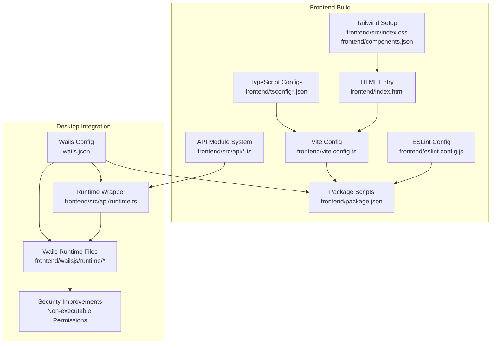

**Diagram sources**
- [vite.config.ts](file://frontend/vite.config.ts)
- [package.json](file://frontend/package.json)
- [tsconfig.json](file://frontend/tsconfig.json)
- [tsconfig.app.json](file://frontend/tsconfig.app.json)
- [eslint.config.js](file://frontend/eslint.config.js)
- [index.css](file://frontend/src/index.css)
- [components.json](file://frontend/components.json)
- [index.html](file://frontend/index.html)
- [wails.json](file://wails.json)
- [runtime.ts](file://frontend/src/api/runtime.ts)
- [api/index.ts](file://frontend/src/api/index.ts)
- [package.json](file://frontend/wailsjs/runtime/package.json)
- [runtime.d.ts](file://frontend/wailsjs/runtime/runtime.d.ts)
- [runtime.js](file://frontend/wailsjs/runtime/runtime.js)

**Section sources**
- [vite.config.ts](file://frontend/vite.config.ts)
- [package.json](file://frontend/package.json)
- [tsconfig.json](file://frontend/tsconfig.json)
- [tsconfig.app.json](file://frontend/tsconfig.app.json)
- [eslint.config.js](file://frontend/eslint.config.js)
- [index.css](file://frontend/src/index.css)
- [components.json](file://frontend/components.json)
- [index.html](file://frontend/index.html)
- [wails.json](file://wails.json)
- [runtime.ts](file://frontend/src/api/runtime.ts)
- [api/index.ts](file://frontend/src/api/index.ts)

## Core Components
- Vite configuration
  - Enables React and Tailwind CSS plugins with version constant injection
  - Sets alias @ to src for ergonomic imports
  - Uses relative base path for portability
  - Integrates with TypeScript compiler for type checking
- TypeScript configuration
  - Targets modern JS environments with ESNext modules
  - Enforces strict type checking, unused checks, and no unchecked side effects
  - Supports module detection and bundler resolution
  - Includes advanced strictness options for better type safety
- ESLint configuration
  - Uses flat config format with TypeScript ESLint integration
  - Enforces React Hooks rules and React Refresh best practices
  - Includes custom rules for unused variables and explicit any types
- Tailwind CSS integration
  - Imports Tailwind and Typography plugins with custom design system
  - Defines comprehensive theme tokens and custom utility classes
  - Uses shadcn/ui configuration for components and utilities
- Wails integration
  - Connects frontend build to Go backend for desktop packaging
  - Provides typed runtime access and event subscription
  - Supports session-scoped event handling with automatic prefixing
  - **Security Enhancement**: Wails runtime files now use non-executable permissions (644) for improved security
- API module system
  - Centralized runtime wrapper for Wails bindings
  - Typed event subscription and emission
  - Session-scoped event handling with automatic naming

**Section sources**
- [vite.config.ts](file://frontend/vite.config.ts)
- [package.json](file://frontend/package.json)
- [tsconfig.json](file://frontend/tsconfig.json)
- [tsconfig.app.json](file://frontend/tsconfig.app.json)
- [eslint.config.js](file://frontend/eslint.config.js)
- [index.css](file://frontend/src/index.css)
- [components.json](file://frontend/components.json)
- [wails.json](file://wails.json)
- [runtime.ts](file://frontend/src/api/runtime.ts)
- [api/index.ts](file://frontend/src/api/index.ts)

## Architecture Overview
The frontend build pipeline integrates Vite, React, Tailwind CSS, and TypeScript with an enhanced API-driven architecture. Wails bridges the frontend to the Go backend for desktop distribution. The development server serves assets with hot reload, while the production build optimizes resources and bundles. The new API module system provides centralized runtime access with improved type safety and event handling. **Security improvements** include non-executable permissions for Wails runtime files to prevent accidental execution.

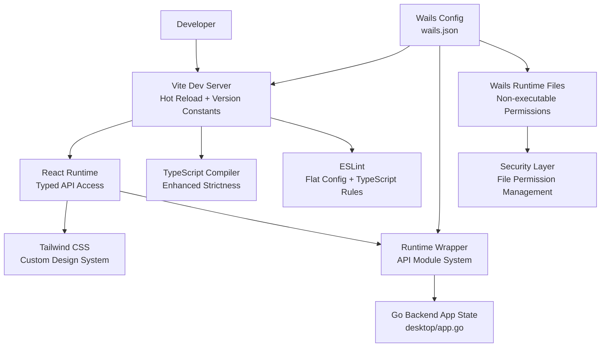

**Diagram sources**
- [vite.config.ts](file://frontend/vite.config.ts)
- [index.html](file://frontend/index.html)
- [main.tsx](file://frontend/src/main.tsx)
- [index.css](file://frontend/src/index.css)
- [wails.json](file://wails.json)
- [runtime.ts](file://frontend/src/api/runtime.ts)
- [app.go](file://desktop/app.go)
- [package.json](file://frontend/wailsjs/runtime/package.json)

## Detailed Component Analysis

### Vite Configuration
- Plugins
  - React plugin enables JSX transform and fast refresh
  - Tailwind CSS plugin processes CSS directives with custom design system
  - TypeScript compiler integration for type checking during build
- Aliasing
  - @ resolves to src for concise imports across the app
- Base path
  - Relative base ensures compatibility when served from subpaths
- Version constants
  - __APP_VERSION__ injected from package.json for build identification

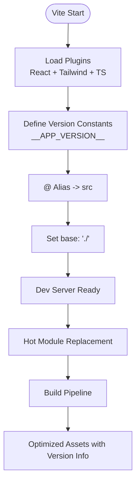

**Diagram sources**
- [vite.config.ts](file://frontend/vite.config.ts)

**Section sources**
- [vite.config.ts](file://frontend/vite.config.ts)

### TypeScript Configuration
- Strictness
  - Enables strict type checking, unused locals/parameters, and no fallthrough switches
  - Includes no unchecked side effect imports and indexed access checks
  - Enforces implicit returns and strict class field usage
- Module Resolution
  - Bundler resolution with extension support and ESNext modules
  - Module detection set to force for better type inference
  - Isolated modules for build-time type checking
- JSX and Paths
  - React JSX transform and path mapping for @ alias
  - No emit configuration for build-time type checking only

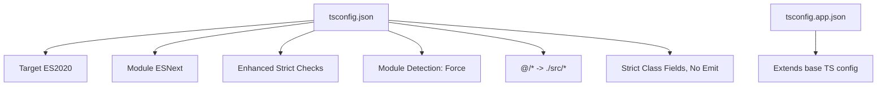

**Diagram sources**
- [tsconfig.json](file://frontend/tsconfig.json)
- [tsconfig.app.json](file://frontend/tsconfig.app.json)

**Section sources**
- [tsconfig.json](file://frontend/tsconfig.json)
- [tsconfig.app.json](file://frontend/tsconfig.app.json)

### ESLint Configuration
- Flat config format
  - Uses new flat config format with TypeScript ESLint integration
  - Extends recommended TS and React configs with proper ordering
- React Hooks and Refresh
  - Enforces exhaustive deps and restricts export components for refresh
  - Includes custom rules for unused variables with underscore pattern matching
- TypeScript-specific rules
  - Warns on explicit any types with error level for unused variables
  - Supports destructured array ignore patterns for clean code
- Ignored directories
  - Skips dist and generated wailsjs folders for clean linting

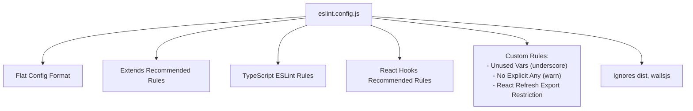

**Diagram sources**
- [eslint.config.js](file://frontend/eslint.config.js)

**Section sources**
- [eslint.config.js](file://frontend/eslint.config.js)

### Tailwind CSS Integration
- Plugins
  - Tailwind and Typography plugins imported in CSS with custom design system
- Theme tokens
  - Comprehensive design token system with One Dark theme
  - Custom color palette with semantic meanings and RGB variants
  - Border radius tokens for consistent spacing
- Utilities
  - Custom scrollbar utilities for cross-platform consistency
  - Diff line styling for file viewer with semantic colors
  - Prose overrides for markdown content with design system alignment
- shadcn/ui
  - Components and utilities configured with TSX and custom aliases
  - Tailwind CSS variables enabled for dynamic theming

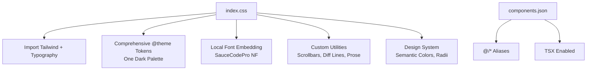

**Diagram sources**
- [index.css](file://frontend/src/index.css)
- [components.json](file://frontend/components.json)

**Section sources**
- [index.css](file://frontend/src/index.css)
- [components.json](file://frontend/components.json)

### Wails Integration
- Frontend build and dev commands
  - Wails delegates npm scripts for install, build, and dev watcher
- Runtime and API access
  - Runtime wrapper provides typed access to window.go and window.runtime
  - Centralized subscription and emission functions with error handling
- Event handling
  - Session-scoped event handling with automatic naming convention
  - Typed event maps for compile-time safety
- Backend state
  - Go App struct holds application state and exposes methods to the frontend
- **Security Enhancement**: Wails runtime files now use non-executable permissions (644) instead of executable (755) for improved security posture

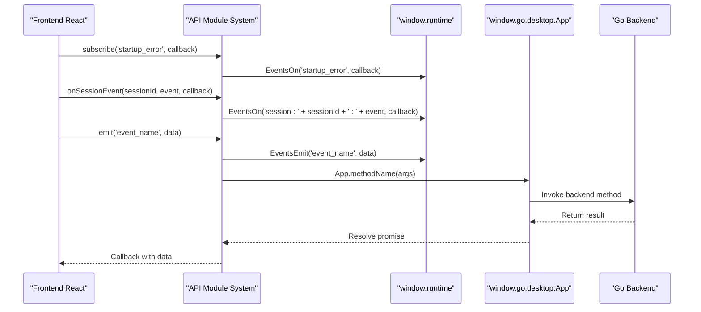

**Diagram sources**
- [runtime.ts](file://frontend/src/api/runtime.ts)
- [App.tsx](file://frontend/src/App.tsx)
- [api/index.ts](file://frontend/src/api/index.ts)

**Section sources**
- [wails.json](file://wails.json)
- [runtime.ts](file://frontend/src/api/runtime.ts)
- [api/index.ts](file://frontend/src/api/index.ts)
- [App.tsx](file://frontend/src/App.tsx)

### API Module System
- Centralized runtime access
  - Single entry point for all API modules via barrel export
  - Typed exports for projects, sessions, chat, workspace, config, and MCP
- Runtime wrapper benefits
  - Global window interface extension for type safety
  - Runtime availability checking and error handling
  - Centralized event subscription and emission
- Session-scoped events
  - Automatic event naming with session ID prefixing
  - Type-safe event maps for compile-time validation
  - Cleanup functions returned by subscription methods

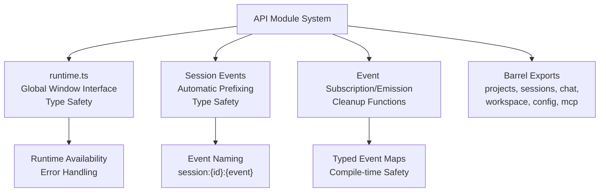

**Diagram sources**
- [api/index.ts](file://frontend/src/api/index.ts)
- [runtime.ts](file://frontend/src/api/runtime.ts)

**Section sources**
- [api/index.ts](file://frontend/src/api/index.ts)
- [runtime.ts](file://frontend/src/api/runtime.ts)

### Development Workflow
- Development server
  - Run npm run dev to start Vite dev server with hot reload and version constants
- Preview
  - npm run preview to serve built assets locally
- Testing
  - npm run test and npm run test:watch for Vitest with Node environment
- Linting
  - npm run lint to check TypeScript and ESLint rules with flat config
- Entry point
  - index.html loads /src/main.tsx which renders the App inside an ErrorBoundary

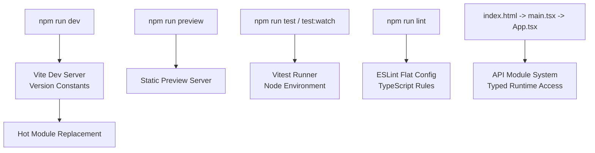

**Diagram sources**
- [package.json](file://frontend/package.json)
- [index.html](file://frontend/index.html)
- [main.tsx](file://frontend/src/main.tsx)
- [App.tsx](file://frontend/src/App.tsx)
- [vitest.config.ts](file://frontend/vitest.config.ts)

**Section sources**
- [package.json](file://frontend/package.json)
- [index.html](file://frontend/index.html)
- [main.tsx](file://frontend/src/main.tsx)
- [App.tsx](file://frontend/src/App.tsx)
- [vitest.config.ts](file://frontend/vitest.config.ts)

### Asset Handling and Styling Architecture
- CSS entry
  - index.css imports Tailwind, Typography, and highlight themes with custom design system
- Fonts
  - Nerd font embedded via local TTF and applied to icons with font-display swap
- Markdown and code blocks
  - Prose styles customized to match the One Dark theme; highlight.js theme applied
- Scrollbars and diffs
  - Custom scrollbar utilities and diff line styling for file viewer with semantic colors
- Utility function
  - cn combines and merges class names using clsx and tailwind-merge with enhanced type safety

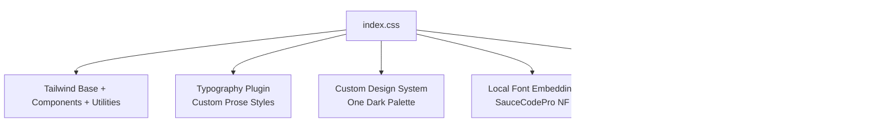

**Diagram sources**
- [index.css](file://frontend/src/index.css)
- [utils.ts](file://frontend/src/lib/utils.ts)

**Section sources**
- [index.css](file://frontend/src/index.css)
- [utils.ts](file://frontend/src/lib/utils.ts)

### Responsive Design Patterns
- Tailwind utilities
  - Use spacing, sizing, and layout utilities for responsive breakpoints with custom design tokens
- Custom prose variants
  - prose-xs reduces font size for compact content while maintaining design system consistency
- Scrollbar visibility
  - Utilities toggle visibility and behavior across platforms with custom styling
- Component composition
  - UI primitives from shadcn/ui provide consistent responsive behavior with enhanced type safety

### Build Customization and Environment Variables
- Vite base path
  - base: "./" ensures assets resolve correctly when hosted under subpaths
- Path aliases
  - @ alias simplifies imports across the codebase with TypeScript integration
- Version constants
  - __APP_VERSION__ injected from package.json for build identification and analytics
- TypeScript strictness
  - Enhanced type safety with module detection and strict class fields improves reliability
- ESLint rules
  - Flat config format with TypeScript ESLint integration improves maintainability

**Section sources**
- [vite.config.ts](file://frontend/vite.config.ts)
- [tsconfig.json](file://frontend/tsconfig.json)
- [eslint.config.js](file://frontend/eslint.config.js)

### Production Build Configuration
- Build command
  - tsc -b followed by vite build produces optimized assets with version constants
- Output
  - Vite emits static assets and HTML with hashed filenames for cache busting
  - Version constants embedded for build identification
- Preview
  - vite preview serves the production build locally for verification

**Section sources**
- [package.json](file://frontend/package.json)
- [vite.config.ts](file://frontend/vite.config.ts)

### Deployment Preparation
- Desktop packaging
  - Wails configuration specifies install, build, and dev commands with auto server URL
  - Frontend build artifacts are bundled into the desktop app with runtime access
- Backend integration
  - Go backend state and methods are exposed to the frontend via Wails runtime
  - API module system provides centralized access with type safety
- Asset bundling
  - Custom design system and font assets included in final bundle
  - Version constants embedded for build tracking
- **Security Enhancement**: Wails runtime files are distributed with non-executable permissions (644) to prevent accidental execution

**Section sources**
- [wails.json](file://wails.json)
- [runtime.ts](file://frontend/src/api/runtime.ts)

## Dependency Analysis
The frontend build stack comprises Vite, React, Tailwind CSS, TypeScript, and ESLint with enhanced API integration. Wails ties the frontend to the Go backend for desktop distribution with improved type safety and **security enhancements**.

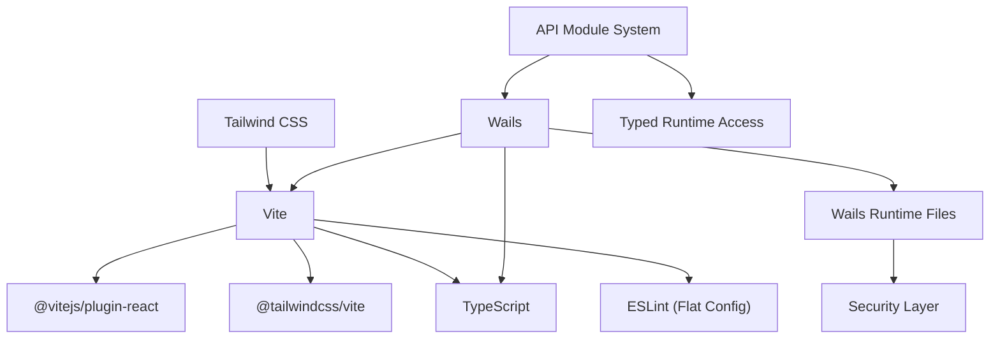

**Diagram sources**
- [vite.config.ts](file://frontend/vite.config.ts)
- [package.json](file://frontend/package.json)
- [wails.json](file://wails.json)
- [runtime.ts](file://frontend/src/api/runtime.ts)
- [package.json](file://frontend/wailsjs/runtime/package.json)

**Section sources**
- [vite.config.ts](file://frontend/vite.config.ts)
- [package.json](file://frontend/package.json)
- [wails.json](file://wails.json)
- [runtime.ts](file://frontend/src/api/runtime.ts)

## Performance Considerations
- Bundle size
  - Prefer tree-shaking by importing only used utilities and components with enhanced type safety
  - Keep third-party libraries minimal and up-to-date with strict version management
  - Utilize Vite's built-in code splitting and lazy loading capabilities
- CSS optimization
  - Purge unused Tailwind classes in production via Tailwind's purge configuration
  - Custom design system reduces CSS bloat while maintaining consistency
  - Font subsetting and display strategies optimize loading performance
- Asset optimization
  - Compress images and fonts; avoid large base64 blobs in custom design system
  - Local font embedding with font-display swap improves perceived performance
- Build caching
  - Use Vite's built-in caching and incremental builds during development
  - TypeScript isolated modules and module detection improve build performance
- Profiling
  - Analyze bundle composition using Vite's build analyzer plugin to identify large dependencies
  - Monitor API module usage and optimize event subscription patterns

## Security Considerations
- **Wails Runtime File Permissions**
  - Wails runtime files (package.json, runtime.d.ts, runtime.js) now use non-executable permissions (644)
  - This prevents accidental execution of JavaScript bindings files
  - Maintains full functionality while improving security posture
  - Aligns with security best practices for desktop applications
- **File Permission Management**
  - Runtime files are distributed with restrictive permissions (644) instead of executable (755)
  - Ensures files cannot be executed as standalone programs
  - Reduces attack surface for desktop packaging scenarios
- **Security Best Practices**
  - Regular security audits of generated runtime files
  - Automated permission validation during build process
  - Secure file handling in desktop packaging workflows

**Section sources**
- [package.json](file://frontend/wailsjs/runtime/package.json)
- [runtime.d.ts](file://frontend/wailsjs/runtime/runtime.d.ts)
- [runtime.js](file://frontend/wailsjs/runtime/runtime.js)

## Troubleshooting Guide
- Hot reload not working
  - Ensure Vite dev server is running and no port conflicts exist
  - Verify React Refresh plugin is enabled via @vitejs/plugin-react
  - Check version constants are properly injected during development
- Tailwind styles missing
  - Confirm Tailwind and Typography plugins are imported in index.css with custom design system
  - Check that @tailwind directives are present and Tailwind is initialized
  - Verify custom design tokens are properly defined and accessible
- ESLint errors
  - Fix hooks dependency arrays and exported components per React Refresh rules
  - Run npm run lint to identify and resolve issues with flat config format
  - Check TypeScript ESLint integration and custom rule configurations
- Wails runtime unavailable
  - Confirm window.go and window.runtime are present in the browser context
  - Verify Wails dev server URL and that the backend is started
  - Check API module system for proper runtime initialization
- API module issues
  - Ensure runtime wrapper is properly initialized before use
  - Verify session-scoped event naming follows expected conventions
  - Check typed event maps for compile-time validation errors
- **Security-related runtime issues**
  - Verify Wails runtime files have correct permissions (644) if experiencing execution errors
  - Check desktop packaging process for proper file permission handling
  - Ensure runtime files are not being accidentally marked as executable

**Section sources**
- [eslint.config.js](file://frontend/eslint.config.js)
- [index.css](file://frontend/src/index.css)
- [runtime.ts](file://frontend/src/api/runtime.ts)
- [wails.json](file://wails.json)
- [api/index.ts](file://frontend/src/api/index.ts)

## Conclusion
C0WRK's frontend build system leverages Vite, React, Tailwind CSS, TypeScript, and ESLint for a modern, efficient development experience with enhanced API-driven architecture. The new build system emphasizes strict type safety, modular imports, centralized runtime access, and a cohesive styling architecture with custom design tokens. The integration of Wails provides seamless desktop distribution with improved type safety and event handling. **Recent security enhancements** include non-executable permissions for Wails runtime files to prevent accidental execution while maintaining full functionality. Following the provided guidance ensures reliable development, testing, and production builds with optimal performance characteristics and strengthened security practices.

## Appendices
- Quick references
  - Development: npm run dev (with version constants)
  - Build: npm run build (TypeScript + Vite)
  - Preview: npm run preview
  - Lint: npm run lint (flat config format)
  - Test: npm run test / npm run test:watch (Node environment)
- API module usage
  - Centralized runtime access via API module system
  - Typed event handling with session scoping
  - Automatic cleanup functions for event subscriptions
- Design system benefits
  - Custom One Dark theme with comprehensive token system
  - Consistent typography and spacing across components
  - Enhanced accessibility with focus management and semantic colors
- **Security enhancements**
  - Wails runtime files use non-executable permissions (644)
  - Prevents accidental execution while maintaining functionality
  - Aligns with security best practices for desktop applications