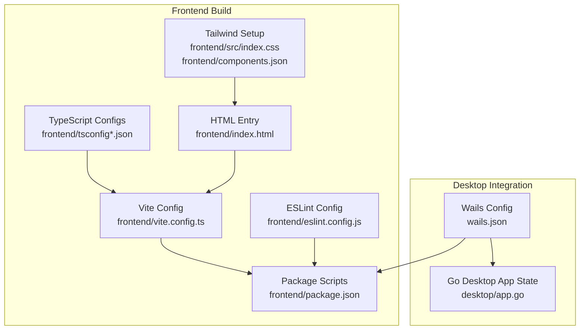
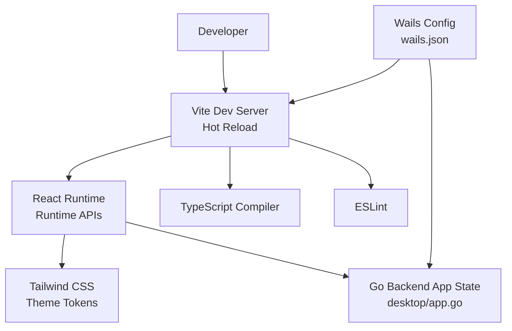
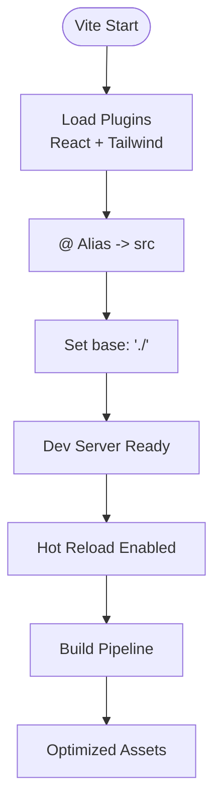
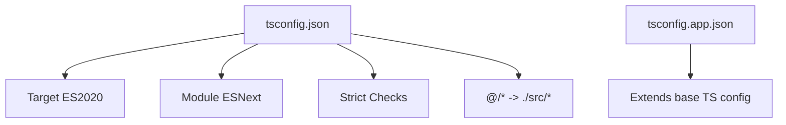
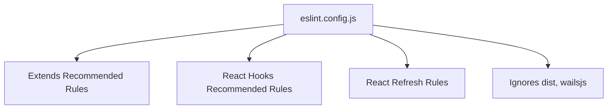
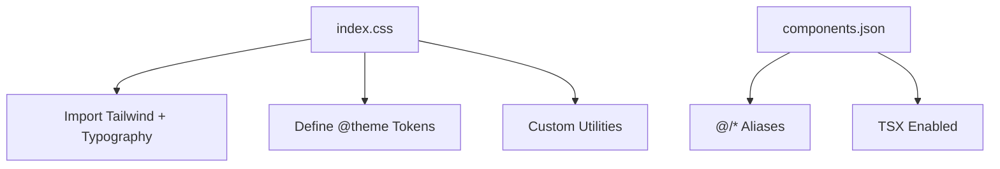
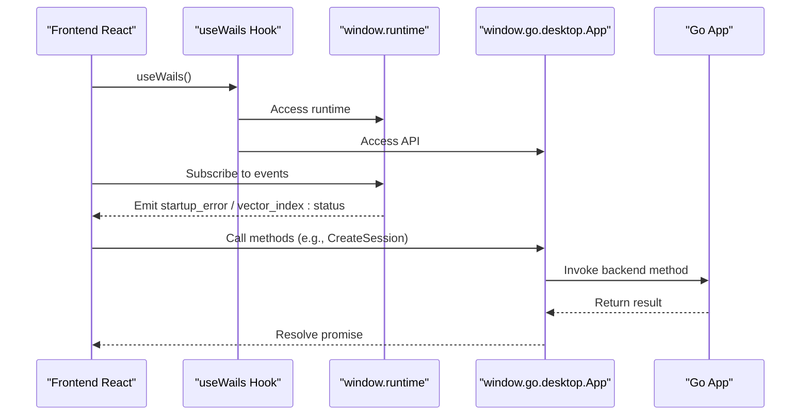
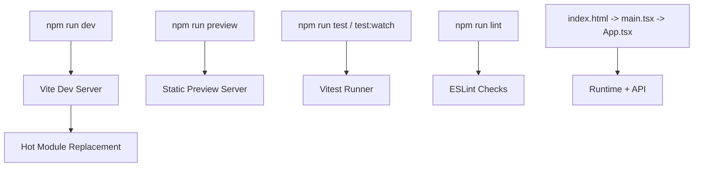
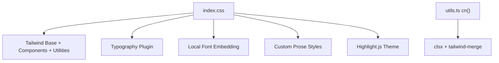
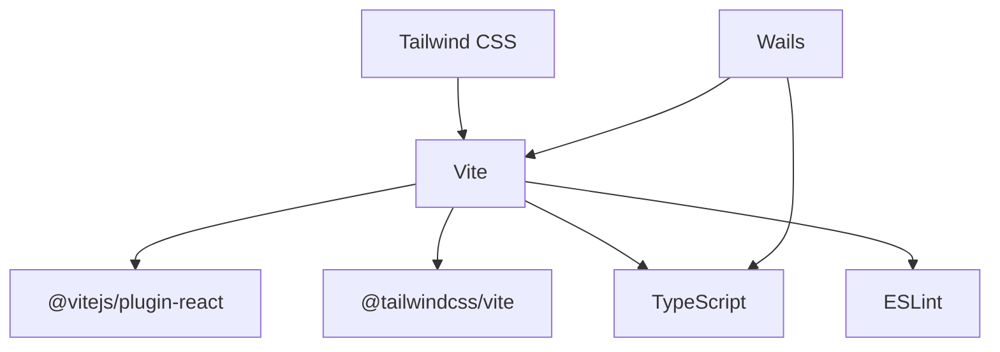

# Build System

<cite>
**Referenced Files in This Document**
- [vite.config.ts](file://frontend/vite.config.ts)
- [package.json](file://frontend/package.json)
- [tsconfig.json](file://frontend/tsconfig.json)
- [tsconfig.app.json](file://frontend/tsconfig.app.json)
- [eslint.config.js](file://frontend/eslint.config.js)
- [components.json](file://frontend/components.json)
- [wails.json](file://wails.json)
- [index.html](file://frontend/index.html)
- [main.tsx](file://frontend/src/main.tsx)
- [App.tsx](file://frontend/src/App.tsx)
- [index.css](file://frontend/src/index.css)
- [utils.ts](file://frontend/src/lib/utils.ts)
- [useWails.ts](file://frontend/src/hooks/useWails.ts)
- [wails.ts](file://frontend/src/lib/wails.ts)
- [app.go](file://desktop/app.go)
</cite>

## Table of Contents
1. [Introduction](#introduction)
2. [Project Structure](#project-structure)
3. [Core Components](#core-components)
4. [Architecture Overview](#architecture-overview)
5. [Detailed Component Analysis](#detailed-component-analysis)
6. [Dependency Analysis](#dependency-analysis)
7. [Performance Considerations](#performance-considerations)
8. [Troubleshooting Guide](#troubleshooting-guide)
9. [Conclusion](#conclusion)
10. [Appendices](#appendices)

## Introduction
This document explains the frontend build system and development environment for C0WRK. It covers Vite configuration, TypeScript and ESLint setup, Tailwind CSS integration, Wails desktop integration, development server and hot reload, debugging tools, and production build preparation. It also provides guidance on performance optimization, bundle analysis, and deployment preparation.

## Project Structure
The frontend is organized under the frontend directory with the following build-related files:
- Vite configuration defines plugins, aliases, and base path.
- Package scripts orchestrate dev, build, lint, preview, and test workflows.
- TypeScript configurations enable strictness and module resolution.
- ESLint configuration enforces React Hooks and refresh rules.
- Tailwind CSS integrates via plugin and theme tokens.
- Wails configuration connects the frontend build to the Go backend for desktop packaging.

**Diagram sources**
- [vite.config.ts](file://frontend/vite.config.ts)
- [package.json](file://frontend/package.json)
- [tsconfig.json](file://frontend/tsconfig.json)
- [tsconfig.app.json](file://frontend/tsconfig.app.json)
- [eslint.config.js](file://frontend/eslint.config.js)
- [index.css](file://frontend/src/index.css)
- [components.json](file://frontend/components.json)
- [index.html](file://frontend/index.html)
- [wails.json](file://wails.json)
- [app.go](file://desktop/app.go)

**Section sources**
- [vite.config.ts](file://frontend/vite.config.ts)
- [package.json](file://frontend/package.json)
- [tsconfig.json](file://frontend/tsconfig.json)
- [tsconfig.app.json](file://frontend/tsconfig.app.json)
- [eslint.config.js](file://frontend/eslint.config.js)
- [index.css](file://frontend/src/index.css)
- [components.json](file://frontend/components.json)
- [index.html](file://frontend/index.html)
- [wails.json](file://wails.json)
- [app.go](file://desktop/app.go)

## Core Components
- Vite configuration
  - Enables React and Tailwind CSS plugins.
  - Sets alias @ to src for ergonomic imports.
  - Uses a relative base path for portability.
- TypeScript configuration
  - Targets modern JS environments.
  - Enforces strict type checking and unused checks.
  - Resolves modules via bundler and supports TS extensions.
- ESLint configuration
  - Extends recommended TS and React configs.
  - Enforces React Hooks rules and React Refresh.
- Tailwind CSS integration
  - Imports Tailwind and Typography plugins.
  - Defines theme tokens and custom styles.
  - Uses shadcn/ui configuration for components and utilities.
- Wails integration
  - Connects frontend build to Go backend for desktop packaging.
  - Exposes runtime APIs and events to the frontend.

**Section sources**
- [vite.config.ts](file://frontend/vite.config.ts)
- [package.json](file://frontend/package.json)
- [tsconfig.json](file://frontend/tsconfig.json)
- [tsconfig.app.json](file://frontend/tsconfig.app.json)
- [eslint.config.js](file://frontend/eslint.config.js)
- [index.css](file://frontend/src/index.css)
- [components.json](file://frontend/components.json)
- [wails.json](file://wails.json)

## Architecture Overview
The frontend build pipeline integrates Vite, React, Tailwind CSS, and TypeScript. Wails bridges the frontend to the Go backend for desktop distribution. The development server serves assets with hot reload, while the production build optimizes resources and bundles.

**Diagram sources**
- [vite.config.ts](file://frontend/vite.config.ts)
- [index.html](file://frontend/index.html)
- [main.tsx](file://frontend/src/main.tsx)
- [index.css](file://frontend/src/index.css)
- [wails.json](file://wails.json)
- [app.go](file://desktop/app.go)

## Detailed Component Analysis

### Vite Configuration
- Plugins
  - React plugin enables JSX transform and fast refresh.
  - Tailwind CSS plugin processes CSS directives.
- Aliasing
  - @ resolves to src for concise imports across the app.
- Base path
  - Relative base ensures compatibility when served from subpaths.

**Diagram sources**
- [vite.config.ts](file://frontend/vite.config.ts)

**Section sources**
- [vite.config.ts](file://frontend/vite.config.ts)

### TypeScript Configuration
- Strictness
  - Enables strict type checking, unused locals/parameters, and no fallthrough switches.
- Module Resolution
  - Bundler resolution with extension support and ESNext modules.
- JSX and Paths
  - React JSX transform and path mapping for @ alias.

**Diagram sources**
- [tsconfig.json](file://frontend/tsconfig.json)
- [tsconfig.app.json](file://frontend/tsconfig.app.json)

**Section sources**
- [tsconfig.json](file://frontend/tsconfig.json)
- [tsconfig.app.json](file://frontend/tsconfig.app.json)

### ESLint Configuration
- Recommended configs
  - Uses @eslint/js and typescript-eslint recommended sets.
- React Hooks and Refresh
  - Enforces exhaustive deps and restricts export components for refresh.
- Ignored directories
  - Skips dist and generated wailsjs folders.

**Diagram sources**
- [eslint.config.js](file://frontend/eslint.config.js)

**Section sources**
- [eslint.config.js](file://frontend/eslint.config.js)

### Tailwind CSS Integration
- Plugins
  - Tailwind and Typography plugins imported in CSS.
- Theme tokens
  - Custom color tokens and radius variables defined via @theme.
- Utilities
  - Utility classes for prose, scrollbars, and code highlighting.
- shadcn/ui
  - Components and utilities configured with TSX and custom aliases.

**Diagram sources**
- [index.css](file://frontend/src/index.css)
- [components.json](file://frontend/components.json)

**Section sources**
- [index.css](file://frontend/src/index.css)
- [components.json](file://frontend/components.json)

### Wails Integration
- Frontend build and dev commands
  - Wails delegates npm scripts for install, build, and dev watcher.
- Runtime and API access
  - useWails hook exposes window.go.desktop.App and window.runtime for events.
- Backend state
  - Go App struct holds application state and exposes methods to the frontend.

**Diagram sources**
- [useWails.ts](file://frontend/src/hooks/useWails.ts)
- [wails.ts](file://frontend/src/lib/wails.ts)
- [App.tsx](file://frontend/src/App.tsx)
- [app.go](file://desktop/app.go)

**Section sources**
- [wails.json](file://wails.json)
- [useWails.ts](file://frontend/src/hooks/useWails.ts)
- [wails.ts](file://frontend/src/lib/wails.ts)
- [App.tsx](file://frontend/src/App.tsx)
- [app.go](file://desktop/app.go)

### Development Workflow
- Development server
  - Run npm run dev to start Vite dev server with hot reload.
- Preview
  - npm run preview to serve built assets locally.
- Testing
  - npm run test and npm run test:watch for Vitest.
- Linting
  - npm run lint to check TypeScript and ESLint rules.
- Entry point
  - index.html loads /src/main.tsx which renders the App inside an ErrorBoundary.

**Diagram sources**
- [package.json](file://frontend/package.json)
- [index.html](file://frontend/index.html)
- [main.tsx](file://frontend/src/main.tsx)
- [App.tsx](file://frontend/src/App.tsx)

**Section sources**
- [package.json](file://frontend/package.json)
- [index.html](file://frontend/index.html)
- [main.tsx](file://frontend/src/main.tsx)
- [App.tsx](file://frontend/src/App.tsx)

### Asset Handling and Styling Architecture
- CSS entry
  - index.css imports Tailwind, Typography, and highlight themes.
- Fonts
  - Nerd font embedded via local TTF and applied to icons.
- Markdown and code blocks
  - Prose styles customized to match the theme; highlight.js theme applied.
- Scrollbars and diffs
  - Custom scrollbar utilities and diff line styling for file viewer.
- Utility function
  - cn combines and merges class names using clsx and tailwind-merge.

**Diagram sources**
- [index.css](file://frontend/src/index.css)
- [utils.ts](file://frontend/src/lib/utils.ts)

**Section sources**
- [index.css](file://frontend/src/index.css)
- [utils.ts](file://frontend/src/lib/utils.ts)

### Responsive Design Patterns
- Tailwind utilities
  - Use spacing, sizing, and layout utilities for responsive breakpoints.
- Custom prose variants
  - prose-xs reduces font size for compact content.
- Scrollbar visibility
  - Utilities toggle visibility and behavior across platforms.
- Component composition
  - UI primitives from shadcn/ui provide consistent responsive behavior.

[No sources needed since this section provides general guidance]

### Build Customization and Environment Variables
- Vite base path
  - base: "./" ensures assets resolve correctly when hosted under subpaths.
- Path aliases
  - @ alias simplifies imports across the codebase.
- TypeScript strictness
  - Tight type safety improves reliability in builds.
- ESLint rules
  - Enforced hooks and refresh rules improve maintainability.

**Section sources**
- [vite.config.ts](file://frontend/vite.config.ts)
- [tsconfig.json](file://frontend/tsconfig.json)
- [eslint.config.js](file://frontend/eslint.config.js)

### Production Build Configuration
- Build command
  - tsc -b followed by vite build produces optimized assets.
- Output
  - Vite emits static assets and HTML with hashed filenames for cache busting.
- Preview
  - vite preview serves the production build locally for verification.

**Section sources**
- [package.json](file://frontend/package.json)
- [vite.config.ts](file://frontend/vite.config.ts)

### Deployment Preparation
- Desktop packaging
  - Wails configuration specifies install, build, and dev commands.
  - Frontend build artifacts are bundled into the desktop app.
- Backend integration
  - Go backend state and methods are exposed to the frontend via Wails runtime.

**Section sources**
- [wails.json](file://wails.json)
- [app.go](file://desktop/app.go)

## Dependency Analysis
The frontend build stack comprises Vite, React, Tailwind CSS, TypeScript, and ESLint. Wails ties the frontend to the Go backend for desktop distribution.

**Diagram sources**
- [vite.config.ts](file://frontend/vite.config.ts)
- [package.json](file://frontend/package.json)
- [wails.json](file://wails.json)

**Section sources**
- [vite.config.ts](file://frontend/vite.config.ts)
- [package.json](file://frontend/package.json)
- [wails.json](file://wails.json)

## Performance Considerations
- Bundle size
  - Prefer tree-shaking by importing only used utilities and components.
  - Keep third-party libraries minimal and up-to-date.
- CSS optimization
  - Purge unused Tailwind classes in production via Tailwind’s purge configuration.
- Asset optimization
  - Compress images and fonts; avoid large base64 blobs.
- Build caching
  - Use Vite’s built-in caching and incremental builds during development.
- Profiling
  - Analyze bundle composition using Vite’s build analyzer plugin to identify large dependencies.

[No sources needed since this section provides general guidance]

## Troubleshooting Guide
- Hot reload not working
  - Ensure Vite dev server is running and no port conflicts exist.
  - Verify React Refresh plugin is enabled via @vitejs/plugin-react.
- Tailwind styles missing
  - Confirm Tailwind and Typography plugins are imported in index.css.
  - Check that @tailwind directives are present and Tailwind is initialized.
- ESLint errors
  - Fix hooks dependency arrays and exported components per React Refresh rules.
  - Run npm run lint to identify and resolve issues.
- Wails runtime unavailable
  - Confirm window.go and window.runtime are present in the browser context.
  - Verify Wails dev server URL and that the backend is started.

**Section sources**
- [eslint.config.js](file://frontend/eslint.config.js)
- [index.css](file://frontend/src/index.css)
- [useWails.ts](file://frontend/src/hooks/useWails.ts)
- [wails.json](file://wails.json)

## Conclusion
C0WRK’s frontend build system leverages Vite, React, Tailwind CSS, TypeScript, and ESLint for a modern, efficient development experience. Wails integrates the frontend with the Go backend for desktop distribution. The configuration emphasizes strict type safety, modular imports, and a cohesive styling architecture. Following the provided guidance ensures reliable development, testing, and production builds.

## Appendices
- Quick references
  - Development: npm run dev
  - Build: npm run build
  - Preview: npm run preview
  - Lint: npm run lint
  - Test: npm run test / npm run test:watch

[No sources needed since this section provides general guidance]