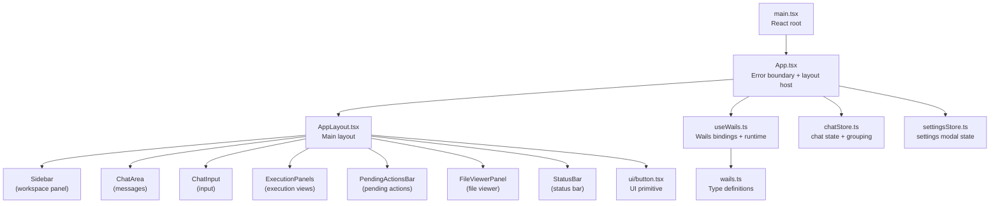
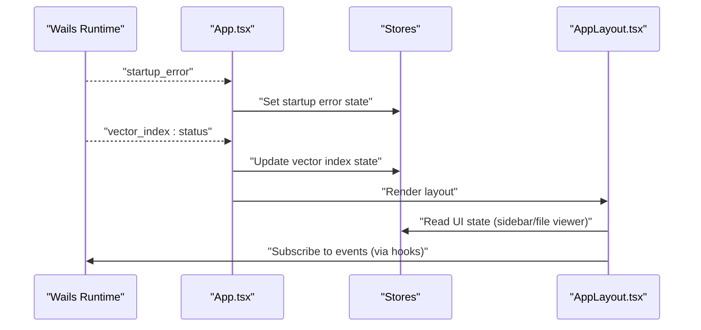
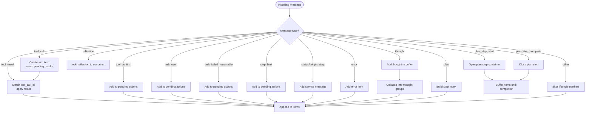
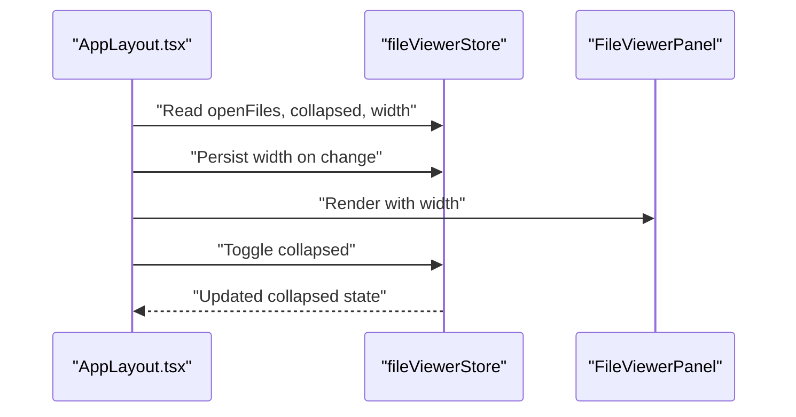
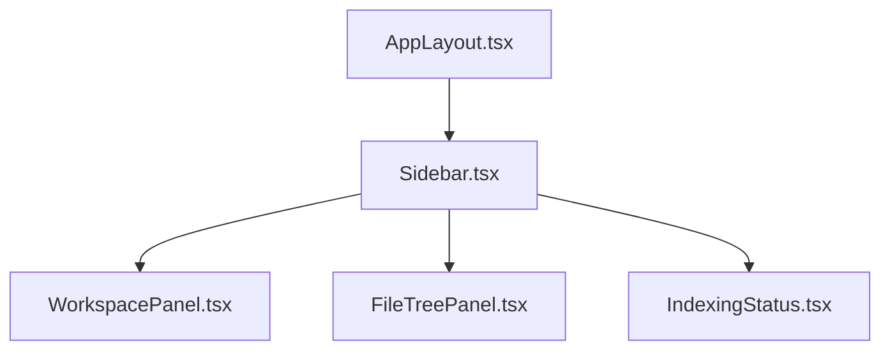
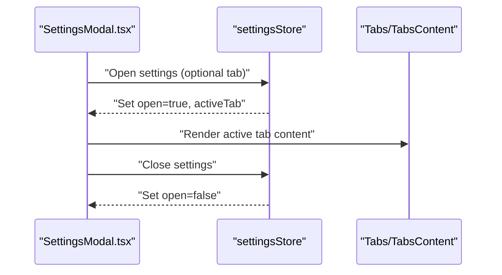
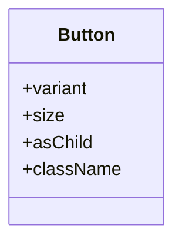
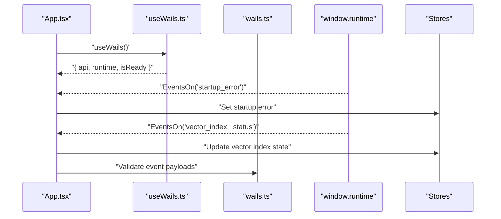
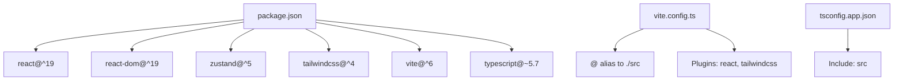

# Frontend Application

<cite>
**Referenced Files in This Document**
- [main.tsx](file://frontend/src/main.tsx)
- [App.tsx](file://frontend/src/App.tsx)
- [package.json](file://frontend/package.json)
- [vite.config.ts](file://frontend/vite.config.ts)
- [tsconfig.app.json](file://frontend/tsconfig.app.json)
- [index.css](file://frontend/src/index.css)
- [AppLayout.tsx](file://frontend/src/components/layout/AppLayout.tsx)
- [chatStore.ts](file://frontend/src/stores/chatStore.ts)
- [useWails.ts](file://frontend/src/hooks/useWails.ts)
- [wails.ts](file://frontend/src/lib/wails.ts)
- [api.ts](file://frontend/src/constants/api.ts)
- [SettingsModal.tsx](file://frontend/src/components/settings/SettingsModal.tsx)
- [settingsStore.ts](file://frontend/src/stores/settingsStore.ts)
- [button.tsx](file://frontend/src/components/ui/button.tsx)
</cite>

## Table of Contents
1. [Introduction](#introduction)
2. [Project Structure](#project-structure)
3. [Core Components](#core-components)
4. [Architecture Overview](#architecture-overview)
5. [Detailed Component Analysis](#detailed-component-analysis)
6. [Dependency Analysis](#dependency-analysis)
7. [Performance Considerations](#performance-considerations)
8. [Troubleshooting Guide](#troubleshooting-guide)
9. [Conclusion](#conclusion)
10. [Appendices](#appendices)

## Introduction
This document describes the React 19 frontend application for C0WRK, focusing on component architecture, state management with custom stores, UI component library, and integration with the Wails backend. It covers the chat interface, file viewer system, workspace panel, and settings modal. It also explains the build system using Vite, TypeScript configuration, and styling with Tailwind CSS, along with responsive design patterns, accessibility considerations, and cross-platform UI concerns.

## Project Structure
The frontend is organized around a clear separation of concerns:
- Entry point initializes the React root, error boundary, and global styles.
- App wires up Wails runtime events and renders the main layout.
- Layout composes the sidebar, chat area, execution panels, input, file viewer, and status bar.
- Stores encapsulate state for chat, UI, sessions, projects, file tree, file viewer, and settings.
- Hooks abstract Wails bindings and runtime event handling.
- UI components are built with a small, theme-consistent library using Tailwind and Radix primitives.

**Diagram sources**
- [main.tsx:1-17](file://frontend/src/main.tsx#L1-L17)
- [App.tsx:1-91](file://frontend/src/App.tsx#L1-L91)
- [AppLayout.tsx:1-135](file://frontend/src/components/layout/AppLayout.tsx#L1-L135)
- [useWails.ts:1-61](file://frontend/src/hooks/useWails.ts#L1-L61)
- [wails.ts:1-205](file://frontend/src/lib/wails.ts#L1-L205)
- [chatStore.ts:1-571](file://frontend/src/stores/chatStore.ts#L1-L571)
- [settingsStore.ts:1-20](file://frontend/src/stores/settingsStore.ts#L1-L20)
- [button.tsx:1-32](file://frontend/src/components/ui/button.tsx#L1-L32)

**Section sources**
- [main.tsx:1-17](file://frontend/src/main.tsx#L1-L17)
- [App.tsx:1-91](file://frontend/src/App.tsx#L1-L91)
- [AppLayout.tsx:1-135](file://frontend/src/components/layout/AppLayout.tsx#L1-L135)
- [package.json:1-61](file://frontend/package.json#L1-L61)
- [vite.config.ts:1-15](file://frontend/vite.config.ts#L1-L15)
- [tsconfig.app.json:1-5](file://frontend/tsconfig.app.json#L1-L5)
- [index.css:1-278](file://frontend/src/index.css#L1-L278)

## Core Components
- App: Initializes Wails runtime, listens for startup errors and vector index status events, and renders the layout with banners.
- AppLayout: Orchestrates sidebar, chat area, execution panels, input, file viewer, and status bar. Manages resizable panels and collapsed states.
- Chat system: Message grouping, display item generation, pending actions, and streaming text handling are centralized in the chat store.
- Settings modal: Tabbed settings UI backed by a dedicated store.
- UI primitives: Small, theme-aware components (button, dialog, tabs, tooltip) using Tailwind and Radix.

**Section sources**
- [App.tsx:21-91](file://frontend/src/App.tsx#L21-L91)
- [AppLayout.tsx:30-135](file://frontend/src/components/layout/AppLayout.tsx#L30-L135)
- [chatStore.ts:440-571](file://frontend/src/stores/chatStore.ts#L440-L571)
- [settingsStore.ts:13-20](file://frontend/src/stores/settingsStore.ts#L13-L20)
- [button.tsx:8-32](file://frontend/src/components/ui/button.tsx#L8-L32)

## Architecture Overview
The frontend integrates tightly with the Wails backend via generated bindings and runtime events. The App component subscribes to backend events and updates global stores. Stores are used to manage chat messages, UI state, and settings. The layout composes specialized panels and the chat UI.

**Diagram sources**
- [App.tsx:25-55](file://frontend/src/App.tsx#L25-L55)
- [AppLayout.tsx:30-135](file://frontend/src/components/layout/AppLayout.tsx#L30-L135)

## Detailed Component Analysis

### Chat Interface Implementation
The chat interface is driven by a rich store that models messages and display items, groups related events into hierarchical structures, and tracks pending actions requiring user input. It supports streaming assistant text, tool calls/results, plan steps, reflections, and context compaction.

Key aspects:
- Message types and display items: The store defines a comprehensive set of message kinds and display item variants to render a unified timeline.
- Grouping algorithm: Messages are grouped into plan steps, thought groups, tool executions, and service notifications. It handles out-of-order tool results and pending actions.
- Streaming and UI state: The store tracks streaming text, thinking state, and per-step context fill metrics.
- Pending actions: Dedicated UI bars surface unresolved tool confirmations, user questions, resume prompts, and step limits.

**Diagram sources**
- [chatStore.ts:77-410](file://frontend/src/stores/chatStore.ts#L77-L410)

**Section sources**
- [chatStore.ts:3-41](file://frontend/src/stores/chatStore.ts#L3-L41)
- [chatStore.ts:77-410](file://frontend/src/stores/chatStore.ts#L77-L410)
- [chatStore.ts:440-571](file://frontend/src/stores/chatStore.ts#L440-L571)

### File Viewer System
The file viewer panel is integrated into the main layout and controlled by a dedicated store. The panel supports:
- Collapsed/unexpanded states with a minimal width indicator.
- Resizable width with persisted width stored in the store.
- Toggle controls for expanding/collapsing the panel.
- Integration with the sidebar resizing and overall layout responsiveness.

**Diagram sources**
- [AppLayout.tsx:30-135](file://frontend/src/components/layout/AppLayout.tsx#L30-L135)

**Section sources**
- [AppLayout.tsx:30-135](file://frontend/src/components/layout/AppLayout.tsx#L30-L135)

### Workspace Panel
The workspace panel resides in the sidebar and is part of the layout composition. It provides project and workspace navigation, file tree, indexing status, and related workspace features. The panel participates in the layout’s collapsible behavior and integrates with the project store for active project state.

**Diagram sources**
- [AppLayout.tsx:56-90](file://frontend/src/components/layout/AppLayout.tsx#L56-L90)

**Section sources**
- [AppLayout.tsx:56-90](file://frontend/src/components/layout/AppLayout.tsx#L56-L90)

### Settings Modal
The settings modal is a tabbed dialog backed by a store that manages open/closed state and active tab. It surfaces configuration warnings and organizes settings into categories such as general, LLM, search, MCP, security, and about.

**Diagram sources**
- [SettingsModal.tsx:18-156](file://frontend/src/components/settings/SettingsModal.tsx#L18-L156)
- [settingsStore.ts:13-20](file://frontend/src/stores/settingsStore.ts#L13-L20)

**Section sources**
- [SettingsModal.tsx:18-156](file://frontend/src/components/settings/SettingsModal.tsx#L18-L156)
- [settingsStore.ts:13-20](file://frontend/src/stores/settingsStore.ts#L13-L20)

### UI Component Library
The UI library provides lightweight, theme-consistent primitives:
- Button: Variants and sizes with Radix slot semantics.
- Dialog, Tabs, DropdownMenu, Input, Separator, Tooltip: Composed from Radix UI and styled with Tailwind.
- Utilities: Class merging helpers and variant builders enable consistent styling across components.

**Diagram sources**
- [button.tsx:8-32](file://frontend/src/components/ui/button.tsx#L8-L32)

**Section sources**
- [button.tsx:8-32](file://frontend/src/components/ui/button.tsx#L8-L32)
- [index.css:29-57](file://frontend/src/index.css#L29-L57)

### Integration with Wails Backend
The frontend communicates with the Go backend through generated bindings and runtime events:
- useWails hook exposes typed APIs for sessions, projects, file operations, and configuration.
- App listens for startup errors and vector index status events and updates stores accordingly.
- Event payloads conform to typed interfaces for tool calls, results, plan steps, reflections, and context metrics.

**Diagram sources**
- [App.tsx:21-55](file://frontend/src/App.tsx#L21-L55)
- [useWails.ts:51-61](file://frontend/src/hooks/useWails.ts#L51-L61)
- [wails.ts:32-205](file://frontend/src/lib/wails.ts#L32-L205)

**Section sources**
- [App.tsx:21-55](file://frontend/src/App.tsx#L21-L55)
- [useWails.ts:51-61](file://frontend/src/hooks/useWails.ts#L51-L61)
- [wails.ts:32-205](file://frontend/src/lib/wails.ts#L32-L205)

## Dependency Analysis
The frontend relies on React 19, Zustand for state, Tailwind CSS for styling, and Vite for building. The build configuration aliases the @ path to src and enables React and Tailwind plugins. TypeScript is configured to include the src directory.

**Diagram sources**
- [package.json:14-61](file://frontend/package.json#L14-L61)
- [vite.config.ts:6-14](file://frontend/vite.config.ts#L6-L14)
- [tsconfig.app.json:1-5](file://frontend/tsconfig.app.json#L1-L5)

**Section sources**
- [package.json:14-61](file://frontend/package.json#L14-L61)
- [vite.config.ts:6-14](file://frontend/vite.config.ts#L6-L14)
- [tsconfig.app.json:1-5](file://frontend/tsconfig.app.json#L1-L5)

## Performance Considerations
- Efficient rendering: The layout uses memoized resize handles and selective re-renders based on store slices.
- Minimal re-renders: Zustand selectors reduce unnecessary updates when only parts of state change.
- Streaming UI: Assistant streaming text is appended incrementally to avoid large DOM updates.
- Event-driven updates: Backend events update stores directly, minimizing polling and redundant computations.
- CSS performance: Tailwind utilities and a compact theme reduce CSS bloat; custom prose variants optimize markdown rendering.

## Troubleshooting Guide
Common issues and remedies:
- Startup errors: The App component displays a dismissible banner when the backend emits a startup error. Inspect the message and error fields to diagnose initialization problems.
- Vector index status: Subscribe to vector index events to monitor indexing progress and detect failures.
- Settings persistence: Ensure the settings store is initialized and that tab changes persist across sessions.
- API key masking: Some providers mask API keys in settings; verify masked values and update configurations as needed.
- Accessibility: The theme removes default focus rings; ensure alternative focus indicators remain visible for keyboard navigation.

**Section sources**
- [App.tsx:61-87](file://frontend/src/App.tsx#L61-L87)
- [api.ts:1-3](file://frontend/src/constants/api.ts#L1-L3)

## Conclusion
C0WRK’s frontend combines a modular React 19 architecture with a robust store-based state model, a cohesive UI component library, and seamless Wails integration. The chat interface, file viewer, workspace panel, and settings modal are designed for clarity, responsiveness, and cross-platform consistency. The build and styling stack ensures maintainability and performance across platforms.

## Appendices

### Build System and Configuration
- Vite: React plugin, Tailwind plugin, and path aliasing simplify development and production builds.
- TypeScript: Strict app configuration scoped to src for accurate type checking.
- Styles: Tailwind theme tokens and prose overrides align UI with the dark theme.

**Section sources**
- [vite.config.ts:6-14](file://frontend/vite.config.ts#L6-L14)
- [tsconfig.app.json:1-5](file://frontend/tsconfig.app.json#L1-L5)
- [index.css:29-57](file://frontend/src/index.css#L29-L57)

### Responsive Design and Accessibility
- Responsive layout: Flexbox-based layout adapts to screen size; resizable panels maintain usability.
- Accessibility: Focus management and keyboard navigation are supported; ensure custom focus styles complement the theme.
- Cross-platform UI: Consistent styling and component behavior across operating systems via Tailwind and Radix.

**Section sources**
- [AppLayout.tsx:57-135](file://frontend/src/components/layout/AppLayout.tsx#L57-L135)
- [index.css:59-62](file://frontend/src/index.css#L59-L62)