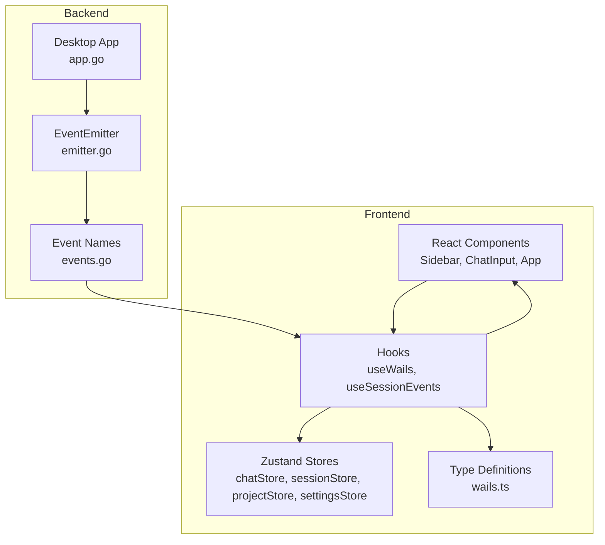
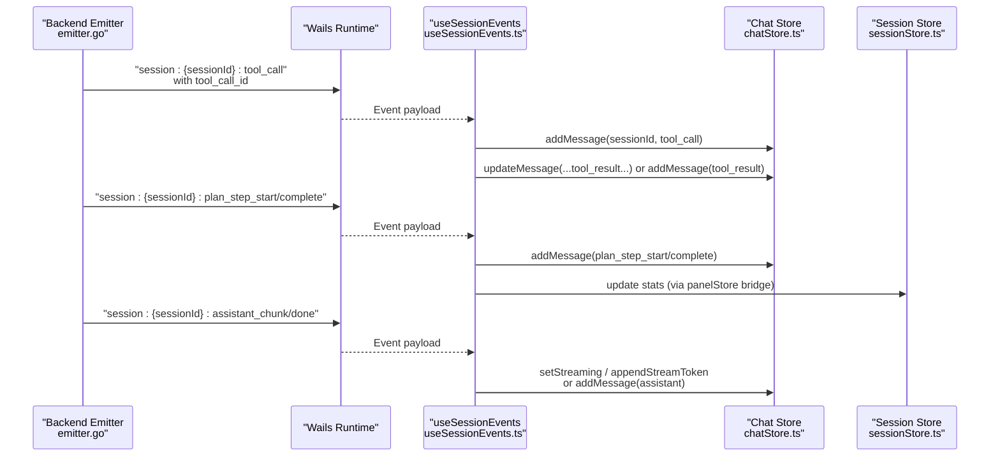
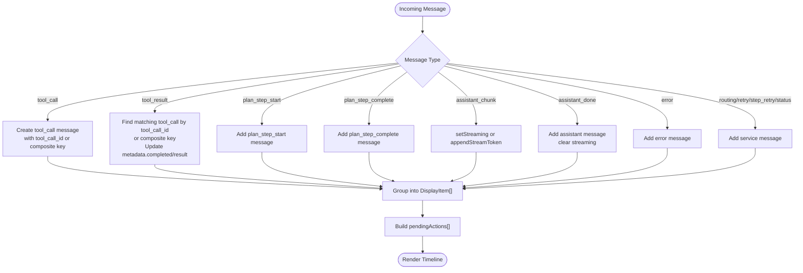
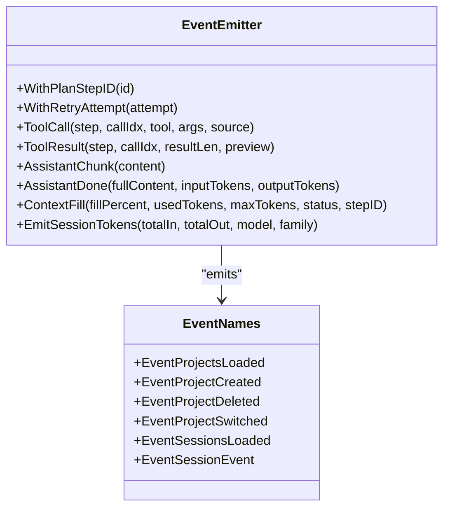
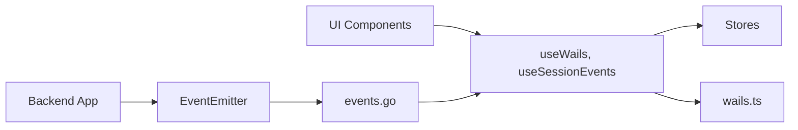

# State Management

<cite>
**Referenced Files in This Document**
- [chatStore.ts](file://frontend/src/stores/chatStore.ts)
- [sessionStore.ts](file://frontend/src/stores/sessionStore.ts)
- [projectStore.ts](file://frontend/src/stores/projectStore.ts)
- [settingsStore.ts](file://frontend/src/stores/settingsStore.ts)
- [events.go](file://desktop/events.go)
- [wails.ts](file://frontend/src/lib/wails.ts)
- [useWails.ts](file://frontend/src/hooks/useWails.ts)
- [useSessionEvents.ts](file://frontend/src/hooks/useSessionEvents.ts)
- [emitter.go](file://backend/session/emitter.go)
- [app.go](file://desktop/app.go)
- [App.tsx](file://frontend/src/App.tsx)
- [Sidebar.tsx](file://frontend/src/components/layout/Sidebar.tsx)
- [ChatInput.tsx](file://frontend/src/components/chat/ChatInput.tsx)
- [chatStore.test.ts](file://frontend/src/stores/chatStore.test.ts)
</cite>

## Table of Contents
1. [Introduction](#introduction)
2. [Project Structure](#project-structure)
3. [Core Components](#core-components)
4. [Architecture Overview](#architecture-overview)
5. [Detailed Component Analysis](#detailed-component-analysis)
6. [Dependency Analysis](#dependency-analysis)
7. [Performance Considerations](#performance-considerations)
8. [Troubleshooting Guide](#troubleshooting-guide)
9. [Conclusion](#conclusion)

## Introduction
This document explains C0WRK’s state management architecture built around custom Zustand stores. It covers:
- Chat store for conversation and execution timeline state
- Session store for workspace and project session lifecycle
- Project store for project lifecycle management
- Settings store for modal and UI preferences
- Store initialization and update patterns
- Inter-store communication and cross-component usage
- Integration with the Wails backend for real-time event-driven updates and persistence
- Examples of store usage, selectors, and async updates
- Best practices for desktop application state management

## Project Structure
C0WRK organizes state in the frontend under a dedicated stores directory, with hooks bridging to the Wails backend and UI components subscribing to store slices. The backend emits structured events consumed by the frontend to keep UI state synchronized.

**Diagram sources**
- [useWails.ts:1-61](file://frontend/src/hooks/useWails.ts#L1-L61)
- [useSessionEvents.ts:1-705](file://frontend/src/hooks/useSessionEvents.ts#L1-L705)
- [chatStore.ts:1-571](file://frontend/src/stores/chatStore.ts#L1-L571)
- [sessionStore.ts:1-52](file://frontend/src/stores/sessionStore.ts#L1-L52)
- [projectStore.ts:1-44](file://frontend/src/stores/projectStore.ts#L1-L44)
- [settingsStore.ts:1-20](file://frontend/src/stores/settingsStore.ts#L1-L20)
- [wails.ts:1-205](file://frontend/src/lib/wails.ts#L1-L205)
- [emitter.go:1-668](file://backend/session/emitter.go#L1-L668)
- [events.go:1-46](file://desktop/events.go#L1-L46)
- [app.go:1-73](file://desktop/app.go#L1-L73)

**Section sources**
- [useWails.ts:1-61](file://frontend/src/hooks/useWails.ts#L1-L61)
- [useSessionEvents.ts:1-705](file://frontend/src/hooks/useSessionEvents.ts#L1-L705)
- [chatStore.ts:1-571](file://frontend/src/stores/chatStore.ts#L1-L571)
- [sessionStore.ts:1-52](file://frontend/src/stores/sessionStore.ts#L1-L52)
- [projectStore.ts:1-44](file://frontend/src/stores/projectStore.ts#L1-L44)
- [settingsStore.ts:1-20](file://frontend/src/stores/settingsStore.ts#L1-L20)
- [wails.ts:1-205](file://frontend/src/lib/wails.ts#L1-L205)
- [emitter.go:1-668](file://backend/session/emitter.go#L1-L668)
- [events.go:1-46](file://desktop/events.go#L1-L46)
- [app.go:1-73](file://desktop/app.go#L1-L73)

## Core Components
- Chat store: Manages per-session messages, streaming assistant text, thinking/task flags, plan grouping, and context fill metrics. Provides helpers to group raw events into display-friendly items and pending actions.
- Session store: Tracks available sessions, active session, and supports add/update/remove with activity-aware sorting.
- Project store: Tracks available projects, active project, and supports add/update/remove with activity-aware sorting.
- Settings store: Controls the settings modal open state and active tab.

Key patterns:
- Each store is a Zustand slice with a typed state interface and action methods.
- Stores expose selectors for efficient component subscriptions.
- Stores are used directly by UI components and indirectly via hooks.

**Section sources**
- [chatStore.ts:440-571](file://frontend/src/stores/chatStore.ts#L440-L571)
- [sessionStore.ts:15-52](file://frontend/src/stores/sessionStore.ts#L15-L52)
- [projectStore.ts:15-44](file://frontend/src/stores/projectStore.ts#L15-L44)
- [settingsStore.ts:3-20](file://frontend/src/stores/settingsStore.ts#L3-L20)

## Architecture Overview
The architecture is event-driven and desktop-native:
- Backend emits structured events via an emitter that injects plan-scoped and retry-scoped metadata.
- Wails runtime forwards events to the frontend with typed payloads.
- Frontend hooks subscribe to session-scoped and global events, updating Zustand stores.
- UI components subscribe to store slices via hooks.

**Diagram sources**
- [emitter.go:307-369](file://backend/session/emitter.go#L307-L369)
- [emitter.go:473-530](file://backend/session/emitter.go#L473-L530)
- [useSessionEvents.ts:177-264](file://frontend/src/hooks/useSessionEvents.ts#L177-L264)
- [useSessionEvents.ts:397-439](file://frontend/src/hooks/useSessionEvents.ts#L397-L439)
- [useSessionEvents.ts:441-469](file://frontend/src/hooks/useSessionEvents.ts#L441-L469)
- [chatStore.ts:468-571](file://frontend/src/stores/chatStore.ts#L468-L571)

**Section sources**
- [emitter.go:1-668](file://backend/session/emitter.go#L1-L668)
- [useSessionEvents.ts:1-705](file://frontend/src/hooks/useSessionEvents.ts#L1-L705)
- [events.go:1-46](file://desktop/events.go#L1-L46)

## Detailed Component Analysis

### Chat Store
Purpose:
- Centralized per-session conversation and execution timeline state.
- Streaming assistant text handling.
- Plan grouping and pending action detection.
- Context fill metrics per step and session totals.

Key capabilities:
- Message lifecycle: add, update, replace, clear.
- Streaming: setStreaming and appendStreamToken.
- Thinking/task flags and activity status.
- Pending actions: tool_confirm, ask_user, step_limit, task_failed_resumable.
- Grouping: transforms raw events into display items and pending actions.

**Diagram sources**
- [chatStore.ts:77-410](file://frontend/src/stores/chatStore.ts#L77-L410)
- [chatStore.ts:468-571](file://frontend/src/stores/chatStore.ts#L468-L571)

Usage examples:
- UI components subscribe to isThinking, streamingText, and messages via selectors.
- Pending actions are extracted with extractPendingActions for actionable panels.

Best practices:
- Always correlate tool_result with tool_call using tool_call_id when available.
- Keep plan step containers separate from top-level items.
- Clear streaming state on assistant_done.

**Section sources**
- [chatStore.ts:1-571](file://frontend/src/stores/chatStore.ts#L1-L571)
- [chatStore.test.ts:1-403](file://frontend/src/stores/chatStore.test.ts#L1-L403)

### Session Store
Purpose:
- Manage workspace sessions lifecycle and selection.
- Maintain sorted order by last_active_at with helper sorting.

Key capabilities:
- CRUD operations with activity-aware sorting.
- Active session tracking.
- Touch operation to refresh last_active_at.

Usage examples:
- Sidebar lists sessions and allows create/rename/archive/delete.
- ChatInput disables input until a session is active.

**Section sources**
- [sessionStore.ts:1-52](file://frontend/src/stores/sessionStore.ts#L1-L52)
- [Sidebar.tsx:64-98](file://frontend/src/components/layout/Sidebar.tsx#L64-L98)
- [ChatInput.tsx:13-32](file://frontend/src/components/chat/ChatInput.tsx#L13-L32)

### Project Store
Purpose:
- Manage project lifecycle and selection.
- Maintain sorted order by last_active_at.

Key capabilities:
- CRUD operations with activity-aware sorting.
- Active project tracking.

Usage examples:
- Sidebar lists projects and allows create/rename/delete.
- Session operations are gated by active project.

**Section sources**
- [projectStore.ts:1-44](file://frontend/src/stores/projectStore.ts#L1-L44)
- [Sidebar.tsx:64-98](file://frontend/src/components/layout/Sidebar.tsx#L64-L98)

### Settings Store
Purpose:
- Control settings modal open state and active tab.

Usage examples:
- Settings modal toggles open/close and switches tabs.

**Section sources**
- [settingsStore.ts:1-20](file://frontend/src/stores/settingsStore.ts#L1-L20)

### Inter-Store Communication and Cross-Component Usage
- UI components subscribe to multiple stores via selectors (e.g., Sidebar consumes projectStore, sessionStore, settingsStore).
- useSessionEvents updates chatStore and indirectly affects panelStore via plan events.
- Global non-session events (e.g., vector index status) update specialized stores via App-level listeners.

**Section sources**
- [Sidebar.tsx:64-98](file://frontend/src/components/layout/Sidebar.tsx#L64-L98)
- [App.tsx:21-91](file://frontend/src/App.tsx#L21-L91)
- [useSessionEvents.ts:1-705](file://frontend/src/hooks/useSessionEvents.ts#L1-L705)

### Backend Integration and Event-Driven Updates
- Backend emitter injects plan_step_id and retry_attempt into event data for scoping.
- tool_call_id is generated globally and used to correlate tool_call and tool_result.
- Wails runtime exposes typed payloads for frontend consumption.
- Frontend hooks subscribe to session-scoped channels and update stores accordingly.

**Diagram sources**
- [emitter.go:107-135](file://backend/session/emitter.go#L107-L135)
- [emitter.go:307-369](file://backend/session/emitter.go#L307-L369)
- [emitter.go:473-530](file://backend/session/emitter.go#L473-L530)
- [emitter.go:563-594](file://backend/session/emitter.go#L563-L594)
- [events.go:7-46](file://desktop/events.go#L7-L46)

**Section sources**
- [emitter.go:1-668](file://backend/session/emitter.go#L1-L668)
- [events.go:1-46](file://desktop/events.go#L1-L46)

## Dependency Analysis
- UI components depend on hooks and stores for state.
- Hooks depend on Wails runtime and typed payloads.
- Stores depend on each other implicitly via event-driven updates (e.g., plan events update both chat and panel stores).
- Backend depends on emitter and persists token totals via callbacks.

**Diagram sources**
- [useWails.ts:1-61](file://frontend/src/hooks/useWails.ts#L1-L61)
- [useSessionEvents.ts:1-705](file://frontend/src/hooks/useSessionEvents.ts#L1-L705)
- [chatStore.ts:1-571](file://frontend/src/stores/chatStore.ts#L1-L571)
- [sessionStore.ts:1-52](file://frontend/src/stores/sessionStore.ts#L1-L52)
- [projectStore.ts:1-44](file://frontend/src/stores/projectStore.ts#L1-L44)
- [settingsStore.ts:1-20](file://frontend/src/stores/settingsStore.ts#L1-L20)
- [wails.ts:1-205](file://frontend/src/lib/wails.ts#L1-L205)
- [emitter.go:1-668](file://backend/session/emitter.go#L1-L668)
- [events.go:1-46](file://desktop/events.go#L1-L46)
- [app.go:1-73](file://desktop/app.go#L1-L73)

**Section sources**
- [useWails.ts:1-61](file://frontend/src/hooks/useWails.ts#L1-L61)
- [useSessionEvents.ts:1-705](file://frontend/src/hooks/useSessionEvents.ts#L1-L705)
- [chatStore.ts:1-571](file://frontend/src/stores/chatStore.ts#L1-L571)
- [sessionStore.ts:1-52](file://frontend/src/stores/sessionStore.ts#L1-L52)
- [projectStore.ts:1-44](file://frontend/src/stores/projectStore.ts#L1-L44)
- [settingsStore.ts:1-20](file://frontend/src/stores/settingsStore.ts#L1-L20)
- [wails.ts:1-205](file://frontend/src/lib/wails.ts#L1-L205)
- [emitter.go:1-668](file://backend/session/emitter.go#L1-L668)
- [events.go:1-46](file://desktop/events.go#L1-L46)
- [app.go:1-73](file://desktop/app.go#L1-L73)

## Performance Considerations
- Prefer stable selectors to avoid unnecessary re-renders.
- Use targeted updates (e.g., setStreaming vs appendStreamToken) to minimize churn.
- Keep plan grouping logic efficient; avoid repeated scans by leveraging indices (e.g., plan step map).
- Debounce or batch UI updates for frequent events (e.g., assistant_chunk).
- Persist token totals via backend callbacks to avoid UI thrash.

## Troubleshooting Guide
Common issues and resolutions:
- Missing tool_call_id: Backend generates tool_call_id globally; frontend falls back to composite keys for backward compatibility.
- Out-of-order tool_result arrival: chatStore buffers tool_result until tool_call arrives; ensure both are correlated by the same key.
- Session not active: useSessionEvents checks active session before updating UI state; ensure session is active before expecting updates.
- Startup errors: App listens for startup_error and displays a banner; inspect error payload for diagnostics.
- Vector index status: Non-session events update vector index store; ensure runtime subscription is active.

**Section sources**
- [useSessionEvents.ts:104-120](file://frontend/src/hooks/useSessionEvents.ts#L104-L120)
- [useSessionEvents.ts:177-264](file://frontend/src/hooks/useSessionEvents.ts#L177-L264)
- [App.tsx:21-91](file://frontend/src/App.tsx#L21-L91)

## Conclusion
C0WRK’s state management leverages lightweight, focused Zustand stores coordinated by Wails-backed event streams. The chat store centralizes complex rendering logic, while session and project stores manage lifecycle and selection. The architecture emphasizes:
- Event-driven updates with strong typing
- Correlation of asynchronous events (tool_call/tool_result)
- Efficient UI subscriptions via selectors
- Persistence callbacks for token totals
- Clear separation of concerns across stores and hooks

This foundation enables robust, real-time collaboration between the desktop backend and the React frontend.