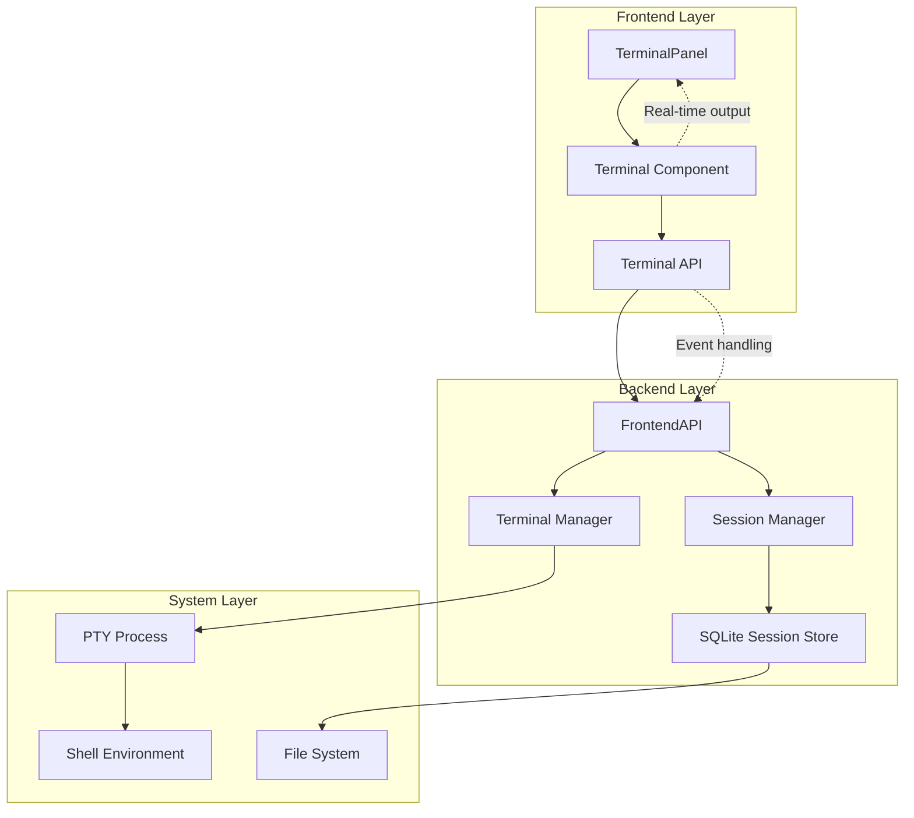
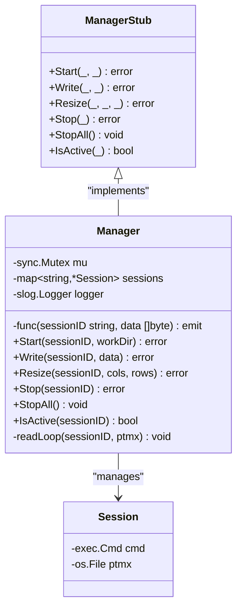
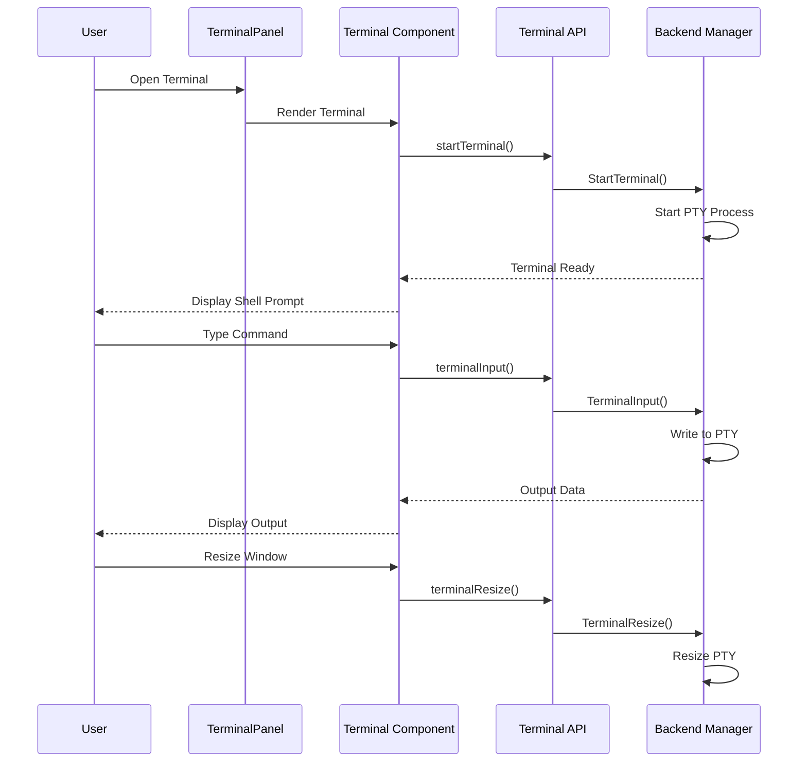
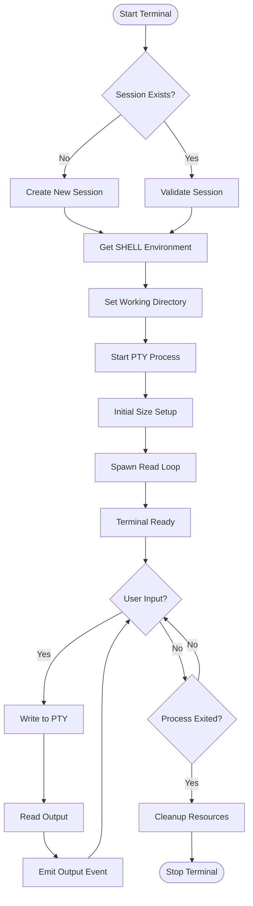
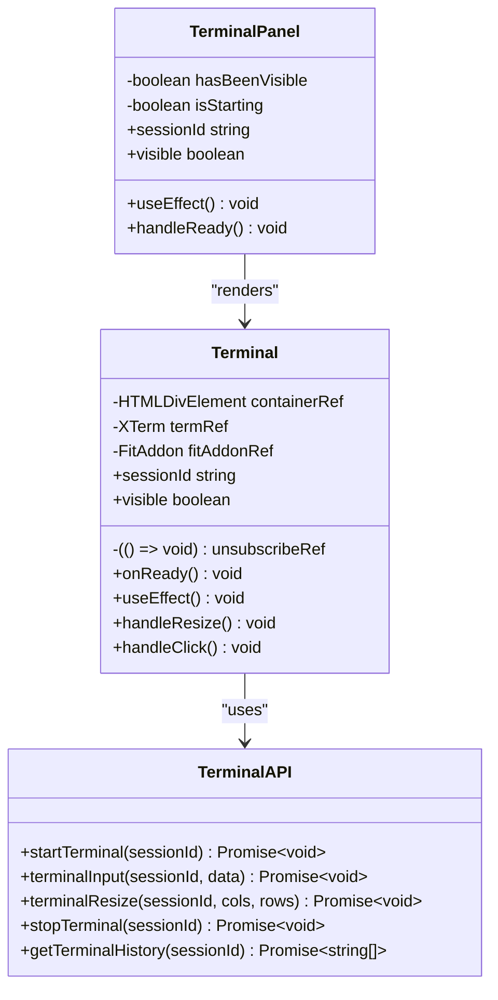
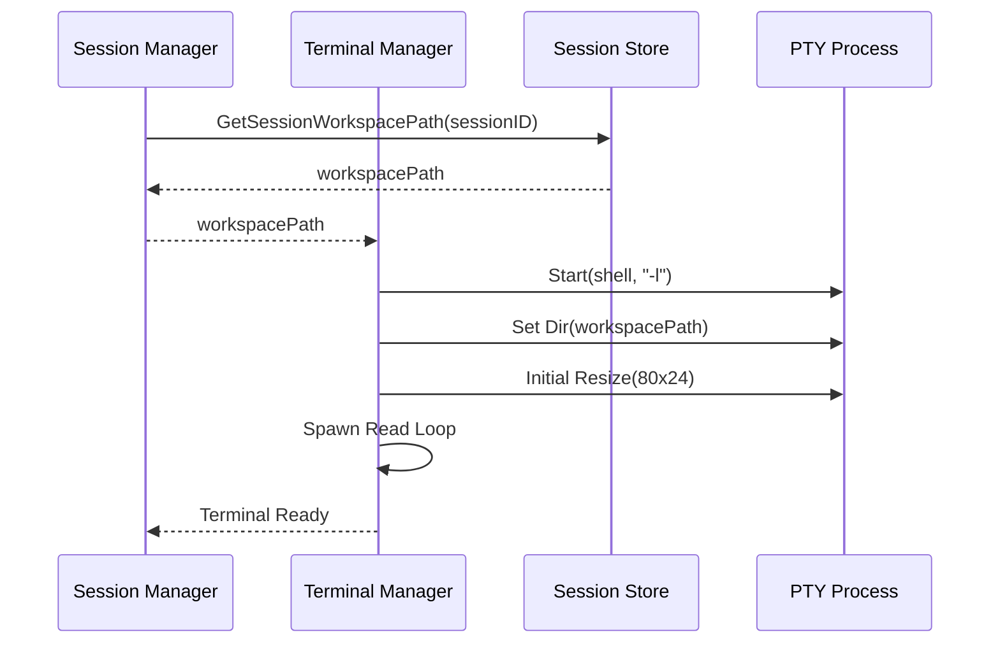
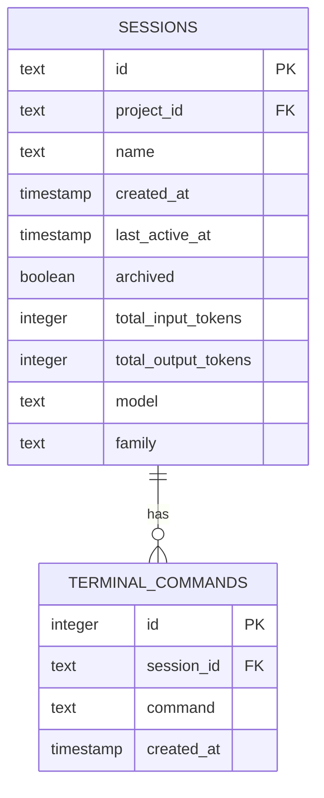
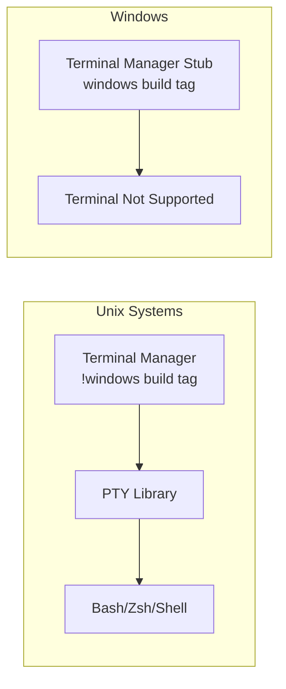
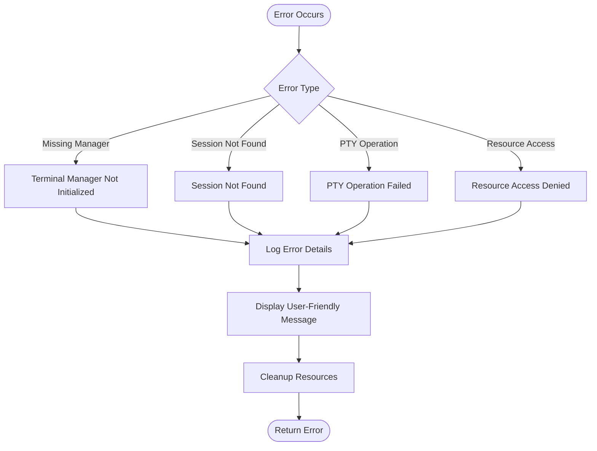

# Terminal Emulation System

<cite>
**Referenced Files in This Document**
- [backend/frontend_api_terminal.go](file://backend/frontend_api_terminal.go)
- [backend/terminal/manager.go](file://backend/terminal/manager.go)
- [backend/terminal/manager_stub.go](file://backend/terminal/manager_stub.go)
- [frontend/src/components/terminal/Terminal.tsx](file://frontend/src/components/terminal/Terminal.tsx)
- [frontend/src/components/terminal/TerminalPanel.tsx](file://frontend/src/components/terminal/TerminalPanel.tsx)
- [frontend/src/api/terminal.ts](file://frontend/src/api/terminal.ts)
- [backend/session/manager.go](file://backend/session/manager.go)
- [backend/session/persistence.go](file://backend/session/persistence.go)
- [backend/application.go](file://backend/application.go)
- [frontend/src/stores/sessionStore.ts](file://frontend/src/stores/sessionStore.ts)
</cite>

## Table of Contents
1. [Introduction](#introduction)
2. [System Architecture](#system-architecture)
3. [Core Components](#core-components)
4. [Terminal Management](#terminal-management)
5. [Frontend Integration](#frontend-integration)
6. [Session Integration](#session-integration)
7. [Data Persistence](#data-persistence)
8. [Platform Support](#platform-support)
9. [Error Handling](#error-handling)
10. [Performance Considerations](#performance-considerations)
11. [Troubleshooting Guide](#troubleshooting-guide)
12. [Conclusion](#conclusion)

## Introduction

The Terminal Emulation System provides a PTY-based terminal interface for the desktop application, enabling users to interact with shell environments directly from the UI. This system integrates seamlessly with the broader session management framework, offering real-time terminal emulation with proper event handling, persistence, and cross-platform compatibility.

The system supports Unix-like systems through PTY (pseudo-terminal) functionality while providing graceful degradation on Windows platforms. It maintains full integration with the application's event-driven architecture, ensuring consistent user experience across all components.

## System Architecture

The Terminal Emulation System follows a layered architecture with clear separation of concerns between frontend presentation, backend terminal management, and session integration.

**Diagram sources**
- [frontend/src/components/terminal/TerminalPanel.tsx:1-47](file://frontend/src/components/terminal/TerminalPanel.tsx#L1-L47)
- [backend/frontend_api_terminal.go:1-74](file://backend/frontend_api_terminal.go#L1-L74)
- [backend/terminal/manager.go:1-194](file://backend/terminal/manager.go#L1-L194)

## Core Components

### Terminal Manager

The Terminal Manager serves as the central coordinator for PTY-based terminal sessions. It maintains thread-safe session management with proper resource cleanup and error handling.

**Diagram sources**
- [backend/terminal/manager.go:19-43](file://backend/terminal/manager.go#L19-L43)
- [backend/terminal/manager_stub.go:10-35](file://backend/terminal/manager_stub.go#L10-L35)

**Section sources**
- [backend/terminal/manager.go:19-194](file://backend/terminal/manager.go#L19-L194)
- [backend/terminal/manager_stub.go:10-35](file://backend/terminal/manager_stub.go#L10-L35)

### Frontend Terminal Component

The frontend terminal component provides a React-based interface using xterm.js for terminal rendering and user interaction.

**Diagram sources**
- [frontend/src/components/terminal/Terminal.tsx:20-117](file://frontend/src/components/terminal/Terminal.tsx#L20-L117)
- [frontend/src/api/terminal.ts:6-44](file://frontend/src/api/terminal.ts#L6-L44)
- [backend/frontend_api_terminal.go:11-28](file://backend/frontend_api_terminal.go#L11-L28)

**Section sources**
- [frontend/src/components/terminal/Terminal.tsx:14-144](file://frontend/src/components/terminal/Terminal.tsx#L14-L144)
- [frontend/src/api/terminal.ts:1-56](file://frontend/src/api/terminal.ts#L1-L56)

## Terminal Management

### PTY Process Lifecycle

The terminal management system handles the complete lifecycle of PTY processes, from creation to cleanup:

**Diagram sources**
- [backend/terminal/manager.go:47-83](file://backend/terminal/manager.go#L47-L83)
- [backend/terminal/manager.go:167-193](file://backend/terminal/manager.go#L167-L193)

### Session Coordination

The terminal system integrates with the session management framework to provide workspace-aware terminal sessions:

**Section sources**
- [backend/terminal/manager.go:47-140](file://backend/terminal/manager.go#L47-L140)
- [backend/frontend_api_terminal.go:11-28](file://backend/frontend_api_terminal.go#L11-L28)

## Frontend Integration

### Terminal Component Architecture

The frontend terminal component provides a comprehensive terminal interface with real-time interaction capabilities:

**Diagram sources**
- [frontend/src/components/terminal/Terminal.tsx:14-144](file://frontend/src/components/terminal/Terminal.tsx#L14-L144)
- [frontend/src/components/terminal/TerminalPanel.tsx:10-47](file://frontend/src/components/terminal/TerminalPanel.tsx#L10-L47)
- [frontend/src/api/terminal.ts:6-56](file://frontend/src/api/terminal.ts#L6-L56)

**Section sources**
- [frontend/src/components/terminal/Terminal.tsx:14-144](file://frontend/src/components/terminal/Terminal.tsx#L14-L144)
- [frontend/src/components/terminal/TerminalPanel.tsx:10-47](file://frontend/src/components/terminal/TerminalPanel.tsx#L10-L47)
- [frontend/src/api/terminal.ts:1-56](file://frontend/src/api/terminal.ts#L1-L56)

### Real-time Communication

The system implements bidirectional communication between frontend and backend through event-driven architecture:

**Section sources**
- [frontend/src/components/terminal/Terminal.tsx:70-73](file://frontend/src/components/terminal/Terminal.tsx#L70-L73)
- [backend/frontend_api_terminal.go:31-39](file://backend/frontend_api_terminal.go#L31-L39)

## Session Integration

### Workspace Management

The terminal system integrates with the session management framework to provide workspace-aware terminal sessions:

**Diagram sources**
- [backend/session/manager.go:628-635](file://backend/session/manager.go#L628-L635)
- [backend/frontend_api_terminal.go:19-22](file://backend/frontend_api_terminal.go#L19-L22)
- [backend/terminal/manager.go:60-72](file://backend/terminal/manager.go#L60-L72)

**Section sources**
- [backend/session/manager.go:628-635](file://backend/session/manager.go#L628-L635)
- [backend/application.go:136-138](file://backend/application.go#L136-L138)

### Event Propagation

The terminal system participates in the broader event-driven architecture of the application:

**Section sources**
- [backend/session/manager.go:483-491](file://backend/session/manager.go#L483-L491)
- [backend/session/events.go:12-191](file://backend/session/events.go#L12-L191)

## Data Persistence

### Terminal Command History

The system maintains persistent command history for each session, enabling users to review and reuse previous commands:

**Diagram sources**
- [backend/session/persistence.go:115-192](file://backend/session/persistence.go#L115-L192)
- [backend/session/persistence.go:455-467](file://backend/session/persistence.go#L455-L467)

### Storage Operations

The terminal command persistence follows standard CRUD operations with proper indexing for efficient retrieval:

**Section sources**
- [backend/session/persistence.go:455-509](file://backend/session/persistence.go#L455-L509)
- [frontend/src/api/terminal.ts:46-55](file://frontend/src/api/terminal.ts#L46-L55)

## Platform Support

### Cross-Platform Compatibility

The terminal system provides platform-specific implementations to ensure compatibility across different operating systems:

**Diagram sources**
- [backend/terminal/manager.go:1-1](file://backend/terminal/manager.go#L1-L1)
- [backend/terminal/manager_stub.go:1-2](file://backend/terminal/manager_stub.go#L1-L2)

### Windows Implementation

On Windows platforms, the system provides a no-op implementation that gracefully handles terminal operations:

**Section sources**
- [backend/terminal/manager_stub.go:18-35](file://backend/terminal/manager_stub.go#L18-L35)

## Error Handling

### Comprehensive Error Management

The terminal system implements robust error handling across all layers:

**Diagram sources**
- [backend/frontend_api_terminal.go:12-26](file://backend/frontend_api_terminal.go#L12-L26)
- [backend/terminal/manager.go:86-98](file://backend/terminal/manager.go#L86-L98)

### Error Recovery Strategies

The system employs multiple strategies for error recovery and user feedback:

**Section sources**
- [backend/frontend_api_terminal.go:12-26](file://backend/frontend_api_terminal.go#L12-L26)
- [frontend/src/components/terminal/Terminal.tsx:61-64](file://frontend/src/components/terminal/Terminal.tsx#L61-L64)

## Performance Considerations

### Memory Management

The terminal system implements efficient memory management for large outputs and concurrent operations:

- Buffer size optimization (4KB chunks)
- Proper resource cleanup on termination
- Thread-safe session management
- Efficient event emission

### Concurrency Patterns

The system uses goroutines for non-blocking I/O operations while maintaining thread safety:

**Section sources**
- [backend/terminal/manager.go:167-193](file://backend/terminal/manager.go#L167-L193)
- [backend/terminal/manager.go:77-77](file://backend/terminal/manager.go#L77-L77)

## Troubleshooting Guide

### Common Issues and Solutions

#### Terminal Fails to Start
- Verify PTY library availability
- Check shell environment variable (SHELL)
- Ensure proper permissions for temporary directories

#### Input Not Responding
- Confirm terminal is properly initialized
- Check for active session existence
- Verify event subscription is established

#### Output Display Issues
- Validate terminal resize operations
- Check buffer management
- Ensure proper encoding handling

### Debugging Procedures

**Section sources**
- [backend/terminal/manager.go:81-82](file://backend/terminal/manager.go#L81-L82)
- [frontend/src/components/terminal/Terminal.tsx:77-81](file://frontend/src/components/terminal/Terminal.tsx#L77-L81)

## Conclusion

The Terminal Emulation System provides a robust, cross-platform solution for interactive shell access within the desktop application. Through careful separation of concerns, comprehensive error handling, and seamless integration with the session management framework, it delivers a reliable terminal experience across different operating systems.

The system's architecture supports future enhancements including improved error recovery, enhanced logging capabilities, and expanded platform support. Its modular design ensures maintainability and extensibility while preserving backward compatibility.

Key strengths include:
- Thread-safe concurrent operation
- Comprehensive error handling and recovery
- Persistent command history
- Cross-platform compatibility
- Integration with the broader event-driven architecture
- Efficient resource management

The implementation demonstrates best practices in system design, providing a solid foundation for advanced terminal features and integrations.