# Terminal Emulation System

<cite>
**Referenced Files in This Document**
- [backend/frontend_api_terminal.go](file://backend/frontend_api_terminal.go)
- [backend/terminal/manager.go](file://backend/terminal/manager.go)
- [backend/terminal/manager_stub.go](file://backend/terminal/manager_stub.go)
- [frontend/src/components/terminal/Terminal.tsx](file://frontend/src/components/terminal/Terminal.tsx)
- [frontend/src/components/terminal/TerminalPanel.tsx](file://frontend/src/components/terminal/TerminalPanel.tsx)
- [frontend/src/hooks/useXTermTheme.ts](file://frontend/src/hooks/useXTermTheme.ts)
- [frontend/src/api/terminal.ts](file://frontend/src/api/terminal.ts)
- [frontend/src/index.css](file://frontend/src/index.css)
- [backend/session/manager.go](file://backend/session/manager.go)
- [backend/session/persistence.go](file://backend/session/persistence.go)
- [backend/application.go](file://backend/application.go)
- [frontend/src/stores/sessionStore.ts](file://frontend/src/stores/sessionStore.ts)
- [backend/session/events.go](file://backend/session/events.go)
- [backend/session/types.go](file://backend/session/types.go)
</cite>

## Update Summary
**Changes Made**
- Enhanced terminal output handling with base64 encoding to preserve raw bytes through JSON serialization
- Updated Terminal Component Architecture section to include base64 decoding for terminal output
- Improved Frontend Integration section with enhanced error handling for binary data
- Updated Terminal Theming System section to reflect dynamic CSS-based theme resolution
- Added new Base64 Encoding for Raw Bytes section documenting the preservation mechanism
- Enhanced troubleshooting guide with base64-related debugging procedures

## Table of Contents
1. [Introduction](#introduction)
2. [System Architecture](#system-architecture)
3. [Core Components](#core-components)
4. [Terminal Management](#terminal-management)
5. [Base64 Encoding for Raw Bytes](#base64-encoding-for-raw-bytes)
6. [Terminal Theming System](#terminal-theming-system)
7. [Frontend Integration](#frontend-integration)
8. [Session Integration](#session-integration)
9. [Data Persistence](#data-persistence)
10. [Platform Support](#platform-support)
11. [Error Handling](#error-handling)
12. [Performance Considerations](#performance-considerations)
13. [Troubleshooting Guide](#troubleshooting-guide)
14. [Conclusion](#conclusion)

## Introduction

The Terminal Emulation System provides a PTY-based terminal interface for the desktop application, enabling users to interact with shell environments directly from the UI. This system integrates seamlessly with the broader session management framework, offering real-time terminal emulation with proper event handling, persistence, and cross-platform compatibility.

The system supports Unix-like systems through PTY (pseudo-terminal) functionality while providing graceful degradation on Windows platforms. It maintains full integration with the application's event-driven architecture, ensuring consistent user experience across all components.

**Updated** The system now features enhanced terminal output handling that preserves raw PTY bytes through base64 encoding during JSON serialization, preventing corruption of escape sequences used by shell completion, autosuggestions, and cursor movement. Additionally, it includes a comprehensive terminal theming system that dynamically applies CSS custom properties to xterm.js themes.

## System Architecture

The Terminal Emulation System follows a layered architecture with clear separation of concerns between frontend presentation, backend terminal management, and session integration.

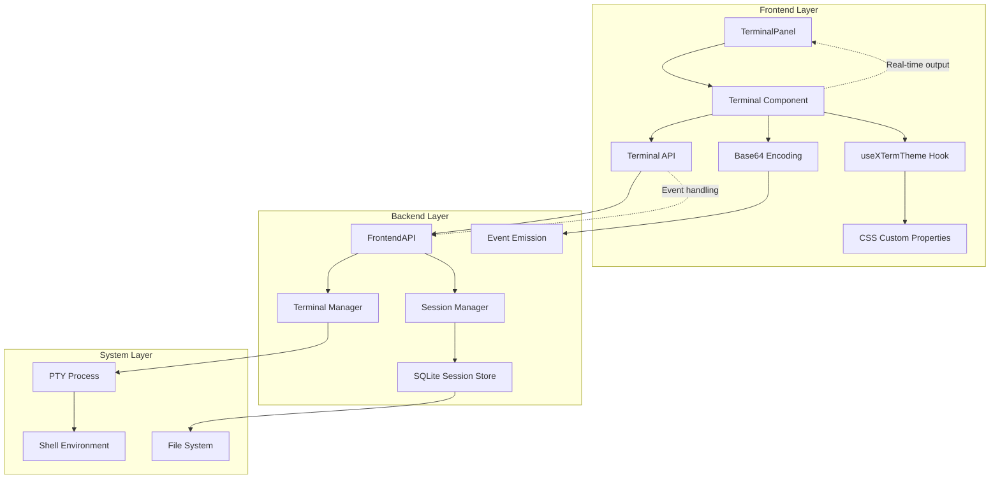

**Diagram sources**
- [frontend/src/components/terminal/TerminalPanel.tsx:1-47](file://frontend/src/components/terminal/TerminalPanel.tsx#L1-L47)
- [frontend/src/components/terminal/Terminal.tsx:1-134](file://frontend/src/components/terminal/Terminal.tsx#L1-L134)
- [frontend/src/hooks/useXTermTheme.ts:1-90](file://frontend/src/hooks/useXTermTheme.ts#L1-L90)
- [backend/frontend_api_terminal.go:1-74](file://backend/frontend_api_terminal.go#L1-L74)
- [backend/terminal/manager.go:1-194](file://backend/terminal/manager.go#L1-L194)

## Core Components

### Terminal Manager

The Terminal Manager serves as the central coordinator for PTY-based terminal sessions. It maintains thread-safe session management with proper resource cleanup and error handling.

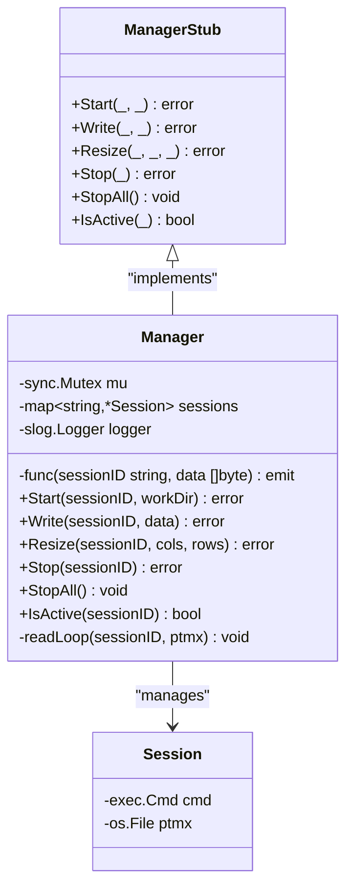

**Diagram sources**
- [backend/terminal/manager.go:19-43](file://backend/terminal/manager.go#L19-L43)
- [backend/terminal/manager_stub.go:10-35](file://backend/terminal/manager_stub.go#L10-L35)

**Section sources**
- [backend/terminal/manager.go:19-194](file://backend/terminal/manager.go#L19-L194)
- [backend/terminal/manager_stub.go:10-35](file://backend/terminal/manager_stub.go#L10-L35)

### Frontend Terminal Component

The frontend terminal component provides a React-based interface using xterm.js for terminal rendering and user interaction.

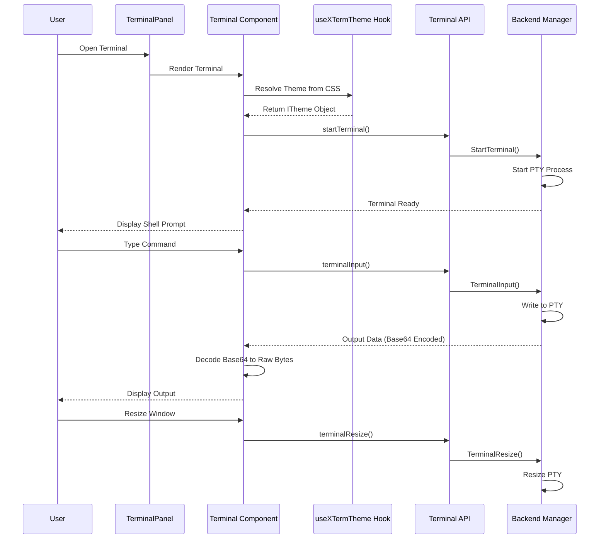

**Diagram sources**
- [frontend/src/components/terminal/Terminal.tsx:20-117](file://frontend/src/components/terminal/Terminal.tsx#L20-L117)
- [frontend/src/hooks/useXTermTheme.ts:81-89](file://frontend/src/hooks/useXTermTheme.ts#L81-L89)
- [frontend/src/api/terminal.ts:6-44](file://frontend/src/api/terminal.ts#L6-L44)
- [backend/frontend_api_terminal.go:11-28](file://backend/frontend_api_terminal.go#L11-L28)

**Section sources**
- [frontend/src/components/terminal/Terminal.tsx:14-144](file://frontend/src/components/terminal/Terminal.tsx#L14-L144)
- [frontend/src/api/terminal.ts:1-56](file://frontend/src/api/terminal.ts#L1-L56)

## Terminal Management

### PTY Process Lifecycle

The terminal management system handles the complete lifecycle of PTY processes, from creation to cleanup:

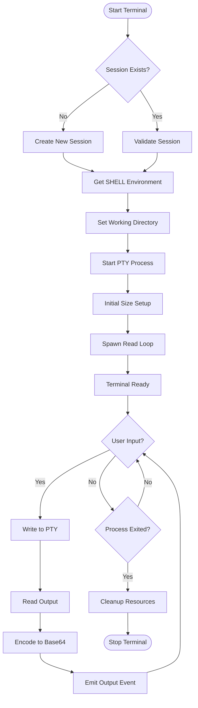

**Diagram sources**
- [backend/terminal/manager.go:47-83](file://backend/terminal/manager.go#L47-L83)
- [backend/terminal/manager.go:167-193](file://backend/terminal/manager.go#L167-L193)

### Session Coordination

The terminal system integrates with the session management framework to provide workspace-aware terminal sessions:

**Section sources**
- [backend/terminal/manager.go:47-140](file://backend/terminal/manager.go#L47-L140)
- [backend/frontend_api_terminal.go:11-28](file://backend/frontend_api_terminal.go#L11-L28)

## Base64 Encoding for Raw Bytes

**New Section** The terminal system implements base64 encoding to preserve raw PTY bytes during JSON serialization, preventing corruption of escape sequences and multi-byte character sequences.

### Encoding Strategy

The system uses base64 encoding to ensure that raw PTY output maintains its integrity when transmitted through JSON-based event systems:

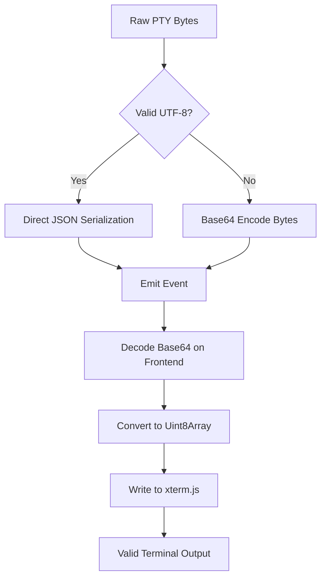

**Diagram sources**
- [frontend/src/components/terminal/Terminal.tsx:51-62](file://frontend/src/components/terminal/Terminal.tsx#L51-L62)
- [backend/terminal/manager.go:197-224](file://backend/terminal/manager.go#L197-L224)

### Frontend Decoding Process

The frontend component handles base64 decoding to restore raw binary data:

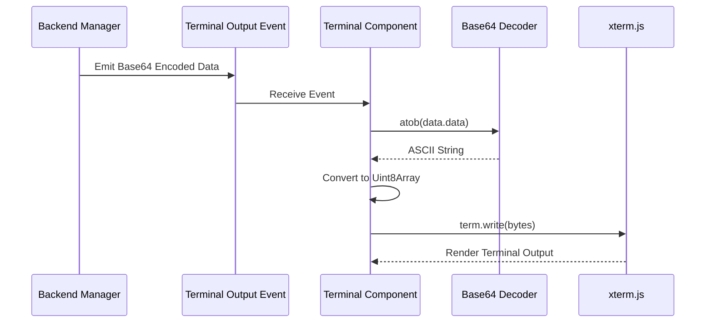

**Diagram sources**
- [frontend/src/components/terminal/Terminal.tsx:51-62](file://frontend/src/components/terminal/Terminal.tsx#L51-L62)

### Benefits of Base64 Encoding

The base64 encoding approach provides several critical benefits:

- **Preserves Escape Sequences**: Shell completion, autosuggestions, and cursor movement escape sequences remain intact
- **Handles Multi-byte Characters**: Properly manages UTF-8 sequences that may be split across read boundaries
- **Maintains Binary Integrity**: Raw terminal control characters are preserved without corruption
- **JSON-Compatible**: Ensures safe transmission through JSON-based event systems

**Section sources**
- [frontend/src/components/terminal/Terminal.tsx:51-62](file://frontend/src/components/terminal/Terminal.tsx#L51-L62)
- [backend/terminal/manager.go:197-224](file://backend/terminal/manager.go#L197-L224)

## Terminal Theming System

**Updated** The terminal theming system provides dynamic, CSS-based theming for the xterm.js terminal component, ensuring seamless integration with the application's design system.

### useXTermTheme Hook Architecture

The `useXTermTheme` hook serves as the central mechanism for resolving terminal themes from CSS custom properties:

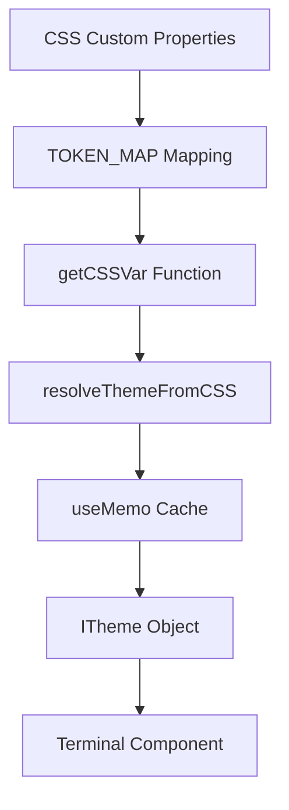

**Diagram sources**
- [frontend/src/hooks/useXTermTheme.ts:43-64](file://frontend/src/hooks/useXTermTheme.ts#L43-L64)
- [frontend/src/hooks/useXTermTheme.ts:70-79](file://frontend/src/hooks/useXTermTheme.ts#L70-L79)
- [frontend/src/hooks/useXTermTheme.ts:87-89](file://frontend/src/hooks/useXTermTheme.ts#L87-L89)

### CSS Custom Property Mapping

The theming system maps XTerm theme tokens to CSS custom properties defined in the design system:

| XTerm Token | CSS Variable | Purpose |
|-------------|--------------|---------|
| `background` | `--color-popover` | Terminal background color |
| `foreground` | `--color-foreground` | Default text color |
| `cursor` | `--color-terminal-cursor` | Cursor color |
| `selectionBackground` | `--color-terminal-selection` | Selection highlight |
| `black` | `--color-background` | ANSI black |
| `red` | `--color-destructive` | ANSI red |
| `green` | `--color-success` | ANSI green |
| `yellow` | `--color-highlight` | ANSI yellow |
| `blue` | `--color-info` | ANSI blue |
| `magenta` | `--color-hljs-keyword` | ANSI magenta |
| `cyan` | `--color-hljs-literal` | ANSI cyan |
| `white` | `--color-foreground` | ANSI white |
| `brightBlack` | `--color-hljs-comment` | ANSI bright black |
| `brightRed` | `--color-destructive` | ANSI bright red |
| `brightGreen` | `--color-success` | ANSI bright green |
| `brightYellow` | `--color-highlight` | ANSI bright yellow |
| `brightBlue` | `--color-info` | ANSI bright blue |
| `brightMagenta` | `--color-hljs-keyword` | ANSI bright magenta |
| `brightCyan` | `--color-hljs-literal` | ANSI bright cyan |
| `brightWhite` | `--color-terminal-bright-white` | ANSI bright white |

### Theme Resolution Process

The theme resolution process follows a systematic approach to ensure optimal performance and compatibility:

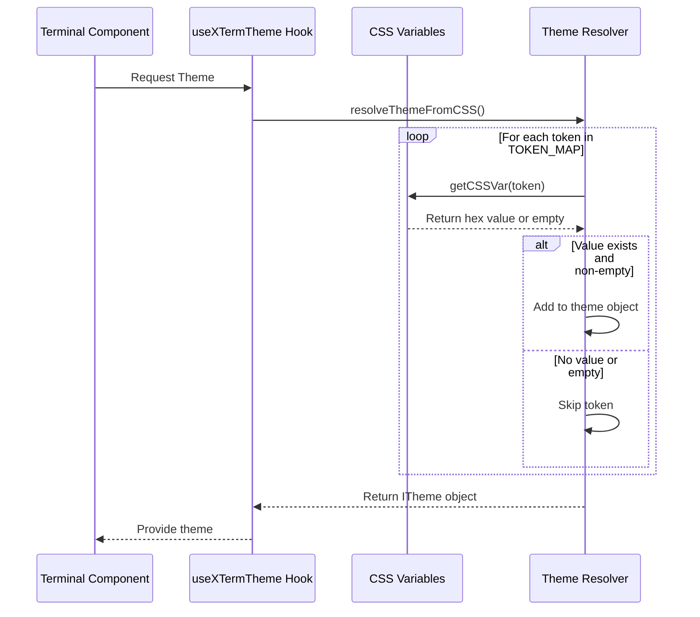

**Diagram sources**
- [frontend/src/hooks/useXTermTheme.ts:70-79](file://frontend/src/hooks/useXTermTheme.ts#L70-L79)
- [frontend/src/hooks/useXTermTheme.ts:34-36](file://frontend/src/hooks/useXTermTheme.ts#L34-L36)

**Section sources**
- [frontend/src/hooks/useXTermTheme.ts:1-90](file://frontend/src/hooks/useXTermTheme.ts#L1-L90)
- [frontend/src/index.css:61-64](file://frontend/src/index.css#L61-L64)

## Frontend Integration

### Terminal Component Architecture

The frontend terminal component provides a comprehensive terminal interface with real-time interaction capabilities and dynamic theming:

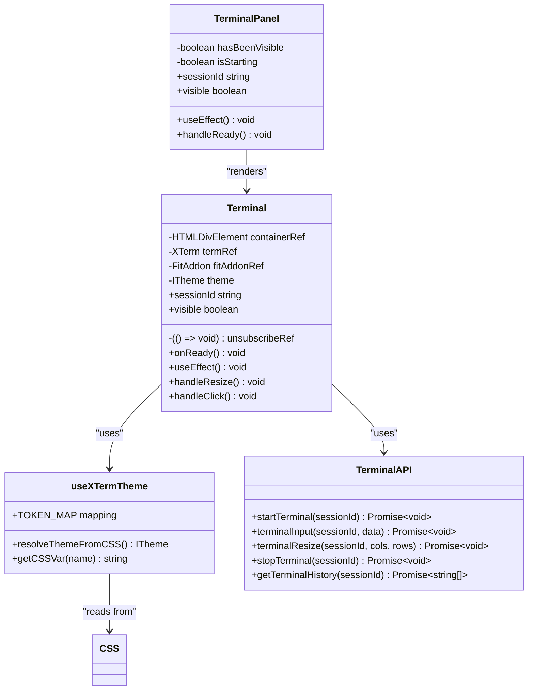

**Diagram sources**
- [frontend/src/components/terminal/Terminal.tsx:14-144](file://frontend/src/components/terminal/Terminal.tsx#L14-L144)
- [frontend/src/hooks/useXTermTheme.ts:81-89](file://frontend/src/hooks/useXTermTheme.ts#L81-L89)
- [frontend/src/components/terminal/TerminalPanel.tsx:10-47](file://frontend/src/components/terminal/TerminalPanel.tsx#L10-L47)
- [frontend/src/api/terminal.ts:6-56](file://frontend/src/api/terminal.ts#L6-L56)

**Updated** The Terminal component now integrates the `useXTermTheme` hook to dynamically apply CSS-based themes, eliminating the need for hardcoded theme configurations and ensuring consistency with the application's design system. The component also implements enhanced error handling for base64 decoding operations.

**Section sources**
- [frontend/src/components/terminal/Terminal.tsx:14-144](file://frontend/src/components/terminal/Terminal.tsx#L14-L144)
- [frontend/src/components/terminal/TerminalPanel.tsx:10-47](file://frontend/src/components/terminal/TerminalPanel.tsx#L10-L47)
- [frontend/src/api/terminal.ts:1-56](file://frontend/src/api/terminal.ts#L1-L56)

### Real-time Communication

The system implements bidirectional communication between frontend and backend through event-driven architecture:

**Section sources**
- [frontend/src/components/terminal/Terminal.tsx:70-73](file://frontend/src/components/terminal/Terminal.tsx#L70-L73)
- [backend/frontend_api_terminal.go:31-39](file://backend/frontend_api_terminal.go#L31-L39)

## Session Integration

### Workspace Management

The terminal system integrates with the session management framework to provide workspace-aware terminal sessions:

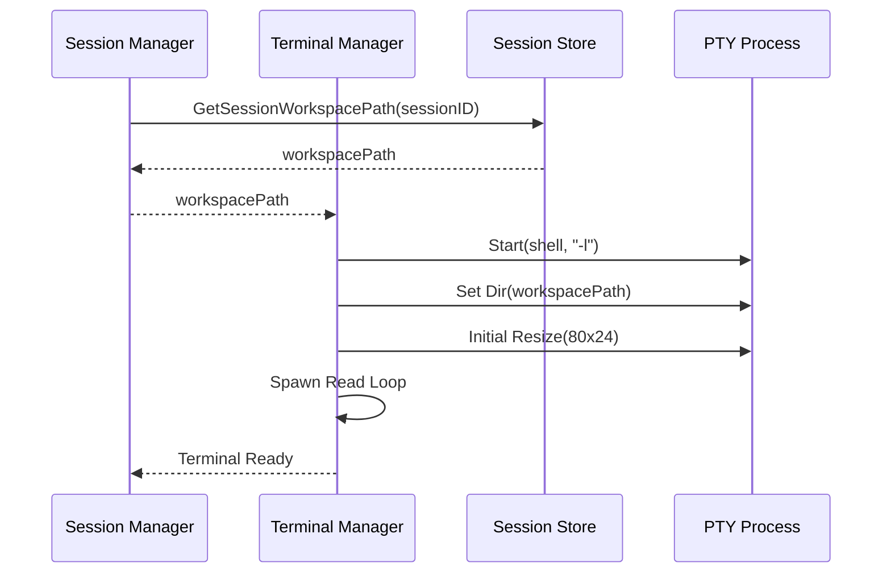

**Diagram sources**
- [backend/session/manager.go:628-635](file://backend/session/manager.go#L628-L635)
- [backend/frontend_api_terminal.go:19-22](file://backend/frontend_api_terminal.go#L19-L22)
- [backend/terminal/manager.go:60-72](file://backend/terminal/manager.go#L60-L72)

**Section sources**
- [backend/session/manager.go:628-635](file://backend/session/manager.go#L628-L635)
- [backend/application.go:136-138](file://backend/application.go#L136-L138)

### Event Propagation

The terminal system participates in the broader event-driven architecture of the application:

**Section sources**
- [backend/session/manager.go:483-491](file://backend/session/manager.go#L483-L491)
- [backend/session/events.go:12-191](file://backend/session/events.go#L12-L191)

## Data Persistence

### Terminal Command History

The system maintains persistent command history for each session, enabling users to review and reuse previous commands:

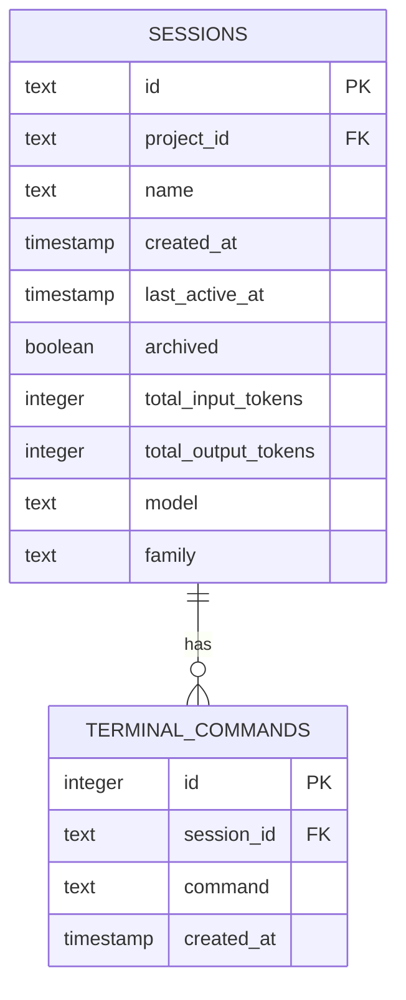

**Diagram sources**
- [backend/session/persistence.go:115-192](file://backend/session/persistence.go#L115-L192)
- [backend/session/persistence.go:455-467](file://backend/session/persistence.go#L455-L467)

### Storage Operations

The terminal command persistence follows standard CRUD operations with proper indexing for efficient retrieval:

**Section sources**
- [backend/session/persistence.go:455-509](file://backend/session/persistence.go#L455-L509)
- [frontend/src/api/terminal.ts:46-55](file://frontend/src/api/terminal.ts#L46-L55)

## Platform Support

### Cross-Platform Compatibility

The terminal system provides platform-specific implementations to ensure compatibility across different operating systems:

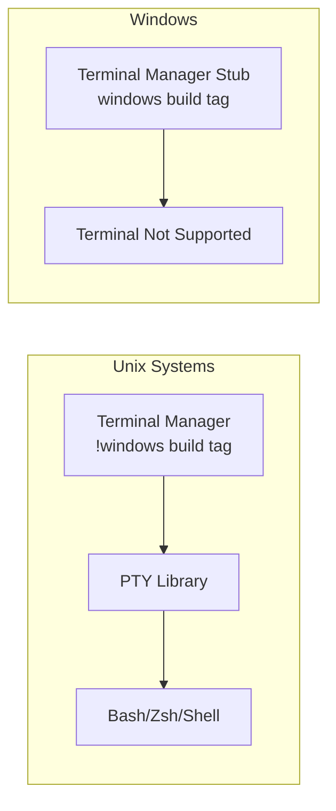

**Diagram sources**
- [backend/terminal/manager.go:1-1](file://backend/terminal/manager.go#L1-L1)
- [backend/terminal/manager_stub.go:1-2](file://backend/terminal/manager_stub.go#L1-L2)

### Windows Implementation

On Windows platforms, the system provides a no-op implementation that gracefully handles terminal operations:

**Section sources**
- [backend/terminal/manager_stub.go:18-35](file://backend/terminal/manager_stub.go#L18-L35)

## Error Handling

### Comprehensive Error Management

The terminal system implements robust error handling across all layers:

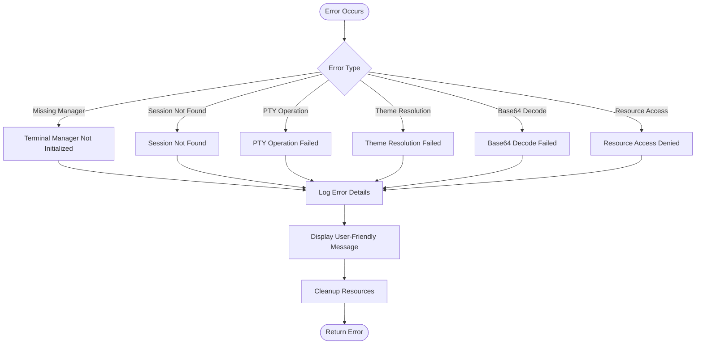

**Diagram sources**
- [backend/frontend_api_terminal.go:12-26](file://backend/frontend_api_terminal.go#L12-L26)
- [backend/terminal/manager.go:86-98](file://backend/terminal/manager.go#L86-L98)
- [frontend/src/hooks/useXTermTheme.ts:70-79](file://frontend/src/hooks/useXTermTheme.ts#L70-L79)

### Error Recovery Strategies

The system employs multiple strategies for error recovery and user feedback:

**Updated** Enhanced error handling for base64 decoding operations with fallback mechanisms to prevent terminal corruption.

**Section sources**
- [backend/frontend_api_terminal.go:12-26](file://backend/frontend_api_terminal.go#L12-L26)
- [frontend/src/components/terminal/Terminal.tsx:61-64](file://frontend/src/components/terminal/Terminal.tsx#L61-L64)

## Performance Considerations

### Memory Management

The terminal system implements efficient memory management for large outputs and concurrent operations:

- Buffer size optimization (4KB chunks)
- Proper resource cleanup on termination
- Thread-safe session management
- Efficient event emission
- **Updated** Memoized theme resolution to prevent unnecessary re-computation
- **Updated** Base64 encoding overhead minimized through efficient conversion algorithms

### Concurrency Patterns

The system uses goroutines for non-blocking I/O operations while maintaining thread safety:

**Section sources**
- [backend/terminal/manager.go:167-193](file://backend/terminal/manager.go#L167-L193)
- [backend/terminal/manager.go:77-77](file://backend/terminal/manager.go#L77-L77)

## Troubleshooting Guide

### Common Issues and Solutions

#### Terminal Fails to Start
- Verify PTY library availability
- Check shell environment variable (SHELL)
- Ensure proper permissions for temporary directories

#### Input Not Responding
- Confirm terminal is properly initialized
- Check for active session existence
- Verify event subscription is established

#### Output Display Issues
- Validate terminal resize operations
- Check buffer management
- Ensure proper encoding handling
- **Updated** Verify base64 decoding is functioning correctly

#### **New** Theme Not Applying
- Verify CSS custom properties are defined in `:root`
- Check that `useXTermTheme` hook is properly imported and used
- Ensure theme tokens match the expected XTerm token names
- Confirm CSS variables resolve to valid hex color values

#### **New** Base64 Decoding Errors
- Verify that backend is sending base64-encoded data
- Check browser console for decode errors
- Ensure proper MIME type handling for binary data
- Validate that escape sequences are preserved after decoding

### Debugging Procedures

**Updated** Enhanced debugging procedures for base64 encoding/decoding issues:

1. **Backend Verification**: Check that terminal output is being base64 encoded before emission
2. **Frontend Inspection**: Monitor network traffic for proper base64 data transmission
3. **Console Logging**: Enable detailed logging for decode operations
4. **Escape Sequence Testing**: Verify that terminal control sequences remain intact after processing

**Section sources**
- [backend/terminal/manager.go:81-82](file://backend/terminal/manager.go#L81-L82)
- [frontend/src/components/terminal/Terminal.tsx:77-81](file://frontend/src/components/terminal/Terminal.tsx#L77-L81)

## Conclusion

The Terminal Emulation System provides a robust, cross-platform solution for interactive shell access within the desktop application. Through careful separation of concerns, comprehensive error handling, and seamless integration with the session management framework, it delivers a reliable terminal experience across different operating systems.

**Updated** The system's architecture now includes sophisticated enhancements including base64 encoding for raw byte preservation and a comprehensive terminal theming system that dynamically applies CSS custom properties to xterm.js themes. These improvements eliminate the risk of escape sequence corruption and ensure perfect visual consistency with the application's design system.

The system's architecture supports future enhancements including improved error recovery, enhanced logging capabilities, and expanded platform support. Its modular design ensures maintainability and extensibility while preserving backward compatibility.

Key strengths include:
- Thread-safe concurrent operation
- Comprehensive error handling and recovery
- Persistent command history
- Cross-platform compatibility
- Integration with the broader event-driven architecture
- Efficient resource management
- **New** Dynamic CSS-based terminal theming system
- **New** Base64 encoding for raw byte preservation
- **New** Enhanced escape sequence handling

The implementation demonstrates best practices in system design, providing a solid foundation for advanced terminal features and integrations.