# Chat Interface Components

<cite>
**Referenced Files in This Document**
- [AssistantMessage.tsx](file://frontend/src/components/chat/AssistantMessage.tsx)
- [UserMessage.tsx](file://frontend/src/components/chat/UserMessage.tsx)
- [ChatInput.tsx](file://frontend/src/components/chat/ChatInput.tsx)
- [ChatArea.tsx](file://frontend/src/components/chat/ChatArea.tsx)
- [ChatMessageRenderer.tsx](file://frontend/src/components/chat/ChatMessageRenderer.tsx)
- [PlanView.tsx](file://frontend/src/components/chat/PlanView.tsx)
- [DAGGraph.tsx](file://frontend/src/components/chat/DAGGraph.tsx)
- [ExecutionPanels.tsx](file://frontend/src/components/chat/ExecutionPanels.tsx)
- [ThoughtBlock.tsx](file://frontend/src/components/chat/ThoughtBlock.tsx)
- [ReflectionBlock.tsx](file://frontend/src/components/chat/ReflectionBlock.tsx)
- [ToolBlock.tsx](file://frontend/src/components/chat/ToolBlock.tsx)
- [PlanStepBlock.tsx](file://frontend/src/components/chat/PlanStepBlock.tsx)
- [ThoughtGroupBlock.tsx](file://frontend/src/components/chat/ThoughtGroupBlock.tsx)
- [CollapsibleBlock.tsx](file://frontend/src/components/chat/CollapsibleBlock.tsx)
- [ScrollContext.tsx](file://frontend/src/components/chat/ScrollContext.tsx)
- [ToolContentBlock.tsx](file://frontend/src/components/chat/ToolContentBlock.tsx)
- [chatUtils.ts](file://frontend/src/lib/chatUtils.ts)
- [chatUtilsHelpers.ts](file://frontend/src/lib/chatUtilsHelpers.ts)
- [chatGroupingHandlers.ts](file://frontend/src/lib/chatGroupingHandlers.ts)
- [planStore.ts](file://frontend/src/stores/planStore.ts)
- [chatStore.ts](file://frontend/src/stores/chatStore.ts)
- [panelStore.ts](file://frontend/src/stores/panelStore.ts)
- [dagLayout.ts](file://frontend/src/lib/dagLayout.ts)
- [markdownConfig.tsx](file://frontend/src/lib/markdownConfig.tsx)
</cite>

## Update Summary
**Changes Made**
- Added new CollapsibleBlock component as the foundation for all collapsible UI elements
- Introduced ScrollContext for step navigation coordination across components
- Added ToolContentBlock for unified tool arguments/results display with show-more functionality
- Completely rewrote chatUtils.ts and chatUtilsHelpers.ts with advanced message grouping capabilities
- Updated chatGroupingHandlers.ts with specialized handlers for plan steps, tools, and actions
- Migrated from panel-based to plan-based architecture with planStore integration
- Updated all specialized blocks (ThoughtBlock, ReflectionBlock, ToolBlock, PlanStepBlock) to use CollapsibleBlock
- Enhanced ExecutionPanels to work with the new plan-based system
- Updated ChatMessageRenderer to use the new component architecture

## Table of Contents
1. [Introduction](#introduction)
2. [Project Structure](#project-structure)
3. [Core Components](#core-components)
4. [Architecture Overview](#architecture-overview)
5. [Detailed Component Analysis](#detailed-component-analysis)
6. [Dependency Analysis](#dependency-analysis)
7. [Performance Considerations](#performance-considerations)
8. [Accessibility Features](#accessibility-features)
9. [Customization Options](#customization-options)
10. [Troubleshooting Guide](#troubleshooting-guide)
11. [Conclusion](#conclusion)

## Introduction
This document provides comprehensive documentation for C0WRK's chat interface components. It covers the core messaging components (AssistantMessage, UserMessage, ChatInput), specialized execution visualization components (PlanView, DAGGraph, ExecutionPanels), and the rendering pipeline (ChatArea, ChatMessageRenderer) along with specialized blocks (ThoughtBlock, ReflectionBlock, ToolBlock). The system has been completely rewritten with a new plan-based architecture featuring CollapsibleBlock.tsx, ScrollContext.tsx, and ToolContentBlock.tsx, providing enhanced message grouping capabilities and improved component composition patterns.

## Project Structure
The chat UI is organized under frontend/src/components/chat with supporting libraries and stores under frontend/src/lib and frontend/src/stores respectively. The key areas are:
- Messaging and input: AssistantMessage, UserMessage, ChatInput
- Rendering pipeline: ChatArea, ChatMessageRenderer
- Specialized blocks: ThoughtBlock, ReflectionBlock, ToolBlock, ThoughtGroupBlock, PlanStepBlock
- Foundation components: CollapsibleBlock, ToolContentBlock, ScrollContext
- Execution visualization: PlanView, DAGGraph, ExecutionPanels
- Stores: chatStore (message grouping and UI state), planStore (execution plan state), dagLayout (DAG layout computation)
- Utilities: markdownConfig (ReactMarkdown configuration), chatUtils (advanced history conversion), chatUtilsHelpers (message grouping helpers), chatGroupingHandlers (specialized handlers)

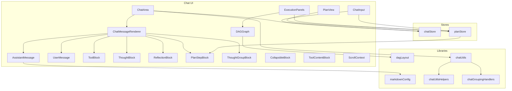

**Diagram sources**
- [ChatArea.tsx:17-146](file://frontend/src/components/chat/ChatArea.tsx#L17-L146)
- [ChatMessageRenderer.tsx:1-126](file://frontend/src/components/chat/ChatMessageRenderer.tsx#L1-L126)
- [AssistantMessage.tsx:25-90](file://frontend/src/components/chat/AssistantMessage.tsx#L25-L90)
- [UserMessage.tsx:10-104](file://frontend/src/components/chat/UserMessage.tsx#L10-L104)
- [ChatInput.tsx:13-192](file://frontend/src/components/chat/ChatInput.tsx#L13-L192)
- [PlanView.tsx:1-65](file://frontend/src/components/chat/PlanView.tsx#L1-L65)
- [DAGGraph.tsx:13-88](file://frontend/src/components/chat/DAGGraph.tsx#L13-L88)
- [ExecutionPanels.tsx:1-61](file://frontend/src/components/chat/ExecutionPanels.tsx#L1-L61)
- [ToolBlock.tsx:1-38](file://frontend/src/components/chat/ToolBlock.tsx#L1-L38)
- [ThoughtBlock.tsx:1-45](file://frontend/src/components/chat/ThoughtBlock.tsx#L1-L45)
- [ReflectionBlock.tsx:1-63](file://frontend/src/components/chat/ReflectionBlock.tsx#L1-L63)
- [PlanStepBlock.tsx:1-78](file://frontend/src/components/chat/PlanStepBlock.tsx#L1-L78)
- [ThoughtGroupBlock.tsx:13-45](file://frontend/src/components/chat/ThoughtGroupBlock.tsx#L13-L45)
- [CollapsibleBlock.tsx:1-67](file://frontend/src/components/chat/CollapsibleBlock.tsx#L1-L67)
- [ToolContentBlock.tsx:1-78](file://frontend/src/components/chat/ToolContentBlock.tsx#L1-L78)
- [ScrollContext.tsx:1-37](file://frontend/src/components/chat/ScrollContext.tsx#L1-L37)
- [chatStore.ts:468-570](file://frontend/src/stores/chatStore.ts#L468-L570)
- [planStore.ts:1-100](file://frontend/src/stores/planStore.ts#L1-L100)
- [markdownConfig.tsx:27-77](file://frontend/src/lib/markdownConfig.tsx#L27-L77)
- [dagLayout.ts:33-237](file://frontend/src/lib/dagLayout.ts#L33-L237)
- [chatUtils.ts:1-176](file://frontend/src/lib/chatUtils.ts#L1-L176)
- [chatUtilsHelpers.ts:1-186](file://frontend/src/lib/chatUtilsHelpers.ts#L1-L186)
- [chatGroupingHandlers.ts:1-158](file://frontend/src/lib/chatGroupingHandlers.ts#L1-L158)

**Section sources**
- [ChatArea.tsx:17-146](file://frontend/src/components/chat/ChatArea.tsx#L17-L146)
- [ChatMessageRenderer.tsx:1-126](file://frontend/src/components/chat/ChatMessageRenderer.tsx#L1-L126)
- [chatStore.ts:468-570](file://frontend/src/stores/chatStore.ts#L468-L570)
- [planStore.ts:1-100](file://frontend/src/stores/planStore.ts#L1-L100)

## Core Components
This section documents the primary chat components and their responsibilities, now built on the new foundation architecture.

- AssistantMessage
  - Purpose: Renders assistant messages with optional raw/source toggle and streaming cursor.
  - Props: content (string), isStreaming (boolean, optional).
  - Rendering logic: Uses ReactMarkdown with plugins for GFM, emoji, breaks, syntax highlighting, sanitization, external links, slugs, and autolinks. Provides a toggle to view raw Markdown with highlight.js. Includes an ErrorBoundary around the renderer.
  - Accessibility: Hover-triggered button with aria-label; stream cursor is visually indicated.
  - Customization: Uses markdownComponents and customSchema from markdownConfig.

- UserMessage
  - Purpose: Renders user messages with timestamp and optional pinning behavior.
  - Props: content (string), timestamp (number), isPinned (boolean, optional), maxHeight (number, optional).
  - Rendering logic: Non-pinned renders a standard bubble; pinned messages can overflow with a gradient mask and expand/collapse behavior controlled by ResizeObserver and keyboard focus.
  - Accessibility: Proper roles, tabindex, aria-expanded for clipped pinned messages; focus blur handling to collapse.

- ChatInput
  - Purpose: Text input for user messages with auto-resize, send/cancel controls, and optimistic UI updates.
  - Props: None (uses stores/hooks internally).
  - Interaction pattern: Optimistically adds user message; creates session if missing; marks task active; sends via Wails API; handles cancellation; disables input when blocked; shows blocking message.
  - State management: Uses sessionStore, projectStore, chatStore, and Wails hook; manages textarea height and placeholder text dynamically.

**Section sources**
- [AssistantMessage.tsx:20-90](file://frontend/src/components/chat/AssistantMessage.tsx#L20-L90)
- [markdownConfig.tsx:27-77](file://frontend/src/lib/markdownConfig.tsx#L27-L77)
- [UserMessage.tsx:3-104](file://frontend/src/components/chat/UserMessage.tsx#L3-L104)
- [ChatInput.tsx:13-192](file://frontend/src/components/chat/ChatInput.tsx#L13-L192)

## Architecture Overview
The chat architecture centers on a completely rewritten rendering pipeline that transforms backend messages into a structured display model using advanced grouping capabilities, then rendered by ChatMessageRenderer. The new plan-based architecture maintains execution plan state in planStore and visualizes it via PlanView and DAGGraph. ChatArea orchestrates history loading, pinned user message display, scrolling, and integrates with session events through the new component foundation.

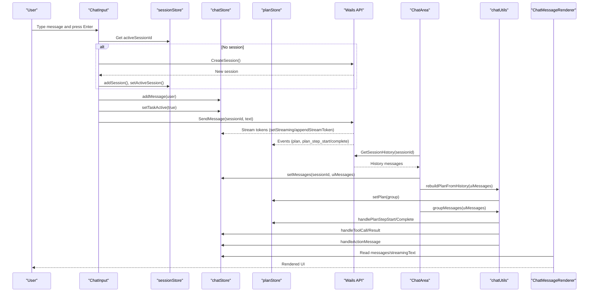

**Diagram sources**
- [ChatInput.tsx:46-111](file://frontend/src/components/chat/ChatInput.tsx#L46-L111)
- [ChatArea.tsx:48-73](file://frontend/src/components/chat/ChatArea.tsx#L48-L73)
- [chatStore.ts:468-570](file://frontend/src/stores/chatStore.ts#L468-L570)
- [planStore.ts:57-99](file://frontend/src/stores/planStore.ts#L57-L99)
- [ChatMessageRenderer.tsx:111-126](file://frontend/src/components/chat/ChatMessageRenderer.tsx#L111-L126)
- [chatUtils.ts:117-175](file://frontend/src/lib/chatUtils.ts#L117-L175)

## Detailed Component Analysis

### Foundation Components

#### CollapsibleBlock Analysis
- Purpose: Universal collapsible container providing consistent UI patterns across all collapsible components.
- Props: icon, label, statusIcon, badge, defaultOpen, open, onOpenChange, className, children, headerExtra.
- Behavior: Supports both controlled and uncontrolled modes, hover-triggered chevron indicators, and flexible header layouts.
- Integration: Used as the base for ThoughtBlock, ReflectionBlock, ToolBlock, and PlanStepBlock.

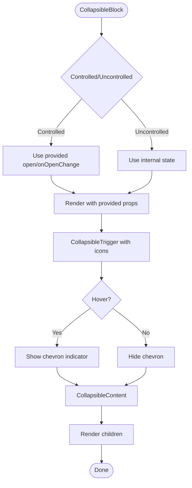

**Diagram sources**
- [CollapsibleBlock.tsx:23-67](file://frontend/src/components/chat/CollapsibleBlock.tsx#L23-L67)

**Section sources**
- [CollapsibleBlock.tsx:10-67](file://frontend/src/components/chat/CollapsibleBlock.tsx#L10-L67)

#### ScrollContext Analysis
- Purpose: Provides global scroll-to-step functionality for coordinating navigation between plan view and execution details.
- Props: None (provides context to children).
- Functionality: Maintains a callback reference that can be triggered from anywhere in the component tree.
- Integration: Used by PlanView to enable step navigation from plan items.

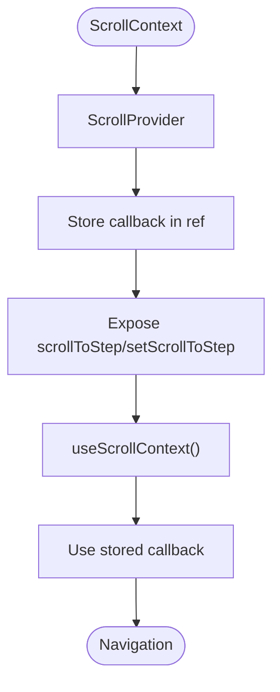

**Diagram sources**
- [ScrollContext.tsx:12-37](file://frontend/src/components/chat/ScrollContext.tsx#L12-L37)

**Section sources**
- [ScrollContext.tsx:1-37](file://frontend/src/components/chat/ScrollContext.tsx#L1-L37)

#### ToolContentBlock Analysis
- Purpose: Unified display component for tool arguments and results with intelligent preview and expand/collapse functionality.
- Props: args (string), result (string, optional), resultLen (number, optional), borderClass (string, optional).
- Features: Automatic truncation at 200 characters, show-more toggle, result length formatting (K chars), and consistent styling.
- Integration: Used by ToolBlock and MemoryBlock for consistent tool display.

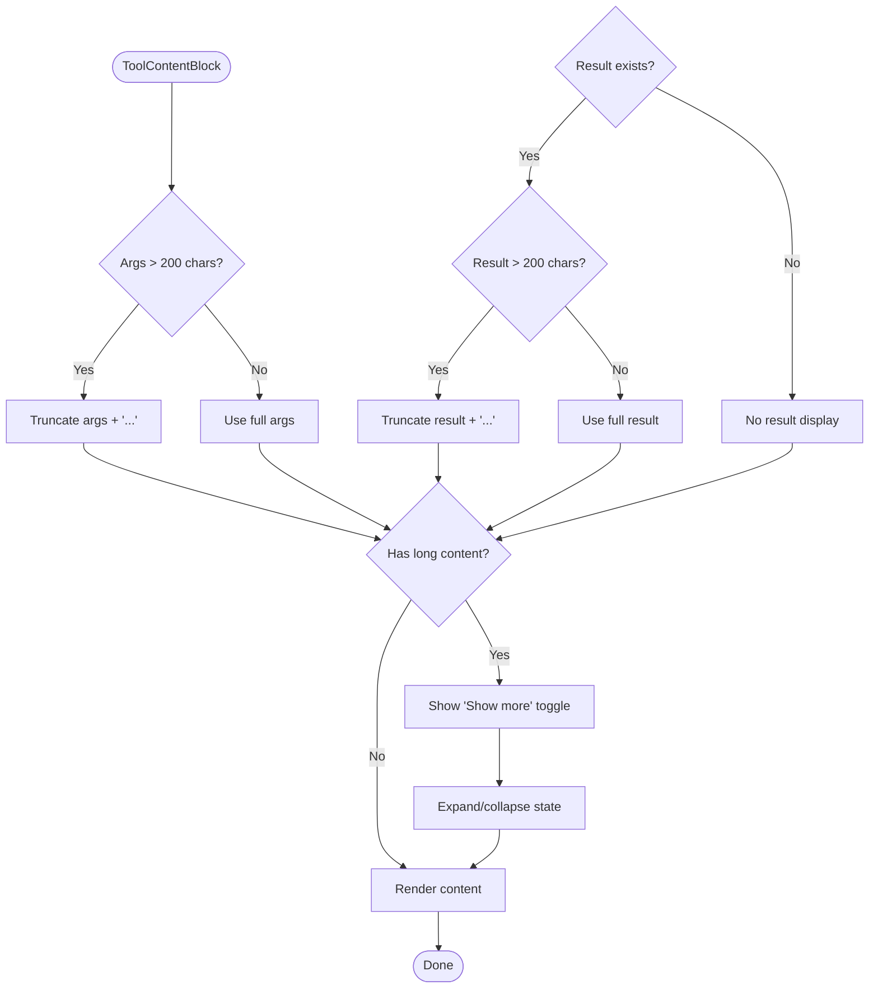

**Diagram sources**
- [ToolContentBlock.tsx:35-78](file://frontend/src/components/chat/ToolContentBlock.tsx#L35-L78)

**Section sources**
- [ToolContentBlock.tsx:27-78](file://frontend/src/components/chat/ToolContentBlock.tsx#L27-L78)

### AssistantMessage Analysis
- Props: content (string), isStreaming (boolean).
- Rendering: Two modes—rendered via ReactMarkdown with plugins and components, or raw Markdown with highlight.js. Toggle button appears only when not streaming.
- Security: Sanitization via customSchema; external links configured; slug and autolink headings supported.
- Error handling: ErrorBoundary wraps the renderer to avoid crashing the chat.

**Diagram sources**
- [AssistantMessage.tsx:25-90](file://frontend/src/components/chat/AssistantMessage.tsx#L25-L90)
- [markdownConfig.tsx:27-77](file://frontend/src/lib/markdownConfig.tsx#L27-L77)

**Section sources**
- [AssistantMessage.tsx:25-90](file://frontend/src/components/chat/AssistantMessage.tsx#L25-L90)
- [markdownConfig.tsx:27-77](file://frontend/src/lib/markdownConfig.tsx#L27-L77)

### UserMessage Analysis
- Props: content, timestamp, isPinned, maxHeight.
- Behavior: Measures natural height for pinned messages; collapses with gradient mask when exceeding maxHeight; expands on click/tap; collapses on blur.
- Accessibility: Focus management, aria-expanded, role="button" when overflow occurs.

**Diagram sources**
- [UserMessage.tsx:10-104](file://frontend/src/components/chat/UserMessage.tsx#L10-L104)

**Section sources**
- [UserMessage.tsx:10-104](file://frontend/src/components/chat/UserMessage.tsx#L10-L104)

### ChatInput Analysis
- Props: None.
- State: text, isProcessing, isThinking, isTaskActive.
- Flow: Validates project/session, optimistically adds user message, sets task active, calls API, handles errors, resets processing state, adjusts textarea height.
- Controls: Send button (green) and Cancel button (red) depending on task state.

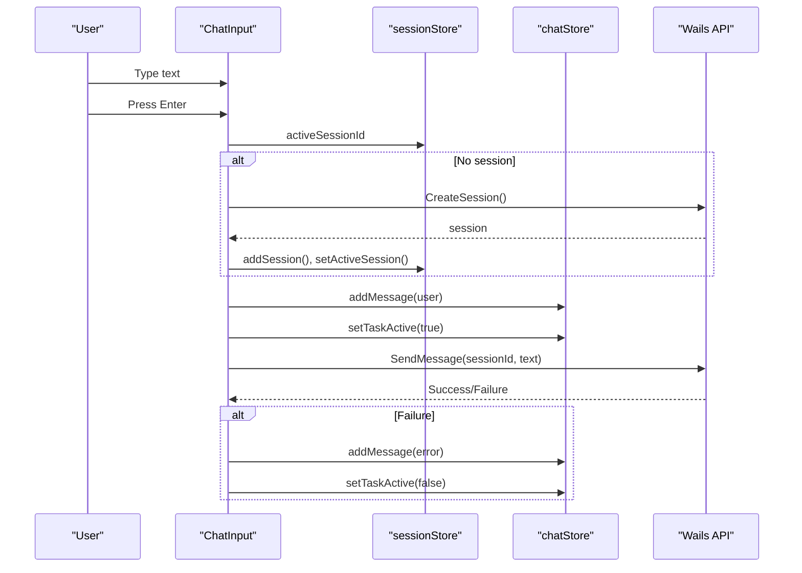

**Diagram sources**
- [ChatInput.tsx:13-192](file://frontend/src/components/chat/ChatInput.tsx#L13-L192)
- [chatStore.ts:468-570](file://frontend/src/stores/chatStore.ts#L468-L570)

**Section sources**
- [ChatInput.tsx:13-192](file://frontend/src/components/chat/ChatInput.tsx#L13-L192)
- [chatStore.ts:468-570](file://frontend/src/stores/chatStore.ts#L468-L570)

### ChatArea Analysis
- Props: None.
- Responsibilities: Loads session history, groups messages using advanced grouping capabilities, pins the last user message, manages container height for pinned clipping, subscribes to session events, clears plan store when no session.
- Integration: Uses chatStore for messages/streamingText, planStore for plan state, and chatUtils for history conversion and plan rebuilding.

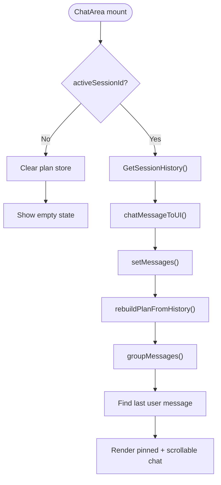

**Diagram sources**
- [ChatArea.tsx:21-146](file://frontend/src/components/chat/ChatArea.tsx#L21-L146)
- [chatUtils.ts:117-175](file://frontend/src/lib/chatUtils.ts#L117-L175)
- [chatStore.ts:468-570](file://frontend/src/stores/chatStore.ts#L468-L570)
- [planStore.ts:57-99](file://frontend/src/stores/planStore.ts#L57-L99)

**Section sources**
- [ChatArea.tsx:21-146](file://frontend/src/components/chat/ChatArea.tsx#L21-L146)
- [chatUtils.ts:117-175](file://frontend/src/lib/chatUtils.ts#L117-L175)

### ChatMessageRenderer Analysis
- Props: items (DisplayItem[]).
- Composition: Routes DisplayItem kinds to appropriate subcomponents using a centralized registry. Now uses CollapsibleBlock as the foundation for all collapsible components.
- Specialized blocks:
  - ThoughtBlock: Collapsible reasoning with show more/less using CollapsibleBlock.
  - ReflectionBlock: Collapsible reflection summary with suggested action badges and details using CollapsibleBlock.
  - ToolBlock: Collapsible tool invocation/results with ToolContentBlock for unified display.
  - PlanStepBlock: Collapsible step with status, duration, error, and nested children rendering using CollapsibleBlock.
  - MemoryBlock: Specialized memory read block using CollapsibleBlock and ToolContentBlock.

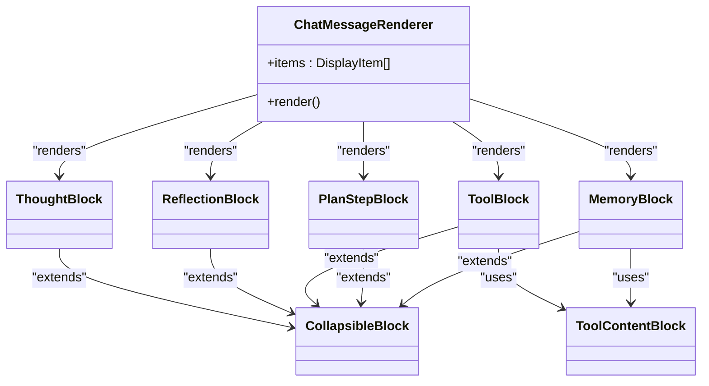

**Diagram sources**
- [ChatMessageRenderer.tsx:75-126](file://frontend/src/components/chat/ChatMessageRenderer.tsx#L75-L126)
- [ThoughtBlock.tsx:10-45](file://frontend/src/components/chat/ThoughtBlock.tsx#L10-L45)
- [ReflectionBlock.tsx:13-63](file://frontend/src/components/chat/ReflectionBlock.tsx#L13-L63)
- [ToolBlock.tsx:16-38](file://frontend/src/components/chat/ToolBlock.tsx#L16-L38)
- [PlanStepBlock.tsx:17-78](file://frontend/src/components/chat/PlanStepBlock.tsx#L17-L78)
- [MemoryBlock.tsx:52-74](file://frontend/src/components/chat/ChatMessageRenderer.tsx#L52-L74)
- [CollapsibleBlock.tsx:23-67](file://frontend/src/components/chat/CollapsibleBlock.tsx#L23-L67)
- [ToolContentBlock.tsx:35-78](file://frontend/src/components/chat/ToolContentBlock.tsx#L35-L78)

**Section sources**
- [ChatMessageRenderer.tsx:75-126](file://frontend/src/components/chat/ChatMessageRenderer.tsx#L75-L126)

### PlanView Analysis
- Purpose: Displays the latest execution plan as a list of steps with status, duration, and optional details.
- Data: Reads from planStore.planGroups[0] and maps to view model (PlanItem[]).
- Interactions: Clickable step items that trigger scroll-to-step functionality via ScrollContext; derived labels from summary or description; status icons and badges.

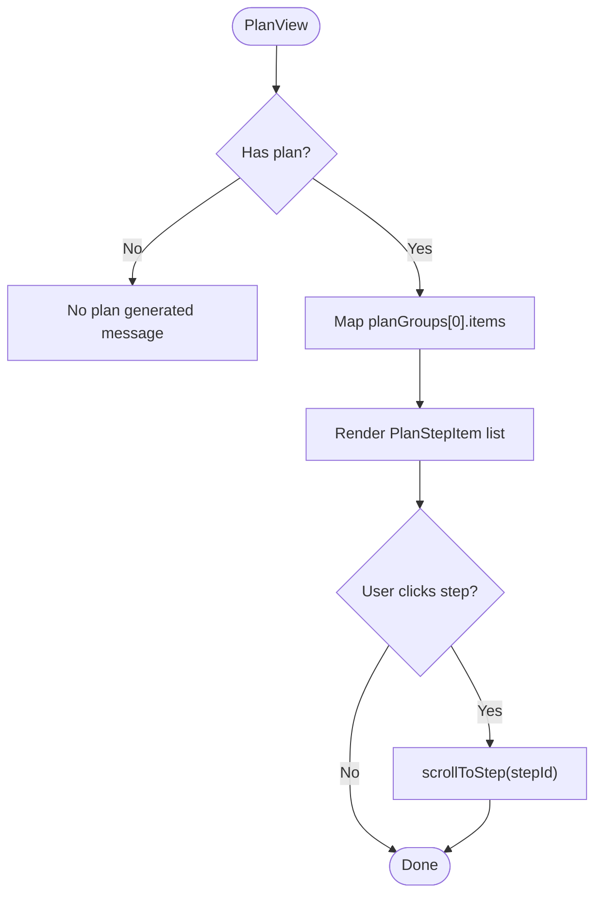

**Diagram sources**
- [PlanView.tsx:47-65](file://frontend/src/components/chat/PlanView.tsx#L47-L65)
- [planStore.ts:57-99](file://frontend/src/stores/planStore.ts#L57-L99)
- [ScrollContext.tsx:32-37](file://frontend/src/components/chat/ScrollContext.tsx#L32-L37)

**Section sources**
- [PlanView.tsx:1-65](file://frontend/src/components/chat/PlanView.tsx#L1-L65)
- [planStore.ts:1-100](file://frontend/src/stores/planStore.ts#L1-L100)

### DAGGraph Analysis
- Purpose: Visualizes task dependencies as a DAG using SVG connectors.
- Data: Accepts items (PlanItem[]) with dependsOn edges.
- Layout: computeDAGLayout determines lanes and connectors; DAGGraph renders SVG lines/paths and circles.

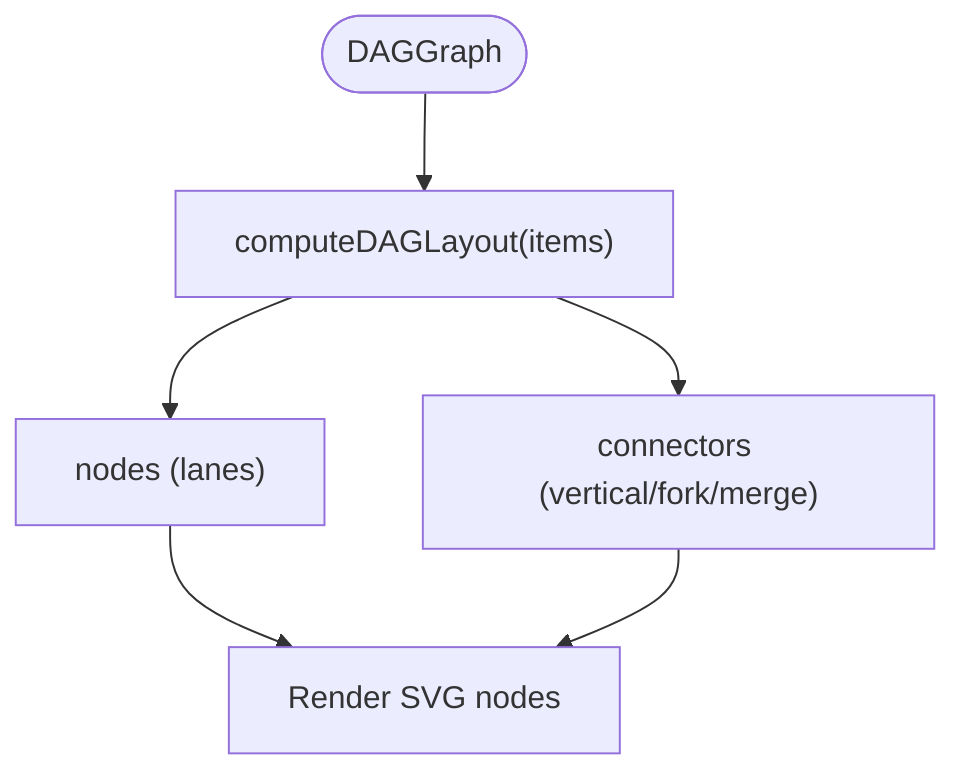

**Diagram sources**
- [DAGGraph.tsx:13-88](file://frontend/src/components/chat/DAGGraph.tsx#L13-L88)
- [dagLayout.ts:33-237](file://frontend/src/lib/dagLayout.ts#L33-L237)

**Section sources**
- [DAGGraph.tsx:13-88](file://frontend/src/components/chat/DAGGraph.tsx#L13-L88)
- [dagLayout.ts:33-237](file://frontend/src/lib/dagLayout.ts#L33-L237)

### ExecutionPanels Analysis
- Purpose: Collapsible panel showing execution plan with DAG visualization and step list.
- Data: Uses planStore.planGroups; integrates with ScrollContext to jump to steps.
- UI: PanelHeader with counters; PlanContent renders DAGGraph plus step list with status icons and tooltips.

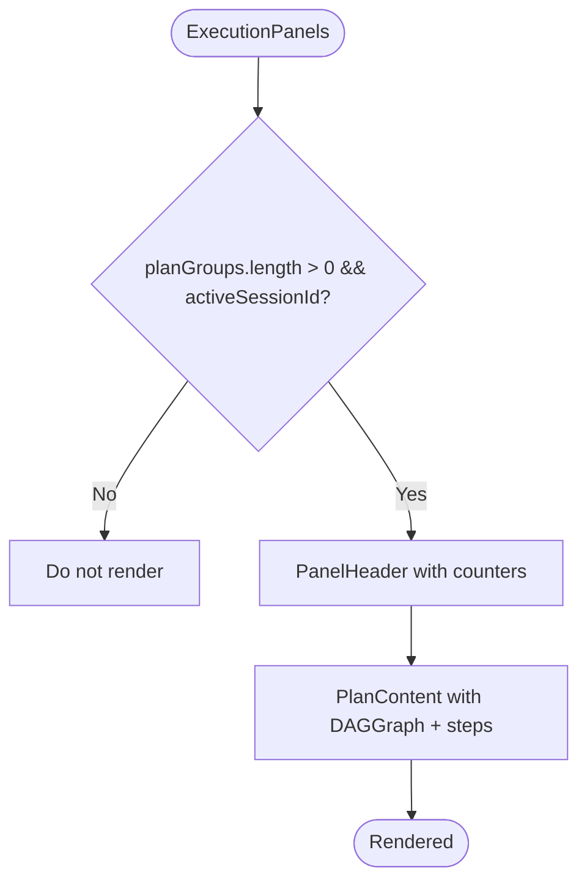

**Diagram sources**
- [ExecutionPanels.tsx:11-61](file://frontend/src/components/chat/ExecutionPanels.tsx#L11-L61)
- [planStore.ts:57-99](file://frontend/src/stores/planStore.ts#L57-L99)

**Section sources**
- [ExecutionPanels.tsx:1-61](file://frontend/src/components/chat/ExecutionPanels.tsx#L1-L61)
- [planStore.ts:1-100](file://frontend/src/stores/planStore.ts#L1-L100)

### Specialized Blocks

#### ThoughtBlock Analysis
- Purpose: Collapsible reasoning display with intelligent preview and expand/collapse functionality.
- Implementation: Extends CollapsibleBlock with brain circuit icon and reasoning content.
- Features: Auto-truncation at 500 characters, show more/less toggle, and responsive design.

#### ReflectionBlock Analysis
- Purpose: Collapsible reflection summary with suggested action badges and detailed analysis.
- Implementation: Extends CollapsibleBlock with warning triangle icon and detailed information panel.
- Features: Action-specific badge colors, attempt tracking, and expandable details section.

#### ToolBlock Analysis
- Purpose: Collapsible tool invocation/results display with unified arguments/results presentation.
- Implementation: Extends CollapsibleBlock with wrench icon and uses ToolContentBlock for content display.
- Features: Status-specific icons, MCP source indication, and intelligent argument parsing.

#### PlanStepBlock Analysis
- Purpose: Collapsible execution step with status, duration, error handling, and nested child rendering.
- Implementation: Extends CollapsibleBlock with status-specific icons and duration display.
- Features: Auto-open when running, user override capability, retry indication, and nested ChatMessageRenderer.

#### MemoryBlock Analysis
- Purpose: Specialized memory read operation display using unified ToolContentBlock.
- Implementation: Uses CollapsibleBlock with book icon and accent color scheme.
- Features: Memory operation type labeling and ToolContentBlock integration.

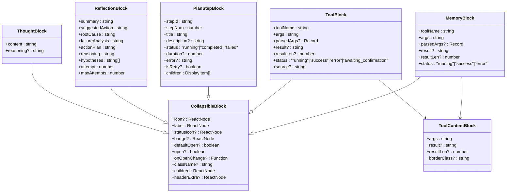

**Diagram sources**
- [CollapsibleBlock.tsx:10-67](file://frontend/src/components/chat/CollapsibleBlock.tsx#L10-L67)
- [ThoughtBlock.tsx:10-45](file://frontend/src/components/chat/ThoughtBlock.tsx#L10-L45)
- [ReflectionBlock.tsx:13-63](file://frontend/src/components/chat/ReflectionBlock.tsx#L13-L63)
- [ToolBlock.tsx:16-38](file://frontend/src/components/chat/ToolBlock.tsx#L16-L38)
- [PlanStepBlock.tsx:17-78](file://frontend/src/components/chat/PlanStepBlock.tsx#L17-L78)
- [MemoryBlock.tsx:52-74](file://frontend/src/components/chat/ChatMessageRenderer.tsx#L52-L74)
- [ToolContentBlock.tsx:35-78](file://frontend/src/components/chat/ToolContentBlock.tsx#L35-L78)

**Section sources**
- [ThoughtBlock.tsx:1-45](file://frontend/src/components/chat/ThoughtBlock.tsx#L1-L45)
- [ReflectionBlock.tsx:1-63](file://frontend/src/components/chat/ReflectionBlock.tsx#L1-L63)
- [ToolBlock.tsx:1-38](file://frontend/src/components/chat/ToolBlock.tsx#L1-L38)
- [PlanStepBlock.tsx:1-78](file://frontend/src/components/chat/PlanStepBlock.tsx#L1-L78)
- [ChatMessageRenderer.tsx:52-74](file://frontend/src/components/chat/ChatMessageRenderer.tsx#L52-L74)
- [ToolContentBlock.tsx:1-78](file://frontend/src/components/chat/ToolContentBlock.tsx#L1-L78)

## Dependency Analysis
- Stores:
  - chatStore: Holds messages, streamingText, isThinking, isTaskActive, activityStatus, and provides actions to add/update messages, stream tokens, set activity, resolve actions, and clear session UI state. Also exposes selectors for pending actions and grouping logic.
  - planStore: Manages planGroups, session stats, and provides actions to set plan, update step status, add steps, and clear plan state. Now central to the new plan-based architecture.
- Libraries:
  - markdownConfig: Provides customSchema and markdownComponents for ReactMarkdown rendering.
  - dagLayout: Computes DAG layout for visualization.
  - chatUtils: Advanced message conversion and grouping with plan reconstruction capabilities.
  - chatUtilsHelpers: Message grouping helpers including tool key generation and content reconstruction.
  - chatGroupingHandlers: Specialized handlers for plan steps, tool calls/results, and action messages.
- Components depend on stores for state and on libraries for rendering/formatting.

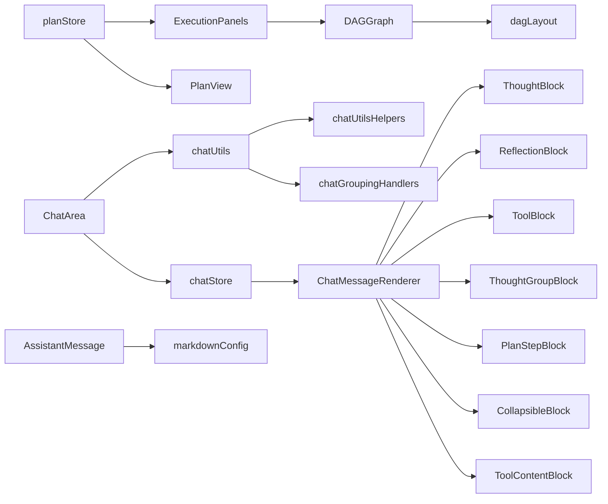

**Diagram sources**
- [chatStore.ts:468-570](file://frontend/src/stores/chatStore.ts#L468-L570)
- [planStore.ts:57-99](file://frontend/src/stores/planStore.ts#L57-L99)
- [ChatMessageRenderer.tsx:111-126](file://frontend/src/components/chat/ChatMessageRenderer.tsx#L111-L126)
- [DAGGraph.tsx:13-88](file://frontend/src/components/chat/DAGGraph.tsx#L13-L88)
- [dagLayout.ts:33-237](file://frontend/src/lib/dagLayout.ts#L33-L237)
- [markdownConfig.tsx:27-77](file://frontend/src/lib/markdownConfig.tsx#L27-L77)
- [chatUtils.ts:1-176](file://frontend/src/lib/chatUtils.ts#L1-L176)
- [chatUtilsHelpers.ts:1-186](file://frontend/src/lib/chatUtilsHelpers.ts#L1-L186)
- [chatGroupingHandlers.ts:1-158](file://frontend/src/lib/chatGroupingHandlers.ts#L1-L158)

**Section sources**
- [chatStore.ts:468-570](file://frontend/src/stores/chatStore.ts#L468-L570)
- [planStore.ts:1-100](file://frontend/src/stores/planStore.ts#L1-L100)
- [ChatMessageRenderer.tsx:1-126](file://frontend/src/components/chat/ChatMessageRenderer.tsx#L1-L126)

## Performance Considerations
- Memoization and lazy rendering:
  - AssistantMessage memoizes highlighted raw Markdown to avoid repeated highlighting.
  - All collapsible blocks use React.memo for optimal re-render performance.
  - ChatMessageRenderer uses React.memo for MemoryBlock and ThoughtGroupBlock to minimize re-renders.
  - ChatArea measures container height efficiently using ResizeObserver and requestAnimationFrame fallbacks.
- Streaming:
  - ChatInput sets isTaskActive and activityStatus during send; streamingText is appended incrementally via chatStore to avoid full re-renders of the entire message list.
- Collapsing and virtualization:
  - All collapsible components use CollapsibleBlock for consistent performance and reduced DOM complexity.
  - Pinned user message is rendered outside the scrollable region to keep the list lean.
- Rendering optimization:
  - Markdown rendering uses plugins and sanitization once per component; Mermaid diagrams are wrapped in ErrorBoundary to prevent cascading failures.
  - ToolContentBlock uses efficient truncation algorithms and conditional rendering.

## Accessibility Features
- Interactive elements:
  - Buttons and toggles include aria-labels and titles for screen readers.
  - Hover states reveal opacity-based controls for discoverability.
- Focus management:
  - Pinned messages use tabIndex and onBlur handlers to manage expansion/collapse.
  - Collapsible components expose trigger buttons with appropriate ARIA attributes.
- Semantic structure:
  - CollapsibleBlock uses native HTML semantics with proper headings and lists.
  - All collapsible components provide consistent keyboard navigation and screen reader support.
  - ToolContentBlock provides accessible expand/collapse functionality.

## Customization Options
- Foundation components:
  - CollapsibleBlock allows custom icons, labels, status indicators, badges, and styling through props.
  - ToolContentBlock supports custom border classes and integrates with various content types.
  - ScrollContext enables global navigation coordination across components.
- Markdown rendering:
  - customSchema extends rehype-sanitize to allow code spans/classes and heading IDs.
  - markdownComponents override code blocks, enabling language badges, Mermaid diagrams, and pre wrappers.
- Message types:
  - chatStore defines extensive MessageType and DisplayItem kinds to support diverse content types (thoughts, tools, reflections, plan steps, memory reads, etc.).
- Execution visualization:
  - PlanView and DAGGraph adapt to backend-provided plan data; durations, statuses, and dependencies are rendered with appropriate icons and colors.
- Tool rendering:
  - ToolBlock supports source differentiation (e.g., MCP) and long argument/result previews with expand/collapse.

**Section sources**
- [CollapsibleBlock.tsx:10-67](file://frontend/src/components/chat/CollapsibleBlock.tsx#L10-L67)
- [ToolContentBlock.tsx:27-78](file://frontend/src/components/chat/ToolContentBlock.tsx#L27-L78)
- [ScrollContext.tsx:1-37](file://frontend/src/components/chat/ScrollContext.tsx#L1-L37)
- [markdownConfig.tsx:7-77](file://frontend/src/lib/markdownConfig.tsx#L7-L77)
- [chatStore.ts:3-41](file://frontend/src/stores/chatStore.ts#L3-L41)
- [PlanView.tsx:1-65](file://frontend/src/components/chat/PlanView.tsx#L1-L65)
- [DAGGraph.tsx:13-88](file://frontend/src/components/chat/DAGGraph.tsx#L13-L88)
- [ToolBlock.tsx:16-38](file://frontend/src/components/chat/ToolBlock.tsx#L16-L38)

## Troubleshooting Guide
- Messages not appearing:
  - Verify activeSessionId exists; ChatArea shows empty state when no session is active.
  - Check GetSessionHistory call and chatUtils conversion; errors are logged and displayed as a banner.
- Streaming text not visible:
  - Ensure chatStore.streamingText is being updated; ChatMessageRenderer renders streamingText as an AssistantMessage with isStreaming.
- Plan not visible:
  - Confirm planStore.planGroups is populated; ExecutionPanels only renders when both planGroups and activeSessionId exist.
- Tool results missing:
  - Results may arrive before tool_call; chatUtils.groupMessages buffers results keyed by tool_call_id or composite keys and applies them when tool_call arrives.
- Pinned message not expanding:
  - Ensure maxHeight is set and ResizeObserver is available; pinned messages require naturalHeight measurement to decide overflow.
- Collapsible components not working:
  - Verify CollapsibleBlock is properly imported and used as the base component.
  - Check that controlled/uncontrolled mode props are correctly configured.
- Scroll navigation issues:
  - Ensure ScrollContext provider is wrapping the component tree.
  - Verify that scrollToStep callback is properly set and used.

**Section sources**
- [ChatArea.tsx:91-140](file://frontend/src/components/chat/ChatArea.tsx#L91-L140)
- [chatStore.ts:468-570](file://frontend/src/stores/chatStore.ts#L468-L570)
- [planStore.ts:57-99](file://frontend/src/stores/planStore.ts#L57-L99)
- [chatUtils.ts:117-175](file://frontend/src/lib/chatUtils.ts#L117-L175)
- [CollapsibleBlock.tsx:23-67](file://frontend/src/components/chat/CollapsibleBlock.tsx#L23-L67)
- [ScrollContext.tsx:12-37](file://frontend/src/components/chat/ScrollContext.tsx#L12-L37)

## Conclusion
C0WRK's chat interface has been completely rewritten with a modern, plan-based architecture that provides enhanced message grouping capabilities and improved component composition patterns. The new foundation includes CollapsibleBlock.tsx for consistent collapsible UI patterns, ScrollContext.tsx for coordinated navigation, and ToolContentBlock.tsx for unified tool display. The chatUtils.ts and chatUtilsHelpers.ts libraries now feature advanced message grouping with specialized handlers for plan steps, tools, and actions. The migration from panel-based to plan-based architecture provides better execution visualization and state management through planStore.ts. The rendering pipeline converts backend messages into a rich, interactive UI with collapsible blocks, streaming support, and robust error boundaries, while maintaining accessibility, performance, and extensibility for diverse execution contexts.