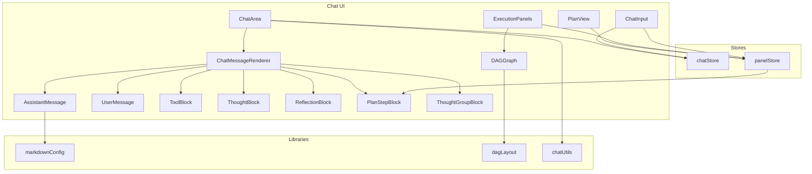
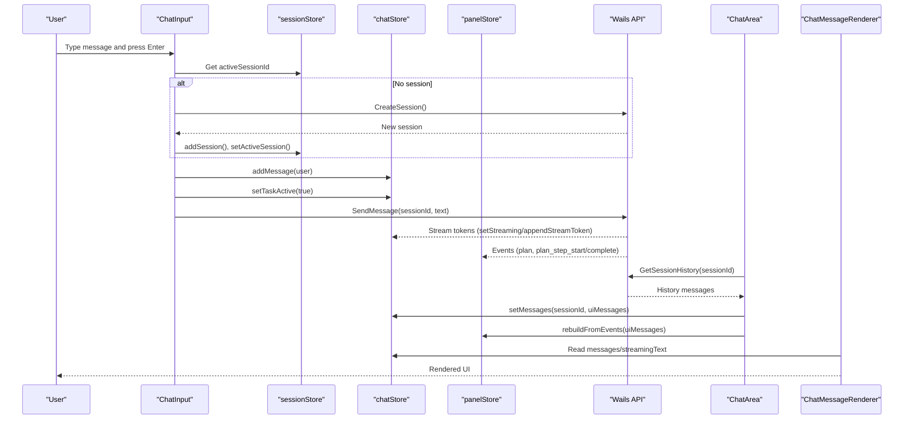
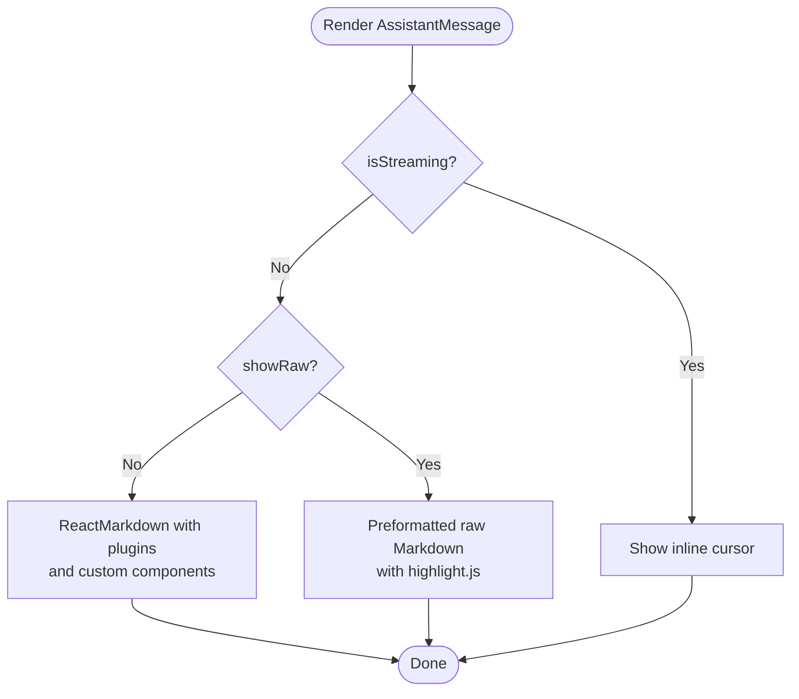
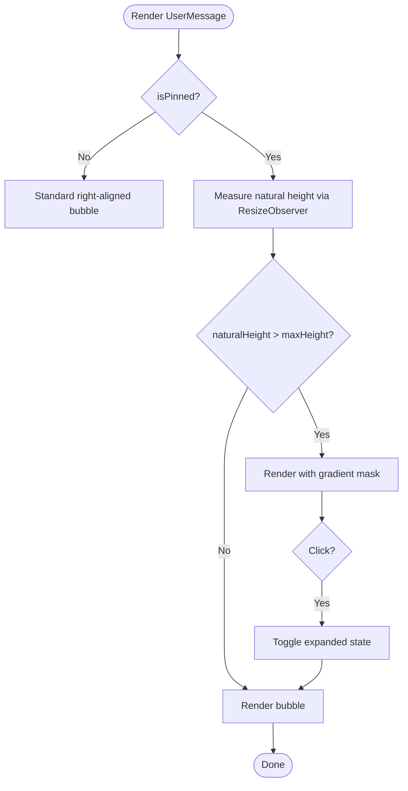
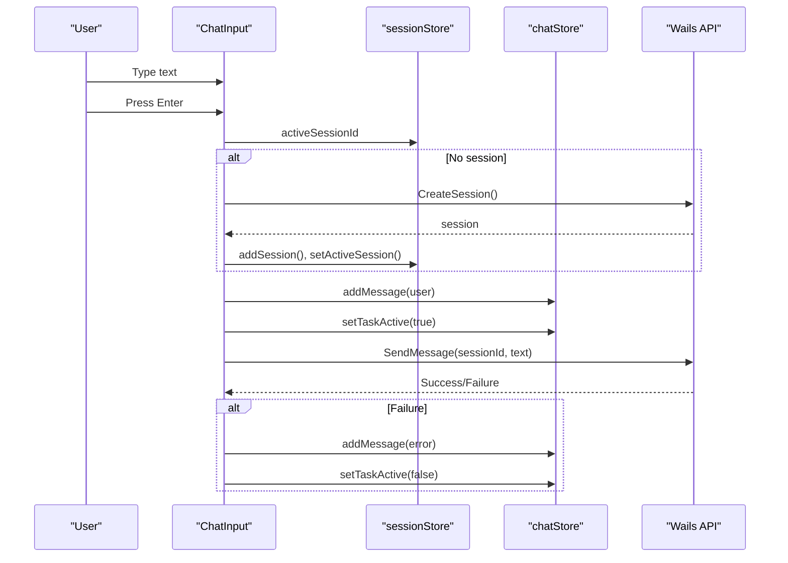
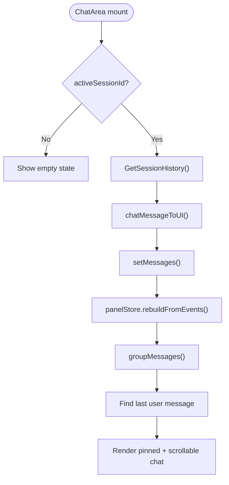
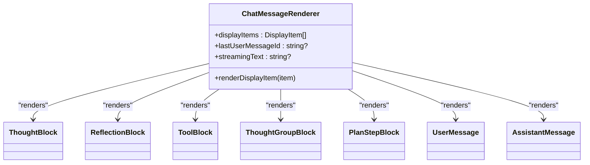
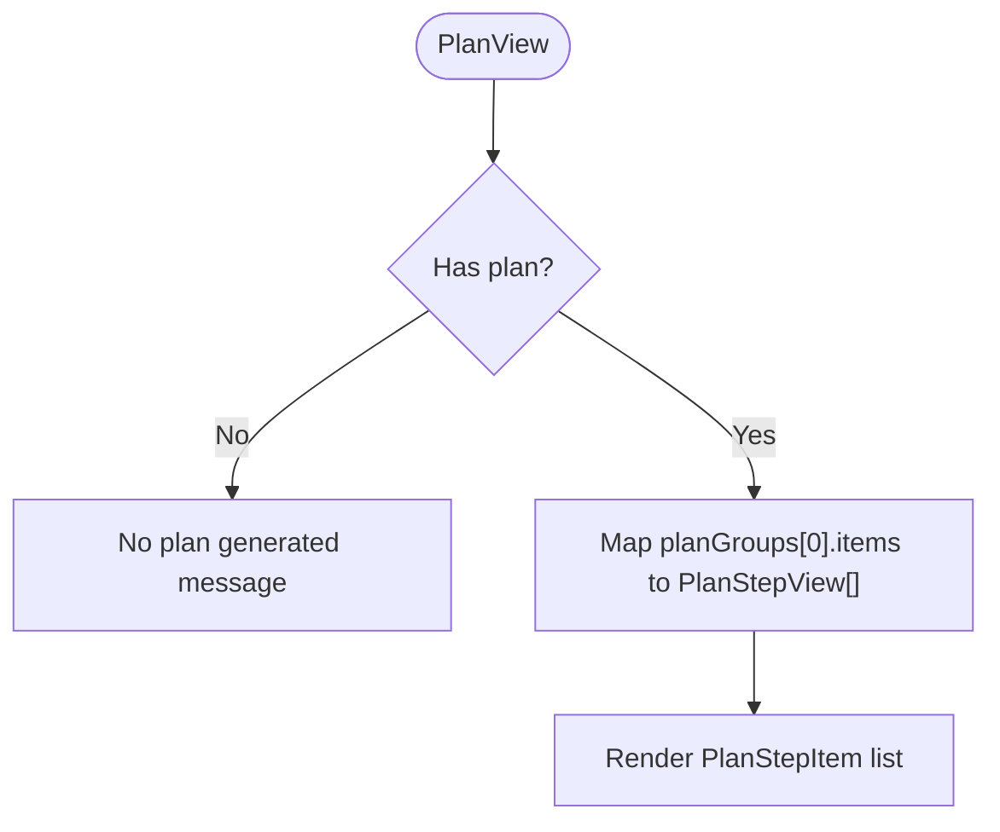
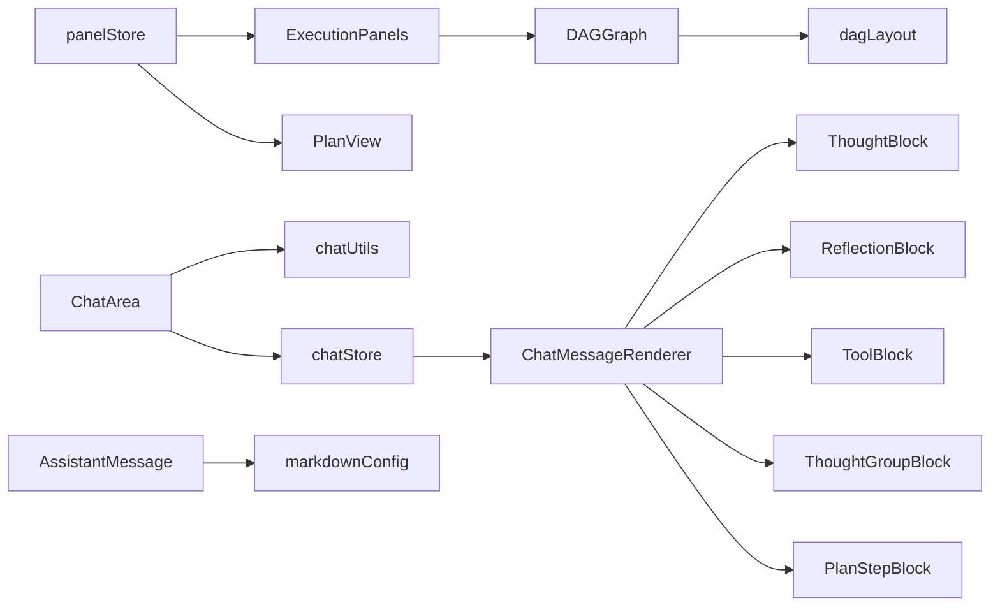

# Chat Interface Components

<cite>
**Referenced Files in This Document**
- [AssistantMessage.tsx](file://frontend/src/components/chat/AssistantMessage.tsx)
- [UserMessage.tsx](file://frontend/src/components/chat/UserMessage.tsx)
- [ChatInput.tsx](file://frontend/src/components/chat/ChatInput.tsx)
- [ChatArea.tsx](file://frontend/src/components/chat/ChatArea.tsx)
- [ChatMessageRenderer.tsx](file://frontend/src/components/chat/ChatMessageRenderer.tsx)
- [PlanView.tsx](file://frontend/src/components/chat/PlanView.tsx)
- [DAGGraph.tsx](file://frontend/src/components/chat/DAGGraph.tsx)
- [ExecutionPanels.tsx](file://frontend/src/components/chat/ExecutionPanels.tsx)
- [ThoughtBlock.tsx](file://frontend/src/components/chat/ThoughtBlock.tsx)
- [ReflectionBlock.tsx](file://frontend/src/components/chat/ReflectionBlock.tsx)
- [ToolBlock.tsx](file://frontend/src/components/chat/ToolBlock.tsx)
- [PlanStepBlock.tsx](file://frontend/src/components/chat/PlanStepBlock.tsx)
- [ThoughtGroupBlock.tsx](file://frontend/src/components/chat/ThoughtGroupBlock.tsx)
- [markdownConfig.tsx](file://frontend/src/lib/markdownConfig.tsx)
- [chatStore.ts](file://frontend/src/stores/chatStore.ts)
- [panelStore.ts](file://frontend/src/stores/panelStore.ts)
- [dagLayout.ts](file://frontend/src/lib/dagLayout.ts)
- [chatUtils.ts](file://frontend/src/lib/chatUtils.ts)
</cite>

## Table of Contents
1. [Introduction](#introduction)
2. [Project Structure](#project-structure)
3. [Core Components](#core-components)
4. [Architecture Overview](#architecture-overview)
5. [Detailed Component Analysis](#detailed-component-analysis)
6. [Dependency Analysis](#dependency-analysis)
7. [Performance Considerations](#performance-considerations)
8. [Accessibility Features](#accessibility-features)
9. [Customization Options](#customization-options)
10. [Troubleshooting Guide](#troubleshooting-guide)
11. [Conclusion](#conclusion)

## Introduction
This document provides comprehensive documentation for C0WRK's chat interface components. It covers the core messaging components (AssistantMessage, UserMessage, ChatInput), specialized execution visualization components (PlanView, DAGGraph, ExecutionPanels), and the rendering pipeline (ChatArea, ChatMessageRenderer) along with specialized blocks (ThoughtBlock, ReflectionBlock, ToolBlock). It also explains component composition patterns, state management via Zustand stores, accessibility features, and customization options for different message types and execution contexts.

## Project Structure
The chat UI is organized under frontend/src/components/chat with supporting libraries and stores under frontend/src/lib and frontend/src/stores respectively. The key areas are:
- Messaging and input: AssistantMessage, UserMessage, ChatInput
- Rendering pipeline: ChatArea, ChatMessageRenderer
- Specialized blocks: ThoughtBlock, ReflectionBlock, ToolBlock, ThoughtGroupBlock, PlanStepBlock
- Execution visualization: PlanView, DAGGraph, ExecutionPanels
- Stores: chatStore (message grouping and UI state), panelStore (execution plan state), dagLayout (DAG layout computation)
- Utilities: markdownConfig (ReactMarkdown configuration), chatUtils (history conversion), dagLayout (DAG layout)



**Diagram sources**
- [ChatArea.tsx:17-174](file://frontend/src/components/chat/ChatArea.tsx#L17-L174)
- [ChatMessageRenderer.tsx:212-237](file://frontend/src/components/chat/ChatMessageRenderer.tsx#L212-L237)
- [AssistantMessage.tsx:25-90](file://frontend/src/components/chat/AssistantMessage.tsx#L25-L90)
- [UserMessage.tsx:10-104](file://frontend/src/components/chat/UserMessage.tsx#L10-L104)
- [ChatInput.tsx:13-192](file://frontend/src/components/chat/ChatInput.tsx#L13-L192)
- [PlanView.tsx:117-152](file://frontend/src/components/chat/PlanView.tsx#L117-L152)
- [DAGGraph.tsx:13-88](file://frontend/src/components/chat/DAGGraph.tsx#L13-L88)
- [ExecutionPanels.tsx:107-141](file://frontend/src/components/chat/ExecutionPanels.tsx#L107-L141)
- [ToolBlock.tsx:26-136](file://frontend/src/components/chat/ToolBlock.tsx#L26-L136)
- [ThoughtBlock.tsx:14-66](file://frontend/src/components/chat/ThoughtBlock.tsx#L14-L66)
- [ReflectionBlock.tsx:27-114](file://frontend/src/components/chat/ReflectionBlock.tsx#L27-L114)
- [PlanStepBlock.tsx:42-122](file://frontend/src/components/chat/PlanStepBlock.tsx#L42-L122)
- [ThoughtGroupBlock.tsx:13-45](file://frontend/src/components/chat/ThoughtGroupBlock.tsx#L13-L45)
- [chatStore.ts:468-570](file://frontend/src/stores/chatStore.ts#L468-L570)
- [panelStore.ts:66-221](file://frontend/src/stores/panelStore.ts#L66-L221)
- [markdownConfig.tsx:27-77](file://frontend/src/lib/markdownConfig.tsx#L27-L77)
- [dagLayout.ts:33-237](file://frontend/src/lib/dagLayout.ts#L33-L237)
- [chatUtils.ts:221-244](file://frontend/src/lib/chatUtils.ts#L221-L244)

**Section sources**
- [ChatArea.tsx:17-174](file://frontend/src/components/chat/ChatArea.tsx#L17-L174)
- [ChatMessageRenderer.tsx:212-237](file://frontend/src/components/chat/ChatMessageRenderer.tsx#L212-L237)
- [chatStore.ts:468-570](file://frontend/src/stores/chatStore.ts#L468-L570)
- [panelStore.ts:66-221](file://frontend/src/stores/panelStore.ts#L66-L221)

## Core Components
This section documents the primary chat components and their responsibilities.

- AssistantMessage
  - Purpose: Renders assistant messages with optional raw/source toggle and streaming cursor.
  - Props: content (string), isStreaming (boolean, optional).
  - Rendering logic: Uses ReactMarkdown with plugins for GFM, emoji, breaks, syntax highlighting, sanitization, external links, slugs, and autolinks. Provides a toggle to view raw Markdown with highlight.js. Includes an ErrorBoundary around the renderer.
  - Accessibility: Hover-triggered button with aria-label; stream cursor is visually indicated.
  - Customization: Uses markdownComponents and customSchema from markdownConfig.

- UserMessage
  - Purpose: Renders user messages with timestamp and optional pinning behavior.
  - Props: content (string), timestamp (number), isPinned (boolean, optional), maxHeight (number, optional).
  - Rendering logic: Non-pinned renders a standard bubble; pinned messages can overflow with a gradient mask and expand/collapse behavior controlled by ResizeObserver and keyboard focus.
  - Accessibility: Proper roles, tabindex, aria-expanded for clipped pinned messages; focus blur handling to collapse.

- ChatInput
  - Purpose: Text input for user messages with auto-resize, send/cancel controls, and optimistic UI updates.
  - Props: None (uses stores/hooks internally).
  - Interaction pattern: Optimistically adds user message; creates session if missing; marks task active; sends via Wails API; handles cancellation; disables input when blocked; shows blocking message.
  - State management: Uses sessionStore, projectStore, chatStore, and Wails hook; manages textarea height and placeholder text dynamically.

**Section sources**
- [AssistantMessage.tsx:20-90](file://frontend/src/components/chat/AssistantMessage.tsx#L20-L90)
- [markdownConfig.tsx:27-77](file://frontend/src/lib/markdownConfig.tsx#L27-L77)
- [UserMessage.tsx:3-104](file://frontend/src/components/chat/UserMessage.tsx#L3-L104)
- [ChatInput.tsx:13-192](file://frontend/src/components/chat/ChatInput.tsx#L13-L192)

## Architecture Overview
The chat architecture centers on a rendering pipeline that transforms backend messages into a structured display model, grouped into DisplayItem categories, then rendered by ChatMessageRenderer. Execution plan state is maintained separately in panelStore and visualized via PlanView and DAGGraph. ChatArea orchestrates history loading, pinned user message display, scrolling, and integrates with session events.



**Diagram sources**
- [ChatInput.tsx:46-111](file://frontend/src/components/chat/ChatInput.tsx#L46-L111)
- [ChatArea.tsx:84-101](file://frontend/src/components/chat/ChatArea.tsx#L84-L101)
- [chatStore.ts:468-570](file://frontend/src/stores/chatStore.ts#L468-L570)
- [panelStore.ts:146-220](file://frontend/src/stores/panelStore.ts#L146-L220)
- [ChatMessageRenderer.tsx:212-237](file://frontend/src/components/chat/ChatMessageRenderer.tsx#L212-L237)

## Detailed Component Analysis

### AssistantMessage Analysis
- Props: content (string), isStreaming (boolean).
- Rendering: Two modes—rendered via ReactMarkdown with plugins and components, or raw Markdown with highlight.js. Toggle button appears only when not streaming.
- Security: Sanitization via customSchema; external links configured; slug and autolink headings supported.
- Error handling: ErrorBoundary wraps the renderer to avoid crashing the chat.



**Diagram sources**
- [AssistantMessage.tsx:25-90](file://frontend/src/components/chat/AssistantMessage.tsx#L25-L90)
- [markdownConfig.tsx:27-77](file://frontend/src/lib/markdownConfig.tsx#L27-L77)

**Section sources**
- [AssistantMessage.tsx:25-90](file://frontend/src/components/chat/AssistantMessage.tsx#L25-L90)
- [markdownConfig.tsx:27-77](file://frontend/src/lib/markdownConfig.tsx#L27-L77)

### UserMessage Analysis
- Props: content, timestamp, isPinned, maxHeight.
- Behavior: Measures natural height for pinned messages; collapses with gradient mask when exceeding maxHeight; expands on click/tap; collapses on blur.
- Accessibility: Focus management, aria-expanded, role="button" when overflow occurs.



**Diagram sources**
- [UserMessage.tsx:10-104](file://frontend/src/components/chat/UserMessage.tsx#L10-L104)

**Section sources**
- [UserMessage.tsx:10-104](file://frontend/src/components/chat/UserMessage.tsx#L10-L104)

### ChatInput Analysis
- Props: None.
- State: text, isProcessing, isThinking, isTaskActive.
- Flow: Validates project/session, optimistically adds user message, sets task active, calls API, handles errors, resets processing state, adjusts textarea height.
- Controls: Send button (green) and Cancel button (red) depending on task state.



**Diagram sources**
- [ChatInput.tsx:13-192](file://frontend/src/components/chat/ChatInput.tsx#L13-L192)
- [chatStore.ts:468-570](file://frontend/src/stores/chatStore.ts#L468-L570)

**Section sources**
- [ChatInput.tsx:13-192](file://frontend/src/components/chat/ChatInput.tsx#L13-L192)
- [chatStore.ts:468-570](file://frontend/src/stores/chatStore.ts#L468-L570)

### ChatArea Analysis
- Props: None.
- Responsibilities: Loads session history, groups messages, pins the last user message, manages container height for pinned clipping, subscribes to session events, clears panels when no session.
- Integration: Uses chatStore for messages/streamingText, panelStore for plan rebuild, and chatUtils for history conversion.



**Diagram sources**
- [ChatArea.tsx:17-174](file://frontend/src/components/chat/ChatArea.tsx#L17-L174)
- [chatUtils.ts:221-244](file://frontend/src/lib/chatUtils.ts#L221-L244)
- [chatStore.ts:468-570](file://frontend/src/stores/chatStore.ts#L468-L570)
- [panelStore.ts:146-220](file://frontend/src/stores/panelStore.ts#L146-L220)

**Section sources**
- [ChatArea.tsx:17-174](file://frontend/src/components/chat/ChatArea.tsx#L17-L174)
- [chatUtils.ts:221-244](file://frontend/src/lib/chatUtils.ts#L221-L244)

### ChatMessageRenderer Analysis
- Props: displayItems (DisplayItem[]), lastUserMessageId (string|null), streamingText (string|null).
- Composition: Routes DisplayItem kinds to appropriate subcomponents (UserMessage, AssistantMessage, ThoughtBlock, ToolBlock, PlanStepBlock, etc.). Skips the last pinned user message. Renders streaming assistant text and an ActivityIndicator.
- Specialized blocks:
  - ThoughtBlock: Collapsible reasoning with show more/less.
  - ReflectionBlock: Collapsible reflection summary with suggested action badges and details.
  - ToolBlock: Collapsible tool invocation/results with argument/result previews and long-content toggles.
  - ThoughtGroupBlock: Collapsible group of thoughts.
  - PlanStepBlock: Collapsible step with status, duration, error, and nested children rendering.



**Diagram sources**
- [ChatMessageRenderer.tsx:212-237](file://frontend/src/components/chat/ChatMessageRenderer.tsx#L212-L237)
- [ThoughtBlock.tsx:14-66](file://frontend/src/components/chat/ThoughtBlock.tsx#L14-L66)
- [ReflectionBlock.tsx:27-114](file://frontend/src/components/chat/ReflectionBlock.tsx#L27-L114)
- [ToolBlock.tsx:26-136](file://frontend/src/components/chat/ToolBlock.tsx#L26-L136)
- [ThoughtGroupBlock.tsx:13-45](file://frontend/src/components/chat/ThoughtGroupBlock.tsx#L13-L45)
- [PlanStepBlock.tsx:42-122](file://frontend/src/components/chat/PlanStepBlock.tsx#L42-L122)
- [UserMessage.tsx:10-104](file://frontend/src/components/chat/UserMessage.tsx#L10-L104)
- [AssistantMessage.tsx:25-90](file://frontend/src/components/chat/AssistantMessage.tsx#L25-L90)

**Section sources**
- [ChatMessageRenderer.tsx:212-237](file://frontend/src/components/chat/ChatMessageRenderer.tsx#L212-L237)

### PlanView Analysis
- Purpose: Displays the latest execution plan as a list of steps with status, duration, and optional details.
- Data: Reads from panelStore.planGroups[0] and maps to view model (PlanStepView).
- Interactions: Expandable details per step; derived labels from summary or description; status icons and badges.



**Diagram sources**
- [PlanView.tsx:117-152](file://frontend/src/components/chat/PlanView.tsx#L117-L152)
- [panelStore.ts:66-221](file://frontend/src/stores/panelStore.ts#L66-L221)

**Section sources**
- [PlanView.tsx:117-152](file://frontend/src/components/chat/PlanView.tsx#L117-L152)
- [panelStore.ts:66-221](file://frontend/src/stores/panelStore.ts#L66-L221)

### DAGGraph Analysis
- Purpose: Visualizes task dependencies as a DAG using SVG connectors.
- Data: Accepts items (PlanItem[]) with dependsOn edges.
- Layout: computeDAGLayout determines lanes and connectors; DAGGraph renders SVG lines/paths and circles.


**Diagram sources**
- [DAGGraph.tsx:13-88](file://frontend/src/components/chat/DAGGraph.tsx#L13-L88)
- [dagLayout.ts:33-237](file://frontend/src/lib/dagLayout.ts#L33-L237)

**Section sources**
- [DAGGraph.tsx:13-88](file://frontend/src/components/chat/DAGGraph.tsx#L13-L88)
- [dagLayout.ts:33-237](file://frontend/src/lib/dagLayout.ts#L33-L237)

### ExecutionPanels Analysis
- Purpose: Collapsible panel showing execution plan with DAG visualization and step list.
- Data: Uses panelStore.planGroups; integrates with scrollStore to jump to steps.
- UI: PanelHeader with counters; PlanContent renders DAGGraph plus step list with status icons and tooltips.


**Diagram sources**
- [ExecutionPanels.tsx:107-141](file://frontend/src/components/chat/ExecutionPanels.tsx#L107-L141)
- [panelStore.ts:66-221](file://frontend/src/stores/panelStore.ts#L66-L221)

**Section sources**
- [ExecutionPanels.tsx:107-141](file://frontend/src/components/chat/ExecutionPanels.tsx#L107-L141)
- [panelStore.ts:66-221](file://frontend/src/stores/panelStore.ts#L66-L221)

### Specialized Blocks
- ThoughtBlock: Collapsible reasoning with preview and expand/collapse.
- ReflectionBlock: Collapsible reflection summary with suggested action badges and optional details.
- ToolBlock: Collapsible tool call/results with argument/result previews and long-content toggles; distinguishes status with icons.
- ThoughtGroupBlock: Collapsible group of thoughts with reasoning/content.
- PlanStepBlock: Collapsible step with status, duration, error, context fill indicators, and nested children rendering.

```mermaid
classDiagram
class ThoughtBlock {
+content : string
+reasoning? : string
}
class ReflectionBlock {
+summary : string
+suggestedAction : string
+rootCause : string
+failureAnalysis : string
+actionPlan : string
+reasoning : string
+hypotheses : string[]
+attempt : number
+maxAttempts : number
}
class ToolBlock {
+toolName : string
+args : string
+parsedArgs? : Record<string,unknown>
+result? : string
+resultLen? : number
+status : "running"|"success"|"error"|"awaiting_confirmation"
+source? : string
}
class ThoughtGroupBlock {
+thoughts : {content : string, reasoning? : string}[]
}
class PlanStepBlock {
+stepId : string
+stepNum : number
+title : string
+description? : string
+status : "running"|"completed"|"failed"
+duration? : number
+error? : string
+isRetry? : boolean
+children : DisplayItem[]
}
```

**Diagram sources**
- [ThoughtBlock.tsx:9-66](file://frontend/src/components/chat/ThoughtBlock.tsx#L9-L66)
- [ReflectionBlock.tsx:9-114](file://frontend/src/components/chat/ReflectionBlock.tsx#L9-L114)
- [ToolBlock.tsx:9-136](file://frontend/src/components/chat/ToolBlock.tsx#L9-L136)
- [ThoughtGroupBlock.tsx:9-45](file://frontend/src/components/chat/ThoughtGroupBlock.tsx#L9-L45)
- [PlanStepBlock.tsx:13-122](file://frontend/src/components/chat/PlanStepBlock.tsx#L13-L122)

**Section sources**
- [ThoughtBlock.tsx:9-66](file://frontend/src/components/chat/ThoughtBlock.tsx#L9-L66)
- [ReflectionBlock.tsx:9-114](file://frontend/src/components/chat/ReflectionBlock.tsx#L9-L114)
- [ToolBlock.tsx:9-136](file://frontend/src/components/chat/ToolBlock.tsx#L9-L136)
- [ThoughtGroupBlock.tsx:9-45](file://frontend/src/components/chat/ThoughtGroupBlock.tsx#L9-L45)
- [PlanStepBlock.tsx:13-122](file://frontend/src/components/chat/PlanStepBlock.tsx#L13-L122)

## Dependency Analysis
- Stores:
  - chatStore: Holds messages, streamingText, isThinking, isTaskActive, activityStatus, and provides actions to add/update messages, stream tokens, set activity, resolve actions, and clear session UI state. Also exposes selectors for pending actions and grouping logic.
  - panelStore: Manages planGroups, session stats, and rebuilds plan state from chat messages/events.
- Libraries:
  - markdownConfig: Provides customSchema and markdownComponents for ReactMarkdown rendering.
  - dagLayout: Computes DAG layout for visualization.
  - chatUtils: Converts persisted session messages to ChatMessageUI for rendering parity with live events.
- Components depend on stores for state and on libraries for rendering/formatting.



**Diagram sources**
- [chatStore.ts:468-570](file://frontend/src/stores/chatStore.ts#L468-L570)
- [panelStore.ts:66-221](file://frontend/src/stores/panelStore.ts#L66-L221)
- [ChatMessageRenderer.tsx:212-237](file://frontend/src/components/chat/ChatMessageRenderer.tsx#L212-L237)
- [DAGGraph.tsx:13-88](file://frontend/src/components/chat/DAGGraph.tsx#L13-L88)
- [dagLayout.ts:33-237](file://frontend/src/lib/dagLayout.ts#L33-L237)
- [markdownConfig.tsx:27-77](file://frontend/src/lib/markdownConfig.tsx#L27-L77)
- [chatUtils.ts:221-244](file://frontend/src/lib/chatUtils.ts#L221-L244)

**Section sources**
- [chatStore.ts:468-570](file://frontend/src/stores/chatStore.ts#L468-L570)
- [panelStore.ts:66-221](file://frontend/src/stores/panelStore.ts#L66-L221)
- [ChatMessageRenderer.tsx:212-237](file://frontend/src/components/chat/ChatMessageRenderer.tsx#L212-L237)

## Performance Considerations
- Memoization and lazy rendering:
  - AssistantMessage memoizes highlighted raw Markdown to avoid repeated highlighting.
  - ChatMessageRenderer uses React.memo for MemoryBlock and ThoughtGroupBlock to minimize re-renders.
  - ChatArea measures container height efficiently using ResizeObserver and requestAnimationFrame fallbacks.
- Streaming:
  - ChatInput sets isTaskActive and activityStatus during send; streamingText is appended incrementally via chatStore to avoid full re-renders of the entire message list.
- Collapsing and virtualization:
  - Thought blocks and plan steps are collapsible to reduce DOM size.
  - Pinned user message is rendered outside the scrollable region to keep the list lean.
- Rendering optimization:
  - Markdown rendering uses plugins and sanitization once per component; Mermaid diagrams are wrapped in ErrorBoundary to prevent cascading failures.

[No sources needed since this section provides general guidance]

## Accessibility Features
- Interactive elements:
  - Buttons and toggles include aria-labels and titles for screen readers.
  - Hover states reveal opacity-based controls for discoverability.
- Focus management:
  - Pinned messages use tabIndex and onBlur handlers to manage expansion/collapse.
  - Collapsible components expose trigger buttons with appropriate ARIA attributes.
- Semantic structure:
  - Collapsible components use native HTML semantics with proper headings and lists.
  - ToolBlock and ReflectionBlock provide concise summaries with expandable details.

[No sources needed since this section provides general guidance]

## Customization Options
- Markdown rendering:
  - customSchema extends rehype-sanitize to allow code spans/classes and heading IDs.
  - markdownComponents override code blocks, enabling language badges, Mermaid diagrams, and pre wrappers.
- Message types:
  - chatStore defines extensive MessageType and DisplayItem kinds to support diverse content types (thoughts, tools, reflections, plan steps, memory reads, etc.).
- Execution visualization:
  - PlanView and DAGGraph adapt to backend-provided plan data; durations, statuses, and dependencies are rendered with appropriate icons and colors.
- Tool rendering:
  - ToolBlock supports source differentiation (e.g., MCP) and long argument/result previews with expand/collapse.

**Section sources**
- [markdownConfig.tsx:7-77](file://frontend/src/lib/markdownConfig.tsx#L7-L77)
- [chatStore.ts:3-41](file://frontend/src/stores/chatStore.ts#L3-L41)
- [PlanView.tsx:117-152](file://frontend/src/components/chat/PlanView.tsx#L117-L152)
- [DAGGraph.tsx:13-88](file://frontend/src/components/chat/DAGGraph.tsx#L13-L88)
- [ToolBlock.tsx:26-136](file://frontend/src/components/chat/ToolBlock.tsx#L26-L136)

## Troubleshooting Guide
- Messages not appearing:
  - Verify activeSessionId exists; ChatArea shows empty state when no session is active.
  - Check GetSessionHistory call and chatUtils conversion; errors are logged and displayed as a banner.
- Streaming text not visible:
  - Ensure chatStore.streamingText is being updated; ChatMessageRenderer renders streamingText as an AssistantMessage with isStreaming.
- Plan not visible:
  - Confirm panelStore.planGroups is populated; ExecutionPanels only renders when both planGroups and activeSessionId exist.
- Tool results missing:
  - Results may arrive before tool_call; chatStore.groupMessages buffers results keyed by tool_call_id or composite keys and applies them when tool_call arrives.
- Pinned message not expanding:
  - Ensure maxHeight is set and ResizeObserver is available; pinned messages require naturalHeight measurement to decide overflow.

**Section sources**
- [ChatArea.tsx:118-140](file://frontend/src/components/chat/ChatArea.tsx#L118-L140)
- [chatStore.ts:468-570](file://frontend/src/stores/chatStore.ts#L468-L570)
- [panelStore.ts:107-144](file://frontend/src/stores/panelStore.ts#L107-L144)
- [chatUtils.ts:221-244](file://frontend/src/lib/chatUtils.ts#L221-L244)

## Conclusion
C0WRK’s chat interface is a modular, state-driven system that separates concerns between message rendering, execution plan visualization, and session/state management. The rendering pipeline converts backend messages into a rich, interactive UI with collapsible blocks, streaming support, and robust error boundaries. Stores provide efficient state updates and grouping logic, while libraries encapsulate rendering configuration and DAG layout computation. The design balances accessibility, performance, and extensibility for diverse execution contexts.