# File Viewer Components

<cite>
**Referenced Files in This Document**
- [FileViewerPanel.tsx](file://frontend/src/components/fileViewer/FileViewerPanel.tsx)
- [FileViewerTabBar.tsx](file://frontend/src/components/fileViewer/FileViewerTabBar.tsx)
- [FileViewerContent.tsx](file://frontend/src/components/fileViewer/FileViewerContent.tsx)
- [MarkdownViewer.tsx](file://frontend/src/components/MarkdownViewer.tsx)
- [fileViewerStore.ts](file://frontend/src/stores/fileViewerStore.ts)
- [cmDiffDecorations.ts](file://frontend/src/lib/cmDiffDecorations.ts)
- [cmLanguages.ts](file://frontend/src/lib/cmLanguages.ts)
- [cmTheme.ts](file://frontend/src/lib/cmTheme.ts)
- [diffParser.ts](file://frontend/src/lib/diffParser.ts)
- [markdownConfig.tsx](file://frontend/src/lib/markdownConfig.tsx)
- [fileViewerUtils.ts](file://frontend/src/lib/fileViewerUtils.ts)
- [hljsLanguages.ts](file://frontend/src/lib/hljsLanguages.ts)
- [AppLayout.tsx](file://frontend/src/components/layout/AppLayout.tsx)
- [FileTreePanel.tsx](file://frontend/src/components/layout/FileTreePanel.tsx)
- [WorkspacePanel.tsx](file://frontend/src/components/layout/WorkspacePanel.tsx)
</cite>

## Update Summary
**Changes Made**
- Added new MarkdownViewer component for enhanced Markdown rendering with source/preview toggle functionality
- Simplified markdownConfig by removing complex configuration object and streamlining markdown rendering pipeline
- Integrated MarkdownViewer into FileViewerContent for better Markdown file handling
- Maintained backward compatibility while improving the Markdown viewing experience

## Table of Contents
1. [Introduction](#introduction)
2. [Project Structure](#project-structure)
3. [Core Components](#core-components)
4. [Architecture Overview](#architecture-overview)
5. [Detailed Component Analysis](#detailed-component-analysis)
6. [Dependency Analysis](#dependency-analysis)
7. [Performance Considerations](#performance-considerations)
8. [Troubleshooting Guide](#troubleshooting-guide)
9. [Conclusion](#conclusion)

## Introduction
This document describes the file viewer system in C0WRK, focusing on three primary UI components: FileViewerPanel as the main container, FileViewerTabBar for tab management, and FileViewerContent for rendering file content. The system has been enhanced with a new MarkdownViewer component that provides improved Markdown rendering capabilities with source/preview toggle functionality. The markdownConfig has been streamlined to offer a cleaner interface while maintaining rich markdown features including GitHub Flavored Markdown, emoji support, syntax highlighting, and sanitization. The system continues to use CodeMirror 6 for enhanced syntax highlighting, line numbering, inline diffs, and supports both traditional file viewing and specialized Markdown rendering.

## Project Structure
The file viewer system now includes a dedicated MarkdownViewer component that handles Markdown-specific rendering with toggle functionality. The system maintains its CodeMirror 6 foundation while adding specialized components for different file types.

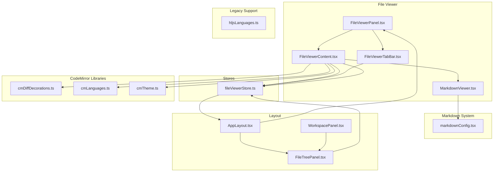

**Diagram sources**
- [FileViewerPanel.tsx:1-37](file://frontend/src/components/fileViewer/FileViewerPanel.tsx#L1-L37)
- [FileViewerTabBar.tsx:1-166](file://frontend/src/components/fileViewer/FileViewerTabBar.tsx#L1-L166)
- [FileViewerContent.tsx:1-271](file://frontend/src/components/fileViewer/FileViewerContent.tsx#L1-L271)
- [MarkdownViewer.tsx:1-46](file://frontend/src/components/MarkdownViewer.tsx#L1-L46)
- [fileViewerStore.ts:1-207](file://frontend/src/stores/fileViewerStore.ts#L1-L207)
- [cmDiffDecorations.ts:1-208](file://frontend/src/lib/cmDiffDecorations.ts#L1-L208)
- [cmLanguages.ts:1-81](file://frontend/src/lib/cmLanguages.ts#L1-L81)
- [cmTheme.ts:1-113](file://frontend/src/lib/cmTheme.ts#L1-L113)
- [markdownConfig.tsx:1-65](file://frontend/src/lib/markdownConfig.tsx#L1-L65)
- [hljsLanguages.ts:1-49](file://frontend/src/lib/hljsLanguages.ts#L1-L49)
- [AppLayout.tsx:24-54](file://frontend/src/components/layout/AppLayout.tsx#L24-L54)
- [WorkspacePanel.tsx:1-71](file://frontend/src/components/layout/WorkspacePanel.tsx#L1-L71)
- [FileTreePanel.tsx:1-34](file://frontend/src/components/layout/FileTreePanel.tsx#L1-L34)

**Section sources**
- [FileViewerPanel.tsx:1-37](file://frontend/src/components/fileViewer/FileViewerPanel.tsx#L1-L37)
- [AppLayout.tsx:24-54](file://frontend/src/components/layout/AppLayout.tsx#L24-L54)

## Core Components
- FileViewerPanel: Container that renders tabs and content, hides itself when no files are open or collapsed, and applies width from layout.
- FileViewerTabBar: Manages open files as tabs, supports switching, closing, scrolling active tab into view, and a dropdown menu for all open files.
- FileViewerContent: Renders active file content using CodeMirror 6 with syntax highlighting, line numbers, Markdown preview/preview toggle, inline diffs, and binary file handling.
- **New**: MarkdownViewer: Dedicated component for rendering Markdown content with source/preview toggle functionality, providing a clean interface for both raw and rendered Markdown views.

Key integration points:
- Uses fileViewerStore for open files, active file, and panel state.
- Reads file content and diffs via backend APIs exposed to the frontend.
- Integrates with workspace events to refresh content silently on external changes.
- Implements CodeMirror 6 editor view with custom decorations and theme system.
- **Enhanced**: Markdown files are now handled by the specialized MarkdownViewer component with toggle functionality.

**Section sources**
- [FileViewerPanel.tsx:7-36](file://frontend/src/components/fileViewer/FileViewerPanel.tsx#L7-L36)
- [FileViewerTabBar.tsx:31-165](file://frontend/src/components/fileViewer/FileViewerTabBar.tsx#L31-L165)
- [FileViewerContent.tsx:23-103](file://frontend/src/components/fileViewer/FileViewerContent.tsx#L23-L103)
- [MarkdownViewer.tsx:11-45](file://frontend/src/components/MarkdownViewer.tsx#L11-L45)
- [fileViewerStore.ts:53-206](file://frontend/src/stores/fileViewerStore.ts#L53-L206)

## Architecture Overview
The file viewer system now features a specialized Markdown rendering pipeline with the new MarkdownViewer component. The system maintains its reactive architecture with Zustand store integration while leveraging CodeMirror's advanced editor capabilities and adding dedicated components for different file types.

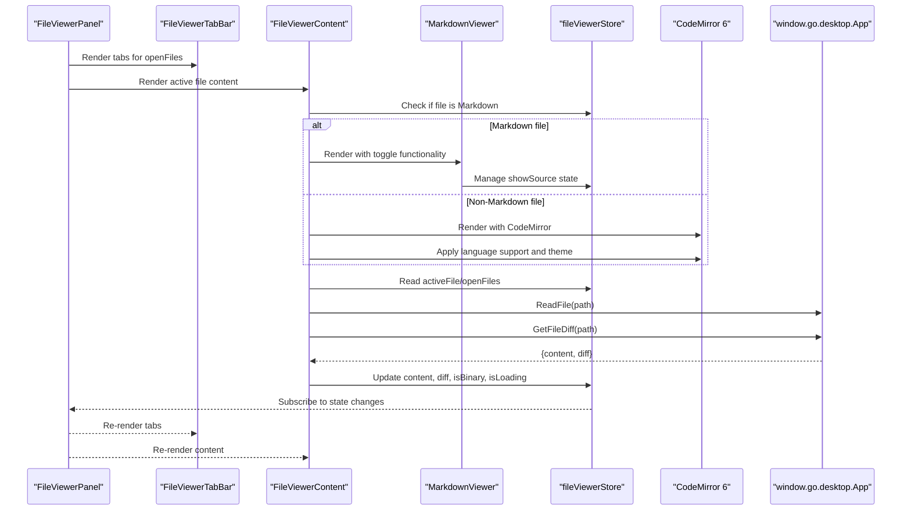

**Diagram sources**
- [FileViewerPanel.tsx:7-36](file://frontend/src/components/fileViewer/FileViewerPanel.tsx#L7-L36)
- [FileViewerTabBar.tsx:31-165](file://frontend/src/components/fileViewer/FileViewerTabBar.tsx#L31-L165)
- [FileViewerContent.tsx:23-103](file://frontend/src/components/fileViewer/FileViewerContent.tsx#L23-L103)
- [MarkdownViewer.tsx:11-45](file://frontend/src/components/MarkdownViewer.tsx#L11-L45)
- [fileViewerStore.ts:53-206](file://frontend/src/stores/fileViewerStore.ts#L53-L206)

## Detailed Component Analysis

### FileViewerPanel
- Purpose: Main container for the file viewer area. It hides itself when no files are open or when collapsed, and applies a dynamic width from the layout.
- Responsibilities:
  - Conditionally render tabs and content based on open files and collapse state.
  - Pass width to child components for responsive sizing.
- Integration:
  - Subscribes to openTabs and collapsed state from the store.
  - Renders FileViewerTabBar and FileViewerContent.

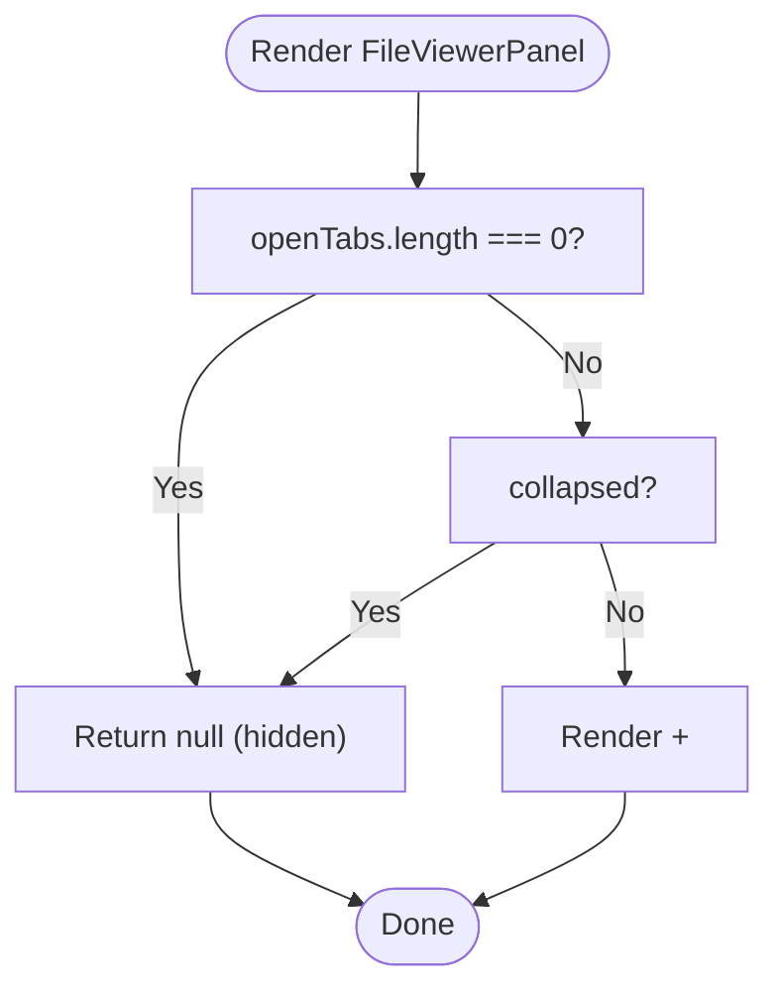

**Diagram sources**
- [FileViewerPanel.tsx:7-36](file://frontend/src/components/fileViewer/FileViewerPanel.tsx#L7-L36)

**Section sources**
- [FileViewerPanel.tsx:7-36](file://frontend/src/components/fileViewer/FileViewerPanel.tsx#L7-L36)
- [AppLayout.tsx:24-54](file://frontend/src/components/layout/AppLayout.tsx#L24-L54)

### FileViewerTabBar
- Purpose: Tab bar for managing multiple open files.
- Features:
  - Displays file icons and names.
  - Active tab highlighting and hover states.
  - Close buttons per tab with accessible labels.
  - Auto-scroll active tab into view.
  - Dropdown menu listing all open files with "active" indicator.
  - Collapse button to minimize the inspector.
- Interactions:
  - Click tab to switch active file.
  - Click close to close a file.
  - Use dropdown to quickly navigate among open files.

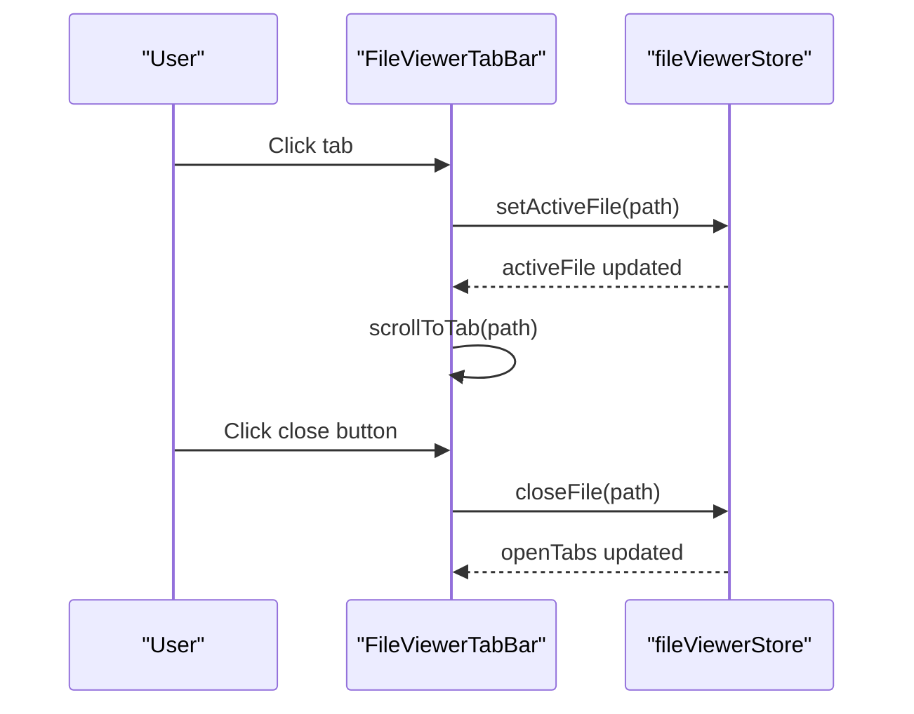

**Diagram sources**
- [FileViewerTabBar.tsx:31-165](file://frontend/src/components/fileViewer/FileViewerTabBar.tsx#L31-L165)
- [fileViewerStore.ts:64-122](file://frontend/src/stores/fileViewerStore.ts#L64-L122)

**Section sources**
- [FileViewerTabBar.tsx:31-165](file://frontend/src/components/fileViewer/FileViewerTabBar.tsx#L31-L165)
- [fileViewerStore.ts:64-122](file://frontend/src/stores/fileViewerStore.ts#L64-L122)

### FileViewerContent
- Purpose: Renders the active file's content using CodeMirror 6 with enhanced syntax highlighting, line numbers, and specialized Markdown rendering.
- Highlights:
  - CodeMirror 6 editor view with syntax highlighting via language support.
  - Line-by-line rendering with numbers and custom theme integration.
  - Inline diffs using custom decorations with added/removed/modified styling.
  - **Enhanced**: Markdown files are now handled by the dedicated MarkdownViewer component with source/preview toggle.
  - Binary file detection and graceful handling.
  - Loading and error states with proper cleanup.
  - Scroll position preservation during content updates.
  - Dynamic language loading and theme switching.
- File type detection and rendering:
  - Language detection using @codemirror/language-data with fallback mappings.
  - **New**: Markdown-specific handling with MarkdownViewer component for toggle functionality.
  - Unified diff parsing and display line construction with custom decorations.
- Backend integration:
  - Reads file content and diff via Wails-bound APIs.
  - Subscribes to workspace tree changes to silently refresh content.

**Updated** Enhanced with MarkdownViewer component for specialized Markdown rendering

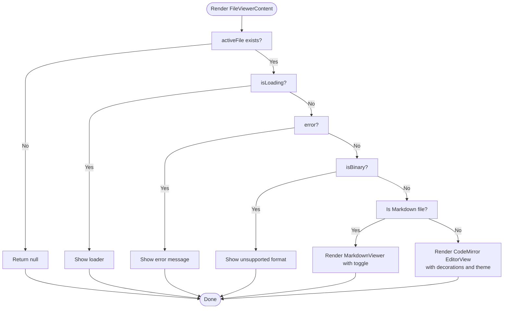

**Diagram sources**
- [FileViewerContent.tsx:23-103](file://frontend/src/components/fileViewer/FileViewerContent.tsx#L23-L103)
- [FileViewerContent.tsx:107-271](file://frontend/src/components/fileViewer/FileViewerContent.tsx#L107-L271)
- [MarkdownViewer.tsx:11-45](file://frontend/src/components/MarkdownViewer.tsx#L11-L45)
- [cmDiffDecorations.ts:57-108](file://frontend/src/lib/cmDiffDecorations.ts#L57-L108)
- [cmTheme.ts:17-112](file://frontend/src/lib/cmTheme.ts#L17-L112)

**Section sources**
- [FileViewerContent.tsx:23-103](file://frontend/src/components/fileViewer/FileViewerContent.tsx#L23-L103)
- [FileViewerContent.tsx:107-271](file://frontend/src/components/fileViewer/FileViewerContent.tsx#L107-L271)
- [fileViewerStore.ts:53-206](file://frontend/src/stores/fileViewerStore.ts#L53-L206)

### MarkdownViewer Component
- Purpose: Dedicated component for rendering Markdown content with source/preview toggle functionality.
- Features:
  - State management for showSource toggle with useState hook.
  - Preview mode using the simplified Markdown component from markdownConfig.
  - Raw source mode displaying content in a monospace font with syntax highlighting.
  - Floating action buttons for switching between preview and source modes.
  - Accessible tooltips and proper ARIA labels.
- Integration:
  - Uses the simplified markdownConfig Markdown component for rendering.
  - Manages its own state independently of the main file viewer store.
  - Provides a clean interface for Markdown content display.

**New** Dedicated component for enhanced Markdown rendering

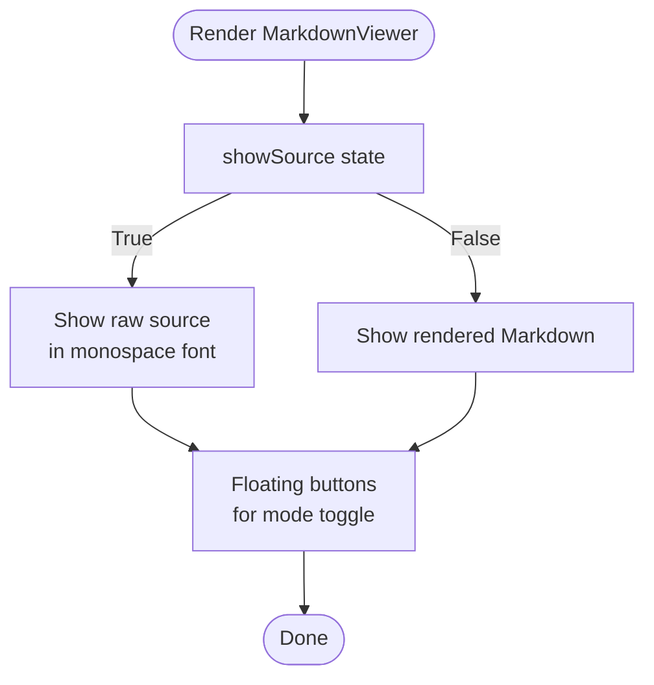

**Diagram sources**
- [MarkdownViewer.tsx:11-45](file://frontend/src/components/MarkdownViewer.tsx#L11-L45)

**Section sources**
- [MarkdownViewer.tsx:1-46](file://frontend/src/components/MarkdownViewer.tsx#L1-L46)

### CodeMirror-Based Rendering System
- **EditorView Creation**: Creates a CodeMirror 6 EditorView with read-only state, line numbers, and custom theme.
- **Language Support**: Dynamically loads languages via @codemirror/language-data with fallback mappings for special files.
- **Custom Decorations**: Implements state fields for diff decorations and line highlighting using CodeMirror's effect system.
- **Theme Integration**: One Dark theme created from CSS variables for consistent design system integration.
- **Performance Optimizations**: Uses compartments for language switching, memoized themes, and incremental updates.

**Section sources**
- [FileViewerContent.tsx:124-154](file://frontend/src/components/fileViewer/FileViewerContent.tsx#L124-L154)
- [cmLanguages.ts:41-80](file://frontend/src/lib/cmLanguages.ts#L41-L80)
- [cmDiffDecorations.ts:9-207](file://frontend/src/lib/cmDiffDecorations.ts#L9-L207)
- [cmTheme.ts:17-112](file://frontend/src/lib/cmTheme.ts#L17-L112)

### File Type Detection and Customization
- **Language Detection**:
  - Uses @codemirror/language-data LanguageDescription.matchFilename for primary detection.
  - Includes fallback mappings for special filenames (Makefile, Dockerfile, .gitignore, etc.).
  - Handles extension-based fallbacks for formats like TOML, INI, and configuration files.
- **Dynamic Language Loading**:
  - Asynchronously loads language support via loadLanguageByName function.
  - Uses CodeMirror's compartment system for efficient language switching.
  - Falls back to plaintext for unknown or unsupported languages.
- **Markdown Rendering**:
  - **Enhanced**: Now uses the dedicated MarkdownViewer component with toggle functionality.
  - Simplified markdownConfig with streamlined configuration object.
  - GitHub Flavored Markdown with emoji, breaks, slug generation, autolinking, external links, sanitization, and Mermaid diagrams.
  - Toggle between preview and raw source modes through MarkdownViewer.
- **Customization Options**:
  - Extend FILENAME_FALLBACK and EXT_FALLBACK maps for new file types.
  - Add new CodeMirror language support via language-data integration.
  - Customize theme colors by modifying CSS variables.

**Updated** Enhanced with dedicated MarkdownViewer component and simplified markdownConfig

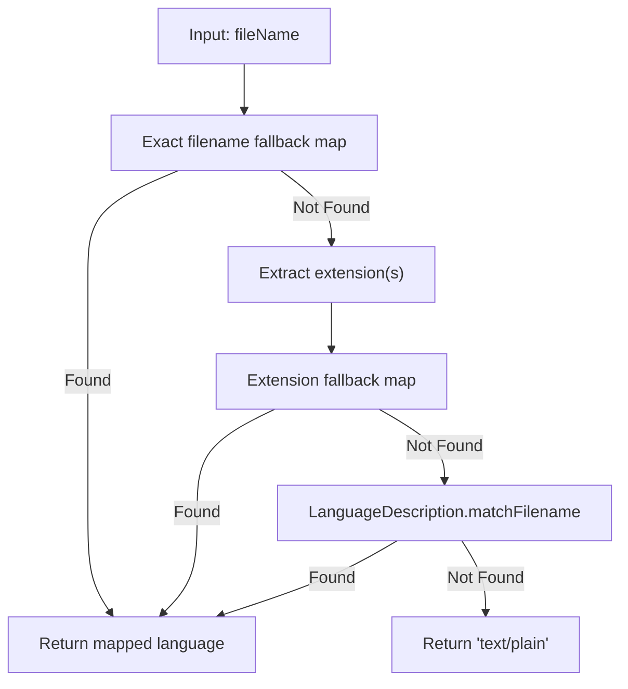

**Diagram sources**
- [cmLanguages.ts:41-61](file://frontend/src/lib/cmLanguages.ts#L41-L61)

**Section sources**
- [cmLanguages.ts:9-61](file://frontend/src/lib/cmLanguages.ts#L9-L61)
- [cmLanguages.ts:70-80](file://frontend/src/lib/cmLanguages.ts#L70-L80)
- [markdownConfig.tsx:17-44](file://frontend/src/lib/markdownConfig.tsx#L17-L44)
- [markdownConfig.tsx:52-63](file://frontend/src/lib/markdownConfig.tsx#L52-L63)

### Custom Diff Decorations System
- **State Management**: Uses CodeMirror StateField and StateEffect for efficient diff decoration updates.
- **Decoration Types**:
  - Added lines: Line decoration with cm-diff-added class.
  - Modified lines: Line decoration with cm-diff-modified class and character-level diffs.
  - Removed lines: Block widget with cm-diff-removed-widget class positioned before next document line.
  - Normal lines: No decoration.
- **Character-Level Diff**: Computes word-level differences using diffWords and applies cm-diff-char-added marks.
- **Widget Implementation**: Custom RemovedLineWidget renders deleted content with proper styling and positioning.
- **Performance**: Efficiently maps decorations through document changes and maintains position accuracy.

**Updated** Complete rewrite using CodeMirror's state field and effect system

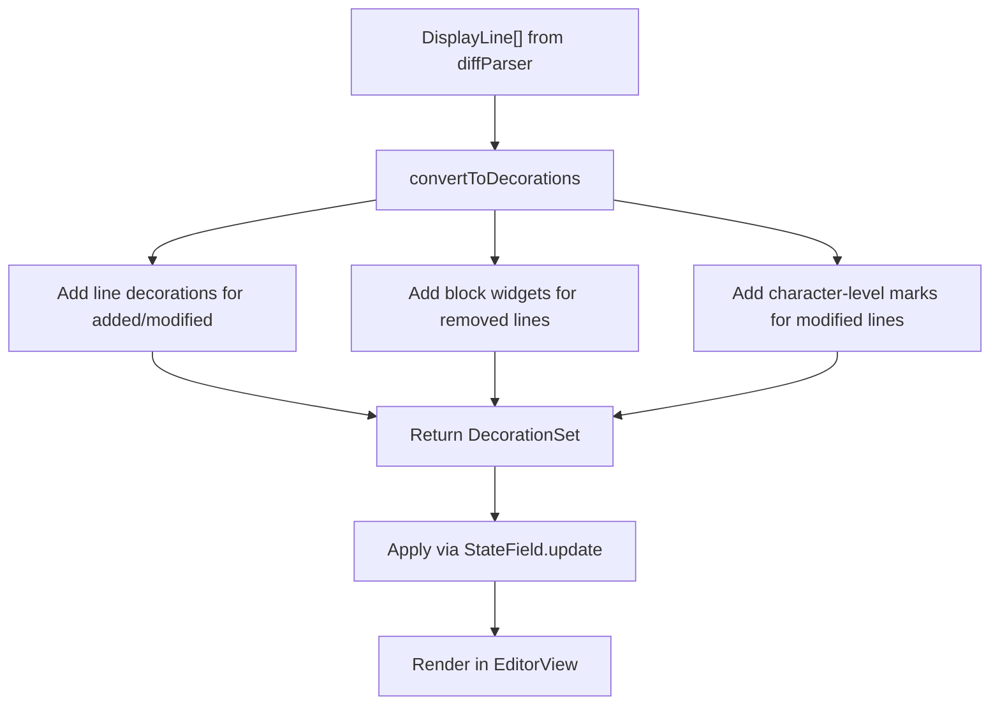

**Diagram sources**
- [cmDiffDecorations.ts:57-108](file://frontend/src/lib/cmDiffDecorations.ts#L57-L108)
- [cmDiffDecorations.ts:14-40](file://frontend/src/lib/cmDiffDecorations.ts#L14-L40)
- [diffParser.ts:127-175](file://frontend/src/lib/diffParser.ts#L127-L175)

**Section sources**
- [cmDiffDecorations.ts:9-207](file://frontend/src/lib/cmDiffDecorations.ts#L9-L207)
- [diffParser.ts:48-175](file://frontend/src/lib/diffParser.ts#L48-L175)

### Theme Integration System
- **CSS Variable Integration**: Theme colors resolved from CSS custom properties (--color-foreground, --color-hljs-comment, etc.).
- **One Dark Theme**: Custom theme implementation matching the application's design system.
- **Syntax Highlighting**: Uses HighlightStyle with Lezer tags for consistent color mapping.
- **Editor Styling**: Custom EditorView theme for fonts, colors, gutters, and scrollbars.
- **Dynamic Updates**: Theme applied as CodeMirror extension, integrated with the store's theme preferences.

**Updated** New CodeMirror theme system replacing highlight.js styling

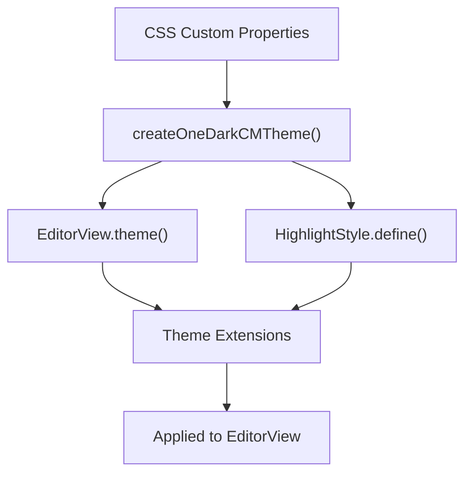

**Diagram sources**
- [cmTheme.ts:6-112](file://frontend/src/lib/cmTheme.ts#L6-L112)

**Section sources**
- [cmTheme.ts:17-112](file://frontend/src/lib/cmTheme.ts#L17-L112)

### Integration with Workspace System
- **File Opening**: Opens files via the file tree panel and persists state to local storage.
- **Silent Refresh**: On workspace tree changes, content is refreshed without visual loading indicators to preserve scroll position.
- **Workspace Filtering**: File tree supports glob and regex filtering for efficient navigation.
- **CodeMirror Integration**: Uses CodeMirror's built-in subscription system for workspace events.
- **Markdown Integration**: Markdown files are automatically routed to the MarkdownViewer component for specialized rendering.

**Updated** Enhanced integration with CodeMirror's event system and MarkdownViewer

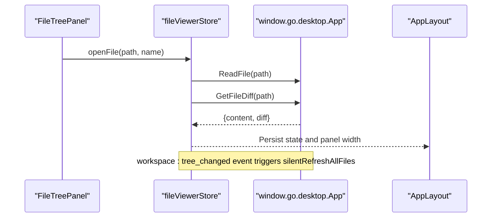

**Diagram sources**
- [FileTreePanel.tsx:1-34](file://frontend/src/components/layout/FileTreePanel.tsx#L1-L34)
- [fileViewerStore.ts:64-122](file://frontend/src/stores/fileViewerStore.ts#L64-L122)
- [fileViewerStore.ts:58-65](file://frontend/src/stores/fileViewerStore.ts#L58-L65)
- [AppLayout.tsx:24-54](file://frontend/src/components/layout/AppLayout.tsx#L24-L54)

**Section sources**
- [fileViewerStore.ts:64-122](file://frontend/src/stores/fileViewerStore.ts#L64-L122)
- [fileViewerStore.ts:58-65](file://frontend/src/stores/fileViewerStore.ts#L58-L65)
- [FileTreePanel.tsx:1-34](file://frontend/src/components/layout/FileTreePanel.tsx#L1-L34)
- [WorkspacePanel.tsx:26-71](file://frontend/src/components/layout/WorkspacePanel.tsx#L26-L71)

## Dependency Analysis
- FileViewerPanel depends on FileViewerTabBar and FileViewerContent and subscribes to fileViewerStore.
- FileViewerTabBar depends on fileViewerStore for open files and actions.
- FileViewerContent depends on:
  - fileViewerStore for active file and state.
  - cmLanguages for CodeMirror language detection and dynamic loading.
  - cmDiffDecorations for custom diff rendering and state management.
  - cmTheme for CodeMirror theme integration.
  - diffParser for unified diff parsing and display line construction.
  - **New**: MarkdownViewer for specialized Markdown rendering.
  - markdownConfig for simplified Markdown rendering and sanitization.
  - fileViewerUtils for binary content detection.
- **New**: MarkdownViewer depends on:
  - useState for toggle state management.
  - Button component for UI controls.
  - Markdown component from markdownConfig for rendering.
- Stores depend on Wails-bound backend APIs for file read and diff retrieval.
- **Legacy Support**: hljsLanguages.ts remains for backward compatibility but is no longer actively used.

**Updated** Enhanced dependency graph with MarkdownViewer component

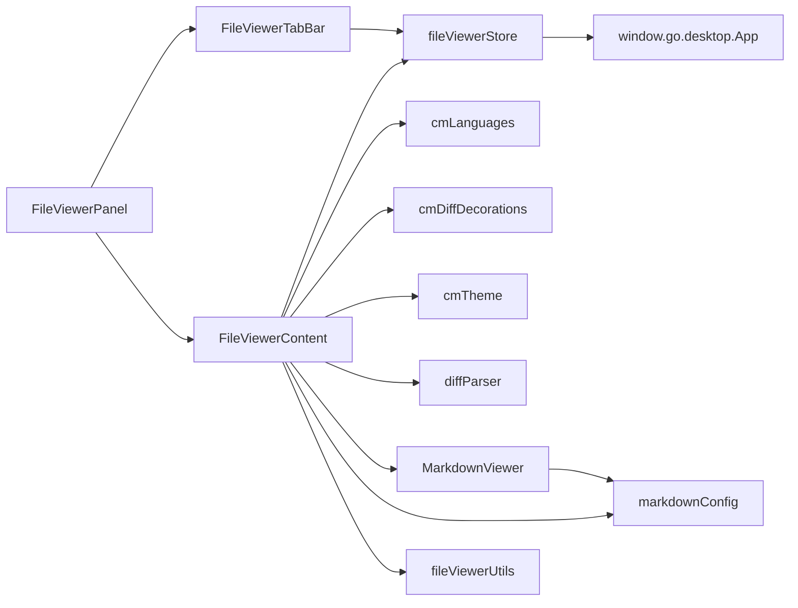

**Diagram sources**
- [FileViewerPanel.tsx:1-37](file://frontend/src/components/fileViewer/FileViewerPanel.tsx#L1-L37)
- [FileViewerTabBar.tsx:1-166](file://frontend/src/components/fileViewer/FileViewerTabBar.tsx#L1-L166)
- [FileViewerContent.tsx:1-271](file://frontend/src/components/fileViewer/FileViewerContent.tsx#L1-L271)
- [MarkdownViewer.tsx:1-46](file://frontend/src/components/MarkdownViewer.tsx#L1-L46)
- [fileViewerStore.ts:1-207](file://frontend/src/stores/fileViewerStore.ts#L1-L207)
- [cmLanguages.ts:1-81](file://frontend/src/lib/cmLanguages.ts#L1-L81)
- [cmDiffDecorations.ts:1-208](file://frontend/src/lib/cmDiffDecorations.ts#L1-L208)
- [cmTheme.ts:1-113](file://frontend/src/lib/cmTheme.ts#L1-L113)
- [diffParser.ts:1-176](file://frontend/src/lib/diffParser.ts#L1-L176)
- [markdownConfig.tsx:1-65](file://frontend/src/lib/markdownConfig.tsx#L1-L65)
- [fileViewerUtils.ts:1-18](file://frontend/src/lib/fileViewerUtils.ts#L1-L18)

**Section sources**
- [fileViewerStore.ts:53-206](file://frontend/src/stores/fileViewerStore.ts#L53-L206)

## Performance Considerations
- **CodeMirror 6 Benefits**:
  - Efficient DOM updates through ProseMirror's state system.
  - Incremental rendering with proper document change tracking.
  - Dynamic language loading reduces initial bundle size.
  - Custom decorations system optimized for diff rendering.
- **Asynchronous Loading**:
  - File content and diffs are fetched concurrently when opening a file.
  - Languages loaded asynchronously via CodeMirror's compartment system.
- **Silent Refresh**:
  - On workspace changes, content is refreshed without showing loaders.
- **Binary Detection**:
  - Early detection of binary content prevents heavy processing.
- **Scroll Preservation**:
  - Saved scroll position is restored after content updates.
- **Large File Rendering**:
  - CodeMirror's virtual scrolling handles large files efficiently.
  - Line-by-line rendering with proper document change tracking.
- **Theme Optimization**:
  - Themes memoized to avoid unnecessary re-renders.
  - CSS variable integration for dynamic theme switching.
- **Markdown Performance**:
  - **Enhanced**: MarkdownViewer component provides efficient toggle functionality.
  - **Improved**: Simplified markdownConfig reduces overhead while maintaining rich features.
  - **Optimized**: Separate rendering paths for Markdown vs non-Markdown files.

**Updated** Performance improvements from MarkdownViewer and simplified markdownConfig

Recommendations:
- Consider CodeMirror's built-in virtual scrolling for extremely large files.
- Monitor compartment reconfiguration performance for frequent language switching.
- Use debounced workspace refresh events to avoid frequent reloads.
- Leverage CodeMirror's built-in diff rendering for better performance than previous implementations.
- **New**: Monitor MarkdownViewer component performance for large Markdown files with complex rendering.

**Section sources**
- [fileViewerStore.ts:58-65](file://frontend/src/stores/fileViewerStore.ts#L58-L65)
- [fileViewerStore.ts:58-65](file://frontend/src/stores/fileViewerStore.ts#L58-L65)
- [FileViewerContent.tsx:169-187](file://frontend/src/components/fileViewer/FileViewerContent.tsx#L169-L187)
- [FileViewerContent.tsx:209-238](file://frontend/src/components/fileViewer/FileViewerContent.tsx#L209-L238)
- [MarkdownViewer.tsx:11-45](file://frontend/src/components/MarkdownViewer.tsx#L11-L45)

## Troubleshooting Guide
Common issues and resolutions:
- **File does not appear in the viewer**:
  - Ensure the file was opened via the workspace and that the path is within the active project.
  - Check for errors returned by the backend read operation.
- **Binary file shows "unsupported format"**:
  - Binary detection scans the first 8KB for null bytes; this is expected behavior.
- **Markdown preview not rendering**:
  - **Updated**: Check if the file is detected as Markdown and routed to MarkdownViewer.
  - Verify that the Markdown component from markdownConfig is rendering correctly.
  - Inspect sanitized HTML and plugin configuration.
  - **New**: If toggle isn't working, check MarkdownViewer state management.
- **Tabs not updating after workspace changes**:
  - Confirm that the workspace tree changed event is firing and silent refresh is invoked.
- **Scroll jumps when content updates**:
  - Scroll preservation relies on CodeMirror's built-in scroll management.
- **Language not highlighting correctly**:
  - Check that the language is available in @codemirror/language-data or fallback mappings.
  - Verify that the language compartment is properly reconfigured.
- **Diff decorations not appearing**:
  - Ensure diff parsing succeeds and display lines are generated.
  - Check that the diff decoration field is properly applied to the EditorView.
- **Theme not applying correctly**:
  - Verify CSS variables are properly defined in the design system.
  - Check that the theme is applied as a CodeMirror extension.
- **MarkdownViewer toggle not working**:
  - **New**: Ensure MarkdownViewer component is receiving content prop correctly.
  - **New**: Check that state management is functioning properly for showSource toggle.
  - **New**: Verify that floating buttons are properly wired to toggle functionality.

**Updated** Issues specific to CodeMirror 6 implementation and new MarkdownViewer component

**Section sources**
- [fileViewerStore.ts:64-78](file://frontend/src/stores/fileViewerStore.ts#L64-L78)
- [fileViewerStore.ts:160-168](file://frontend/src/stores/fileViewerStore.ts#L160-L168)
- [FileViewerContent.tsx:34-42](file://frontend/src/components/fileViewer/FileViewerContent.tsx#L34-L42)
- [fileViewerStore.ts:58-65](file://frontend/src/stores/fileViewerStore.ts#L58-L65)
- [cmLanguages.ts:70-80](file://frontend/src/lib/cmLanguages.ts#L70-L80)
- [cmDiffDecorations.ts:160-178](file://frontend/src/lib/cmDiffDecorations.ts#L160-L178)
- [cmTheme.ts:17-112](file://frontend/src/lib/cmTheme.ts#L17-L112)
- [MarkdownViewer.tsx:11-45](file://frontend/src/components/MarkdownViewer.tsx#L11-L45)

## Conclusion
C0WRK's file viewer system has been significantly enhanced with the addition of a dedicated MarkdownViewer component and a simplified markdownConfig system. The new MarkdownViewer component provides specialized rendering capabilities for Markdown files with source/preview toggle functionality, while the streamlined markdownConfig maintains rich markdown features including GitHub Flavored Markdown, emoji support, syntax highlighting, and sanitization. The system continues to use CodeMirror 6 for enhanced syntax highlighting, custom diff decorations, and theme integration, offering a modern, performant, and feature-rich solution for viewing and navigating files within the workspace. The modular components—panel, tabs, content, and the new MarkdownViewer—work together with a centralized store to deliver responsive rendering, dynamic language support, inline diffs, and specialized Markdown previews. Integration with the workspace ensures seamless updates, while the new Markdown-focused architecture provides better maintainability and extensibility. The system is designed to be customizable for new file types and optimized for performance, especially with large files, representing a significant improvement over the previous implementation with enhanced Markdown capabilities.