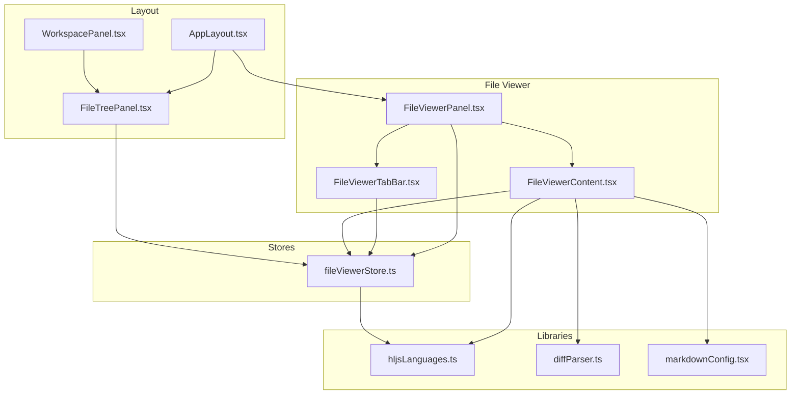
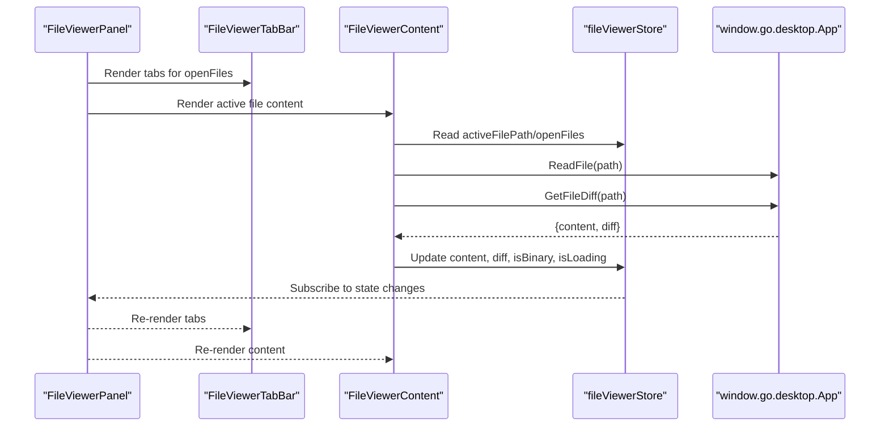
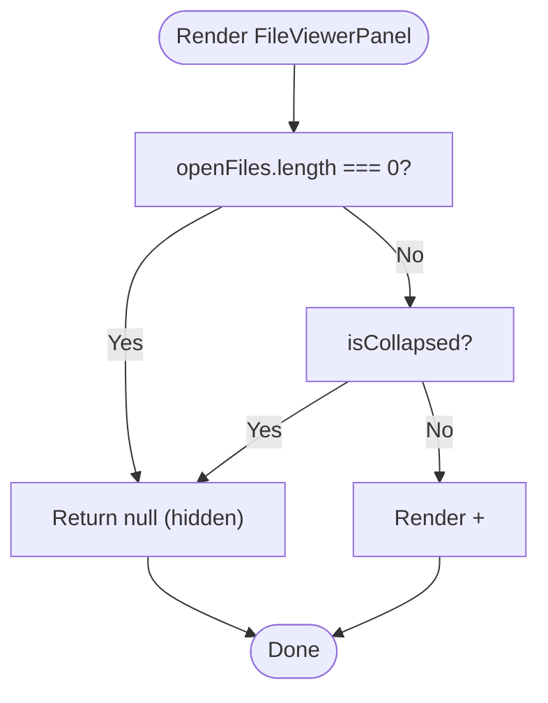
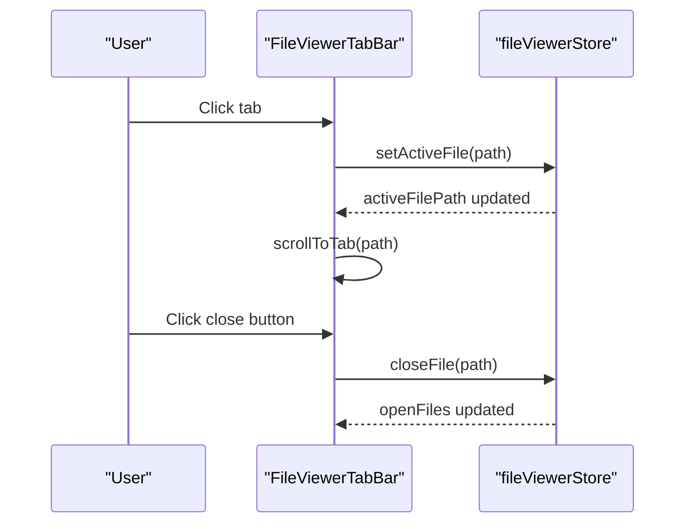
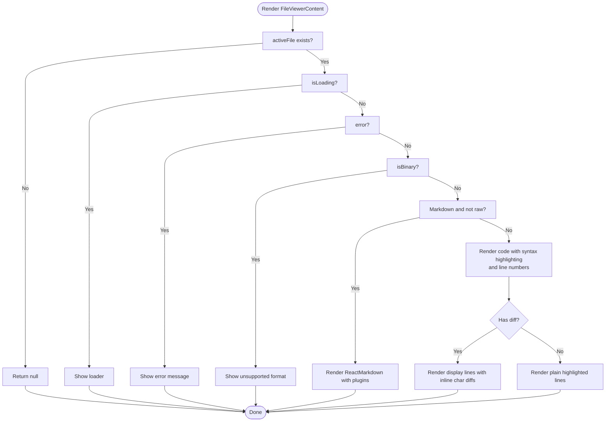
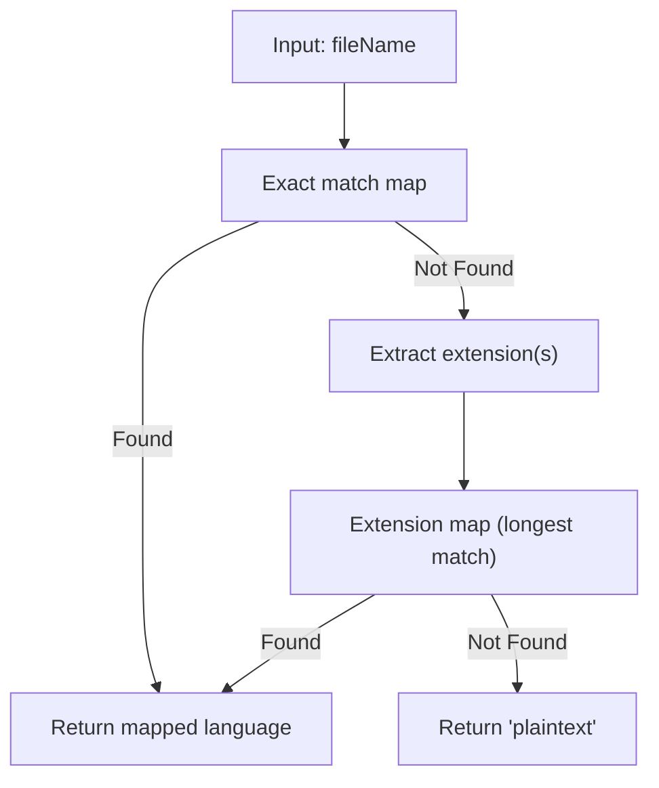
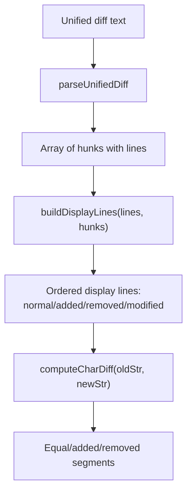
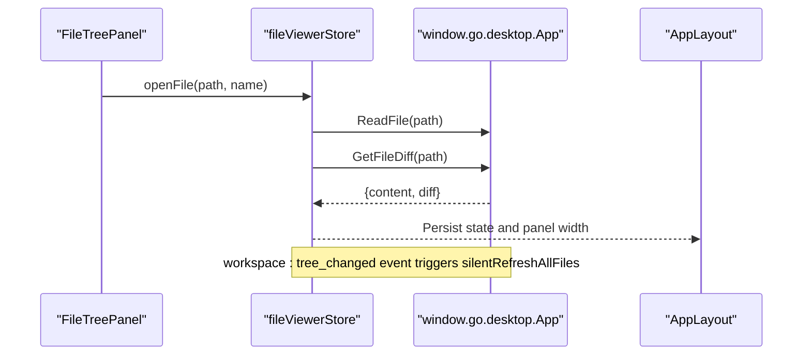
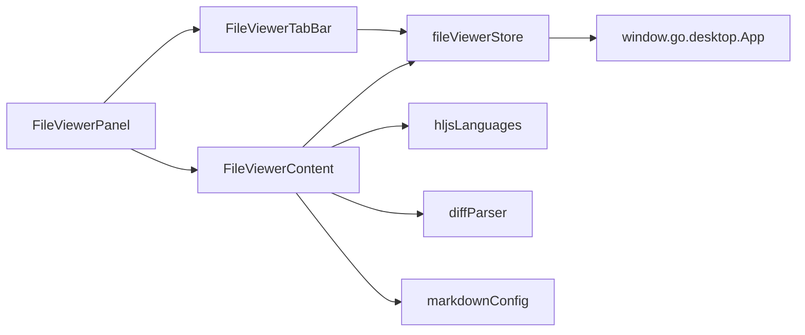

# File Viewer Components

<cite>
**Referenced Files in This Document**
- [FileViewerPanel.tsx](file://frontend/src/components/fileViewer/FileViewerPanel.tsx)
- [FileViewerTabBar.tsx](file://frontend/src/components/fileViewer/FileViewerTabBar.tsx)
- [FileViewerContent.tsx](file://frontend/src/components/fileViewer/FileViewerContent.tsx)
- [fileViewerStore.ts](file://frontend/src/stores/fileViewerStore.ts)
- [hljsLanguages.ts](file://frontend/src/lib/hljsLanguages.ts)
- [diffParser.ts](file://frontend/src/lib/diffParser.ts)
- [diffParser.test.ts](file://frontend/src/lib/diffParser.test.ts)
- [markdownConfig.tsx](file://frontend/src/lib/markdownConfig.tsx)
- [AppLayout.tsx](file://frontend/src/components/layout/AppLayout.tsx)
- [FileTreePanel.tsx](file://frontend/src/components/layout/FileTreePanel.tsx)
- [WorkspacePanel.tsx](file://frontend/src/components/layout/WorkspacePanel.tsx)
</cite>

## Table of Contents
1. [Introduction](#introduction)
2. [Project Structure](#project-structure)
3. [Core Components](#core-components)
4. [Architecture Overview](#architecture-overview)
5. [Detailed Component Analysis](#detailed-component-analysis)
6. [Dependency Analysis](#dependency-analysis)
7. [Performance Considerations](#performance-considerations)
8. [Troubleshooting Guide](#troubleshooting-guide)
9. [Conclusion](#conclusion)

## Introduction
This document describes the file viewer system in C0WRK, focusing on three primary UI components: FileViewerPanel as the main container, FileViewerTabBar for tab management, and FileViewerContent for rendering file content. It explains how file type detection, syntax highlighting, line numbering, inline diffs, and Markdown rendering work together, along with integration points to the workspace system and persistence. It also covers customization options for different file types, performance optimizations for large files, and accessibility features for code reading.

## Project Structure
The file viewer lives in the frontend under the components and stores directories. It integrates with the global application layout and workspace panels.

**Diagram sources**
- [FileViewerPanel.tsx:1-26](file://frontend/src/components/fileViewer/FileViewerPanel.tsx#L1-L26)
- [FileViewerTabBar.tsx:1-151](file://frontend/src/components/fileViewer/FileViewerTabBar.tsx#L1-L151)
- [FileViewerContent.tsx:1-345](file://frontend/src/components/fileViewer/FileViewerContent.tsx#L1-L345)
- [fileViewerStore.ts:1-307](file://frontend/src/stores/fileViewerStore.ts#L1-L307)
- [hljsLanguages.ts:1-117](file://frontend/src/lib/hljsLanguages.ts#L1-L117)
- [diffParser.ts:1-372](file://frontend/src/lib/diffParser.ts#L1-L372)
- [markdownConfig.tsx:1-78](file://frontend/src/lib/markdownConfig.tsx#L1-L78)
- [AppLayout.tsx:24-54](file://frontend/src/components/layout/AppLayout.tsx#L24-L54)
- [WorkspacePanel.tsx:1-71](file://frontend/src/components/layout/WorkspacePanel.tsx#L1-L71)
- [FileTreePanel.tsx:1-34](file://frontend/src/components/layout/FileTreePanel.tsx#L1-L34)

**Section sources**
- [FileViewerPanel.tsx:1-26](file://frontend/src/components/fileViewer/FileViewerPanel.tsx#L1-L26)
- [AppLayout.tsx:24-54](file://frontend/src/components/layout/AppLayout.tsx#L24-L54)

## Core Components
- FileViewerPanel: Container that renders tabs and content, hides itself when no files are open or collapsed, and applies width from layout.
- FileViewerTabBar: Manages open files as tabs, supports switching, closing, scrolling active tab into view, and a dropdown menu for all open files.
- FileViewerContent: Renders active file content with syntax highlighting, line numbers, Markdown preview/raw toggle, inline diffs, and binary file handling.

Key integration points:
- Uses fileViewerStore for open files, active file, and panel state.
- Reads file content and diffs via backend APIs exposed to the frontend.
- Integrates with workspace events to refresh content silently on external changes.

**Section sources**
- [FileViewerPanel.tsx:9-26](file://frontend/src/components/fileViewer/FileViewerPanel.tsx#L9-L26)
- [FileViewerTabBar.tsx:18-151](file://frontend/src/components/fileViewer/FileViewerTabBar.tsx#L18-L151)
- [FileViewerContent.tsx:18-63](file://frontend/src/components/fileViewer/FileViewerContent.tsx#L18-L63)
- [fileViewerStore.ts:108-278](file://frontend/src/stores/fileViewerStore.ts#L108-L278)

## Architecture Overview
The file viewer is a client-side React system backed by a Zustand store. It communicates with the backend through Wails-bound APIs to read file content and diffs. Rendering is optimized for large files and includes Markdown support and inline diffs.

**Diagram sources**
- [FileViewerPanel.tsx:9-26](file://frontend/src/components/fileViewer/FileViewerPanel.tsx#L9-L26)
- [FileViewerTabBar.tsx:18-151](file://frontend/src/components/fileViewer/FileViewerTabBar.tsx#L18-L151)
- [FileViewerContent.tsx:18-63](file://frontend/src/components/fileViewer/FileViewerContent.tsx#L18-L63)
- [fileViewerStore.ts:114-167](file://frontend/src/stores/fileViewerStore.ts#L114-L167)
- [fileViewerStore.ts:213-247](file://frontend/src/stores/fileViewerStore.ts#L213-L247)

## Detailed Component Analysis

### FileViewerPanel
- Purpose: Main container for the file viewer area. It hides itself when no files are open or when collapsed, and applies a dynamic width from the layout.
- Responsibilities:
  - Conditionally render tabs and content based on open files and collapse state.
  - Pass width to child components for responsive sizing.
- Integration:
  - Subscribes to openFiles and isCollapsed from the store.
  - Renders FileViewerTabBar and FileViewerContent.

**Diagram sources**
- [FileViewerPanel.tsx:9-26](file://frontend/src/components/fileViewer/FileViewerPanel.tsx#L9-L26)

**Section sources**
- [FileViewerPanel.tsx:9-26](file://frontend/src/components/fileViewer/FileViewerPanel.tsx#L9-L26)
- [AppLayout.tsx:24-54](file://frontend/src/components/layout/AppLayout.tsx#L24-L54)

### FileViewerTabBar
- Purpose: Tab bar for managing multiple open files.
- Features:
  - Displays file icons and names.
  - Active tab highlighting and hover states.
  - Close buttons per tab with accessible labels.
  - Auto-scroll active tab into view.
  - Dropdown menu listing all open files with “active” indicator.
  - Collapse button to minimize the inspector.
- Interactions:
  - Click tab to switch active file.
  - Click close to close a file.
  - Use dropdown to quickly navigate among open files.

**Diagram sources**
- [FileViewerTabBar.tsx:18-151](file://frontend/src/components/fileViewer/FileViewerTabBar.tsx#L18-L151)
- [fileViewerStore.ts:169-188](file://frontend/src/stores/fileViewerStore.ts#L169-L188)

**Section sources**
- [FileViewerTabBar.tsx:18-151](file://frontend/src/components/fileViewer/FileViewerTabBar.tsx#L18-L151)
- [fileViewerStore.ts:169-188](file://frontend/src/stores/fileViewerStore.ts#L169-L188)

### FileViewerContent
- Purpose: Renders the active file’s content with syntax highlighting, line numbers, and optional Markdown preview.
- Highlights:
  - Syntax highlighting via highlight.js with language detection.
  - Line-by-line rendering with numbers.
  - Inline diffs for added/removed/modified lines.
  - Markdown preview with GitHub-flavored markdown and sanitization.
  - Binary file detection and graceful handling.
  - Loading and error states.
  - Scroll position preservation during content updates.
- File type detection and rendering:
  - Language detection based on file name/extension.
  - Markdown-specific preview/raw toggle.
  - Unified diff parsing and display line building.
- Backend integration:
  - Reads file content and diff via Wails-bound APIs.
  - Subscribes to workspace tree changes to silently refresh content.

**Diagram sources**
- [FileViewerContent.tsx:18-63](file://frontend/src/components/fileViewer/FileViewerContent.tsx#L18-L63)
- [FileViewerContent.tsx:67-203](file://frontend/src/components/fileViewer/FileViewerContent.tsx#L67-L203)
- [diffParser.ts:262-371](file://frontend/src/lib/diffParser.ts#L262-L371)
- [markdownConfig.tsx:26-77](file://frontend/src/lib/markdownConfig.tsx#L26-L77)

**Section sources**
- [FileViewerContent.tsx:18-63](file://frontend/src/components/fileViewer/FileViewerContent.tsx#L18-L63)
- [FileViewerContent.tsx:67-203](file://frontend/src/components/fileViewer/FileViewerContent.tsx#L67-L203)
- [fileViewerStore.ts:114-167](file://frontend/src/stores/fileViewerStore.ts#L114-L167)

### File Type Detection and Customization
- Language detection:
  - Exact filename matches and extension-based mapping.
  - Longest extension match resolution.
  - Fallback to plaintext for unknowns.
- Highlight.js registration:
  - All supported languages are registered once at startup.
- Markdown rendering:
  - GitHub Flavored Markdown, emoji, breaks, slug generation, autolinking, external links, sanitization, and Mermaid diagrams.
- Customization options:
  - Add new languages to the registration map.
  - Extend the extension-to-language map.
  - Customize Markdown plugins and sanitization schema.

**Diagram sources**
- [hljsLanguages.ts:48-116](file://frontend/src/lib/hljsLanguages.ts#L48-L116)

**Section sources**
- [hljsLanguages.ts:24-42](file://frontend/src/lib/hljsLanguages.ts#L24-L42)
- [hljsLanguages.ts:48-116](file://frontend/src/lib/hljsLanguages.ts#L48-L116)
- [markdownConfig.tsx:7-24](file://frontend/src/lib/markdownConfig.tsx#L7-L24)
- [markdownConfig.tsx:26-77](file://frontend/src/lib/markdownConfig.tsx#L26-L77)

### Diff Parsing and Inline Diffs
- Parses unified diff output into structured hunks and lines.
- Builds display lines that include removed lines and character-level diffs for modified lines.
- Supports pairing removed and added lines within a hunk to produce inline char diffs.

**Diagram sources**
- [diffParser.ts:75-156](file://frontend/src/lib/diffParser.ts#L75-L156)
- [diffParser.ts:262-371](file://frontend/src/lib/diffParser.ts#L262-L371)
- [diffParser.ts:224-254](file://frontend/src/lib/diffParser.ts#L224-L254)

**Section sources**
- [diffParser.ts:1-372](file://frontend/src/lib/diffParser.ts#L1-L372)
- [diffParser.test.ts:1-459](file://frontend/src/lib/diffParser.test.ts#L1-L459)

### Integration with Workspace System
- File opening:
  - Opens files via the file tree panel and persists state to local storage.
- Silent refresh:
  - On workspace tree changes, content is refreshed without visual loading indicators to preserve scroll position.
- Workspace filtering:
  - File tree supports glob and regex filtering for efficient navigation.

**Diagram sources**
- [FileTreePanel.tsx:1-34](file://frontend/src/components/layout/FileTreePanel.tsx#L1-L34)
- [fileViewerStore.ts:114-167](file://frontend/src/stores/fileViewerStore.ts#L114-L167)
- [fileViewerStore.ts:254-277](file://frontend/src/stores/fileViewerStore.ts#L254-L277)
- [AppLayout.tsx:24-54](file://frontend/src/components/layout/AppLayout.tsx#L24-L54)

**Section sources**
- [fileViewerStore.ts:114-167](file://frontend/src/stores/fileViewerStore.ts#L114-L167)
- [fileViewerStore.ts:254-277](file://frontend/src/stores/fileViewerStore.ts#L254-L277)
- [FileTreePanel.tsx:1-34](file://frontend/src/components/layout/FileTreePanel.tsx#L1-L34)
- [WorkspacePanel.tsx:26-71](file://frontend/src/components/layout/WorkspacePanel.tsx#L26-L71)

## Dependency Analysis
- FileViewerPanel depends on FileViewerTabBar and FileViewerContent and subscribes to fileViewerStore.
- FileViewerTabBar depends on fileViewerStore for open files and actions.
- FileViewerContent depends on:
  - fileViewerStore for active file and state.
  - hljsLanguages for language detection and registration.
  - diffParser for unified diff parsing and display line construction.
  - markdownConfig for Markdown rendering and sanitization.
- Stores depend on Wails-bound backend APIs for file read and diff retrieval.

**Diagram sources**
- [FileViewerPanel.tsx:1-26](file://frontend/src/components/fileViewer/FileViewerPanel.tsx#L1-L26)
- [FileViewerTabBar.tsx:1-151](file://frontend/src/components/fileViewer/FileViewerTabBar.tsx#L1-L151)
- [FileViewerContent.tsx:1-345](file://frontend/src/components/fileViewer/FileViewerContent.tsx#L1-L345)
- [fileViewerStore.ts:1-307](file://frontend/src/stores/fileViewerStore.ts#L1-L307)
- [hljsLanguages.ts:1-117](file://frontend/src/lib/hljsLanguages.ts#L1-L117)
- [diffParser.ts:1-372](file://frontend/src/lib/diffParser.ts#L1-L372)
- [markdownConfig.tsx:1-78](file://frontend/src/lib/markdownConfig.tsx#L1-L78)

**Section sources**
- [fileViewerStore.ts:108-278](file://frontend/src/stores/fileViewerStore.ts#L108-L278)

## Performance Considerations
- Asynchronous loading:
  - File content and diffs are fetched concurrently when opening a file to reduce perceived latency.
- Silent refresh:
  - On workspace changes, content is refreshed without showing loaders to avoid visual disruption.
- Binary detection:
  - Early detection of binary content prevents heavy processing.
- Scroll preservation:
  - Saved scroll position is restored after content updates to improve readability continuity.
- Large file rendering:
  - Line-by-line rendering with precomputed highlighted HTML chunks avoids reflow and improves responsiveness.
- Markdown rendering:
  - Plugins are configured to sanitize and optimize rendering for safety and performance.

Recommendations:
- Consider virtualized lists for extremely large files to limit DOM nodes.
- Debounce or throttle workspace refresh events to avoid frequent reloads.
- Lazy-load additional Markdown features (e.g., diagrams) only when needed.

**Section sources**
- [fileViewerStore.ts:140-144](file://frontend/src/stores/fileViewerStore.ts#L140-L144)
- [fileViewerStore.ts:254-277](file://frontend/src/stores/fileViewerStore.ts#L254-L277)
- [FileViewerContent.tsx:77-90](file://frontend/src/components/fileViewer/FileViewerContent.tsx#L77-L90)
- [FileViewerContent.tsx:100-121](file://frontend/src/components/fileViewer/FileViewerContent.tsx#L100-L121)

## Troubleshooting Guide
Common issues and resolutions:
- File does not appear in the viewer:
  - Ensure the file was opened via the workspace and that the path is within the active project.
  - Check for errors returned by the backend read operation.
- Binary file shows “unsupported format”:
  - Binary detection scans the first 8KB for null bytes; this is expected behavior.
- Markdown preview not rendering:
  - Verify that the file is detected as Markdown and that the preview toggle is enabled.
  - Inspect sanitized HTML and plugin configuration.
- Tabs not updating after workspace changes:
  - Confirm that the workspace tree changed event is firing and silent refresh is invoked.
- Scroll jumps when content updates:
  - Scroll preservation relies on saving/restoring scrollTop; ensure the container ref is stable.

**Section sources**
- [fileViewerStore.ts:53-60](file://frontend/src/stores/fileViewerStore.ts#L53-L60)
- [fileViewerStore.ts:62-78](file://frontend/src/stores/fileViewerStore.ts#L62-L78)
- [FileViewerContent.tsx:46-62](file://frontend/src/components/fileViewer/FileViewerContent.tsx#L46-L62)
- [fileViewerStore.ts:254-277](file://frontend/src/stores/fileViewerStore.ts#L254-L277)

## Conclusion
C0WRK’s file viewer system provides a robust, extensible foundation for viewing and navigating files within the workspace. Its modular components—panel, tabs, and content—work together with a centralized store to deliver responsive rendering, syntax highlighting, inline diffs, and Markdown previews. Integration with the workspace ensures seamless updates, while persistence and accessibility features enhance usability. The system is designed to be customizable for new file types and optimized for performance, especially with large files.