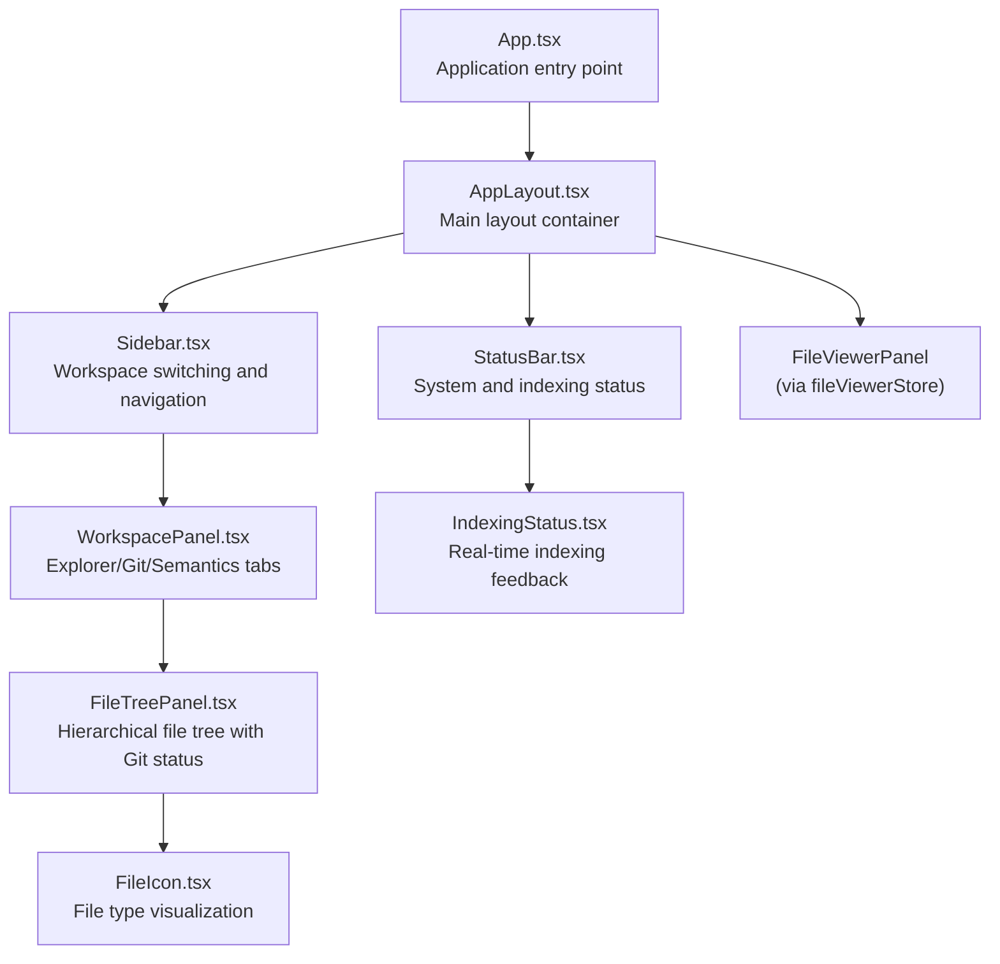
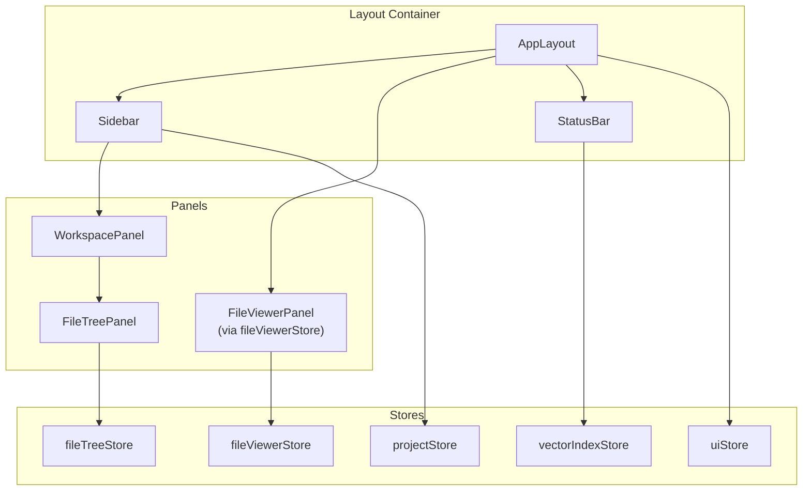
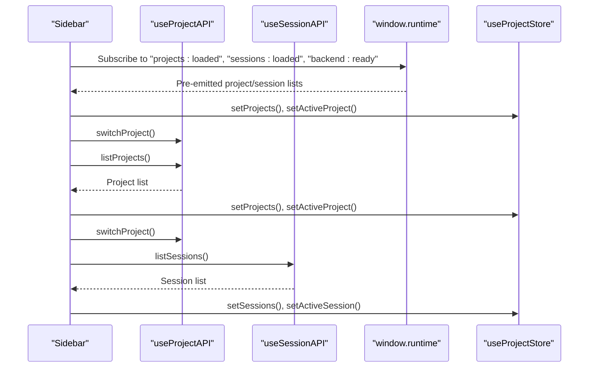
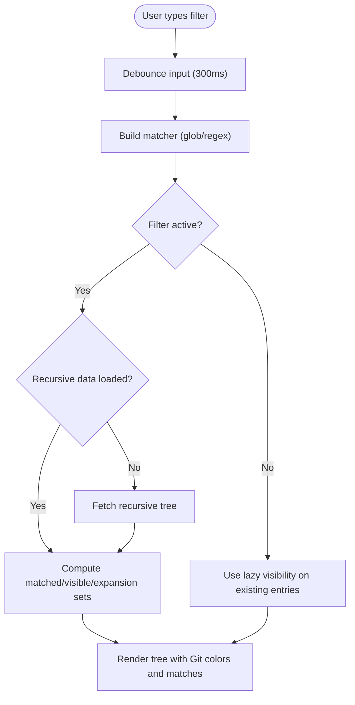
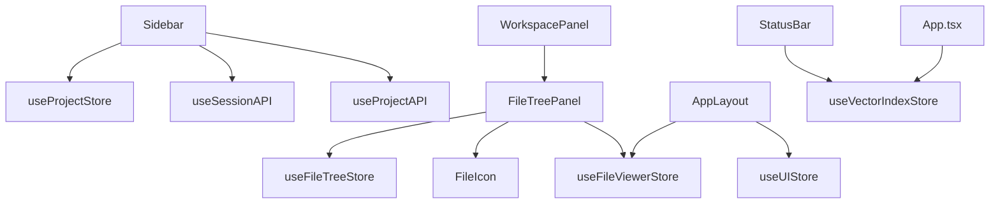

# Layout and Navigation Components

<cite>
**Referenced Files in This Document**
- [App.tsx](file://frontend/src/App.tsx)
- [AppLayout.tsx](file://frontend/src/components/layout/AppLayout.tsx)
- [Sidebar.tsx](file://frontend/src/components/layout/Sidebar.tsx)
- [WorkspacePanel.tsx](file://frontend/src/components/layout/WorkspacePanel.tsx)
- [FileTreePanel.tsx](file://frontend/src/components/layout/FileTreePanel.tsx)
- [StatusBar.tsx](file://frontend/src/components/layout/StatusBar.tsx)
- [IndexingStatus.tsx](file://frontend/src/components/layout/IndexingStatus.tsx)
- [FileIcon.tsx](file://frontend/src/components/layout/FileIcon.tsx)
- [useResize.tsx](file://frontend/src/hooks/useResize.tsx)
- [fileTreeStore.ts](file://frontend/src/stores/fileTreeStore.ts)
- [fileViewerStore.ts](file://frontend/src/stores/fileViewerStore.ts)
- [uiStore.ts](file://frontend/src/stores/uiStore.ts)
- [projectStore.ts](file://frontend/src/stores/projectStore.ts)
- [vectorIndexStore.ts](file://frontend/src/stores/vectorIndexStore.ts)
- [index.css](file://frontend/src/index.css)
</cite>

## Table of Contents
1. [Introduction](#introduction)
2. [Project Structure](#project-structure)
3. [Core Components](#core-components)
4. [Architecture Overview](#architecture-overview)
5. [Detailed Component Analysis](#detailed-component-analysis)
6. [Dependency Analysis](#dependency-analysis)
7. [Performance Considerations](#performance-considerations)
8. [Troubleshooting Guide](#troubleshooting-guide)
9. [Conclusion](#conclusion)

## Introduction
This document provides comprehensive documentation for C0WRK's layout and navigation components. It covers the AppLayout main container, responsive design patterns, Sidebar with workspace switching and project navigation, WorkspacePanel for project management and file browsing integration, FileTreePanel for hierarchical file navigation with Git-aware status indicators, StatusBar for system information and indexing status, IndexingStatus for real-time codebase indexing feedback, and FileIcon for file type visualization. It also explains layout composition patterns, responsive breakpoints, and customization options.

## Project Structure
The layout and navigation system resides in the frontend/src/components/layout directory and integrates with multiple stores for state management. The main application entry point initializes global banners and renders the AppLayout, which orchestrates the sidebar, main content area, file viewer, and status bar.

**Diagram sources**
- [App.tsx:21-87](file://frontend/src/App.tsx#L21-L87)
- [AppLayout.tsx:30-134](file://frontend/src/components/layout/AppLayout.tsx#L30-L134)
- [Sidebar.tsx:64-626](file://frontend/src/components/layout/Sidebar.tsx#L64-L626)
- [WorkspacePanel.tsx:26-70](file://frontend/src/components/layout/WorkspacePanel.tsx#L26-L70)
- [FileTreePanel.tsx:270-482](file://frontend/src/components/layout/FileTreePanel.tsx#L270-L482)
- [StatusBar.tsx:10-68](file://frontend/src/components/layout/StatusBar.tsx#L10-L68)
- [IndexingStatus.tsx:9-86](file://frontend/src/components/layout/IndexingStatus.tsx#L9-L86)
- [FileIcon.tsx:148-162](file://frontend/src/components/layout/FileIcon.tsx#L148-L162)

**Section sources**
- [App.tsx:21-87](file://frontend/src/App.tsx#L21-L87)
- [index.css:18-21](file://frontend/src/index.css#L18-L21)

## Core Components
- AppLayout: Orchestrates sidebar, main chat area, file viewer panel, and status bar with resizable panels and collapsed states.
- Sidebar: Manages project and session selection, workspace switching, and renders the WorkspacePanel.
- WorkspacePanel: Provides Explorer, Git, and Semantics tabs with a file tree in the Explorer tab.
- FileTreePanel: Renders hierarchical file navigation with filtering, Git status indicators, and file opening.
- StatusBar: Displays session name, routing domain, attempt counts, context fill percentage, and indexing status.
- IndexingStatus: Shows real-time progress for codebase indexing with animated indicators and progress bars.
- FileIcon: Visualizes file types using a seti-inspired icon palette and folder icons.
- Stores: fileTreeStore, fileViewerStore, uiStore, projectStore, vectorIndexStore manage state and persistence.

**Section sources**
- [AppLayout.tsx:30-134](file://frontend/src/components/layout/AppLayout.tsx#L30-L134)
- [Sidebar.tsx:64-626](file://frontend/src/components/layout/Sidebar.tsx#L64-L626)
- [WorkspacePanel.tsx:26-70](file://frontend/src/components/layout/WorkspacePanel.tsx#L26-L70)
- [FileTreePanel.tsx:270-482](file://frontend/src/components/layout/FileTreePanel.tsx#L270-L482)
- [StatusBar.tsx:10-68](file://frontend/src/components/layout/StatusBar.tsx#L10-L68)
- [IndexingStatus.tsx:9-86](file://frontend/src/components/layout/IndexingStatus.tsx#L9-L86)
- [FileIcon.tsx:148-162](file://frontend/src/components/layout/FileIcon.tsx#L148-L162)
- [fileTreeStore.ts:78-243](file://frontend/src/stores/fileTreeStore.ts#L78-L243)
- [fileViewerStore.ts:108-278](file://frontend/src/stores/fileViewerStore.ts#L108-L278)
- [uiStore.ts:35-52](file://frontend/src/stores/uiStore.ts#L35-L52)
- [projectStore.ts:25-43](file://frontend/src/stores/projectStore.ts#L25-L43)
- [vectorIndexStore.ts:30-55](file://frontend/src/stores/vectorIndexStore.ts#L30-L55)

## Architecture Overview
The layout follows a responsive, resizable panel architecture with persistent UI state. The sidebar can be collapsed and restored, and the file viewer panel can be resized and collapsed independently. The file tree supports recursive loading and filtering with Git status integration. The status bar aggregates session and indexing information.

**Diagram sources**
- [AppLayout.tsx:30-134](file://frontend/src/components/layout/AppLayout.tsx#L30-L134)
- [Sidebar.tsx:64-626](file://frontend/src/components/layout/Sidebar.tsx#L64-L626)
- [WorkspacePanel.tsx:26-70](file://frontend/src/components/layout/WorkspacePanel.tsx#L26-L70)
- [FileTreePanel.tsx:270-482](file://frontend/src/components/layout/FileTreePanel.tsx#L270-L482)
- [fileTreeStore.ts:78-243](file://frontend/src/stores/fileTreeStore.ts#L78-L243)
- [fileViewerStore.ts:108-278](file://frontend/src/stores/fileViewerStore.ts#L108-L278)
- [uiStore.ts:35-52](file://frontend/src/stores/uiStore.ts#L35-L52)
- [projectStore.ts:25-43](file://frontend/src/stores/projectStore.ts#L25-L43)
- [vectorIndexStore.ts:30-55](file://frontend/src/stores/vectorIndexStore.ts#L30-L55)

## Detailed Component Analysis

### AppLayout: Main Container and Responsive Panels
AppLayout composes the sidebar, main chat area, optional file viewer panel, and status bar. It manages:
- Resizable sidebar and file viewer panels using a shared resize hook pattern.
- Collapsed states for both panels with persistent UI state.
- Empty state handling when no projects are present.
- Synchronized persistence of file viewer width and collapsed state.

Responsive behavior:
- Uses fixed min/max widths for panels and a default width for initial sizing.
- Supports collapsing the sidebar to a narrow icon strip and expanding it back.
- File viewer panel can be collapsed to a thin strip and expanded.

Customization options:
- Adjust default/min/max widths for sidebar and file viewer.
- Modify collapsed widths for compact sidebar and file viewer.
- Toggle visibility of the file viewer based on open files.

**Diagram sources**
- [AppLayout.tsx:30-134](file://frontend/src/components/layout/AppLayout.tsx#L30-L134)
- [useResize.tsx:7-88](file://frontend/src/hooks/useResize.tsx#L7-L88)
- [uiStore.ts:35-52](file://frontend/src/stores/uiStore.ts#L35-L52)
- [fileViewerStore.ts:108-211](file://frontend/src/stores/fileViewerStore.ts#L108-L211)

**Section sources**
- [AppLayout.tsx:18-28](file://frontend/src/components/layout/AppLayout.tsx#L18-L28)
- [AppLayout.tsx:30-134](file://frontend/src/components/layout/AppLayout.tsx#L30-L134)
- [useResize.tsx:7-88](file://frontend/src/hooks/useResize.tsx#L7-L88)
- [uiStore.ts:35-52](file://frontend/src/stores/uiStore.ts#L35-L52)
- [fileViewerStore.ts:108-211](file://frontend/src/stores/fileViewerStore.ts#L108-L211)

### Sidebar: Workspace Switching and Project Navigation
The Sidebar component provides:
- Project selection dropdown with create/rename/delete actions.
- Session selection dropdown with search, archive/unarchive, and delete actions.
- WorkspacePanel integration for file browsing.
- Settings access and project creation flow.
- Early data loading via backend events and fallback fetching.

Key behaviors:
- Loads projects and sessions on mount and on backend ready events.
- Handles project switching and deletion with automatic fallback selection.
- Manages inline renaming for projects and sessions.
- Filters sessions by search term and separates archived sessions.

**Diagram sources**
- [Sidebar.tsx:100-178](file://frontend/src/components/layout/Sidebar.tsx#L100-L178)
- [Sidebar.tsx:207-232](file://frontend/src/components/layout/Sidebar.tsx#L207-L232)
- [Sidebar.tsx:235-257](file://frontend/src/components/layout/Sidebar.tsx#L235-L257)
- [Sidebar.tsx:279-315](file://frontend/src/components/layout/Sidebar.tsx#L279-L315)

**Section sources**
- [Sidebar.tsx:64-626](file://frontend/src/components/layout/Sidebar.tsx#L64-L626)
- [projectStore.ts:25-43](file://frontend/src/stores/projectStore.ts#L25-L43)

### WorkspacePanel: Project Management and File Browsing Integration
WorkspacePanel organizes three tabs:
- Explorer: Displays the FileTreePanel for hierarchical file navigation.
- Git: Placeholder for Git-related views.
- Semantics: Placeholder for semantic search views.

It uses a tooltip-enabled tab list with dynamic labels and provides a consistent header area for tab controls.

**Section sources**
- [WorkspacePanel.tsx:12-16](file://frontend/src/components/layout/WorkspacePanel.tsx#L12-L16)
- [WorkspacePanel.tsx:26-70](file://frontend/src/components/layout/WorkspacePanel.tsx#L26-L70)

### FileTreePanel: Hierarchical File Navigation with Git Status
FileTreePanel implements:
- Recursive directory listing with lazy expansion.
- Filtering support with glob and regex modes, debounced for performance.
- Git status integration with per-file and per-directory coloring.
- Double-click to open files in the file viewer.
- Event-driven refresh on workspace tree changes.

Filtering algorithm:
- Builds a matcher from filter text and mode.
- Computes matched and visible paths for recursive entries when filtering is active.
- Expands directories containing matches and ancestor directories.

Git status computation:
- Aggregates Git status across descendants to color directories.
- Applies colors based on staged, modified, or added statuses.

**Diagram sources**
- [FileTreePanel.tsx:286-335](file://frontend/src/components/layout/FileTreePanel.tsx#L286-L335)
- [FileTreePanel.tsx:310-318](file://frontend/src/components/layout/FileTreePanel.tsx#L310-L318)
- [FileTreePanel.tsx:360-390](file://frontend/src/components/layout/FileTreePanel.tsx#L360-L390)
- [fileTreeStore.ts:188-205](file://frontend/src/stores/fileTreeStore.ts#L188-L205)

**Section sources**
- [FileTreePanel.tsx:270-482](file://frontend/src/components/layout/FileTreePanel.tsx#L270-L482)
- [fileTreeStore.ts:78-243](file://frontend/src/stores/fileTreeStore.ts#L78-L243)

### StatusBar: System Information and Indexing Status
StatusBar displays:
- Active session name with thinking indicator.
- Routing domain badge.
- Attempt count and maximum attempts.
- Context fill percentage via ContextBadge.
- IndexingStatus component for vector index progress.

**Section sources**
- [StatusBar.tsx:10-68](file://frontend/src/components/layout/StatusBar.tsx#L10-L68)

### IndexingStatus: Real-Time Codebase Indexing Feedback
IndexingStatus shows:
- Current status: idle, indexing, reindexing, ready.
- Files indexed vs total files with percentage.
- Progress bar with animated pulse for indexing and spin for reindexing.
- Current file being processed and branch information when available.

**Section sources**
- [IndexingStatus.tsx:9-86](file://frontend/src/components/layout/IndexingStatus.tsx#L9-L86)
- [vectorIndexStore.ts:30-55](file://frontend/src/stores/vectorIndexStore.ts#L30-L55)

### FileIcon: File Type Visualization
FileIcon provides:
- Seti-inspired icon glyphs mapped to file extensions and exact filenames.
- Color-coded icons using a predefined palette.
- Special handling for folders (closed/open states).
- Default icon for unknown files.

**Section sources**
- [FileIcon.tsx:148-162](file://frontend/src/components/layout/FileIcon.tsx#L148-L162)

## Dependency Analysis
The layout components depend on multiple stores for state management and persistence. The file tree and file viewer integrate with backend APIs via window.go.desktop.App methods. The sidebar listens to backend events for early data loading and project/session updates.

**Diagram sources**
- [Sidebar.tsx:15-27](file://frontend/src/components/layout/Sidebar.tsx#L15-L27)
- [WorkspacePanel.tsx:10](file://frontend/src/components/layout/WorkspacePanel.tsx#L10)
- [FileTreePanel.tsx:4-7](file://frontend/src/components/layout/FileTreePanel.tsx#L4-L7)
- [AppLayout.tsx:8-16](file://frontend/src/components/layout/AppLayout.tsx#L8-L16)
- [StatusBar.tsx:1-8](file://frontend/src/components/layout/StatusBar.tsx#L1-L8)
- [App.tsx:8, 41-55](file://frontend/src/App.tsx#L8,L41-L55)

**Section sources**
- [Sidebar.tsx:15-27](file://frontend/src/components/layout/Sidebar.tsx#L15-L27)
- [WorkspacePanel.tsx:10](file://frontend/src/components/layout/WorkspacePanel.tsx#L10)
- [FileTreePanel.tsx:4-7](file://frontend/src/components/layout/FileTreePanel.tsx#L4-L7)
- [AppLayout.tsx:8-16](file://frontend/src/components/layout/AppLayout.tsx#L8-L16)
- [StatusBar.tsx:1-8](file://frontend/src/components/layout/StatusBar.tsx#L1-L8)
- [App.tsx:8, 41-55](file://frontend/src/App.tsx#L8,L41-L55)

## Performance Considerations
- Debounced filtering: FileTreePanel debounces filter input to reduce re-computation overhead.
- Recursive loading: Uses recursive directory listing only when filtering is active and clears it when inactive to save memory.
- Lazy expansion: Toggles directory loading state and watches/unwatches directories to minimize backend calls.
- Persistent state: UI and file viewer states persist to localStorage to avoid re-initialization on reload.
- Efficient visibility computation: Uses memoized visibility sets for filtered trees and lazy visibility for non-filtered trees.

[No sources needed since this section provides general guidance]

## Troubleshooting Guide
Common issues and resolutions:
- Projects not loading on startup: Verify backend-ready events and early data emission; ensure projectStore is updated accordingly.
- File tree not refreshing: Confirm workspace:tree_changed event handling and recursive tree refresh logic.
- Git status missing: Ensure fetchGitStatus is called after directory initialization and refresh.
- File viewer panel not resizing: Check useResizeHandle implementation and persisted panel width synchronization.
- Sidebar collapse state not persisting: Validate localStorage key and uiStore persistence logic.

**Section sources**
- [Sidebar.tsx:124-178](file://frontend/src/components/layout/Sidebar.tsx#L124-L178)
- [FileTreePanel.tsx:346-358](file://frontend/src/components/layout/FileTreePanel.tsx#L346-L358)
- [fileTreeStore.ts:236-242](file://frontend/src/stores/fileTreeStore.ts#L236-L242)
- [useResize.tsx:7-88](file://frontend/src/hooks/useResize.tsx#L7-L88)
- [uiStore.ts:35-52](file://frontend/src/stores/uiStore.ts#L35-L52)

## Conclusion
The layout and navigation system combines a responsive, resizable panel architecture with robust state management and Git-aware file browsing. AppLayout coordinates the sidebar, main content, and file viewer, while Sidebar and WorkspacePanel provide workspace switching and file exploration. FileTreePanel delivers efficient hierarchical navigation with filtering and Git status integration. StatusBar and IndexingStatus communicate system and indexing states, and FileIcon enhances visual clarity. The stores encapsulate persistence and backend integration, enabling a smooth and customizable user experience.