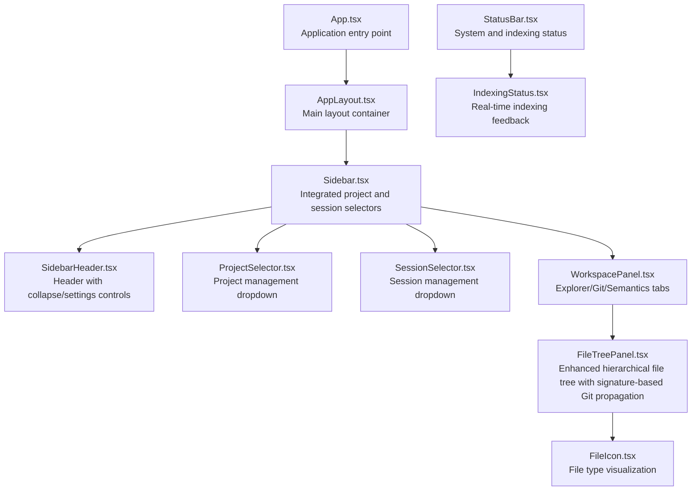
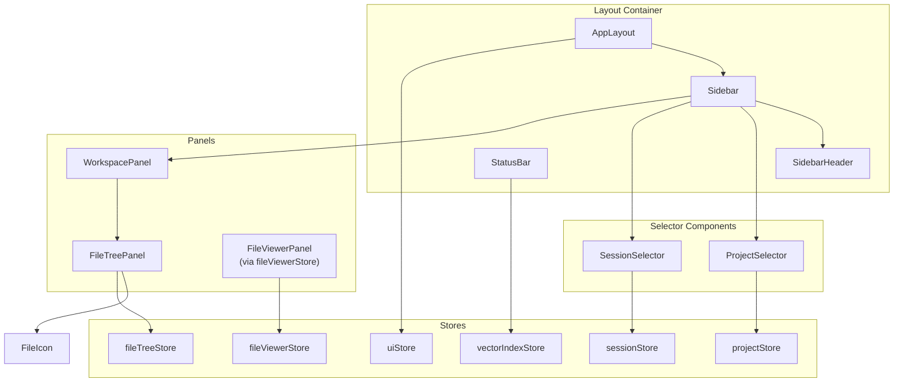
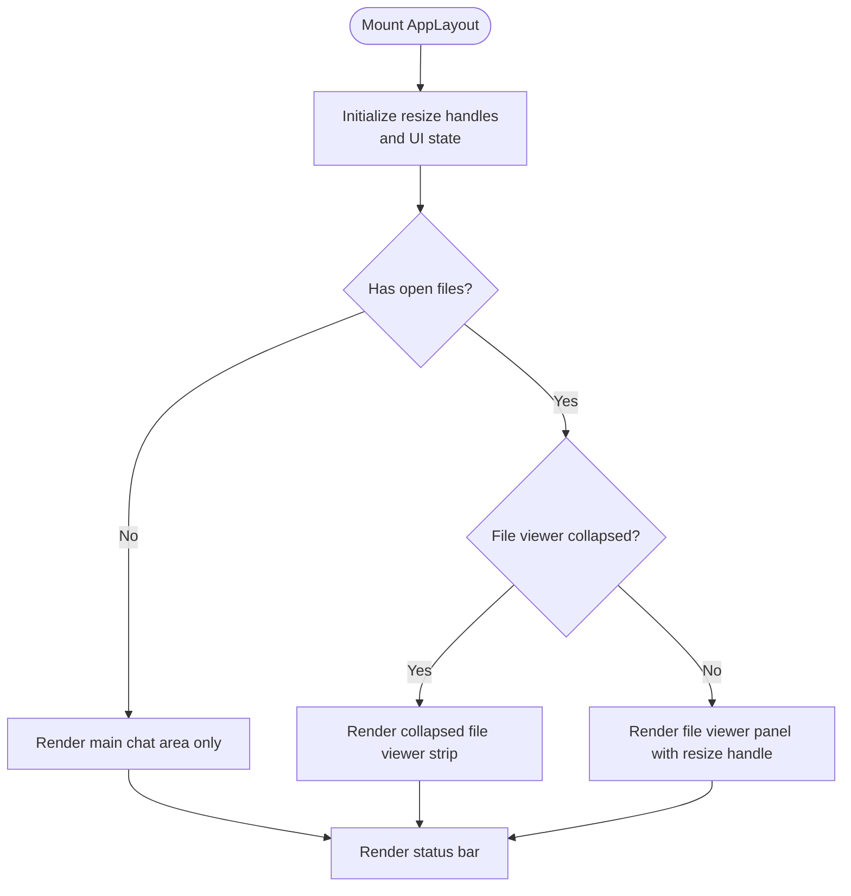
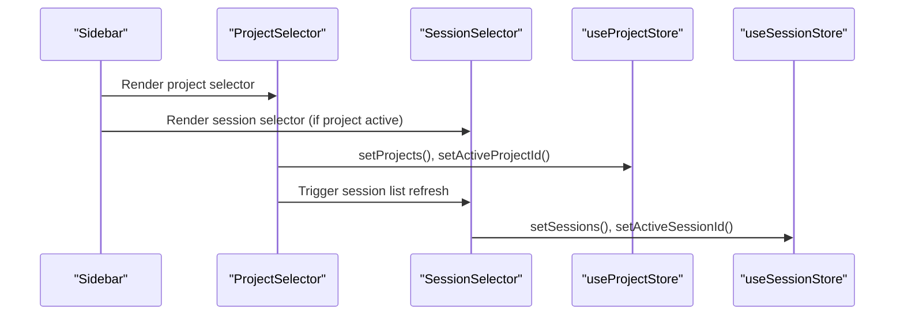
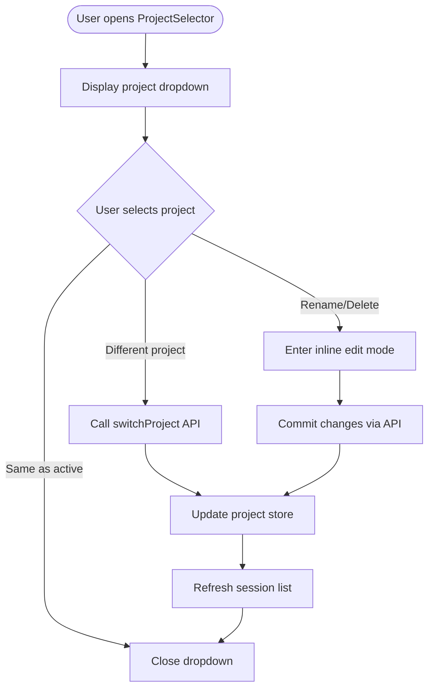
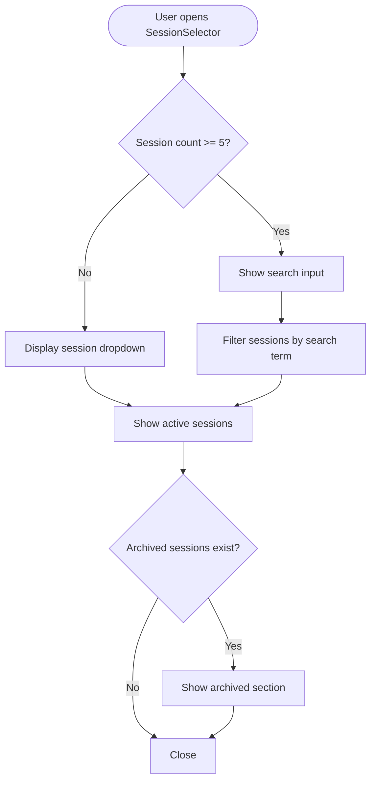
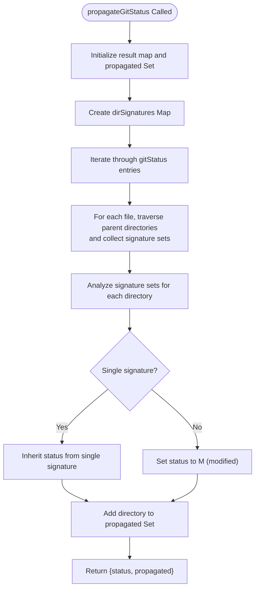
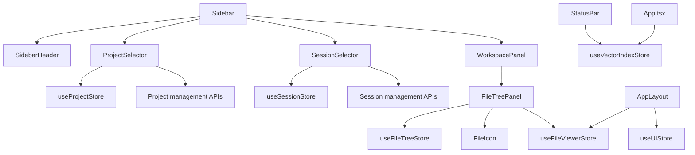

# Layout and Navigation Components

<cite>
**Referenced Files in This Document**
- [App.tsx](file://frontend/src/App.tsx)
- [AppLayout.tsx](file://frontend/src/components/layout/AppLayout.tsx)
- [Sidebar.tsx](file://frontend/src/components/layout/Sidebar.tsx)
- [SidebarHeader.tsx](file://frontend/src/components/layout/SidebarHeader.tsx)
- [ProjectSelector.tsx](file://frontend/src/components/layout/ProjectSelector.tsx)
- [SessionSelector.tsx](file://frontend/src/components/layout/SessionSelector.tsx)
- [WorkspacePanel.tsx](file://frontend/src/components/layout/WorkspacePanel.tsx)
- [FileTreePanel.tsx](file://frontend/src/components/layout/FileTreePanel.tsx)
- [StatusBar.tsx](file://frontend/src/components/layout/StatusBar.tsx)
- [IndexingStatus.tsx](file://frontend/src/components/layout/IndexingStatus.tsx)
- [FileIcon.tsx](file://frontend/src/components/layout/FileIcon.tsx)
- [useResize.tsx](file://frontend/src/hooks/useResize.tsx)
- [useFileSearch.ts](file://frontend/src/hooks/useFileSearch.ts)
- [fileTreeStore.ts](file://frontend/src/stores/fileTreeStore.ts)
- [fileViewerStore.ts](file://frontend/src/stores/fileViewerStore.ts)
- [uiStore.ts](file://frontend/src/stores/uiStore.ts)
- [projectStore.ts](file://frontend/src/stores/projectStore.ts)
- [sessionStore.ts](file://frontend/src/stores/sessionStore.ts)
- [vectorIndexStore.ts](file://frontend/src/stores/vectorIndexStore.ts)
- [models.ts](file://frontend/src/types/models.ts)
- [index.css](file://frontend/src/index.css)
</cite>

## Update Summary
**Changes Made**
- Updated FileTreePanel documentation to reflect the new signature-based Git status propagation algorithm using Map data structure
- Enhanced Git status computation section with detailed explanation of the improved algorithm
- Updated component analysis to include the new dirSignatures Map implementation
- Revised performance considerations to highlight the improved computational efficiency
- Updated troubleshooting guide to address new Git status propagation behavior

## Table of Contents
1. [Introduction](#introduction)
2. [Project Structure](#project-structure)
3. [Core Components](#core-components)
4. [Architecture Overview](#architecture-overview)
5. [Detailed Component Analysis](#detailed-component-analysis)
6. [Dependency Analysis](#dependency-analysis)
7. [Performance Considerations](#performance-considerations)
8. [Troubleshooting Guide](#troubleshooting-guide)
9. [Conclusion](#conclusion)

## Introduction
This document provides comprehensive documentation for C0WRK's layout and navigation components. It covers the AppLayout main container, responsive design patterns, Sidebar with integrated ProjectSelector and SessionSelector components, WorkspacePanel for project management and file browsing integration, FileTreePanel for hierarchical file navigation with enhanced Git-aware status indicators, StatusBar for system information and indexing status, IndexingStatus for real-time codebase indexing feedback, and FileIcon for file type visualization. It also explains layout composition patterns, responsive breakpoints, and customization options.

## Project Structure
The layout and navigation system resides in the frontend/src/components/layout directory and integrates with multiple stores for state management. The main application entry point initializes global banners and renders the AppLayout, which orchestrates the sidebar (now featuring dedicated selectors), main content area, file viewer, and status bar.

**Diagram sources**
- [App.tsx:21-87](file://frontend/src/App.tsx#L21-L87)
- [AppLayout.tsx:20-91](file://frontend/src/components/layout/AppLayout.tsx#L20-L91)
- [Sidebar.tsx:16-45](file://frontend/src/components/layout/Sidebar.tsx#L16-L45)
- [SidebarHeader.tsx:10-25](file://frontend/src/components/layout/SidebarHeader.tsx#L10-L25)
- [ProjectSelector.tsx:16-136](file://frontend/src/components/layout/ProjectSelector.tsx#L16-L136)
- [SessionSelector.tsx:15-199](file://frontend/src/components/layout/SessionSelector.tsx#L15-L199)
- [WorkspacePanel.tsx:26-70](file://frontend/src/components/layout/WorkspacePanel.tsx#L26-L70)
- [FileTreePanel.tsx:15-56](file://frontend/src/components/layout/FileTreePanel.tsx#L15-L56)
- [StatusBar.tsx:10-68](file://frontend/src/components/layout/StatusBar.tsx#L10-L68)
- [IndexingStatus.tsx:9-86](file://frontend/src/components/layout/IndexingStatus.tsx#L9-L86)

**Section sources**
- [App.tsx:21-87](file://frontend/src/App.tsx#L21-L87)
- [index.css:18-21](file://frontend/src/index.css#L18-L21)

## Core Components
- **AppLayout**: Orchestrates sidebar, main chat area, file viewer panel, and status bar with resizable panels and collapsed states.
- **Sidebar**: Now features integrated ProjectSelector and SessionSelector components for streamlined project and session management, with SidebarHeader for controls.
- **ProjectSelector**: Dedicated dropdown interface for managing multiple projects with create, rename, delete, and switch operations.
- **SessionSelector**: Comprehensive dropdown interface for managing multiple sessions with search, archive/unarchive, and delete operations.
- **WorkspacePanel**: Provides Explorer, Git, and Semantics tabs with a file tree in the Explorer tab.
- **FileTreePanel**: Enhanced hierarchical file navigation with improved filtering, Git status propagation using signature-based algorithm, and file opening capabilities.
- **StatusBar**: Displays session name, routing domain, attempt counts, context fill percentage, and indexing status.
- **IndexingStatus**: Shows real-time progress for codebase indexing with animated indicators and progress bars.
- **FileIcon**: Visualizes file types using a seti-inspired icon palette and folder icons.
- **Stores**: projectStore, sessionStore, fileTreeStore, fileViewerStore, uiStore, vectorIndexStore manage state and persistence.

**Section sources**
- [AppLayout.tsx:20-91](file://frontend/src/components/layout/AppLayout.tsx#L20-L91)
- [Sidebar.tsx:16-45](file://frontend/src/components/layout/Sidebar.tsx#L16-L45)
- [SidebarHeader.tsx:10-25](file://frontend/src/components/layout/SidebarHeader.tsx#L10-L25)
- [ProjectSelector.tsx:16-136](file://frontend/src/components/layout/ProjectSelector.tsx#L16-L136)
- [SessionSelector.tsx:15-199](file://frontend/src/components/layout/SessionSelector.tsx#L15-L199)
- [WorkspacePanel.tsx:26-70](file://frontend/src/components/layout/WorkspacePanel.tsx#L26-L70)
- [FileTreePanel.tsx:150-239](file://frontend/src/components/layout/FileTreePanel.tsx#L150-L239)
- [StatusBar.tsx:10-68](file://frontend/src/components/layout/StatusBar.tsx#L10-L68)
- [IndexingStatus.tsx:9-86](file://frontend/src/components/layout/IndexingStatus.tsx#L9-L86)
- [FileIcon.tsx:148-162](file://frontend/src/components/layout/FileIcon.tsx#L148-L162)
- [projectStore.ts:31-65](file://frontend/src/stores/projectStore.ts#L31-L65)
- [sessionStore.ts:32-76](file://frontend/src/stores/sessionStore.ts#L32-L76)
- [fileTreeStore.ts:35-102](file://frontend/src/stores/fileTreeStore.ts#L35-L102)
- [fileViewerStore.ts:108-278](file://frontend/src/stores/fileViewerStore.ts#L108-L278)
- [uiStore.ts:35-52](file://frontend/src/stores/uiStore.ts#L35-L52)
- [vectorIndexStore.ts:30-55](file://frontend/src/stores/vectorIndexStore.ts#L30-L55)

## Architecture Overview
The layout follows a responsive, resizable panel architecture with persistent UI state. The sidebar now integrates dedicated selector components for seamless project and session management. The file tree supports recursive loading and filtering with enhanced Git status integration using a signature-based propagation algorithm. The status bar aggregates session and indexing information.

**Diagram sources**
- [AppLayout.tsx:20-91](file://frontend/src/components/layout/AppLayout.tsx#L20-L91)
- [Sidebar.tsx:16-45](file://frontend/src/components/layout/Sidebar.tsx#L16-L45)
- [SidebarHeader.tsx:10-25](file://frontend/src/components/layout/SidebarHeader.tsx#L10-L25)
- [ProjectSelector.tsx:16-136](file://frontend/src/components/layout/ProjectSelector.tsx#L16-L136)
- [SessionSelector.tsx:15-199](file://frontend/src/components/layout/SessionSelector.tsx#L15-L199)
- [WorkspacePanel.tsx:26-70](file://frontend/src/components/layout/WorkspacePanel.tsx#L26-L70)
- [FileTreePanel.tsx:150-239](file://frontend/src/components/layout/FileTreePanel.tsx#L150-L239)
- [projectStore.ts:31-65](file://frontend/src/stores/projectStore.ts#L31-L65)
- [sessionStore.ts:32-76](file://frontend/src/stores/sessionStore.ts#L32-L76)
- [fileTreeStore.ts:35-102](file://frontend/src/stores/fileTreeStore.ts#L35-L102)
- [fileViewerStore.ts:108-278](file://frontend/src/stores/fileViewerStore.ts#L108-L278)
- [uiStore.ts:35-52](file://frontend/src/stores/uiStore.ts#L35-L52)
- [vectorIndexStore.ts:30-55](file://frontend/src/stores/vectorIndexStore.ts#L30-L55)

## Detailed Component Analysis

### AppLayout: Main Container and Responsive Panels
AppLayout composes the sidebar, main chat area, optional file viewer panel, and status bar. It manages:
- Resizable sidebar and file viewer panels using a shared resize hook pattern.
- Collapsed states for both panels with persistent UI state.
- Empty state handling when no projects are present.
- Synchronized persistence of file viewer width and collapsed state.

Responsive behavior:
- Uses fixed min/max widths for panels and a default width for initial sizing.
- Supports collapsing the sidebar to a narrow icon strip and expanding it back.
- File viewer panel can be collapsed to a thin strip and expanded.

Customization options:
- Adjust default/min/max widths for sidebar and file viewer.
- Modify collapsed widths for compact sidebar and file viewer.
- Toggle visibility of the file viewer based on open files.

**Diagram sources**
- [AppLayout.tsx:20-91](file://frontend/src/components/layout/AppLayout.tsx#L20-L91)
- [useResize.tsx:7-88](file://frontend/src/hooks/useResize.tsx#L7-L88)
- [uiStore.ts:35-52](file://frontend/src/stores/uiStore.ts#L35-L52)
- [fileViewerStore.ts:108-211](file://frontend/src/stores/fileViewerStore.ts#L108-L211)

**Section sources**
- [AppLayout.tsx:18-28](file://frontend/src/components/layout/AppLayout.tsx#L18-L28)
- [AppLayout.tsx:20-91](file://frontend/src/components/layout/AppLayout.tsx#L20-L91)
- [useResize.tsx:7-88](file://frontend/src/hooks/useResize.tsx#L7-L88)
- [uiStore.ts:35-52](file://frontend/src/stores/uiStore.ts#L35-L52)
- [fileViewerStore.ts:108-211](file://frontend/src/stores/fileViewerStore.ts#L108-L211)

### Sidebar: Integrated Project and Session Management
The Sidebar component now features a streamlined design with integrated selector components:
- **SidebarHeader**: Provides collapse/settings controls with accessible labels.
- **ProjectSelector**: Dedicated dropdown for project management with create, rename, delete, and switch operations.
- **SessionSelector**: Comprehensive dropdown for session management with search, archive/unarchive, and delete operations.
- **WorkspacePanel**: Integrated file browsing with Explorer, Git, and Semantics tabs.

Key integration patterns:
- **Conditional rendering**: SessionSelector and WorkspacePanel only render when an active project exists.
- **State synchronization**: ProjectSelector automatically updates session lists when projects change.
- **Accessibility**: Proper ARIA labels and keyboard navigation support throughout.

**Diagram sources**
- [Sidebar.tsx:16-45](file://frontend/src/components/layout/Sidebar.tsx#L16-L45)
- [ProjectSelector.tsx:30-43](file://frontend/src/components/layout/ProjectSelector.tsx#L30-L43)
- [SessionSelector.tsx:35-41](file://frontend/src/components/layout/SessionSelector.tsx#L35-L41)

**Section sources**
- [Sidebar.tsx:16-45](file://frontend/src/components/layout/Sidebar.tsx#L16-L45)
- [SidebarHeader.tsx:10-25](file://frontend/src/components/layout/SidebarHeader.tsx#L10-L25)
- [ProjectSelector.tsx:16-136](file://frontend/src/components/layout/ProjectSelector.tsx#L16-L136)
- [SessionSelector.tsx:15-199](file://frontend/src/components/layout/SessionSelector.tsx#L15-L199)

### ProjectSelector: Comprehensive Project Management
The ProjectSelector component provides a dedicated interface for project management:
- **Project switching**: Dropdown with checkmark indicators for active project.
- **Inline editing**: Seamless rename operations with keyboard shortcuts.
- **Project lifecycle**: Create, rename, delete operations with proper error handling.
- **Integration**: Automatically refreshes session lists when projects change.

Key features:
- **State management**: Uses zustand store for project state with sorting by activity.
- **API integration**: Direct calls to project management APIs with proper error handling.
- **User experience**: Keyboard navigation, focus management, and immediate visual feedback.

**Diagram sources**
- [ProjectSelector.tsx:30-72](file://frontend/src/components/layout/ProjectSelector.tsx#L30-L72)
- [ProjectSelector.tsx:103-123](file://frontend/src/components/layout/ProjectSelector.tsx#L103-L123)

**Section sources**
- [ProjectSelector.tsx:16-136](file://frontend/src/components/layout/ProjectSelector.tsx#L16-L136)
- [projectStore.ts:31-65](file://frontend/src/stores/projectStore.ts#L31-L65)

### SessionSelector: Advanced Session Management
The SessionSelector component provides comprehensive session management:
- **Search functionality**: Dynamic search input for filtering sessions (shows when 5+ sessions exist).
- **Archived sessions**: Separate section for archived sessions with toggle functionality.
- **Inline editing**: Seamless rename operations with keyboard shortcuts.
- **Session lifecycle**: Create, rename, archive/unarchive, delete operations.

Advanced features:
- **Filtering system**: Case-insensitive search with debounced updates.
- **Visual indicators**: Active session dot, archived status, and relative timestamps.
- **State management**: Uses zustand store with sorting by activity and touch operations.
- **API integration**: Direct calls to session management APIs with proper error handling.

**Diagram sources**
- [SessionSelector.tsx:29-44](file://frontend/src/components/layout/SessionSelector.tsx#L29-L44)
- [SessionSelector.tsx:130-158](file://frontend/src/components/layout/SessionSelector.tsx#L130-L158)

**Section sources**
- [SessionSelector.tsx:15-199](file://frontend/src/components/layout/SessionSelector.tsx#L15-L199)
- [sessionStore.ts:32-76](file://frontend/src/stores/sessionStore.ts#L32-L76)

### WorkspacePanel: Project Management and File Browsing Integration
WorkspacePanel organizes three tabs:
- **Explorer**: Displays the FileTreePanel for hierarchical file navigation.
- **Git**: Placeholder for Git-related views.
- **Semantics**: Placeholder for semantic search views.

It uses a tooltip-enabled tab list with dynamic labels and provides a consistent header area for tab controls.

**Section sources**
- [WorkspacePanel.tsx:12-16](file://frontend/src/components/layout/WorkspacePanel.tsx#L12-L16)
- [WorkspacePanel.tsx:26-70](file://frontend/src/components/layout/WorkspacePanel.tsx#L26-L70)

### FileTreePanel: Enhanced Hierarchical File Navigation
FileTreePanel implements an enhanced version with:
- **Improved tree rendering**: Optimized TreeNode component with better performance.
- **Enhanced Git status propagation**: New signature-based algorithm using Map data structure for improved accuracy in directory status inheritance.
- **Interactive filtering**: Integrated filter input with mode switching between glob and regex.
- **Better accessibility**: Proper ARIA attributes and keyboard navigation support.
- **Loading states**: Improved loading indicators for directory expansion.
- **Event-driven refresh**: Enhanced workspace tree change detection.

**Updated** Enhanced Git status propagation algorithm with signature-based approach using Map data structure for improved accuracy in directory status inheritance.

Enhanced filtering algorithm:
- **Integrated filter input**: Built-in search box with mode switching.
- **Debounced updates**: Efficient filtering with proper debouncing.
- **Mode switching**: Toggle between glob and regex filtering modes.

Git status computation improvements:
- **Signature-based propagation**: Enhanced algorithm using Map data structure to track directory signatures for improved accuracy.
- **Enhanced algorithm structure**: The `propagateGitStatus` function now uses a two-phase approach:
  - **Phase 1**: Build directory signatures using `dirSignatures` Map where keys are directory paths and values are Sets of signature strings
  - **Phase 2**: Apply status propagation based on signature analysis
- **Visual indicators**: Better color coding for different Git status types with improved status inheritance.
- **Performance optimization**: More efficient status computation and caching using Map data structure.

The new algorithm works as follows:
1. **Signature Collection Phase**: For each file path, traverse up to parent directories and collect unique status signatures in the format `"status:staged"` (e.g., `"M:true"`, `"A:false"`)
2. **Signature Analysis Phase**: For each directory, analyze collected signatures:
   - If exactly one unique signature exists, inherit that status to the directory
   - If multiple different signatures exist, fall back to modified status (`M`)
3. **Result Generation**: Return both the propagated status map and the set of propagated paths

**Diagram sources**
- [FileTreePanel.tsx:15-56](file://frontend/src/components/layout/FileTreePanel.tsx#L15-L56)

**Section sources**
- [FileTreePanel.tsx:150-239](file://frontend/src/components/layout/FileTreePanel.tsx#L150-L239)
- [fileTreeStore.ts:35-102](file://frontend/src/stores/fileTreeStore.ts#L35-L102)

### StatusBar: System Information and Indexing Status
StatusBar displays:
- Active session name with thinking indicator.
- Routing domain badge.
- Attempt count and maximum attempts.
- Context fill percentage via ContextBadge.
- IndexingStatus component for vector index progress.

**Section sources**
- [StatusBar.tsx:10-68](file://frontend/src/components/layout/StatusBar.tsx#L10-L68)

### IndexingStatus: Real-Time Codebase Indexing Feedback
IndexingStatus shows:
- Current status: idle, indexing, reindexing, ready.
- Files indexed vs total files with percentage.
- Progress bar with animated pulse for indexing and spin for reindexing.
- Current file being processed and branch information when available.

**Section sources**
- [IndexingStatus.tsx:9-86](file://frontend/src/components/layout/IndexingStatus.tsx#L9-L86)
- [vectorIndexStore.ts:30-55](file://frontend/src/stores/vectorIndexStore.ts#L30-L55)

### FileIcon: File Type Visualization
FileIcon provides:
- Seti-inspired icon glyphs mapped to file extensions and exact filenames.
- Color-coded icons using a predefined palette.
- Special handling for folders (closed/open states).
- Default icon for unknown files.

**Section sources**
- [FileIcon.tsx:148-162](file://frontend/src/components/layout/FileIcon.tsx#L148-L162)

## Dependency Analysis
The layout components depend on multiple stores for state management and persistence. The new selector components integrate tightly with their respective stores and APIs. The sidebar listens to backend events for early data loading and project/session updates.

**Diagram sources**
- [Sidebar.tsx:16-45](file://frontend/src/components/layout/Sidebar.tsx#L16-L45)
- [SidebarHeader.tsx:10-25](file://frontend/src/components/layout/SidebarHeader.tsx#L10-L25)
- [ProjectSelector.tsx:17-21](file://frontend/src/components/layout/ProjectSelector.tsx#L17-L21)
- [SessionSelector.tsx:16-21](file://frontend/src/components/layout/SessionSelector.tsx#L16-L21)
- [WorkspacePanel.tsx:10](file://frontend/src/components/layout/WorkspacePanel.tsx#L10)
- [FileTreePanel.tsx:4-6](file://frontend/src/components/layout/FileTreePanel.tsx#L4-L6)
- [AppLayout.tsx:8-16](file://frontend/src/components/layout/AppLayout.tsx#L8-L16)
- [StatusBar.tsx:1-8](file://frontend/src/components/layout/StatusBar.tsx#L1-L8)
- [App.tsx:8, 41-55](file://frontend/src/App.tsx#L8,L41-L55)

**Section sources**
- [Sidebar.tsx:16-45](file://frontend/src/components/layout/Sidebar.tsx#L16-L45)
- [SidebarHeader.tsx:10-25](file://frontend/src/components/layout/SidebarHeader.tsx#L10-L25)
- [ProjectSelector.tsx:17-21](file://frontend/src/components/layout/ProjectSelector.tsx#L17-L21)
- [SessionSelector.tsx:16-21](file://frontend/src/components/layout/SessionSelector.tsx#L16-L21)
- [WorkspacePanel.tsx:10](file://frontend/src/components/layout/WorkspacePanel.tsx#L10)
- [FileTreePanel.tsx:4-6](file://frontend/src/components/layout/FileTreePanel.tsx#L4-L6)
- [AppLayout.tsx:8-16](file://frontend/src/components/layout/AppLayout.tsx#L8-L16)
- [StatusBar.tsx:1-8](file://frontend/src/components/layout/StatusBar.tsx#L1-L8)
- [App.tsx:8, 41-55](file://frontend/src/App.tsx#L8,L41-L55)

## Performance Considerations
- **Enhanced filtering**: FileTreePanel debounces filter input to reduce re-computation overhead.
- **Optimized Git status propagation**: New signature-based algorithm using Map data structure significantly improves computational efficiency for status calculations.
- **Selective rendering**: ProjectSelector and SessionSelector use conditional rendering to minimize DOM updates.
- **Efficient state updates**: Both selector components use zustand's selective state updates to prevent unnecessary re-renders.
- **Recursive loading**: Uses recursive directory listing only when filtering is active and clears it when inactive to save memory.
- **Lazy expansion**: Toggles directory loading state and watches/unwatches directories to minimize backend calls.
- **Persistent state**: UI and file viewer states persist to localStorage to avoid re-initialization on reload.
- **Memoized computations**: SessionSelector uses useMemo for filtered lists to avoid recomputation on each render.
- **Map-based signature tracking**: The new algorithm uses Map data structure for O(1) signature lookups and Set for unique signature tracking, improving overall performance.

**Updated** The new signature-based Git status propagation algorithm provides improved accuracy and performance through the use of Map data structure for signature tracking and Set for unique signature analysis.

## Troubleshooting Guide
Common issues and resolutions:
- **Projects not loading on startup**: Verify backend-ready events and early data emission; ensure projectStore is updated accordingly.
- **File tree not refreshing**: Confirm workspace:tree_changed event handling and recursive tree refresh logic.
- **Git status missing**: Ensure fetchGitStatus is called after directory initialization and refresh.
- **File viewer panel not resizing**: Check useResizeHandle implementation and persisted panel width synchronization.
- **Sidebar collapse state not persisting**: Validate localStorage key and uiStore persistence logic.
- **ProjectSelector not updating sessions**: Verify that handleSwitch calls listSessions and updates session store.
- **SessionSelector search not working**: Check that showSearch condition triggers and filterFn properly filters session names.
- **Selector dropdowns not closing**: Ensure proper event handling for dropdown open/close states and search input clearing.
- **Git status propagation incorrect**: Verify that the signature-based algorithm is properly analyzing directory signatures and applying status inheritance rules.

**Updated** Added troubleshooting guidance for the new Git status propagation algorithm, including verification of signature analysis and status inheritance behavior.

**Section sources**
- [Sidebar.tsx:124-178](file://frontend/src/components/layout/Sidebar.tsx#L124-L178)
- [FileTreePanel.tsx:15-56](file://frontend/src/components/layout/FileTreePanel.tsx#L15-L56)
- [ProjectSelector.tsx:35-42](file://frontend/src/components/layout/ProjectSelector.tsx#L35-L42)
- [SessionSelector.tsx:105-106](file://frontend/src/components/layout/SessionSelector.tsx#L105-L106)
- [fileTreeStore.ts:83](file://frontend/src/stores/fileTreeStore.ts#L83)
- [useResize.tsx:7-88](file://frontend/src/hooks/useResize.tsx#L7-L88)
- [uiStore.ts:35-52](file://frontend/src/stores/uiStore.ts#L35-L52)

## Conclusion
The layout and navigation system combines a responsive, resizable panel architecture with robust state management and enhanced Git-aware file browsing. AppLayout coordinates the sidebar, main content, and file viewer, while the newly integrated ProjectSelector and SessionSelector components provide streamlined workspace switching and file exploration. FileTreePanel delivers efficient hierarchical navigation with enhanced filtering and Git status integration using the new signature-based propagation algorithm with Map data structure for improved accuracy. StatusBar and IndexingStatus communicate system and indexing states, and FileIcon enhances visual clarity. The stores encapsulate persistence and backend integration, enabling a smooth and customizable user experience with improved project and session management workflows.

**Updated** The enhanced FileTreePanel now features a sophisticated signature-based Git status propagation algorithm that uses Map data structures for improved accuracy in directory status inheritance, providing more reliable and precise Git status indicators across the file tree hierarchy.