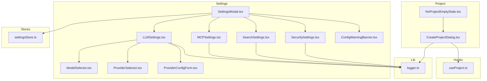
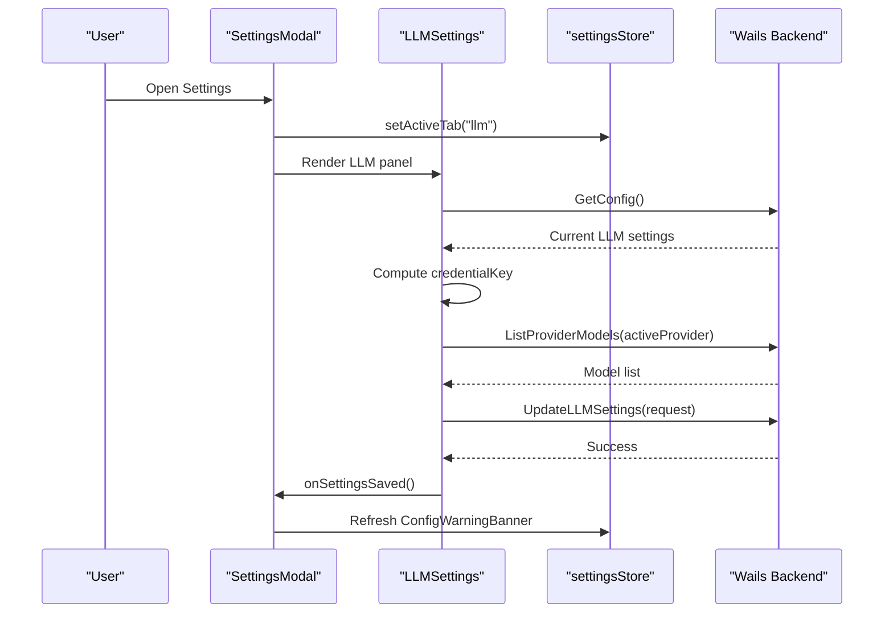
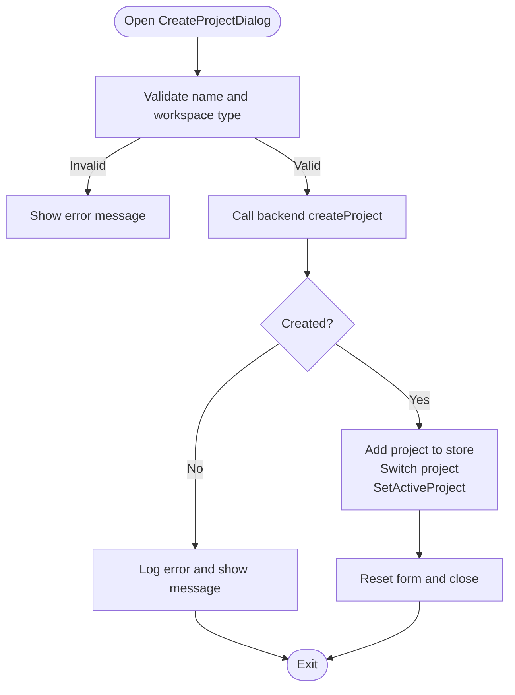
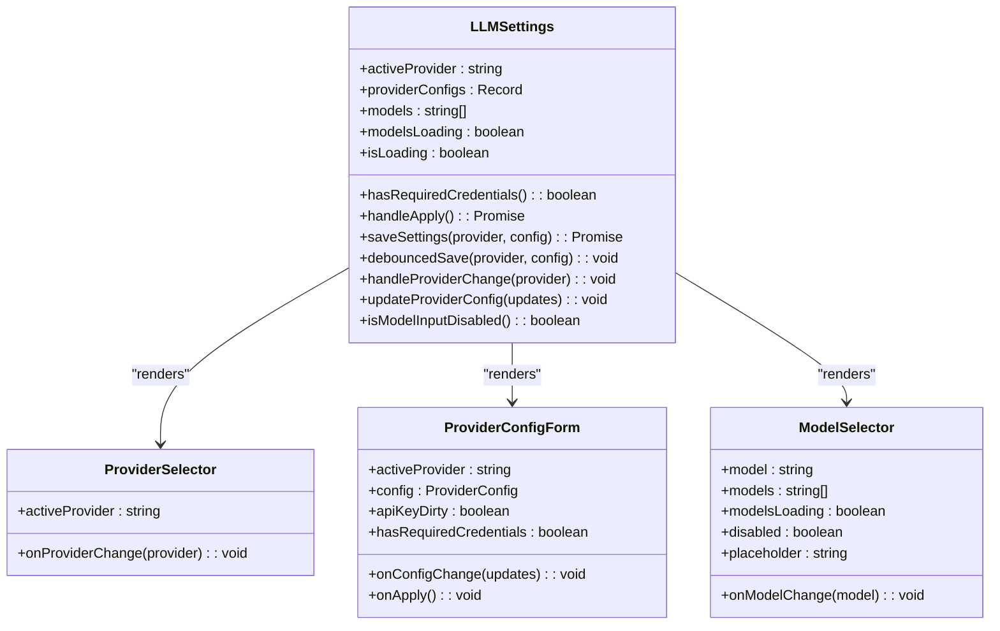
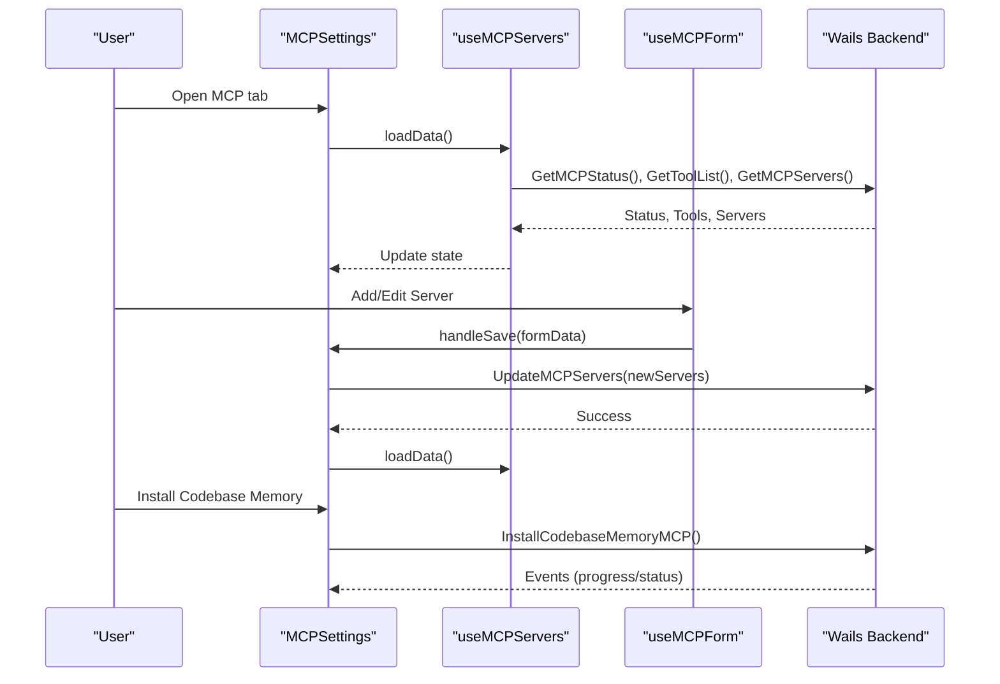
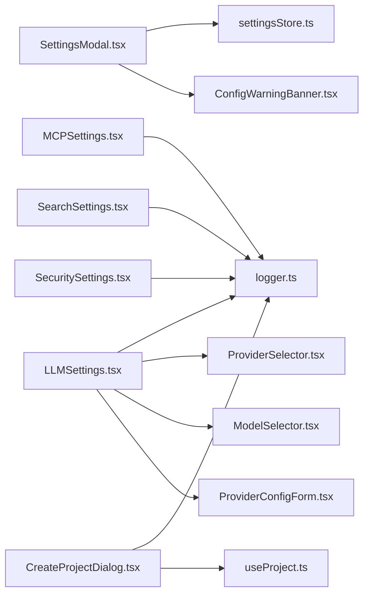

# Project and Settings Components

<cite>
**Referenced Files in This Document**
- [CreateProjectDialog.tsx](file://frontend/src/components/project/CreateProjectDialog.tsx)
- [NoProjectEmptyState.tsx](file://frontend/src/components/project/NoProjectEmptyState.tsx)
- [SettingsModal.tsx](file://frontend/src/components/settings/SettingsModal.tsx)
- [LLMSettings.tsx](file://frontend/src/components/settings/LLMSettings.tsx)
- [MCPSettings.tsx](file://frontend/src/components/settings/MCPSettings.tsx)
- [SearchSettings.tsx](file://frontend/src/components/settings/SearchSettings.tsx)
- [SecuritySettings.tsx](file://frontend/src/components/settings/SecuritySettings.tsx)
- [ModelSelector.tsx](file://frontend/src/components/settings/ModelSelector.tsx)
- [ProviderSelector.tsx](file://frontend/src/components/settings/ProviderSelector.tsx)
- [ProviderConfigForm.tsx](file://frontend/src/components/settings/ProviderConfigForm.tsx)
- [ConfigWarningBanner.tsx](file://frontend/src/components/settings/ConfigWarningBanner.tsx)
- [settingsStore.ts](file://frontend/src/stores/settingsStore.ts)
- [useProject.ts](file://frontend/src/hooks/useProject.ts)
- [logger.ts](file://frontend/src/lib/logger.ts)
</cite>

## Table of Contents
1. [Introduction](#introduction)
2. [Project Structure](#project-structure)
3. [Core Components](#core-components)
4. [Architecture Overview](#architecture-overview)
5. [Detailed Component Analysis](#detailed-component-analysis)
6. [Dependency Analysis](#dependency-analysis)
7. [Performance Considerations](#performance-considerations)
8. [Troubleshooting Guide](#troubleshooting-guide)
9. [Conclusion](#conclusion)

## Introduction
This document explains the project management and settings components in C0WRK’s frontend. It covers:
- Project creation and initialization via CreateProjectDialog
- Guidance for new users through NoProjectEmptyState
- The SettingsModal hub for configuration across categories
- Specialized settings components for LLM, MCP, Search, and Security
- Selector components for model and provider selection
- Configuration forms, validation patterns, and warning banners
- Form state management and integration with the backend configuration system

## Project Structure
The relevant components live under frontend/src/components/project and frontend/src/components/settings. They integrate with:
- Wails-generated APIs for backend operations
- Zustand stores for UI state
- Local logging utilities

**Diagram sources**
- [CreateProjectDialog.tsx:1-165](file://frontend/src/components/project/CreateProjectDialog.tsx#L1-L165)
- [NoProjectEmptyState.tsx:1-27](file://frontend/src/components/project/NoProjectEmptyState.tsx#L1-L27)
- [SettingsModal.tsx:1-156](file://frontend/src/components/settings/SettingsModal.tsx#L1-L156)
- [LLMSettings.tsx:1-264](file://frontend/src/components/settings/LLMSettings.tsx#L1-L264)
- [MCPSettings.tsx:1-1000](file://frontend/src/components/settings/MCPSettings.tsx#L1-L1000)
- [SearchSettings.tsx:1-192](file://frontend/src/components/settings/SearchSettings.tsx#L1-L192)
- [SecuritySettings.tsx:1-328](file://frontend/src/components/settings/SecuritySettings.tsx#L1-L328)
- [ModelSelector.tsx:1-62](file://frontend/src/components/settings/ModelSelector.tsx#L1-L62)
- [ProviderSelector.tsx:1-36](file://frontend/src/components/settings/ProviderSelector.tsx#L1-L36)
- [ProviderConfigForm.tsx:1-87](file://frontend/src/components/settings/ProviderConfigForm.tsx#L1-L87)
- [ConfigWarningBanner.tsx:1-75](file://frontend/src/components/settings/ConfigWarningBanner.tsx#L1-L75)
- [settingsStore.ts:1-20](file://frontend/src/stores/settingsStore.ts#L1-L20)
- [useProject.ts:1-16](file://frontend/src/hooks/useProject.ts#L1-L16)
- [logger.ts:1-19](file://frontend/src/lib/logger.ts#L1-L19)

**Section sources**
- [CreateProjectDialog.tsx:1-165](file://frontend/src/components/project/CreateProjectDialog.tsx#L1-L165)
- [NoProjectEmptyState.tsx:1-27](file://frontend/src/components/project/NoProjectEmptyState.tsx#L1-L27)
- [SettingsModal.tsx:1-156](file://frontend/src/components/settings/SettingsModal.tsx#L1-L156)
- [settingsStore.ts:1-20](file://frontend/src/stores/settingsStore.ts#L1-L20)
- [useProject.ts:1-16](file://frontend/src/hooks/useProject.ts#L1-L16)
- [logger.ts:1-19](file://frontend/src/lib/logger.ts#L1-L19)

## Core Components
- CreateProjectDialog: Initializes a new project with internal or external workspace selection, validates inputs, and integrates with backend APIs.
- NoProjectEmptyState: Guides users to create their first project.
- SettingsModal: Central configuration hub with tabs for General, LLM, Search, MCP, Security, and About.
- LLMSettings: Manages provider selection, credentials, model listing, and saving settings.
- MCPSettings: Manages MCP server configurations, tool discovery, and installation of optional components.
- SearchSettings: Configures web search provider and API key with masking and validation.
- SecuritySettings: Controls tool policies and per-tool blacklists.
- Selector and Form Components: ModelSelector, ProviderSelector, ProviderConfigForm.
- ConfigWarningBanner: Displays configuration migration and validation warnings.

**Section sources**
- [CreateProjectDialog.tsx:24-74](file://frontend/src/components/project/CreateProjectDialog.tsx#L24-L74)
- [NoProjectEmptyState.tsx:6-26](file://frontend/src/components/project/NoProjectEmptyState.tsx#L6-L26)
- [SettingsModal.tsx:18-154](file://frontend/src/components/settings/SettingsModal.tsx#L18-L154)
- [LLMSettings.tsx:24-156](file://frontend/src/components/settings/LLMSettings.tsx#L24-L156)
- [MCPSettings.tsx:389-551](file://frontend/src/components/settings/MCPSettings.tsx#L389-L551)
- [SearchSettings.tsx:25-136](file://frontend/src/components/settings/SearchSettings.tsx#L25-L136)
- [SecuritySettings.tsx:61-231](file://frontend/src/components/settings/SecuritySettings.tsx#L61-L231)
- [ModelSelector.tsx:14-61](file://frontend/src/components/settings/ModelSelector.tsx#L14-L61)
- [ProviderSelector.tsx:16-35](file://frontend/src/components/settings/ProviderSelector.tsx#L16-L35)
- [ProviderConfigForm.tsx:22-86](file://frontend/src/components/settings/ProviderConfigForm.tsx#L22-L86)
- [ConfigWarningBanner.tsx:10-74](file://frontend/src/components/settings/ConfigWarningBanner.tsx#L10-L74)

## Architecture Overview
The settings modal orchestrates multiple specialized panels. Each panel encapsulates its own state, validation, and persistence via Wails backend calls. LLMSettings coordinates provider selection and model fetching. MCPSettings manages server configurations and optional component installations. SearchSettings and SecuritySettings manage external integrations and policy enforcement respectively.

**Diagram sources**
- [SettingsModal.tsx:18-36](file://frontend/src/components/settings/SettingsModal.tsx#L18-L36)
- [LLMSettings.tsx:43-133](file://frontend/src/components/settings/LLMSettings.tsx#L43-L133)
- [settingsStore.ts:13-19](file://frontend/src/stores/settingsStore.ts#L13-L19)

## Detailed Component Analysis

### CreateProjectDialog
Purpose:
- Initialize a new project with either an internal or external workspace.
- Validate inputs and surface errors.
- Persist to backend and update local state.

Key behaviors:
- Workspace type toggle between internal and external.
- External path selection via directory picker.
- Submit disabled until validations pass.
- On success, adds project to store, switches to it, and resets form.

**Diagram sources**
- [CreateProjectDialog.tsx:35-74](file://frontend/src/components/project/CreateProjectDialog.tsx#L35-L74)
- [useProject.ts:4-14](file://frontend/src/hooks/useProject.ts#L4-L14)

**Section sources**
- [CreateProjectDialog.tsx:24-74](file://frontend/src/components/project/CreateProjectDialog.tsx#L24-L74)
- [useProject.ts:1-16](file://frontend/src/hooks/useProject.ts#L1-L16)

### NoProjectEmptyState
Purpose:
- Provide a friendly onboarding experience when no project exists.
- Trigger CreateProjectDialog upon user action.

**Section sources**
- [NoProjectEmptyState.tsx:6-26](file://frontend/src/components/project/NoProjectEmptyState.tsx#L6-L26)

### SettingsModal
Purpose:
- Central configuration hub with tabbed navigation.
- Integrates a warning banner that refreshes when the dialog opens or settings are saved.

Behavior highlights:
- Maintains open state and active tab in a Zustand store.
- Renders six tabs: General, LLM, Search, MCP, Security, About.
- Refreshes ConfigWarningBanner on open and on save callbacks.

**Section sources**
- [SettingsModal.tsx:18-154](file://frontend/src/components/settings/SettingsModal.tsx#L18-L154)
- [settingsStore.ts:13-19](file://frontend/src/stores/settingsStore.ts#L13-L19)

### LLMSettings
Purpose:
- Configure LLM provider, credentials, and model selection.
- Fetch available models per provider and persist settings.

Implementation patterns:
- Loads initial config from backend on mount.
- Computes a credentialKey to reset model lists and detect dirty API keys.
- Debounced saves to avoid excessive network calls.
- Provider-specific validation for required fields (API key/base URL).
- Model selection falls back to a text input when models are unavailable.

**Diagram sources**
- [LLMSettings.tsx:24-263](file://frontend/src/components/settings/LLMSettings.tsx#L24-L263)
- [ProviderSelector.tsx:16-35](file://frontend/src/components/settings/ProviderSelector.tsx#L16-L35)
- [ProviderConfigForm.tsx:22-86](file://frontend/src/components/settings/ProviderConfigForm.tsx#L22-L86)
- [ModelSelector.tsx:14-61](file://frontend/src/components/settings/ModelSelector.tsx#L14-L61)

Validation and state management:
- Credential validation ensures required fields are present before enabling Apply and model selection.
- Debounce prevents rapid successive saves.
- Masked API key handling avoids accidental clearing during edits.

**Section sources**
- [LLMSettings.tsx:24-156](file://frontend/src/components/settings/LLMSettings.tsx#L24-L156)
- [ProviderSelector.tsx:16-35](file://frontend/src/components/settings/ProviderSelector.tsx#L16-L35)
- [ProviderConfigForm.tsx:22-86](file://frontend/src/components/settings/ProviderConfigForm.tsx#L22-L86)
- [ModelSelector.tsx:14-61](file://frontend/src/components/settings/ModelSelector.tsx#L14-L61)

### MCPSettings
Purpose:
- Manage MCP server connections and discover tools.
- Install optional components (Codebase Memory, RTK) with progress events.

Key patterns:
- Two custom hooks: useMCPServers for server and tool data, and useMCPForm for form state.
- Validation for server name uniqueness and format.
- Transport-specific configuration (stdio vs http).
- Event listeners for installation progress and status updates.
- Collapsible server rows with connected status and tool listings.

**Diagram sources**
- [MCPSettings.tsx:115-267](file://frontend/src/components/settings/MCPSettings.tsx#L115-L267)
- [MCPSettings.tsx:294-385](file://frontend/src/components/settings/MCPSettings.tsx#L294-L385)
- [MCPSettings.tsx:407-501](file://frontend/src/components/settings/MCPSettings.tsx#L407-L501)
- [MCPSettings.tsx:525-543](file://frontend/src/components/settings/MCPSettings.tsx#L525-L543)

Validation and UX:
- Server name must be unique and free of spaces/dots.
- Transport type determines visible fields.
- Progress and error states for installations.

**Section sources**
- [MCPSettings.tsx:115-267](file://frontend/src/components/settings/MCPSettings.tsx#L115-L267)
- [MCPSettings.tsx:294-385](file://frontend/src/components/settings/MCPSettings.tsx#L294-L385)
- [MCPSettings.tsx:407-501](file://frontend/src/components/settings/MCPSettings.tsx#L407-L501)
- [MCPSettings.tsx:525-543](file://frontend/src/components/settings/MCPSettings.tsx#L525-L543)

### SearchSettings
Purpose:
- Configure web search provider and API key.
- Provide masked input for sensitive data and validation feedback.

Patterns:
- Debounced save to reduce backend calls.
- Provider-specific API key requirements.
- Warning banner when API key is missing for providers that require it.

**Section sources**
- [SearchSettings.tsx:25-136](file://frontend/src/components/settings/SearchSettings.tsx#L25-L136)
- [SearchSettings.tsx:159-164](file://frontend/src/components/settings/SearchSettings.tsx#L159-L164)

### SecuritySettings
Purpose:
- Define default tool policy and per-tool policies.
- Support blacklisting for specific tools (e.g., bash_exec).

Patterns:
- Groups tools by source (core vs MCP).
- Policy options: Always Allow, Always Deny, User Confirm.
- Regex-based blacklist patterns for supported tools.
- Debounced persistence of security settings.

**Section sources**
- [SecuritySettings.tsx:61-231](file://frontend/src/components/settings/SecuritySettings.tsx#L61-L231)
- [SecuritySettings.tsx:232-327](file://frontend/src/components/settings/SecuritySettings.tsx#L232-L327)

### Selector Components
- ProviderSelector: Dropdown to choose LLM provider.
- ModelSelector: Select or type model name depending on availability and loading state.

**Section sources**
- [ProviderSelector.tsx:16-35](file://frontend/src/components/settings/ProviderSelector.tsx#L16-L35)
- [ModelSelector.tsx:14-61](file://frontend/src/components/settings/ModelSelector.tsx#L14-L61)

### Configuration Forms and Warning Banners
- ProviderConfigForm: Renders provider-specific fields (API key and/or base URL) with Apply button when applicable.
- ConfigWarningBanner: Displays configuration migration status and validation errors; refreshes on demand.

**Section sources**
- [ProviderConfigForm.tsx:22-86](file://frontend/src/components/settings/ProviderConfigForm.tsx#L22-L86)
- [ConfigWarningBanner.tsx:10-74](file://frontend/src/components/settings/ConfigWarningBanner.tsx#L10-L74)

## Dependency Analysis
- UI state:
  - SettingsModal depends on settingsStore for open/activeTab state.
- Backend integration:
  - All settings panels use Wails-generated APIs for persistence and retrieval.
  - MCPSettings additionally listens to runtime events for installation progress.
- Logging:
  - Components log errors via logger utility.

**Diagram sources**
- [SettingsModal.tsx:18-154](file://frontend/src/components/settings/SettingsModal.tsx#L18-L154)
- [settingsStore.ts:13-19](file://frontend/src/stores/settingsStore.ts#L13-L19)
- [LLMSettings.tsx:24-263](file://frontend/src/components/settings/LLMSettings.tsx#L24-L263)
- [MCPSettings.tsx:389-1000](file://frontend/src/components/settings/MCPSettings.tsx#L389-L1000)
- [SearchSettings.tsx:25-136](file://frontend/src/components/settings/SearchSettings.tsx#L25-L136)
- [SecuritySettings.tsx:61-327](file://frontend/src/components/settings/SecuritySettings.tsx#L61-L327)
- [CreateProjectDialog.tsx:24-74](file://frontend/src/components/project/CreateProjectDialog.tsx#L24-L74)
- [useProject.ts:1-16](file://frontend/src/hooks/useProject.ts#L1-L16)
- [logger.ts:1-19](file://frontend/src/lib/logger.ts#L1-L19)

**Section sources**
- [SettingsModal.tsx:18-154](file://frontend/src/components/settings/SettingsModal.tsx#L18-L154)
- [settingsStore.ts:13-19](file://frontend/src/stores/settingsStore.ts#L13-L19)
- [LLMSettings.tsx:24-263](file://frontend/src/components/settings/LLMSettings.tsx#L24-L263)
- [MCPSettings.tsx:389-1000](file://frontend/src/components/settings/MCPSettings.tsx#L389-L1000)
- [SearchSettings.tsx:25-136](file://frontend/src/components/settings/SearchSettings.tsx#L25-L136)
- [SecuritySettings.tsx:61-327](file://frontend/src/components/settings/SecuritySettings.tsx#L61-L327)
- [CreateProjectDialog.tsx:24-74](file://frontend/src/components/project/CreateProjectDialog.tsx#L24-L74)
- [useProject.ts:1-16](file://frontend/src/hooks/useProject.ts#L1-L16)
- [logger.ts:1-19](file://frontend/src/lib/logger.ts#L1-L19)

## Performance Considerations
- Debouncing:
  - LLMSettings and SearchSettings debounce saves to reduce network traffic.
- Loading states:
  - Models loading indicators prevent user confusion while fetching model lists.
- Event-driven updates:
  - MCPSettings uses event listeners to update installation progress without polling.
- Minimal re-renders:
  - Memoization and stable keys (e.g., credentialKey) help avoid unnecessary computations.

## Troubleshooting Guide
Common issues and resolutions:
- LLM provider credentials:
  - Ensure required fields are filled based on provider type. Apply button appears when conditions are met.
  - If model list fails to load, check backend connectivity and credentials.
- MCP server configuration:
  - Verify server name uniqueness and transport-specific fields.
  - Use event logs to diagnose connection issues; retry or adjust configuration.
- Search provider API key:
  - For providers requiring keys, configure and save; masked input indicates existing configuration.
- Security settings:
  - Use “User Confirm” for cautious operation; “Always Allow” bypasses confirmations.
- General configuration warnings:
  - Review ConfigWarningBanner messages for migration or validation errors.

**Section sources**
- [LLMSettings.tsx:84-114](file://frontend/src/components/settings/LLMSettings.tsx#L84-L114)
- [MCPSettings.tsx:182-194](file://frontend/src/components/settings/MCPSettings.tsx#L182-L194)
- [SearchSettings.tsx:159-164](file://frontend/src/components/settings/SearchSettings.tsx#L159-L164)
- [SecuritySettings.tsx:318-324](file://frontend/src/components/settings/SecuritySettings.tsx#L318-L324)
- [ConfigWarningBanner.tsx:35-70](file://frontend/src/components/settings/ConfigWarningBanner.tsx#L35-L70)

## Conclusion
The project and settings components provide a cohesive, user-friendly configuration experience. They enforce validation, manage state efficiently, and integrate tightly with the backend via Wails. LLMSettings, MCPSettings, SearchSettings, and SecuritySettings encapsulate domain-specific logic while maintaining consistent UX patterns. The SettingsModal centralizes access to all configuration areas, ensuring a streamlined developer and user experience.