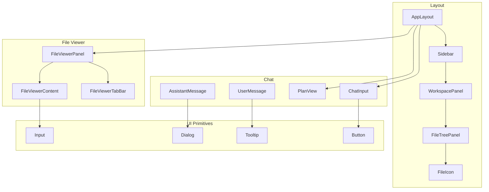
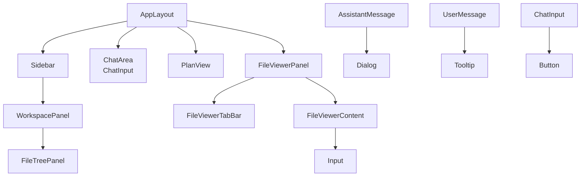
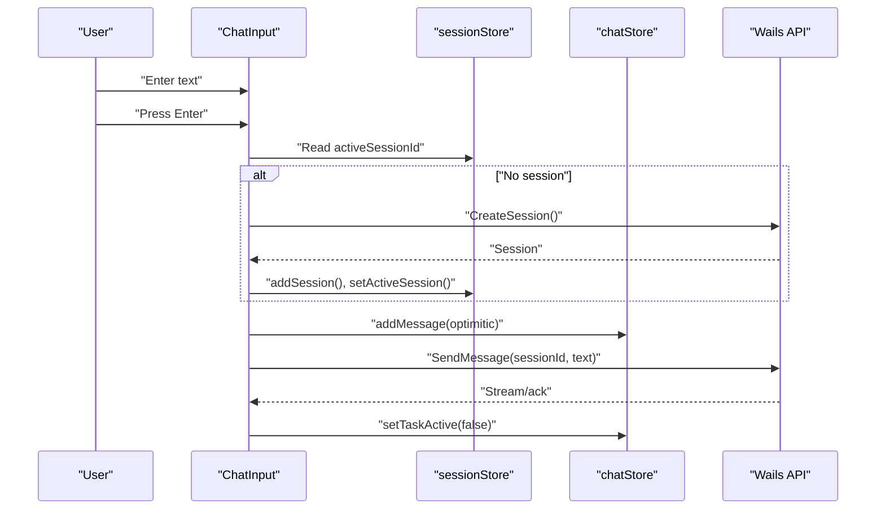
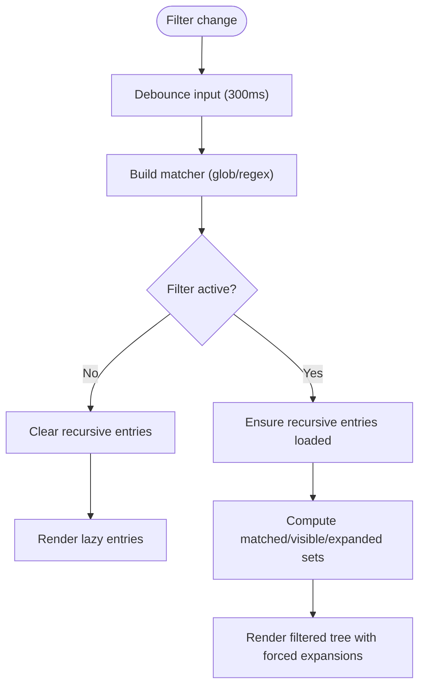
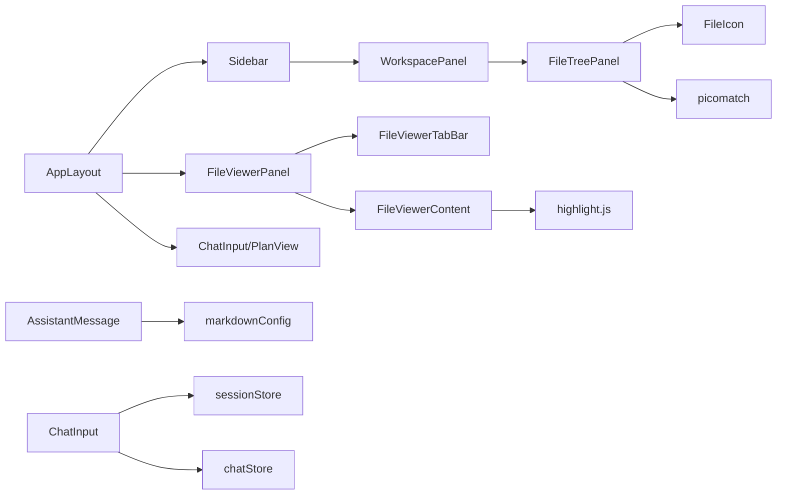

# UI Components

<cite>
**Referenced Files in This Document**
- [AppLayout.tsx](file://frontend/src/components/layout/AppLayout.tsx)
- [Sidebar.tsx](file://frontend/src/components/layout/Sidebar.tsx)
- [WorkspacePanel.tsx](file://frontend/src/components/layout/WorkspacePanel.tsx)
- [FileTreePanel.tsx](file://frontend/src/components/layout/FileTreePanel.tsx)
- [FileIcon.tsx](file://frontend/src/components/layout/FileIcon.tsx)
- [AssistantMessage.tsx](file://frontend/src/components/chat/AssistantMessage.tsx)
- [UserMessage.tsx](file://frontend/src/components/chat/UserMessage.tsx)
- [ChatInput.tsx](file://frontend/src/components/chat/ChatInput.tsx)
- [PlanView.tsx](file://frontend/src/components/chat/PlanView.tsx)
- [FileViewerPanel.tsx](file://frontend/src/components/fileViewer/FileViewerPanel.tsx)
- [FileViewerContent.tsx](file://frontend/src/components/fileViewer/FileViewerContent.tsx)
- [FileViewerTabBar.tsx](file://frontend/src/components/fileViewer/FileViewerTabBar.tsx)
- [button.tsx](file://frontend/src/components/ui/button.tsx)
- [dialog.tsx](file://frontend/src/components/ui/dialog.tsx)
- [tooltip.tsx](file://frontend/src/components/ui/tooltip.tsx)
- [input.tsx](file://frontend/src/components/ui/input.tsx)
- [markdownConfig.tsx](file://frontend/src/lib/markdownConfig.tsx)
- [chatStore.ts](file://frontend/src/stores/chatStore.ts)
- [sessionStore.ts](file://frontend/src/stores/sessionStore.ts)
</cite>

## Table of Contents
1. [Introduction](#introduction)
2. [Project Structure](#project-structure)
3. [Core Components](#core-components)
4. [Architecture Overview](#architecture-overview)
5. [Detailed Component Analysis](#detailed-component-analysis)
6. [Dependency Analysis](#dependency-analysis)
7. [Performance Considerations](#performance-considerations)
8. [Troubleshooting Guide](#troubleshooting-guide)
9. [Conclusion](#conclusion)

## Introduction
This document describes C0WRK’s React component library and UI system. It focuses on:
- Chat interface components: AssistantMessage, UserMessage, ChatInput, PlanView
- Layout components: AppLayout, Sidebar, WorkspacePanel, FileTreePanel
- UI primitives from shadcn/ui: Button, Dialog, Tooltip, Input
- File viewer system: FileViewerPanel, FileViewerContent, FileViewerTabBar
It explains component responsibilities, props, customization, styling patterns, accessibility, and composition patterns for building complex UI interactions.

## Project Structure
C0WRK organizes UI under frontend/src/components, grouped by domain:
- layout: AppLayout, Sidebar, WorkspacePanel, FileTreePanel, FileIcon
- chat: AssistantMessage, UserMessage, ChatInput, PlanView, and related helpers
- fileViewer: FileViewerPanel, FileViewerContent, FileViewerTabBar
- ui: shadcn/ui wrappers and variants for Button, Dialog, Tooltip, Input
- stores: chatStore, sessionStore, fileViewerStore, panelStore, etc.
- lib: markdownConfig, diffParser, formatters, utils

**Diagram sources**
- [AppLayout.tsx:1-135](file://frontend/src/components/layout/AppLayout.tsx#L1-L135)
- [Sidebar.tsx:1-627](file://frontend/src/components/layout/Sidebar.tsx#L1-L627)
- [WorkspacePanel.tsx:1-71](file://frontend/src/components/layout/WorkspacePanel.tsx#L1-L71)
- [FileTreePanel.tsx:1-483](file://frontend/src/components/layout/FileTreePanel.tsx#L1-L483)
- [FileIcon.tsx](file://frontend/src/components/layout/FileIcon.tsx)
- [AssistantMessage.tsx:1-91](file://frontend/src/components/chat/AssistantMessage.tsx#L1-L91)
- [UserMessage.tsx:1-104](file://frontend/src/components/chat/UserMessage.tsx#L1-L104)
- [ChatInput.tsx:1-193](file://frontend/src/components/chat/ChatInput.tsx#L1-L193)
- [PlanView.tsx:1-153](file://frontend/src/components/chat/PlanView.tsx#L1-L153)
- [FileViewerPanel.tsx:1-27](file://frontend/src/components/fileViewer/FileViewerPanel.tsx#L1-L27)
- [FileViewerContent.tsx:1-345](file://frontend/src/components/fileViewer/FileViewerContent.tsx#L1-L345)
- [FileViewerTabBar.tsx:1-151](file://frontend/src/components/fileViewer/FileViewerTabBar.tsx#L1-L151)
- [button.tsx:1-32](file://frontend/src/components/ui/button.tsx#L1-L32)
- [dialog.tsx:1-159](file://frontend/src/components/ui/dialog.tsx#L1-L159)
- [tooltip.tsx:1-56](file://frontend/src/components/ui/tooltip.tsx#L1-L56)
- [input.tsx:1-22](file://frontend/src/components/ui/input.tsx#L1-L22)

**Section sources**
- [AppLayout.tsx:1-135](file://frontend/src/components/layout/AppLayout.tsx#L1-L135)
- [Sidebar.tsx:1-627](file://frontend/src/components/layout/Sidebar.tsx#L1-L627)
- [WorkspacePanel.tsx:1-71](file://frontend/src/components/layout/WorkspacePanel.tsx#L1-L71)
- [FileTreePanel.tsx:1-483](file://frontend/src/components/layout/FileTreePanel.tsx#L1-L483)
- [FileViewerPanel.tsx:1-27](file://frontend/src/components/fileViewer/FileViewerPanel.tsx#L1-L27)
- [FileViewerContent.tsx:1-345](file://frontend/src/components/fileViewer/FileViewerContent.tsx#L1-L345)
- [FileViewerTabBar.tsx:1-151](file://frontend/src/components/fileViewer/FileViewerTabBar.tsx#L1-L151)
- [button.tsx:1-32](file://frontend/src/components/ui/button.tsx#L1-L32)
- [dialog.tsx:1-159](file://frontend/src/components/ui/dialog.tsx#L1-L159)
- [tooltip.tsx:1-56](file://frontend/src/components/ui/tooltip.tsx#L1-L56)
- [input.tsx:1-22](file://frontend/src/components/ui/input.tsx#L1-L22)

## Core Components
- AssistantMessage: Renders assistant content with optional raw Markdown view and streaming cursor.
- UserMessage: Renders user content with optional pinning, overflow handling, and time display.
- ChatInput: Text input with auto-resize, optimistic UI updates, session lifecycle, and cancellation.
- PlanView: Renders a plan as a list of steps with status badges, durations, and tooltips.
- AppLayout: Orchestrates sidebar, main chat area, pending actions, execution panels, file viewer, and status bar.
- Sidebar: Project/session management, settings, and workspace panel.
- WorkspacePanel: Tabs for Explorer, Git, Semantics; currently routes to FileTreePanel.
- FileTreePanel: Hierarchical file tree with filtering (glob/regex), lazy loading, and Git status coloring.
- FileViewerPanel/Content/TabBar: Multi-tab file viewer with syntax highlighting, Markdown rendering, diffs, and scroll preservation.
- UI primitives: Button, Dialog, Tooltip, Input wrappers around shadcn/ui and Radix primitives.

**Section sources**
- [AssistantMessage.tsx:20-91](file://frontend/src/components/chat/AssistantMessage.tsx#L20-L91)
- [UserMessage.tsx:3-104](file://frontend/src/components/chat/UserMessage.tsx#L3-L104)
- [ChatInput.tsx:13-193](file://frontend/src/components/chat/ChatInput.tsx#L13-L193)
- [PlanView.tsx:16-153](file://frontend/src/components/chat/PlanView.tsx#L16-L153)
- [AppLayout.tsx:30-135](file://frontend/src/components/layout/AppLayout.tsx#L30-L135)
- [Sidebar.tsx:64-627](file://frontend/src/components/layout/Sidebar.tsx#L64-L627)
- [WorkspacePanel.tsx:26-71](file://frontend/src/components/layout/WorkspacePanel.tsx#L26-L71)
- [FileTreePanel.tsx:270-483](file://frontend/src/components/layout/FileTreePanel.tsx#L270-L483)
- [FileViewerPanel.tsx:9-27](file://frontend/src/components/fileViewer/FileViewerPanel.tsx#L9-L27)
- [FileViewerContent.tsx:18-345](file://frontend/src/components/fileViewer/FileViewerContent.tsx#L18-L345)
- [FileViewerTabBar.tsx:18-151](file://frontend/src/components/fileViewer/FileViewerTabBar.tsx#L18-L151)
- [button.tsx:8-32](file://frontend/src/components/ui/button.tsx#L8-L32)
- [dialog.tsx:10-159](file://frontend/src/components/ui/dialog.tsx#L10-L159)
- [tooltip.tsx:19-56](file://frontend/src/components/ui/tooltip.tsx#L19-L56)
- [input.tsx:5-22](file://frontend/src/components/ui/input.tsx#L5-L22)

## Architecture Overview
The UI is composed of:
- Layout container (AppLayout) coordinating sidebar, chat, and file viewer panels
- Domain-specific panels (Sidebar, WorkspacePanel, FileTreePanel)
- Chat subsystem (AssistantMessage, UserMessage, ChatInput, PlanView)
- File viewer subsystem (FileViewerPanel, FileViewerContent, FileViewerTabBar)
- UI primitives (Button, Dialog, Tooltip, Input) wrapping shadcn/ui and Radix

**Diagram sources**
- [AppLayout.tsx:30-135](file://frontend/src/components/layout/AppLayout.tsx#L30-L135)
- [Sidebar.tsx:64-627](file://frontend/src/components/layout/Sidebar.tsx#L64-L627)
- [WorkspacePanel.tsx:26-71](file://frontend/src/components/layout/WorkspacePanel.tsx#L26-L71)
- [FileTreePanel.tsx:270-483](file://frontend/src/components/layout/FileTreePanel.tsx#L270-L483)
- [FileViewerPanel.tsx:9-27](file://frontend/src/components/fileViewer/FileViewerPanel.tsx#L9-L27)
- [FileViewerContent.tsx:18-345](file://frontend/src/components/fileViewer/FileViewerContent.tsx#L18-L345)
- [FileViewerTabBar.tsx:18-151](file://frontend/src/components/fileViewer/FileViewerTabBar.tsx#L18-L151)
- [AssistantMessage.tsx:25-91](file://frontend/src/components/chat/AssistantMessage.tsx#L25-L91)
- [UserMessage.tsx:10-104](file://frontend/src/components/chat/UserMessage.tsx#L10-L104)
- [ChatInput.tsx:13-193](file://frontend/src/components/chat/ChatInput.tsx#L13-L193)
- [PlanView.tsx:117-153](file://frontend/src/components/chat/PlanView.tsx#L117-L153)
- [button.tsx:8-32](file://frontend/src/components/ui/button.tsx#L8-L32)
- [dialog.tsx:10-159](file://frontend/src/components/ui/dialog.tsx#L10-L159)
- [tooltip.tsx:19-56](file://frontend/src/components/ui/tooltip.tsx#L19-L56)
- [input.tsx:5-22](file://frontend/src/components/ui/input.tsx#L5-L22)

## Detailed Component Analysis

### Chat Components

#### AssistantMessage
- Purpose: Render assistant messages with Markdown support, optional raw source view, and streaming indicator.
- Props:
  - content: string
  - isStreaming?: boolean
- Behavior:
  - Uses remark/rehype plugins for GFM, emoji, breaks, slug, autolink headings, sanitization, external links.
  - Provides a toggle to switch between rendered Markdown and raw highlighted Markdown.
  - Streaming cursor rendered when isStreaming is true.
- Accessibility:
  - Hover-triggered button with title and aria-label for toggling raw view.
- Styling:
  - Conditional opacity and hover effects for the raw-view toggle.
  - Prose styling for rendered Markdown with dark mode invert.
- Complexity:
  - Memoized highlight calculation for raw mode.
- Customization:
  - Uses customSchema and markdownComponents from markdownConfig.

**Section sources**
- [AssistantMessage.tsx:20-91](file://frontend/src/components/chat/AssistantMessage.tsx#L20-L91)
- [markdownConfig.tsx](file://frontend/src/lib/markdownConfig.tsx)

#### UserMessage
- Purpose: Render user messages with optional pinning, overflow handling, and time display.
- Props:
  - content: string
  - timestamp: number
  - isPinned?: boolean
  - maxHeight?: number
- Behavior:
  - Measures natural height via ResizeObserver when pinned.
  - Collapsible behavior when overflowing; gradient overlay indicates truncation.
  - Focus management to collapse on blur.
- Accessibility:
  - Role="button" and aria-expanded when overflowed.
  - Tab index set for keyboard navigation.
- Styling:
  - Rounded corner styling for message bubble.
  - Gradient fade overlay when clipped.
- Customization:
  - Uses local state for expanded/collapsed and natural height measurement.

**Section sources**
- [UserMessage.tsx:3-104](file://frontend/src/components/chat/UserMessage.tsx#L3-L104)

#### ChatInput
- Purpose: Text input for sending messages with auto-resize, optimistic UI, session lifecycle, and cancellation.
- Props: none
- Behavior:
  - Auto-resizes textarea up to a capped height.
  - Optimistically adds user message to UI before backend confirmation.
  - Creates a session if none exists; integrates with Wails API.
  - Disables input when no project or task is active.
  - Supports cancellation via CancelTask.
  - Keyboard shortcut: Enter sends, Shift+Enter inserts newline.
- Stores and APIs:
  - Reads active session/project from stores; writes optimistic state.
  - Uses sessionStore, chatStore, and Wails API.
- Accessibility:
  - Properly disabled states and aria-labels on action buttons.
- Styling:
  - Custom scrollbar utility class applied to textarea.
- Customization:
  - Placeholder text adapts based on state (no project, processing, etc.).

**Diagram sources**
- [ChatInput.tsx:13-193](file://frontend/src/components/chat/ChatInput.tsx#L13-L193)
- [sessionStore.ts](file://frontend/src/stores/sessionStore.ts)
- [chatStore.ts](file://frontend/src/stores/chatStore.ts)

**Section sources**
- [ChatInput.tsx:13-193](file://frontend/src/components/chat/ChatInput.tsx#L13-L193)
- [sessionStore.ts](file://frontend/src/stores/sessionStore.ts)
- [chatStore.ts](file://frontend/src/stores/chatStore.ts)

#### PlanView
- Purpose: Visualize plan steps with status, optional details, and duration.
- Props: none (reads from panelStore)
- Behavior:
  - Maps plan groups to view steps, deriving labels and status.
  - Renders each step as a card with status icon/badge, optional details toggle, and duration display.
  - Uses StepTooltip for step descriptions.
- Stores:
  - Reads latest plan group from panelStore.
- Accessibility:
  - Interactive buttons with hover/active states; disabled buttons when no details.
- Styling:
  - Status-specific badges and icons; spacing and typography tuned for readability.

**Section sources**
- [PlanView.tsx:16-153](file://frontend/src/components/chat/PlanView.tsx#L16-L153)

### Layout Components

#### AppLayout
- Purpose: Top-level layout orchestrating sidebar, chat, execution panels, file viewer, and status bar.
- Features:
  - Resizable sidebar and file viewer panels with persisted widths.
  - Collapsible sidebar and file viewer with expand triggers.
  - Empty state when no projects are present.
  - Integrates ChatInput, PlanView, and FileViewerPanel.
- Stores:
  - Uses UI store for sidebar collapse state and file viewer store for widths and collapse state.
- Accessibility:
  - Buttons with titles and aria-labels for collapsing/expanding panels.

**Section sources**
- [AppLayout.tsx:30-135](file://frontend/src/components/layout/AppLayout.tsx#L30-L135)

#### Sidebar
- Purpose: Project and session management, settings, and workspace panel.
- Features:
  - Project list with rename/delete actions.
  - Session list with rename/archive/delete; search/filter.
  - Settings modal and create project dialog.
  - WorkspacePanel integration.
- Events:
  - Subscribes to backend events for projects/sessions and switches project automatically when ready.
- Accessibility:
  - Dropdown menus with keyboard navigation; proper aria labels on triggers.

**Section sources**
- [Sidebar.tsx:64-627](file://frontend/src/components/layout/Sidebar.tsx#L64-L627)

#### WorkspacePanel
- Purpose: Tabbed workspace area with Explorer, Git, Semantics.
- Behavior:
  - Uses Tabs/TabsList/TabsTrigger with TooltipProvider.
  - Currently renders FileTreePanel in Explorer tab.
- Accessibility:
  - Tooltip labels for tab triggers; aria-labels on triggers.

**Section sources**
- [WorkspacePanel.tsx:26-71](file://frontend/src/components/layout/WorkspacePanel.tsx#L26-L71)

#### FileTreePanel
- Purpose: Hierarchical file tree with filtering, lazy loading, and Git status indicators.
- Features:
  - Filter modes: glob and regex; debounced filtering.
  - Recursive filtering with forced expansion of matched ancestors.
  - Lazy loading of directory entries; loading spinners for directories.
  - Git status coloring per file/dir; directory inherits highest-priority color.
  - Double-click to open files; click to toggle directories.
- Stores:
  - Uses fileTreeStore for entries, expanded dirs, loading states, and Git status.
- Accessibility:
  - Tree semantics with aria-expanded on directories; keyboard-friendly interactions.

**Diagram sources**
- [FileTreePanel.tsx:11-483](file://frontend/src/components/layout/FileTreePanel.tsx#L11-L483)

**Section sources**
- [FileTreePanel.tsx:270-483](file://frontend/src/components/layout/FileTreePanel.tsx#L270-L483)

### File Viewer Components

#### FileViewerPanel
- Purpose: Container for file viewer tabs and content with resizable width.
- Props:
  - width: number
- Behavior:
  - Renders FileViewerTabBar and FileViewerContent.
  - Hidden when no files are open or panel is collapsed.

**Section sources**
- [FileViewerPanel.tsx:9-27](file://frontend/src/components/fileViewer/FileViewerPanel.tsx#L9-L27)

#### FileViewerTabBar
- Purpose: Multi-tab UI for open files with close actions, dropdown menu, and collapse control.
- Behavior:
  - Scrolls active tab into view; shows tooltip with full path.
  - Dropdown lists all open files; marks active file.
  - Collapse button toggles file viewer collapse.

**Section sources**
- [FileViewerTabBar.tsx:18-151](file://frontend/src/components/fileViewer/FileViewerTabBar.tsx#L18-L151)

#### FileViewerContent
- Purpose: Displays file content with syntax highlighting, Markdown rendering, diffs, and scroll preservation.
- Behavior:
  - Handles loading/error/binary states.
  - Markdown preview vs raw source toggle.
  - Parses unified diffs and renders inline char diffs for modified lines.
  - Preserves scroll position across content updates.
- Stores:
  - Reads from fileViewerStore for active file and open files.
- Accessibility:
  - Error fallback and sanitized Markdown rendering.

**Section sources**
- [FileViewerContent.tsx:18-345](file://frontend/src/components/fileViewer/FileViewerContent.tsx#L18-L345)

### UI Primitive Components (shadcn/ui)

#### Button
- Purpose: Unified button primitive with variants and sizes.
- Props:
  - variant, size, asChild, className, and native button props.
- Variants:
  - Uses button-variants for consistent styling across the app.

**Section sources**
- [button.tsx:8-32](file://frontend/src/components/ui/button.tsx#L8-L32)

#### Dialog
- Purpose: Modal dialog with overlay, portal, and optional close button.
- Slots:
  - Root, Trigger, Portal, Overlay, Content, Header/Footer, Title, Description, Close.
- Behavior:
  - Overlay animation and focus management; optional close button.

**Section sources**
- [dialog.tsx:10-159](file://frontend/src/components/ui/dialog.tsx#L10-L159)

#### Tooltip
- Purpose: Tooltip provider, trigger, and content with portal and arrow.
- Props:
  - delayDuration, sideOffset, and native TooltipPrimitive props.
- Behavior:
  - Animated positioning with arrow; supports bottom/left/right/top placement.

**Section sources**
- [tooltip.tsx:19-56](file://frontend/src/components/ui/tooltip.tsx#L19-L56)

#### Input
- Purpose: Styled input field with validation state support.
- Props:
  - type, className, and native input props.
- Accessibility:
  - aria-invalid classes for invalid states.

**Section sources**
- [input.tsx:5-22](file://frontend/src/components/ui/input.tsx#L5-L22)

## Dependency Analysis
- Component coupling:
  - AppLayout depends on Sidebar, FileViewerPanel, and chat components.
  - Sidebar depends on project/session stores and uses WorkspacePanel.
  - FileTreePanel depends on fileTreeStore and emits workspace events.
  - FileViewer components depend on fileViewerStore.
  - Chat components depend on chatStore and sessionStore.
- External libraries:
  - Markdown rendering via remark/rehype ecosystem.
  - Syntax highlighting via highlight.js.
  - Pattern matching via picomatch.
  - Icons via lucide-react.
  - State via stores (Zustand-like stores).
- Potential circular dependencies:
  - None apparent among these components; stores are leaf dependencies.

**Diagram sources**
- [AppLayout.tsx:30-135](file://frontend/src/components/layout/AppLayout.tsx#L30-L135)
- [Sidebar.tsx:64-627](file://frontend/src/components/layout/Sidebar.tsx#L64-L627)
- [WorkspacePanel.tsx:26-71](file://frontend/src/components/layout/WorkspacePanel.tsx#L26-L71)
- [FileTreePanel.tsx:270-483](file://frontend/src/components/layout/FileTreePanel.tsx#L270-L483)
- [FileViewerPanel.tsx:9-27](file://frontend/src/components/fileViewer/FileViewerPanel.tsx#L9-L27)
- [FileViewerContent.tsx:18-345](file://frontend/src/components/fileViewer/FileViewerContent.tsx#L18-L345)
- [AssistantMessage.tsx:25-91](file://frontend/src/components/chat/AssistantMessage.tsx#L25-L91)
- [ChatInput.tsx:13-193](file://frontend/src/components/chat/ChatInput.tsx#L13-L193)
- [markdownConfig.tsx](file://frontend/src/lib/markdownConfig.tsx)
- [sessionStore.ts](file://frontend/src/stores/sessionStore.ts)
- [chatStore.ts](file://frontend/src/stores/chatStore.ts)

**Section sources**
- [AppLayout.tsx:30-135](file://frontend/src/components/layout/AppLayout.tsx#L30-L135)
- [Sidebar.tsx:64-627](file://frontend/src/components/layout/Sidebar.tsx#L64-L627)
- [WorkspacePanel.tsx:26-71](file://frontend/src/components/layout/WorkspacePanel.tsx#L26-L71)
- [FileTreePanel.tsx:270-483](file://frontend/src/components/layout/FileTreePanel.tsx#L270-L483)
- [FileViewerPanel.tsx:9-27](file://frontend/src/components/fileViewer/FileViewerPanel.tsx#L9-L27)
- [FileViewerContent.tsx:18-345](file://frontend/src/components/fileViewer/FileViewerContent.tsx#L18-L345)
- [AssistantMessage.tsx:25-91](file://frontend/src/components/chat/AssistantMessage.tsx#L25-L91)
- [ChatInput.tsx:13-193](file://frontend/src/components/chat/ChatInput.tsx#L13-L193)
- [markdownConfig.tsx](file://frontend/src/lib/markdownConfig.tsx)
- [sessionStore.ts](file://frontend/src/stores/sessionStore.ts)
- [chatStore.ts](file://frontend/src/stores/chatStore.ts)

## Performance Considerations
- Memoization:
  - AssistantMessage memoizes highlighted Markdown for raw mode.
  - FileViewerContent memoizes highlighted HTML and display lines.
  - FileTreePanel computes visibility and matched paths with memoization.
- Debouncing:
  - FileTreePanel debounces filter input to reduce re-computation.
- Lazy loading:
  - FileTreePanel lazily loads directory entries and conditionally loads recursive entries only when filtering is active.
- Rendering:
  - FileTreePanel avoids rendering hidden nodes when filters are active.
  - FileViewerContent preserves scroll position to avoid jank during updates.
- Accessibility:
  - Components use proper roles and aria attributes to minimize assistive tech overhead.

[No sources needed since this section provides general guidance]

## Troubleshooting Guide
- ChatInput does not enable:
  - Ensure a project is selected; input is disabled until a project exists.
  - Verify sessionStore has an activeSessionId or that creation succeeds.
- AssistantMessage fails to render:
  - Check markdownConfig customSchema and markdownComponents.
  - Confirm remark/rehype plugin chain is intact.
- FileTreePanel shows “No matches found”:
  - Switch filter mode (glob/regex) or adjust pattern.
  - Ensure recursive entries are loaded when filter is active.
- FileViewerContent shows unsupported format:
  - Binary files are intentionally not supported; open a text-based file.
- Tooltip or Dialog not appearing:
  - Ensure TooltipProvider wraps interactive components.
  - For Dialog, confirm Portal and Overlay are rendered.

**Section sources**
- [ChatInput.tsx:13-193](file://frontend/src/components/chat/ChatInput.tsx#L13-L193)
- [AssistantMessage.tsx:25-91](file://frontend/src/components/chat/AssistantMessage.tsx#L25-L91)
- [FileTreePanel.tsx:270-483](file://frontend/src/components/layout/FileTreePanel.tsx#L270-L483)
- [FileViewerContent.tsx:18-345](file://frontend/src/components/fileViewer/FileViewerContent.tsx#L18-L345)
- [tooltip.tsx:19-56](file://frontend/src/components/ui/tooltip.tsx#L19-L56)
- [dialog.tsx:10-159](file://frontend/src/components/ui/dialog.tsx#L10-L159)

## Conclusion
C0WRK’s UI system combines a robust layout with specialized chat and file viewer components, backed by shadcn/ui primitives. The chat components emphasize Markdown rendering, streaming UX, and plan visualization. The file tree and viewer provide efficient filtering, syntax highlighting, and diff visualization. The layout is highly configurable with resizable and collapsible panels. Together, these components enable a flexible, accessible, and performant developer experience.