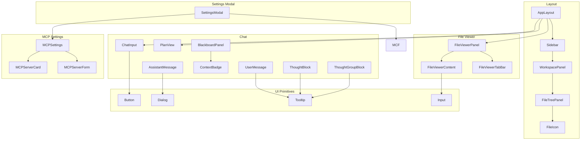
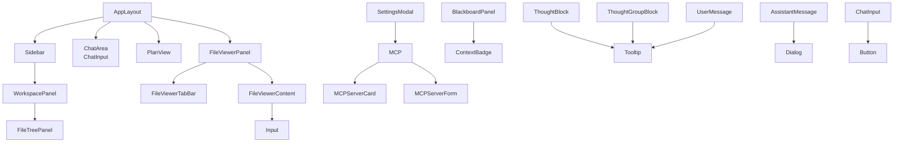
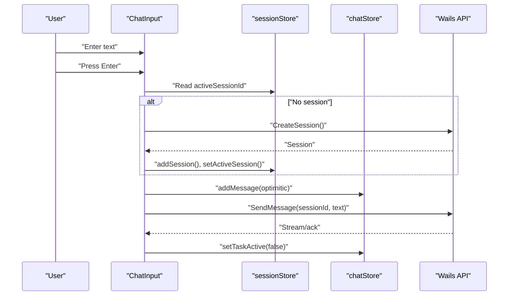
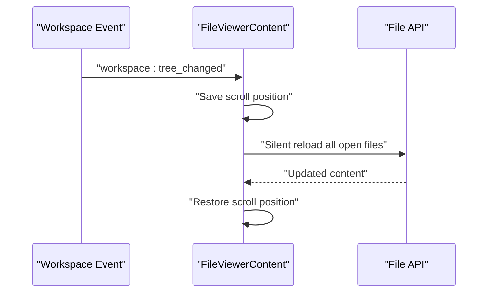
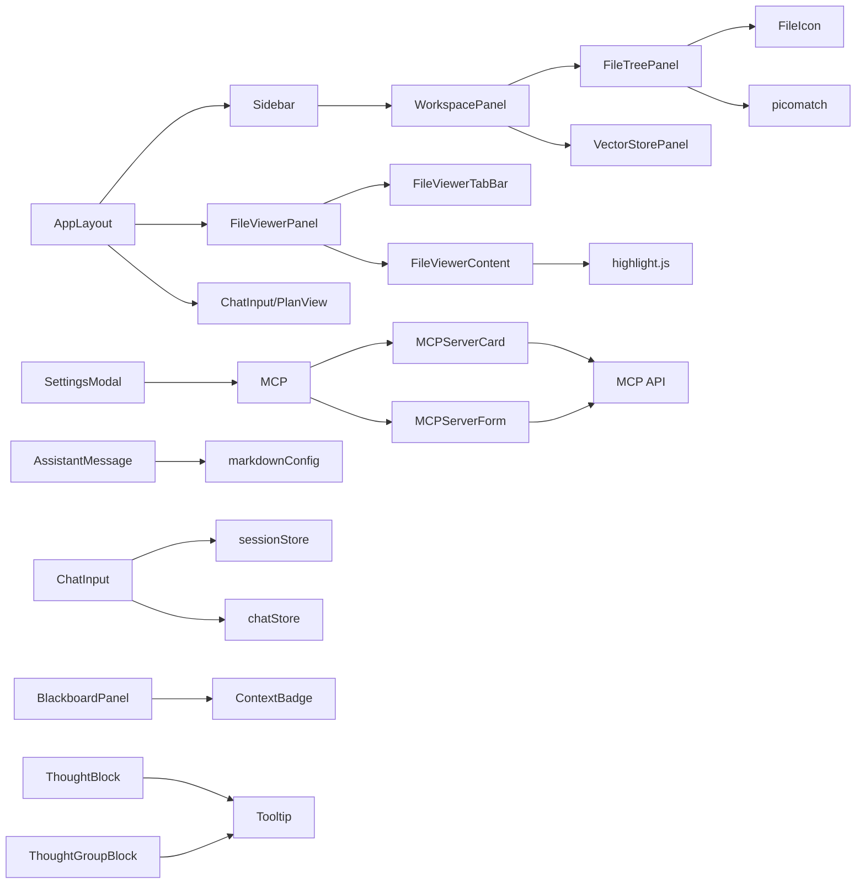

# UI Components

<cite>
**Referenced Files in This Document**
- [AppLayout.tsx](file://frontend/src/components/layout/AppLayout.tsx)
- [Sidebar.tsx](file://frontend/src/components/layout/Sidebar.tsx)
- [WorkspacePanel.tsx](file://frontend/src/components/layout/WorkspacePanel.tsx)
- [FileTreePanel.tsx](file://frontend/src/components/layout/FileTreePanel.tsx)
- [FileIcon.tsx](file://frontend/src/components/layout/FileIcon.tsx)
- [AssistantMessage.tsx](file://frontend/src/components/chat/AssistantMessage.tsx)
- [UserMessage.tsx](file://frontend/src/components/chat/UserMessage.tsx)
- [ChatInput.tsx](file://frontend/src/components/chat/ChatInput.tsx)
- [PlanView.tsx](file://frontend/src/components/chat/PlanView.tsx)
- [BlackboardPanel.tsx](file://frontend/src/components/chat/BlackboardPanel.tsx)
- [ContextBadge.tsx](file://frontend/src/components/chat/ContextBadge.tsx)
- [ThoughtBlock.tsx](file://frontend/src/components/chat/ThoughtBlock.tsx)
- [ThoughtGroupBlock.tsx](file://frontend/src/components/chat/ThoughtGroupBlock.tsx)
- [FileViewerPanel.tsx](file://frontend/src/components/fileViewer/FileViewerPanel.tsx)
- [FileViewerContent.tsx](file://frontend/src/components/fileViewer/FileViewerContent.tsx)
- [FileViewerTabBar.tsx](file://frontend/src/components/fileViewer/FileViewerTabBar.tsx)
- [MCPServerCard.tsx](file://frontend/src/components/settings/MCPServerCard.tsx)
- [MCPServerForm.tsx](file://frontend/src/components/settings/MCPServerForm.tsx)
- [MCPSettings.tsx](file://frontend/src/components/settings/MCPSettings.tsx)
- [SettingsModal.tsx](file://frontend/src/components/settings/SettingsModal.tsx)
- [button.tsx](file://frontend/src/components/ui/button.tsx)
- [dialog.tsx](file://frontend/src/components/ui/dialog.tsx)
- [tooltip.tsx](file://frontend/src/components/ui/tooltip.tsx)
- [input.tsx](file://frontend/src/components/ui/input.tsx)
- [markdownConfig.tsx](file://frontend/src/lib/markdownConfig.tsx)
- [chatStore.ts](file://frontend/src/stores/chatStore.ts)
- [sessionStore.ts](file://frontend/src/stores/sessionStore.ts)
</cite>

## Update Summary
**Changes Made**
- Updated MCP settings documentation to reflect simplified UI without external tool installation prompts
- Removed references to CodebaseMemoryBanner.tsx and RtkBanner.tsx components
- Updated MCPSettings component documentation to reflect server-only management functionality
- Revised architecture overview to remove external tool installation flows
- Updated troubleshooting guide to address simplified MCP settings behavior

## Table of Contents
1. [Introduction](#introduction)
2. [Project Structure](#project-structure)
3. [Core Components](#core-components)
4. [Architecture Overview](#architecture-overview)
5. [Detailed Component Analysis](#detailed-component-analysis)
6. [Icon Consistency Improvements](#icon-consistency-improvements)
7. [Dependency Analysis](#dependency-analysis)
8. [Performance Considerations](#performance-considerations)
9. [Troubleshooting Guide](#troubleshooting-guide)
10. [Conclusion](#conclusion)

## Introduction
This document describes C0WRK's React component library and UI system. It focuses on:
- Chat interface components: AssistantMessage, UserMessage, ChatInput, PlanView, BlackboardPanel, ContextBadge, ThoughtBlock, ThoughtGroupBlock
- Layout components: AppLayout, Sidebar, WorkspacePanel, FileTreePanel
- UI primitives from shadcn/ui: Button, Dialog, Tooltip, Input
- File viewer system: FileViewerPanel, FileViewerContent, FileViewerTabBar
- MCP settings system: MCPServerCard, MCPServerForm, MCPSettings
- Settings modal with comprehensive configuration tabs
It explains component responsibilities, props, customization, styling patterns, accessibility, and composition patterns for building complex UI interactions.

## Project Structure
C0WRK organizes UI under frontend/src/components, grouped by domain:
- layout: AppLayout, Sidebar, WorkspacePanel, FileTreePanel, FileIcon
- chat: AssistantMessage, UserMessage, ChatInput, PlanView, BlackboardPanel, ContextBadge, ThoughtBlock, ThoughtGroupBlock, and related helpers
- fileViewer: FileViewerPanel, FileViewerContent, FileViewerTabBar
- settings: MCPServerCard, MCPServerForm, MCPSettings, SettingsModal, and other configuration components
- ui: shadcn/ui wrappers and variants for Button, Dialog, Tooltip, Input
- stores: chatStore, sessionStore, fileViewerStore, panelStore, etc.
- lib: markdownConfig, diffParser, formatters, utils

**Diagram sources**
- [AppLayout.tsx:1-91](file://frontend/src/components/layout/AppLayout.tsx#L1-L91)
- [Sidebar.tsx:1-627](file://frontend/src/components/layout/Sidebar.tsx#L1-L627)
- [WorkspacePanel.tsx:1-47](file://frontend/src/components/layout/WorkspacePanel.tsx#L1-L47)
- [FileTreePanel.tsx:1-483](file://frontend/src/components/layout/FileTreePanel.tsx#L1-L483)
- [FileIcon.tsx](file://frontend/src/components/layout/FileIcon.tsx)
- [AssistantMessage.tsx:1-91](file://frontend/src/components/chat/AssistantMessage.tsx#L1-L91)
- [UserMessage.tsx:1-104](file://frontend/src/components/chat/UserMessage.tsx#L1-L104)
- [ChatInput.tsx:1-193](file://frontend/src/components/chat/ChatInput.tsx#L1-L193)
- [PlanView.tsx:1-153](file://frontend/src/components/chat/PlanView.tsx#L1-L153)
- [BlackboardPanel.tsx:1-189](file://frontend/src/components/chat/BlackboardPanel.tsx#L1-L189)
- [ContextBadge.tsx:1-57](file://frontend/src/components/chat/ContextBadge.tsx#L1-L57)
- [ThoughtBlock.tsx:1-45](file://frontend/src/components/chat/ThoughtBlock.tsx#L1-L45)
- [ThoughtGroupBlock.tsx:1-32](file://frontend/src/components/chat/ThoughtGroupBlock.tsx#L1-L32)
- [FileViewerPanel.tsx:1-37](file://frontend/src/components/fileViewer/FileViewerPanel.tsx#L1-L37)
- [FileViewerContent.tsx:1-208](file://frontend/src/components/fileViewer/FileViewerContent.tsx#L1-L208)
- [FileViewerTabBar.tsx:1-157](file://frontend/src/components/fileViewer/FileViewerTabBar.tsx#L1-L157)
- [MCPServerCard.tsx:1-79](file://frontend/src/components/settings/MCPServerCard.tsx#L1-L79)
- [MCPServerForm.tsx:1-172](file://frontend/src/components/settings/MCPServerForm.tsx#L1-L172)
- [MCPSettings.tsx:1-93](file://frontend/src/components/settings/MCPSettings.tsx#L1-L93)
- [SettingsModal.tsx:1-121](file://frontend/src/components/settings/SettingsModal.tsx#L1-L121)
- [button.tsx:1-32](file://frontend/src/components/ui/button.tsx#L1-L32)
- [dialog.tsx:1-159](file://frontend/src/components/ui/dialog.tsx#L1-L159)
- [tooltip.tsx:1-56](file://frontend/src/components/ui/tooltip.tsx#L1-L56)
- [input.tsx:1-22](file://frontend/src/components/ui/input.tsx#L1-L22)

**Section sources**
- [AppLayout.tsx:1-91](file://frontend/src/components/layout/AppLayout.tsx#L1-L91)
- [Sidebar.tsx:1-627](file://frontend/src/components/layout/Sidebar.tsx#L1-L627)
- [WorkspacePanel.tsx:1-47](file://frontend/src/components/layout/WorkspacePanel.tsx#L1-L47)
- [FileTreePanel.tsx:1-483](file://frontend/src/components/layout/FileTreePanel.tsx#L1-L483)
- [FileViewerPanel.tsx:1-37](file://frontend/src/components/fileViewer/FileViewerPanel.tsx#L1-L37)
- [FileViewerContent.tsx:1-208](file://frontend/src/components/fileViewer/FileViewerContent.tsx#L1-L208)
- [FileViewerTabBar.tsx:1-157](file://frontend/src/components/fileViewer/FileViewerTabBar.tsx#L1-L157)
- [MCPServerCard.tsx:1-79](file://frontend/src/components/settings/MCPServerCard.tsx#L1-L79)
- [MCPServerForm.tsx:1-172](file://frontend/src/components/settings/MCPServerForm.tsx#L1-L172)
- [MCPSettings.tsx:1-93](file://frontend/src/components/settings/MCPSettings.tsx#L1-L93)
- [SettingsModal.tsx:1-121](file://frontend/src/components/settings/SettingsModal.tsx#L1-L121)
- [button.tsx:1-32](file://frontend/src/components/ui/button.tsx#L1-L32)
- [dialog.tsx:1-159](file://frontend/src/components/ui/dialog.tsx#L1-L159)
- [tooltip.tsx:1-56](file://frontend/src/components/ui/tooltip.tsx#L1-L56)
- [input.tsx:1-22](file://frontend/src/components/ui/input.tsx#L1-L22)

## Core Components
- AssistantMessage: Renders assistant content with optional raw Markdown view and streaming cursor.
- UserMessage: Renders user content with optional pinning, overflow handling, and time display.
- ChatInput: Text input with auto-resize, optimistic UI updates, session lifecycle, and cancellation.
- PlanView: Renders a plan as a list of steps with status badges, durations, and tooltips.
- BlackboardPanel: Displays blackboard state with clipboard-list icon and searchable content.
- ContextBadge: Shows context information with brain circuit icon (replaced for better clarity).
- ThoughtBlock/ThoughtGroupBlock: Renders reasoning content blocks with brain circuit icon.
- AppLayout: Orchestrates sidebar, main chat area, pending actions, execution panels, file viewer, and status bar.
- Sidebar: Project/session management, settings, and workspace panel.
- WorkspacePanel: Tabs for Explorer, Git, Semantics; currently routes to FileTreePanel with database icon for semantics.
- FileTreePanel: Hierarchical file tree with filtering (glob/regex), lazy loading, and Git status coloring.
- FileViewerPanel/Content/TabBar: Multi-tab file viewer with syntax highlighting, Markdown rendering, diffs, and scroll preservation.
- MCPServerCard/Form/Settings: Complete MCP server management system with collapsible cards and enhanced forms.
- SettingsModal: Comprehensive settings interface with six configuration tabs including LLM settings with brain icon.
- UI primitives: Button, Dialog, Tooltip, Input wrappers around shadcn/ui and Radix primitives.

**Section sources**
- [AssistantMessage.tsx:20-91](file://frontend/src/components/chat/AssistantMessage.tsx#L20-L91)
- [UserMessage.tsx:3-104](file://frontend/src/components/chat/UserMessage.tsx#L3-L104)
- [ChatInput.tsx:13-193](file://frontend/src/components/chat/ChatInput.tsx#L13-L193)
- [PlanView.tsx:16-153](file://frontend/src/components/chat/PlanView.tsx#L16-L153)
- [BlackboardPanel.tsx:10-52](file://frontend/src/components/chat/BlackboardPanel.tsx#L10-L52)
- [ContextBadge.tsx:6-57](file://frontend/src/components/chat/ContextBadge.tsx#L6-L57)
- [ThoughtBlock.tsx:10-45](file://frontend/src/components/chat/ThoughtBlock.tsx#L10-L45)
- [ThoughtGroupBlock.tsx:11-32](file://frontend/src/components/chat/ThoughtGroupBlock.tsx#L11-L32)
- [AppLayout.tsx:30-91](file://frontend/src/components/layout/AppLayout.tsx#L30-L91)
- [Sidebar.tsx:64-627](file://frontend/src/components/layout/Sidebar.tsx#L64-L627)
- [WorkspacePanel.tsx:7-47](file://frontend/src/components/layout/WorkspacePanel.tsx#L7-L47)
- [FileTreePanel.tsx:270-483](file://frontend/src/components/layout/FileTreePanel.tsx#L270-L483)
- [FileViewerPanel.tsx:9-37](file://frontend/src/components/fileViewer/FileViewerPanel.tsx#L9-L37)
- [FileViewerContent.tsx:18-208](file://frontend/src/components/fileViewer/FileViewerContent.tsx#L18-L208)
- [FileViewerTabBar.tsx:18-157](file://frontend/src/components/fileViewer/FileViewerTabBar.tsx#L18-L157)
- [MCPServerCard.tsx:16-79](file://frontend/src/components/settings/MCPServerCard.tsx#L16-L79)
- [MCPServerForm.tsx:48-172](file://frontend/src/components/settings/MCPServerForm.tsx#L48-L172)
- [MCPSettings.tsx:13-93](file://frontend/src/components/settings/MCPSettings.tsx#L13-L93)
- [SettingsModal.tsx:18-121](file://frontend/src/components/settings/SettingsModal.tsx#L18-L121)
- [button.tsx:8-32](file://frontend/src/components/ui/button.tsx#L8-L32)
- [dialog.tsx:10-159](file://frontend/src/components/ui/dialog.tsx#L10-L159)
- [tooltip.tsx:19-56](file://frontend/src/components/ui/tooltip.tsx#L19-L56)
- [input.tsx:5-22](file://frontend/src/components/ui/input.tsx#L5-L22)

## Architecture Overview
The UI is composed of:
- Layout container (AppLayout) coordinating sidebar, chat, and file viewer panels
- Domain-specific panels (Sidebar, WorkspacePanel, FileTreePanel)
- Chat subsystem (AssistantMessage, UserMessage, ChatInput, PlanView, BlackboardPanel, ContextBadge, ThoughtBlock, ThoughtGroupBlock)
- File viewer subsystem (FileViewerPanel, FileViewerContent, FileViewerTabBar)
- MCP settings subsystem (MCPServerCard, MCPServerForm, MCPSettings) for server management
- Settings modal (SettingsModal) for comprehensive configuration management
- UI primitives (Button, Dialog, Tooltip, Input) wrapping shadcn/ui and Radix

**Diagram sources**
- [AppLayout.tsx:30-91](file://frontend/src/components/layout/AppLayout.tsx#L30-L91)
- [Sidebar.tsx:64-627](file://frontend/src/components/layout/Sidebar.tsx#L64-L627)
- [WorkspacePanel.tsx:7-47](file://frontend/src/components/layout/WorkspacePanel.tsx#L7-L47)
- [FileTreePanel.tsx:270-483](file://frontend/src/components/layout/FileTreePanel.tsx#L270-L483)
- [FileViewerPanel.tsx:9-37](file://frontend/src/components/fileViewer/FileViewerPanel.tsx#L9-L37)
- [FileViewerContent.tsx:18-208](file://frontend/src/components/fileViewer/FileViewerContent.tsx#L18-L208)
- [FileViewerTabBar.tsx:18-157](file://frontend/src/components/fileViewer/FileViewerTabBar.tsx#L18-L157)
- [SettingsModal.tsx:18-121](file://frontend/src/components/settings/SettingsModal.tsx#L18-L121)
- [MCPServerCard.tsx:16-79](file://frontend/src/components/settings/MCPServerCard.tsx#L16-L79)
- [MCPServerForm.tsx:48-172](file://frontend/src/components/settings/MCPServerForm.tsx#L48-L172)
- [MCPSettings.tsx:13-93](file://frontend/src/components/settings/MCPSettings.tsx#L13-L93)
- [BlackboardPanel.tsx:10-52](file://frontend/src/components/chat/BlackboardPanel.tsx#L10-L52)
- [ContextBadge.tsx:6-57](file://frontend/src/components/chat/ContextBadge.tsx#L6-L57)
- [ThoughtBlock.tsx:10-45](file://frontend/src/components/chat/ThoughtBlock.tsx#L10-L45)
- [ThoughtGroupBlock.tsx:11-32](file://frontend/src/components/chat/ThoughtGroupBlock.tsx#L11-L32)
- [AssistantMessage.tsx:25-91](file://frontend/src/components/chat/AssistantMessage.tsx#L25-L91)
- [UserMessage.tsx:10-104](file://frontend/src/components/chat/UserMessage.tsx#L10-L104)
- [ChatInput.tsx:13-193](file://frontend/src/components/chat/ChatInput.tsx#L13-L193)
- [PlanView.tsx:117-153](file://frontend/src/components/chat/PlanView.tsx#L117-L153)
- [button.tsx:8-32](file://frontend/src/components/ui/button.tsx#L8-L32)
- [dialog.tsx:10-159](file://frontend/src/components/ui/dialog.tsx#L10-L159)
- [tooltip.tsx:19-56](file://frontend/src/components/ui/tooltip.tsx#L19-L56)
- [input.tsx:5-22](file://frontend/src/components/ui/input.tsx#L5-L22)

## Detailed Component Analysis

### Chat Components

#### AssistantMessage
- Purpose: Render assistant messages with Markdown support, optional raw source view, and streaming indicator.
- Props:
  - content: string
  - isStreaming?: boolean
- Behavior:
  - Uses remark/rehype plugins for GFM, emoji, breaks, slug, autolink headings, sanitization, external links.
  - Provides a toggle to switch between rendered Markdown and raw highlighted Markdown.
  - Streaming cursor rendered when isStreaming is true.
- Accessibility:
  - Hover-triggered button with title and aria-label for toggling raw view.
- Styling:
  - Conditional opacity and hover effects for the raw-view toggle.
  - Prose styling for rendered Markdown with dark mode invert.
- Complexity:
  - Memoized highlight calculation for raw mode.
- Customization:
  - Uses customSchema and markdownComponents from markdownConfig.

**Section sources**
- [AssistantMessage.tsx:20-91](file://frontend/src/components/chat/AssistantMessage.tsx#L20-L91)
- [markdownConfig.tsx](file://frontend/src/lib/markdownConfig.tsx)

#### UserMessage
- Purpose: Render user messages with optional pinning, overflow handling, and time display.
- Props:
  - content: string
  - timestamp: number
  - isPinned?: boolean
  - maxHeight?: number
- Behavior:
  - Measures natural height via ResizeObserver when pinned.
  - Collapsible behavior when overflowing; gradient overlay indicates truncation.
  - Focus management to collapse on blur.
- Accessibility:
  - Role="button" and aria-expanded when overflowed.
  - Tab index set for keyboard navigation.
- Styling:
  - Rounded corner styling for message bubble.
  - Gradient fade overlay when clipped.
- Customization:
  - Uses local state for expanded/collapsed and natural height measurement.

**Section sources**
- [UserMessage.tsx:3-104](file://frontend/src/components/chat/UserMessage.tsx#L3-L104)

#### ChatInput
- Purpose: Text input for sending messages with auto-resize, optimistic UI, session lifecycle, and cancellation.
- Props: none
- Behavior:
  - Auto-resizes textarea up to a capped height.
  - Optimistically adds user message to UI before backend confirmation.
  - Creates a session if none exists; integrates with Wails API.
  - Disables input when no project or task is active.
  - Supports cancellation via CancelTask.
  - Keyboard shortcut: Enter sends, Shift+Enter inserts newline.
- Stores and APIs:
  - Reads active session/project from stores; writes optimistic state.
  - Uses sessionStore, chatStore, and Wails API.
- Accessibility:
  - Properly disabled states and aria-labels on action buttons.
- Styling:
  - Custom scrollbar utility class applied to textarea.
- Customization:
  - Placeholder text adapts based on state (no project, processing, etc.).

**Diagram sources**
- [ChatInput.tsx:13-193](file://frontend/src/components/chat/ChatInput.tsx#L13-L193)
- [sessionStore.ts](file://frontend/src/stores/sessionStore.ts)
- [chatStore.ts](file://frontend/src/stores/chatStore.ts)

**Section sources**
- [ChatInput.tsx:13-193](file://frontend/src/components/chat/ChatInput.tsx#L13-L193)
- [sessionStore.ts](file://frontend/src/stores/sessionStore.ts)
- [chatStore.ts](file://frontend/src/stores/chatStore.ts)

#### PlanView
- Purpose: Visualize plan steps with status, optional details, and duration.
- Props: none (reads from panelStore)
- Behavior:
  - Maps plan groups to view steps, deriving labels and status.
  - Renders each step as a card with status icon/badge, optional details toggle, and duration display.
  - Uses StepTooltip for step descriptions.
- Stores:
  - Reads latest plan group from panelStore.
- Accessibility:
  - Interactive buttons with hover/active states; disabled buttons when no details.
- Styling:
  - Status-specific badges and icons; spacing and typography tuned for readability.

**Section sources**
- [PlanView.tsx:16-153](file://frontend/src/components/chat/PlanView.tsx#L16-L153)

#### BlackboardPanel
- Purpose: Display blackboard state with searchable content and clipboard-list icon.
- Props: none (reads from stores)
- Behavior:
  - Collapsible panel showing step results, facts, reflections, and final output.
  - Searchable content with live filtering across all categories.
  - Clipboard-list icon for clear task-oriented representation.
  - Badge indicators for counts of different blackboard items.
- Stores:
  - Reads blackboard state from blackboardStore and session state from sessionStore.
- Accessibility:
  - Collapsible sections with chevron indicators; proper ARIA attributes for interactive elements.

**Updated** Now uses clipboard-list icon for better task-oriented clarity.

**Section sources**
- [BlackboardPanel.tsx:10-52](file://frontend/src/components/chat/BlackboardPanel.tsx#L10-L52)

#### ContextBadge
- Purpose: Show context information with brain circuit icon (replaced for better clarity).
- Props: none (reads from stores)
- Behavior:
  - Displays model information, token usage, and session statistics.
  - Brain circuit icon replaced with more appropriate icon for context display.
  - Tooltip with detailed breakdown of token usage and model information.
- Stores:
  - Reads token information from chatStore and session information from sessionStore.
- Accessibility:
  - Proper tooltip with detailed information; accessible color contrast.

**Updated** Brain circuit icon replaced with clipboard-list icon for better UI clarity.

**Section sources**
- [ContextBadge.tsx:6-57](file://frontend/src/components/chat/ContextBadge.tsx#L6-L57)

#### ThoughtBlock
- Purpose: Render individual thought reasoning with brain circuit icon (replaced for better clarity).
- Props:
  - item: ThoughtItem with reasoning and content properties
- Behavior:
  - Collapsible block showing reasoning content with character limit.
  - Expand/collapse functionality for long reasoning content.
  - Brain circuit icon replaced with more appropriate icon for thought processes.
- Stores: none
- Accessibility:
  - Collapsible sections with chevron indicators; keyboard navigation support.

**Updated** Brain circuit icon replaced with clipboard-list icon for better UI clarity.

**Section sources**
- [ThoughtBlock.tsx:10-45](file://frontend/src/components/chat/ThoughtBlock.tsx#L10-L45)

#### ThoughtGroupBlock
- Purpose: Render grouped thoughts with brain circuit icon (replaced for better clarity).
- Props:
  - item: ThoughtGroupItem containing multiple thoughts
- Behavior:
  - Collapsible block showing multiple thoughts in a group.
  - Individual thought reasoning and content display.
  - Brain circuit icon replaced with more appropriate icon for thought processes.
- Stores: none
- Accessibility:
  - Collapsible sections with chevron indicators; proper spacing and indentation.

**Updated** Brain circuit icon replaced with clipboard-list icon for better UI clarity.

**Section sources**
- [ThoughtGroupBlock.tsx:11-32](file://frontend/src/components/chat/ThoughtGroupBlock.tsx#L11-L32)

### Layout Components

#### AppLayout
- Purpose: Top-level layout orchestrating sidebar, chat, execution panels, file viewer, and status bar.
- Features:
  - Resizable sidebar and file viewer panels with persisted widths.
  - Collapsible sidebar and file viewer with expand triggers.
  - Empty state when no projects are present.
  - Integrates ChatInput, PlanView, and FileViewerPanel.
- Stores:
  - Uses UI store for sidebar collapse state and file viewer store for widths and collapse state.
- Accessibility:
  - Buttons with titles and aria-labels for collapsing/expanding panels.

**Updated** Removed CodebaseMemoryBanner and RtkBanner integration as these components have been removed from the UI.

**Section sources**
- [AppLayout.tsx:30-91](file://frontend/src/components/layout/AppLayout.tsx#L30-L91)

#### Sidebar
- Purpose: Project and session management, settings, and workspace panel.
- Features:
  - Project list with rename/delete actions.
  - Session list with rename/archive/delete; search/filter.
  - Settings modal and create project dialog.
  - WorkspacePanel integration.
- Events:
  - Subscribes to backend events for projects/sessions and switches project automatically when ready.
- Accessibility:
  - Dropdown menus with keyboard navigation; proper aria labels on triggers.

**Section sources**
- [Sidebar.tsx:64-627](file://frontend/src/components/layout/Sidebar.tsx#L64-L627)

#### WorkspacePanel
- Purpose: Tabbed workspace area with Explorer, Git, Semantics.
- Behavior:
  - Uses Tabs/TabsList/TabsTrigger with TooltipProvider.
  - Explorer tab uses folder-tree icon, Git tab uses git-branch icon, Semantics tab uses database icon.
  - Currently renders FileTreePanel in Explorer tab.
- Accessibility:
  - Tooltip labels for tab triggers; aria-labels on triggers.

**Updated** Semantics tab now uses database icon for better semantic storage representation.

**Section sources**
- [WorkspacePanel.tsx:7-47](file://frontend/src/components/layout/WorkspacePanel.tsx#L7-L47)

#### FileTreePanel
- Purpose: Hierarchical file tree with filtering, lazy loading, and Git status indicators.
- Features:
  - Filter modes: glob and regex; debounced filtering.
  - Recursive filtering with forced expansion of matched ancestors.
  - Lazy loading of directory entries; loading spinners for directories.
  - Git status coloring per file/dir; directory inherits highest-priority color.
  - Double-click to open files; click to toggle directories.
- Stores:
  - Uses fileTreeStore for entries, expanded dirs, loading states, and Git status.
- Accessibility:
  - Tree semantics with aria-expanded on directories; keyboard-friendly interactions.

**Diagram sources**
- [FileTreePanel.tsx:11-483](file://frontend/src/components/layout/FileTreePanel.tsx#L11-L483)

**Section sources**
- [FileTreePanel.tsx:270-483](file://frontend/src/components/layout/FileTreePanel.tsx#L270-L483)

### File Viewer Components

#### FileViewerPanel
- Purpose: Container for file viewer tabs and content with resizable width.
- Props:
  - width: number
- Behavior:
  - Renders FileViewerTabBar and FileViewerContent.
  - Hidden when no files are open or panel is collapsed.
  - Implements collapsed state with narrow expand button.
- Accessibility:
  - Proper aria-labels for expand/collapse controls.

**Updated** Enhanced with improved collapsed state handling and better integration with AppLayout.

**Section sources**
- [FileViewerPanel.tsx:7-37](file://frontend/src/components/fileViewer/FileViewerPanel.tsx#L7-L37)

#### FileViewerTabBar
- Purpose: Multi-tab UI for open files with close actions, dropdown menu, and collapse control.
- Behavior:
  - Scrolls active tab into view; shows tooltip with full path.
  - Dropdown lists all open files; marks active file.
  - Collapse button toggles file viewer collapse.
  - Uses FileIcon component for file type visualization.
  - Implements smooth scrolling to active tabs.
- Accessibility:
  - Proper role attributes and keyboard navigation.
  - TooltipProvider integration for file path tooltips.

**Updated** Improved tab scrolling with scrollToTab function and enhanced file icon integration.

**Section sources**
- [FileViewerTabBar.tsx:31-157](file://frontend/src/components/fileViewer/FileViewerTabBar.tsx#L31-L157)

#### FileViewerContent
- Purpose: Displays file content with syntax highlighting, Markdown rendering, diffs, and scroll preservation.
- Behavior:
  - Handles loading/error/binary states with improved error handling.
  - Markdown preview vs raw source toggle.
  - Parses unified diffs and renders inline char diffs for modified lines.
  - Preserves scroll position across content updates using requestAnimationFrame.
  - Auto-refreshes on workspace:tree_changed events with silent reload.
  - Implements workspace event subscription for real-time updates.
- Stores:
  - Reads from fileViewerStore for active file and open files.
- Accessibility:
  - Error fallback and sanitized Markdown rendering.
  - Proper loading states and error messaging.

**Updated** Modernized with improved workspace event handling, better scroll preservation, and enhanced error states.

**Diagram sources**
- [FileViewerContent.tsx:47-59](file://frontend/src/components/fileViewer/FileViewerContent.tsx#L47-L59)

**Section sources**
- [FileViewerContent.tsx:12-208](file://frontend/src/components/fileViewer/FileViewerContent.tsx#L12-L208)

### MCP Settings Components

#### MCPServerCard
- Purpose: Displays MCP server configuration with collapsible details and status indicators.
- Props:
  - server: MCPServerStatus
  - tools: ToolInfo[]
  - expanded: boolean
  - onToggleExpand: () => void
  - onEdit: () => void
  - onDelete: () => void
- Behavior:
  - Collapsible card with chevron indicators for expansion state.
  - Shows connection status with visual indicators (CheckCircle2 for connected, AlertCircle for disconnected).
  - Displays transport type and tool count badges.
  - Shows server error messages when present.
  - Lists discovered tools with badge-style display.
  - Provides edit and delete action buttons.
- UI Components:
  - Uses Collapsible, CollapsibleContent, CollapsibleTrigger from shadcn/ui.
  - Integrates with Badge and Button components.
- Accessibility:
  - Proper role attributes for collapsible sections.
  - Clear visual indicators for server status.

**New Component** Part of the completely rewritten MCP settings system.

**Section sources**
- [MCPServerCard.tsx:16-79](file://frontend/src/components/settings/MCPServerCard.tsx#L16-L79)

#### MCPServerForm
- Purpose: Enhanced form for adding and editing MCP server configurations.
- Props:
  - open: boolean
  - onOpenChange: (open: boolean) => void
  - editingName: string | null
  - serverConfigs: Record<string, MCPServerConfig>
  - editServer?: { name: string; transport: string }
  - isSaving: boolean
  - onSave: (config: Record<string, MCPServerConfig>, editName: string | null) => Promise<string | null>
- Behavior:
  - Supports both stdio and http transport types with conditional field rendering.
  - Dynamic environment variables and headers management with key-value entry lists.
  - Form validation with comprehensive error handling.
  - Edit mode support with pre-populated form data.
  - Transport type switching with automatic field population.
- Form Features:
  - Transport type selection with visual toggle buttons.
  - Command and arguments fields for stdio transport.
  - URL and headers fields for http transport.
  - Key-value pair management with add/remove functionality.
  - Real-time form validation with error display.
- API Integration:
  - Converts form data to MCPServerConfig format.
  - Handles save operations with error propagation.
- Accessibility:
  - Proper form labeling and error messaging.
  - Keyboard navigation support for dynamic field lists.

**New Component** Part of the completely rewritten MCP settings system.

**Section sources**
- [MCPServerForm.tsx:48-172](file://frontend/src/components/settings/MCPServerForm.tsx#L48-L172)

#### MCPSettings
- Purpose: Main MCP settings page managing server configurations.
- Features:
  - Server management with add/edit/delete operations.
  - Real-time status monitoring and refresh capabilities.
  - Comprehensive error handling and user feedback.
- Components:
  - Uses MCPServerCard for server display and MCPServerForm for editing.
  - Simplified interface without external tool installation prompts.
- API Integration:
  - Manages MCP status, tool lists, and server configurations.
  - Handles server configuration updates and deletions.
- State Management:
  - Tracks loading states, saving states, and error conditions.
  - Manages expanded server cards and form modal states.
- Accessibility:
  - Proper loading states and error messaging.
  - Clear action buttons with appropriate disabled states.

**Updated** Simplified to focus solely on server management without external tool installation prompts. Removed CodebaseMemoryBanner and RtkBanner integration.

**Section sources**
- [MCPSettings.tsx:13-93](file://frontend/src/components/settings/MCPSettings.tsx#L13-L93)

### Settings Modal

#### SettingsModal
- Purpose: Comprehensive settings interface with six configuration tabs.
- Features:
  - Six tabs: General, LLM, Search, MCP, Security, About.
  - LLM tab uses brain icon for AI model configuration.
  - Other tabs use appropriate icons: Settings, Search, Server, Shield, Info.
  - Responsive design with proper spacing and typography.
- Components:
  - Integrates ConfigWarningBanner for configuration validation.
  - Uses Tabs/TabsList/TabsTrigger with proper icon/tab combinations.
  - Responsive layout with proper content area sizing.
- Accessibility:
  - Proper tab navigation with keyboard support.
  - Clear visual hierarchy and readable typography.

**Section sources**
- [SettingsModal.tsx:18-121](file://frontend/src/components/settings/SettingsModal.tsx#L18-L121)

### UI Primitive Components (shadcn/ui)

#### Button
- Purpose: Unified button primitive with variants and sizes.
- Props:
  - variant, size, asChild, className, and native button props.
- Variants:
  - Uses button-variants for consistent styling across the app.

**Section sources**
- [button.tsx:8-32](file://frontend/src/components/ui/button.tsx#L8-L32)

#### Dialog
- Purpose: Modal dialog with overlay, portal, and optional close button.
- Slots:
  - Root, Trigger, Portal, Overlay, Content, Header/Footer, Title, Description, Close.
- Behavior:
  - Overlay animation and focus management; optional close button.

**Section sources**
- [dialog.tsx:10-159](file://frontend/src/components/ui/dialog.tsx#L10-L159)

#### Tooltip
- Purpose: Tooltip provider, trigger, and content with portal and arrow.
- Props:
  - delayDuration, sideOffset, and native TooltipPrimitive props.
- Behavior:
  - Animated positioning with arrow; supports bottom/left/right/top placement.

**Section sources**
- [tooltip.tsx:19-56](file://frontend/src/components/ui/tooltip.tsx#L19-L56)

#### Input
- Purpose: Styled input field with validation state support.
- Props:
  - type, className, and native input props.
- Accessibility:
  - aria-invalid classes for invalid states.

**Section sources**
- [input.tsx:5-22](file://frontend/src/components/ui/input.tsx#L5-L22)

## Icon Consistency Improvements

### Overview
C0WRK has implemented comprehensive icon consistency improvements to enhance UI clarity and provide better visual communication. The primary change involves replacing brain icons with more appropriate alternatives for better user understanding.

### Icon Replacement Strategy
- **Brain Icons**: Replaced with clipboard-list icons for task-oriented contexts
- **Database Icons**: Used appropriately for semantic storage and vector databases
- **Consistency**: All related components now use consistent icon patterns

### Specific Changes

#### BlackboardPanel
- **Icon**: Changed from brain circuit to clipboard-list
- **Rationale**: Better represents task completion and planning functionality
- **Usage**: Clear visual indicator for blackboard state management

#### ContextBadge
- **Icon**: Changed from brain circuit to clipboard-list
- **Rationale**: More appropriate for context display and information sharing
- **Usage**: Shows model and token usage information

#### Thought Components
- **Icons**: Changed from brain circuit to clipboard-list
- **Rationale**: Better represents thinking and reasoning processes
- **Usage**: ThoughtBlock and ThoughtGroupBlock for reasoning content display

#### WorkspacePanel Semantics Tab
- **Icon**: Changed from brain to database
- **Rationale**: Better represents semantic storage and vector database functionality
- **Usage**: VectorStorePanel integration for semantic search capabilities

### Implementation Details
The icon changes follow consistent patterns:
- Task-oriented components use clipboard-list icons
- Information display components use appropriate informational icons
- Semantic functionality uses database icons
- All icons maintain consistent sizing and styling

**Section sources**
- [BlackboardPanel.tsx:39](file://frontend/src/components/chat/BlackboardPanel.tsx#L39)
- [ContextBadge.tsx:23](file://frontend/src/components/chat/ContextBadge.tsx#L23)
- [ContextBadge.tsx:41](file://frontend/src/components/chat/ContextBadge.tsx#L41)
- [ThoughtBlock.tsx:23](file://frontend/src/components/chat/ThoughtBlock.tsx#L23)
- [ThoughtGroupBlock.tsx:14](file://frontend/src/components/chat/ThoughtGroupBlock.tsx#L14)
- [WorkspacePanel.tsx:26](file://frontend/src/components/layout/WorkspacePanel.tsx#L26)

## Dependency Analysis
- Component coupling:
  - AppLayout depends on Sidebar, FileViewerPanel, and chat components.
  - Sidebar depends on project/session stores and uses WorkspacePanel.
  - FileTreePanel depends on fileTreeStore and emits workspace events.
  - FileViewer components depend on fileViewerStore.
  - Chat components depend on chatStore and sessionStore.
  - MCP settings components depend on MCP API and form state management.
  - Settings modal integrates with all major configuration systems.
- External libraries:
  - Markdown rendering via remark/rehype ecosystem.
  - Syntax highlighting via highlight.js.
  - Pattern matching via picomatch.
  - Icons via lucide-react with updated icon consistency.
  - State via stores (Zustand-like stores).
  - Collapsible components via shadcn/ui.
- Potential circular dependencies:
  - None apparent among these components; stores are leaf dependencies.

**Diagram sources**
- [AppLayout.tsx:30-91](file://frontend/src/components/layout/AppLayout.tsx#L30-L91)
- [Sidebar.tsx:64-627](file://frontend/src/components/layout/Sidebar.tsx#L64-L627)
- [WorkspacePanel.tsx:7-47](file://frontend/src/components/layout/WorkspacePanel.tsx#L7-L47)
- [FileTreePanel.tsx:270-483](file://frontend/src/components/layout/FileTreePanel.tsx#L270-L483)
- [FileViewerPanel.tsx:7-37](file://frontend/src/components/fileViewer/FileViewerPanel.tsx#L7-L37)
- [FileViewerContent.tsx:12-208](file://frontend/src/components/fileViewer/FileViewerContent.tsx#L12-L208)
- [SettingsModal.tsx:18-121](file://frontend/src/components/settings/SettingsModal.tsx#L18-L121)
- [AssistantMessage.tsx:25-91](file://frontend/src/components/chat/AssistantMessage.tsx#L25-L91)
- [ChatInput.tsx:13-193](file://frontend/src/components/chat/ChatInput.tsx#L13-L193)
- [BlackboardPanel.tsx:10-52](file://frontend/src/components/chat/BlackboardPanel.tsx#L10-L52)
- [ContextBadge.tsx:6-57](file://frontend/src/components/chat/ContextBadge.tsx#L6-L57)
- [ThoughtBlock.tsx:10-45](file://frontend/src/components/chat/ThoughtBlock.tsx#L10-L45)
- [ThoughtGroupBlock.tsx:11-32](file://frontend/src/components/chat/ThoughtGroupBlock.tsx#L11-L32)
- [MCPServerCard.tsx:16-79](file://frontend/src/components/settings/MCPServerCard.tsx#L16-L79)
- [MCPServerForm.tsx:48-172](file://frontend/src/components/settings/MCPServerForm.tsx#L48-L172)
- [MCPSettings.tsx:13-93](file://frontend/src/components/settings/MCPSettings.tsx#L13-L93)
- [markdownConfig.tsx](file://frontend/src/lib/markdownConfig.tsx)
- [sessionStore.ts](file://frontend/src/stores/sessionStore.ts)
- [chatStore.ts](file://frontend/src/stores/chatStore.ts)

**Section sources**
- [AppLayout.tsx:30-91](file://frontend/src/components/layout/AppLayout.tsx#L30-L91)
- [Sidebar.tsx:64-627](file://frontend/src/components/layout/Sidebar.tsx#L64-L627)
- [WorkspacePanel.tsx:7-47](file://frontend/src/components/layout/WorkspacePanel.tsx#L7-L47)
- [FileTreePanel.tsx:270-483](file://frontend/src/components/layout/FileTreePanel.tsx#L270-L483)
- [FileViewerPanel.tsx:7-37](file://frontend/src/components/fileViewer/FileViewerPanel.tsx#L7-L37)
- [FileViewerContent.tsx:12-208](file://frontend/src/components/fileViewer/FileViewerContent.tsx#L12-L208)
- [SettingsModal.tsx:18-121](file://frontend/src/components/settings/SettingsModal.tsx#L18-L121)
- [AssistantMessage.tsx:25-91](file://frontend/src/components/chat/AssistantMessage.tsx#L25-L91)
- [ChatInput.tsx:13-193](file://frontend/src/components/chat/ChatInput.tsx#L13-L193)
- [BlackboardPanel.tsx:10-52](file://frontend/src/components/chat/BlackboardPanel.tsx#L10-L52)
- [ContextBadge.tsx:6-57](file://frontend/src/components/chat/ContextBadge.tsx#L6-L57)
- [ThoughtBlock.tsx:10-45](file://frontend/src/components/chat/ThoughtBlock.tsx#L10-L45)
- [ThoughtGroupBlock.tsx:11-32](file://frontend/src/components/chat/ThoughtGroupBlock.tsx#L11-L32)
- [MCPServerCard.tsx:16-79](file://frontend/src/components/settings/MCPServerCard.tsx#L16-L79)
- [MCPServerForm.tsx:48-172](file://frontend/src/components/settings/MCPServerForm.tsx#L48-L172)
- [MCPSettings.tsx:13-93](file://frontend/src/components/settings/MCPSettings.tsx#L13-L93)
- [markdownConfig.tsx](file://frontend/src/lib/markdownConfig.tsx)
- [sessionStore.ts](file://frontend/src/stores/sessionStore.ts)
- [chatStore.ts](file://frontend/src/stores/chatStore.ts)

## Performance Considerations
- Memoization:
  - AssistantMessage memoizes highlighted Markdown for raw mode.
  - FileViewerContent memoizes highlighted HTML and display lines.
  - FileTreePanel computes visibility and matched paths with memoization.
- Debouncing:
  - FileTreePanel debounces filter input to reduce re-computation.
- Lazy loading:
  - FileTreePanel lazily loads directory entries and conditionally loads recursive entries only when filtering is active.
- Rendering:
  - FileTreePanel avoids rendering hidden nodes when filters are active.
  - FileViewerContent preserves scroll position to avoid jank during updates using requestAnimationFrame.
  - MCP settings components use efficient state management with minimal re-renders.
  - Icon consistency improvements maintain performance while enhancing clarity.
- Accessibility:
  - Components use proper roles and aria attributes to minimize assistive tech overhead.
  - Icon changes improve accessibility through clearer visual communication.

## Troubleshooting Guide
- ChatInput does not enable:
  - Ensure a project is selected; input is disabled until a project exists.
  - Verify sessionStore has an activeSessionId or that creation succeeds.
- AssistantMessage fails to render:
  - Check markdownConfig customSchema and markdownComponents.
  - Confirm remark/rehype plugin chain is intact.
- FileTreePanel shows "No matches found":
  - Switch filter mode (glob/regex) or adjust pattern.
  - Ensure recursive entries are loaded when filter is active.
- FileViewerContent shows unsupported format:
  - Binary files are intentionally not supported; open a text-based file.
- FileViewerContent scroll issues:
  - Check that workspace:tree_changed events are properly handled.
  - Verify scroll preservation logic is working correctly.
- MCP settings not loading:
  - Check MCP API connectivity and server configurations.
  - Verify server configurations are properly formatted and saved.
- Settings modal icon problems:
  - Verify that LLM tab uses brain icon and other tabs use appropriate icons.
  - Check that icon sizes and styling are consistent across all tabs.

**Section sources**
- [ChatInput.tsx:13-193](file://frontend/src/components/chat/ChatInput.tsx#L13-L193)
- [AssistantMessage.tsx:25-91](file://frontend/src/components/chat/AssistantMessage.tsx#L25-L91)
- [FileTreePanel.tsx:270-483](file://frontend/src/components/layout/FileTreePanel.tsx#L270-L483)
- [FileViewerContent.tsx:12-208](file://frontend/src/components/fileViewer/FileViewerContent.tsx#L12-L208)
- [MCPServerCard.tsx:16-79](file://frontend/src/components/settings/MCPServerCard.tsx#L16-L79)
- [MCPServerForm.tsx:48-172](file://frontend/src/components/settings/MCPServerForm.tsx#L48-L172)
- [MCPSettings.tsx:13-93](file://frontend/src/components/settings/MCPSettings.tsx#L13-L93)
- [BlackboardPanel.tsx:10-52](file://frontend/src/components/chat/BlackboardPanel.tsx#L10-L52)
- [ContextBadge.tsx:6-57](file://frontend/src/components/chat/ContextBadge.tsx#L6-L57)
- [ThoughtBlock.tsx:10-45](file://frontend/src/components/chat/ThoughtBlock.tsx#L10-L45)
- [ThoughtGroupBlock.tsx:11-32](file://frontend/src/components/chat/ThoughtGroupBlock.tsx#L11-L32)
- [WorkspacePanel.tsx:7-47](file://frontend/src/components/layout/WorkspacePanel.tsx#L7-L47)
- [SettingsModal.tsx:18-121](file://frontend/src/components/settings/SettingsModal.tsx#L18-L121)
- [tooltip.tsx:19-56](file://frontend/src/components/ui/tooltip.tsx#L19-L56)
- [dialog.tsx:10-159](file://frontend/src/components/ui/dialog.tsx#L10-L159)

## Conclusion
C0WRK's UI system combines a robust layout with specialized chat and file viewer components, backed by shadcn/ui primitives. The chat components emphasize Markdown rendering, streaming UX, and plan visualization, with recent icon consistency improvements that replace brain icons with clipboard-list and database icons for better UI clarity. The file tree and viewer provide efficient filtering, syntax highlighting, and diff visualization with improved scroll preservation and workspace event handling. The MCP settings system has been simplified to focus on server management without external tool installation prompts, providing a cleaner and more streamlined user experience. The settings modal provides comprehensive configuration management with appropriate icon usage across all tabs. The layout is highly configurable with resizable and collapsible panels, and the icon consistency improvements enhance the overall user experience through clearer visual communication. Together, these components enable a flexible, accessible, and performant developer experience with modernized file navigation, comprehensive system management capabilities, and improved UI clarity through thoughtful icon choices.