# UI Primitive Components

<cite>
**Referenced Files in This Document**
- [button.tsx](file://frontend/src/components/ui/button.tsx)
- [button-variants.ts](file://frontend/src/components/ui/button-variants.ts)
- [dialog.tsx](file://frontend/src/components/ui/dialog.tsx)
- [dropdown-menu.tsx](file://frontend/src/components/ui/dropdown-menu.tsx)
- [input.tsx](file://frontend/src/components/ui/input.tsx)
- [tabs.tsx](file://frontend/src/components/ui/tabs.tsx)
- [tabs-variants.ts](file://frontend/src/components/ui/tabs-variants.ts)
- [badge.tsx](file://frontend/src/components/ui/badge.tsx)
- [badge-variants.ts](file://frontend/src/components/ui/badge-variants.ts)
- [tooltip.tsx](file://frontend/src/components/ui/tooltip.tsx)
- [collapsible.tsx](file://frontend/src/components/ui/collapsible.tsx)
- [separator.tsx](file://frontend/src/components/ui/separator.tsx)
- [components.json](file://frontend/components.json)
- [utils.ts](file://frontend/src/lib/utils.ts)
</cite>

## Table of Contents
1. [Introduction](#introduction)
2. [Project Structure](#project-structure)
3. [Core Components](#core-components)
4. [Architecture Overview](#architecture-overview)
5. [Detailed Component Analysis](#detailed-component-analysis)
6. [Dependency Analysis](#dependency-analysis)
7. [Performance Considerations](#performance-considerations)
8. [Troubleshooting Guide](#troubleshooting-guide)
9. [Conclusion](#conclusion)

## Introduction
This document describes the UI primitive components that power C0WRK’s interface. Built on shadcn/ui and Radix UI, these primitives provide consistent styling, behavior, and accessibility across the application. They include buttons, dialogs, dropdown menus, inputs, tabs, badges, tooltips, collapsible regions, and separators. Each component exposes variants, sizes, and interactive states, and integrates seamlessly with the broader component system via shared utilities and configuration.

## Project Structure
The UI primitives live under the frontend/src/components/ui directory and are configured via components.json. They rely on Tailwind CSS and the cn utility for composing responsive, theme-aware styles.

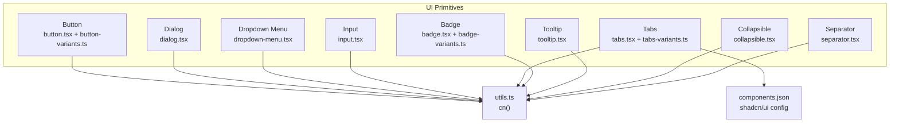

**Diagram sources**
- [button.tsx:1-32](file://frontend/src/components/ui/button.tsx#L1-L32)
- [button-variants.ts:1-36](file://frontend/src/components/ui/button-variants.ts#L1-L36)
- [dialog.tsx:1-159](file://frontend/src/components/ui/dialog.tsx#L1-L159)
- [dropdown-menu.tsx:1-258](file://frontend/src/components/ui/dropdown-menu.tsx#L1-L258)
- [input.tsx:1-22](file://frontend/src/components/ui/input.tsx#L1-L22)
- [tabs.tsx:1-78](file://frontend/src/components/ui/tabs.tsx#L1-L78)
- [tabs-variants.ts:1-17](file://frontend/src/components/ui/tabs-variants.ts#L1-L17)
- [badge.tsx:1-28](file://frontend/src/components/ui/badge.tsx#L1-L28)
- [badge-variants.ts:1-24](file://frontend/src/components/ui/badge-variants.ts#L1-L24)
- [tooltip.tsx:1-56](file://frontend/src/components/ui/tooltip.tsx#L1-L56)
- [collapsible.tsx:1-32](file://frontend/src/components/ui/collapsible.tsx#L1-L32)
- [separator.tsx:1-27](file://frontend/src/components/ui/separator.tsx#L1-L27)
- [components.json:1-21](file://frontend/components.json#L1-L21)
- [utils.ts:1-7](file://frontend/src/lib/utils.ts#L1-L7)

**Section sources**
- [components.json:1-21](file://frontend/components.json#L1-L21)
- [utils.ts:1-7](file://frontend/src/lib/utils.ts#L1-L7)

## Core Components
This section summarizes each primitive’s purpose, variants, sizes, and interactive states.

- Button
  - Variants: default, destructive, outline, secondary, ghost, link
  - Sizes: default, xs, sm, lg, icon, icon-xs, icon-sm, icon-lg
  - Interactive states: hover, active, focus-visible, disabled, aria-invalid
  - Composition: Uses button-variants.ts and cn() for class merging

- Dialog
  - Parts: Root, Trigger, Portal, Overlay, Content, Header, Footer, Title, Description, Close
  - Features: Overlay animation, centered content, optional close button, footer alignment
  - Accessibility: Focus trapping, escape-to-close, screen-reader labels

- Dropdown Menu
  - Parts: Root, Trigger, Portal, Content, Group, Label, Item, CheckboxItem, RadioGroup, RadioItem, Separator, Shortcut, Sub, SubTrigger, SubContent
  - Variants: Item default/destructive; supports inset and indicator visuals
  - Features: Submenus, keyboard navigation, focus styles, disabled states

- Input
  - States: focus-visible, disabled, aria-invalid
  - Validation integration: aria-invalid applies error borders and rings

- Tabs
  - Variants: List default/line
  - Orientation: horizontal/vertical
  - Active state: shadow indicators and background transitions

- Badge
  - Variants: default, secondary, destructive, outline, ghost, link
  - Focus-visible ring and hover states for links

- Tooltip
  - Provider: delayDuration configuration
  - Content: arrow, animations, side offsets

- Collapsible
  - Parts: Root, Trigger, Content
  - Behavior: open/close via trigger

- Separator
  - Orientation: horizontal/vertical
  - Decorative flag for semantics

**Section sources**
- [button.tsx:1-32](file://frontend/src/components/ui/button.tsx#L1-L32)
- [button-variants.ts:1-36](file://frontend/src/components/ui/button-variants.ts#L1-L36)
- [dialog.tsx:1-159](file://frontend/src/components/ui/dialog.tsx#L1-L159)
- [dropdown-menu.tsx:1-258](file://frontend/src/components/ui/dropdown-menu.tsx#L1-L258)
- [input.tsx:1-22](file://frontend/src/components/ui/input.tsx#L1-L22)
- [tabs.tsx:1-78](file://frontend/src/components/ui/tabs.tsx#L1-L78)
- [tabs-variants.ts:1-17](file://frontend/src/components/ui/tabs-variants.ts#L1-L17)
- [badge.tsx:1-28](file://frontend/src/components/ui/badge.tsx#L1-L28)
- [badge-variants.ts:1-24](file://frontend/src/components/ui/badge-variants.ts#L1-L24)
- [tooltip.tsx:1-56](file://frontend/src/components/ui/tooltip.tsx#L1-L56)
- [collapsible.tsx:1-32](file://frontend/src/components/ui/collapsible.tsx#L1-L32)
- [separator.tsx:1-27](file://frontend/src/components/ui/separator.tsx#L1-L27)

## Architecture Overview
The primitives share a cohesive architecture:
- Each component composes Radix UI primitives for behavior and accessibility.
- Styles are centralized via class-variance-authority (cva) and applied through cn().
- The components.json configuration aligns aliases and styling with shadcn/ui conventions.

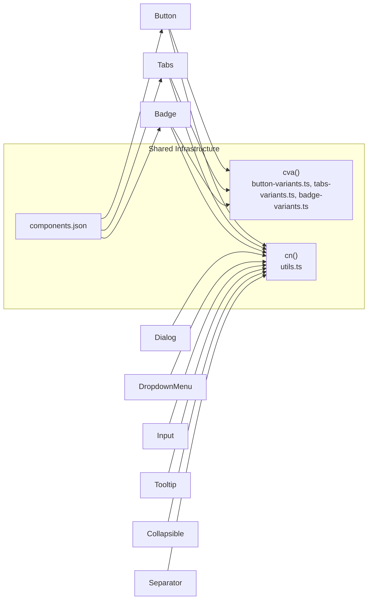

**Diagram sources**
- [button-variants.ts:1-36](file://frontend/src/components/ui/button-variants.ts#L1-L36)
- [tabs-variants.ts:1-17](file://frontend/src/components/ui/tabs-variants.ts#L1-L17)
- [badge-variants.ts:1-24](file://frontend/src/components/ui/badge-variants.ts#L1-L24)
- [utils.ts:1-7](file://frontend/src/lib/utils.ts#L1-L7)
- [components.json:1-21](file://frontend/components.json#L1-L21)

## Detailed Component Analysis

### Button
- Purpose: Standard action element with consistent spacing, color, and focus behavior.
- Variants and sizes: Defined in button-variants.ts; exported via button.tsx.
- Interactive states: Hover, active, focus-visible, disabled, and aria-invalid for validation.
- Composition pattern: Uses Slot.Root when asChild is true; otherwise renders a button element.

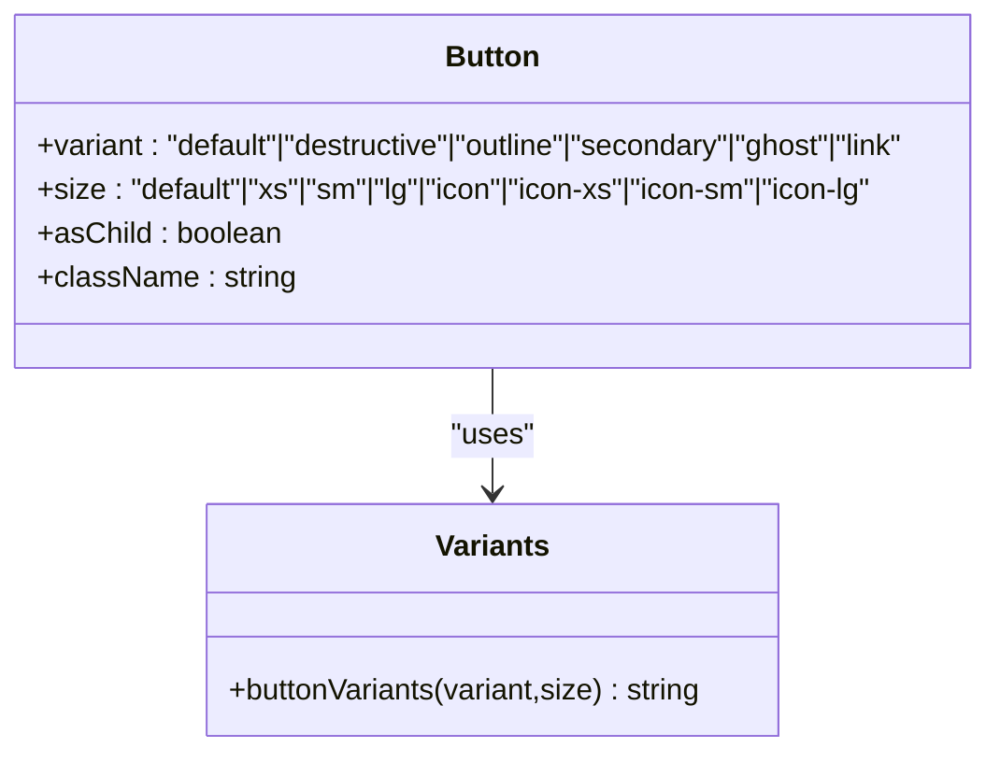

**Diagram sources**
- [button.tsx:1-32](file://frontend/src/components/ui/button.tsx#L1-L32)
- [button-variants.ts:1-36](file://frontend/src/components/ui/button-variants.ts#L1-L36)

**Section sources**
- [button.tsx:1-32](file://frontend/src/components/ui/button.tsx#L1-L32)
- [button-variants.ts:1-36](file://frontend/src/components/ui/button-variants.ts#L1-L36)

### Dialog
- Purpose: Modal overlay system for alerts, confirmations, and forms.
- Structure: Root, Trigger, Portal, Overlay, Content, Header/Footer, Title/Description, Close.
- Behavior: Centered content with animations; optional close button; footer layout adapts to orientation.
- Accessibility: Focus management and keyboard handling via Radix UI.

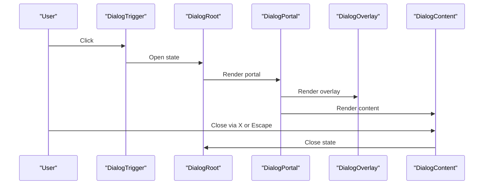

**Diagram sources**
- [dialog.tsx:1-159](file://frontend/src/components/ui/dialog.tsx#L1-L159)

**Section sources**
- [dialog.tsx:1-159](file://frontend/src/components/ui/dialog.tsx#L1-L159)

### Dropdown Menu
- Purpose: Contextual actions and navigation with support for submenus.
- Structure: Root, Trigger, Portal, Content, Group, Label, Item, Checkbox/Radio items, Separator, Shortcut, Sub/SubTrigger/SubContent.
- Behavior: Side-aware slide-in/out animations; keyboard navigation; disabled states; destructive item styling.

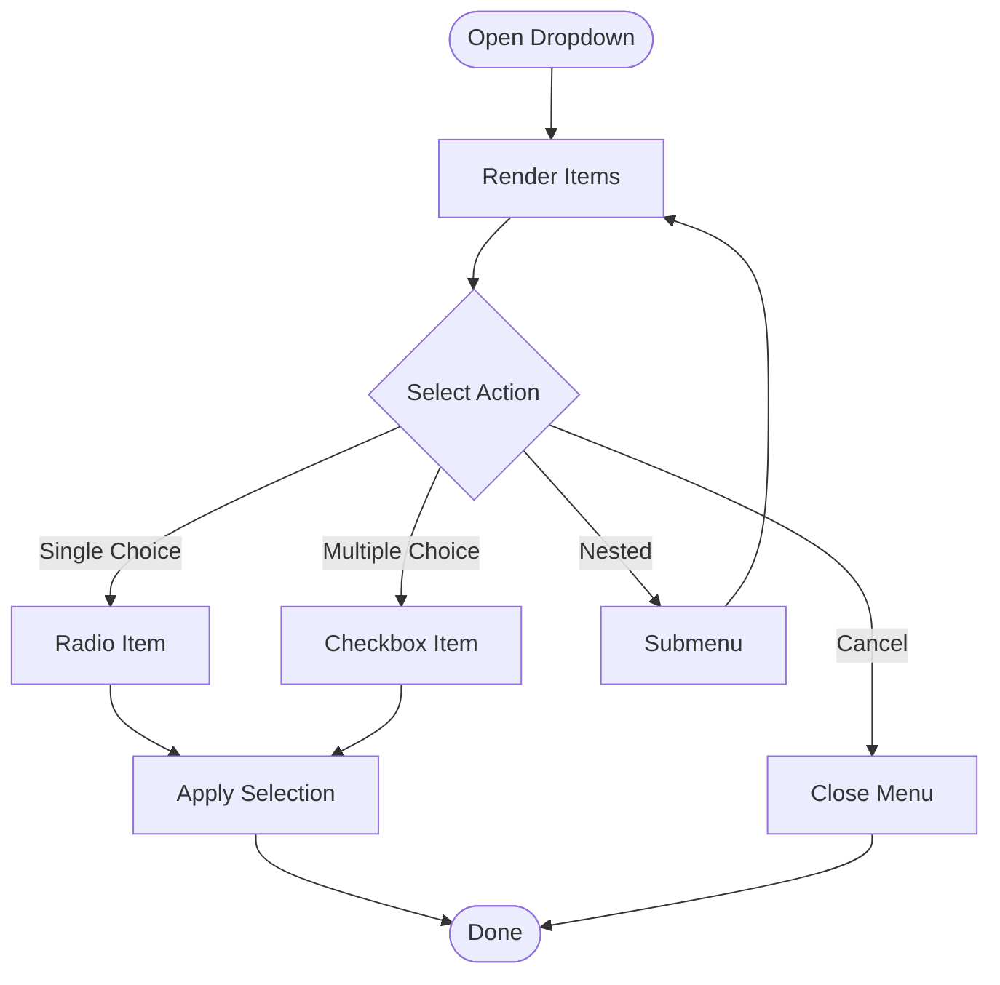

**Diagram sources**
- [dropdown-menu.tsx:1-258](file://frontend/src/components/ui/dropdown-menu.tsx#L1-L258)

**Section sources**
- [dropdown-menu.tsx:1-258](file://frontend/src/components/ui/dropdown-menu.tsx#L1-L258)

### Input
- Purpose: Text field with consistent padding, border, and focus behavior.
- Validation integration: aria-invalid toggles error borders and rings.
- States: focus-visible, disabled, selection highlighting.

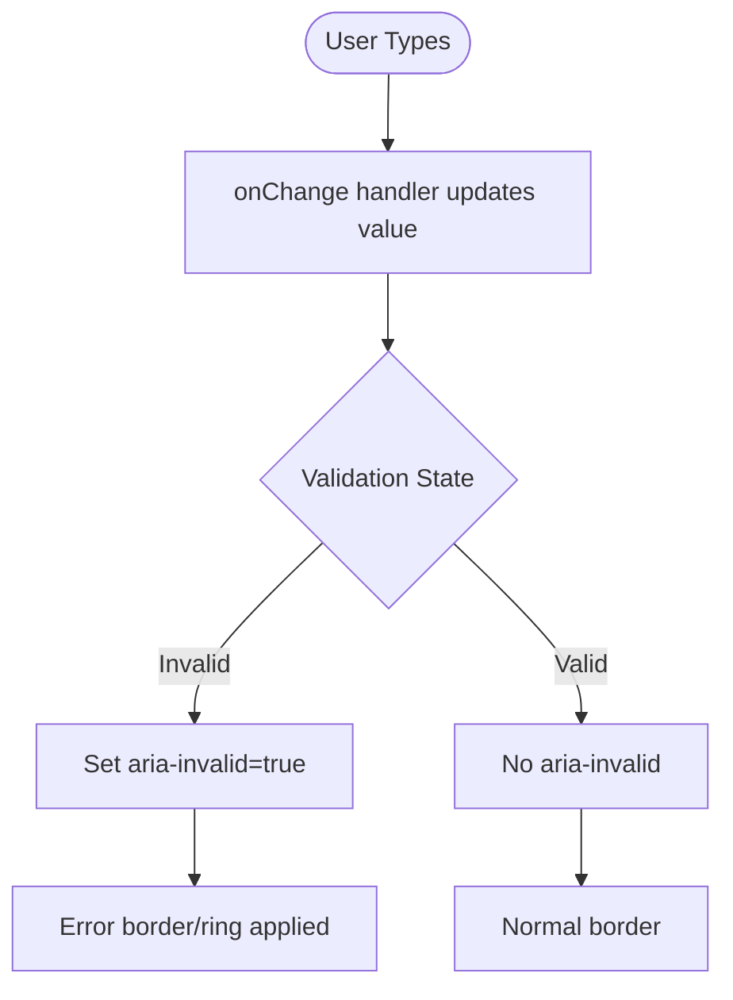

**Diagram sources**
- [input.tsx:1-22](file://frontend/src/components/ui/input.tsx#L1-L22)

**Section sources**
- [input.tsx:1-22](file://frontend/src/components/ui/input.tsx#L1-L22)

### Tabs
- Purpose: Organize related content into selectable sections.
- Variants: List default/line; triggers highlight active tab with shadow or line indicator.
- Orientation: Horizontal or vertical layout; active state styling differs per variant.

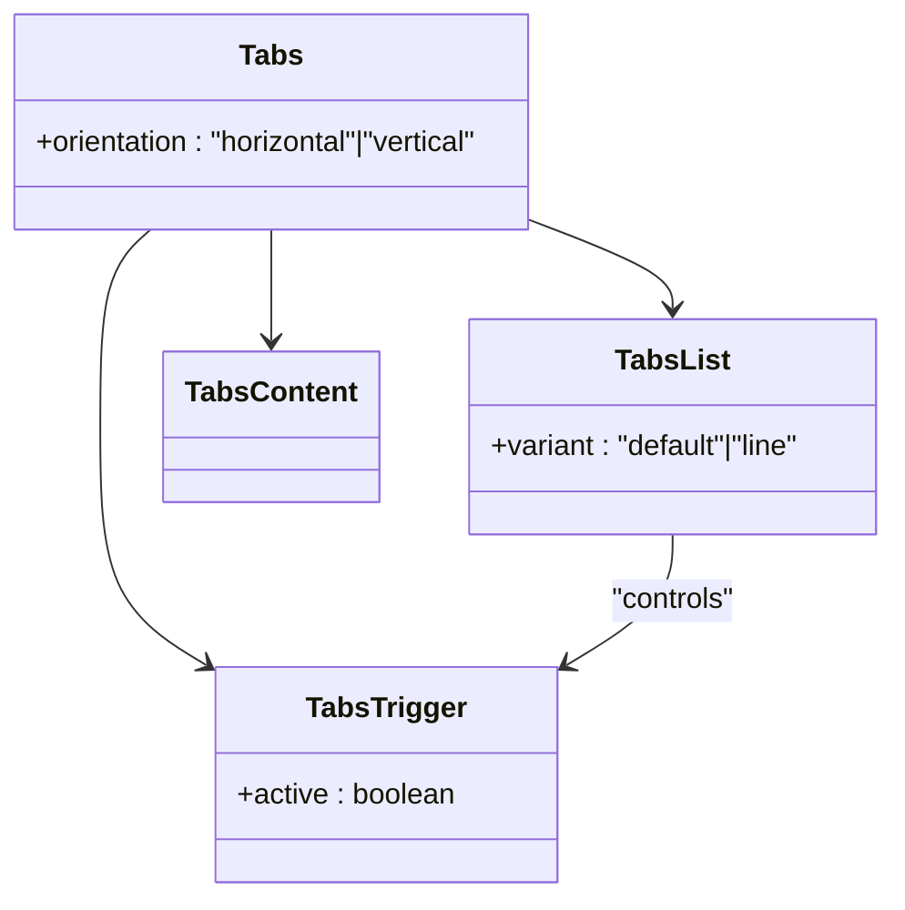

**Diagram sources**
- [tabs.tsx:1-78](file://frontend/src/components/ui/tabs.tsx#L1-L78)
- [tabs-variants.ts:1-17](file://frontend/src/components/ui/tabs-variants.ts#L1-L17)

**Section sources**
- [tabs.tsx:1-78](file://frontend/src/components/ui/tabs.tsx#L1-L78)
- [tabs-variants.ts:1-17](file://frontend/src/components/ui/tabs-variants.ts#L1-L17)

### Badge
- Purpose: Short status or metadata labels with rounded design.
- Variants: default, secondary, destructive, outline, ghost, link; includes focus-visible ring and hover states for links.

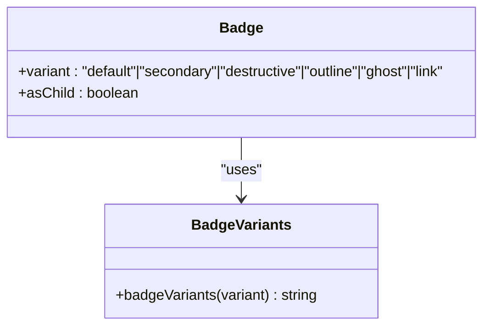

**Diagram sources**
- [badge.tsx:1-28](file://frontend/src/components/ui/badge.tsx#L1-L28)
- [badge-variants.ts:1-24](file://frontend/src/components/ui/badge-variants.ts#L1-L24)

**Section sources**
- [badge.tsx:1-28](file://frontend/src/components/ui/badge.tsx#L1-L28)
- [badge-variants.ts:1-24](file://frontend/src/components/ui/badge-variants.ts#L1-L24)

### Tooltip
- Purpose: Provide contextual help on hover or focus.
- Structure: Provider, Root, Trigger, Content, Arrow.
- Behavior: Delay configuration via Provider; animated entrance/exit; arrow placement.

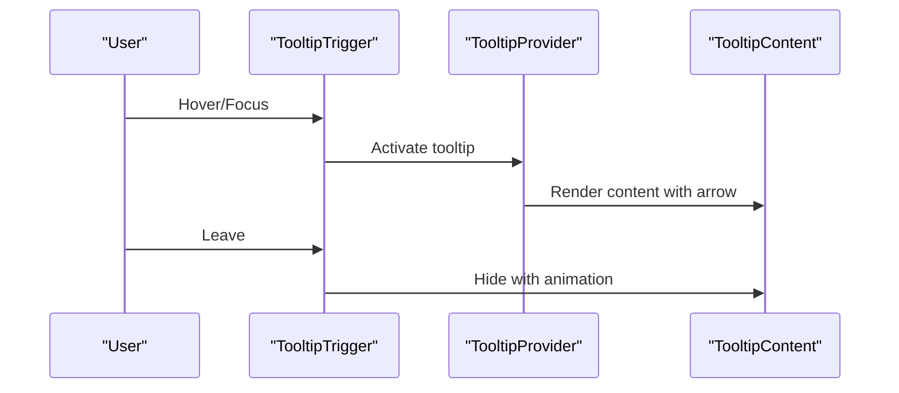

**Diagram sources**
- [tooltip.tsx:1-56](file://frontend/src/components/ui/tooltip.tsx#L1-L56)

**Section sources**
- [tooltip.tsx:1-56](file://frontend/src/components/ui/tooltip.tsx#L1-L56)

### Collapsible
- Purpose: Expandable/collapsible content region controlled by a trigger.
- Structure: Root, Trigger, Content.

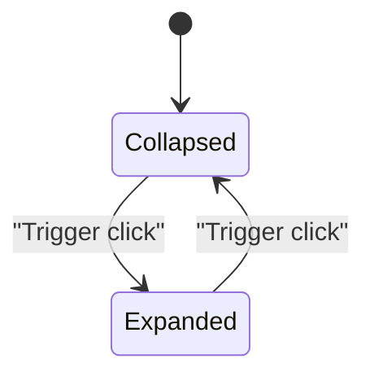

**Diagram sources**
- [collapsible.tsx:1-32](file://frontend/src/components/ui/collapsible.tsx#L1-L32)

**Section sources**
- [collapsible.tsx:1-32](file://frontend/src/components/ui/collapsible.tsx#L1-L32)

### Separator
- Purpose: Visually separate groups of content.
- Orientation: horizontal or vertical; decorative flag for semantics.

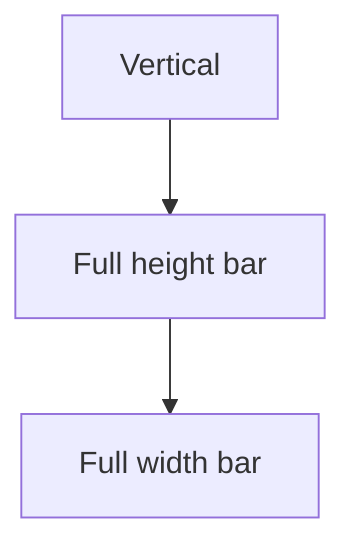

**Diagram sources**
- [separator.tsx:1-27](file://frontend/src/components/ui/separator.tsx#L1-L27)

**Section sources**
- [separator.tsx:1-27](file://frontend/src/components/ui/separator.tsx#L1-L27)

## Dependency Analysis
- Shared utilities: All components depend on cn() from utils.ts for class composition.
- Styling system: Variants are defined via cva() and consumed by components to maintain consistency.
- Configuration: components.json defines aliases and styling conventions for shadcn/ui compatibility.

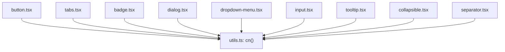

**Diagram sources**
- [utils.ts:1-7](file://frontend/src/lib/utils.ts#L1-L7)
- [button.tsx:1-32](file://frontend/src/components/ui/button.tsx#L1-L32)
- [tabs.tsx:1-78](file://frontend/src/components/ui/tabs.tsx#L1-L78)
- [badge.tsx:1-28](file://frontend/src/components/ui/badge.tsx#L1-L28)
- [dialog.tsx:1-159](file://frontend/src/components/ui/dialog.tsx#L1-L159)
- [dropdown-menu.tsx:1-258](file://frontend/src/components/ui/dropdown-menu.tsx#L1-L258)
- [input.tsx:1-22](file://frontend/src/components/ui/input.tsx#L1-L22)
- [tooltip.tsx:1-56](file://frontend/src/components/ui/tooltip.tsx#L1-L56)
- [collapsible.tsx:1-32](file://frontend/src/components/ui/collapsible.tsx#L1-L32)
- [separator.tsx:1-27](file://frontend/src/components/ui/separator.tsx#L1-L27)

**Section sources**
- [utils.ts:1-7](file://frontend/src/lib/utils.ts#L1-L7)
- [components.json:1-21](file://frontend/components.json#L1-L21)

## Performance Considerations
- Prefer variant props over ad-hoc class overrides to keep the style surface small.
- Use asChild patterns (where supported) to avoid unnecessary DOM nodes.
- Keep portal usage minimal to reduce reflows; Dialog and Dropdown Menu already encapsulate portals internally.
- Avoid frequent re-renders by memoizing derived values and passing stable callbacks to primitives.

## Troubleshooting Guide
- Dialog does not close on Escape or overlay click
  - Ensure the Dialog root is rendered and not conditionally omitted.
  - Verify that the Trigger and Close elements are properly wired.

- Dropdown menu items do not reflect selection
  - For radio items, bind the group to a controlled value.
  - For checkbox items, ensure checked prop is synchronized.

- Input validation not visible
  - Set aria-invalid on the input element when validation fails.
  - Confirm that the global CSS variables for destructive colors are present.

- Tooltip not appearing
  - Wrap content in TooltipProvider with appropriate delayDuration.
  - Ensure TooltipTrigger wraps the element intended to show the tooltip.

- Tabs active state not highlighted
  - Ensure TabsTrigger is placed inside TabsList with matching variant.
  - Verify orientation is set consistently across Tabs, TabsList, and TabsTrigger.

**Section sources**
- [dialog.tsx:1-159](file://frontend/src/components/ui/dialog.tsx#L1-L159)
- [dropdown-menu.tsx:1-258](file://frontend/src/components/ui/dropdown-menu.tsx#L1-L258)
- [input.tsx:1-22](file://frontend/src/components/ui/input.tsx#L1-L22)
- [tooltip.tsx:1-56](file://frontend/src/components/ui/tooltip.tsx#L1-L56)
- [tabs.tsx:1-78](file://frontend/src/components/ui/tabs.tsx#L1-L78)

## Conclusion
C0WRK’s UI primitives provide a robust, accessible foundation for building consistent interfaces. By leveraging shadcn/ui conventions, cva-based variants, and Radix UI behaviors, these components offer predictable styling, strong keyboard support, and easy customization. Integrate them thoughtfully using the shared utilities and configuration to maintain a cohesive design system across the application.