# Utility and Specialized Components

<cite>
**Referenced Files in This Document**
- [CodebaseMemoryBanner.tsx](file://frontend/src/components/CodebaseMemoryBanner.tsx)
- [ErrorBoundary.tsx](file://frontend/src/components/ErrorBoundary.tsx)
- [ResizeHandle.tsx](file://frontend/src/components/ResizeHandle.tsx)
- [RtkBanner.tsx](file://frontend/src/components/RtkBanner.tsx)
- [ActionPlaceholder.tsx](file://frontend/src/components/chat/ActionPlaceholder.tsx)
- [ActivityIndicator.tsx](file://frontend/src/components/chat/ActivityIndicator.tsx)
- [AskUserPanel.tsx](file://frontend/src/components/chat/AskUserPanel.tsx)
- [MermaidBlock.tsx](file://frontend/src/components/chat/MermaidBlock.tsx)
- [ToolConfirmation.tsx](file://frontend/src/components/chat/ToolConfirmation.tsx)
- [ChatScrollManager.tsx](file://frontend/src/components/chat/ChatScrollManager.tsx)
- [ContextBadge.tsx](file://frontend/src/components/chat/ContextBadge.tsx)
- [StepTooltip.tsx](file://frontend/src/components/chat/StepTooltip.tsx)
- [useResize.tsx](file://frontend/src/hooks/useResize.tsx)
- [chatStore.ts](file://frontend/src/stores/chatStore.ts)
- [scrollStore.ts](file://frontend/src/stores/scrollStore.ts)
- [formatters.ts](file://frontend/src/lib/formatters.ts)
- [ChatNewActivityBanner.tsx](file://frontend/src/components/chat/ChatNewActivityBanner.tsx)
</cite>

## Table of Contents
1. [Introduction](#introduction)
2. [Project Structure](#project-structure)
3. [Core Components](#core-components)
4. [Architecture Overview](#architecture-overview)
5. [Detailed Component Analysis](#detailed-component-analysis)
6. [Dependency Analysis](#dependency-analysis)
7. [Performance Considerations](#performance-considerations)
8. [Troubleshooting Guide](#troubleshooting-guide)
9. [Conclusion](#conclusion)

## Introduction
This document provides comprehensive documentation for C0WRK’s utility and specialized components focused on user experience, runtime kernel and memory status, error handling, resizable UI panels, chat interactions, and execution assistance. It covers:
- CodebaseMemoryBanner and RtkBanner for runtime kernel and memory status notifications
- ErrorBoundary for graceful error handling
- ResizeHandle and useResize hook for draggable resizing
- Chat namespace components: ActionPlaceholder, ActivityIndicator, AskUserPanel, MermaidBlock, ToolConfirmation, ChatScrollManager, ContextBadge, and StepTooltip
- Usage patterns, customization options, and integration examples

## Project Structure
These components are organized under the frontend application:
- Utility banners and resize helpers live under frontend/src/components
- Chat-specific components live under frontend/src/components/chat
- Stores and utilities live under frontend/src/stores and frontend/src/lib respectively

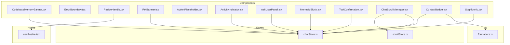

**Diagram sources**
- [CodebaseMemoryBanner.tsx:1-101](file://frontend/src/components/CodebaseMemoryBanner.tsx#L1-L101)
- [ErrorBoundary.tsx:1-48](file://frontend/src/components/ErrorBoundary.tsx#L1-L48)
- [ResizeHandle.tsx:1-30](file://frontend/src/components/ResizeHandle.tsx#L1-L30)
- [RtkBanner.tsx:1-102](file://frontend/src/components/RtkBanner.tsx#L1-L102)
- [ActionPlaceholder.tsx:1-15](file://frontend/src/components/chat/ActionPlaceholder.tsx#L1-L15)
- [ActivityIndicator.tsx:1-20](file://frontend/src/components/chat/ActivityIndicator.tsx#L1-L20)
- [AskUserPanel.tsx:1-215](file://frontend/src/components/chat/AskUserPanel.tsx#L1-L215)
- [MermaidBlock.tsx:1-68](file://frontend/src/components/chat/MermaidBlock.tsx#L1-L68)
- [ToolConfirmation.tsx:1-250](file://frontend/src/components/chat/ToolConfirmation.tsx#L1-L250)
- [ChatScrollManager.tsx:1-119](file://frontend/src/components/chat/ChatScrollManager.tsx#L1-L119)
- [ContextBadge.tsx:1-86](file://frontend/src/components/chat/ContextBadge.tsx#L1-L86)
- [StepTooltip.tsx:1-35](file://frontend/src/components/chat/StepTooltip.tsx#L1-L35)
- [useResize.tsx:1-89](file://frontend/src/hooks/useResize.tsx#L1-L89)
- [chatStore.ts:1-571](file://frontend/src/stores/chatStore.ts#L1-L571)
- [scrollStore.ts:1-12](file://frontend/src/stores/scrollStore.ts#L1-L12)
- [formatters.ts:1-17](file://frontend/src/lib/formatters.ts#L1-L17)

**Section sources**
- [CodebaseMemoryBanner.tsx:1-101](file://frontend/src/components/CodebaseMemoryBanner.tsx#L1-L101)
- [RtkBanner.tsx:1-102](file://frontend/src/components/RtkBanner.tsx#L1-L102)
- [ErrorBoundary.tsx:1-48](file://frontend/src/components/ErrorBoundary.tsx#L1-L48)
- [ResizeHandle.tsx:1-30](file://frontend/src/components/ResizeHandle.tsx#L1-L30)
- [useResize.tsx:1-89](file://frontend/src/hooks/useResize.tsx#L1-L89)
- [ActionPlaceholder.tsx:1-15](file://frontend/src/components/chat/ActionPlaceholder.tsx#L1-L15)
- [ActivityIndicator.tsx:1-20](file://frontend/src/components/chat/ActivityIndicator.tsx#L1-L20)
- [AskUserPanel.tsx:1-215](file://frontend/src/components/chat/AskUserPanel.tsx#L1-L215)
- [MermaidBlock.tsx:1-68](file://frontend/src/components/chat/MermaidBlock.tsx#L1-L68)
- [ToolConfirmation.tsx:1-250](file://frontend/src/components/chat/ToolConfirmation.tsx#L1-L250)
- [ChatScrollManager.tsx:1-119](file://frontend/src/components/chat/ChatScrollManager.tsx#L1-L119)
- [ContextBadge.tsx:1-86](file://frontend/src/components/chat/ContextBadge.tsx#L1-L86)
- [StepTooltip.tsx:1-35](file://frontend/src/components/chat/StepTooltip.tsx#L1-L35)
- [chatStore.ts:1-571](file://frontend/src/stores/chatStore.ts#L1-L571)
- [scrollStore.ts:1-12](file://frontend/src/stores/scrollStore.ts#L1-L12)
- [formatters.ts:1-17](file://frontend/src/lib/formatters.ts#L1-L17)

## Core Components
This section summarizes the primary categories and their responsibilities.

- CodebaseMemoryBanner: Displays a banner prompting installation of the Codebase Memory MCP extension when not detected, with dismiss and settings actions.
- RtkBanner: Displays a banner prompting installation of RTK for optimized command output and token savings.
- ErrorBoundary: A React error boundary component that gracefully handles JavaScript errors in child components and renders a user-friendly fallback.
- ResizeHandle: A lightweight UI handle for horizontal resizing with keyboard accessibility and mouse drag support.
- useResize: A reusable hook implementing drag-to-resize behavior with configurable min/max widths and side orientation.
- Chat namespace components:
  - ActionPlaceholder: Renders an empty-state placeholder for pending actions.
  - ActivityIndicator: Shows a pulsing activity indicator synchronized with the chat store.
  - AskUserPanel: Presents interactive questions with options and free-form answers, emitting responses via Wails events.
  - MermaidBlock: Renders Mermaid diagrams from code with lazy-loading and error handling.
  - ToolConfirmation: Requests user confirmation for tool actions, optionally consulting an AI judge with timeout and error handling.
  - ChatScrollManager: Manages auto-scrolling behavior and “new activity” indicators in chat views.
  - ContextBadge: Displays session model, family, and token usage with tooltips.
  - StepTooltip: Provides unified, viewport-aware tooltips for step descriptions.

**Section sources**
- [CodebaseMemoryBanner.tsx:23-101](file://frontend/src/components/CodebaseMemoryBanner.tsx#L23-L101)
- [RtkBanner.tsx:24-102](file://frontend/src/components/RtkBanner.tsx#L24-L102)
- [ErrorBoundary.tsx:13-48](file://frontend/src/components/ErrorBoundary.tsx#L13-L48)
- [ResizeHandle.tsx:8-30](file://frontend/src/components/ResizeHandle.tsx#L8-L30)
- [useResize.tsx:7-89](file://frontend/src/hooks/useResize.tsx#L7-L89)
- [ActionPlaceholder.tsx:7-15](file://frontend/src/components/chat/ActionPlaceholder.tsx#L7-L15)
- [ActivityIndicator.tsx:3-20](file://frontend/src/components/chat/ActivityIndicator.tsx#L3-L20)
- [AskUserPanel.tsx:24-215](file://frontend/src/components/chat/AskUserPanel.tsx#L24-L215)
- [MermaidBlock.tsx:7-68](file://frontend/src/components/chat/MermaidBlock.tsx#L7-L68)
- [ToolConfirmation.tsx:35-250](file://frontend/src/components/chat/ToolConfirmation.tsx#L35-L250)
- [ChatScrollManager.tsx:13-119](file://frontend/src/components/chat/ChatScrollManager.tsx#L13-L119)
- [ContextBadge.tsx:22-86](file://frontend/src/components/chat/ContextBadge.tsx#L22-L86)
- [StepTooltip.tsx:14-35](file://frontend/src/components/chat/StepTooltip.tsx#L14-L35)

## Architecture Overview
The components integrate with React state via Zustand stores and communicate with the backend through Wails events. The chat store centralizes message grouping, pending actions, and UI state. Scroll management coordinates with a dedicated scroll store for step navigation.

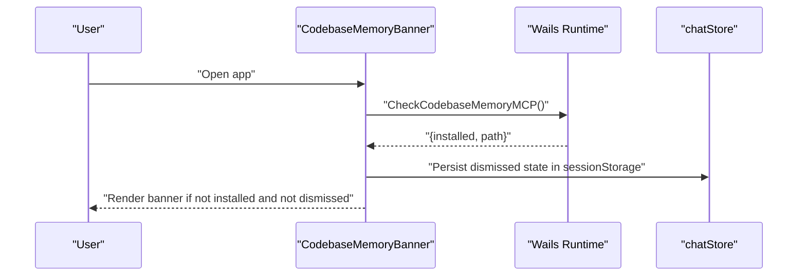

**Diagram sources**
- [CodebaseMemoryBanner.tsx:32-57](file://frontend/src/components/CodebaseMemoryBanner.tsx#L32-L57)
- [chatStore.ts:468-571](file://frontend/src/stores/chatStore.ts#L468-L571)

**Section sources**
- [CodebaseMemoryBanner.tsx:32-57](file://frontend/src/components/CodebaseMemoryBanner.tsx#L32-L57)
- [chatStore.ts:468-571](file://frontend/src/stores/chatStore.ts#L468-L571)

## Detailed Component Analysis

### CodebaseMemoryBanner
- Purpose: Prompts users to install the Codebase Memory MCP extension when missing, with dismiss and settings actions.
- Key behaviors:
  - Checks backend status on mount and listens for runtime events.
  - Uses sessionStorage to persist dismissal across sessions.
  - Opens settings to the MCP section when requested.
- Customization:
  - Adjust banner text and links by modifying the JSX content.
  - Change dismissal persistence key if needed.
- Integration:
  - Place near the top of the app layout to ensure visibility.
  - Ensure Wails runtime is initialized before mounting.

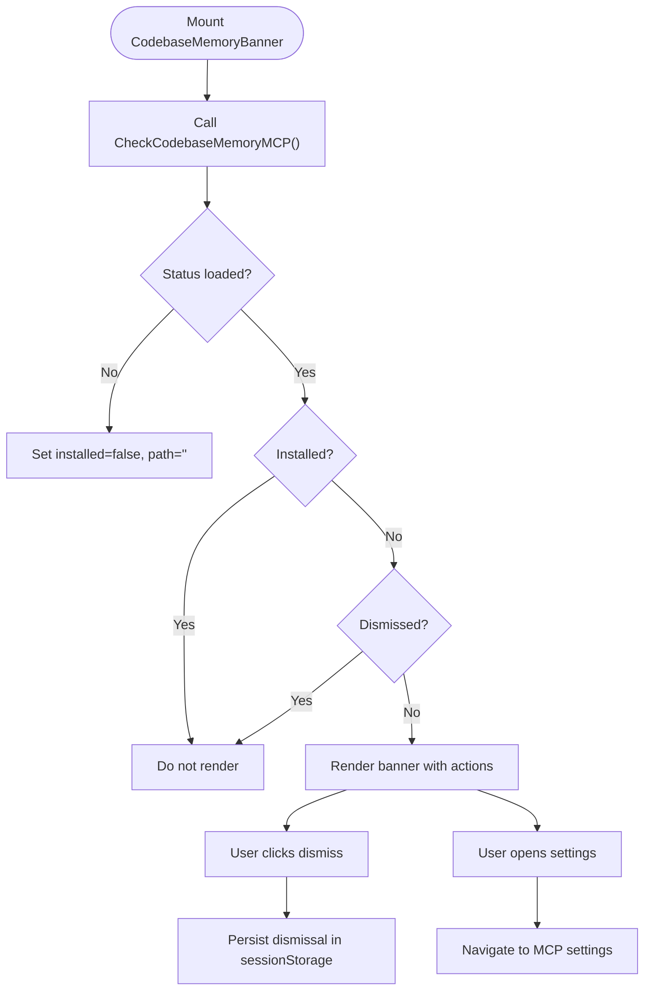

**Diagram sources**
- [CodebaseMemoryBanner.tsx:32-67](file://frontend/src/components/CodebaseMemoryBanner.tsx#L32-L67)

**Section sources**
- [CodebaseMemoryBanner.tsx:23-101](file://frontend/src/components/CodebaseMemoryBanner.tsx#L23-L101)

### RtkBanner
- Purpose: Prompts users to install RTK for optimized command output and token savings.
- Key behaviors:
  - Similar lifecycle to CodebaseMemoryBanner with event listening and dismissal persistence.
  - Displays contextual benefits and navigation to MCP settings.
- Customization:
  - Modify messaging and benefit statements to reflect current optimizations.
- Integration:
  - Place alongside CodebaseMemoryBanner for consistent UX.

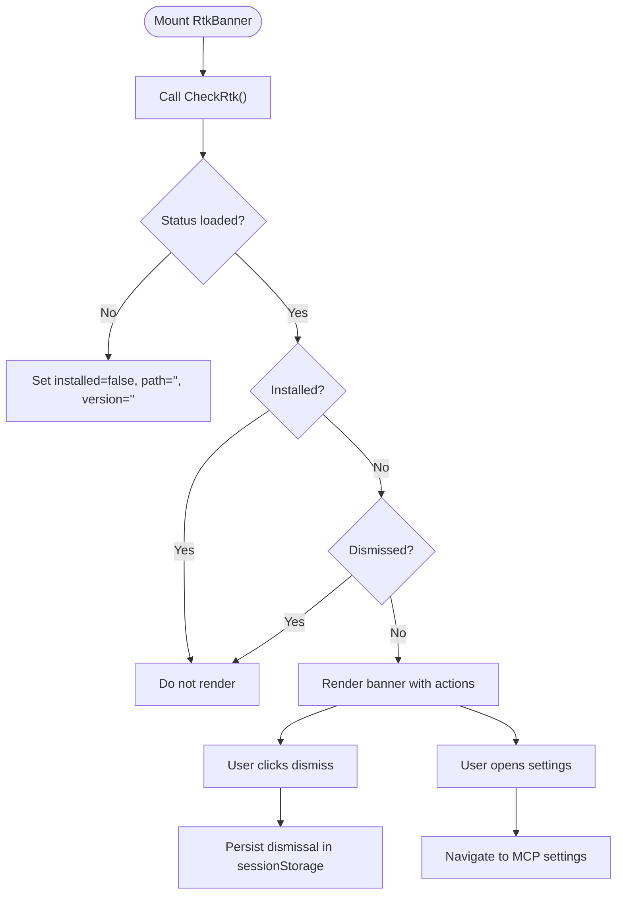

**Diagram sources**
- [RtkBanner.tsx:33-67](file://frontend/src/components/RtkBanner.tsx#L33-L67)

**Section sources**
- [RtkBanner.tsx:24-102](file://frontend/src/components/RtkBanner.tsx#L24-L102)

### ErrorBoundary
- Purpose: Gracefully handle JavaScript errors in child components and present a friendly fallback.
- Key behaviors:
  - Static getDerivedStateFromError captures errors.
  - Logs error and stack to console.
  - Renders a monospace error page or a custom fallback if provided.
- Customization:
  - Provide a custom fallback component via the fallback prop for branded error pages.
- Integration:
  - Wrap top-level routes or critical sections to prevent app crashes.

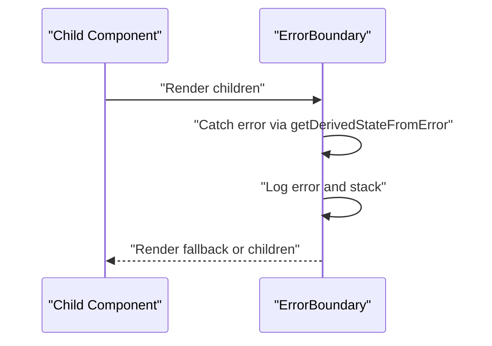

**Diagram sources**
- [ErrorBoundary.tsx:19-46](file://frontend/src/components/ErrorBoundary.tsx#L19-L46)

**Section sources**
- [ErrorBoundary.tsx:13-48](file://frontend/src/components/ErrorBoundary.tsx#L13-L48)

### ResizeHandle and useResize
- ResizeHandle:
  - Minimal component exposing mouse and keyboard interactions for horizontal resizing.
  - Keyboard support: Arrow keys adjust width; Shift increases step size.
- useResize:
  - Hook implementing drag-to-resize with configurable min/max width and side orientation.
  - Ensures cleanup of event listeners and cursor styles.
- Customization:
  - Adjust step sizes and thresholds in the hook.
  - Modify handle visuals via className.
- Integration:
  - Pair ResizeHandle with useResize to implement resizable panels with smooth UX.

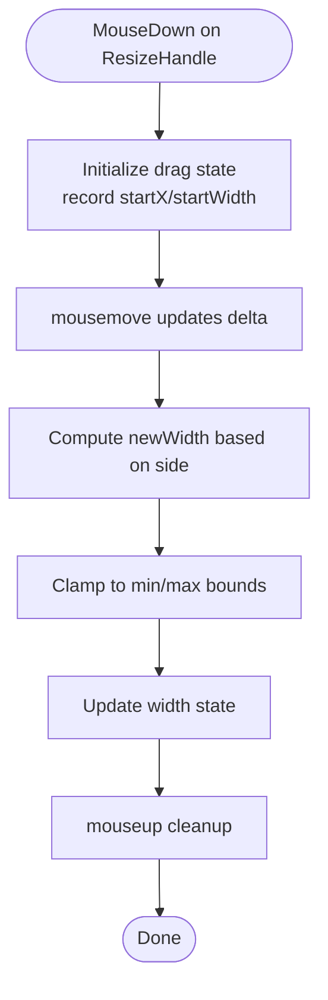

**Diagram sources**
- [ResizeHandle.tsx:17-27](file://frontend/src/components/ResizeHandle.tsx#L17-L27)
- [useResize.tsx:39-85](file://frontend/src/hooks/useResize.tsx#L39-L85)

**Section sources**
- [ResizeHandle.tsx:8-30](file://frontend/src/components/ResizeHandle.tsx#L8-L30)
- [useResize.tsx:7-89](file://frontend/src/hooks/useResize.tsx#L7-L89)

### Chat Namespace Components

#### ActionPlaceholder
- Purpose: Empty-state placeholder indicating pending actions.
- Usage: Rendered by chatStore grouping logic when actions are awaiting resolution.
- Customization: Adjust label text and icon via props.

**Section sources**
- [ActionPlaceholder.tsx:7-15](file://frontend/src/components/chat/ActionPlaceholder.tsx#L7-L15)
- [chatStore.ts:311-324](file://frontend/src/stores/chatStore.ts#L311-L324)

#### ActivityIndicator
- Purpose: Visual pulse indicator for ongoing activity synchronized with chat store.
- Integration: Reads activityStatus from chatStore and renders a pulsing status line.

**Section sources**
- [ActivityIndicator.tsx:3-20](file://frontend/src/components/chat/ActivityIndicator.tsx#L3-L20)
- [chatStore.ts:449-462](file://frontend/src/stores/chatStore.ts#L449-L462)

#### AskUserPanel
- Purpose: Interactive panel to collect user input for tool/toolchain decisions.
- Features:
  - Supports single/multi-select options and custom text inputs.
  - Emits structured responses via Wails events.
  - Resolves itself after submission and clears pending actions.
- Customization:
  - Add/remove questions and options in metadata.
  - Style via Tailwind classes applied to internal elements.

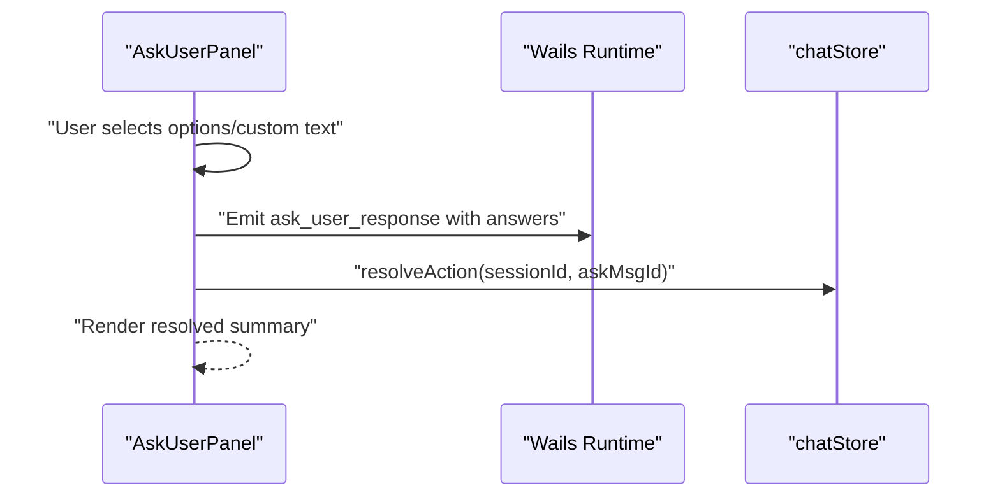

**Diagram sources**
- [AskUserPanel.tsx:68-108](file://frontend/src/components/chat/AskUserPanel.tsx#L68-L108)
- [chatStore.ts:527-539](file://frontend/src/stores/chatStore.ts#L527-L539)

**Section sources**
- [AskUserPanel.tsx:24-215](file://frontend/src/components/chat/AskUserPanel.tsx#L24-L215)
- [chatStore.ts:414-431](file://frontend/src/stores/chatStore.ts#L414-L431)

#### MermaidBlock
- Purpose: Renders Mermaid diagrams from code with lazy-loading and error handling.
- Behavior:
  - Initializes Mermaid with dark theme and renders SVG into a container.
  - Displays a fallback error message on render failures.
- Customization:
  - Adjust theme or initialization options in the effect.
  - Modify error UI via the fallback component.

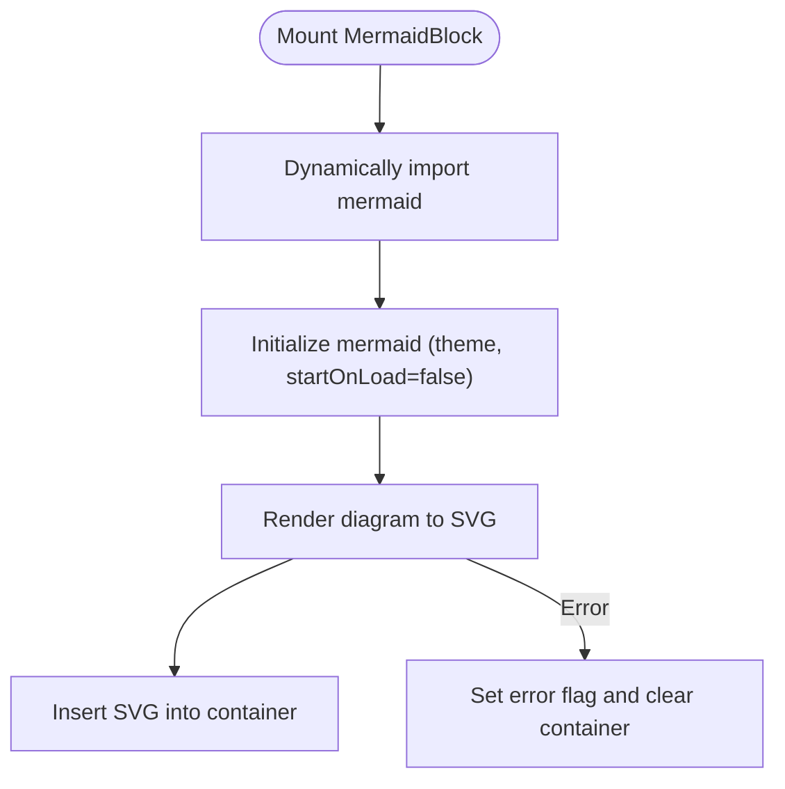

**Diagram sources**
- [MermaidBlock.tsx:12-51](file://frontend/src/components/chat/MermaidBlock.tsx#L12-L51)

**Section sources**
- [MermaidBlock.tsx:7-68](file://frontend/src/components/chat/MermaidBlock.tsx#L7-L68)

#### ToolConfirmation
- Purpose: Requests user confirmation for tool actions, optionally consulting an AI judge.
- Features:
  - Decision buttons: Allow Once, Ask Agent, Deny.
  - Judge integration with timeout and error handling.
  - Updates linked tool messages to remove awaiting_confirmation.
  - Resolves pending actions and updates activity status.
- Customization:
  - Extend metadata fields or add additional safety checks.
  - Customize button labels and styles.

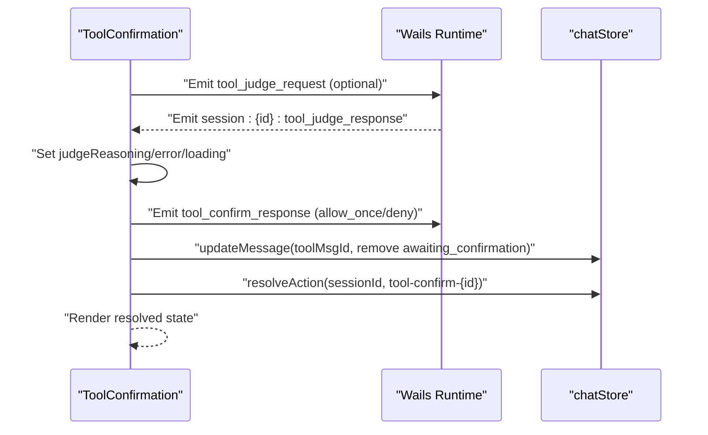

**Diagram sources**
- [ToolConfirmation.tsx:47-78](file://frontend/src/components/chat/ToolConfirmation.tsx#L47-L78)
- [ToolConfirmation.tsx:83-112](file://frontend/src/components/chat/ToolConfirmation.tsx#L83-L112)
- [chatStore.ts:527-539](file://frontend/src/stores/chatStore.ts#L527-L539)

**Section sources**
- [ToolConfirmation.tsx:35-250](file://frontend/src/components/chat/ToolConfirmation.tsx#L35-L250)
- [chatStore.ts:303-313](file://frontend/src/stores/chatStore.ts#L303-L313)

#### ChatScrollManager
- Purpose: Manages auto-scrolling behavior and “new activity” indicators in chat views.
- Features:
  - Determines whether the user was at bottom before new content arrived.
  - Scrolls to bottom automatically when appropriate; otherwise shows a “new activity” banner.
  - Registers a scroll-to-step callback for step navigation.
- Integration:
  - Wrap chat content with a ref and pass streaming text and messages.
  - Combine with ChatNewActivityBanner for a cohesive UX.

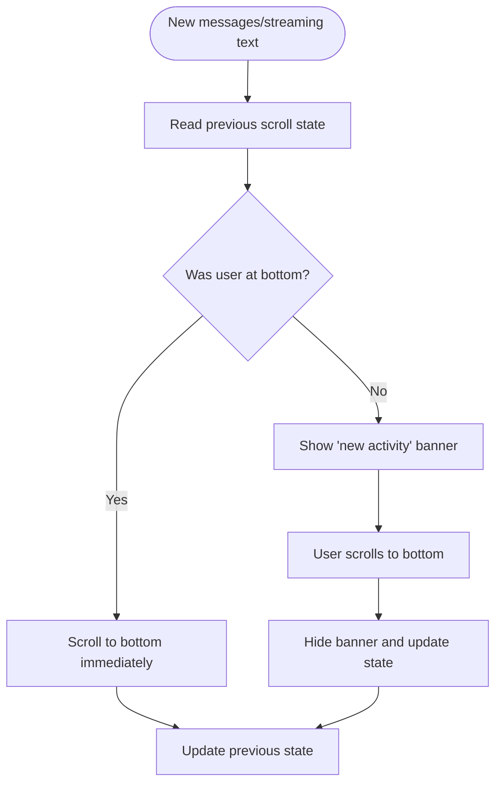

**Diagram sources**
- [ChatScrollManager.tsx:62-89](file://frontend/src/components/chat/ChatScrollManager.tsx#L62-L89)
- [ChatScrollManager.tsx:91-105](file://frontend/src/components/chat/ChatScrollManager.tsx#L91-L105)
- [ChatNewActivityBanner.tsx:10-35](file://frontend/src/components/chat/ChatNewActivityBanner.tsx#L10-L35)

**Section sources**
- [ChatScrollManager.tsx:13-119](file://frontend/src/components/chat/ChatScrollManager.tsx#L13-L119)
- [scrollStore.ts:3-11](file://frontend/src/stores/scrollStore.ts#L3-L11)
- [ChatNewActivityBanner.tsx:10-35](file://frontend/src/components/chat/ChatNewActivityBanner.tsx#L10-L35)

#### ContextBadge
- Purpose: Displays session model, family, and token usage with a tooltip.
- Behavior:
  - Resolves configured model from desktop config.
  - Prefers session-provided model/family/token counts.
  - Formats token counts using formatters.
- Customization:
  - Adjust tooltip content or formatting via formatters.

**Section sources**
- [ContextBadge.tsx:22-86](file://frontend/src/components/chat/ContextBadge.tsx#L22-L86)
- [formatters.ts:11-16](file://frontend/src/lib/formatters.ts#L11-L16)

#### StepTooltip
- Purpose: Unified tooltip component for step descriptions with viewport-aware positioning.
- Features:
  - Conditional enable/disable.
  - Markdown rendering via TooltipMarkdown.
  - Scrollable content with collision handling and custom scrollbar.
- Customization:
  - Control visibility via enabled prop.
  - Adjust alignment and offsets via TooltipContent props.

**Section sources**
- [StepTooltip.tsx:14-35](file://frontend/src/components/chat/StepTooltip.tsx#L14-L35)

## Dependency Analysis
- Component coupling:
  - CodebaseMemoryBanner and RtkBanner depend on Wails runtime and settings store for navigation.
  - AskUserPanel and ToolConfirmation rely on Wails events and chatStore for state updates.
  - ChatScrollManager integrates with scrollStore for step navigation and chatStore for message grouping.
  - ContextBadge depends on chatStore and desktop config via Wails.
- Cohesion:
  - Each component encapsulates a single responsibility, minimizing cross-component coupling.
- External dependencies:
  - MermaidBlock lazily loads mermaid for diagram rendering.
  - ResizeHandle and useResize manage DOM and browser events.

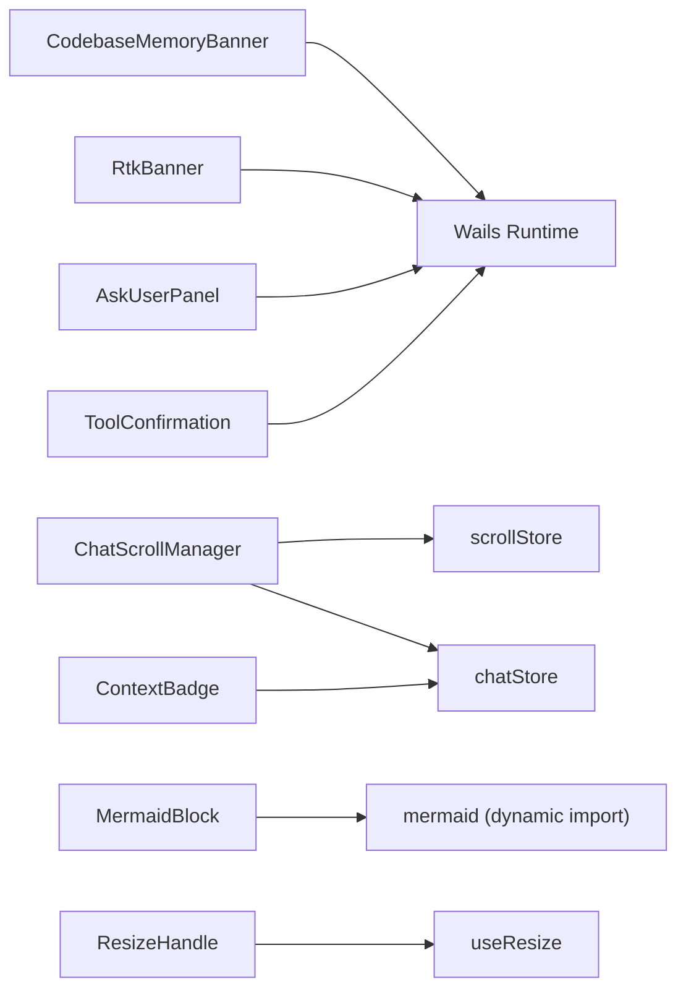

**Diagram sources**
- [CodebaseMemoryBanner.tsx:24-66](file://frontend/src/components/CodebaseMemoryBanner.tsx#L24-L66)
- [RtkBanner.tsx:25-67](file://frontend/src/components/RtkBanner.tsx#L25-L67)
- [AskUserPanel.tsx:25-107](file://frontend/src/components/chat/AskUserPanel.tsx#L25-L107)
- [ToolConfirmation.tsx:36-78](file://frontend/src/components/chat/ToolConfirmation.tsx#L36-L78)
- [ChatScrollManager.tsx:13-105](file://frontend/src/components/chat/ChatScrollManager.tsx#L13-L105)
- [scrollStore.ts:1-12](file://frontend/src/stores/scrollStore.ts#L1-L12)
- [chatStore.ts:1-571](file://frontend/src/stores/chatStore.ts#L1-L571)
- [ContextBadge.tsx:22-40](file://frontend/src/components/chat/ContextBadge.tsx#L22-L40)
- [MermaidBlock.tsx:19-35](file://frontend/src/components/chat/MermaidBlock.tsx#L19-L35)
- [ResizeHandle.tsx:8-27](file://frontend/src/components/ResizeHandle.tsx#L8-L27)
- [useResize.tsx:7-89](file://frontend/src/hooks/useResize.tsx#L7-L89)

**Section sources**
- [chatStore.ts:1-571](file://frontend/src/stores/chatStore.ts#L1-L571)
- [scrollStore.ts:1-12](file://frontend/src/stores/scrollStore.ts#L1-L12)

## Performance Considerations
- Lazy loading:
  - MermaidBlock dynamically imports mermaid to reduce initial bundle size.
- Efficient rendering:
  - ChatScrollManager uses useLayoutEffect to compute and apply scroll positions synchronously, preventing layout thrashing.
- Event handling:
  - useResize cleans up event listeners and restores cursor styles to avoid leaks.
- Token formatting:
  - formatters provide concise string representations to minimize reflows.

[No sources needed since this section provides general guidance]

## Troubleshooting Guide
- CodebaseMemoryBanner and RtkBanner not appearing:
  - Ensure Wails runtime is initialized and Check* functions are callable.
  - Verify backend emits codememory:status and rtk:status events with valid shapes.
- AskUserPanel submit disabled:
  - Confirm at least one option is selected or custom text is provided.
- ToolConfirmation stuck on loading:
  - Check that the judge response event fires and that confirm_id matches.
  - Respect the 30-second timeout and handle judgeError appropriately.
- ChatScrollManager not scrolling:
  - Ensure the scrollRef is attached to a scrollable container and messages/streamingText change triggers the effect.
- ResizeHandle not responding:
  - Verify onMouseDown is wired to useResize and that min/max constraints are reasonable.

**Section sources**
- [CodebaseMemoryBanner.tsx:32-57](file://frontend/src/components/CodebaseMemoryBanner.tsx#L32-L57)
- [RtkBanner.tsx:33-58](file://frontend/src/components/RtkBanner.tsx#L33-L58)
- [AskUserPanel.tsx:120-125](file://frontend/src/components/chat/AskUserPanel.tsx#L120-L125)
- [ToolConfirmation.tsx:83-132](file://frontend/src/components/chat/ToolConfirmation.tsx#L83-L132)
- [ChatScrollManager.tsx:62-89](file://frontend/src/components/chat/ChatScrollManager.tsx#L62-L89)
- [useResize.tsx:39-85](file://frontend/src/hooks/useResize.tsx#L39-L85)

## Conclusion
These utility and specialized components provide a robust foundation for status notifications, error resilience, resizable UI, and rich chat interactions. By leveraging Wails events, Zustand stores, and React patterns, they deliver a responsive and user-friendly experience. Integrate them according to the usage patterns and customization options outlined above to maintain consistency and performance across the application.