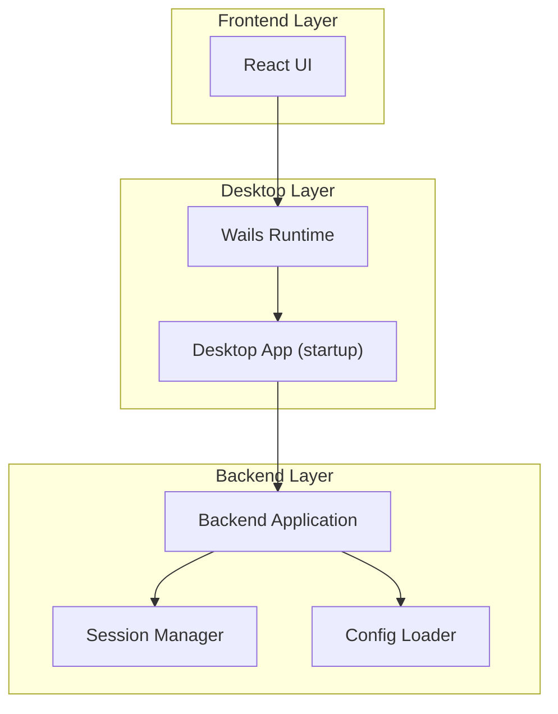
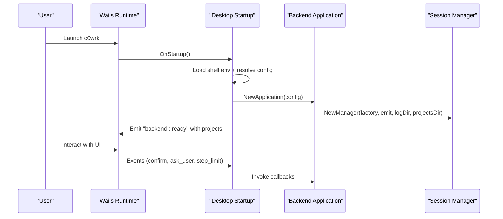

# Getting Started

<cite>
**Referenced Files in This Document**
- [config.example.yaml](file://config.example.yaml)
- [go.mod](file://go.mod)
- [Makefile](file://Makefile)
- [wails.json](file://wails.json)
- [main.go](file://main.go)
- [desktop/app.go](file://desktop/app.go)
- [desktop/startup.go](file://desktop/startup.go)
- [backend/application.go](file://backend/application.go)
- [backend/config/config.go](file://backend/config/config.go)
- [backend/config/defaults.go](file://backend/config/defaults.go)
- [backend/config/resolve.go](file://backend/config/resolve.go)
- [backend/configadapter.go](file://backend/configadapter.go)
- [backend/session/manager.go](file://backend/session/manager.go)
- [frontend/src/App.tsx](file://frontend/src/App.tsx)
- [frontend/package.json](file://frontend/package.json)
</cite>

## Table of Contents
1. [Introduction](#introduction)
2. [Project Structure](#project-structure)
3. [Core Components](#core-components)
4. [Architecture Overview](#architecture-overview)
5. [Installation and Setup](#installation-and-setup)
6. [Initial Configuration](#initial-configuration)
7. [Creating Your First Project](#creating-your-first-project)
8. [Running the Application](#running-the-application)
9. [Quick Start Examples](#quick-start-examples)
10. [Troubleshooting](#troubleshooting)
11. [Verification and Access](#verification-and-access)
12. [Conclusion](#conclusion)

## Introduction
C0WRK is a desktop application that integrates AI agents with developer tools to assist with coding tasks. It provides a graphical interface for managing projects, sessions, and AI-driven workflows, while offering robust configuration for LLM providers, security policies, and execution limits.

This guide walks you through installing C0WRK on Windows, macOS, and Linux, preparing prerequisites, setting up configuration, creating your first project, and running the application. It also includes troubleshooting tips and quick start examples to help you become productive quickly.

## Project Structure
C0WRK is organized into distinct layers:
- Backend: Orchestrates sessions, tools, LLM routing, persistence, and security.
- Desktop: Wails-based UI that binds backend services to the desktop app.
- Frontend: React-based UI that renders the chat, project/workspace panels, and settings.
- Core: Prompts, planning, orchestration, and tool registries.
- SDK: LLM providers, embeddings, memory, orchestration, and tool implementations.

**Diagram sources**
- [main.go:18-44](file://main.go#L18-L44)
- [desktop/startup.go:40-786](file://desktop/startup.go#L40-L786)
- [backend/application.go:65-133](file://backend/application.go#L65-L133)
- [frontend/src/App.tsx:21-91](file://frontend/src/App.tsx#L21-L91)

**Section sources**
- [main.go:18-44](file://main.go#L18-L44)
- [desktop/app.go:18-73](file://desktop/app.go#L18-L73)
- [backend/application.go:41-133](file://backend/application.go#L41-L133)
- [frontend/src/App.tsx:21-91](file://frontend/src/App.tsx#L21-L91)

## Core Components
- Configuration: Centralized YAML configuration with defaults, validation, and environment expansion.
- Session Management: Manages multiple agent sessions with persistence, logging, and event emission.
- Backend Application: Builds the orchestrator, registers tools, and wires UI callbacks.
- Desktop Startup: Loads configuration, initializes stores, vector search, and UI event handlers.
- Frontend: Renders UI, listens for backend events, and displays startup errors.

**Section sources**
- [backend/config/config.go:18-408](file://backend/config/config.go#L18-L408)
- [backend/config/defaults.go:9-270](file://backend/config/defaults.go#L9-L270)
- [backend/config/resolve.go:32-115](file://backend/config/resolve.go#L32-L115)
- [backend/session/manager.go:80-126](file://backend/session/manager.go#L80-L126)
- [backend/application.go:65-133](file://backend/application.go#L65-L133)
- [desktop/startup.go:40-786](file://desktop/startup.go#L40-L786)
- [frontend/src/App.tsx:21-91](file://frontend/src/App.tsx#L21-L91)

## Architecture Overview
The desktop app initializes the backend, loads configuration, and wires UI callbacks. Sessions are created per project, with persistence and logging. The UI listens for backend events and displays startup errors.

**Diagram sources**
- [main.go:18-44](file://main.go#L18-L44)
- [desktop/startup.go:40-786](file://desktop/startup.go#L40-L786)
- [backend/application.go:65-133](file://backend/application.go#L65-L133)
- [backend/session/manager.go:380-502](file://backend/session/manager.go#L380-L502)

## Installation and Setup

### Prerequisites
- Go 1.26.1 or later
- Node.js and npm (for frontend)
- Wails CLI (for building the desktop app)
- Operating system-specific build tools (see platform notes below)

**Section sources**
- [go.mod:3](file://go.mod#L3)
- [frontend/package.json:6-13](file://frontend/package.json#L6-L13)
- [wails.json:5-8](file://wails.json#L5-L8)

### Windows
- Install Go and Node.js.
- Install Wails CLI.
- Clone the repository and run the development server:
  - Frontend dev: `cd frontend && npm run dev`
  - Backend dev: `go run main.go`
- For production builds, use the Makefile targets:
  - `make build` to build the desktop app with embedded ONNX runtime and embedding models.

**Section sources**
- [Makefile:54-58](file://Makefile#L54-L58)
- [Makefile:71-121](file://Makefile#L71-L121)

### macOS
- Install Go and Node.js.
- Install Wails CLI.
- Use the Makefile to build:
  - `make build` downloads ONNX runtime and embedding models appropriate for macOS and bundles them into the app.
- Run the built app from the build output.

**Section sources**
- [Makefile:10-19](file://Makefile#L10-L19)
- [Makefile:71-121](file://Makefile#L71-L121)

### Linux
- Install Go and Node.js.
- Install Wails CLI.
- Use the Makefile to build:
  - `make build` downloads ONNX runtime and embedding models appropriate for Linux and bundles them into the app.
- Run the built app from the build output.

**Section sources**
- [Makefile:20-27](file://Makefile#L20-L27)
- [Makefile:71-121](file://Makefile#L71-L121)

## Initial Configuration
C0WRK uses a YAML configuration file. The recommended approach is to copy the example configuration to your agent directory and adjust values.

- Configuration location:
  - Primary: `${HOME}/.c0wrk/config.yaml`
  - Fallback: `./config.yaml`
- Copy the example configuration:
  - Copy `config.example.yaml` to `${HOME}/.c0wrk/config.yaml` and edit as needed.
- Environment variables:
  - `${ENV_VAR}` placeholders are supported and expanded at runtime.

Essential settings to review:
- LLM provider selection and credentials
- Retry behavior for LLM calls
- Executor limits and context compaction
- Security policies and tool access controls
- Web search provider and API key
- Tool output limits and timeouts
- Orchestration thresholds

**Section sources**
- [config.example.yaml:8-225](file://config.example.yaml#L8-L225)
- [backend/config/resolve.go:32-115](file://backend/config/resolve.go#L32-L115)
- [backend/config/config.go:313-354](file://backend/config/config.go#L313-L354)

## Creating Your First Project
- Start the app and wait for the backend to signal readiness.
- The UI will show a “No project” state if none exists.
- Use the UI to create a new project and select a workspace directory.
- After creation, the UI will list the project and allow you to start a session.

Notes:
- Projects are persisted in the agent directory under the “Projects” folder.
- Sessions are created per project and use the project’s workspace path.

**Section sources**
- [frontend/src/App.tsx:21-91](file://frontend/src/App.tsx#L21-L91)
- [backend/session/manager.go:380-502](file://backend/session/manager.go#L380-L502)

## Running the Application
- Development:
  - Frontend dev server: `cd frontend && npm run dev`
  - Backend dev: `go run main.go`
- Production:
  - Build the desktop app: `make build`
  - The Makefile handles downloading ONNX runtime and embedding models and bundling them into the app.

**Section sources**
- [Makefile:54-58](file://Makefile#L54-L58)
- [Makefile:71-121](file://Makefile#L71-L121)
- [main.go:18-44](file://main.go#L18-L44)

## Quick Start Examples
Below are typical AI-assisted coding tasks you can perform once the app is running and configured:

- Ask the agent to explain a piece of code in your project.
- Request the agent to refactor a function or module.
- Have the agent summarize recent changes or PR diffs.
- Ask the agent to search for related files or patterns using ripgrep and propose edits.
- Request the agent to run a small script or command in a sandboxed way (subject to security policies).

Tip: Start with simple, focused tasks and gradually increase complexity as you tune the configuration and security policies.

## Troubleshooting
Common issues and resolutions:

- Configuration errors:
  - Ensure the active provider is set and the model is specified.
  - Verify API keys and provider-specific URLs (for compatible providers).
  - Check for invalid tool policies (internal tools cannot have custom policies).
- Startup errors:
  - The UI displays startup errors with a message and error details. Review the logs in the agent directory for more context.
- LLM connectivity:
  - Confirm environment variables are loaded (especially on macOS when launching from Finder).
  - Adjust retry settings and backoff durations if calls fail intermittently.
- Tool access and security:
  - Review default policies and per-tool policies. Use “user_confirm” for sensitive tools like file editing or shell commands.
- Vector search:
  - Embedding models and ONNX runtime are bundled automatically by the Makefile. If unavailable, the UI may show limited capabilities.

**Section sources**
- [backend/config/config.go:376-407](file://backend/config/config.go#L376-L407)
- [backend/config/resolve.go:87-114](file://backend/config/resolve.go#L87-L114)
- [frontend/src/App.tsx:29-35](file://frontend/src/App.tsx#L29-L35)
- [desktop/startup.go:427-435](file://desktop/startup.go#L427-L435)

## Verification and Access
- After startup, the UI emits a “backend:ready” event with project lists. If no projects are shown, create one from the UI.
- Startup errors appear as banners in the UI with a dismiss option.
- Access the interface through the desktop app window. The main areas include:
  - Project/workspace panel
  - Chat area for agent interactions
  - Settings for LLM, security, and search

**Section sources**
- [frontend/src/App.tsx:21-91](file://frontend/src/App.tsx#L21-L91)
- [desktop/startup.go:771-785](file://desktop/startup.go#L771-L785)

## Conclusion
You are now ready to use C0WRK. Start by installing prerequisites, copying and adjusting the configuration, creating a project, and running the app. As you gain confidence, refine security policies, execution limits, and provider settings to suit your workflow.