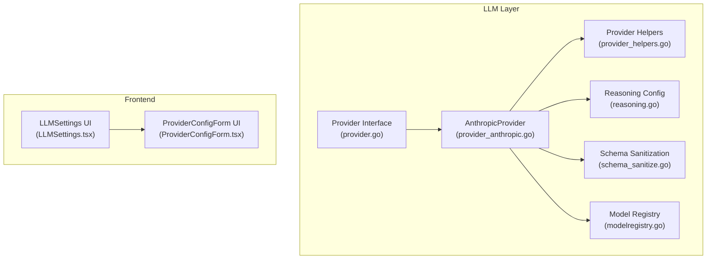
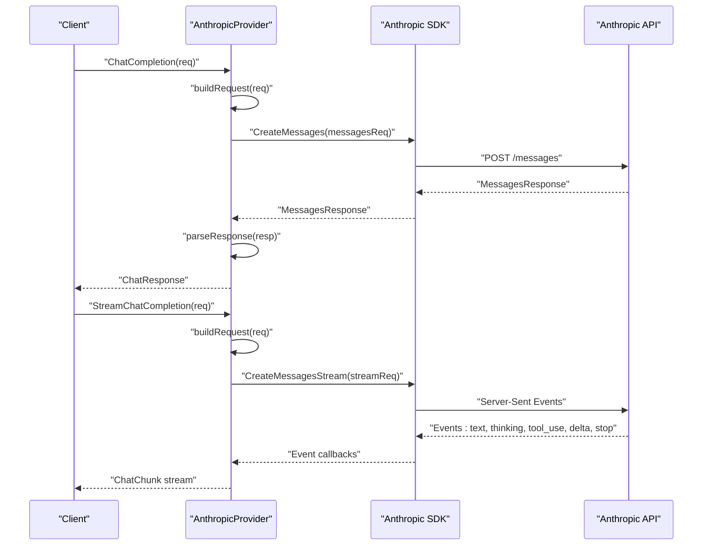
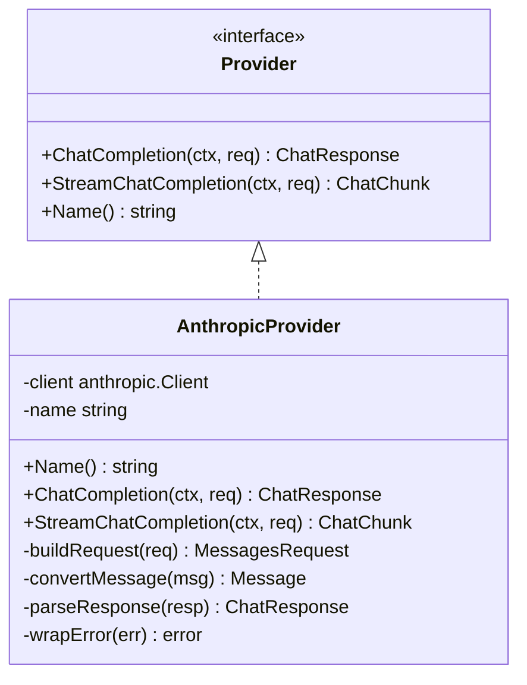
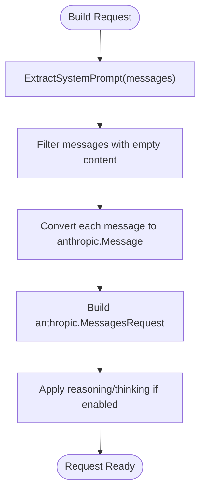
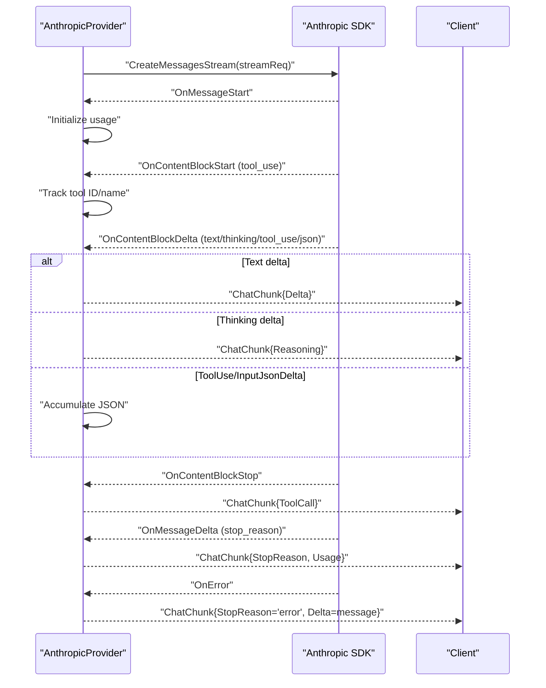
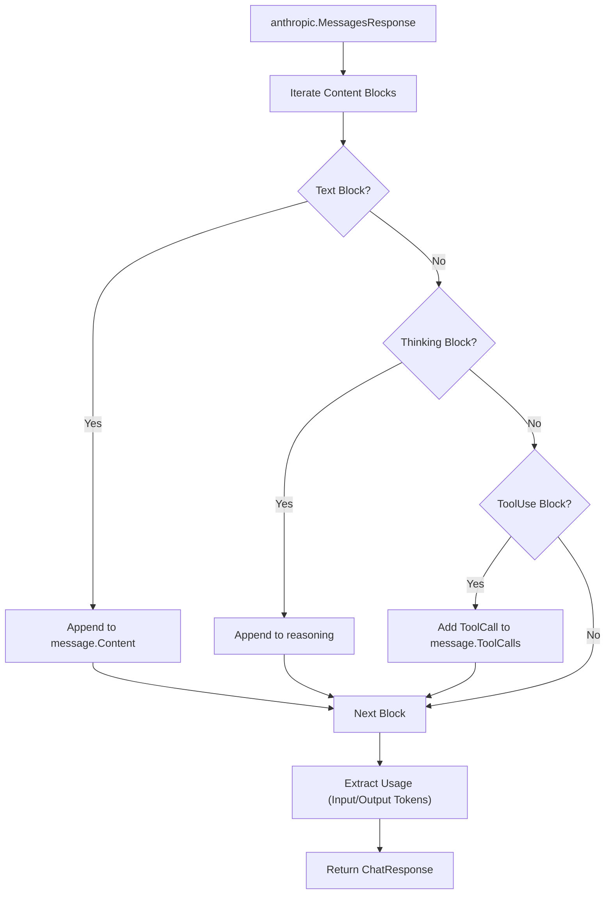
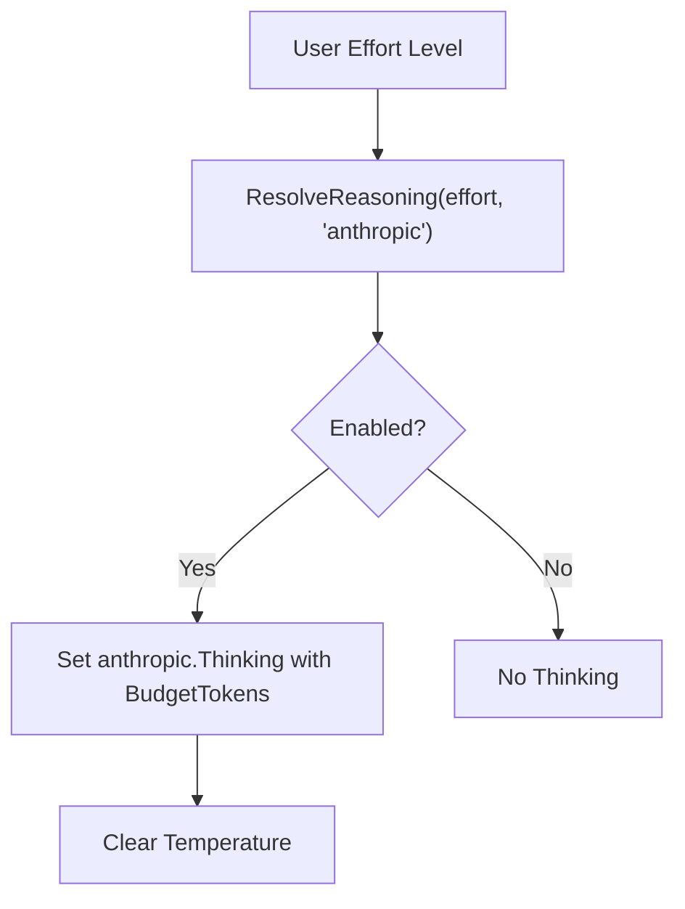
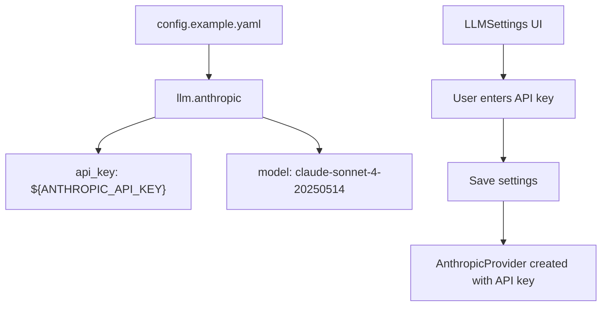
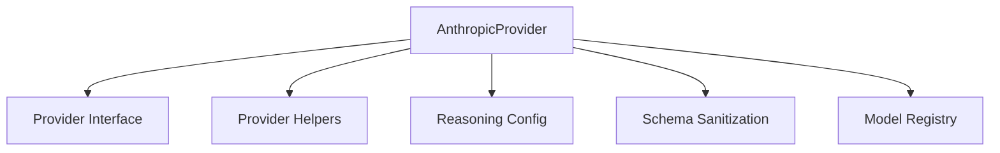

# Anthropic Provider Implementation

<cite>
**Referenced Files in This Document**
- [provider_anthropic.go](file://sdk/llm/provider_anthropic.go)
- [provider_anthropic_test.go](file://sdk/llm/provider_anthropic_test.go)
- [provider.go](file://sdk/llm/provider.go)
- [provider_helpers.go](file://sdk/llm/provider_helpers.go)
- [modelregistry.go](file://sdk/llm/modelregistry.go)
- [reasoning.go](file://sdk/llm/reasoning.go)
- [schema_sanitize.go](file://sdk/llm/schema_sanitize.go)
- [config.example.yaml](file://config.example.yaml)
- [LLMSettings.tsx](file://frontend/src/components/settings/LLMSettings.tsx)
- [ProviderConfigForm.tsx](file://frontend/src/components/settings/ProviderConfigForm.tsx)
</cite>

## Table of Contents
1. [Introduction](#introduction)
2. [Project Structure](#project-structure)
3. [Core Components](#core-components)
4. [Architecture Overview](#architecture-overview)
5. [Detailed Component Analysis](#detailed-component-analysis)
6. [Dependency Analysis](#dependency-analysis)
7. [Performance Considerations](#performance-considerations)
8. [Troubleshooting Guide](#troubleshooting-guide)
9. [Conclusion](#conclusion)

## Introduction
This document provides comprehensive documentation for the Anthropic Claude provider implementation in C0WRK. It explains how the Anthropic Claude API is integrated, how messages are formatted, and how streaming responses are handled. It also covers supported models, authentication setup, response processing, tool use support, safety filtering integration, configuration examples, and optimization guidance for Claude model usage.

## Project Structure
The Anthropic provider is implemented as part of the LLM provider abstraction layer. Key files include:
- Provider interface and implementation for Anthropic
- Request building, message conversion, and response parsing
- Model registry and reasoning configuration
- Frontend configuration UI for Anthropic settings

**Diagram sources**
- [provider.go:12-23](file://sdk/llm/provider.go#L12-L23)
- [provider_anthropic.go:27-31](file://sdk/llm/provider_anthropic.go#L27-L31)
- [provider_helpers.go:26-43](file://sdk/llm/provider_helpers.go#L26-L43)
- [reasoning.go:28-42](file://sdk/llm/reasoning.go#L28-L42)
- [schema_sanitize.go:428-432](file://sdk/llm/schema_sanitize.go#L428-L432)
- [modelregistry.go:42-137](file://sdk/llm/modelregistry.go#L42-L137)
- [LLMSettings.tsx:24-67](file://frontend/src/components/settings/LLMSettings.tsx#L24-L67)
- [ProviderConfigForm.tsx:22-30](file://frontend/src/components/settings/ProviderConfigForm.tsx#L22-L30)

**Section sources**
- [provider_anthropic.go:1-338](file://sdk/llm/provider_anthropic.go#L1-L338)
- [provider.go:12-23](file://sdk/llm/provider.go#L12-L23)
- [provider_helpers.go:26-43](file://sdk/llm/provider_helpers.go#L26-L43)
- [reasoning.go:28-42](file://sdk/llm/reasoning.go#L28-L42)
- [schema_sanitize.go:428-432](file://sdk/llm/schema_sanitize.go#L428-L432)
- [modelregistry.go:42-137](file://sdk/llm/modelregistry.go#L42-L137)
- [LLMSettings.tsx:24-67](file://frontend/src/components/settings/LLMSettings.tsx#L24-L67)
- [ProviderConfigForm.tsx:22-30](file://frontend/src/components/settings/ProviderConfigForm.tsx#L22-L30)

## Core Components
- AnthropicProvider: Implements the Provider interface for Anthropic Claude API, handling both synchronous and streaming requests.
- Request Builder: Converts ChatRequest to anthropic.MessagesRequest, extracting system prompts and applying reasoning/thinking configuration.
- Message Converter: Translates internal Message types to anthropic.Message, supporting user, assistant, and tool roles.
- Response Parser: Converts anthropic.MessagesResponse to ChatResponse, aggregating text content, reasoning, tool calls, and usage statistics.
- Streaming Handler: Processes anthropic streaming events, emitting text deltas, reasoning deltas, tool call JSON accumulation, and stop reasons.
- Error Wrapping: Maps Anthropic SDK errors to standardized provider errors with retryability hints.
- Model Metadata: Provides Anthropic model capabilities and context windows.
- Reasoning Configuration: Resolves user-facing reasoning effort levels to Anthropic thinking budgets.

**Section sources**
- [provider_anthropic.go:27-338](file://sdk/llm/provider_anthropic.go#L27-L338)
- [provider.go:12-23](file://sdk/llm/provider.go#L12-L23)
- [modelregistry.go:335-398](file://sdk/llm/modelregistry.go#L335-L398)
- [reasoning.go:28-58](file://sdk/llm/reasoning.go#L28-L58)

## Architecture Overview
The Anthropic provider integrates with the Anthropic SDK to send chat completion requests and receive either a full response or streaming chunks. The provider normalizes messages, applies reasoning/thinking configuration, and parses responses into the internal format.

**Diagram sources**
- [provider_anthropic.go:52-65](file://sdk/llm/provider_anthropic.go#L52-L65)
- [provider_anthropic.go:67-171](file://sdk/llm/provider_anthropic.go#L67-L171)
- [provider_anthropic.go:173-233](file://sdk/llm/provider_anthropic.go#L173-L233)
- [provider_anthropic.go:277-323](file://sdk/llm/provider_anthropic.go#L277-L323)

## Detailed Component Analysis

### AnthropicProvider Implementation
The AnthropicProvider implements the Provider interface and encapsulates Anthropic-specific logic:
- Authentication: Requires an API key; creation fails if missing.
- Synchronous Requests: Builds anthropic.MessagesRequest, calls CreateMessages, and parses MessagesResponse.
- Streaming Requests: Uses anthropic.MessagesStreamRequest with event callbacks for text, reasoning, tool use, and stop reasons.
- Tool Call Handling: Sanitizes tool call IDs to allowed characters and accumulates JSON deltas for tool input.
- Reasoning/Thinking: Applies Anthropic thinking configuration based on user effort levels and clears temperature when thinking is enabled.
- Error Handling: Wraps SDK errors into provider-specific errors with retryability classification.

**Diagram sources**
- [provider.go:12-23](file://sdk/llm/provider.go#L12-L23)
- [provider_anthropic.go:27-31](file://sdk/llm/provider_anthropic.go#L27-L31)
- [provider_anthropic.go:47-65](file://sdk/llm/provider_anthropic.go#L47-L65)
- [provider_anthropic.go:67-171](file://sdk/llm/provider_anthropic.go#L67-L171)
- [provider_anthropic.go:173-233](file://sdk/llm/provider_anthropic.go#L173-L233)
- [provider_anthropic.go:277-323](file://sdk/llm/provider_anthropic.go#L277-L323)
- [provider_anthropic.go:325-337](file://sdk/llm/provider_anthropic.go#L325-L337)

**Section sources**
- [provider_anthropic.go:22-45](file://sdk/llm/provider_anthropic.go#L22-L45)
- [provider_anthropic.go:52-65](file://sdk/llm/provider_anthropic.go#L52-L65)
- [provider_anthropic.go:67-171](file://sdk/llm/provider_anthropic.go#L67-L171)
- [provider_anthropic.go:173-233](file://sdk/llm/provider_anthropic.go#L173-L233)
- [provider_anthropic.go:277-323](file://sdk/llm/provider_anthropic.go#L277-L323)
- [provider_anthropic.go:325-337](file://sdk/llm/provider_anthropic.go#L325-L337)

### Message Formatting and System Prompts
- System Prompt Extraction: The ExtractSystemPrompt helper concatenates all system messages with newline separation and filters them out from the main message list.
- Role Mapping:
  - User messages become anthropic user role with text content.
  - Assistant messages become anthropic assistant role with text content and tool use blocks.
  - Tool messages become anthropic user role with tool result content blocks.
- Empty Content Handling: Messages with empty content and no tool calls/results are skipped to avoid API rejection.

**Diagram sources**
- [provider_helpers.go:26-43](file://sdk/llm/provider_helpers.go#L26-L43)
- [provider_anthropic.go:173-233](file://sdk/llm/provider_anthropic.go#L173-L233)
- [provider_anthropic.go:235-275](file://sdk/llm/provider_anthropic.go#L235-L275)

**Section sources**
- [provider_helpers.go:26-43](file://sdk/llm/provider_helpers.go#L26-L43)
- [provider_anthropic.go:173-233](file://sdk/llm/provider_anthropic.go#L173-L233)
- [provider_anthropic.go:235-275](file://sdk/llm/provider_anthropic.go#L235-L275)

### Streaming Response Handling
The streaming handler processes anthropic streaming events:
- OnMessageStart: Initializes input token usage.
- OnContentBlockStart: Tracks tool use start with ID and name.
- OnContentBlockDelta:
  - Text deltas emit as ChatChunk.Delta.
  - Thinking deltas emit as ChatChunk.Reasoning.
  - ToolUse and InputJsonDelta accumulate tool input JSON.
- OnContentBlockStop: Emits accumulated tool call as ChatChunk.ToolCall.
- OnMessageDelta: Updates output token usage and emits stop reason.
- OnError: Emits error stop reason with error message.

**Diagram sources**
- [provider_anthropic.go:67-171](file://sdk/llm/provider_anthropic.go#L67-L171)
- [provider_anthropic.go:82-157](file://sdk/llm/provider_anthropic.go#L82-L157)

**Section sources**
- [provider_anthropic.go:67-171](file://sdk/llm/provider_anthropic.go#L67-L171)

### Response Processing and Tool Use Support
- Text Aggregation: Multiple text content blocks are concatenated with newlines.
- Reasoning: Extended thinking content blocks are captured separately.
- Tool Calls: Tool use content blocks are parsed into ToolCall objects with sanitized IDs.
- Usage: Input and output token counts are extracted from the response.

**Diagram sources**
- [provider_anthropic.go:277-323](file://sdk/llm/provider_anthropic.go#L277-L323)

**Section sources**
- [provider_anthropic.go:277-323](file://sdk/llm/provider_anthropic.go#L277-L323)

### Reasoning/Thinking Integration
- Effort Levels: Minimal, Low, Medium, High, Maximum map to specific token budgets for Anthropic thinking.
- Configuration Application: When reasoning effort is set, the provider enables thinking with the calculated budget and clears temperature.
- Agent Mode: Different agent roles can use reduced reasoning effort when appropriate.

**Diagram sources**
- [reasoning.go:28-58](file://sdk/llm/reasoning.go#L28-L58)
- [provider_anthropic.go:206-217](file://sdk/llm/provider_anthropic.go#L206-L217)

**Section sources**
- [reasoning.go:28-58](file://sdk/llm/reasoning.go#L28-L58)
- [provider_anthropic.go:206-217](file://sdk/llm/provider_anthropic.go#L206-L217)

### Safety Filtering Integration
Safety filtering is configured globally and applied to tool execution decisions:
- Default policy controls whether tools require user confirmation, automatic approval, or denial.
- Per-tool policies can override defaults and include blacklist patterns for sensitive tools.
- Judge configuration enables on-demand LLM-based safety judgment for tool usage.

Note: The Anthropic provider itself does not implement safety filtering; it relies on the global security configuration and tool policies.

**Section sources**
- [config.example.yaml:141-173](file://config.example.yaml#L141-L173)

### Supported Models and Capabilities
The model registry defines Anthropic models with their capabilities and context windows. Notable models include:
- claude-3.5-sonnet, claude-3.5-haiku
- claude-sonnet series (4, 4.5, 4.6)
- claude-opus series (4, 4.5, 4.6)
- claude-haiku-4.5

Capabilities include attachment support, temperature control, tool call support, and reasoning/thinking modes.

**Section sources**
- [modelregistry.go:335-398](file://sdk/llm/modelregistry.go#L335-L398)

### Authentication Setup and Configuration
- API Key Requirement: AnthropicProvider requires a non-empty API key.
- Configuration Example: The example configuration demonstrates setting active provider to "anthropic" and specifying the API key and model.
- Frontend UI: The LLM settings UI allows selecting the provider, entering the API key, and choosing a model.

**Diagram sources**
- [config.example.yaml:18-21](file://config.example.yaml#L18-L21)
- [LLMSettings.tsx:48-55](file://frontend/src/components/settings/LLMSettings.tsx#L48-L55)
- [ProviderConfigForm.tsx:61-69](file://frontend/src/components/settings/ProviderConfigForm.tsx#L61-L69)

**Section sources**
- [provider_anthropic.go:34-45](file://sdk/llm/provider_anthropic.go#L34-L45)
- [config.example.yaml:18-21](file://config.example.yaml#L18-L21)
- [LLMSettings.tsx:48-55](file://frontend/src/components/settings/LLMSettings.tsx#L48-L55)
- [ProviderConfigForm.tsx:61-69](file://frontend/src/components/settings/ProviderConfigForm.tsx#L61-L69)

### Tool Definition Schema Handling
- Anthropic Schema Passthrough: Tool definition schemas are passed through unchanged for Anthropic compatibility.
- Additional Properties: The sanitization preserves additionalProperties as required by Anthropic.

**Section sources**
- [schema_sanitize.go:428-432](file://sdk/llm/schema_sanitize.go#L428-L432)
- [provider_anthropic_test.go:1092-1123](file://sdk/llm/provider_anthropic_test.go#L1092-L1123)

## Dependency Analysis
The Anthropic provider depends on:
- Internal LLM abstractions (Provider interface, ChatRequest/ChatResponse)
- Provider helpers for system prompt extraction and message normalization
- Reasoning configuration for thinking budgets
- Model registry for capability metadata
- Anthropic SDK for API communication

**Diagram sources**
- [provider_anthropic.go:27-31](file://sdk/llm/provider_anthropic.go#L27-L31)
- [provider.go:12-23](file://sdk/llm/provider.go#L12-L23)
- [provider_helpers.go:26-43](file://sdk/llm/provider_helpers.go#L26-L43)
- [reasoning.go:28-42](file://sdk/llm/reasoning.go#L28-L42)
- [schema_sanitize.go:428-432](file://sdk/llm/schema_sanitize.go#L428-L432)
- [modelregistry.go:42-137](file://sdk/llm/modelregistry.go#L42-L137)

**Section sources**
- [provider_anthropic.go:1-338](file://sdk/llm/provider_anthropic.go#L1-L338)
- [provider.go:12-23](file://sdk/llm/provider.go#L12-L23)
- [provider_helpers.go:26-43](file://sdk/llm/provider_helpers.go#L26-L43)
- [reasoning.go:28-42](file://sdk/llm/reasoning.go#L28-L42)
- [schema_sanitize.go:428-432](file://sdk/llm/schema_sanitize.go#L428-L432)
- [modelregistry.go:42-137](file://sdk/llm/modelregistry.go#L42-L137)

## Performance Considerations
- Streaming Efficiency: Use StreamChatCompletion for real-time user feedback and reduced latency.
- Reasoning Budgets: Select appropriate reasoning effort levels to balance quality and cost; higher budgets increase output token usage.
- Model Selection: Choose models aligned with task complexity and context window requirements; larger models offer higher context windows and output limits.
- Token Management: Monitor input and output token usage to optimize prompt sizes and reduce costs.

## Troubleshooting Guide
Common issues and resolutions:
- Missing API Key: Ensure the Anthropic API key is configured; provider creation fails without it.
- Empty Content Messages: Messages with empty content and no tool calls are skipped; include meaningful content or tool calls.
- Rate Limits and Overloads: The provider wraps API errors and marks them as retryable when appropriate; implement backoff strategies.
- Tool Call ID Validation: Tool call IDs are sanitized to allowed characters; ensure tool definitions comply with Anthropic constraints.
- Reasoning/Thinking Conflicts: When reasoning is enabled, temperature is cleared; adjust temperature settings accordingly.

**Section sources**
- [provider_anthropic.go:34-45](file://sdk/llm/provider_anthropic.go#L34-L45)
- [provider_anthropic.go:179-183](file://sdk/llm/provider_anthropic.go#L179-L183)
- [provider_anthropic.go:325-337](file://sdk/llm/provider_anthropic.go#L325-L337)
- [provider_anthropic_test.go:19-25](file://sdk/llm/provider_anthropic_test.go#L19-L25)

## Conclusion
The Anthropic provider implementation in C0WRK offers robust integration with the Claude API, supporting both synchronous and streaming responses, tool use, reasoning/thinking modes, and comprehensive configuration through the frontend UI. By leveraging the model registry, reasoning configuration, and security policies, developers can optimize Claude model usage while maintaining safety and performance.