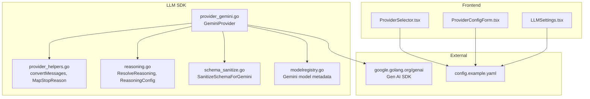
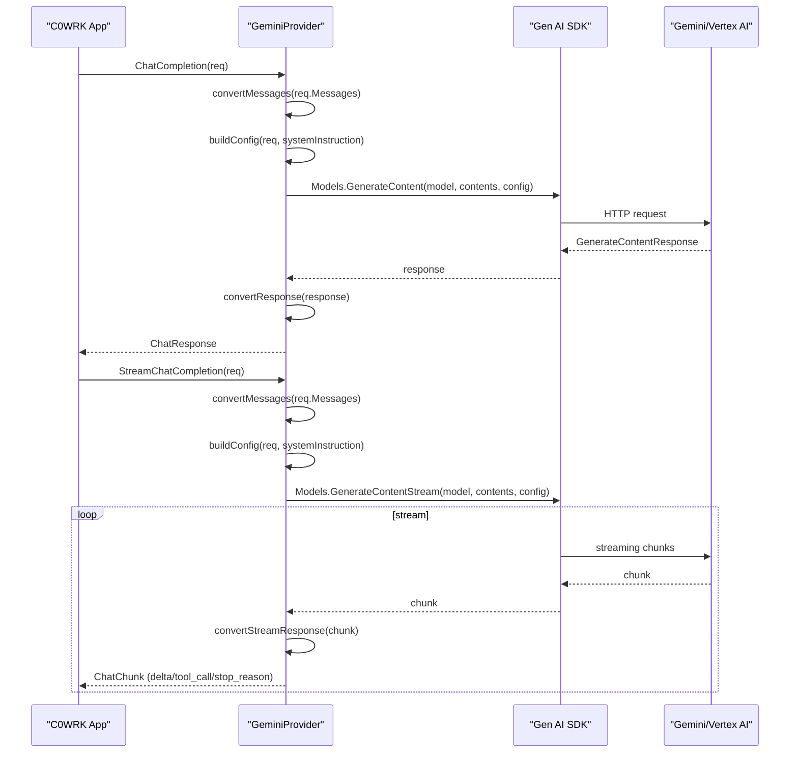
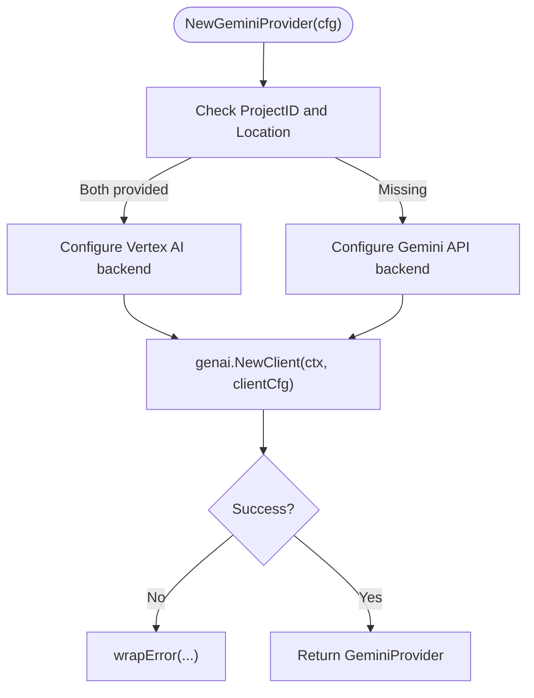
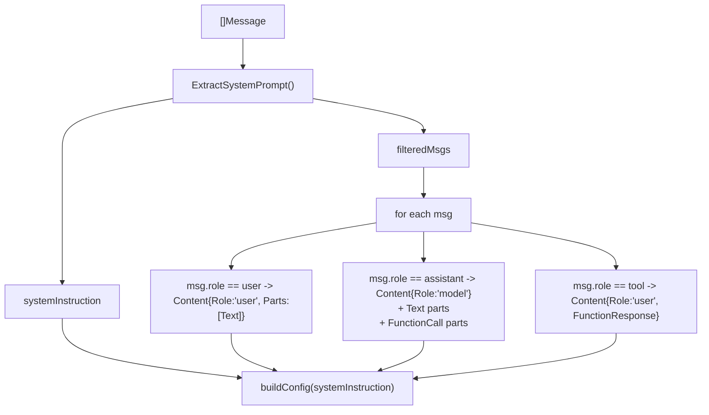
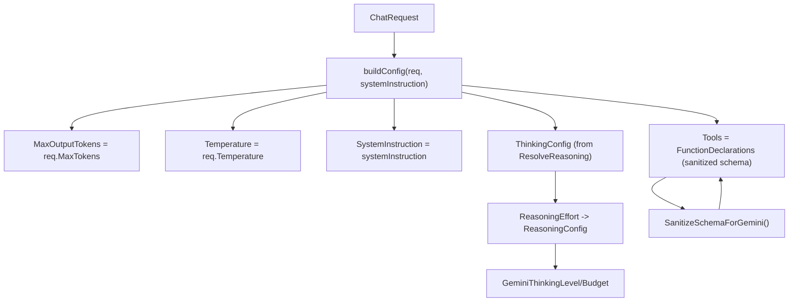
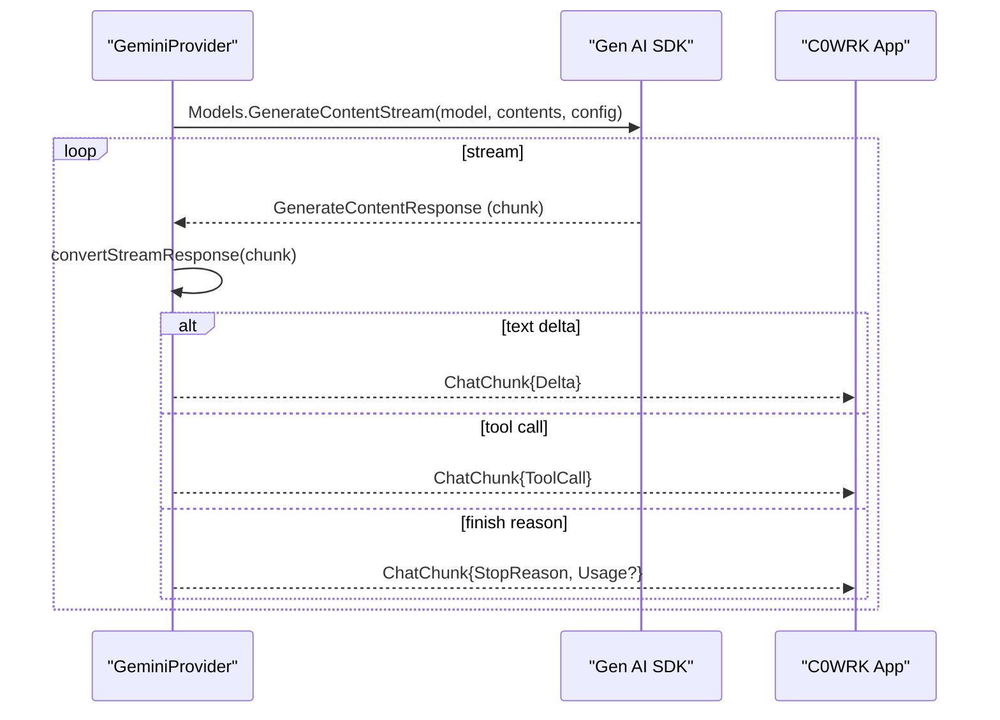
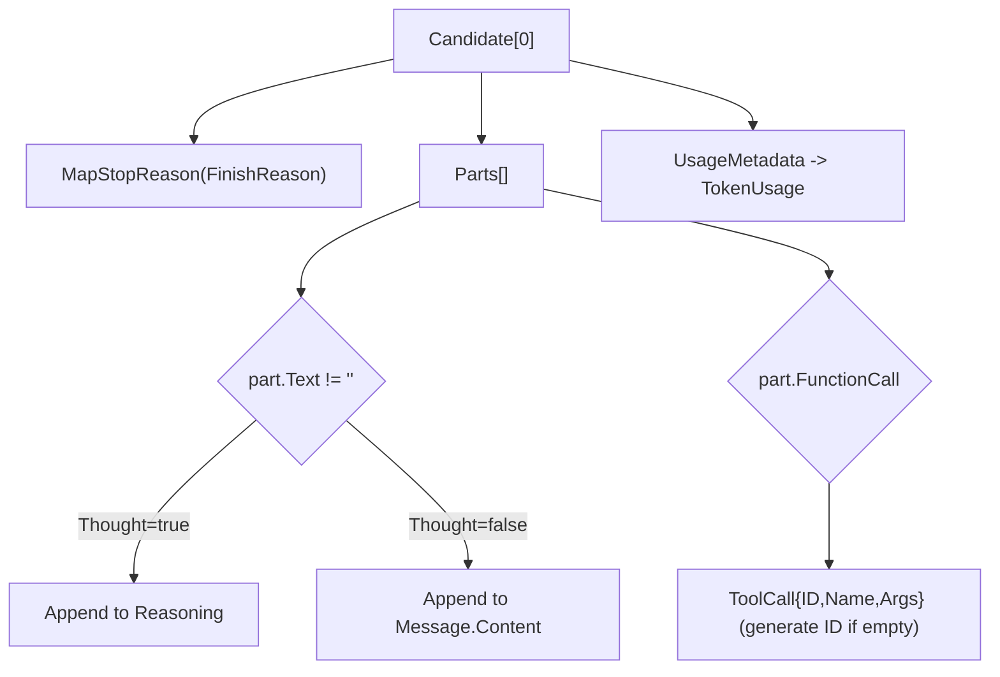
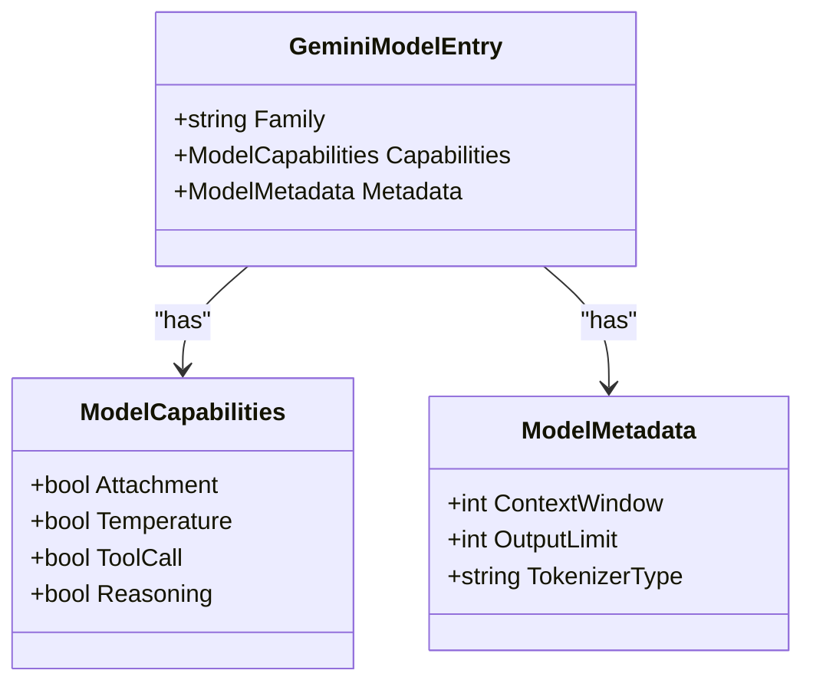
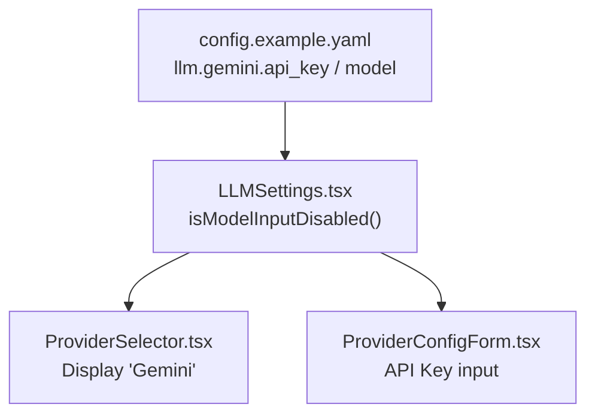
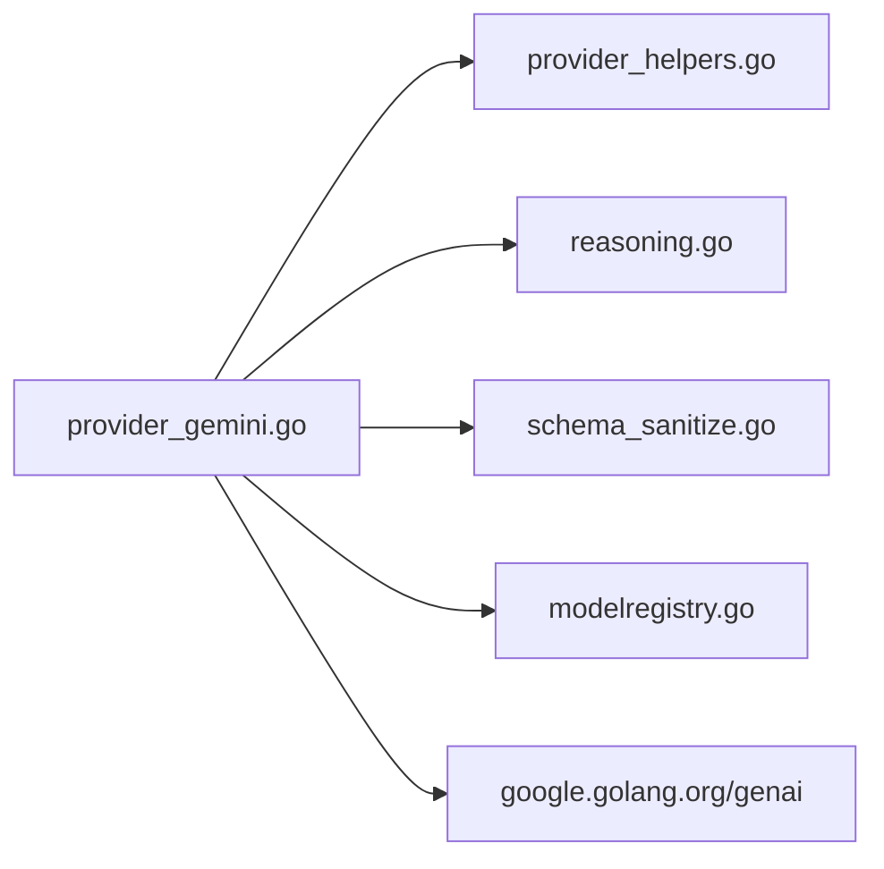

# Google Gemini Provider Implementation

<cite>
**Referenced Files in This Document**
- [provider_gemini.go](file://sdk/llm/provider_gemini.go)
- [provider_gemini_test.go](file://sdk/llm/provider_gemini_test.go)
- [provider_helpers.go](file://sdk/llm/provider_helpers.go)
- [reasoning.go](file://sdk/llm/reasoning.go)
- [schema_sanitize.go](file://sdk/llm/schema_sanitize.go)
- [config.example.yaml](file://config.example.yaml)
- [ProviderConfigForm.tsx](file://frontend/src/components/settings/ProviderConfigForm.tsx)
- [ProviderSelector.tsx](file://frontend/src/components/settings/ProviderSelector.tsx)
- [LLMSettings.tsx](file://frontend/src/components/settings/LLMSettings.tsx)
- [modelregistry.go](file://sdk/llm/modelregistry.go)
</cite>

## Table of Contents
1. [Introduction](#introduction)
2. [Project Structure](#project-structure)
3. [Core Components](#core-components)
4. [Architecture Overview](#architecture-overview)
5. [Detailed Component Analysis](#detailed-component-analysis)
6. [Dependency Analysis](#dependency-analysis)
7. [Performance Considerations](#performance-considerations)
8. [Troubleshooting Guide](#troubleshooting-guide)
9. [Conclusion](#conclusion)

## Introduction
This document explains the Google Gemini provider implementation in C0WRK. It covers API integration, multimodal support, streaming response handling, supported models, authentication mechanisms (including Vertex AI), response processing, function/tool calling, safety settings integration, configuration examples, and troubleshooting guidance. The implementation integrates with Google's Gen AI SDK and maps Gemini-specific concepts (roles, stop reasons, tool calls, reasoning) to the C0WRK unified provider interface.

## Project Structure
The Gemini provider resides in the LLM SDK and is complemented by shared utilities for message conversion, reasoning configuration, schema sanitization, and frontend configuration forms. The provider supports both the Gemini API and Vertex AI backends.

**Diagram sources**
- [provider_gemini.go:1-386](file://sdk/llm/provider_gemini.go#L1-L386)
- [provider_helpers.go:1-140](file://sdk/llm/provider_helpers.go#L1-L140)
- [reasoning.go:1-107](file://sdk/llm/reasoning.go#L1-L107)
- [schema_sanitize.go:1-433](file://sdk/llm/schema_sanitize.go#L1-L433)
- [modelregistry.go:400-440](file://sdk/llm/modelregistry.go#L400-L440)
- [ProviderSelector.tsx:1-35](file://frontend/src/components/settings/ProviderSelector.tsx#L1-L35)
- [ProviderConfigForm.tsx:1-87](file://frontend/src/components/settings/ProviderConfigForm.tsx#L1-L87)
- [LLMSettings.tsx:165-216](file://frontend/src/components/settings/LLMSettings.tsx#L165-L216)
- [config.example.yaml:1-225](file://config.example.yaml#L1-L225)

**Section sources**
- [provider_gemini.go:1-386](file://sdk/llm/provider_gemini.go#L1-L386)
- [provider_helpers.go:1-140](file://sdk/llm/provider_helpers.go#L1-L140)
- [reasoning.go:1-107](file://sdk/llm/reasoning.go#L1-L107)
- [schema_sanitize.go:1-433](file://sdk/llm/schema_sanitize.go#L1-L433)
- [modelregistry.go:400-440](file://sdk/llm/modelregistry.go#L400-L440)
- [config.example.yaml:1-225](file://config.example.yaml#L1-L225)
- [ProviderSelector.tsx:1-35](file://frontend/src/components/settings/ProviderSelector.tsx#L1-L35)
- [ProviderConfigForm.tsx:1-87](file://frontend/src/components/settings/ProviderConfigForm.tsx#L1-L87)
- [LLMSettings.tsx:165-216](file://frontend/src/components/settings/LLMSettings.tsx#L165-L216)

## Core Components
- GeminiProvider: Implements the unified Provider interface using the Gen AI SDK. Handles chat completions and streaming, converts messages and tool calls, and maps stop reasons and usage.
- Message conversion: Converts C0WRK Message roles and tool calls to Gemini Content parts, including FunctionCall and FunctionResponse handling.
- Generation configuration: Builds GenerateContentConfig from ChatRequest, including temperature, max output tokens, system instruction, tools, and reasoning/thinking configuration.
- Response conversion: Translates Gen AI SDK responses into ChatResponse and ChatChunk, extracting text deltas, tool calls, reasoning thoughts, and usage metadata.
- Model metadata: Queries Gemini Models.Get to populate context window and output limits for model-aware context management.
- Error wrapping: Maps Gen AI SDK errors to a unified LLM error type with status codes and retryability hints.

**Section sources**
- [provider_gemini.go:30-386](file://sdk/llm/provider_gemini.go#L30-L386)
- [provider_helpers.go:26-43](file://sdk/llm/provider_helpers.go#L26-L43)
- [reasoning.go:28-89](file://sdk/llm/reasoning.go#L28-L89)
- [schema_sanitize.go:9-32](file://sdk/llm/schema_sanitize.go#L9-L32)

## Architecture Overview
The provider integrates with the Gen AI SDK to call either the Gemini API or Vertex AI backend depending on configuration. It translates C0WRK requests into SDK-specific structures, streams deltas, and converts SDK responses into the unified format.

**Diagram sources**
- [provider_gemini.go:78-119](file://sdk/llm/provider_gemini.go#L78-L119)
- [provider_gemini.go:121-187](file://sdk/llm/provider_gemini.go#L121-L187)
- [provider_gemini.go:189-245](file://sdk/llm/provider_gemini.go#L189-L245)
- [provider_gemini.go:247-298](file://sdk/llm/provider_gemini.go#L247-L298)
- [provider_gemini.go:300-347](file://sdk/llm/provider_gemini.go#L300-L347)

## Detailed Component Analysis

### Authentication and Backends
- Backend selection: Uses Vertex AI backend when ProjectID and Location are provided; otherwise uses the Gemini API backend with APIKey.
- Vertex AI integration: Supports project-scoped Vertex AI deployments via client configuration.
- Error handling: Creation failures are wrapped into a unified LLM error for consistent handling.

**Diagram sources**
- [provider_gemini.go:37-61](file://sdk/llm/provider_gemini.go#L37-L61)
- [provider_gemini.go:378-385](file://sdk/llm/provider_gemini.go#L378-L385)

**Section sources**
- [provider_gemini.go:23-61](file://sdk/llm/provider_gemini.go#L23-L61)
- [provider_gemini.go:378-385](file://sdk/llm/provider_gemini.go#L378-L385)

### Message Conversion and Multimodal Support
- System prompt extraction: ExtractSystemPrompt concatenates system messages and removes them from the content list.
- Role mapping: User messages become "user" parts; assistant messages become "model" parts. Tool responses are represented as FunctionResponse parts under "user".
- Function calls: Assistant tool calls are embedded as FunctionCall parts in "model" content; tool responses are embedded as FunctionResponse parts.
- Multimodality: The Gen AI SDK supports media parts (images, video, audio) via Content.Parts; the provider’s conversion logic handles text and function parts. Media parts are supported by the underlying SDK and can be integrated by passing appropriate Part types.

**Diagram sources**
- [provider_helpers.go:29-43](file://sdk/llm/provider_helpers.go#L29-L43)
- [provider_gemini.go:121-187](file://sdk/llm/provider_gemini.go#L121-L187)

**Section sources**
- [provider_helpers.go:26-43](file://sdk/llm/provider_helpers.go#L26-L43)
- [provider_gemini.go:121-187](file://sdk/llm/provider_gemini.go#L121-L187)

### Generation Configuration and Safety Settings
- Parameters: MaxOutputTokens, Temperature, SystemInstruction, Tools (FunctionDeclarations), ThinkingConfig (reasoning).
- Safety filters: Gemini safety settings are managed by the Gen AI SDK; the provider does not directly expose safety settings in the configuration surface shown here. Users configure safety via SDK defaults or external controls.
- Reasoning/thinking: Resolved from user-facing effort levels into Gemini thinking level and budget.

**Diagram sources**
- [provider_gemini.go:189-245](file://sdk/llm/provider_gemini.go#L189-L245)
- [reasoning.go:28-89](file://sdk/llm/reasoning.go#L28-L89)
- [schema_sanitize.go:9-32](file://sdk/llm/schema_sanitize.go#L9-L32)

**Section sources**
- [provider_gemini.go:189-245](file://sdk/llm/provider_gemini.go#L189-L245)
- [reasoning.go:28-89](file://sdk/llm/reasoning.go#L28-L89)
- [schema_sanitize.go:9-32](file://sdk/llm/schema_sanitize.go#L9-L32)

### Streaming Response Handling
- StreamChatCompletion: Initiates streaming via Models.GenerateContentStream, converting each SDK chunk into ChatChunk deltas, tool calls, and stop reasons.
- Stop reason mapping: FinishReason values are normalized to the unified format.
- Usage metadata: Included in the final stop chunk when available.

**Diagram sources**
- [provider_gemini.go:91-119](file://sdk/llm/provider_gemini.go#L91-L119)
- [provider_gemini.go:300-347](file://sdk/llm/provider_gemini.go#L300-L347)

**Section sources**
- [provider_gemini.go:91-119](file://sdk/llm/provider_gemini.go#L91-L119)
- [provider_gemini.go:300-347](file://sdk/llm/provider_gemini.go#L300-L347)

### Response Processing and Tool Calling
- Full response: convertResponse extracts the first candidate, maps finish reason, accumulates text (separating thought parts), collects tool calls, and maps usage metadata.
- Streaming: convertStreamResponse emits deltas, tool calls, and a terminal stop chunk with usage.
- Tool call IDs: Generated when absent to ensure downstream compatibility.

**Diagram sources**
- [provider_gemini.go:247-298](file://sdk/llm/provider_gemini.go#L247-L298)
- [provider_gemini.go:300-347](file://sdk/llm/provider_gemini.go#L300-L347)

**Section sources**
- [provider_gemini.go:247-298](file://sdk/llm/provider_gemini.go#L247-L298)
- [provider_gemini.go:300-347](file://sdk/llm/provider_gemini.go#L300-L347)

### Supported Models and Capabilities
- Registry entries indicate Gemini models with capabilities including Attachment, Temperature, ToolCall, and Reasoning.
- Output limits are populated from model metadata; default fallback is applied when unavailable.

**Diagram sources**
- [modelregistry.go:400-440](file://sdk/llm/modelregistry.go#L400-L440)

**Section sources**
- [modelregistry.go:400-440](file://sdk/llm/modelregistry.go#L400-L440)

### Configuration Examples
- Backend selection:
  - Gemini API: Provide APIKey; backend selected automatically.
  - Vertex AI: Provide ProjectID and Location; backend selected automatically.
- Frontend configuration:
  - Provider selector includes "Gemini".
  - Provider config form accepts API key for Gemini.
  - Model selection is gated by API key presence.

**Diagram sources**
- [config.example.yaml:22-25](file://config.example.yaml#L22-L25)
- [LLMSettings.tsx:182-216](file://frontend/src/components/settings/LLMSettings.tsx#L182-L216)
- [ProviderSelector.tsx:1-35](file://frontend/src/components/settings/ProviderSelector.tsx#L1-L35)
- [ProviderConfigForm.tsx:56-83](file://frontend/src/components/settings/ProviderConfigForm.tsx#L56-L83)

**Section sources**
- [config.example.yaml:22-25](file://config.example.yaml#L22-L25)
- [LLMSettings.tsx:182-216](file://frontend/src/components/settings/LLMSettings.tsx#L182-L216)
- [ProviderSelector.tsx:1-35](file://frontend/src/components/settings/ProviderSelector.tsx#L1-L35)
- [ProviderConfigForm.tsx:56-83](file://frontend/src/components/settings/ProviderConfigForm.tsx#L56-L83)

## Dependency Analysis
- Internal dependencies:
  - provider_gemini.go depends on provider_helpers.go for message conversion and stop reason mapping.
  - provider_gemini.go depends on reasoning.go for reasoning/thinking configuration.
  - provider_gemini.go depends on schema_sanitize.go for tool schema normalization.
  - provider_gemini.go queries model metadata from modelregistry.go.
- External dependencies:
  - google.golang.org/genai for Gemini/Vertex AI integration.
  - Standard library for logging and context handling.

**Diagram sources**
- [provider_gemini.go:1-12](file://sdk/llm/provider_gemini.go#L1-L12)
- [provider_helpers.go:1-4](file://sdk/llm/provider_helpers.go#L1-L4)
- [reasoning.go:1-2](file://sdk/llm/reasoning.go#L1-L2)
- [schema_sanitize.go:1-7](file://sdk/llm/schema_sanitize.go#L1-L7)
- [modelregistry.go:1-10](file://sdk/llm/modelregistry.go#L1-L10)

**Section sources**
- [provider_gemini.go:1-12](file://sdk/llm/provider_gemini.go#L1-L12)
- [provider_helpers.go:1-4](file://sdk/llm/provider_helpers.go#L1-L4)
- [reasoning.go:1-2](file://sdk/llm/reasoning.go#L1-L2)
- [schema_sanitize.go:1-7](file://sdk/llm/schema_sanitize.go#L1-L7)
- [modelregistry.go:1-10](file://sdk/llm/modelregistry.go#L1-L10)

## Performance Considerations
- Streaming: Prefer StreamChatCompletion for long responses to reduce latency and memory overhead.
- Reasoning/thinking: Enable reasoning only when needed; higher budgets increase token usage.
- Tool schemas: Use sanitized schemas to avoid unnecessary validation overhead and improve reliability.
- Model metadata: Rely on accurate context windows and output limits to prevent retries due to context overflow.

## Troubleshooting Guide
- Authentication failures:
  - Gemini API: Ensure APIKey is set in configuration and accessible to the provider.
  - Vertex AI: Confirm ProjectID and Location are provided and credentials permit access.
- Rate limits and quota errors:
  - The provider wraps Gen AI SDK errors into a unified LLM error; inspect status codes for retryable conditions.
- Empty or unexpected responses:
  - Verify system instruction extraction and message filtering.
  - Check tool schema sanitization for malformed JSON schemas.
- Streaming issues:
  - Ensure the stream loop handles context cancellation and SDK errors gracefully.
- Model metadata retrieval:
  - If Models.Get fails, the provider logs and falls back to approximate limits.

**Section sources**
- [provider_gemini.go:378-385](file://sdk/llm/provider_gemini.go#L378-L385)
- [provider_gemini_test.go:578-614](file://sdk/llm/provider_gemini_test.go#L578-L614)
- [provider_gemini.go:349-376](file://sdk/llm/provider_gemini.go#L349-L376)

## Conclusion
The Gemini provider in C0WRK offers a robust integration with Google’s Gen AI SDK, supporting both the Gemini API and Vertex AI backends. It provides streaming and non-streaming completions, function/tool calling, multimodal readiness, reasoning/thinking configuration, and model-aware metadata. Configuration is straightforward via the frontend and configuration files, while error handling and response normalization ensure consistent behavior across use cases.