# LLM Provider Integration

<cite>
**Referenced Files in This Document**
- [provider.go](file://sdk/llm/provider.go)
- [modelregistry.go](file://sdk/llm/modelregistry.go)
- [router.go](file://sdk/llm/router.go)
- [reasoning.go](file://sdk/llm/reasoning.go)
- [tokencount.go](file://sdk/llm/tokencount.go)
- [usage.go](file://sdk/llm/usage.go)
- [message.go](file://sdk/llm/message.go)
- [family.go](file://sdk/llm/family.go)
- [provider_helpers.go](file://sdk/llm/provider_helpers.go)
- [schema_sanitize.go](file://sdk/llm/schema_sanitize.go)
- [errors.go](file://sdk/llm/errors.go)
- [provider_openai.go](file://sdk/llm/provider_openai.go)
- [provider_openai_responses.go](file://sdk/llm/provider_openai_responses.go)
- [provider_anthropic.go](file://sdk/llm/provider_anthropic.go)
- [provider_gemini.go](file://sdk/llm/provider_gemini.go)
- [provider_lmstudio.go](file://sdk/llm/provider_lmstudio.go)
</cite>

## Table of Contents
1. [Introduction](#introduction)
2. [Project Structure](#project-structure)
3. [Core Components](#core-components)
4. [Architecture Overview](#architecture-overview)
5. [Detailed Component Analysis](#detailed-component-analysis)
6. [Dependency Analysis](#dependency-analysis)
7. [Performance Considerations](#performance-considerations)
8. [Troubleshooting Guide](#troubleshooting-guide)
9. [Conclusion](#conclusion)
10. [Appendices](#appendices)

## Introduction
This document explains C0WRK’s LLM provider abstraction and integration system. It covers the unified provider interface, model registry with multi-source resolution, pluggable provider architecture supporting OpenAI, Anthropic, Google Gemini, and LM Studio, plus robust error handling, token counting, usage tracking, and reasoning system integration. It also provides guidance for adding new providers and optimizing configurations.

## Project Structure
The LLM integration lives under sdk/llm and is composed of:
- Unified provider interface and request/response types
- Router for provider selection, retries, and context window validation
- Model registry with multi-tier metadata resolution
- Provider implementations for OpenAI, Anthropic, Gemini, and LM Studio
- Token counting and usage tracking utilities
- Schema sanitization helpers for provider-specific tool schema requirements
- Error classification and retry logic

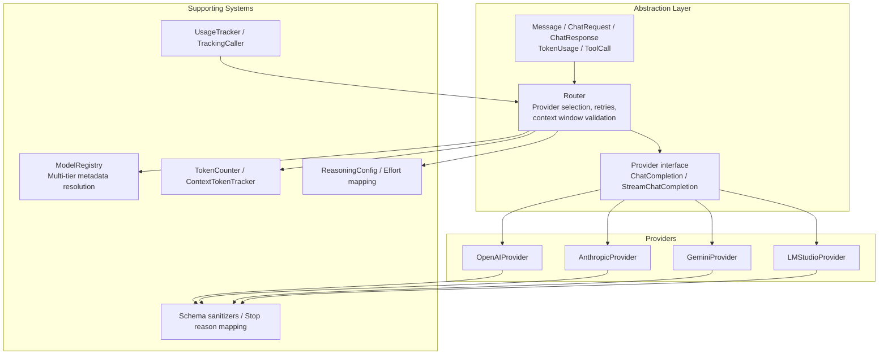

**Diagram sources**
- [provider.go:8-23](file://sdk/llm/provider.go#L8-L23)
- [router.go:32-106](file://sdk/llm/router.go#L32-L106)
- [modelregistry.go:42-137](file://sdk/llm/modelregistry.go#L42-L137)
- [tokencount.go:11-121](file://sdk/llm/tokencount.go#L11-L121)
- [usage.go:14-87](file://sdk/llm/usage.go#L14-L87)
- [reasoning.go:28-42](file://sdk/llm/reasoning.go#L28-L42)
- [provider_helpers.go:5-24](file://sdk/llm/provider_helpers.go#L5-L24)
- [schema_sanitize.go:9-432](file://sdk/llm/schema_sanitize.go#L9-L432)

**Section sources**
- [provider.go:8-23](file://sdk/llm/provider.go#L8-L23)
- [router.go:32-106](file://sdk/llm/router.go#L32-L106)
- [modelregistry.go:42-137](file://sdk/llm/modelregistry.go#L42-L137)
- [tokencount.go:11-121](file://sdk/llm/tokencount.go#L11-L121)
- [usage.go:14-87](file://sdk/llm/usage.go#L14-L87)
- [reasoning.go:28-42](file://sdk/llm/reasoning.go#L28-L42)
- [provider_helpers.go:5-24](file://sdk/llm/provider_helpers.go#L5-L24)
- [schema_sanitize.go:9-432](file://sdk/llm/schema_sanitize.go#L9-L432)

## Core Components
- Provider interface: a unified contract for chat completions and streaming across providers.
- Router: selects the active provider, applies defaults, validates context window, retries on retryable errors, and normalizes responses.
- ModelRegistry: resolves model metadata via overrides, built-ins, cache, external sources, and fallbacks.
- TokenCounter and ContextTokenTracker: approximate and precise token counting, plus API-corrected tracking.
- UsageTracker and TrackingCaller: session-wide usage accumulation and per-call correction.
- ReasoningConfig: provider-specific reasoning parameters derived from user-facing effort levels.
- Schema sanitizers: provider-specific JSON Schema normalization for tool definitions.
- Error classification: HTTP and network error classification with retry semantics.

**Section sources**
- [provider.go:8-23](file://sdk/llm/provider.go#L8-L23)
- [router.go:32-106](file://sdk/llm/router.go#L32-L106)
- [modelregistry.go:42-137](file://sdk/llm/modelregistry.go#L42-L137)
- [tokencount.go:11-121](file://sdk/llm/tokencount.go#L11-L121)
- [usage.go:14-87](file://sdk/llm/usage.go#L14-L87)
- [reasoning.go:28-42](file://sdk/llm/reasoning.go#L28-L42)
- [schema_sanitize.go:9-432](file://sdk/llm/schema_sanitize.go#L9-L432)
- [errors.go:11-118](file://sdk/llm/errors.go#L11-L118)

## Architecture Overview
The system centers around the Router, which encapsulates configuration and provider selection. The Router delegates to a Provider implementation, which maps internal types to provider-specific requests and responses. The ModelRegistry supplies model metadata for context window checks and token counting. Token counters and usage trackers provide observability and budgeting. Providers implement provider-specific optimizations and schema normalization.

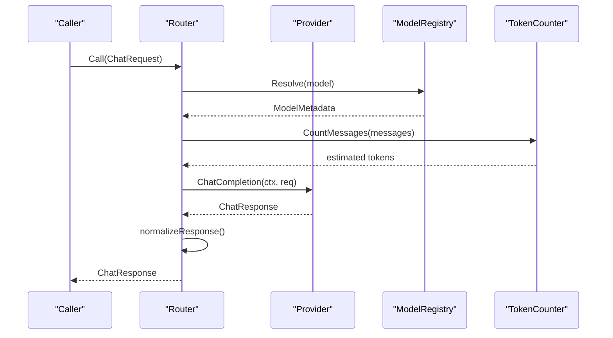

**Diagram sources**
- [router.go:219-275](file://sdk/llm/router.go#L219-L275)
- [modelregistry.go:77-137](file://sdk/llm/modelregistry.go#L77-L137)
- [tokencount.go:38-51](file://sdk/llm/tokencount.go#L38-L51)
- [provider.go:14-23](file://sdk/llm/provider.go#L14-L23)

**Section sources**
- [router.go:219-275](file://sdk/llm/router.go#L219-L275)
- [modelregistry.go:77-137](file://sdk/llm/modelregistry.go#L77-L137)
- [tokencount.go:38-51](file://sdk/llm/tokencount.go#L38-L51)
- [provider.go:14-23](file://sdk/llm/provider.go#L14-L23)

## Detailed Component Analysis

### Provider Abstraction and Implementations
- Provider interface defines ChatCompletion and StreamChatCompletion plus Name.
- Router supports OpenAI, LM Studio, Anthropic, and Gemini via createProviderFromConfig.
- Provider-specific implementations:
  - OpenAIProvider: supports both Chat Completions and Responses API for Codex models; maps stop reasons and tool calls; uses schema sanitization for OpenAI strict mode.
  - AnthropicProvider: handles thinking/Reasoning, tool call IDs, and stream events; maps stop reasons; sanitizes tool IDs.
  - GeminiProvider: supports Vertex AI or Gemini API backends; maps finish reasons and tool calls; provides MetadataSource for dynamic limits.
  - LMStudioProvider: dual-path HTTP API and OpenAI-compatible streaming; SSE handling for native and OpenAI modes.

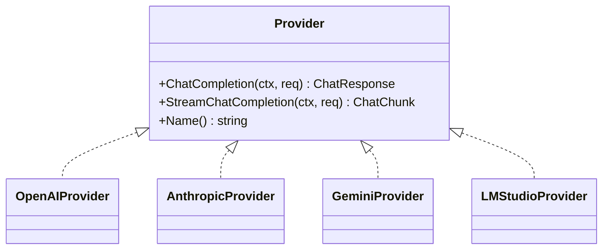

**Diagram sources**
- [provider.go:14-23](file://sdk/llm/provider.go#L14-L23)
- [provider_openai.go:20-51](file://sdk/llm/provider_openai.go#L20-L51)
- [provider_anthropic.go:27-50](file://sdk/llm/provider_anthropic.go#L27-L50)
- [provider_gemini.go:30-76](file://sdk/llm/provider_gemini.go#L30-L76)
- [provider_lmstudio.go:24-76](file://sdk/llm/provider_lmstudio.go#L24-L76)

**Section sources**
- [provider.go:14-23](file://sdk/llm/provider.go#L14-L23)
- [router.go:109-140](file://sdk/llm/router.go#L109-L140)
- [provider_openai.go:20-51](file://sdk/llm/provider_openai.go#L20-L51)
- [provider_anthropic.go:27-50](file://sdk/llm/provider_anthropic.go#L27-L50)
- [provider_gemini.go:30-76](file://sdk/llm/provider_gemini.go#L30-L76)
- [provider_lmstudio.go:24-76](file://sdk/llm/provider_lmstudio.go#L24-L76)

### Model Registry and Metadata Resolution
- Multi-tier resolution:
  1) Overrides (user config)
  2) Built-in registry (hardcoded)
  3) Cache (in-memory)
  4) HuggingFace API lookup (lazy, cached)
  5) Registered sources (e.g., LM Studio, Gemini)
  6) Fallback defaults
- Provides ContextWindow, OutputLimit, TokenizerType, Family, and Capabilities.
- RegisterSource allows providers to contribute metadata dynamically.

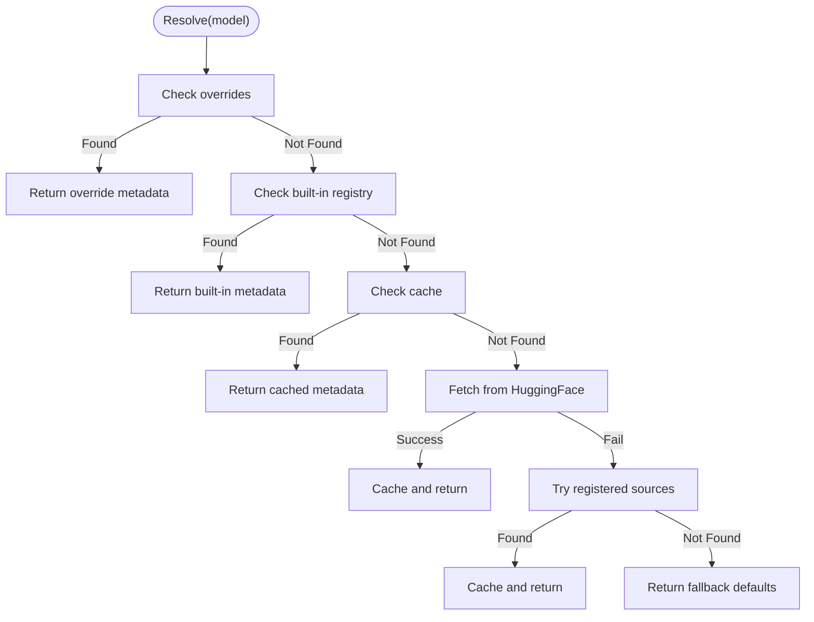

**Diagram sources**
- [modelregistry.go:77-137](file://sdk/llm/modelregistry.go#L77-L137)
- [modelregistry.go:163-210](file://sdk/llm/modelregistry.go#L163-L210)
- [modelregistry.go:155-161](file://sdk/llm/modelregistry.go#L155-L161)

**Section sources**
- [modelregistry.go:42-137](file://sdk/llm/modelregistry.go#L42-L137)
- [modelregistry.go:163-210](file://sdk/llm/modelregistry.go#L163-L210)
- [modelregistry.go:155-161](file://sdk/llm/modelregistry.go#L155-L161)

### Router, Retries, and Context Window Validation
- Creates provider from config (OpenAI, LM Studio, Anthropic, Gemini).
- Applies default temperature based on model family and SamplingFunc.
- Validates context window using ModelRegistry and TokenCounter with safety margin and output token reserve.
- Retries on retryable errors with exponential backoff and jitter.
- Normalizes response (trimming whitespace).

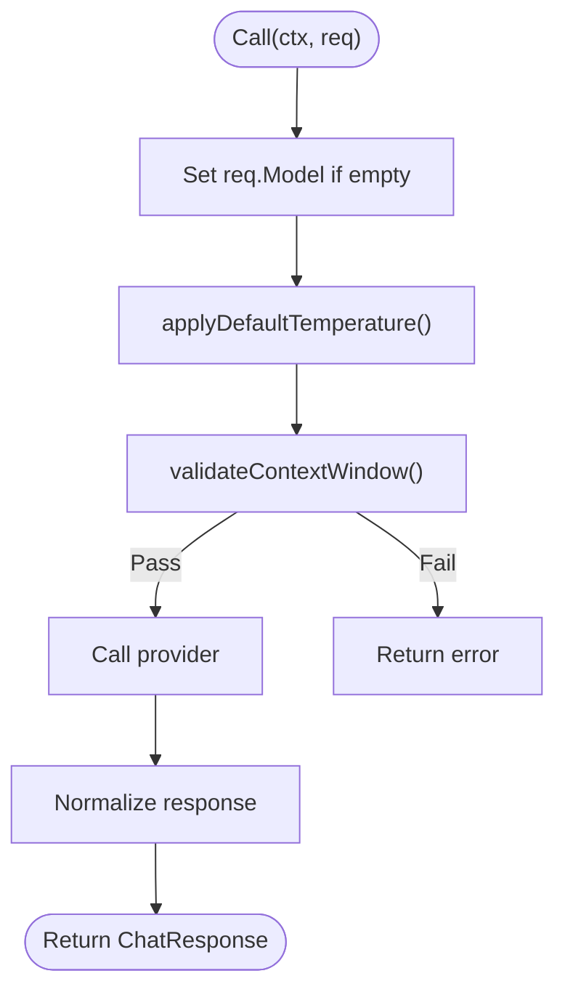

**Diagram sources**
- [router.go:219-275](file://sdk/llm/router.go#L219-L275)
- [router.go:194-217](file://sdk/llm/router.go#L194-L217)
- [router.go:157-192](file://sdk/llm/router.go#L157-L192)

**Section sources**
- [router.go:219-275](file://sdk/llm/router.go#L219-L275)
- [router.go:194-217](file://sdk/llm/router.go#L194-L217)
- [router.go:157-192](file://sdk/llm/router.go#L157-L192)

### Token Counting and Usage Tracking
- TokenCounter: SimpleTokenCounter (approximate) and TiktokenCounter (accurate for OpenAI).
- NewTokenCounter selects counter by tokenizer type with fallback.
- ContextTokenTracker: predictive + API-corrected usage tracking.
- UsageTracker: accumulates totals and notifies observers; TrackingCaller integrates with Router to record usage and correct context tracker.

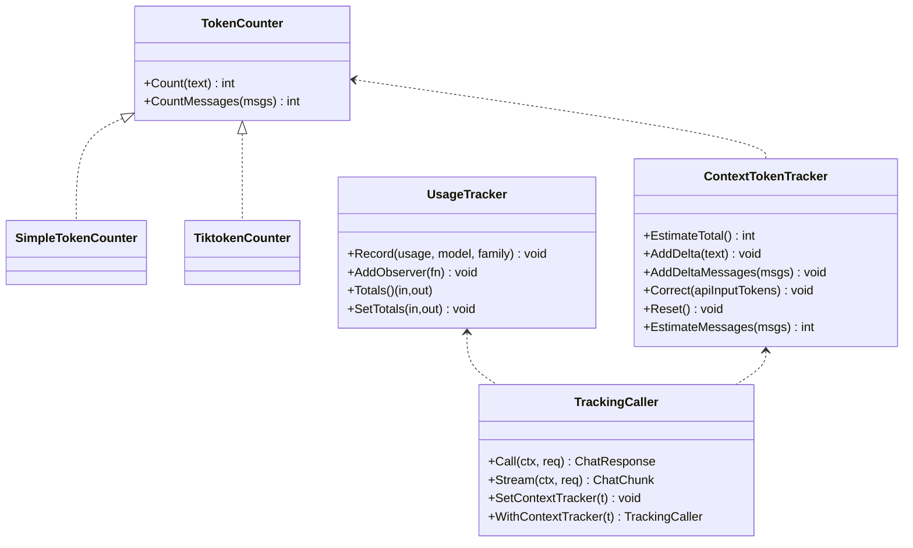

**Diagram sources**
- [tokencount.go:11-121](file://sdk/llm/tokencount.go#L11-L121)
- [tokencount.go:123-184](file://sdk/llm/tokencount.go#L123-L184)
- [usage.go:14-87](file://sdk/llm/usage.go#L14-L87)
- [usage.go:89-161](file://sdk/llm/usage.go#L89-L161)

**Section sources**
- [tokencount.go:11-121](file://sdk/llm/tokencount.go#L11-L121)
- [tokencount.go:123-184](file://sdk/llm/tokencount.go#L123-L184)
- [usage.go:14-87](file://sdk/llm/usage.go#L14-L87)
- [usage.go:89-161](file://sdk/llm/usage.go#L89-L161)

### Reasoning System Integration
- ReasoningEffort levels map to provider-specific parameters:
  - OpenAI: reasoning_effort ("low", "medium", "high")
  - Anthropic: budget in tokens
  - Gemini: thinking_level and optional thinking_budget
- Router applies reasoning effort when set; providers propagate reasoning content to the Reasoning field.

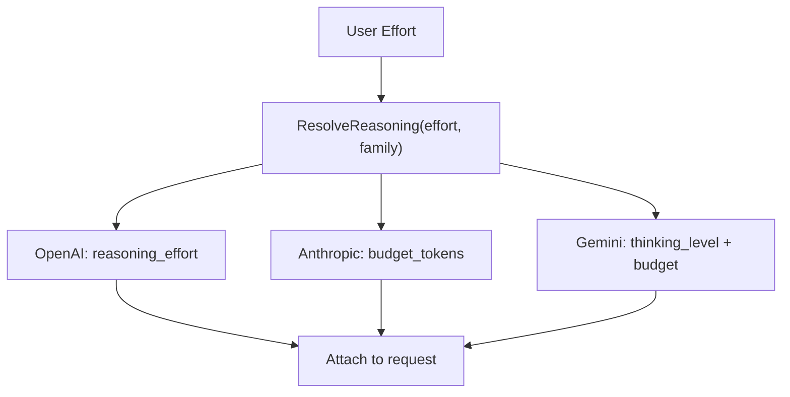

**Diagram sources**
- [reasoning.go:28-89](file://sdk/llm/reasoning.go#L28-L89)
- [router.go:194-217](file://sdk/llm/router.go#L194-L217)

**Section sources**
- [reasoning.go:28-89](file://sdk/llm/reasoning.go#L28-L89)
- [router.go:194-217](file://sdk/llm/router.go#L194-L217)

### Provider-Specific Optimizations and Message Formatting
- OpenAIProvider:
  - Uses Responses API for Codex models; falls back to Chat Completions otherwise.
  - Converts internal messages to OpenAI format; handles tool calls and stop reasons.
  - Sanitizes schemas for OpenAI strict mode.
- AnthropicProvider:
  - Supports thinking with budget tokens; disables temperature when thinking is enabled.
  - Sanitizes tool call IDs to allowed character set.
  - Streams thinking deltas and tool call arguments.
- GeminiProvider:
  - Supports Vertex AI or Gemini API backends.
  - Maps finish reasons and extracts tool calls; provides MetadataSource for dynamic limits.
- LMStudioProvider:
  - Dual-path: native SSE and OpenAI-compatible SSE.
  - Handles tool call accumulation across SSE events; supports reasoning deltas.

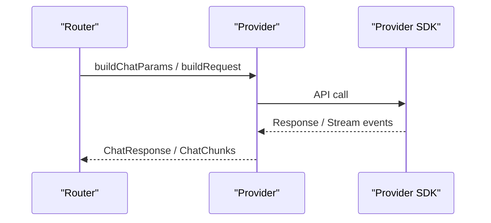

**Diagram sources**
- [provider_openai.go:149-192](file://sdk/llm/provider_openai.go#L149-L192)
- [provider_anthropic.go:173-233](file://sdk/llm/provider_anthropic.go#L173-L233)
- [provider_gemini.go:189-244](file://sdk/llm/provider_gemini.go#L189-L244)
- [provider_lmstudio.go:494-543](file://sdk/llm/provider_lmstudio.go#L494-L543)

**Section sources**
- [provider_openai.go:149-192](file://sdk/llm/provider_openai.go#L149-L192)
- [provider_openai.go:216-279](file://sdk/llm/provider_openai.go#L216-L279)
- [provider_openai_responses.go:31-161](file://sdk/llm/provider_openai_responses.go#L31-L161)
- [provider_anthropic.go:173-233](file://sdk/llm/provider_anthropic.go#L173-L233)
- [provider_anthropic.go:235-275](file://sdk/llm/provider_anthropic.go#L235-L275)
- [provider_gemini.go:189-244](file://sdk/llm/provider_gemini.go#L189-L244)
- [provider_gemini.go:247-298](file://sdk/llm/provider_gemini.go#L247-L298)
- [provider_lmstudio.go:494-543](file://sdk/llm/provider_lmstudio.go#L494-L543)
- [provider_lmstudio.go:648-680](file://sdk/llm/provider_lmstudio.go#L648-L680)

### Schema Sanitization and Stop Reason Mapping
- SanitizeSchemaForGemini: enforces Gemini constraints (enums to strings, properties/required for objects, array items type, removal of unsupported keywords).
- SanitizeSchemaForOpenAI: resolves $ref against $defs, enforces strict mode (additionalProperties false, required normalized).
- MapStopReason: standardizes stop reasons across providers.

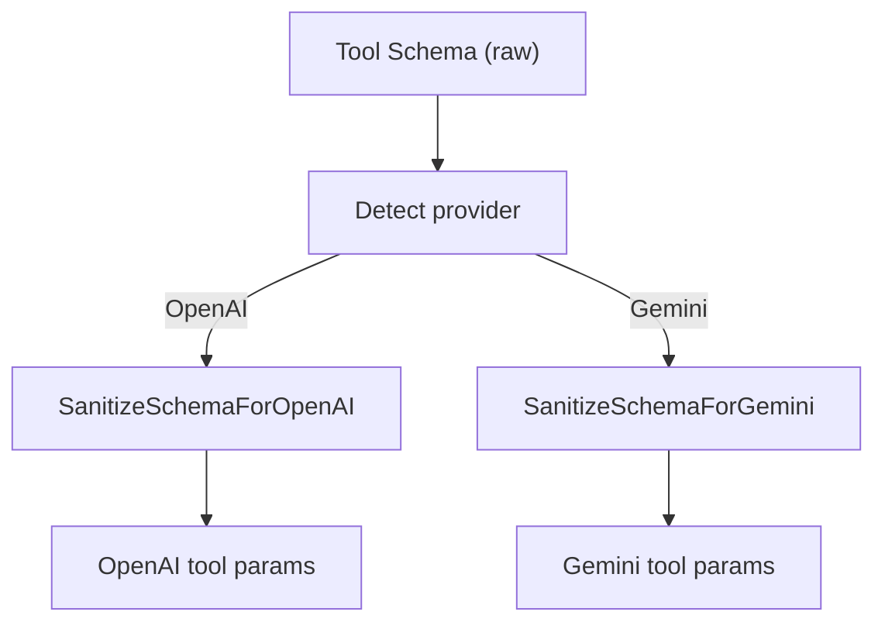

**Diagram sources**
- [schema_sanitize.go:9-432](file://sdk/llm/schema_sanitize.go#L9-L432)
- [provider_helpers.go:5-24](file://sdk/llm/provider_helpers.go#L5-L24)

**Section sources**
- [schema_sanitize.go:9-432](file://sdk/llm/schema_sanitize.go#L9-L432)
- [provider_helpers.go:5-24](file://sdk/llm/provider_helpers.go#L5-L24)

### Error Handling and Retry Logic
- Error wraps provider errors with provider name, HTTP status, and retryable flag.
- IsRetryable walks the error chain to determine retry eligibility.
- WrapProviderError classifies HTTP status and network errors.
- Router retries on retryable errors with exponential backoff and jitter.

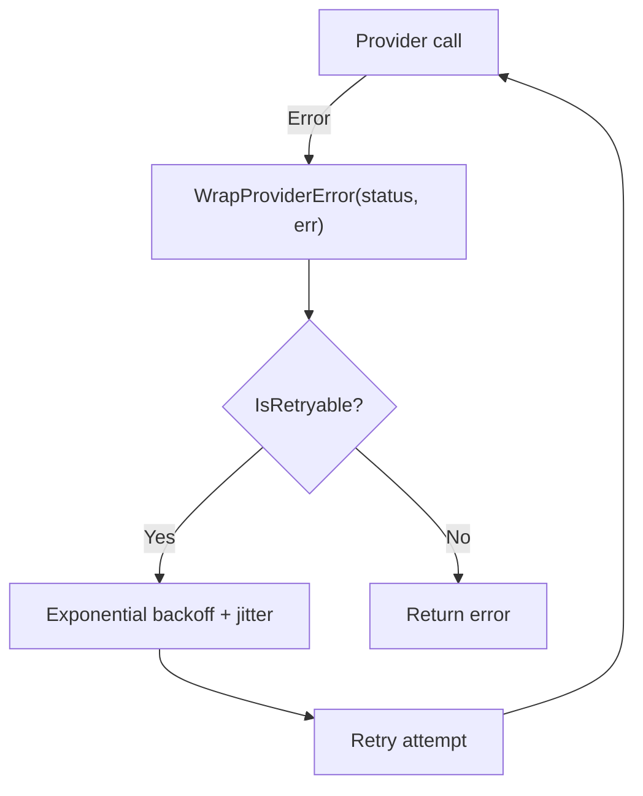

**Diagram sources**
- [errors.go:11-118](file://sdk/llm/errors.go#L11-L118)
- [router.go:234-275](file://sdk/llm/router.go#L234-L275)

**Section sources**
- [errors.go:11-118](file://sdk/llm/errors.go#L11-L118)
- [router.go:234-275](file://sdk/llm/router.go#L234-L275)

## Dependency Analysis
- Router depends on Provider interface and ModelRegistry for metadata.
- Providers depend on SDK clients and share helpers for stop reason mapping and tool call accumulation.
- TokenCounter and UsageTracker are orthogonal concerns integrated by TrackingCaller.
- ModelRegistry is extended by providers via RegisterSource for dynamic metadata.

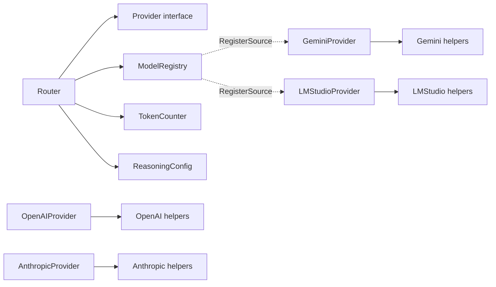

**Diagram sources**
- [router.go:32-106](file://sdk/llm/router.go#L32-L106)
- [modelregistry.go:155-161](file://sdk/llm/modelregistry.go#L155-L161)
- [provider_openai.go:20-51](file://sdk/llm/provider_openai.go#L20-L51)
- [provider_anthropic.go:27-50](file://sdk/llm/provider_anthropic.go#L27-L50)
- [provider_gemini.go:30-76](file://sdk/llm/provider_gemini.go#L30-L76)
- [provider_lmstudio.go:24-76](file://sdk/llm/provider_lmstudio.go#L24-L76)

**Section sources**
- [router.go:32-106](file://sdk/llm/router.go#L32-L106)
- [modelregistry.go:155-161](file://sdk/llm/modelregistry.go#L155-L161)
- [provider_openai.go:20-51](file://sdk/llm/provider_openai.go#L20-L51)
- [provider_anthropic.go:27-50](file://sdk/llm/provider_anthropic.go#L27-L50)
- [provider_gemini.go:30-76](file://sdk/llm/provider_gemini.go#L30-L76)
- [provider_lmstudio.go:24-76](file://sdk/llm/provider_lmstudio.go#L24-L76)

## Performance Considerations
- Prefer accurate token counting (TiktokenCounter) for OpenAI models to reduce context window overflows.
- Use safety margins and output token reserves to avoid near-limit errors.
- Enable streaming for long responses to improve latency and UX.
- Use RegisterSource for providers to avoid repeated metadata lookups.
- Tune MaxRetries and backoff parameters for network stability.

## Troubleshooting Guide
Common issues and resolutions:
- Context window exceeded: Router validates input tokens against model limits; adjust messages or increase output reserve.
- Non-retryable errors: Inspect provider status codes and network conditions; wrap errors with WrapProviderError for classification.
- Tool call parsing: Ensure tool schemas are sanitized for the target provider; verify tool call IDs meet provider constraints.
- Streaming interruptions: Check SSE event handling and finalize tool calls on finish reason.

**Section sources**
- [errors.go:90-118](file://sdk/llm/errors.go#L90-L118)
- [router.go:157-192](file://sdk/llm/router.go#L157-L192)
- [provider_helpers.go:45-99](file://sdk/llm/provider_helpers.go#L45-L99)

## Conclusion
C0WRK’s LLM integration provides a robust, extensible abstraction over multiple providers with strong metadata resolution, token accounting, and usage tracking. The Router centralizes provider selection, retries, and validation, while provider implementations encapsulate provider-specific nuances. The system is designed for easy extension and optimization.

## Appendices

### Adding a New LLM Provider
Steps:
1. Define a Provider implementation with ChatCompletion and StreamChatCompletion.
2. Add a constructor and configuration struct.
3. Map internal Message/ToolCall to provider-specific request format.
4. Convert provider responses to ChatResponse/ChatChunk.
5. Integrate with Router.createProviderFromConfig.
6. Optionally add schema sanitization and stop reason mapping.
7. Register any dynamic metadata source via ModelRegistry.RegisterSource.

Reference paths:
- [provider.go:14-23](file://sdk/llm/provider.go#L14-L23)
- [router.go:109-140](file://sdk/llm/router.go#L109-L140)
- [schema_sanitize.go:9-432](file://sdk/llm/schema_sanitize.go#L9-L432)
- [provider_helpers.go:5-24](file://sdk/llm/provider_helpers.go#L5-L24)

**Section sources**
- [provider.go:14-23](file://sdk/llm/provider.go#L14-L23)
- [router.go:109-140](file://sdk/llm/router.go#L109-L140)
- [schema_sanitize.go:9-432](file://sdk/llm/schema_sanitize.go#L9-L432)
- [provider_helpers.go:5-24](file://sdk/llm/provider_helpers.go#L5-L24)

### Configuring Existing Providers for Optimal Performance
- Choose BaseURL for OpenAI-compatible providers (e.g., DeepSeek, Grok) to route through alternate endpoints.
- Set APIKey and BaseURL for Anthropic, Gemini (with Vertex), and LM Studio.
- Adjust RouterConfig: MaxRetries, InitialBackoff, MaxBackoff, SafetyMarginPercent, OutputTokenReserve.
- Use SamplingFunc to set family-aware default temperatures.
- Enable streaming for responsive UX.

Reference paths:
- [router.go:15-29](file://sdk/llm/router.go#L15-L29)
- [router.go:53-106](file://sdk/llm/router.go#L53-L106)
- [provider_openai.go:13-46](file://sdk/llm/provider_openai.go#L13-L46)
- [provider_gemini.go:23-61](file://sdk/llm/provider_gemini.go#L23-L61)
- [provider_lmstudio.go:17-71](file://sdk/llm/provider_lmstudio.go#L17-L71)

**Section sources**
- [router.go:15-29](file://sdk/llm/router.go#L15-L29)
- [router.go:53-106](file://sdk/llm/router.go#L53-L106)
- [provider_openai.go:13-46](file://sdk/llm/provider_openai.go#L13-L46)
- [provider_gemini.go:23-61](file://sdk/llm/provider_gemini.go#L23-L61)
- [provider_lmstudio.go:17-71](file://sdk/llm/provider_lmstudio.go#L17-L71)