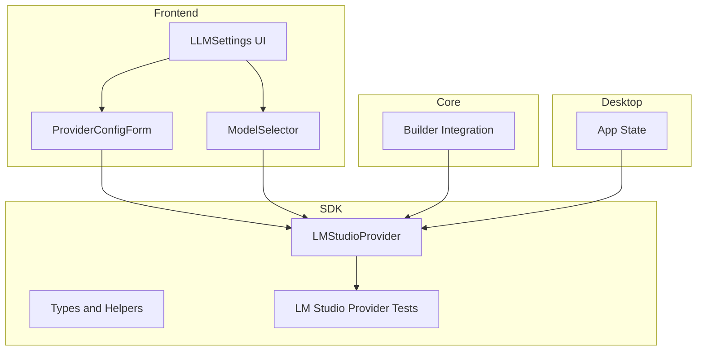
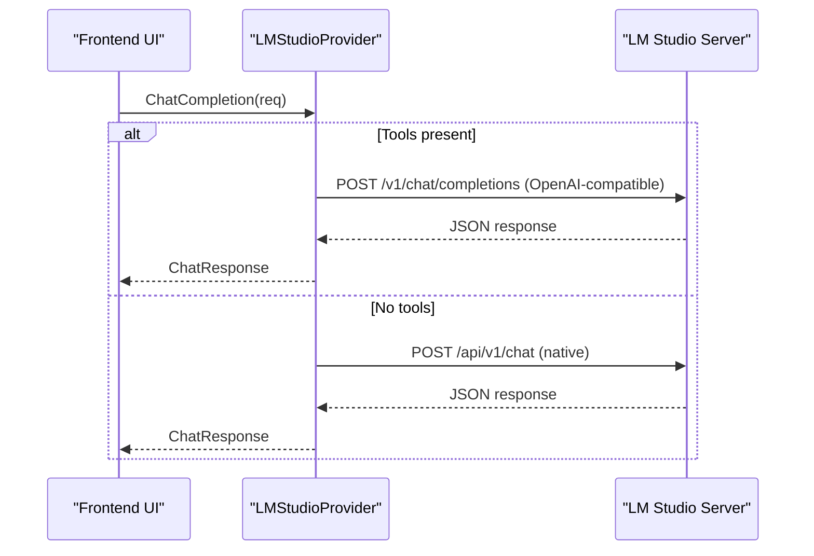
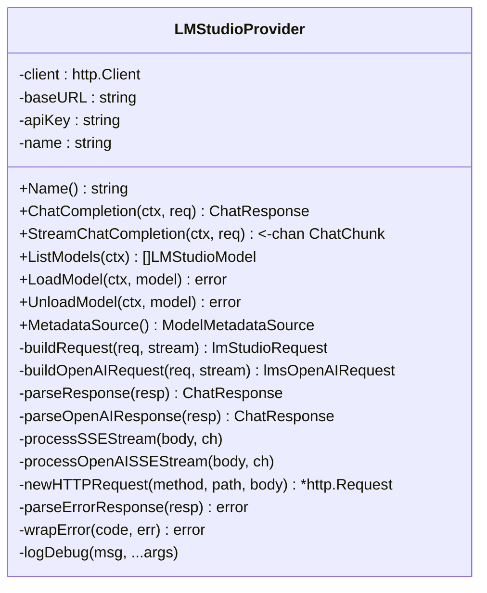
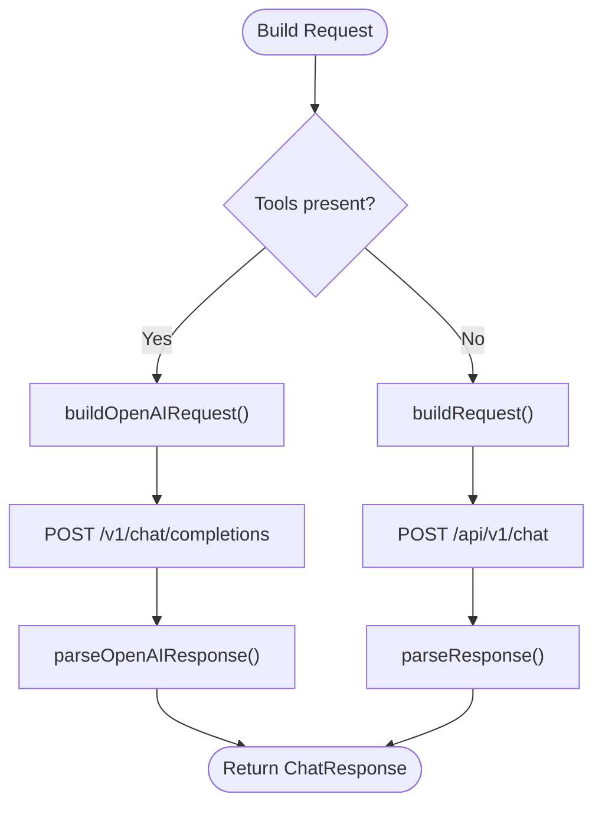
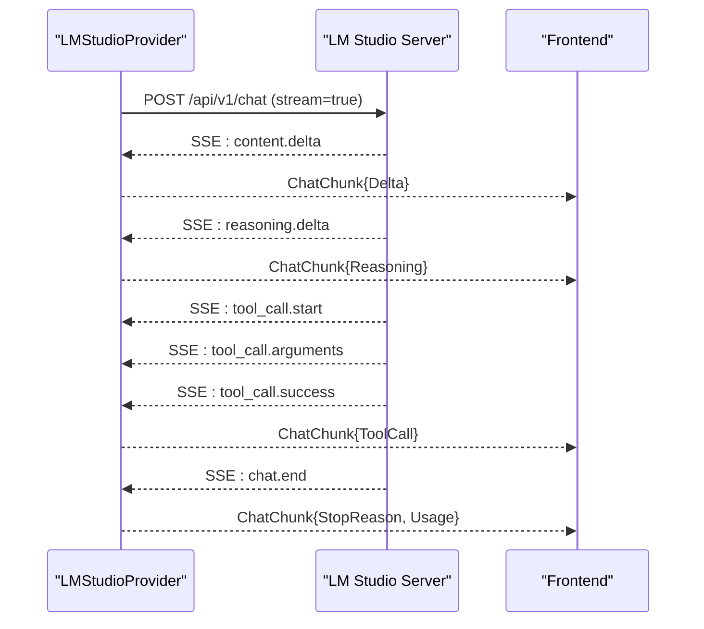
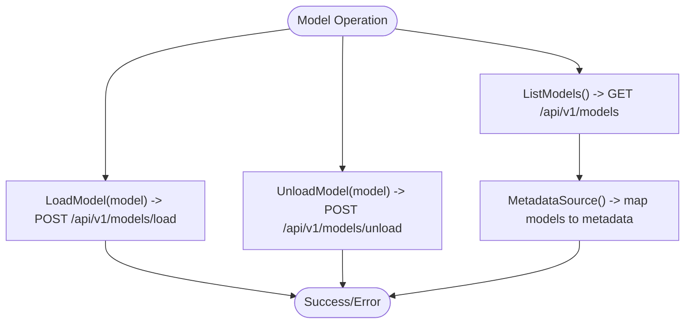
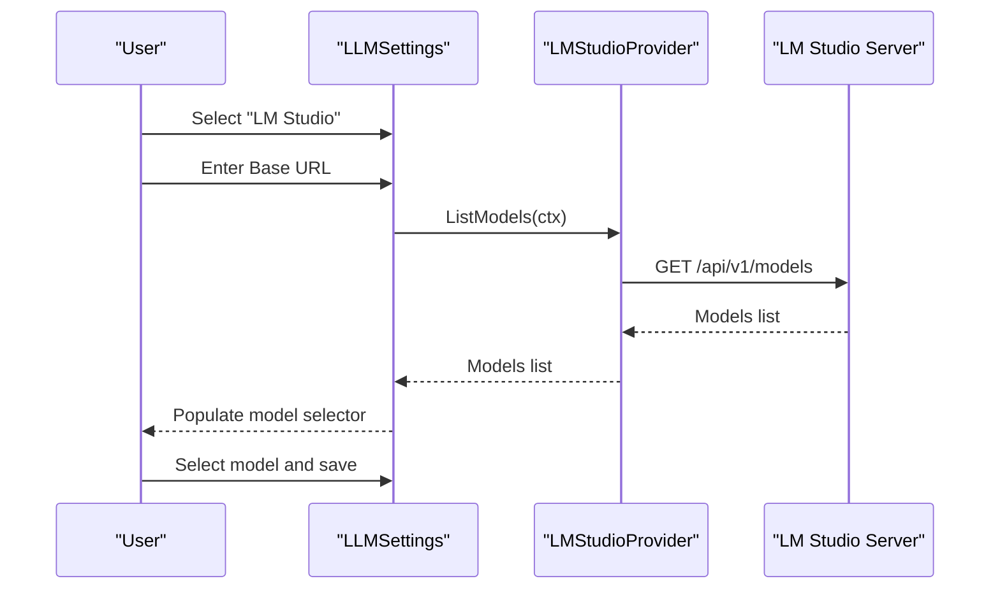
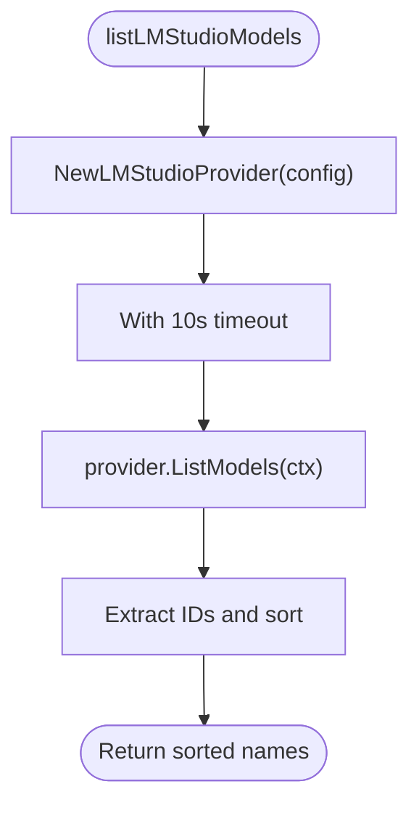
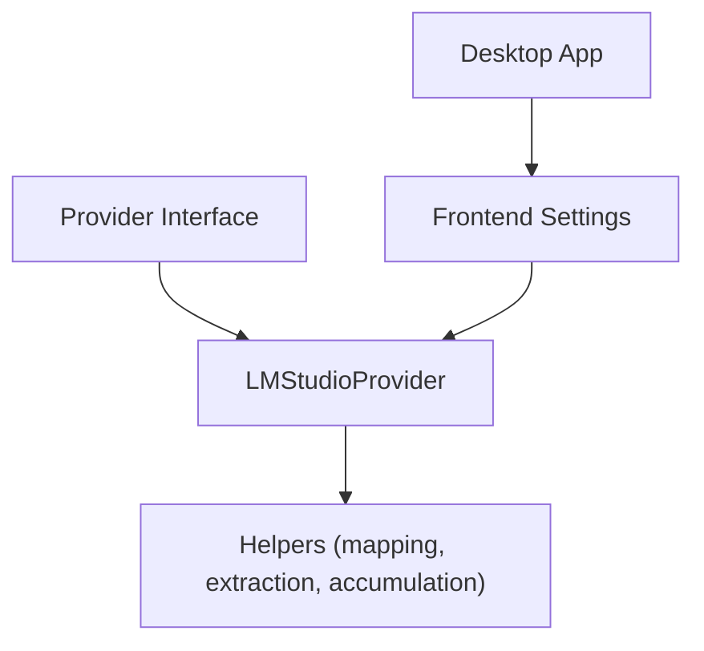

# LM Studio Provider Implementation

<cite>
**Referenced Files in This Document**
- [provider_lmstudio.go](file://sdk/llm/provider_lmstudio.go)
- [provider_lmstudio_test.go](file://sdk/llm/provider_lmstudio_test.go)
- [provider.go](file://sdk/llm/provider.go)
- [provider_helpers.go](file://sdk/llm/provider_helpers.go)
- [builder.go](file://core/builder.go)
- [LLMSettings.tsx](file://frontend/src/components/settings/LLMSettings.tsx)
- [ProviderConfigForm.tsx](file://frontend/src/components/settings/ProviderConfigForm.tsx)
- [ModelSelector.tsx](file://frontend/src/components/settings/ModelSelector.tsx)
- [app.go](file://desktop/app.go)
</cite>

## Table of Contents
1. [Introduction](#introduction)
2. [Project Structure](#project-structure)
3. [Core Components](#core-components)
4. [Architecture Overview](#architecture-overview)
5. [Detailed Component Analysis](#detailed-component-analysis)
6. [Dependency Analysis](#dependency-analysis)
7. [Performance Considerations](#performance-considerations)
8. [Troubleshooting Guide](#troubleshooting-guide)
9. [Conclusion](#conclusion)
10. [Appendices](#appendices)

## Introduction
This document explains the LM Studio local LLM provider implementation in C0WRK. It covers how the application integrates with LM Studio's native REST API and OpenAI-compatible API, how models are managed and loaded locally, and how inference is performed with support for streaming and tool-calling. It also documents the frontend configuration experience, performance characteristics, and troubleshooting guidance for local deployments.

## Project Structure
The LM Studio provider is implemented in the SDK layer and integrated with the desktop application and frontend settings UI. The key areas are:
- SDK provider implementation and tests
- Frontend settings for configuring LM Studio
- Core builder integration for model discovery
- Desktop application scaffolding

**Diagram sources**
- [LLMSettings.tsx:24-263](file://frontend/src/components/settings/LLMSettings.tsx#L24-L263)
- [ProviderConfigForm.tsx:22-86](file://frontend/src/components/settings/ProviderConfigForm.tsx#L22-L86)
- [ModelSelector.tsx:14-62](file://frontend/src/components/settings/ModelSelector.tsx#L14-L62)
- [provider_lmstudio.go:24-76](file://sdk/llm/provider_lmstudio.go#L24-L76)
- [provider_helpers.go:1-140](file://sdk/llm/provider_helpers.go#L1-L140)
- [builder.go:699-722](file://core/builder.go#L699-L722)
- [app.go:18-73](file://desktop/app.go#L18-L73)

**Section sources**
- [provider_lmstudio.go:1-905](file://sdk/llm/provider_lmstudio.go#L1-L905)
- [LLMSettings.tsx:1-264](file://frontend/src/components/settings/LLMSettings.tsx#L1-L264)
- [ProviderConfigForm.tsx:1-87](file://frontend/src/components/settings/ProviderConfigForm.tsx#L1-L87)
- [ModelSelector.tsx:1-62](file://frontend/src/components/settings/ModelSelector.tsx#L1-L62)
- [builder.go:699-722](file://core/builder.go#L699-L722)
- [app.go:18-73](file://desktop/app.go#L18-L73)

## Core Components
- LMStudioProvider: Implements the Provider interface for LM Studio, supporting both native API and OpenAI-compatible endpoints.
- Request/Response types: Define the wire formats for LM Studio v1 and OpenAI-compatible APIs.
- Streaming: SSE parsing for native API and OpenAI-compatible streaming.
- Model management: Listing, loading, and unloading models via LM Studio endpoints.
- Metadata source: Resolves model metadata (context window, output limits) from the server.
- Frontend integration: Settings UI for Base URL/API key and model selection.

Key responsibilities:
- Translate SDK request types to LM Studio wire formats
- Parse LM Studio responses and SSE events into SDK response types
- Manage model lifecycle on the LM Studio server
- Provide model metadata for context window checks

**Section sources**
- [provider_lmstudio.go:17-905](file://sdk/llm/provider_lmstudio.go#L17-L905)
- [provider.go:12-24](file://sdk/llm/provider.go#L12-L24)
- [provider_helpers.go:1-140](file://sdk/llm/provider_helpers.go#L1-L140)

## Architecture Overview
The LM Studio provider sits between the C0WRK frontend and the LM Studio server. Requests are routed either to LM Studio's native API or OpenAI-compatible API depending on whether tool-calling is required. Streaming is supported via SSE for both paths.

**Diagram sources**
- [provider_lmstudio.go:231-290](file://sdk/llm/provider_lmstudio.go#L231-L290)

**Section sources**
- [provider_lmstudio.go:231-290](file://sdk/llm/provider_lmstudio.go#L231-L290)

## Detailed Component Analysis

### LMStudioProvider Class
The provider encapsulates HTTP client configuration, endpoint routing, request construction, response parsing, and streaming event handling.

**Diagram sources**
- [provider_lmstudio.go:24-800](file://sdk/llm/provider_lmstudio.go#L24-L800)

**Section sources**
- [provider_lmstudio.go:24-800](file://sdk/llm/provider_lmstudio.go#L24-L800)

### Request Construction and Routing
- Native API: Uses /api/v1/chat with a structured input combining system prompt and conversation history.
- OpenAI-compatible: Uses /v1/chat/completions when tools are present, converting SDK messages to OpenAI format.
- Temperature, max tokens, and streaming flags are passed through appropriately.

**Diagram sources**
- [provider_lmstudio.go:494-646](file://sdk/llm/provider_lmstudio.go#L494-L646)
- [provider_lmstudio.go:265-290](file://sdk/llm/provider_lmstudio.go#L265-L290)
- [provider_lmstudio.go:596-680](file://sdk/llm/provider_lmstudio.go#L596-L680)

**Section sources**
- [provider_lmstudio.go:494-680](file://sdk/llm/provider_lmstudio.go#L494-L680)

### Streaming Support
- Native API streaming: SSE events include content.delta, reasoning.delta, tool_call.* events, and chat.end.
- OpenAI-compatible streaming: SSE-like chunks with delta content, reasoning content, tool_calls, and usage updates.
- Tool call accumulation: Tracks partial tool calls across deltas and emits complete calls upon finish.

**Diagram sources**
- [provider_lmstudio.go:360-492](file://sdk/llm/provider_lmstudio.go#L360-L492)
- [provider_lmstudio.go:682-746](file://sdk/llm/provider_lmstudio.go#L682-L746)
- [provider_helpers.go:45-94](file://sdk/llm/provider_helpers.go#L45-L94)

**Section sources**
- [provider_lmstudio.go:360-492](file://sdk/llm/provider_lmstudio.go#L360-L492)
- [provider_lmstudio.go:682-746](file://sdk/llm/provider_lmstudio.go#L682-L746)
- [provider_helpers.go:45-94](file://sdk/llm/provider_helpers.go#L45-L94)

### Model Management
- List models: GET /api/v1/models returns model descriptors with ID, type, display name, architecture, and max context length.
- Load model: POST /api/v1/models/load triggers model loading on the server.
- Unload model: POST /api/v1/models/unload releases the model.
- Metadata source: Queries models and returns context window, output limit, and tokenizer type for a given model ID.

**Diagram sources**
- [provider_lmstudio.go:802-875](file://sdk/llm/provider_lmstudio.go#L802-L875)
- [provider_lmstudio.go:877-904](file://sdk/llm/provider_lmstudio.go#L877-L904)

**Section sources**
- [provider_lmstudio.go:802-904](file://sdk/llm/provider_lmstudio.go#L802-L904)

### Frontend Integration
The frontend provides a settings UI for selecting the LM Studio provider, entering Base URL, and choosing a model. It supports applying credentials to fetch model lists and saving settings.

**Diagram sources**
- [LLMSettings.tsx:24-263](file://frontend/src/components/settings/LLMSettings.tsx#L24-L263)
- [ProviderConfigForm.tsx:22-86](file://frontend/src/components/settings/ProviderConfigForm.tsx#L22-L86)
- [ModelSelector.tsx:14-62](file://frontend/src/components/settings/ModelSelector.tsx#L14-L62)
- [provider_lmstudio.go:802-833](file://sdk/llm/provider_lmstudio.go#L802-L833)

**Section sources**
- [LLMSettings.tsx:1-264](file://frontend/src/components/settings/LLMSettings.tsx#L1-L264)
- [ProviderConfigForm.tsx:1-87](file://frontend/src/components/settings/ProviderConfigForm.tsx#L1-L87)
- [ModelSelector.tsx:1-62](file://frontend/src/components/settings/ModelSelector.tsx#L1-L62)
- [provider_lmstudio.go:802-833](file://sdk/llm/provider_lmstudio.go#L802-L833)

### Core Builder Integration
The core builder can discover available LM Studio models by creating a temporary provider and listing models, then sorting the names for display.

**Diagram sources**
- [builder.go:699-722](file://core/builder.go#L699-L722)

**Section sources**
- [builder.go:699-722](file://core/builder.go#L699-L722)

## Dependency Analysis
- Provider interface: Defines the contract for all LLM providers, ensuring consistent behavior across implementations.
- Helper utilities: Provide stop reason mapping, system prompt extraction, and tool-call accumulation for streaming.
- Frontend settings: Drive configuration and model selection, invoking provider methods to list and apply models.
- Desktop application: Serves as the host for the UI and configuration persistence.

**Diagram sources**
- [provider.go:12-24](file://sdk/llm/provider.go#L12-L24)
- [provider_lmstudio.go:24-800](file://sdk/llm/provider_lmstudio.go#L24-L800)
- [provider_helpers.go:1-140](file://sdk/llm/provider_helpers.go#L1-L140)
- [LLMSettings.tsx:24-263](file://frontend/src/components/settings/LLMSettings.tsx#L24-L263)
- [app.go:18-73](file://desktop/app.go#L18-L73)

**Section sources**
- [provider.go:12-24](file://sdk/llm/provider.go#L12-L24)
- [provider_lmstudio.go:24-800](file://sdk/llm/provider_lmstudio.go#L24-L800)
- [provider_helpers.go:1-140](file://sdk/llm/provider_helpers.go#L1-L140)
- [LLMSettings.tsx:24-263](file://frontend/src/components/settings/LLMSettings.tsx#L24-L263)
- [app.go:18-73](file://desktop/app.go#L18-L73)

## Performance Considerations
- HTTP client tuning: The provider sets timeouts and transport parameters suitable for local inference scenarios.
- Streaming buffers: Scanner buffers are sized to handle larger SSE lines during streaming.
- Tool-call accumulation: Efficiently aggregates incremental tool-call deltas to minimize overhead.
- Model metadata caching: MetadataSource queries models on demand; consider caching at higher layers if frequent lookups occur.

[No sources needed since this section provides general guidance]

## Troubleshooting Guide
Common issues and resolutions:
- Connection failures: Verify Base URL points to the running LM Studio server and network connectivity.
- Authentication: LM Studio does not require API keys in the provider; ensure server configuration allows local access.
- Model not found: Confirm the model is installed and visible via ListModels; use LoadModel to load if necessary.
- Streaming errors: Check SSE event parsing and ensure the server emits valid events; review error events in streams.
- Tool-calling not working: Ensure tools are provided in the request; the provider automatically routes to OpenAI-compatible endpoint when tools are present.

**Section sources**
- [provider_lmstudio_test.go:1387-1422](file://sdk/llm/provider_lmstudio_test.go#L1387-L1422)
- [provider_lmstudio.go:775-791](file://sdk/llm/provider_lmstudio.go#L775-L791)

## Conclusion
The LM Studio provider in C0WRK offers a robust integration with LM Studio's native and OpenAI-compatible APIs, supporting both synchronous and streaming inference, tool-calling, and model lifecycle management. The frontend provides a straightforward configuration experience, while the SDK ensures reliable request routing, response parsing, and streaming event handling. This enables secure, private, local inference with flexible model management.

[No sources needed since this section summarizes without analyzing specific files]

## Appendices

### Setup Instructions
- Install LM Studio locally and start the server.
- Configure the Base URL in the LLM settings to point to the running server.
- Optionally enter an API key if required by your server configuration.
- Apply the configuration to fetch available models and select a model for inference.

**Section sources**
- [LLMSettings.tsx:24-263](file://frontend/src/components/settings/LLMSettings.tsx#L24-L263)
- [ProviderConfigForm.tsx:22-86](file://frontend/src/components/settings/ProviderConfigForm.tsx#L22-L86)

### Local Deployment Requirements
- Hardware: Ensure sufficient CPU/GPU resources for the selected model size.
- Storage: Adequate disk space for model files and temporary artifacts.
- Network: Local access to the LM Studio server; no external cloud dependencies.

[No sources needed since this section provides general guidance]

### Advantages of Local Inference
- Privacy: All data remains on-device; no external transmission.
- Latency: Reduced latency compared to remote APIs for local workloads.
- Cost: Eliminates per-request costs associated with hosted LLMs.

[No sources needed since this section provides general guidance]