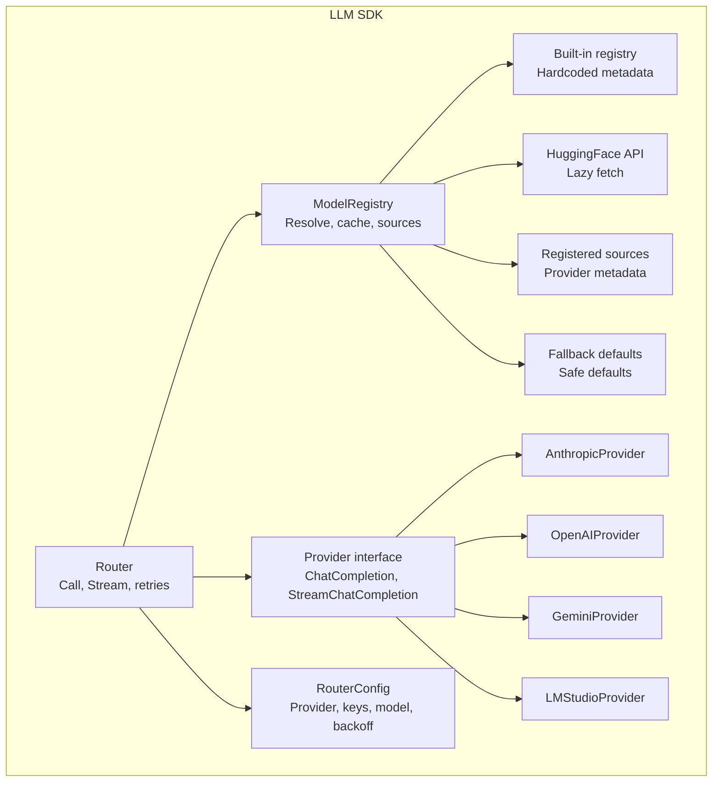
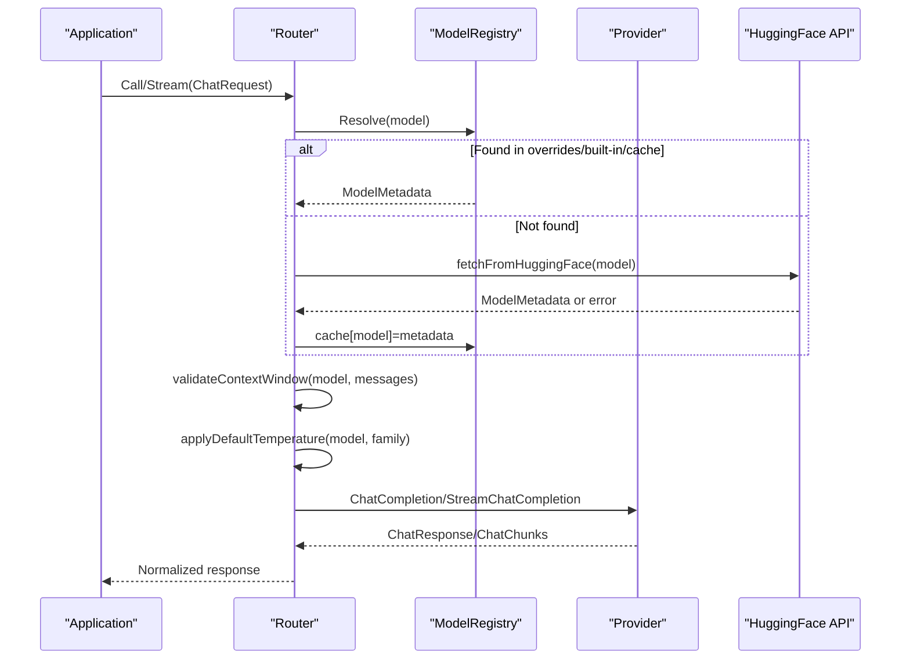
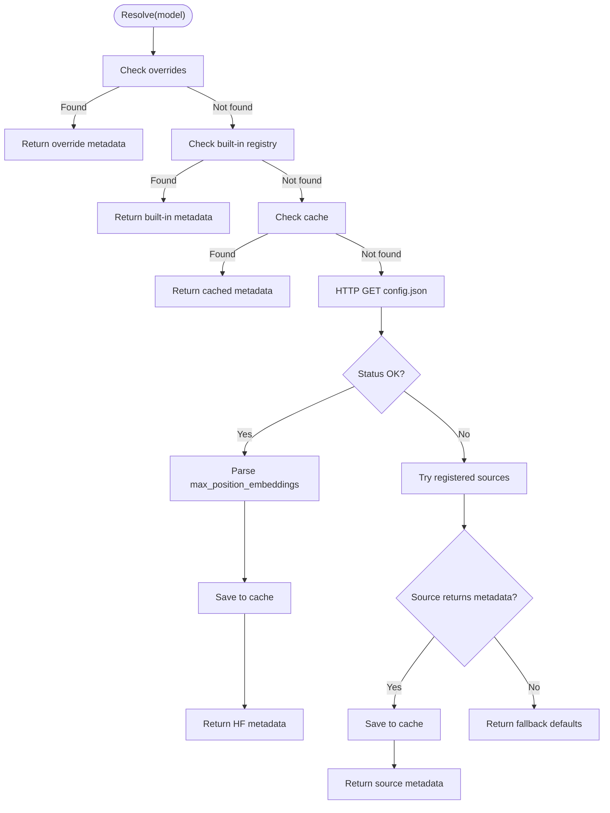
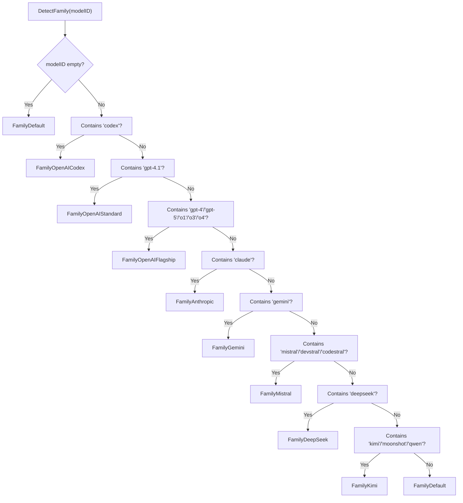
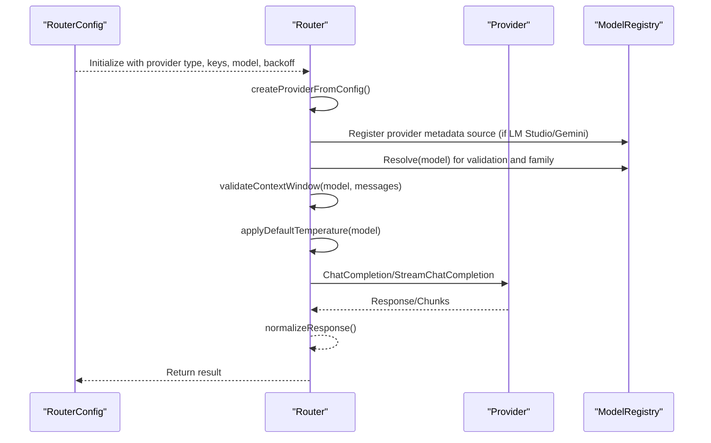
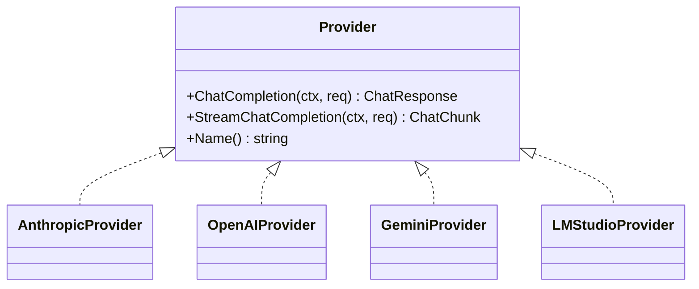
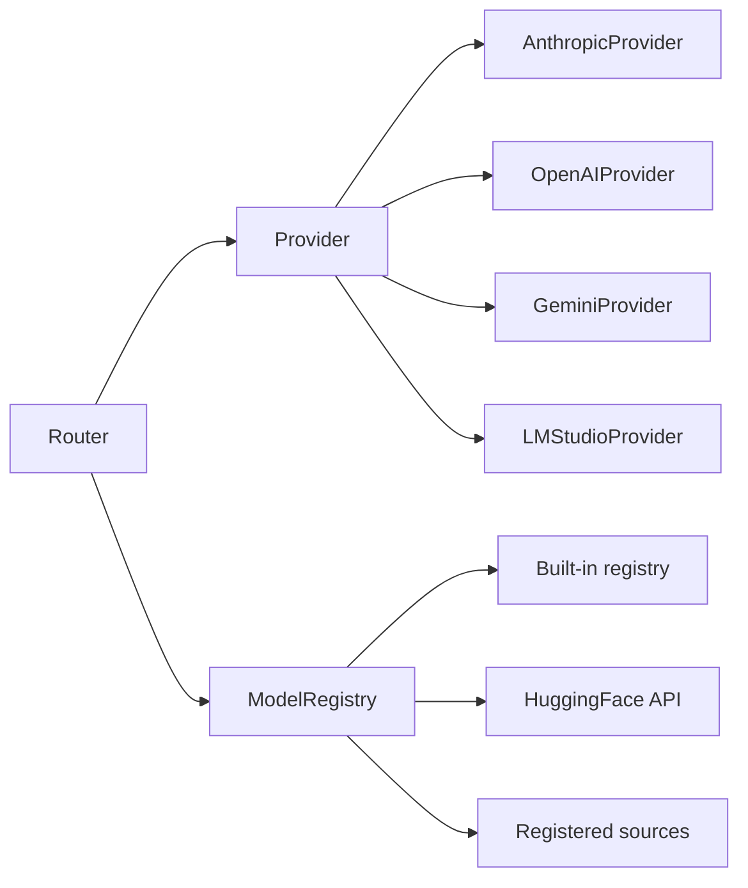

# Model Registry and Routing

<cite>
**Referenced Files in This Document**
- [modelregistry.go](file://sdk/llm/modelregistry.go)
- [router.go](file://sdk/llm/router.go)
- [family.go](file://sdk/llm/family.go)
- [provider.go](file://sdk/llm/provider.go)
- [provider_anthropic.go](file://sdk/llm/provider_anthropic.go)
- [provider_openai.go](file://sdk/llm/provider_openai.go)
- [provider_gemini.go](file://sdk/llm/provider_gemini.go)
- [provider_lmstudio.go](file://sdk/llm/provider_lmstudio.go)
- [provider_helpers.go](file://sdk/llm/provider_helpers.go)
- [message.go](file://sdk/llm/message.go)
- [config.example.yaml](file://config.example.yaml)
- [router_test.go](file://sdk/llm/router_test.go)
</cite>

## Table of Contents
1. [Introduction](#introduction)
2. [Project Structure](#project-structure)
3. [Core Components](#core-components)
4. [Architecture Overview](#architecture-overview)
5. [Detailed Component Analysis](#detailed-component-analysis)
6. [Dependency Analysis](#dependency-analysis)
7. [Performance Considerations](#performance-considerations)
8. [Troubleshooting Guide](#troubleshooting-guide)
9. [Conclusion](#conclusion)
10. [Appendices](#appendices)

## Introduction
This document explains the model registry and routing system used by C0WRK’s LLM integration. It covers how models are discovered, categorized into families, validated for context windows, and routed to providers. It also documents the fallback mechanisms, dynamic metadata sourcing, and the router’s retry/backoff behavior. Configuration examples for model aliases, provider priorities, and custom routing rules are included, along with guidance on model discovery, validation, and runtime updates.

## Project Structure
The model registry and routing logic resides in the LLM SDK under sdk/llm. Key files include:
- Model registry and metadata resolution
- Router and provider abstraction
- Provider implementations for Anthropic, OpenAI-compatible, Gemini, and LM Studio
- Message types and shared helpers
- Example configuration for LLM providers and router behavior

**Diagram sources**
- [modelregistry.go:42-137](file://sdk/llm/modelregistry.go#L42-L137)
- [router.go:31-107](file://sdk/llm/router.go#L31-L107)
- [provider.go:12-23](file://sdk/llm/provider.go#L12-L23)
- [provider_anthropic.go:27-45](file://sdk/llm/provider_anthropic.go#L27-L45)
- [provider_openai.go:20-46](file://sdk/llm/provider_openai.go#L20-L46)
- [provider_gemini.go:30-61](file://sdk/llm/provider_gemini.go#L30-L61)
- [provider_lmstudio.go:24-71](file://sdk/llm/provider_lmstudio.go#L24-L71)

**Section sources**
- [modelregistry.go:42-137](file://sdk/llm/modelregistry.go#L42-L137)
- [router.go:31-107](file://sdk/llm/router.go#L31-L107)
- [provider.go:12-23](file://sdk/llm/provider.go#L12-L23)

## Core Components
- ModelRegistry: Centralized metadata resolution with five tiers (overrides, built-in, HuggingFace, registered sources, fallback). Supports caching and dynamic registration of metadata sources.
- ModelFamily: Enumerated categories for prompt and parameter adaptation (e.g., openai_flagship, openai_standard, anthropic, gemini, mistral, deepseek, openai_codex, kimi, default).
- Router: Unified entry point for LLM calls, with pre-call context window validation, family-aware temperature defaults, retry/backoff, and streaming support.
- Provider: Abstraction over multiple LLM backends (Anthropic, OpenAI-compatible, Gemini, LM Studio), each implementing chat and streaming completion methods.

**Section sources**
- [modelregistry.go:16-50](file://sdk/llm/modelregistry.go#L16-L50)
- [family.go:5-18](file://sdk/llm/family.go#L5-L18)
- [router.go:31-47](file://sdk/llm/router.go#L31-L47)
- [provider.go:12-23](file://sdk/llm/provider.go#L12-L23)

## Architecture Overview
The routing pipeline integrates configuration-driven provider selection with model metadata resolution and robust retry logic.

**Diagram sources**
- [router.go:219-275](file://sdk/llm/router.go#L219-L275)
- [modelregistry.go:163-210](file://sdk/llm/modelregistry.go#L163-L210)

## Detailed Component Analysis

### Model Registry and Metadata Resolution
- Five-tier resolution:
  1) Overrides: User-provided model metadata in configuration.
  2) Built-in: Hardcoded registry for popular models.
  3) HuggingFace: Lazy fetch of config.json for max_position_embeddings.
  4) Registered sources: Providers expose metadata sources (e.g., LM Studio, Gemini).
  5) Fallback defaults: Safe defaults when unknown.
- Caching: Metadata fetched from HuggingFace and registered sources is cached.
- Dynamic updates: Invalidate cache to refresh metadata mid-session.

**Diagram sources**
- [modelregistry.go:68-137](file://sdk/llm/modelregistry.go#L68-L137)
- [modelregistry.go:163-210](file://sdk/llm/modelregistry.go#L163-L210)

**Section sources**
- [modelregistry.go:42-144](file://sdk/llm/modelregistry.go#L42-L144)
- [modelregistry.go:212-531](file://sdk/llm/modelregistry.go#L212-L531)

### Model Family Categorization
- DetectFamily assigns a family based on model ID patterns, enabling:
  - Prompt and parameter adaptation
  - Capability checks (e.g., temperature acceptance)
  - Reasoning effort mapping per provider
- Families include anthropic, openai_flagship, openai_standard, gemini, mistral, deepseek, openai_codex, kimi, default.

**Diagram sources**
- [family.go:20-73](file://sdk/llm/family.go#L20-L73)

**Section sources**
- [family.go:5-18](file://sdk/llm/family.go#L5-L18)
- [family.go:20-73](file://sdk/llm/family.go#L20-L73)

### Router Implementation and Automatic Routing
- RouterConfig: Defines active provider, API key/base URL, default model, retry/backoff, safety margin, output token reserve, and optional family-aware sampling function.
- Provider creation: Based on provider type, constructs the active provider and registers metadata sources when applicable (e.g., LM Studio, Gemini).
- Pre-call validation: Validates context window against model metadata and applies a safety margin.
- Temperature defaults: Applies family-aware defaults when not explicitly set and supported by the model.
- Retries: Exponential backoff with jitter and configurable caps; respects context cancellation.

**Diagram sources**
- [router.go:49-107](file://sdk/llm/router.go#L49-L107)
- [router.go:109-140](file://sdk/llm/router.go#L109-L140)
- [router.go:157-217](file://sdk/llm/router.go#L157-L217)
- [router.go:219-275](file://sdk/llm/router.go#L219-L275)

**Section sources**
- [router.go:15-47](file://sdk/llm/router.go#L15-L47)
- [router.go:49-107](file://sdk/llm/router.go#L49-L107)
- [router.go:157-217](file://sdk/llm/router.go#L157-L217)
- [router.go:219-275](file://sdk/llm/router.go#L219-L275)

### Provider Implementations and Metadata Sources
- AnthropicProvider: Full support for text, tool calls, and reasoning with thinking budgets; sanitizes tool call IDs and maps stop reasons.
- OpenAIProvider: Supports both Chat Completions and Responses APIs; routes Codex models to Responses API; maps stop reasons and tool calls.
- GeminiProvider: Uses Gen AI SDK; supports system instructions, function declarations, and reasoning; exposes a metadata source via Models.Get.
- LMStudioProvider: Native API v1 and OpenAI-compatible /v1/chat/completions; supports streaming via SSE; auto-detects tool presence and switches modes.

**Diagram sources**
- [provider.go:12-23](file://sdk/llm/provider.go#L12-L23)
- [provider_anthropic.go:27-45](file://sdk/llm/provider_anthropic.go#L27-L45)
- [provider_openai.go:20-46](file://sdk/llm/provider_openai.go#L20-L46)
- [provider_gemini.go:30-61](file://sdk/llm/provider_gemini.go#L30-L61)
- [provider_lmstudio.go:24-71](file://sdk/llm/provider_lmstudio.go#L24-L71)

**Section sources**
- [provider_anthropic.go:27-338](file://sdk/llm/provider_anthropic.go#L27-L338)
- [provider_openai.go:20-296](file://sdk/llm/provider_openai.go#L20-L296)
- [provider_gemini.go:30-386](file://sdk/llm/provider_gemini.go#L30-L386)
- [provider_lmstudio.go:24-905](file://sdk/llm/provider_lmstudio.go#L24-L905)

### Message Types and Helpers
- Message, ToolCall, ChatRequest, ChatResponse, ChatChunk, TokenUsage define the canonical data structures for LLM interactions.
- Helper utilities:
  - Stop reason mapping across providers
  - System prompt extraction
  - Streaming tool call accumulation
  - Mistral-specific message normalization

**Section sources**
- [message.go:8-70](file://sdk/llm/message.go#L8-L70)
- [provider_helpers.go:5-140](file://sdk/llm/provider_helpers.go#L5-L140)

## Dependency Analysis
- Router depends on Provider interface and ModelRegistry for metadata and safety checks.
- ModelRegistry depends on:
  - Built-in registry (hardcoded)
  - External HTTP client for HuggingFace
  - Registered sources (e.g., LM Studio, Gemini providers)
- Providers encapsulate SDK-specific logic and expose a uniform interface.

**Diagram sources**
- [router.go:31-47](file://sdk/llm/router.go#L31-L47)
- [modelregistry.go:42-50](file://sdk/llm/modelregistry.go#L42-L50)
- [provider.go:12-23](file://sdk/llm/provider.go#L12-L23)

**Section sources**
- [router.go:31-47](file://sdk/llm/router.go#L31-L47)
- [modelregistry.go:42-50](file://sdk/llm/modelregistry.go#L42-L50)
- [provider.go:12-23](file://sdk/llm/provider.go#L12-L23)

## Performance Considerations
- Metadata caching: Reduces repeated network calls to HuggingFace and provider metadata endpoints.
- Streaming: Enables low-latency incremental responses and early termination on tool use or max tokens.
- Backoff with jitter: Mitigates thundering herd and rate limiting; respects context cancellation.
- Safety margin: Prevents overflows by reserving a percentage of the context window for inaccuracies in token estimation.

[No sources needed since this section provides general guidance]

## Troubleshooting Guide
Common issues and remedies:
- Unknown model ID:
  - The registry falls back to safe defaults; consider adding overrides or registering a metadata source.
- Context window exceeded:
  - Reduce input size, enable compaction, or increase output token reserve and safety margin.
- Rate limits or transient errors:
  - Adjust retry/backoff settings; ensure jitter is applied.
- Provider-specific errors:
  - Inspect wrapped errors for status codes and retryability flags.

**Section sources**
- [modelregistry.go:129-136](file://sdk/llm/modelregistry.go#L129-L136)
- [router.go:142-155](file://sdk/llm/router.go#L142-L155)
- [router.go:234-274](file://sdk/llm/router.go#L234-L274)

## Conclusion
C0WRK’s model registry and routing system provides a robust, extensible framework for model metadata resolution, family-aware adaptation, and reliable provider invocation. Its layered metadata resolution, caching, and dynamic sources ensure resilience and flexibility. The router’s pre-call validations, family-aware defaults, and retry/backoff logic improve reliability and performance across diverse providers and workloads.

[No sources needed since this section summarizes without analyzing specific files]

## Appendices

### Configuration Examples
- Active provider selection and model defaults:
  - See active provider and model fields for Anthropic, Gemini, LM Studio, OpenAI-compatible, and ChatGPT.
- Model metadata overrides:
  - Override context window and output limits for custom models.
- Retry behavior:
  - Configure max retries, initial backoff, and max backoff.

**Section sources**
- [config.example.yaml:14-51](file://config.example.yaml#L14-L51)

### Model Discovery, Validation, and Dynamic Updates
- Discovery:
  - Built-in registry for known models; HuggingFace API for unknown models; provider metadata sources.
- Validation:
  - Context window validation with safety margin and output token reserve.
- Dynamic updates:
  - Invalidate cached metadata to refresh during runtime.

**Section sources**
- [modelregistry.go:68-137](file://sdk/llm/modelregistry.go#L68-L137)
- [modelregistry.go:163-210](file://sdk/llm/modelregistry.go#L163-L210)
- [router.go:157-192](file://sdk/llm/router.go#L157-L192)
- [router.go:139-144](file://sdk/llm/router.go#L139-L144)

### Router Behavior and Tests
- Router tests demonstrate:
  - Preserving explicit temperature
  - Applying family-aware temperature defaults
  - Registering provider metadata sources when using LM Studio or Gemini

**Section sources**
- [router_test.go:367-416](file://sdk/llm/router_test.go#L367-L416)
- [router_test.go:529-553](file://sdk/llm/router_test.go#L529-L553)